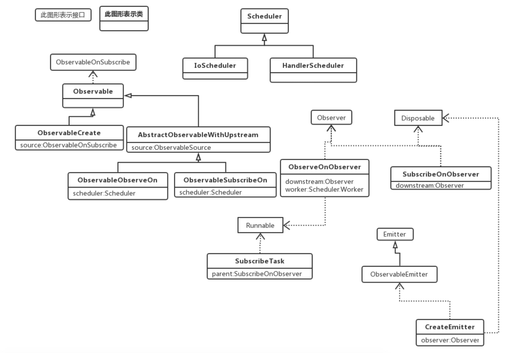

# 前言

RxJava2的操作符有许多，全部分析太花时间，也没有必要，这里只分析几个核心的操作符。

# 基本使用

```java
Observable
        .create(new ObservableOnSubscribe<String>() {
            @Override
            public void subscribe(ObservableEmitter<String> emitter) {
                Log.d(TAG, "subscribe: Thread=" + Thread.currentThread().getName());
                Log.d(TAG, "subscribe: a");
                emitter.onNext("a");
                Log.d(TAG, "subscribe: b");
                emitter.onNext("b");
            }
        })
        .subscribeOn(Schedulers.io())
        .observeOn(AndroidSchedulers.mainThread())
        .subscribe(new Observer<String>() {
            Disposable d;

            @Override
            public void onSubscribe(Disposable d) {
                this.d = d;
                Log.d(TAG, "onSubscribe: Thread=" + Thread.currentThread().getName());
            }

            @Override
            public void onNext(String s) {
                Log.d(TAG, "onNext: Thread=" + Thread.currentThread().getName());
                Log.d(TAG, "onNext: " + s);
            }

            @Override
            public void onError(Throwable e) {
                Log.d(TAG, "onError: Thread=" + Thread.currentThread().getName());
            }

            @Override
            public void onComplete() {
                Log.d(TAG, "onComplete: Thread=" + Thread.currentThread().getName());
            }
        });
```

Log:

```
onSubscribe: Thread=main
subscribe: Thread=RxCachedThreadScheduler-1
subscribe: a
subscribe: b
onNext: Thread=main
onNext: a
onNext: Thread=main
onNext: b
```

# create

```java
public static <T> Observable<T> create(ObservableOnSubscribe<T> source) {
    ObjectHelper.requireNonNull(source, "source is null");
    return RxJavaPlugins.onAssembly(new ObservableCreate<T>(source));
}
```

使用

```java
create((ObservableOnSubscribe<String>) emitter -> {
    emitter.onNext("a");
    emitter.onNext("b");
    emitter.onNext("c");
    emitter.onNext("d");
    Log.d(TAG, "rxJava: " + Thread.currentThread().getName());
})
```

create方法需要传入一个被观察者。

然后新建了一个ObservableCreate对象，看一下ObservableCreate类。

## ObservableCreate

ObservableCreate的类结构

```java
public final class ObservableCreate<T> extends Observable<T>
```

ObservableCreate继承了Observable，而Observable实现了ObservableSource接口，也就是在create方法中传入的参数类型。

```java
public abstract class Observable<T> implements ObservableSource<T> 
```

ObservableCreate主要是封装了传入的ObservableSource对象。

再来看看create中RxJavaPlugins.onAssembly方法

```java
public static <T> Observable<T> onAssembly(@NonNull Observable<T> source) {
  	//这里没有设置onObservableAssembly，一般为null。
    Function<? super Observable, ? extends Observable> f = onObservableAssembly;
    if (f != null) {
        return apply(f, source);
    }
  	//直接返回刚刚创建的ObservableCreate对象。
    return source;
}
```

create方法比较简单，就是将传入的ObservableSource对象进行封装，准备下一步的操作。

# 线程调度

## 被观察者的线程调度

```java
public final Observable<T> subscribeOn(Scheduler scheduler) {
    ObjectHelper.requireNonNull(scheduler, "scheduler is null");
    return RxJavaPlugins.onAssembly(new ObservableSubscribeOn<T>(this, scheduler));
}
```

subscribeOn是Observable中的方法，这里的this是上面create返回的Observable，具体实现是ObservableCreate。这里将Scheduler和create返回的Observable封装进ObservableSubscribeOn。

看一下ObservableSubscribeOn类。

```java
public final class ObservableSubscribeOn<T> extends AbstractObservableWithUpstream<T, T> {
    final Scheduler scheduler;

    public ObservableSubscribeOn(ObservableSource<T> source, Scheduler scheduler) {
        super(source);
        this.scheduler = scheduler;
    }
    
    //。。。
}
```

ObservableSubscribeOn继承了AbstractObservableWithUpstream：

```java
abstract class AbstractObservableWithUpstream<T, U> extends Observable<U> implements HasUpstreamObservableSource<T> {
    protected final ObservableSource<T> source;
}
```

AbstractObservableWithUpstream继承了Observable，并且内部持有create返回的ObservableSource的引用。

## 观察者的线程调度

AndroidSchedulers.mainThread()

```java
public static Scheduler mainThread() {
    return RxAndroidPlugins.onMainThreadScheduler(MAIN_THREAD);
}
```

```java
private static final Scheduler MAIN_THREAD = RxAndroidPlugins.initMainThreadScheduler(
        new Callable<Scheduler>() {
            @Override public Scheduler call() throws Exception {
                return MainHolder.DEFAULT;
            }
        });
```

```java
private static final class MainHolder {
    static final Scheduler DEFAULT
        = new HandlerScheduler(new Handler(Looper.getMainLooper()), false);
}
```

这里传入的Scheduler的具体类型是HandlerScheduler。

再来看看observeOn方法

```java
public final Observable<T> observeOn(Scheduler scheduler) {
    return observeOn(scheduler, false, bufferSize());
}

public final Observable<T> observeOn(Scheduler scheduler, boolean delayError, int bufferSize) {
    ObjectHelper.requireNonNull(scheduler, "scheduler is null");
    ObjectHelper.verifyPositive(bufferSize, "bufferSize");
    return RxJavaPlugins.onAssembly(new ObservableObserveOn<T>(this, scheduler, delayError, bufferSize));
}
```

逻辑和subscribeOn一样，就是将刚刚返回的Observable和传入的Scheduler进行封装。

# subscribe

```java
public final void subscribe(Observer<? super T> observer) {
    //....
    try {
        observer = RxJavaPlugins.onSubscribe(this, observer);

        //...

        subscribeActual(observer);
    } //...
}
```

RxJavaPlugins.onSubscribe方法

```java
public static <T> Observer<? super T> onSubscribe(@NonNull Observable<T> source, @NonNull Observer<? super T> observer) {
    BiFunction<? super Observable, ? super Observer, ? extends Observer> f = onObservableSubscribe;
    if (f != null) {
        return apply(f, source, observer);
    }
    return observer;
}
```

由于没有设置onObservableSubscribe，这里直接返回observer。

## ObservableObserveOn.subscribeActual

subscribeActual是Observable中的抽象方法，具体实现就是最近操作返回的Observable对象，也就是observeOn返回的Observable，具体实现是ObservableObserveOn类。

ObservableObserveOn类的subscribeActual方法。

```java
protected void subscribeActual(Observer<? super T> observer) {
    if (scheduler instanceof TrampolineScheduler) {
        source.subscribe(observer);
    } else {
        Scheduler.Worker w = scheduler.createWorker();
				
        source.subscribe(new ObserveOnObserver<T>(observer, w, delayError, bufferSize));
    }
}
```

observeOn传入的是HandlerScheduler，所以看else块。

HandlerScheduler的createWorker方法

```java
public Worker createWorker() {
    return new HandlerWorker(handler, async);
}
```

创建完Worker后，将observer和刚刚创建的Worker封装，然后调用source的subscribe方法。

这里的source是ObservableObserveOn的父类AbstractObservableWithUpstream中的source，其具体实现是observeOn上一个操作（也就是subscribeOn）返回的ObservableSubscribeOn。ObservableSubscribeOn和其父类AbstractObservableWithUpstream并没有重写subscribe方法，所以最终调用的是Observable中的subscribe方法。

## Observable.subscribe

```java
public final void subscribe(Observer<? super T> observer) {
    //...
    try {
        observer = RxJavaPlugins.onSubscribe(this, observer);
				//....

        subscribeActual(observer);
    }//...
}
```

绕了一大圈，又调用了一次subscribe，但这里的subscribeActual方法的调用者是ObservableSubscribeOn了

## ObservableSubscribeOn.subscribeActual

```java
public void subscribeActual(final Observer<? super T> observer) {
  	//封装，其实现了Observer和Disposable接口
    final SubscribeOnObserver<T> parent = new SubscribeOnObserver<T>(observer);

  	//调用onSubscribe方法。
    observer.onSubscribe(parent);

  	//最后将刚刚创建的SubscribeOnObserver对象封装进SubscribeTask
    parent.setDisposable(scheduler.scheduleDirect(new SubscribeTask(parent)));
}
```

### SubscribeTask

```java
final class SubscribeTask implements Runnable {
    private final SubscribeOnObserver<T> parent;

    SubscribeTask(SubscribeOnObserver<T> parent) {
        this.parent = parent;
    }
		
    @Override
    public void run() {
        source.subscribe(parent);
    }
}
```

当SubscribeTask在线程池中运行的时候，会调用其run方法，在run方法中，会执行subscribe，这个source是create返回的对象。

再看一下scheduler.scheduleDirect方法。

## Scheduler.scheduleDirect

这里的Scheduler实际类型是IoScheduler。

```java
public Disposable scheduleDirect(@NonNull Runnable run) {
    return scheduleDirect(run, 0L, TimeUnit.NANOSECONDS);
}
```

```java
public Disposable scheduleDirect(@NonNull Runnable run, long delay, @NonNull TimeUnit unit) {
  	//返回EventLoopWorker
    final Worker w = createWorker();

  	//将之前的SubscribeTask进行封装
    final Runnable decoratedRun = RxJavaPlugins.onSchedule(run);
    DisposeTask task = new DisposeTask(decoratedRun, w);
		
  	//调用EventLoopWorker的schedule方法
    w.schedule(task, delay, unit);

    return task;
}
```

### IoScheduler.createWorker

```java
public Worker createWorker() {
    return new EventLoopWorker(pool.get());
}
```

### EventLoopWorker.schedule

```java
public Disposable schedule(@NonNull Runnable action, long delayTime, @NonNull TimeUnit unit) {
    if (tasks.isDisposed()) {
        return EmptyDisposable.INSTANCE;
    }

    return threadWorker.scheduleActual(action, delayTime, unit, tasks);
}
```

threadWorker.scheduleActual

```java
public ScheduledRunnable scheduleActual(final Runnable run, long delayTime, @NonNull TimeUnit unit, @Nullable DisposableContainer parent) {
    Runnable decoratedRun = RxJavaPlugins.onSchedule(run);

    ScheduledRunnable sr = new ScheduledRunnable(decoratedRun, parent);
		//....
    Future<?> f;
    try {
      	//检测延迟
        if (delayTime <= 0) {
            f = executor.submit((Callable<Object>)sr);
        } else {
            f = executor.schedule((Callable<Object>)sr, delayTime, unit);
        }
        sr.setFuture(f);
    } //....
    return sr;
}
```

可以看到这里任务被放入线程池（executor，具体是ScheduledExecutorService）中进行执行。这样SubscribeTask的run方法被调用了，再来看看SubscribeTask的run方法：

```java
public void run() {
    source.subscribe(parent);
}
```

source是create返回的ObservableCreate对象。ObservableCreate没有重写subscribe方法，所以执行的是Observable中的subscribe方法。再来看看Observable的subscribe方法：

```java
public final void subscribe(Observer<? super T> observer) {
    //...
    try {
        observer = RxJavaPlugins.onSubscribe(this, observer);
				//....
        subscribeActual(observer);
    }//...
}
```

这里的subscribeActual具体实现是ObservableCreate：

```java
protected void subscribeActual(Observer<? super T> observer) {
    CreateEmitter<T> parent = new CreateEmitter<T>(observer);
  	//这里的observer就是用户创建的observer。见基本使用的log，第一行注释就被打印了。
    observer.onSubscribe(parent);
    try {
      	//这里调用用户创建的ObservableOnSubscribe的subscribe方法，基本使用的log的2、3、4行注释被打印了。
        source.subscribe(parent);
    } //...
}
```

用户创建的ObservableOnSubscribe：

```java
new ObservableOnSubscribe<String>() {
    @Override
    public void subscribe(ObservableEmitter<String> emitter) {
        Log.d(TAG, "subscribe: Thread=" + Thread.currentThread().getName());
        Log.d(TAG, "subscribe: a");
        emitter.onNext("a");
        Log.d(TAG, "subscribe: b");
        emitter.onNext("b");
    }
}
```

会调用ObservableEmitter的onNext方法来发布消息，看一下ObservableEmitter的onNext，具体实现是CreateEmitter：

```java
public void onNext(T t) {
    if (t == null) {
        onError(new NullPointerException("onNext called with null. Null values are generally not allowed in 2.x operators and sources."));
        return;
    }
    if (!isDisposed()) {
      	//ObserveOnObserver类型的observer
        observer.onNext(t);
    }
}
```

如果没有调用disposed方法，那么会执行ObserveOnObserver的onNext方法：

```java
public void onNext(T t) {
    if (done) {
        return;
    }

    if (sourceMode != QueueDisposable.ASYNC) {
        queue.offer(t);
    }
    schedule();
}
```

```java
void schedule() {
    if (getAndIncrement() == 0) {
      	//worker是HandlerWorker类型
        worker.schedule(this);
    }
}
```

```java
public Disposable schedule(Runnable run, long delay, TimeUnit unit) {
    if (run == null) throw new NullPointerException("run == null");
    if (unit == null) throw new NullPointerException("unit == null");

    if (disposed) {
        return Disposables.disposed();
    }

    run = RxJavaPlugins.onSchedule(run);

    ScheduledRunnable scheduled = new ScheduledRunnable(handler, run);

    Message message = Message.obtain(handler, scheduled);
    message.obj = this; // Used as token for batch disposal of this worker's runnables.

    if (async) {
        message.setAsynchronous(true);
    }

    handler.sendMessageDelayed(message, unit.toMillis(delay));

    // Re-check disposed state for removing in case we were racing a call to dispose().
    if (disposed) {
        handler.removeCallbacks(scheduled);
        return Disposables.disposed();
    }

    return scheduled;
}
```

这里最终还是交给Handler来完成。在Android中切换回主线程是Handler，这里也是这么使用的。这里基本使用的log的最后几行关于onNext的log也就被打印了。

# 类关系图



# 总结

以上分析的很乱，以后会进行整理，这里进行简单的总结。

RxJava2总体上是使用了观察者模式，从方法名和类名就能看出来。

数据传递是从上往下的，这里用了[装饰模式](https://mezzsy.github.io/2019/07/15/%E8%AE%BE%E8%AE%A1%E6%A8%A1%E5%BC%8F/%E8%A3%85%E9%A5%B0%E6%A8%A1%E5%BC%8F/)，所以在分析源码的时候能不断地看到包装的逻辑。

> 以被观察者为例
> 这里ObservableOnSubscribe是抽象组件。
> 用户传入的匿名内部类是具体组件，也就是被装饰的真正对象。
> Observable是抽象装饰者，不过其内部没有持有真正对象的引用，真正对象的引用放在了子类中。
> ObservableCreate、ObservableObserveOn、ObservableSubscribeOn是具体的装饰者，真正对象的引用放在了这些类中。

订阅是从下往上的，当调用subscribe方法后会不断向上通知包装的真正的对象的subscribe（也就是用户创建的被观察者对象）方法。

发布消息是从上往下的，当执行了emitter.onNext方法，层层调用包装的onNext方法，最后执行用户创建的观察者对象的onNext方法。

工作线程是通过线程池来实现。线程切换是通过Handler来实现。将逻辑封装成Runnable对象来执行。