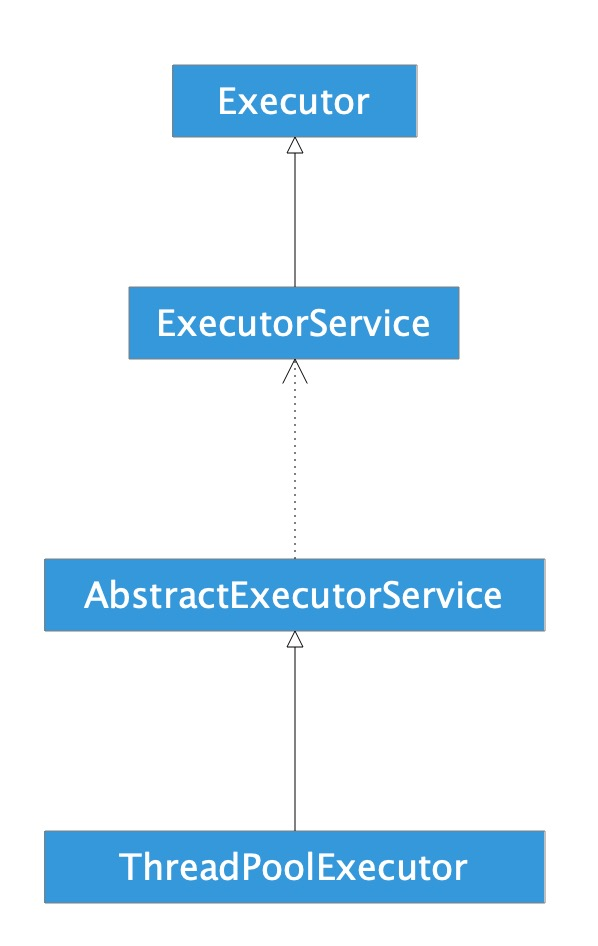

# 引言

之前对线程池的认识只限于网上的简单总结，现在对线程池稍微作系统的了解，以及分析部分线程池的实现原理。整体的细节日后有时间再完善。

# 线程池简单使用

- shutDown()，关闭线程池，需要执行完已提交的任务；
- shutDownNow()，关闭线程池，并尝试结束已提交的任务；
- allowCoreThreadTimeOut(boolen)，允许核心线程闲置超时回收；
- execute()，提交任务无返回值；
- submit()，提交任务有返回值；

## 示例

```java
public class Main {

    public static void main(String[] args) {
        ExecutorService service = Executors.newCachedThreadPool();
        for (int i = 0; i < 5; i++) {
            service.execute(new MyRunnable());
        }

        List<Future<Long>> futures = new ArrayList<>();
        for (int i = 0; i < 5; i++) {
            futures.add(service.submit(new MyCallable()));
        }
        for (int i = 0; i < 5; i++) {
            try {
                System.out.println(futures.get(i).get());
            } catch (ExecutionException | InterruptedException e) {
                e.printStackTrace();
            }
        }

        service.shutdown();
    }

    private static class MyRunnable implements Runnable {

        @Override
        public void run() {
            System.out.println("Runnable:" +
                    Thread.currentThread().getName() +
                    "##" + System.currentTimeMillis());
        }
    }

    private static class MyCallable implements Callable<Long> {

        @Override
        public Long call() {
            System.out.println("Callable:" +
                    Thread.currentThread().getName() +
                    "##" + System.currentTimeMillis());
            return System.currentTimeMillis();
        }
    }

}
```

log

```
Runnable:pool-1-thread-1##1567044193328
Runnable:pool-1-thread-5##1567044193328
Runnable:pool-1-thread-4##1567044193328
Runnable:pool-1-thread-2##1567044193328
Runnable:pool-1-thread-3##1567044193328
Callable:pool-1-thread-5##1567044193329
Callable:pool-1-thread-4##1567044193329
Callable:pool-1-thread-1##1567044193329
Callable:pool-1-thread-2##1567044193329
Callable:pool-1-thread-3##1567044193329
1567044193329
1567044193329
1567044193329
1567044193329
1567044193329
```

# 线程池相关类介绍

## Executor

```java
public interface Executor {
    void execute(Runnable command);
}
```

Executor是一个接口内部只有一个execute方法，用来运行Runnable对象。

在此接口的文档中提到，这个接口的作用是**负责运行Runnable任务**，并不保证异步执行。

此接口虽然是线程池框架中的一员，但是本身与线程没有关联。

## Runnable

```java
public interface Runnable {
    void run();
}
```

描述任务，没有返回值。

## ExecutorService

```java
public interface ExecutorService extends Executor {
    void shutdown();
    List<Runnable> shutdownNow();
		boolean isShutdown();
    boolean isTerminated();
    boolean awaitTermination(long timeout, TimeUnit unit) throws InterruptedException;
    <T> Future<T> submit(Callable<T> task);
    <T> Future<T> submit(Runnable task, T result);
    Future<?> submit(Runnable task);
    <T> List<Future<T>> invokeAll(Collection<? extends Callable<T>> tasks) throws InterruptedException;
    <T> List<Future<T>> invokeAll(Collection<? extends Callable<T>> tasks, long timeout, TimeUnit unit) throws InterruptedException;
    <T> T invokeAny(Collection<? extends Callable<T>> tasks) throws InterruptedException, ExecutionException;
    <T> T invokeAny(Collection<? extends Callable<T>> tasks, long timeout, TimeUnit unit) throws InterruptedException, ExecutionException, TimeoutException;
}

```

ExecutorService是描述线程池内部机制的一个接口。提供了开启和关闭线程池的方法，以及能够运行带有返回值的任务

## Callable

```java
public interface Callable<V> {
    V call() throws Exception;
}
```

与Runnable相似，带有返回值。

## Future

```java
public interface Future<V> {
    boolean cancel(boolean mayInterruptIfRunning);
    boolean isCancelled();
    boolean isDone();
    V get() throws InterruptedException, ExecutionException;
    V get(long timeout, TimeUnit unit) throws InterruptedException, ExecutionException, TimeoutException;
}
```

Future描述的是一个任务运行结果的情况，如任务是否被取消、任务完成后的返回值。

## ThreadFactory

```java
public interface ThreadFactory {
    Thread newThread(Runnable r);
}
```

ThreadFactory线程工厂，创建线程的。

## ThreadPoolExecutor

以上都是对线程池的抽象描述，ThreadPoolExecutor才是线程池的真正实现。ThreadPoolExecutor见分析。

## Executors

Executors内部提供了默认的线程工厂，以及一些具体的线程池

**FixedThreadPool：**

- 线程数量固定（需用户指定），当线程处于空闲状态也不会被回收，除非线程池被关闭。
- 只有核心线程，并且没有超时机制，另外任务队列没有大小限制。

**CachedThreadPool：**

- 线程数量不定，只有非核心线程，最大的线程数为Integer.MAX_VALUE
- 空闲线程具有超时机制，超过60秒就会被回收。
- 适合大量耗时少的任务。

**ScheduledThreadPool：**

- 核心线程数量固定，非核心线程没有限制，非核心线程闲置时会被立即回收。
- 主要用于执行定时任务和具有固定周期的重复任务。

**SingleThreadExecutor：**

- 只有一个核心线程，确保所有的任务都在同一个线程按顺序执行
- 意义在于统一所有的外界任务到一个线程，使得不需要处理同步问题。

# 类关系图



# 分析

## 构造方法

```java
public ThreadPoolExecutor(int corePoolSize,
                          int maximumPoolSize,
                          long keepAliveTime,
                          TimeUnit unit,
                          BlockingQueue<Runnable> workQueue) {
    this(corePoolSize, maximumPoolSize, keepAliveTime, unit, workQueue, Executors.defaultThreadFactory(), defaultHandler);
}

public ThreadPoolExecutor(int corePoolSize,
                          int maximumPoolSize,
                          long keepAliveTime,
                          TimeUnit unit,
                          BlockingQueue<Runnable> workQueue,
                          ThreadFactory threadFactory) {
    this(corePoolSize, maximumPoolSize, keepAliveTime, unit, workQueue, threadFactory, defaultHandler);
}

public ThreadPoolExecutor(int corePoolSize,
                          int maximumPoolSize,
                          long keepAliveTime,
                          TimeUnit unit,
                          BlockingQueue<Runnable> workQueue,
                          RejectedExecutionHandler handler) {
    this(corePoolSize, maximumPoolSize, keepAliveTime, unit, workQueue, Executors.defaultThreadFactory(), handler);
}

public ThreadPoolExecutor(int corePoolSize,
                          int maximumPoolSize,
                          long keepAliveTime,
                          TimeUnit unit,
                          BlockingQueue<Runnable> workQueue,
                          ThreadFactory threadFactory,
                          RejectedExecutionHandler handler) {
    if (corePoolSize < 0 ||
        maximumPoolSize <= 0 ||
        maximumPoolSize < corePoolSize ||
        keepAliveTime < 0)
        throw new IllegalArgumentException();
    if (workQueue == null || threadFactory == null || handler == null) 
      throw new NullPointerException();
  
    this.corePoolSize = corePoolSize;
    this.maximumPoolSize = maximumPoolSize;
    this.workQueue = workQueue;
    this.keepAliveTime = unit.toNanos(keepAliveTime);
    this.threadFactory = threadFactory;
    this.handler = handler;
}
```

## 参数解释

- int corePoolSize：该线程池中核心线程数最大值
  核心线程：线程池新建线程的时候，如果当前线程总数小于corePoolSize，则新建的是核心线程，如果超过corePoolSize，则新建的是非核心线程。核心线程默认情况下会一直存活在线程池中，即使这个核心线程啥也不干(闲置状态)。
  如果指定ThreadPoolExecutor的allowCoreThreadTimeOut这个属性为true，那么核心线程如果不干活(闲置状态)的话，超过一定时间(时长下面参数决定)，就会被销毁掉。
- int maximumPoolSize：该线程池中线程总数最大值
  线程总数 = 核心线程数 + 非核心线程数。
- long keepAliveTime：该线程池中非核心线程闲置超时时长
  一个非核心线程，如果不干活(闲置状态)的时长超过这个参数所设定的时长，就会被销毁掉，如果设置allowCoreThreadTimeOut = true，则会作用于核心线程。
- BlockingQueue workQueue：该线程池中的任务队列，维护着等待执行的Runnable对象
  当所有的核心线程都在干活时，新添加的任务会被添加到这个队列中等待处理，如果队列满了，则新建非核心线程执行任务。
  常用的workQueue类型：
  - SynchronousQueue
  这个队列接收到任务的时候，会直接提交给线程处理，而不保留它，如果所有线程都在工作怎么办？那就新建一个线程来处理这个任务！所以为了保证不出现“线程数达到了maximumPoolSize而不能新建线程”的错误，使用这个类型队列的时候，maximumPoolSize一般指定成Integer.MAX_VALUE，即无限大。
  - LinkedBlockingQueue
  这个队列接收到任务的时候，如果当前线程数小于核心线程数，则新建线程(核心线程)处理任务；如果当前线程数等于核心线程数，则进入队列等待。由于这个队列没有最大值限制，即所有超过核心线程数的任务都将被添加到队列中，这也就导致了maximumPoolSize的设定失效，因为总线程数永远不会超过corePoolSize
  - ArrayBlockingQueue
  可以限定队列的长度，接收到任务的时候，如果没有达到corePoolSize的值，则新建线程(核心线程)执行任务，如果达到了，则入队等候，如果队列已满，则新建线程(非核心线程)执行任务，又如果总线程数到了maximumPoolSize，并且队列也满了，则发生错误
  - DelayQueue
  队列内元素必须实现Delayed接口，这就意味着你传进去的任务必须先实现Delayed接口。这个队列接收到任务时，首先先入队，只有达到了指定的延时时间，才会执行任务
- ThreadFactory threadFactory
  创建线程的方式，这是一个接口，你new他的时候需要实现他的Thread newThread(Runnable r)方法。
- RejectedExecutionHandler handler
  当提交任务数超过maxmumPoolSize+workQueue之和时，任务会交给RejectedExecutionHandler来处理；jdk1.5提供了四种饱和策略 ：
  - AbortPolicy 
    默认。直接抛异常。
  - CallerRunsPolicy 
    只用调用者所在的线程执行任务，重试添加当前的任务，它会自动重复调用execute()方法
  - DiscardOldestPolicy 
    丢弃任务队列中最久的任务。
  - DiscardPolicy 
    丢弃当前任务。
    
## 提交任务

可以向ThreadPoolExecutor提交两种任务：Callable和Runnable。

- Callable 
  该类任务有返回结果，可以抛出异常。 
  通过submit函数提交，返回Future对象。 
  可通过get获取执行结果。
- Runnable 
  该类任务只执行，无法获取返回结果，并在执行过程中无法抛异常。 
  通过execute提交。
  
## 关闭线程池

关闭线程池有两种方式：shutdown和shutdownNow，关闭时，会遍历所有的线程，调用它们的interrupt函数中断线程。但这两种方式对于正在执行的线程处理方式不同。

- shutdown() 
  仅停止阻塞队列中等待的线程，那些正在执行的线程就会让他们执行结束。
- shutdownNow() 
  不仅会停止阻塞队列中的线程，而且会停止正在执行的线程。

## 设置合理的线程池大小

任务一般可分为：CPU密集型、IO密集型、混合型，对于不同类型的任务需要分配不同大小的线程池。

- CPU密集型任务 
  尽量使用较小的线程池，一般为CPU核心数+1。 
  因为CPU密集型任务使得CPU使用率很高，若开过多的线程数，只能增加上下文切换的次数，因此会带来额外的开销。
- IO密集型任务 
  可以使用稍大的线程池，一般为2*CPU核心数。 
  IO密集型任务CPU使用率并不高，因此可以让CPU在等待IO的时候去处理别的任务，充分利用CPU时间。
- 混合型任务 
  可以将任务分成IO密集型和CPU密集型任务，然后分别用不同的线程池去处理。 
  只要分完之后两个任务的执行时间相差不大，那么就会比串行执行来的高效。 
  因为如果划分之后两个任务执行时间相差甚远，那么先执行完的任务就要等后执行完的任务，最终的时间仍然取决于后执行完的任务，而且还要加上任务拆分与合并的开销，得不偿失。

# 参考

1. Java线程池-ThreadPoolExecutor原理分析与实战，[Zach_ZSZ](https://blog.csdn.net/z_s_z2016)，https://blog.csdn.net/z_s_z2016/article/details/81674893。