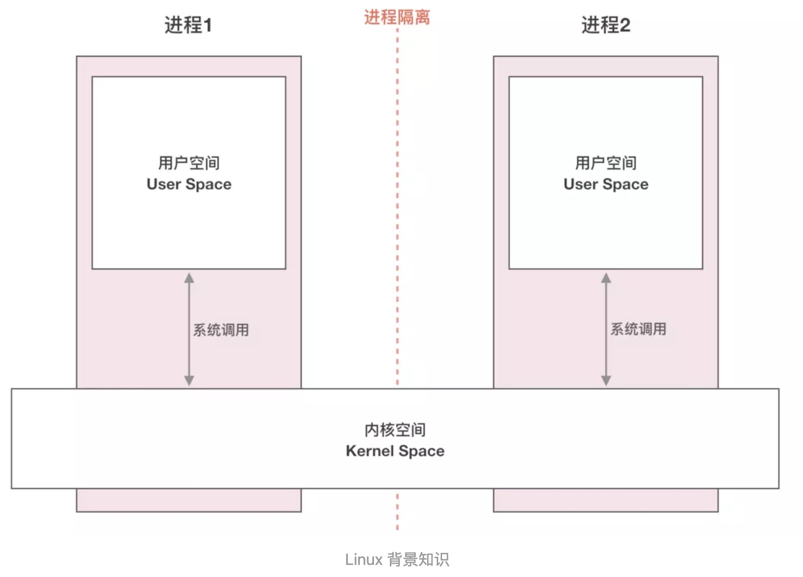
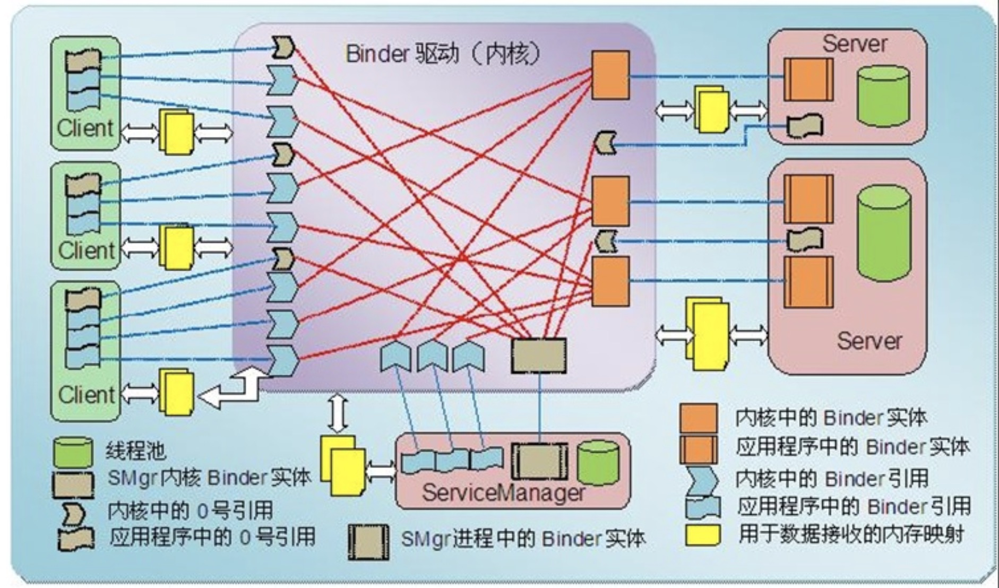
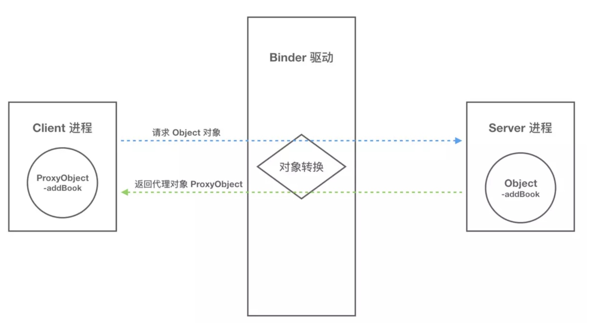
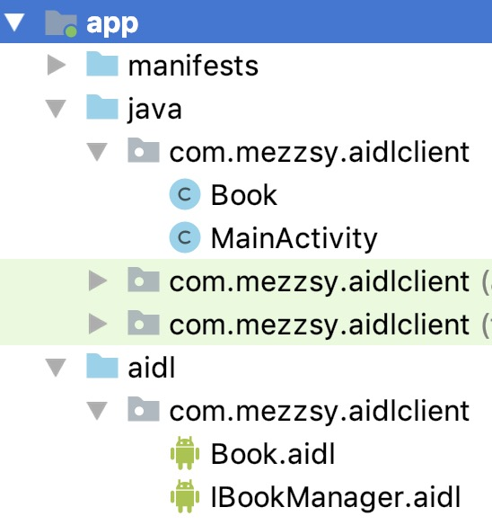
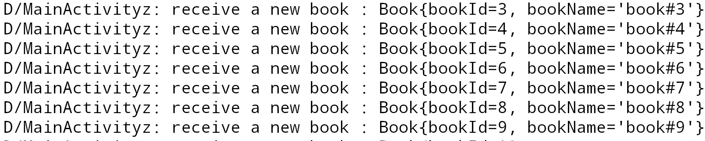
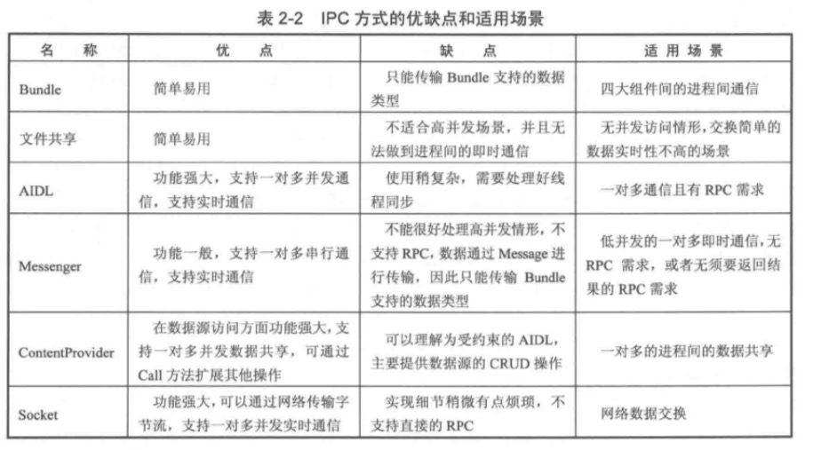

# 简介

IPC，Inter-Process Communication，含义为进程间通信，是指两个进程之间进行数据交换的过程。

Android的内核是Linux，但是它的IPC方式并不能完全继承Linux，它有自己的IPC方式，最有特色的就是Binder，也可以用Socket。

# Linux进程基本概念



上图展示了 Liunx 中跨进程通信涉及到的一些基本概念：

- 进程隔离
- 进程空间划分：用户空间(User Space)/内核空间(Kernel Space)
- 系统调用：用户态/内核态

## 进程隔离

简单的说就是操作系统中，进程与进程间内存是不共享的。两个进程就像两个平行的世界，A 进程没法直接访问 B 进程的数据，这就是进程隔离的通俗解释。A 进程和 B 进程之间要进行数据交互就得采用特殊的通信机制：进程间通信（IPC）。

## 用户空间和内核空间

现在操作系统都是采用的虚拟存储器，对于 32 位系统而言，它的寻址空间（虚拟存储空间）就是 2 的 32 次方，也就是 4GB。操作系统的核心是内核，独立于普通的应用程序，可以访问受保护的内存空间，也可以访问底层硬件设备的权限。为了保护用户进程不能直接操作内核，保证内核的安全，操作系统从逻辑上将虚拟空间划分为用户空间（User Space）和内核空间（Kernel Space）。针对 Linux 操作系统而言，将最高的 1GB 字节供内核使用，称为内核空间；较低的 3GB 字节供各进程使用，称为用户空间。

> 简单的说就是，内核空间（Kernel）是系统内核运行的空间，用户空间（User Space）是用户程序运行的空间。为了保证安全性，它们之间是隔离的。

## 系统调用：用户态与内核态

虽然从逻辑上进行了用户空间和内核空间的划分，但不可避免的用户空间需要访问内核资源，比如文件操作、访问网络等等。为了突破隔离限制，就需要借助**系统调用**来实现。系统调用是用户空间访问内核空间的唯一方式，保证了所有的资源访问都是在内核的控制下进行的，避免了用户程序对系统资源的越权访问，提升了系统安全性和稳定性。

Linux 使用两级保护机制：0 级供系统内核使用，3 级供用户程序使用。

当一个任务（进程）执行系统调用而陷入内核代码中执行时，称进程处于**内核运行态（内核态）**。此时处理器处于特权级最高的（0级）内核代码中执行。当进程处于内核态时，执行的内核代码会使用当前进程的内核栈。每个进程都有自己的内核栈。

当进程在执行用户自己的代码的时候，我们称其处于**用户运行态（用户态）**。此时处理器在特权级最低的（3级）用户代码中运行。

系统调用主要通过如下两个函数来实现：

```
copy_from_user() //将数据从用户空间拷贝到内核空间
copy_to_user() //将数据从内核空间拷贝到用户空间
```

# Android中的多进程模式

## 开启多进程

```xml
<activity android:name=".demo06.D06Activity" />
<activity
    android:name=".demo06.FirstActivity"
    android:process=":remote" />
<activity
    android:name=".demo06.SecondActivity"
    android:process="com.mezzsy.remote" />
```

分别为FirstActivity 和SecondActivity指定了process 属性，并且它们的属性值不同，这意味着当前应用又增加了两个新进程。当前应用的包名为"com.mezzsy.myapplication"，当FirstActivity 启动时，系统会为它创建一个单独的进程，进程名为"com.mezzsy.myapplication:remote"，当SecondActivity启动时，系统也会为它创建一个单独的进程，进程名为“com.mezzsy.remote"。同时D06Activity没有为它指定process属性，那么它运行在默认进程中，默认进程的进程名是包名。运行一下看看效果：

输入`adb shell ps | grep "com.mezzsy"`查看相关的进程


FirstActivity 和SecondActivity的`android:process`属性分别为 ":remote" 和 "com.mezzsy.remote" 。这两种方式的区别：

1. ":" 的含义是指要在当前的进程名前面附加上当前的包名，这是一种简写的方法，对于FirstActivity 来说，它完整的进程名为 com.mezzsy.myapplication:remote ，通过图中的进程信息也能看出来。
   对于SecondActivity中的声明方式，它是一种完整的命名方式，不会附加包名信息。
2. 其次，进程名以“:”开头的进程属于当前应用的私有进程，其他应用的组件不可以和它跑在同一个进程中，而进程名不以“:”开头的进程属于全局进程，其他应用通过ShareUID方式可以和它跑在同一个进程中。
   Android系统会为每个应用分配一个唯一的UID，具有相同UID的应用才能共享数据。两个应用通过ShareUID跑在同一个进程中是有要求的，需要这两个应用有相同的ShareUID并且签名相同才可以。在这种情况下，它们可以互相访问对方的私有数据，比如data目录、组件信息等，不管它们是否跑在同一个进程中。当然如果它们跑在同一个进程中，那么除了能共享data目录、组件信息，还可以共享内存数据，或者说它们看起来就像是一个应用的两个部分。

## 多进程会出现的问题

1. 静态成员和单例模式完全失效
2. 线程同步进制完全失效。
3. SharePreferences的可靠性降低
4. Application会被多次创建

分析问题原因：

1. Android会为每个应用或者进程分配一个独立的虚拟机，不同的虚拟机在内存分配上有不同的分配空间，导致同一个类的对象会有多个副本。
2. 和第一个类似，因为不同进程锁的不是同一个对象。
3. SharePreferences不支持两个进程同时执行写操作，否则会一定几率导致数据丢失，因为SharePreferences底层是通过XML文件来实现的，系统对它的读写有一定的缓存策略，即在内存中会有一份SharePreferences文件的缓存，并发写可能会出现问题
4. 系统创建新的进程会分配独立的虚拟机，相当于启动一个应用。或者这么说，运行在同一个进程的组件是属于同一个虚拟机和同一个Application的。

可以这么理解：一个应用的多进程，相当于两个不同的应用采用了ShareUID的模式。

# IPC基础概念

主要包含三个方面：Serializable，Parcelable，Binder。

## 序列化

对象的序列化是把`Java`对象转化为字节序列并存储至一个存储媒介（硬盘或者内存）的过程，反序列化则是把字节序列恢复为`Java`对象的过程，但它们仅处理`Java`变量而不处理方法。

### Serializable接口

```java
//序列化
User user = new User();
ObjectOutputStream out = new ObjectOutputStream(new FileOutputStream("cache.txt"));
out.close();
//反序列化
ObjectInputStream in = new ObjectInputStream(new FileInputStream("cache.txt"));
User newUser = (User) in.readObject();
in.close();
```

Serializable是java的一个序列化接口，是一个空接口，为对象提供标准的序列化和反序列化。

serialVersionUID在序列化和反序列化中启到作用。

静态成员属于类不属于对象，不会参与序列化，加了transient的不会参与序列化。

### Parcelable的使用

序列化功能由write ToParcel方法来完成，最终是通过Parcel中的一系列 write方法来完成的；

反序列化功能由CREATOR来完成，其内部标明了如何创建序列化对象和数组，并通过Parcel的一系列 read 方法来完成反序列化过程；

内容描述功能由describeContents方法来完成，几乎在所有情况下这个方法都应该返回0，仅当当前对象中存在文件描述符时，此方法返回1。

需要注意的是，在User(Parcel in)方法中，由于book是另一个可序列化对象，所以它的反序列化过程需要传递当前线程的上下文类加载器，否则会报无法找到类的错误。

```java
class User implements Parcelable {
    private Book book;
    private String name;

    private User(Parcel in) {
        book = in.readParcelable(Book.class.getClassLoader());//AndroidStudio自动创建。
//艺术探索中的描写			book = in.readParcelable(Thread.currentThread().getContextClassLoader());

        name = in.readString();
    }

    public static final Creator<User> CREATOR = new Creator<User>() {
        @Override
        public User createFromParcel(Parcel in) {
            return new User(in);
        }

        @Override
        public User[] newArray(int size) {
            return new User[size];
        }
    };

    @Override
    public int describeContents() {
        return 0;
    }

    @Override
    public void writeToParcel(Parcel dest, int flags) {
        dest.writeString(name);
        dest.writeParcelable(book, 0);
    }
}
```

其中相关方法介绍：

| 方法                                 | 功能                                                         | 标记位                         |
| ------------------------------------ | ------------------------------------------------------------ | ------------------------------ |
| createFromParcel(Parcel in)          | 从序列化后的对象中创建原始对象                               |                                |
| newArray(int size)                   | 创建指定长度的原始对象数组                                   |                                |
| User(Parcel in)                      | 从序列化后的对象中创建原始对象                               |                                |
| writeToParcel(Parcel out, int flags) | 将当前对象写入序列化结构中，其中flags标识有两种值：0或者1。为1时标识当前对象需要作为返回值返回，不能立即释放资源，几乎所有情况都为0 | PARCELABLE_ WRITE RETURN VALUE |
| describeContents                     | 返回当前对象的内容描述。如果含有文件描述符，返回1，否则返回0，几乎所有情况都返回0 | CONTENTS FILE_ DESCRIPTOR      |

# Binder笔记

## Binder设计原因

目前linux支持的IPC包括传统的管道，System V IPC，即消息队列/共享内存/信号量，以及socket，其中只有socket支持Client-Server的通信方式。

另一方面是传输性能。socket作为一款通用接口，其传输效率低，开销大，主要用在跨网络的进程间通信和本机上进程间的低速通信。消息队列和管道采用存储-转发方式，即数据先从发送方缓存区拷贝到内核开辟的缓存区中，然后再从内核缓存区拷贝到接收方缓存区，至少有两次拷贝过程。共享内存虽然无需拷贝，但控制复杂，难以使用。

各种IPC方式数据拷贝次数表

| **IPC**              | **数据拷贝次数** |
| -------------------- | ---------------- |
| 共享内存             | 0                |
| Binder               | 1                |
| Socket/管道/消息队列 | 2                |

还有一点是出于安全性考虑。Android作为一个开放式，拥有众多开发者的的平台，应用程序的来源广泛，确保智能终端的安全是非常重要的。终端用户不希望从网上下载的程序在不知情的情况下偷窥隐私数据，连接无线网络，长期操作底层设备导致电池很快耗尽等等。传统IPC没有任何安全措施，完全依赖上层协议来确保。首先传统IPC的接收方无法获得对方进程可靠的UID/PID（用户ID/进程ID），从而无法鉴别对方身份。Android为每个安装好的应用程序分配了自己的UID，故进程的UID是鉴别进程身份的重要标志。使用传统IPC只能由用户在数据包里填入UID/PID，但这样不可靠，容易被恶意程序利用。可靠的身份标记只有由IPC机制本身在内核中添加。其次传统IPC访问接入点是开放的，无法建立私有通道。比如命名管道的名称，system V的键值，socket的ip地址或文件名都是开放的，只要知道这些接入点的程序都可以和对端建立连接，不管怎样都无法阻止恶意程序通过猜测接收方地址获得连接。

基于以上原因，Android需要建立一套新的IPC机制来满足系统对通信方式，传输性能和安全性的要求，这就是Binder。Binder基于Client-Server通信模式，传输过程只需一次拷贝，为发送发添加UID/PID身份，既支持实名Binder也支持匿名Binder，安全性高。

## Binder的设计思想

Binder使用Client-Server通信方式：一个进程作为Server提供诸如视频/音频解码，视频捕获，地址本查询，网络连接等服务；多个进程作为Client向Server发起服务请求，获得所需要的服务。

要想实现Client-Server通信据必须实现以下两点：一是server必须有确定的访问接入点或者说地址来接受Client的请求，并且Client可以通过某种途径获知Server的地址；二是制定Command-Reply协议来传输数据。
例如在网络通信中Server的访问接入点就是Server主机的IP地址+端口号，传输协议为TCP协议。对Binder而言，Binder可以看成Server提供的实现某个特定服务的访问接入点， Client通过这个‘地址’向Server发送请求来使用该服务；对Client而言，Binder可以看成是通向Server的管道入口，要想和某个Server通信首先必须建立这个管道并获得管道入口。

与其它IPC不同，Binder**使用了面向对象的思想**来描述作为访问接入点的Binder及其在Client中的入口：Binder是一个实体位于Server中的对象，该对象提供了一套方法用以实现对服务的请求，就象类的成员函数。遍布于client中的入口可以看成指向这个binder对象的引用，一旦获得了这个引用就可以调用该对象的方法访问server。在Client看来，通过Binder引用调用其提供的方法和通过引用调用其它任何本地对象的方法并无区别，尽管前者的实体位于远端Server中，而后者实体位于本地内存中。

面向对象思想的引入将进程间通信转化为通过对某个Binder对象的引用调用该对象的方法，而其独特之处在于Binder对象是一个可以跨进程引用的对象，它的实体位于一个进程中，而它的引用却遍布于系统的各个进程之中。最诱人的是，这个引用和java里引用一样既可以是强类型，也可以是弱类型，而且可以从一个进程传给其它进程，让大家都能访问同一Server，就象将一个对象或引用赋值给另一个引用一样。**Binder模糊了进程边界，淡化了进程间通信过程，整个系统仿佛运行于同一个面向对象的程序之中。形形色色的Binder对象以及星罗棋布的引用仿佛粘接各个应用程序的胶水，这也是Binder在英文里的原意。**

当然面向对象只是针对应用程序而言，对于Binder驱动和内核其它模块一样使用C语言实现，没有类和对象的概念。Binder驱动为面向对象的进程间通信提供底层支持。

## Binder 通信模型

Binder框架定义了四个角色：Server，Client，ServiceManager（以后简称SMgr）以及Binder驱动。其中Server，Client，SMgr运行于用户空间，驱动运行于内核空间。这四个角色的关系和互联网类似：Server是服务器，Client是客户终端，SMgr是域名服务器（DNS），驱动是路由器。

### Binder 驱动

和路由器一样，Binder驱动虽然默默无闻，却是通信的核心。尽管名叫‘驱动’，实际上和硬件设备没有任何关系，只是实现方式和设备驱动程序是一样的：它工作于内核态，提供标准文件操作。

**驱动负责进程之间Binder通信的建立，Binder在进程之间的传递，Binder引用计数管理，数据包在进程之间的传递和交互等一系列底层支持。**

### ServiceManager 与实名Binder

和DNS类似，SMgr的作用是将字符形式的Binder名字转化成Client中对该Binder的引用，使得Client能够通过Binder名字获得对Server中Binder实体的引用。

注册了名字的Binder叫实名Binder，就象每个网站除了有IP地址外还有自己的网址。Server创建了Binder实体，为其取一个字符形式，可读易记的名字，将这个Binder连同名字以数据包的形式通过Binder驱动发送给SMgr，通知SMgr注册一个名叫张三的Binder，它位于某个Server中。

驱动为这个穿过进程边界的Binder创建位于内核中的实体节点以及SMgr对实体的引用，将名字及新建的引用打包传递给SMgr。SMgr收数据包后，从中取出名字和引用填入一张查找表中。

细心的读者可能会发现其中的蹊跷：SMgr是一个进程，Server是另一个进程，Server向SMgr注册Binder必然会涉及进程间通信。当前实现的是进程间通信却又要用到进程间通信，这就好象蛋可以孵出鸡前提却是要找只鸡来孵蛋。Binder的实现比较巧妙：预先创造一只鸡来孵蛋：SMgr和其它进程同样采用Binder通信，SMgr是Server端，有自己的Binder对象（实体），其它进程都是Client，需要通过这个Binder的引用来实现Binder的注册，查询和获取。SMgr提供的Binder比较特殊，它没有名字也不需要注册，当一个进程使用BINDER_SET_CONTEXT_MGR命令将自己注册成SMgr时Binder驱动会自动为它创建Binder实体（这就是那只预先造好的鸡）。其次这个Binder的引用在所有Client中都固定为0而无须通过其它手段获得。也就是说，一个Server若要向SMgr注册自己Binder就必需通过0这个引用号和SMgr的Binder通信。类比网络通信，0号引用就好比域名服务器的地址，你必须预先手工或动态配置好。要注意这里说的Client是相对SMgr而言的，一个应用程序可能是个提供服务的Server，但对SMgr来说它仍然是个Client。

### Client 获得实名Binder的引用

Server向SMgr注册了Binder实体及其名字后，Client就可以通过名字获得该Binder的引用了。Client也利用保留的0号引用向SMgr请求访问某个Binder：我申请获得名字叫张三的Binder的引用。SMgr收到这个连接请求，从请求数据包里获得Binder的名字，在查找表里找到该名字对应的条目，从条目中取出Binder的引用，将该引用作为回复发送给发起请求的Client。从面向对象的角度，这个Binder对象现在有了两个引用：一个位于SMgr中，一个位于发起请求的Client中。如果接下来有更多的Client请求该Binder，系统中就会有更多的引用指向该Binder，就象java里一个对象存在多个引用一样。而且类似的这些指向Binder的引用是强类型，从而确保只要有引用Binder实体就不会被释放掉。通过以上过程可以看出，SMgr象个火车票代售点，收集了所有火车的车票，可以通过它购买到乘坐各趟火车的票-得到某个Binder的引用。

### 匿名 Binder

并不是所有Binder都需要注册给SMgr广而告之的。Server端可以通过已经建立的Binder连接将创建的Binder实体传给Client，当然这条已经建立的Binder连接必须是通过实名Binder实现。由于这个Binder没有向SMgr注册名字，所以是个匿名Binder。Client将会收到这个匿名Binder的引用，通过这个引用向位于Server中的实体发送请求。匿名Binder为通信双方建立一条私密通道，只要Server没有把匿名Binder发给别的进程，别的进程就无法通过穷举或猜测等任何方式获得该Binder的引用，向该Binder发送请求。



### Linux补充概念

那么在 Android 系统中用户进程之间是如何通过这个内核模块（Binder 驱动）来实现通信的呢？难道是和前面说的传统 IPC 机制一样，先将数据从发送方进程拷贝到内核缓存区，然后再将数据从内核缓存区拷贝到接收方进程，通过两次拷贝来实现吗？显然不是。

这里用到了Linux 下的另一个概念：**内存映射**。

Binder IPC 机制中涉及到的内存映射通过 mmap() 来实现，mmap() 是操作系统中一种内存映射的方法。内存映射简单的讲就是将用户空间的一块内存区域映射到内核空间。映射关系建立后，用户对这块内存区域的修改可以直接反应到内核空间；反之内核空间对这段区域的修改也能直接反应到用户空间。

内存映射能减少数据拷贝次数，实现用户空间和内核空间的高效互动。两个空间各自的修改能直接反映在映射的内存区域，从而被对方空间及时感知。也正因为如此，内存映射能够提供对进程间通信的支持。

## Binder源码分析

```java
@Override
public void onServiceConnected(ComponentName name, IBinder service) {
		mBookManager = IBookManager.Stub.asInterface(service);
		try {
				mBookManager.getBookList();
		} catch (RemoteException e) {
				e.printStackTrace();
		}
}
```

```java
//所有可以在Binder中传输的接口都需要继承IInterface，同时自己是一个接口。
public interface IBookManager extends android.os.IInterface {
    //首先声明了两个方法，这两个方法是在之前的IBookManager.aidl文件中声明的。
    public java.util.List<com.mezzsy.androidlearn.Book> getBookList() throws android.os.RemoteException;

    public void addBook(com.mezzsy.androidlearn.Book book) throws android.os.RemoteException;

    //声明了一个内部类Stub，这个Stub是一个Binder类，当客户端和服务端都位于同一个进程时，方法调用不会走跨进程的transact过程，而当两者位于不同进程时，方法调用需要走transact过程，这个逻辑由Stub的内部代理类Proxy来完成，所以这个接口的核心就在Stub和Proxy。
    public static abstract class Stub extends android.os.Binder implements com.mezzsy.androidlearn.IBookManager {
        //声明两个整型的id分别用于标识这两个方法，这两个id用于标识在transact过程中客户端所请求的到底是哪个方法。
        static final int TRANSACTION_getBookList = (android.os.IBinder.FIRST_CALL_TRANSACTION + 0);
        
        static final int TRANSACTION_addBook = (android.os.IBinder.FIRST_CALL_TRANSACTION + 1);
        
        //Binder的唯一标识，一般用于当前Binder的类名表示。
        private static final java.lang.String DESCRIPTOR = "com.mezzsy.androidlearn.IBookManager";

        public Stub() {
            this.attachInterface(this， DESCRIPTOR);
        }

        //用于将服务端的Binder对象转换成客户端所需的AIDL接口类型的对象，这种转换是区分进程的，如果客户端和服务端位于同一进程，那么此方法返回的就是服务端的Stub对象本身，否则返回的就是系统封装后的Stub.Proxy。
        public static com.mezzsy.androidlearn.IBookManager asInterface(android.os.IBinder obj) {
            if ((obj == null)) {
                return null;
            }
            android.os.IInterface iin = obj.queryLocalInterface(DESCRIPTOR);
            if (((iin != null) && (iin instanceof com.mezzsy.androidlearn.IBookManager))) {
                return ((com.mezzsy.androidlearn.IBookManager) iin);
            }
            return new com.mezzsy.androidlearn.IBookManager.Stub.Proxy(obj);//返回代理对象
        }

        //返回当前的Binder
        @Override
        public android.os.IBinder asBinder() {
            return this;
        }

        //这个方法运行在服务端中的Binder线程池，当客户端发起跨线程请求时，远程请求会通过系统底层封装后交给此方法来处理。
        @Override
        public boolean onTransact(int code， android.os.Parcel data， android.os.Parcel reply， int flags) throws android.os.RemoteException {
            switch (code) {
                case INTERFACE_TRANSACTION: {
                    reply.writeString(DESCRIPTOR);
                    return true;
                }
                case TRANSACTION_getBookList: {
                    data.enforceInterface(DESCRIPTOR);
                    java.util.List<com.mezzsy.androidlearn.Book> _result = this.getBookList();
                    reply.writeNoException();
                    reply.writeTypedList(_result);
                    return true;
                }
                case TRANSACTION_addBook: {
                    data.enforceInterface(DESCRIPTOR);
                    com.mezzsy.androidlearn.Book _arg0;
                    if ((0 != data.readInt())) {
                        _arg0 = com.mezzsy.androidlearn.Book.CREATOR.createFromParcel(data);
                    } else {
                        _arg0 = null;
                    }
                    this.addBook(_arg0);
                    reply.writeNoException();
                    return true;
                }
            }
            return super.onTransact(code， data， reply， flags);
        }

        private static class Proxy implements com.mezzsy.androidlearn.IBookManager {
            private android.os.IBinder mRemote;

            Proxy(android.os.IBinder remote) {
                mRemote = remote;
            }

            @Override
            public android.os.IBinder asBinder() {
                return mRemote;
            }

            public java.lang.String getInterfaceDescriptor() {
                return DESCRIPTOR;
            }

            //这个方法运行在客户端
            @Override
            public java.util.List<com.mezzsy.androidlearn.Book> getBookList() throws android.os.RemoteException {
                android.os.Parcel _data = android.os.Parcel.obtain();
                android.os.Parcel _reply = android.os.Parcel.obtain();
                java.util.List<com.mezzsy.androidlearn.Book> _result;
                try {
                    _data.writeInterfaceToken(DESCRIPTOR);
                    mRemote.transact(Stub.TRANSACTION_getBookList， _data， _reply， 0);
                    _reply.readException();
                    _result = _reply.createTypedArrayList(com.mezzsy.androidlearn.Book.CREATOR);
                } finally {
                    _reply.recycle();
                    _data.recycle();
                }
                return _result;
            }

            //这个方法运行在客户端
            @Override
            public void addBook(com.mezzsy.androidlearn.Book book) throws android.os.RemoteException {
                android.os.Parcel _data = android.os.Parcel.obtain();
                android.os.Parcel _reply = android.os.Parcel.obtain();
                try {
                    _data.writeInterfaceToken(DESCRIPTOR);
                    if ((book != null)) {
                        _data.writeInt(1);
                        book.writeToParcel(_data， 0);
                    } else {
                        _data.writeInt(0);
                    }
                    mRemote.transact(Stub.TRANSACTION_addBook， _data， _reply， 0);
                    _reply.readException();
                } finally {
                    _reply.recycle();
                    _data.recycle();
                }
            }
        }
    }
}
```

### 总结

用户创建AIDL接口文件，系统会根据这个文件创建对应的接口。这个接口的核心实现是其内部类Stub和Stub的内部代理类。

服务端会传递一个Binder对象（如果在同一个进程，两个对象的地址相同；否则不同，由上面的通信模型可知，这是一个Binder实体的引用），`mBookManager = IBookManager.Stub.asInterface(service);`，传入asInterface方法获取对象，如果客户端和服务端位于同一进程，那么此方法返回的就是服务端的Stub对象，否则返回的就是系统封装后的代理对象。

以下对于同一进程的情况省略。

当客户端调用方法时，代理对象会将请求交给服务端运行。服务端通过方法标识可以确定客户端所请求的目标方法是什么，接着从data中取出目标方法所需的参数（如果目标方法有参数的话），然后执行目标方法。当目标方法执行完毕后，就向reply中写入返回值（如果目标方法有返回值的话）。此过程在服务端的onTransact方法（运行在Binder线程池）中进行转发。如果此方法返回false，那么客户端的请求会失败，因此可以利用这个特性来做权限验证。

代理对象要做的事情就是，封装客户端请求的参数交给服务端，然后获取回复，根据这个回复返回结果。

## Binder 通信中的代理模式

A 进程想要 B 进程中某个对象（object）是如何实现的呢？毕竟它们分属不同的进程，A 进程 没法直接使用 B 进程中的 object。

前面我们介绍过跨进程通信的过程都有 Binder 驱动的参与，因此在数据流经 Binder 驱动的时候驱动会对数据做一层转换。当 A 进程想要获取 B 进程中的 object 时，驱动并不会真的把 object 返回给 A，而是返回了一个跟 object 看起来一模一样的代理对象 objectProxy，这个 objectProxy 具有和 object 一摸一样的方法，但是这些方法并没有 B 进程中 object 对象那些方法的能力，这些方法只需要把把请求参数交给驱动即可。对于 A 进程来说和直接调用 object 中的方法是一样的。

当 Binder 驱动接收到 A 进程的消息后，发现这是个 objectProxy 就去查询自己维护的表单，一查发现这是 B 进程 object 的代理对象。于是就会去通知 B 进程调用 object 的方法，并要求 B 进程把返回结果发给自己。当驱动拿到 B 进程的返回结果后就会转发给 A 进程，一次通信就完成了。



# IPC方式

- Bundle
- 文件共享
- Messenger
- AIDL
- ContentProvider
- Socket

# Messenger

**服务端的代码**

```java
public class MessengerService extends Service {
    private static final String TAG = "MessengerService";

    private final Messenger mMessenger = new Messenger(new MessengerHandler());

    public MessengerService() {
    }

    @Override
    public IBinder onBind(Intent intent) {
        return mMessenger.getBinder();
    }

    private static class MessengerHandler extends Handler {
        @Override
        public void handleMessage(Message msg) {
            if (msg.what == 0) {
                Log.d(TAG, "handleMessage: " + msg.getData().getString("msg"));
            }
        }
    }
}
```

MessengerService运行在aidlserver应用中。

**客户端的代码**

```java
public class MessengerActivity extends AppCompatActivity {
    private static final String TAG = "MessengerTest";

    //发送消息
    private Messenger mMessenger;
    private ServiceConnection mConnection = new ServiceConnection() {
        @Override
        public void onServiceConnected(ComponentName name, IBinder service) {
            //发送消息给服务端
            mMessenger = new Messenger(service);
            Message message = Message.obtain(null, 0);
            Bundle bundle = new Bundle();
            bundle.putString("msg", "这是客户端");
            message.setData(bundle);

            message.replyTo = mReplyMessenger;//设置回复的Messenger，否则客户端接受不到回复

            try {
                mMessenger.send(message);
            } catch (RemoteException e) {
                e.printStackTrace();
            }
        }

        @Override
        public void onServiceDisconnected(ComponentName name) {

        }
    };

    //接受回复
    private Messenger mReplyMessenger = new Messenger(new MessengerHandler());

    @Override
    protected void onCreate(Bundle savedInstanceState) {
        super.onCreate(savedInstanceState);
        setContentView(R.layout.activity_messenger);

        Intent intent = new Intent();
        intent.setClassName("com.mezzsy.aidlserver"
                , "com.mezzsy.aidlserver.MessengerService");
        bindService(intent, mConnection, Context.BIND_AUTO_CREATE);
    }

    @Override
    protected void onDestroy() {
        super.onDestroy();
        unbindService(mConnection);
    }

    private static class MessengerHandler extends Handler {
        @Override
        public void handleMessage(Message msg) {
            if (msg.what == 1) {
                //打印接受到的回复
                Log.d(TAG, "handleMessage: " + msg.getData().getString("reply"));
            }
        }
    }

}
```

log显示：

```
handleMessage: 这是客户端
handleMessage: 收到！
```

# AIDL

## AIDL 基本用法

为了进行明显的区分，这里创建了两个应用，AIDLServer和AIDLClient。

### AIDLServer

先创建Bean类：

```java
package com.mezzsy.aidlserver;

import android.os.Parcel;
import android.os.Parcelable;

/**
 * @author mezzsy
 * @date 2019-08-06
 */
public class Book implements Parcelable {
    public int bookId;
    public String bookName;

    protected Book(Parcel in) {
        bookId = in.readInt();
        bookName = in.readString();
    }

    public static final Creator<Book> CREATOR = new Creator<Book>() {
        @Override
        public Book createFromParcel(Parcel in) {
            return new Book(in);
        }

        @Override
        public Book[] newArray(int size) {
            return new Book[size];
        }
    };

    @Override
    public int describeContents() {
        return 0;
    }

    @Override
    public void writeToParcel(Parcel dest, int flags) {
        dest.writeInt(bookId);
        dest.writeString(bookName);
    }
}
```

AIDLServer中创建AIDL文件：


创建一个IBookManager.aidl文件：

```java
// IBookManager.aidl
package com.mezzsy.aidlserver;

import com.mezzsy.aidlserver.Book;

interface IBookManager {
    List<Book> getBookList();
    void addBook(in Book book);
}
```

在AIDL 文件中，只支持以下类型：

- 基本数据类型(int、 long、 char、 boolean、 double等)
- String 和CharSequence
- List：只支持ArrayList，里面每个元素都必须能够被AIDL支持
- Map：只支持HashMap，里面的每个元素都必须被AIDL支持，包括key和value
- Parcelable：所有实现了Parcelable接口的对象
- AIDL：所有的AIDL接口本身也可以在AIDL文件中使用

其中自定义的Parcelable对象和AIDL对象必须要显式import 进来，不管它们是否和当前的AIDL文件位于同一个包内。比如IBookManager.aidl这个文件，里面用到了Book这个类，这个类实现了Parcelable 接口并且和IBookManageraidl位于同一个包中，但是遵守AIDL的规范，仍然需要显式地import进来。

另外一个需要注意的地方是，如果AIDL文件中用到了自定义的Parcelable对象，那么必须新建一个和它同名的AIDL文件，并在其中声明它为Parcelable 类型。在上面的IBookManager.aidl中，用到了Book这个类，所以必须要创建Book.aidl，然后在里面添加如下内容：

```java
// Book.aidl
package com.mezzsy.aidlserver;

parcelable Book;
```

> 小问题：android studio AIDL 编译时 错误：找不到符号。
>
> 不能把java文件和AIDL文件放在同一个包下，应该这样：
>
> 

上面讲述了如何定义AIDL接口，接下来需要实现这个接口了。先创建一个Service，称为BookManagerService，代码如下:

```java
package com.mezzsy.aidlserver;

import android.app.Service;
import android.content.Intent;
import android.os.Binder;
import android.os.IBinder;
import android.os.RemoteException;

import java.util.List;
import java.util.concurrent.CopyOnWriteArrayList;

public class BookManagerService extends Service {
    private static final String TAG = "BookManagerService";

    private CopyOnWriteArrayList<Book> mBookList = new CopyOnWriteArrayList<>();

    private Binder mBinder = new IBookManager.Stub() {
        @Override
        public List<Book> getBookList() throws RemoteException {
            return mBookList;
        }

        @Override
        public void addBook(Book book) throws RemoteException {
            mBookList.add(book);
        }
    };

    public BookManagerService() {
    }

    @Override
    public void onCreate() {
        super.onCreate();
        mBookList.add(new Book(1, "Android"));
        mBookList.add(new Book(2, "IOS"));
    }

    @Override
    public IBinder onBind(Intent intent) {
        return mBinder;
    }
}
```

上面是一个服务端Service的典型实现，首先在onCreate中初始化添加了两本图书的信息，然后创建了一个Binder对象并在onBind中返回它，这个对象继承自IBookManager.Stub
并实现了它内部的AIDL方法。

这里主要看getBookList和addBook这两个AIDL方法的实现，实现过程也比较简单，注意
这里采用了CopyOnWriteArrayList，这个CopyOnWriteArayList支持并发读/写。AIDL方法是在服务端的Binder线程池中执行的，因此当多个客户端同时连接的时候，会存在多个线程同时访问的情形，所以要在AIDL方法中处理线程同步。

### AIDLClient

客户端的实现就比较简单了，首先要绑定远程服务，绑定成功后将服务端返回的Binder对象转换成AIDL接口，然后就可以通过这个接口去调用服务端的远程方法了。需要注意，再客户端中的AIDL文件的包名需要和服务端中的一致。

```java
package com.mezzsy.aidlclient;

import android.content.ComponentName;
import android.content.Context;
import android.content.Intent;
import android.content.ServiceConnection;
import android.content.pm.PackageManager;
import android.content.pm.ResolveInfo;
import android.os.Bundle;
import android.os.IBinder;
import android.os.RemoteException;
import android.support.v7.app.AppCompatActivity;
import android.util.Log;

import com.mezzsy.aidlserver.Book;
import com.mezzsy.aidlserver.IBookManager;

import java.util.List;

public class MainActivity extends AppCompatActivity {
    private static final String TAG = "MainActivityz";

    private ServiceConnection mConnection = new ServiceConnection() {
        @Override
        public void onServiceConnected(ComponentName name, IBinder service) {
            IBookManager bookManager = IBookManager.Stub.asInterface(service);

            try {
                List<Book> books = bookManager.getBookList();
                Log.d(TAG, "list type:" + books.getClass());
                Log.d(TAG, books.toString());
            } catch (RemoteException e) {
                e.printStackTrace();
            }
        }

        @Override
        public void onServiceDisconnected(ComponentName name) {
        }
    };

    @Override
    protected void onCreate(Bundle savedInstanceState) {
        super.onCreate(savedInstanceState);
        setContentView(R.layout.activity_main);

        Intent intent = new Intent();
        intent.setAction("com.mezzsy.aidlserver.demo");
        bindService(createExplicitFromImplicitIntent(this, intent)
                , mConnection, Context.BIND_AUTO_CREATE);
    }

    /**
     * Android5.0中service的intent一定要显性声明，如果一定要隐式启动，需要用此方法
     * @param context
     * @param implicitIntent
     * @return
     */
    private Intent createExplicitFromImplicitIntent(Context context, Intent implicitIntent) {
        // Retrieve all services that can match the given intent
        PackageManager pm = context.getPackageManager();
        List<ResolveInfo> resolveInfo = pm.queryIntentServices(implicitIntent, 0);

        // Make sure only one match was found
        if (resolveInfo == null || resolveInfo.size() != 1) {
            return null;
        }

        // Get component info and create ComponentName
        ResolveInfo serviceInfo = resolveInfo.get(0);
        String packageName = serviceInfo.serviceInfo.packageName;
        String className = serviceInfo.serviceInfo.name;
        ComponentName component = new ComponentName(packageName, className);

        // Create a new intent. Use the old one for extras and such reuse
        Intent explicitIntent = new Intent(implicitIntent);

        // Set the component to be explicit
        explicitIntent.setComponent(component);

        return explicitIntent;
    }

    @Override
    protected void onDestroy() {
        super.onDestroy();
        unbindService(mConnection);
    }
}
```

先运行Server，再运行Client，打印日志如下：

```
2019-08-06 19:21:34.833 16599-16599/com.mezzsy.aidlclient D/MainActivityz: list type:class java.util.ArrayList
2019-08-06 19:21:34.833 16599-16599/com.mezzsy.aidlclient D/MainActivityz: [com.mezzsy.aidlserver.Book@a33899e, com.mezzsy.aidlserver.Book@a13ec7f]
```

接着再调用一下另外一个接口addBook，在客户端给服务端添加一本书，然
后再获取一次，看程序是否能够正常工作。还是上面的代码，客户端在服务连接后，在
onServiceConnected中做如下改动：

```java
private ServiceConnection mConnection = new ServiceConnection() {
    @Override
    public void onServiceConnected(ComponentName name, IBinder service) {
        IBookManager bookManager = IBookManager.Stub.asInterface(service);

        try {
            List<Book> books = bookManager.getBookList();
            Log.d(TAG, books.toString());
            Book book = new Book(3, "zzsy");
            bookManager.addBook(book);
            Log.d(TAG, books.toString());
        } catch (RemoteException e) {
            e.printStackTrace();
        }
    }

    @Override
    public void onServiceDisconnected(ComponentName name) {
    }
};
```

log：

```
2019-08-06 19:32:53.168 17390-17390/com.mezzsy.aidlclient D/MainActivityz: [Book{bookId=1, bookName='Android'}, Book{bookId=2, bookName='IOS'}]
2019-08-06 19:32:53.169 17390-17390/com.mezzsy.aidlclient D/MainActivityz: [Book{bookId=1, bookName='Android'}, Book{bookId=2, bookName='IOS'}, Book{bookId=3, bookName='zzsy'}]
```

### 服务端通知客户端

现在考虑一种情况，假设有一种需求：用户不想时不时地去查询图书列表了，太累了，于是，他去问图书馆，“当有新书时能不能把书的信息告诉我呢？”。这就是一种典型的观察者模式，每个感兴趣的用户都观察新书，当新书到的时候，图书馆就通知每一个对这本书感兴趣的用户，这种模式在实际开发中用得很多。

首先，需要提供一个AIDL接口，每个用户都需要实现这个接口并且向图书馆申请新书的提醒功能，当然用户也可以随时取消这种提醒。之所以选择AIDL接口而不是普通接口，是因为AIDL中无法使用普通接口。

创建一个IOnNewBookArrivedListener.aidl文件，所期望的情况是：当服务端有新书到来时，就会通知每一个已经申请提醒功能的用户。从程序上来说就是调用所有IOnNewBookArrivedListener对象中的onNewBookArrived方法，并把新书的对象通过参数传递给客户端，内容如下所示。

```java
// IOnNewBookArrivedListener.aidl
package com.mezzsy.aidlserver;

import com.mezzsy.aidlserver.Book;

interface IOnNewBookArrivedListener {
    void onNewBookArrived(in Book book);
}
```

修改一下Service：

```java
package com.mezzsy.aidlserver;

import android.app.Service;
import android.content.Intent;
import android.os.Binder;
import android.os.IBinder;
import android.os.RemoteException;
import android.util.Log;

import java.util.List;
import java.util.concurrent.CopyOnWriteArrayList;
import java.util.concurrent.atomic.AtomicBoolean;

public class BookManagerService extends Service {
    private static final String TAG = "BookManagerService";

    private AtomicBoolean isServiceDestoryed = new AtomicBoolean(false);

    private CopyOnWriteArrayList<Book> mBookList = new CopyOnWriteArrayList<>();
    private CopyOnWriteArrayList<IOnNewBookArrivedListener> mListeners
            = new CopyOnWriteArrayList<>();

    private Binder mBinder = new IBookManager.Stub() {
        @Override
        public List<Book> getBookList() throws RemoteException {
            return mBookList;
        }

        @Override
        public void addBook(Book book) throws RemoteException {
            mBookList.add(book);
        }

        @Override
        public void registerListener(IOnNewBookArrivedListener listener) throws RemoteException {
            if (mListeners.contains(listener)) {
                Log.d(TAG, "The listener has existed");
            } else {
                mListeners.add(listener);
                Log.d(TAG, "register listener");
            }
        }

        @Override
        public void unregisterListener(IOnNewBookArrivedListener listener) throws RemoteException {
            if (mListeners.contains(listener)) {
                mListeners.remove(listener);
                Log.d(TAG, "unregister listener");
            } else {
                Log.d(TAG, "listener not found");
            }
        }
    };

    @Override
    public void onCreate() {
        Log.d(TAG, "BookManagerService onCreate ");
        super.onCreate();
        mBookList.add(new Book(1, "Android"));
        mBookList.add(new Book(2, "IOS"));
        new Thread(new ServiceWorker()).start();
 		}

    @Override
    public IBinder onBind(Intent intent) {
        return mBinder;
    }

    @Override
    public void onDestroy() {
        super.onDestroy();
        isServiceDestoryed.set(true);
    }

    private class ServiceWorker implements Runnable {

        @Override
        public void run() {
            while (!isServiceDestoryed.get()) {
                try {
                    Thread.sleep(1000);
                    int id = mBookList.size() + 1;
                    String name = "book#" + id;
                    Book book = new Book(id, name);
                    newBookArrived(book);
                } catch (InterruptedException e) {
                    e.printStackTrace();
                }
            }
        }
    }

    private void newBookArrived(Book book) {
        mBookList.add(book);
        for (int i = 0; i < mListeners.size(); i++) {
            try {
                mListeners.get(i).onNewBookArrived(book);
            } catch (RemoteException e) {
                e.printStackTrace();
            }
        }
    }
}
```

客户端：

```java
package com.mezzsy.aidlclient;

import android.annotation.SuppressLint;
import android.content.ComponentName;
import android.content.Context;
import android.content.Intent;
import android.content.ServiceConnection;
import android.content.pm.PackageManager;
import android.content.pm.ResolveInfo;
import android.os.Bundle;
import android.os.Handler;
import android.os.IBinder;
import android.os.Message;
import android.os.RemoteException;
import android.support.v7.app.AppCompatActivity;
import android.util.Log;

import com.mezzsy.aidlserver.Book;
import com.mezzsy.aidlserver.IBookManager;
import com.mezzsy.aidlserver.IOnNewBookArrivedListener;

import java.util.List;

public class MainActivity extends AppCompatActivity {
    private static final String TAG = "MainActivityz";

    @SuppressLint("HandlerLeak")
    private Handler mHandler = new Handler() {
        @Override
        public void handleMessage(Message msg) {
            if (msg.what == 0) {
                Log.d(TAG, "receive a new book : " + msg.obj);
            }
        }
    };

    private IOnNewBookArrivedListener mListener = new IOnNewBookArrivedListener.Stub() {
        @Override
        public void onNewBookArrived(Book book) throws RemoteException {
            mHandler.obtainMessage(0, book).sendToTarget();
        }

    };

    private IBookManager mBookManager;
    private ServiceConnection mConnection = new ServiceConnection() {
        @Override
        public void onServiceConnected(ComponentName name, IBinder service) {
            mBookManager = IBookManager.Stub.asInterface(service);

            try {
                mBookManager.registerListener(mListener);
            } catch (RemoteException e) {
                e.printStackTrace();
            }
        }

        @Override
        public void onServiceDisconnected(ComponentName name) {
        }
    };

    @Override
    protected void onCreate(Bundle savedInstanceState) {
        super.onCreate(savedInstanceState);
        setContentView(R.layout.activity_main);

        Intent intent = new Intent();
        intent.setAction("com.mezzsy.aidlserver.demo");
        bindService(createExplicitFromImplicitIntent(this, intent)
                , mConnection, Context.BIND_AUTO_CREATE);
    }

    /**
     * Android5.0中service的intent一定要显性声明，如果一定要隐式启动，需要用此方法
     *
     * @param context
     * @param implicitIntent
     * @return
     */
    private Intent createExplicitFromImplicitIntent(Context context, Intent implicitIntent) {
        // Retrieve all services that can match the given intent
        PackageManager pm = context.getPackageManager();
        List<ResolveInfo> resolveInfo = pm.queryIntentServices(implicitIntent, 0);

        // Make sure only one match was found
        if (resolveInfo == null || resolveInfo.size() != 1) {
            return null;
        }

        // Get component info and create ComponentName
        ResolveInfo serviceInfo = resolveInfo.get(0);
        String packageName = serviceInfo.serviceInfo.packageName;
        String className = serviceInfo.serviceInfo.name;
        ComponentName component = new ComponentName(packageName, className);

        // Create a new intent. Use the old one for extras and such reuse
        Intent explicitIntent = new Intent(implicitIntent);

        // Set the component to be explicit
        explicitIntent.setComponent(component);

        return explicitIntent;
    }

    @Override
    protected void onDestroy() {
        super.onDestroy();
        unbindService(mConnection);
        if (mBookManager != null && mBookManager.asBinder().isBinderAlive()) {
            try {
                mBookManager.unregisterListener(mListener);
            } catch (RemoteException e) {
                e.printStackTrace();
            }
        }
    }
}
```

log显示：



服务端没有像预期的那样执行。在解注册的过程中，服务端无法找到之前注册的那个listener。其实，这种解注册的处理方式在日常开发过程中时常使用到，但是放到多进程中却无法奏效，因为Binder会把客户端传递过来的对象重新转化并生成一个新的对象。虽然在注册和解注册过程中使用的是同一个客户端对象，但是通过Binder传递到服务端后，却
会产生一个全新的对象。对象是不能跨进程直接传输的，对象的跨进程传输本质上是反序列化的过程，这就是为什么AIDL中的自定义对象都必须要实现Parcelable接口。

解决方法是使用RemoteCallbackLis。RemoteCallbackList是系统专门提供的用于删除跨进程listener 的接口。RemoteCallbackList是一个泛型，支持管理任意的AIDL接口，这点从它的声明就可以看出，因为所有的AIDL接口都继承自Interface接口。

它的工作原理很简单，在它的内部有一个Map结构专门用来保存所有的AIDL回调, 这个Map的key是IBinder类型，value 是Callback类型。

```java
ArrayMap<IBinder, Callback> mCallbacks = new ArrayMap<IBinder, Callback>();
```

其中Callback中封装了真正的远程listener。当客户端注册listener 的时候，它会把这
个listener的信息存入mCallbacks中，其中key和value分别通过下面的方式获得:

```java
IBinder key = listener.asBinder();
Callback value = new Callback(listener, cookie);
```

虽然说多次跨进程传输客户端的同一个对象会在服务端生成不同的对象，但是这些新生成的对象有一个共同点，那就是它们引用的Binder对象是同一个，利用这个特性，就可以实现上面我们无法实现的功能。当客户端解注册的时候，只要遍历服务端所有的listener，找出那个和解注册 listener 具有相同Binder对象的服务端 listener 并把它删掉即可，这就是RemoteCallbackList 做的事情。同时RemoteCallbackList还有一个很有用的功能，那就是当客户端进程终止后，它能够自动移除客户端所注册的listener。 另外 RemoteCallbackList 内部自动实现了线程同步的功能，所以使用它来注册和解注册时，不需要做额外的线程同步工作。做下修改：

```java
private RemoteCallbackList<IOnNewBookArrivedListener> mListeners
        = new RemoteCallbackList<>();
```

```java
@Override
public void registerListener(IOnNewBookArrivedListener listener) throws RemoteException {
    mListeners.register(listener);
}

@Override
public void unregisterListener(IOnNewBookArrivedListener listener) throws RemoteException {
    mListeners.unregister(listener);
}
```

```java
private void newBookArrived(Book book) {
    mBookList.add(book);
    int N = mListeners.beginBroadcast();
    for (int i = 0; i < N; i++) {
        try {
            IOnNewBookArrivedListener listener = mListeners.getBroadcastItem(i);
            if (listener != null) {
                listener.onNewBookArrived(book);
            }
        } catch (RemoteException e) {
            e.printStackTrace();
        }
    }
    mListeners.finishBroadcast();
}
```

log：


> 注意，beginBroadcast方法和finishBroadcast要配对使用。

## AIDL需要注意的地方

**一**

客户端调用远程服务的方法，被调用的方法运行在服务端的Binder线程池中，同时客户端线程会被挂起，这个时候如果服务端方法执行比较耗时，就会导致客户端线程长时间地阻塞在这里，而如果这个客户端线程是UI线程的话，就会导致客户端ANR。

因此，如果明确知道某个远程方法是耗时的，那么就要避免在客户端的UI线程中去访问远程方法。由于客户端的onServiceConnected 和onServiceDisconnected方法都运行在UI线程中，所以也不可以在它们里面直接调用服务端的耗时方法，这点要尤其注意。

另外，由于服务端的方法本身就运行在服务端的Binder线程池中，所以服务端方法本身就可以执行大量耗时操作，这个时候不要在服务端方法中开线程去进行异步任务。

**解决办法是在非UI线程中调用方法。**

同理，当远程服务端需要调用客户端的listener中的方法时，被调用的方法也运行在Binder线程池中，只不过是客户端的线程池。所以，同样不可以在服务端中调用客户端的耗时方法。比如针对BookManagerService的onNewBookArrived方法，如下所示。在它内部调用了客户端的IOnNewBookArrivedListener中的onNewBookArrived方法，如果客户端的这个onNewBookArrived方法比较耗时的话，那么请确保BookManagerService中的onNewBookArrived运行在非UI线程中，否则将导致服务端无法响应。

**二**

由于客户端的IOnNewBookArrivedListener中的onNewBookArrived方法运行在客户端的Binder线程池中，所以不能在它里面去访问UI相关的内容，如果要访问UI，请使用Handler切换到UI线程。

**三**

Binder 是可能意外死亡的，这往往是由于服务端进程意外停止了，这时需要重新连接服务。有两种方法，第一种方法是给Binder设置DeathRecipient 监听，当Binder 死亡时，会收到binderDied 方法的回调，在binderDied方法中可以重连远程服务。另一种方法是在onServiceDisconnected中重连远程服务。这两种方法可以随便选择一种来使用， 它们的区别在于: onServiceDisconnected 在客户端的UI线程中被回调，而binderDied在客户端的Binder线程池中被回调。也就是说，在binderDied方法中不能访问UI，**这就是它们的区别。**

## 在AIDL中使用权限验证

默认情况下，远程服务是任何人都可以连接，所以必须给服务加入权限验证功能，权限验证失败则无法调用服务中的方法。在AIDL中进行权限验证，这里介绍两种常用的方法：

1. 在onBind中进行验证，验证不通过就直接返回null，这样验证失败的客户端直接无法绑定服务，至于验证方式可以有多种，比如使用自定义permission 验证，然后在BookManagerService的onBind方法中做权限验证，如下所示：

   ```java
   public IBinder onBind(Intent intent) {
       int check = checkCallingOrSelfPermission("com.mezzsy.aidlserver.permission.ACCESS_BOOK_SERVICE");
       if (check == PackageManager.PERMISSION_DENIED)
           return null;
       return mBinder;
   }
   ```
   
2. 可以在服务端的onTransact 方法中进行权限验证，如果验证失败就直接返回false，这样服务端就不会终止执行AIDL中的方法从而达到保护服务端的效果。

3. 可以采用Uid和Pid来做验证，通过getCallingUid和getCallingPid可以拿到客户端所属应用的Uid和Pid，通过这两个参数可以做一些验证工作，比如验证包名。在下面的代码中，既验证了permission，又验证了包名。

   ```java
   public boolean onTransact(int code, Parcel data, Parcel reply, int flags) throws RemoteException {
       int check = checkCallingOrSelfPermission(PERMISSION);
       if (check == PackageManager.PERMISSION_DENIED)
           return false;
   
       String packageName = null;
       String[] packages = getPackageManager().getPackagesForUid(getCallingUid());
       if (packages != null && packages.length > 0) {
           packageName = packages[0];
       }
       Log.d(TAG, "onTransact: packageName = " + packageName);
       //TODO 包名判断
   
       return super.onTransact(code, data, reply, flags);
   }
   ```

   注意，onTransact是在Binder中的。

# IPC方式的优缺点和适用场景




# 参考

1. 《Android Bander设计与实现 - 设计篇》，[universus](https://blog.csdn.net/universus)，https://blog.csdn.net/universus/article/details/6211589#commentBox

2. 《Android艺术探索》，任玉刚
3. 《写给 Android 应用工程师的 Binder 原理剖析》，https://www.jianshu.com/p/429a1ff3560c