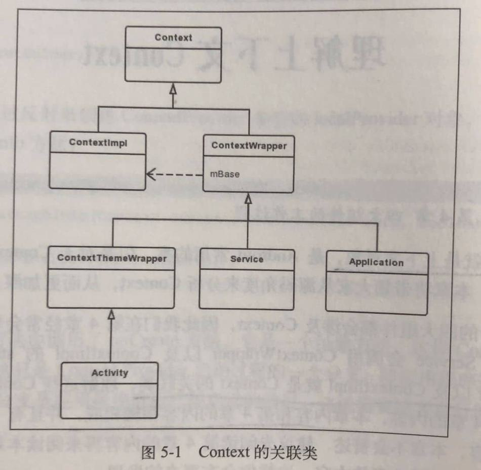

# 介绍

Context的使用场景大致分为2大类：

-   使用Context调用方法，比如启动Activity、访问资源、调用系统级服务等。
-   调用方法时传入Context，比如弹出Toast、创建Dialog等。

Activity，Service和Application都间接地继承自Context，因此一个应用程序进程的Context数量等于Activity和Service的总个数加1，1指的是Application的数量。

Context是一个抽象类，它的内部定义了很多方法以及静态常量，它的具体实现类为Contextlmpl。和Context相关联的类，除了ContextImpl ，还有ContextWrapper，ContextThemeWrapper和Activity等。



从Wrapper的名字就能看出，Context的关联类利用装饰模式，这样做有这么几个优点：

-   使用者能够更方便地使用Context。
-   如果Contextlmpl 发生了变化，它的装饰类ContextWrapper不需要做任何修改。
-   ContextImpl的实现不会暴露给使用者，使用者也不必关心ContextImpl的实现。
-   通过组合而非继承的方式，拓展ContextImpl的功能，在运行时选择不同的装饰类，实现不同的功能。

>   **个人总结**
>
>   Application、Activity、Service本身就是一个Context，但是它们具有Context的接口，但本身没有Context的能力，因为它们只是包装了Context实现者，Context的具体实现是ContextImpl。

# Application的Context

## 创建过程

这里涉及到[Activity启动过程](03 Activity启动过程.md)。

启动Activity有个重要的方法：performLaunchActivity。

```java
private Activity performLaunchActivity(ActivityClientRecord r, Intent customIntent) {
	//。。。
    try {
        Application app = r.packageInfo.makeApplication(false, mInstrumentation);
    }
    //。。。
}
```

**LoadedApk#makeApplication**

```java
public Application makeApplication(boolean forceDefaultAppClass, Instrumentation instrumentation) {
    //如果已经创建了Application，就直接返回Application。
    if (mApplication != null) {
        return mApplication;
    }
	//。。。
    try {
        java.lang.ClassLoader cl = getClassLoader();
        //。。。
        ContextImpl appContext = ContextImpl.createAppContext(mActivityThread, this);//创建ContextImpl。
        app = mActivityThread.mInstrumentation.newApplication(cl, appClass, appContext);//创建Application对象
        appContext.setOuterContext(app);//将Application赋值给ContextImpl的Context类型的成员变量mOuterContext，这样ContextImpl持有了Application的引用。
    } //。。。
    mActivityThread.mAllApplications.add(app);
    mApplication = app;//mApplication是LoadedApk的Application类型的成员变量，在获取Application的会用到。
	//。。。
    return app;
}
```

**Instrumentation#newApplication**

newApplication有两个重载方法，最终会调用下面的方法。

```java
static public Application newApplication(Class<?> clazz, Context context) throws InstantiationException, IllegalAccessException, ClassNotFoundException {
    Application app = (Application)clazz.newInstance();
    app.attach(context);
    return app;
}
```

这里传入的Context是ContextImpl对象。

**Application#attach**

```java
final void attach(Context context) {
    attachBaseContext(context);
    mLoadedApk = ContextImpl.getImpl(context).mPackageInfo;
}
```

attachBaseContext是Application父类ContextWrapper的方法。

**ContextWrapper#attachBaseContext**

```java
protected void attachBaseContext(Context base) {
    if (mBase != null) {
        throw new IllegalStateException("Base context already set");
    }
    mBase = base;
}
```

这个base是ContextImpl。将ContextImpl赋值给ContextWrapper的Context类型的成员变量mBase，这样在ContextWrapper中就可以使用Context的方法，而Application继承自ContextWrapper，同样可以使用Context的方法。

Application的attach方法的作用就是使Application可以使用Context的方法，这样Application才可以用来代表Application Context。

## 获取过程

通过调用getApplicationContext方法来获得Application Context，getApplicationContext方法在ContextWrapper中实现。

**ContextWrapper#getApplicationContext**

```java
public Context getApplicationContext() {
    return mBase.getApplicationContext();
}
```

mBase指的是ContextImpl。

**ContextImpl#getApplicationContext**

```java
public Context getApplicationContext() {
    return (mPackageInfo != null) ?
            mPackageInfo.getApplication() : mMainThread.getApplication();
}
```

如果LoadedApk类型的mPackageInfo不为null，则调用LoadedApk的getApplication方法，否则调用ActivityThread的getApplication方法。由于应用程序这时已经启动，因此LoadedApk不会为null，则会调用LoadedApk的getApplication方法。

**LoadedApk#getApplication**

```java
Application getApplication() {
    return mApplication;
}
```

这里的mApplication就是在上面创建Application的时候赋给LoadedApk的Application。这样通过getApplicationContext就能获取到Application Context。

## 小结

以上就是Application Context 的创建和获取过程。

创建过程：先创建ContextImpl，然后创建Application对象，这里是以反射机制创建的（newInstance方法），然后将ContextImpl赋给Application对象，同时Application继承了Context，具有Context的接口，所以使Application拥有Context的功能。（涉及到装饰模式）

获取过程：在创建Application对象完成后会将其赋给LoadedApk的一个成员变量，在获取的时候直接返回这个对象。

# Activity的Context

## 创建过程

Activity的Context会在Activity启动中被创建。

启动Activity有个重要的方法：performLaunchActivity。

**ActivityThread#performLaunchActivity**

```java
private Activity performLaunchActivity(ActivityClientRecord r, Intent customIntent) {
    //创建Activity的ContextImpl
    ContextImpl appContext = createBaseContextForActivity(r);    
    Activity activity = null;
    try {
        java.lang.ClassLoader cl = appContext.getClassLoader();
        //用类加载器来创建Activity的实例
        activity = mInstrumentation.newActivity( cl, component.getClassName(), r.intent);
      //。。。
    } //。。。

    try {
        //。。。
        if (activity != null) {
            //。。。
            //将Activity实例赋值给ContextImpl的mOuterContext
            appContext.setOuterContext(activity);
            //初始化Activity，并将ContextImpl赋给Activity
            activity.attach(appContext, this, getInstrumentation(), r.token, r.ident, app, r.intent, r.activityInfo, title, r.parent, r.embeddedID, r.lastNonConfigurationInstances, config, r.referrer, r.voiceInteractor, window, r.configCallback);
            //。。。
            //这里会调用Activity的onCreate方法
            if (r.isPersistable()) {
                mInstrumentation.callActivityOnCreate(activity, r.state, r.persistentState);
            } else {
                mInstrumentation.callActivityOnCreate(activity, r.state);
            }
        }
    }
    //。。。
    return activity;
}
```

**ActivityThread#createBaseContextForActivity**

```java
private ContextImpl createBaseContextForActivity(ActivityClientRecord r) {
    //。。。
    ContextImpl appContext = ContextImpl.createActivityContext(
            this, r.packageInfo, r.activityInfo, r.token, displayId, r.overrideConfig);
	//。。。
    return appContext;
}
```

这里调用createActivityContext创建了ContextImpl对象。

**Activity#attach**

```java
final void attach(Context context, ActivityThread aThread, Instrumentation instr, IBinder token, int ident, Application application, Intent intent, ActivityInfo info, CharSequence title, Activity parent, String id, NonConfigurationInstances lastNonConfigurationInstances, Configuration config, String referrer, IVoiceInteractor voiceInteractor, Window window, ActivityConfigCallback activityConfigCallback) {
    
    attachBaseContext(context);
	//。。。这里主要关注Activity的Context，省略Activity与Window的联系
}
```

**ContextThemeWrapper#attachBaseContext**

```java
protected void attachBaseContext(Context newBase) {
    super.attachBaseContext(newBase);
}
```

**ContextWrapper#attachBaseContext**

```java
protected void attachBaseContext(Context base) {
    if (mBase != null) {
        throw new IllegalStateException("Base context already set");
    }
    mBase = base;
}
```

这个base是一路传过来的ContextImpl，将它赋值给mBase，这样ContextWrapper就可以使用ContextImpl的功能。

## 小结

Activity的Context创建过程和Application类似，先是创建ContextImpl，然后创建Activity对象，并将ContextImpl赋给Activity，使其拥有Context的功能。

# Service的Context

pending

# 装饰模式

见装饰模式笔记[装饰模式](../07 设计模式/装饰模式.md)

# 获取系统服务

获取系统服务一般是通过Context的getSystemService方法，如获取WindowManager：

```java
WindowManager windowManager = (WindowManager) getSystemService(Context.WINDOW_SERVICE);
```

Context的具体实现是ContextImpl：

```java
//ContextImpl.java
@Override
public Object getSystemService(String name) {
    return SystemServiceRegistry.getSystemService(this, name);
}
```

```java
//SystemServiceRegistry.java
public static Object getSystemService(ContextImpl ctx, String name) {
    ServiceFetcher<?> fetcher = SYSTEM_SERVICE_FETCHERS.get(name);
    return fetcher != null ? fetcher.getService(ctx) : null;
}
```

SystemServiceRegistry在类初始化的时候会调用registerService来注册很多服务，如WindowManager：

```java
static {
    //...
	registerService(Context.WINDOW_SERVICE, WindowManager.class,
                new CachedServiceFetcher<WindowManager>() {
            @Override
            public WindowManager createService(ContextImpl ctx) {
                return new WindowManagerImpl(ctx);
            }});
    //...
}
```

```java
private static <T> void registerService(String serviceName, Class<T> serviceClass,
        ServiceFetcher<T> serviceFetcher) {
    SYSTEM_SERVICE_NAMES.put(serviceClass, serviceName);
    SYSTEM_SERVICE_FETCHERS.put(serviceName, serviceFetcher);
}
```

```java
static abstract class CachedServiceFetcher<T> implements ServiceFetcher<T> {
    private final int mCacheIndex;

    public CachedServiceFetcher() {
        mCacheIndex = sServiceCacheSize++;
    }

    @Override
    @SuppressWarnings("unchecked")
    public final T getService(ContextImpl ctx) {
        final Object[] cache = ctx.mServiceCache;
        synchronized (cache) {
            // Fetch or create the service.
            Object service = cache[mCacheIndex];
            if (service == null) {
                try {
                    service = createService(ctx);
                    cache[mCacheIndex] = service;
                } catch (ServiceNotFoundException e) {
                    onServiceNotFound(e);
                }
            }
            return (T)service;
        }
    }

    public abstract T createService(ContextImpl ctx) throws ServiceNotFoundException;
}
```

## 小结

1.  SystemServiceRegistry在类初始化时会注册系统服务的提取器（Fetcher）并进行缓存。提取器相当于懒加载，因为此时还没有创建系统服务需要的参数。
2.  从SystemServiceRegistry的static块里也可以看出，系统服务接口的具体实现类，如WindowManger的具体实现是WindowManagerImpl。
3.  当调用Context的获取系统服务方法时，就会从缓存里取出提取器，将Context自身作为参数传递进去，创建系统服务，并进行缓存。
4.  从CachedServiceFetcher的getService方法的服务缓存可以看出，系统服务（xxxManager）是属于单个Context，不同Context有着不同的系统服务。