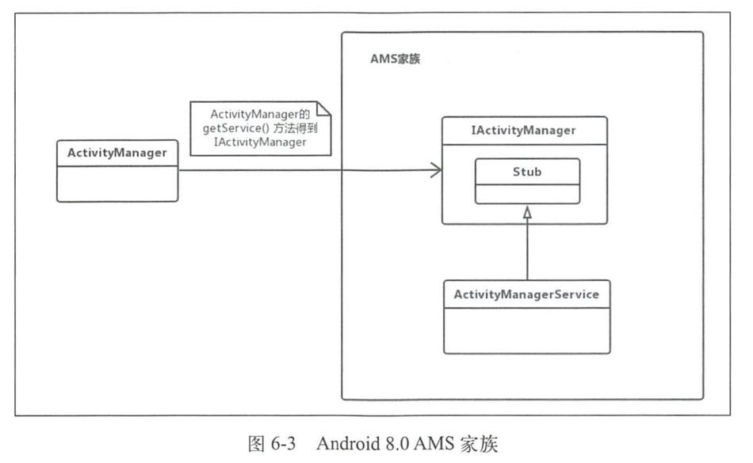
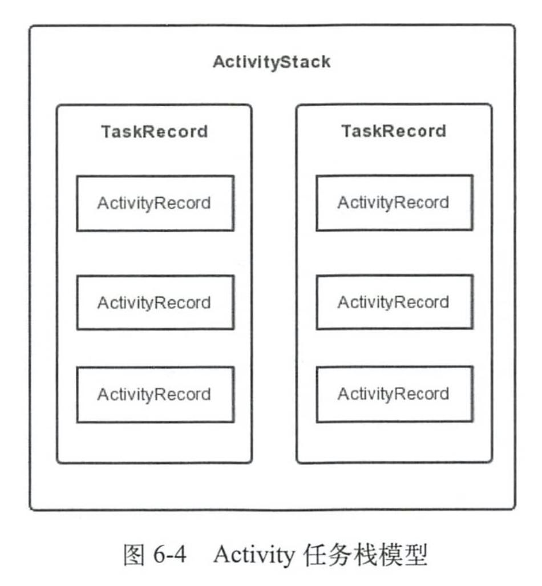

# 介绍



Android8.0后以AIDL的方式进行跨进程通信，AM通过getService获得AMS在本地的代理，通过此代理与AMS进行交互。

# AMS的启动过程

在Zygote进程启动过程中会启动SystemServer进程，而AMS的启动是在SystemServer进程中进行的。

SystemServer进程会创建SystemServiceManager，其用于对系统的服务进行创建、启动和生命周期管理。创建完SystemServiceManager就会创建并启动AMS。

# AMS与应用程序进程

Zygote的Java框架层中，会创建一个Server端的Socket，这个Socket用来等待AMS请求Zygote来创建新的应用程序进程。

在启动应用程序时AMS会检查这个应用程序需要的应用程序进程是否存在，不存在就会请求Zygote进程创建需要的应用程序进程。

# AMS的数据结构

AMS涉及了很多数据结构，如ActivityRecord、TaskRecord、ActivityStack。

## ActivityRecord

ActivityRecord内部记录了Activity的所有信息，用来描述一个Activity。它是在启动Activity 时被创建的，见[Activity启动过程](03 Activity启动过程.md)。

**ActivityRecord的部分重要成员变量**

| 名称                | 类型                   | 说明                                                         |
| ------------------- | ---------------------- | ------------------------------------------------------------ |
| service             | ActivityManagerService | AMS的引用                                                    |
| info                | ActivityInfo           | Activity中代码和AndroidManifes设置的节点信息，比如launchMode |
| launchedFromPackage | String                 | 启动Activity的包名                                           |
| taskAffinity        | String                 | Activity希望归属的栈                                         |
| task                | TaskRecord             | ActivityRecord所在的TaskRecord                               |
| app                 | ProcessRecord          | ActivityRecord所在的应用程序进程                             |
| state               | ActivityState          | 当前Activity的状态                                           |
| icon                | int                    | Activity的图标资源标识符                                     |
| theme               | int                    | Activity的主题资源标识符                                     |

## TaskRecord

TaskRecord用来描述一个Activity 任务栈。

**TaskRecord的部分重要成员变量类型**

| 名称        | 类型                        | 说明                           |
| ----------- | --------------------------- | ------------------------------ |
| taskId      | init                        | 任务栈的唯一标识符             |
| affinity    | String                      | 任务栈的倾向性                 |
| intent      | Intent                      | 启动这个任务栈的Intent         |
| mActivities | ArrayList\<ActivityRecord\> | 按照历史顺序排列的Activity记录 |
| mStack      | ActivityStack               | 当前归属的ActivityStack        |
| mService    | ActivityManagerService      | AMS的引用                      |

## ActivityStack

ActivityStack是一个管理类，用来管理系统所有的Activity，内部维护了Activity的所有状态、特殊状态的Activity以及Activity相关的列表等数据。ActivityStack是由ActivityStackSupervisor来进行管理的，ActivityStackSupervisor在AMS的构造方法中被创建。

```java
public ActivityManagerService(Context systemContext) {
    //...
    mStackSupervisor = createStackSupervisor();
    //...
}
```

```java
protected ActivityStackSupervisor createStackSupervisor() {
    return new ActivityStackSupervisor(this, mHandler.getLooper());
}
```

### ActivityStack的实例类型

mHomeStack用来存储Launcher APP的所有Activity。

mFocusedStack表示当前正在接收输入或启动下一个Activity的所有Activity。

mLastFocusedStack表示此前接收输入的所有Activity。

### ActivityState

在ActivityStack中通过枚举存储来Activity的所有的状态：

```java
enum ActivityState {
    INITIALIZING,
    RESUMED,
    PAUSING,
    PAUSED,
    STOPPING,
    STOPPED,
    FINISHING,
    DESTROYING,
    DESTROYED
}
```

# Activity 栈管理

## 任务栈模型

Activity任务栈并不是凭空想象出来的，它是由多种数据结构共同组合而成的。



## Launch Mode

## 启动的Flags

## taskAffinity

以上具体见《四大组件》。