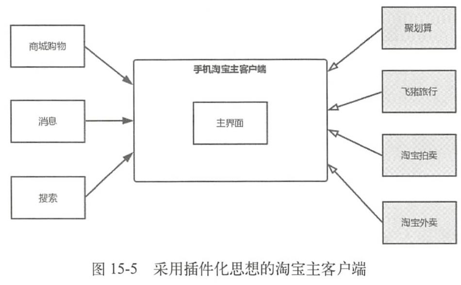

# 动态加载技术

在Android传统开发中，一旦应用的代码被打包成APK并被上传到各个渠道市场，就不能修改应用的源码了，只能通过服务器来控制应用中预留的分支代码。但是很多时候无法提前预知需求和突然发生的情况，也就不能提前在应用代码中预留分支代码，这时就需要采用动态加载技术。在应用程序运行时，动态加载一些程序中原本不存在的可执行文件并运行这些文件里的代码逻辑。可执行文件总的来说分为两种，一种是动态链接库so，另一种是dex相关文件（dex以及包含dex的jar/apk文件）。

随着应用开发技术和业务的逐步发展，动态加载技术派生出两个技术，分别是热修复技术和插件化技术，其中热修复技术主要用来修复Bug，插件化技术则主要用于解决应用越来越庞大以及功能模块的解耦，围绕着两个技术出现了很多的热修复框架和插件化框架。

需要注意的是，动态加载技术本身并没有被官方认可，并且是一个非常规的技术，在国外这门技术关注度并不高，它
的产生更多的是国内的业务需求和产品的驱动。

# 插件化的产生

## 插件化定义

采用插件化思想来对淘宝主客户端框架进行改造：

插件化的客户端由宿主和插件两个部分组成，宿主就是指先被安装到手机中的APK，就是平常加载的普通APK。插件一般是指经过处理的APK、So和dex等文件，插件可以被宿主进行加载，有的插件也可以作为APK独立运行。

这里就可以引出插件化的定义：将一个应用按照插件的方式进行改造的过程就叫作插件化。

# Activity插件化

四大组件的插件化是插件化技术的核心知识点，而Activity插件化更是重中之重，Activity插件化主要有3种实现方式，分别是反射实现、接口实现和Hook技术实现。反射实现会对性能有所影响，主流的插件化框架没有采用此方式，关于接口实现可以阅读dynamic-load-apk的源码，这里不做介绍，目前Hook技术实现是主流，因此本章主要介绍Hook技术实现。

Hook技术实现主要有两种解决方案，一种是通过HookIActivityManager来实现，另一种是HookInstrumentation实现。

## Activity的启动过程回顾

根Activity的启动：首先Launcher进程向AMS请求创建根Activity，AMS会判断根Activity所需的应用程序进程是否存在并启动，如果不存在就会请求Zygote进程创建应用程序进程。应用程序进程启动后，AMS会请求应用程序进程创建并启动根Activity。

## Hook IActivityManager方案实现

AMS存在于SystemServer进程中，无法直接修改，只能在应用程序进程中修改。可以采用预先占坑然后再替换的方式来解决没有在AndroidManifest.xml中显式声明的问题。

### 注册Activity进行占坑

为了更好地讲解启动插件Activity的原理，这里省略了插件Activity的加载逻辑，直接
创建一个TargetActivity来代表已经加载进来的插件Activity，接着我们再创建一个
SubActivity*S。ÆAndroidManifest。xmlÈ}SubActivity，tuTT：
AndroidManifest。xml
<?xmlversion="1。0"encoding="utf-8"?>
<manifestxmlns：android="http：//schemas。android。com/apk/res/android"
package="com。example。liuwangshu。pluginactivity">S
<application
<activityandroid：name="。StubActivity"/>
</application>
</manifest>
TargetActivity用来代表已经加载进来的插件Activity，因此不需要在
AndroidManifest。xml中进行注册。如果我们直接在MainActivity中启动TargetActivity肯定
araae（android。content。ActivityNotFoundException）。
15。4。2。2使用占坑Activity通过AMS验证
为了防止报错，需要将启动的TargetActivity替换为SubActivity，用SubActivity来通
过AMS的验证。在第6章中讲过Android8。0与Android7。0的AMS家族有一些差别，主
TEAndroid8。0EHTAMSfJftActivityManagerProxy，ftÈIActivityManager，
直接采用AIDL来进行进程间通信。Android7。0的Activity的启动会调用
ActivityManagerNativefjgetDefaultF£，kuTHizT：
frameworks/base/core/java/android/app/ActivityManagerNative。java
staticpublicIActivityManagergetDefault（）{
returngDefault。get（）;
}
354

Page371
第15章插件化原理
privatestatic
finalSingleton<IActivityManager>gDefault
Singleton
new
<IActivityManager>（）{
protectedIActivityManagercreate（）{
IBinderb=
ServiceManager。getService（"activity"）;
if（false）{
Log。v（"ActivityManager"，"defaultservicebinder=
%3D
+b）;
IActivityManageram=asInterface（b）;
if（false）{
Log。v（"ActivityManager"，"defaultservice=
+am）;
%3D
returnam;
}
};
getDefaultOŢIActivityManagerActivityManagerf#DTSingleton
类来实现单例，而且gDefault又是静态的，因此IActivityManager是一个比较好的Hook点。
Android8。0#jActivityfJHaActivityManagerigetService7j#，KnTBias：
frameworks/base/core/javalandroid/app/ActivityManager。java
publicstaticIActivityManagergetService（）{
returnIActivityManagerSingleton。get（）;
privatestaticfinalSingleton<IActivityManager>IActivityManagerSingleton
newSingleton<IActivityManager>（）{
@Override
protectedIActivityManagercreate（）{
finalIBinderb
ServiceManager。getService（Context。ACTIVITY
SERVICE）;
finalIActivityManageram=
IActivityManager。Stub。asInterface（b）;
returnam;
};
同样地，getService方法返回了IActivityManager类型的对象，并且IActivityManager
借助了Singleton类来实现单例，再结合图6-1和6-3，确定了无论是Android7。0还是Android
8。0，IActivityManager都是比较好的Hook点。Singleton类如下所示，后面会用到：
frameworks/base/core/java/android/util/Singleton。java
icabstractclassSingleton<T>{
privateTmInstance;
protectedabstractTcreate（）;
355

Page372
Android进阶解密
publicfinalTget（）{
synchronized（this）{
if（mInstance
null）{
mInstance=create（）;
}
returnmInstance;
由于Hook需要多次对字段进行反射操作，先写一个字段工具类FieldUtil：
FieldUtil。java
publicclassFieldUtil{
publicstaticObjectgetField（Classclazz，Objecttarget，Stringname）throws
Exception{
Fieldfield=clazz。getDeclaredField（name）;
field。setAccessible（true）;
returnfield。get（target）;
}
publicstaticFieldgetField（Classclazz，Stringname）throwsException{
Fieldfield=clazz。getDeclaredField（name）;
field。setAccessible（true）;
returnfield;
}
publicstaticvoidsetField（Classclazz，Objecttarget，Stringname，Objectvalue）
throwsException{
Fieldfield=clazz。getDeclaredField（name）;
field。setAccessible（true）;
field。set（target，value）;
}
其中setField方法不会马上用到，接着定义替换IActivityManager的代理类
IActivityManagerProxy，uFi：
publicclassIActivityManagerProxyimplementsInvocationHandler{
privateObjectmActivityManager;
privatestaticfinalStringTAG=
"IActivityManagerProxy";
publicIActivityManagerProxy（ObjectactivityManager）
this。mActivityManager
activityManager;
%3D
}
@Override
publicObjectinvoke（Objecto，Methodmethod，Object[]args）throwsThrowable{
if（"startActivity"。equals（method。getName（）））{//1
Intentintent=null;
356

Page373
第15章插件化原理
intindex=0;
for（inti=0;i<args。length;i++）{
if（args[i]instanceofIntent）{
index=i;
break;
（Intent）args[index];
IntentsubIntent=newIntent（）;//2
intent=
StringpackageName
"com。example。liuwangshu。pluginactivity";
subIntent。setClassName（packageName，packageName+"。StubActivity"）;//3
subIntent。putExtra（HookHelper。TARGETINTENT，intent）;//4
args[index]
=subIntent;//5
}
returnmethod。invoke（mActivityManager，args）;
}
Hook点IActivityManager是一个接口，建议采用动态代理。在注释1处拦截startActivity
方法，接着获取参数args中第一个Intent对象，它原本要启动插件TargetActivity的Intent。
在注释2、注释3处新建一个sublntent用来启动StubActivity，在注释4处将这个
TargetActivity的Intent保存到subIntent中，便于以后还原TargetActivity。在注释5处用
sublntent赋值给参数args，这样启动的目标就变为了StubActivity，用来通过AMS的校验。
RhahahaaaActivityManagerProxy**IActivityManager，uFPizi：
HookHelper。java
publicclassHookHelper{
publicstaticfinalStringTARGETINTENT=
"target_intent";
publicstaticvoidhookAMS（）throwsException{
ObjectdefaultSingleton=null;
if（Build。VERSION。SDKINT>=26）{//1
Class<?>activityManageClazz=Class。forName（"android。app。ActivityManager"）;
//#activityManagerfIActivityManagerSingleton*
defaultSingleton=FieldUtil。getField（activityManageClazz，null，
"IActivityManagerSingleton"）;
}else{
Class<?>activityManagerNativeClazz
=Class。forName（"android。app。
ActivityManagerNative"）;
//#ActivityManagerNative†#gDefault
defaultSingleton=FieldUtil。getField（activityManagerNativeClazz，null，
"gDefault"）;
}
Class<?>singletonClazz
=Class。forName（"android。util。Singleton"）;
357

Page374
Android进阶解密
FieldmInstanceField=FieldUtil。getField（singletonClazz，"mInstance"）;//2
//*iActivityManager
ObjectiActivityManager=mInstanceField。get（defaultSingleton）;//3
Class<?>iActivityManagerClazz=Class。forName（"android。app。IActivityManager"）;
Objectproxy
Proxy。newProxyInstance（Thread。currentThread（）。getContext
%3D
ClassLoader（），newClass<?>[]{iActivityManagerClazz}，new
IactivityManagerProxy（iActivityManager））;
mInstanceField。set（defaultSingleton，proxy）;
}
首先在注释1处对系统版本进行区分，最终获取的是Singleton<IActivityManager>类型
HJIActivityManagerSingletongDefault。EÈ#2LSingletonmInstance
字段，从前面Singleton类的代码可以得知mlnstance字段的类型型为T，在注释3处得到
IActivityManagerSingletongDefault#O，TÍJ*HIActivityManager，
最后动态创建代理类IActivityManagerProxy，用IActivityManagerProxy来替换
IActivityManager，ÁÈX-↑Application，Æ##AHookHelper#jhookAMSF£，kI
下所示：
MyApplication。java
publicclassMyApplicationextendsApplication{
@Override
publicvoidattachBaseContext（Contextbase）{
super。attachBaseContext（base）;
try{
HookHelper。hookAMS（）;
}catch（Exceptione）{
e。printStackTrace（）;
}
}
在MainActivity中启动TargetActivity，如下所示：
MainActivity。java
publicclassMainActivityextendsActivity{
privateButtonbthook;
@Override
protectedvoidonCreate（BundlesavedInstanceState）{
super。onCreate（savedInstanceState）;
setContentView（R。layout。activity_main）;
bt_hook=（Button）this。findViewById（R。id。bt_hook）;
bthook。setOnClickListener（newView。OnClickListener（）{
358

Page375
仅供非商业用途或交流学习使用
第15章插件化原理
@Override
publicvoidonClick（Viewview）{
Intentintent=newIntent（MainActivity。this，TargetActivity。class）;
startActivity（intent）;
一
}）;
一
}
点击Button时，启动的并不是TargetActivity而是SubActivity，同时Log中打印了“hook
成功”，说明我们已经成功用SubActivity通过了AMS的校验。
15。4。2。3还原插件Activity
前面用占坑Activity通过了AMS的校验，但是我们要启动的是插件TargetActivity，还
需要用插件TargetActivity来替换占坑的SubActivity，这一替换的时机就在图15-7所示的
步骤2之后。在4。1。3节中讲到了ActivityThread启动Activity的过程，如图15-8所示。
ApplicationThread
ActivityThread
H
Instrumentation
Activity
-schedulelaunchActivity
-sendMessage
-handleMessage-
KhandlelaunchActivity-
performlaunchActivity
callActivityOnCreate-
-performCreate-
onCreate
图15-8ActivityThread启动Activity的过程
ActivityThread会通过H类将代码的逻辑切换到主线程中，H类是ActivityThread的内
部类并继承自Handler，如下所示：
359

Page376
仅供非商业用途或交流学习使用
Android进阶解密
frameworks/base/lcore/java/android/app/ActivityThread。java
privateclassHextendsHandler{
publicstaticfinalintLAUNCHACTIVITY=100;
publicstaticfinalintPAUSEACTIVITY=101;
publicvoidhandleMessage（Messagemsg）{
if（DEBUG_MESSAGES）Slog。v（TAG，">>>handling：
+codeToString（msg。
what））;
switch（msg。what）{
caseLAUNCHACTIVITY：{
Trace。traceBegin（Trace。TRACE_TAG_ACTIVITY_MANAGER，"activityStart"）;
finalActivityClientRecordr=
（ActivityClientRecord）msg。obj;
r。packageInfo=getPackageInfoNoCheck（
r。activityInfo。applicationInfo，r。compatInfo）;
handleLaunchActivity（r，null，"LAUNCH_ACTIVITY"）;
Trace。traceEnd（Trace。TRACETAGACTIVITYMANAGER）;
}break;
}
H类中重写的handleMessage方法会对LAUNCH_ACTIVITY类型的消息进行处理，最
终会调用Activity的onCreate方法。那么在哪进行替换呢?接着来看Handler的
dispatchMessage
frameworks/base/core/javalandroid/os/Handler。java
publicvoiddispatchMessage（Messagemsg）{
if（msg。callback!=null）{
handleCallback（msg）;
}else{
if（mCallback!=null）{
if（mCallback。handleMessage（msg））{
return;
}
handleMessage（msg）;
}
}
Handler#jdispatchMessageHFL，AAHandlerjCallback*I
mCallback不为null，就会执行mCallback的handleMessage方法。因此，mCallback可以作
360

Page377
仅供非商业用途或交流学习使用
第15章插件化原理
为Hook点，我们可以用自定义的Callback来替换mCallback，自定义的Callback如下所示：
HCallback。java
publicclassHCallbackimplementsHandler。Callback{
publicstaticfinalintLAUNCHACTIVITY=100;
HandlermHandler;
publicHCallback（Handlerhandler）
mHandler=handler;
}
@Override
publicbooleanhandleMessage（Messagemsg）{
if（msg。what
LAUNCHACTIVITY）{
Objectr=msg。obj;
try{
//得到消息中的Intent（启动SubActivity的Intent）
Intentintent=
（Intent）FieldUtil。getField（r。getClass（），r，"intent"）;
//tE*Intent（ÀTargetActivity#Intent）
Intenttarget=intent。getParcelableExtra（HookHelper。TARGETINTENT）;
//*subActivityIntent**TargetActivity#Intent
intent。setComponent（target。getComponent（））;
}catch（Exceptione）{
e。printStackTrace（）;
}
mHandler。handleMessage（msg）;
returntrue;
}
}
HCallback实现了Handler。Callback，并重写了handleMessage方法，当收到消息的类型
为LAUNCH_ACTIVITY时，将启动SubActivity的Intent替换为启动TargetActivity的Intent。
接着我们在HookHelper中定义一个hookHandler方法，如下所示：
HookHelper。java
publicstaticvoidhookHandler（）throwsException{
Class。forName（"android。app。ActivityThread"）;
ObjectcurrentActivityThread=FieldUtil。getField（activityThreadClass，null，
Class<?>activityThreadClass
%3D
"sCurrentActivityThread"）;//1
FieldmHField=FieldUtil。getField（activityThread，"mH"）;//2
（Handler）mHField。get（currentActivityThread）;//3
FieldUtil。setField（Handler。class，mH，"mCallback"，newHCallback（mH））;
HandlermH=
}
361

Page378
仅供非商业用途或交流学习使用
Android进阶解密
ActivityThread类中有一个静态变量sCurrentActivityThread，用于表示当前的
ActivityThreadt，AEEE#1L*ActivityThread#ÈXJsCurrentActivityThread
对象。注释2处获取ActivityThread类的mH字段，接着在注释3处获取当前ActivityThread
#mHt，aaahcallback**mHHmCallback，EMyApplicationJ
attachBaseContext方法中调用HookHelper的hookHandler方法，运行程序，当我们单击“启
动插件”按钮时，发现启动的是插件TargetActivity。
15。4。2。4插件Activity的生命周期
插件TargetActivity确实启动了，但是它有生命周期吗?这里从源码角度来进行分析，
Activity的finish方法可以触发Activity的生命周期变化，和Activity的启动过程类似，finish
方法如下所示：
frameworks/base/core/javalandroid/app/Activity。java
publicvoidfinish（）{
finish（DONTFINISHTASKWITHACTIVITY）;
}
privatevoidfinish（intfinishTask）{
if（mParent==null）{
intresultCode;
IntentresultData;
synchronized（this）{
resultCode=mResultCode;
resultData=mResultData;
if（false）Log。v（TAG，"Finishingself：token="+mToken）;
try{
if（resultData!=null）{
resultData。prepareToLeaveProcess（this）;
if（ActivityManager。getService（）
。finishActivity（mToken，resultCode，resultData，finishTask））
{//1
mFinished=true;
}
}catch（RemoteExceptione）{
//Empty
}else{
mParent。finishFromChild（this）;
}
}
362

Page379
仅供非商业用途或交流学习使用
第15章插件化原理
finish方法的调用链和Activity的启动过程是类似的，在注释1处调用AMS的
finishActivity，EREAMS1itApplicationThreadiActivityThread，ActivityThread
向H类发送DESTROY_ACTIVITY类型的消息，H类接收到这个消息会执行
handleDestroyActivityk，handleDestroyActivityXperformDestroyActivity
法，如下所示：
frameworks/base/core/javalandroid/app/ActivityThread。java
privateActivityClientRecordperformDestroyActivity（IBinder
token，
boolean
finishing，intconfigChanges，booleangetNonConfigInstance）{
ActivityClientRecordr
=mActivities。get（token）;//1
try{
r。activity。mCalled
=false;
mInstrumentation。callActivityOnDestroy（r。activity）;//2
}catch（SuperNotCalledExceptione）{
}
}
mActivities。remove（token）;
StrictMode。decrementExpectedActivityCount（activityClass）;
returnr;
EÈ1LtIBinder*token**ActivityClientRecord，ActivityClientRecord
HTaA+6Activity，EE2LInstrumentationjcallActivityOnDestroy
方法来调用Activity的OnDestroy方法，并传入了r。activity。前面的例子我们用SubActivity
替换了TargetActivity通过了AMS的校验，这样AMS只知道SubActivity的存在，那么AMS
是如何能控制TargetActivity生命周期的回调的呢?我们接着往下看，启动Activity时会调
HActivityThreadfjperformLaunchActivity，knF：
frameworks/base/core/javalandroid/app/ActivityThread。java
privateActivityperformLaunchActivity（ActivityClientRecordr，IntentcustomIntent）{
java。lang。ClassLoadercl=
appContext。getClassLoader（）;
activity
mInstrumentation。newActivity（
%3D
cl，component。getClassName（），r。intent）;//1
activity。attach（appContext，this，getInstrumentation（），r。token，r。ident，
app，r。intent，r。activityInfo，title，r。parent，r。embeddedID，
r。lastNonConfigurationInstances，config，r。referrer，
r。voiceInteractor，window，r。configCallback）;
363

Page380
仅供非商业用途或交流学习使用
Android进阶解密
mActivities。put（r。token，r）;//2
returnactivity;
}
在注释1处根据Activity的类名用ClassLoader加载Acitivty，接着调用Activity的atach
方法，将rtoken赋值给Activity的成员变量mToken。在注释2处将ActivityClientRecord根
Er。token（RFEmActivities（mActivities*Y%ArrayMap<IBinder，ActivityClientRecord>），
再结合Activity的finish方法的注释1处，可以得出结论：AMS和ActivityThread之间的通
信采用了token来对Activity进行标识，并且此后的Activity的生命周期处理也是根据token
来对Activity进行标识的。回到这个例子来，我们在Activity启动时用插件TargetActivity
替换占坑SubActivity，这一过程在performLaunchActivity方法调用之前，因此注释2处的
r。tokenTargetActivity，£performDestroyActivityE1Kaae
TargetActivityjActivityClientRecord，JNTargetActivityhaftA。
15。4。3HookInstrumentationa
HookInstrumentation实现要比HookIActivityManager实现简单一些，示例代码会和
HookIActivityManagerF，ÍIOMELH。HookInstrumentationM
同样也需要用到占坑Activity，与HOOIActivityManager实现不同的是，用占坑Activity替
换插件Activity以及还原插件Activity的地方不同。Acitivty的startActivity方法调用时序图
如图15-9所示。
从图15-9可以发现，在Activity通过AMS校验前，会调用Activity的
startActivityForResultj：
frameworks/base/core/javalandroid/app/Activity。java
publicvoidstartActivityForResult（@RequiresPermissionIntentintent，intrequestCode，
@NullableBundleoptions）{
if（mParent==null）{
options
transferSpringboardActivityOptions（options）;
Instrumentation。ActivityResultar=
mInstrumentation。execStartActivity（
this，mMainThread。getApplicationThread（），mToken，this，
intent，requestCode，options）;
}else{
364

Page381
仅供非商业用途或交流学习使用
第15章插件化原理
Activity
Instrumentation
IActivityManager
AMS
startActivity
startActivityForResult
-execStartActivity-
-startActivity-
startActivity-
图15-9Acitivty的startActivity方法调用时序图
EstartActivityForResultATInstrumentationJexecStartActivityifi
Activity的生命周期。
图15-8中会调用ActivityThread的performLaunchActivity方法，如下所示：
frameworks/base/core/javalandroid/app/ActivityThread。java
privateActivityperformLaunchActivity（ActivityClientRecordr，IntentcustomIntent）{
//创建要启动Activity的上下文环境
ContextImplappContext=createBaseContextForActivity（r）;
Activityactivity
=null;
try{
java。lang。ClassLoadercl=
appContext。getClassLoader（）;
1/用类加载器來创建Activity的实例
activity=mInstrumentation。newActivity（
cl，component。getClassName（），r。intent）;//1
}catch（Exceptione）{
returnactivity;
}
365

Page382
Android进阶解密
在注释1处调用了mInstrumentation的newActivity方法，其内部会用类加载器来创建
Activity的实例。看到这里我们可以得到方案，就是在Instrumentation的execStartActivity
方法中用占坑SubActivity来通过AMS的验证，在Instrumentation的newActivity方法中还
原TargetActivity，这两部操作都和Instrumentation有关，因此我们可以用自定义的
Instrumentation**mInstrumentation，A0ÍÈL-↑Instrumentation，E
execStartActivityaTargetActivitySubActivity，kuTHi：
InstrumentationProxy。java
publicclassInstrumentationProxyextendsInstrumentation{
privateInstrumentationmInstrumentation;
privatePackageManagermPackageManager;
publicInstrumentationProxy（Instrumentationinstrumentation，PackageManager
packageManager）{
mInstrumentation
instrumentation;
mPackageManager
packageManager;
%3D
}
publicActivityResultexecStartActivity（
Contextwho，IBindercontextThread，IBindertoken，Activitytarget，
Intentintent，intrequestCode，Bundleoptions）{
List<ResolveInfo>
infos
mPackageManager。queryIntentActivities（intent，
PackageManager。MATCHALL）;
==null||infos。size（（）
intent。putExtra（HookHelper。TARGET_INTENST_NAME，
intent。getComponent（）。getClassName（））;//1
if（infos
0）{
==
intent。setClassName（who，
"com。example。liuwangshu。pluginactivity。StubActivity"）;//2
}
try{
MethodexecMethod=
Instrumentation。class。getDeclaredMethod（"execStart
Activity"，Context。class，IBinder。class，IBinder。class，Activity。class，
Intent。class，int。class，Bundle。class）;
return（ActivityResult）execMethod。invoke（mInstrumentation，who，
contextThread，token，target，intent，requestCode，options）;
}catch（Exceptione）{
e。printStackTrace（）;
}
returnnull;
}
首先查找要启动的Activity是否已经在AndroidManifest。xml中注册了，如果没有注册
就在注释1处将要启动的Activity（TargetActivity）的ClassName保存起来用于后面还原
366

Page383
第15章插件化原理
TargetActivity，接着在注释2处替换要启动的Activity为StubActivity，最后通过反射调用
execStartActivity方法，这样就可以用StubActivity通过AMS的验证。在InstrumentationProxy
的newActivity方法中还原TargetActivity，如下所示：
InstrumentationProxy。java
publicActivitynewActivity（ClassLoadercl，StringclassName，Intentintent）throws
InstantiationException，
IllegalAccessException，ClassNotFoundException{
StringintentName=
intent。getStringExtra（HookHelper。TARGETINTENTNAME）;
if（!TextUtils。isEmpty（intentName））{
returnsuper。newActivity（cl，intentName，intent）;
}
returnsuper。newActivity（cl，className，intent）;
ÆnewActivityta#TargetActivity，zTIHTargetActivity，
EhookInstrumentation，HInstrumentationProxymInstrumentation;
HookHelper。java
publicstaticvoidhookInstrumentation（Contextcontext）throwsException{
Class<?>contextImplClass
Class。forName（"android。app。ContextImpl"）;
FieldmMainThreadField=FieldUtil。getField（contextImplClass，
"mMainThread"）;//1
=mMainThreadField。get（context）;//2
ObjectactivityThread
Class<?>activityThreadClass
=Class。forName（"android。app。ActivityThread"）;
FieldmInstrumentationField=FieldUtil。getField（activityThreadClass，
"mInstrumentation"）;//3
FieldUtil。setField（activityThreadClass，activityThread，"mInstrumentation"，
newInstrumentationProxy（（Instrumentation）mInstrumentationField。
get（activityThread），context。getPackageManager（）））;
}
在注释1处获取ContextImpl类的ActivityThread类型的mMainThread字段，在注释2
处获取当前上下文环境的ActivityThread对象。在注释3处获取ActivityThread类中的
mlnstrumentation7，AInstrumentationProxy**mInstrumentation。E
MyApplicationjattachBaseContextjHookHelperjhooklInstrumentation75ti，jë
行程序，当我们单击“启动插件”按钮时，发现启动的是插件TargetActivity。
15。4。4总结
这一节我们学习了启动插件Activity的原理，主要的方案就是先用一个在
367
仅供非商业用途或交流学习使用

Page384
Android进阶解密
AndroidManifest。xml中注册的Activity来进行占坑，用来通过AMS的校验，接着在合适的
时机用插件Activity替换占坑的Activity。为了更好地讲解启动插件Activity的原理，本节
省略了插件Activity的加载逻辑，直接创建一个TargetActivity来代表已经加载进来的插件
Activity。同时这一节使我们更好地理解了Activity的启动过程。
15。5Service插件化
Service插件化和Activity插件化的原理有些不同，我们先来回顾一下Service的启动
过程。
15。5。1插件化方面Service与Activity的不同
在4。2节讲到了Service的启动过程，它和Activity的启动过程类似，但有些不同，
ContextImpl到AMS的调用过程如图15-10所示。
ContextWrapper
Contextimpl
IActivityManager
AMS
startService
startService-
startServiceCommon
-startService
-startService
图15-10ContextImpl到AMS的调用过程
在ContextImpl到AMS的调用过程中并没有交由Instrumentation来处理，在后续的
ActivityThread启动Service过程中也是一样的，如图15-11所示。
368
仅供非商业用途或交流学习使用

Page385
第15章插件化原理
AMS
ActiveServices
ApplicationThread
ActivityThread
H
Service
startService
-startServicelLocked>
startServicelnnerLocked
bringUpServiceLocked
realStartServicelocked
scheduleCreateService>
sendMessage
handleMessage
KhandleCreateService
-onCreate
图15-11ActivityThread启动Service
可见Service的启动和Instrumentation完全没有关联，因此Service插件化不能通过Hook
Instrumentation来实现。Service插件化可以用HookIActivityManager的方案来实现吗?带
着这个疑问，我们需要了解在插件化方面Activity和Service有何不同，主要有以下3点：
。Activity是基于栈管理的，一个栈中的Activity的数量不会太多，因此插件化框架处
理的插件Activity数量是有限的，可以声明有限的占坑Activity来实现。除去硬件
和系统限制，插件化框架处理的插件Service的数量可以是近乎无限的，无法用有限
的占坑Service来实现。
。在Standard模式下多次启动同一个占坑Activity可以创建多个Activity实例，但是
多次启动占坑Service并不会创建多个Service实例。
。用户和界面的交互会影响到Activity的生命周期，因此插件Activity的生命周期需
要交由系统来管理，HookIActivityManager方案中还原插件Activity就是为了这一
点。Service的生命周期不受用户影响，可以由开发者管理生命周期，没有必要还原
插件。
369
仅供非商业用途或交流学习使用

Page386
Android进阶解密
综合上面3点得出的结论就是，Service插件化不可以用HookIActivityManager方案来
实现，我们需要找到一个新的方案。
15。5。2代理分发实现
Activity插件化的重点在于要保证它的生命周期，而Service插件化的重点是保证它的
优先级，这就需要用一个真正的Service来实现，而不是像占坑Activity那样起一个占坑的
作用。当启动插件Service时，就会先启动代理Service，当这个代理Service运行起来之后，
在它的onStartCommand等方法里面进行分发，执行插件TargetService的onCreate等方法，
这一方案就叫作代理分发。
15。5。2。1启动代理Service
Service插件化需要一个真正的Service来实现，我们先要在AndroidManifest。xml中注
册代理ProxyService，如下所示：
<?xmlversion="1。0"encoding="utf-8"?>
<manifestxmlns：android="http：//schemas。android。com/apk/res/android"
package="com。example。liuwangshu。pluginservice">
<application
<serviceandroid：name="。ProxyService"
//android：process="：daemon"
/>
</application>
</manifest>
这里我们只是注册了ProxyService，让它运行在当前应用程序进程中，你也可以定义
android：process用于支持多进程。在MainActivity中启动插件Service，，如下所示：
MainActivity。java
publicclassMainActivityextendsAppCompatActivity{
privateButtonbthook;
@Override
protectedvoidonCreate（BundlesavedInstanceState）{
super。onCreate（savedInstanceState）;
setContentView（R。layout。activity_main）;
bt_hook=
（Button）this。findViewById（R。id。bt_hook）;
bthook。setOnClickListener（newView。OnClickListener（）{
@Override
370
仅供非商业用途或交流学习使用

Page387
第15章插件化原理
publicvoidonClick（Viewview）{
Intentintent=newIntent（MainActivity。this，TargetService。class）;
startService（intent）;
}）;
}
}
为了便于理解，这里省略了插件Service的加载逻辑，直接创建一个TargetService来代
表已经加载进来的插件Service。TargetService的代码如下所示：
TargetService。java
publicclassTargetServiceextendsService{
privatestaticfinalStringTAG=
"TargetService";
@Nullable
@Override
publicIBinderonBind（Intentintent）{
returnnull;
}
@Override
publicvoidonCreate（）{
super。onCreate（）;
Log。d（TAG，"onCreate"）;
}
@Override
publicintonStartCommand（Intentintent，intflags，intstartId）{
Log。d（TAG，"onStartCommand"）;
returnsuper。onStartCommand（intent，flags，startId）;
}
TargetService只是用来打印Log，确定自身的方法是否已经被调用。TargetService用来
代表插件Service，不能够直接启动，需要先启动代理ProxyService，为了达到这一目的我
们需要HookIActivityManager，具体的原理和步骤与15。4。2节讲得类似，定义替换
IActivityManager#3fEActivityManagerProxy，kuF：
publicclassIActivityManagerProxyimplementsInvocationHandler{
privateObjectmActivityManager;
privatestaticfinalStringTAG="IActivityManagerProxy";
publicIActivityManagerProxy（ObjectactivityManager）{
this。mActivityManager
activityManager;
}
@Override
publicObjectinvoke（Objecto，Methodmethod，Object[]args）throwsThrowable{
371
仅供非商业用途或交流学习使用

Page388
Android进阶解密
if（"startService"。equals（method。getName（）））{//1
Intentintent=null;
intindex
0;
for（inti=
0;i<args。length;i++）{
if（args[i]instanceofIntent）{
index=i;
break;
}
}
intent=（Intent）args[index];
IntentproxyIntent=newIntent（）;//2
StringpackageName="com。example。liuwangshu。pluginservice";
proxyIntent。setClassName（packageName，packageName+"。ProxyService"）;//3
proxyIntent。putExtra（ProxyService。TARGET_SERVICE，
intent。getComponent（）。
getClassName（））;//4
args[index]
=subIntent;//5
Log。d（TAG，"Hook"）;
}
returnmethod。invoke（mActivityManager，args）;
}
在注释1处拦截startService方法，接着获取参数args中第一个Intent对象，它原本要
启动插件TargetActivity的Intent。在注释2、注释3处新建一个proxylntent用来启动
ProxyService，注释4处将这个ProxyService的Intent保存到proxyIntent中，便于此后进行
分发。在注释5处将proxyIntent赋值给参数args，这样启动的目标就变为了ProxyService。
定义了IActivityManagerProxy，我们就需要用IActivityManagerProxy来替换系统的
IActivityManager，kuFH：
HookHelper。java
publicclassHookHelper{
publicstaticfinalStringTARGET_INTENT="target_intent";
publicstaticvoidhookAMS（）throwsException{
ObjectdefaultSingleton=null;
if（Build。VERSION。SDKINT>=26）{//1
Class<?>activityManageClazz=Class。forName（"android。app。ActivityManager"）;
//activityManager##IActivityManagerSingleton
defaultSingleton=FieldUtil。getField（activityManageClazz，null，
"IActivityManagerSingleton"）;
}else{
Class<?>activityManagerNativeClazz=Class。forName（"android。app。
ActivityManagerNative"）;
372
仅供非商业用途或交流学习使用

Page389
第15章插件化原理
//##RActivityManagerNative##gDefault
defaultSingleton=FieldUtil。getField（activityManagerNativeClazz，null，
"gDefault"）;
}
Class<?>singletonClazz
=Class。forName（"android。util。Singleton"）;
FieldmInstanceField=FieldUtil。getField（singletonClazz，"mInstance"）;//2
//#iActivityManager
ObjectiActivityManager
=mInstanceField。get（defaultSingleton）;//3
Class<?>iActivityManagerClazz=Class。forName（"android。app。IActivityManager"）;
Objectproxy
ClassLoader（），newClass<?>[]{iActivityManagerClazz}，
Proxy。newProxyInstance（Thread。currentThread（）。getContext
newIactivityManagerProxy（iActivityManager））;
mInstanceField。set（defaultSingleton，proxy）;
}
首先在注释1处对系统版本进行区分，最终获取的是Singleton<IActivityManager>类型
的IActivityManagerSingleton或者gDefault字段。在注释2处获取Singleton类中的mlnstance
字段，从15。4。2。2节中给出的Singleton类代码可以得知minstance字段的类型为T，在注释
3LIActivityManagerSingletongDefaultR+OT0*N，TÁJ*
IActivityManager，aaaEMIActivityManagerProxy，IActivityManagerProxy
来替换IActivityManager。其中用到了FieldUtil类，这个类的定义在14。5。1。2节中已经讲过。
自定义一个Application调用HookHelper的hookAMS方法，如下所示：
MyApplication。java
publicclassMyApplicationextendsApplication{
@Override
protectedvoidattachBaseContext（Contextbase）{
super。attachBaseContext（base）;
try{
HookHelper。hookAMS（）;
}catch（Exceptione）{
e。printStackTrace（）;
}
}
运行应用单击MainActivity的按钮时，启动的不是插件TargetService，而是代理
ProxyService，接下来我们需要在ProxyService中进行代理分发。
373
仅供非商业用途或交流学习使用

Page390
Android进阶解密
15。5。2。2代理分发
编写ProxyService类，如下所示：
ProxyService。java
publicclassProxyServiceextendsService{
publicstaticfinalStringTARGETSERVICE=
"target_service";
@Override
publicintonStartCommand（Intentintent，intflags，intstartId）{
intent||!intent。hasExtra（TARGETSERVICE））{
if（null==
returnSTARTSTICKY;
intent。getStringExtra（TARGETSERVICE）;
StringserviceName=
if（null
==serviceName）{
returnSTARTSTICKY;
ServicetargetService=null;
try{
ClassactivityThreadClazz
Class。forName（"android。app。ActivityThread"）;
MethodgetActivityThreadMethod=activityThreadClazz。getDeclaredMethod
（"getApplicationThread"）;
getActivityThreadMethod。setAccessible（true）;
ObjectactivityThread
FieldUtil。getField（activityThreadClazz，null，
%D
"sCurrentActivityThread"）;//1
ObjectapplicationThread=getActivityThreadMethod。invoke（activityThread）;//2
%3D
ClassiInterfaceClazz
Class。forName（"android。os。IInterface"）;
MethodasBinderMethod=
iInterfaceClazz。getDeclaredMethod（"asBinder"）;
asBinderMethod。setAccessible（true）;
Objecttoken=asBinderMethod。invoke（applicationThread）;//3
ClassserviceClazz=Class。forName（"android。app。Service"）;
MethodattachMethod
serviceClazz。getDeclaredMethod（"attach"，
Context。class，activityThreadClazz，String。class，IBinder。class，
Application。class，Object。class）;
attachMethod。setAccessible（true）;
ObjectdefaultSingleton=null;
if（Build。VERSION。SDKINT>=26）{//4
Class<?>activityManageClazz
Class。forName（"android。app。Activity
Manager"）;
//#activityManagerIActivityManagerSingletonF
defaultSingleton
FieldUtil。getField（activityManageClazz，
null，
"IActivityManagerSingleton"）;
}else{
Class<?>activityManagerNativeClazz
Class。forName（"android。app。
374
仅供非商业用途或交流学习使用

Page391
第15章插件化原理
ActivityManagerNative"）;
//#ActivityManagerNativegDefault*
defaultSingleton
FieldUtil。getField（activityManagerNativeClazz，
%3D
null，"gDefault"）;
}
Class<?>singletonClazz
=Class。forName（"android。util。Singleton"）;
FieldmInstanceField=
//#iActivityManager
FieldUtil。getField（singletonClazz，"mInstance"）;
ObjectiActivityManager=mInstanceField。get（defaultSingleton）;//5
targetService=（Service）Class。forName（serviceName）。newInstance（）;//6
attachMethod。invoke（targetService，this，activityThread，intent。
getComponent（）。getClassName（），token，getApplication（），
iActivityManager）;//7
targetService。onCreate（）;
}catch（Exceptione）{
e。printStackTrace（）;
returnSTARTSTICKY;
}
targetService。onStartCommand（intent，flags，startId）;
returnSTARTSTICKY;
}
在onStartCommand方法中进行代理分发，这段代码比较长，主要做了3件事：
*ProxyService需要长时间对Service进行分发处理，所以在参数条件不满足、出现异
常和代码执行完毕时需要返回START_STICKY，这样ProxyService会重新被创建并
thiionStartCommand。
。创建targetService并反射调用targetService的attach方法。
。进行代理分发，执行targetService的onCreate方法。
这三件事中第二件事的代码比较多，简单来分析一下。为了反射调用Service的attach
方法，除了要反射得到attach方法外，还需要得到atach方法需要的参数：ActivityThread、
IBinder、IActivityManager等。在注释1处得到ActivityThread对象，在注释2处根据
ActivityThreadHapplicationThread，lapplicationThreadfaeÈ#3
反射调用ApplicationThread的asBinder方法得到token对象，在源码中这个token是IBinder
类型的。在注释4处到注释5处之间的代码逻辑在本章多次出现，我们应该非常熟悉了，
是为了获取iActivityManager。在注释6处反射得到targetService，这里只是为了方便举例，
用targetService代表已经加载进来的插件Service，真正的插件化框架会用ClassLoader来加
载插件中的Service。在注释7处反射执行targetService的attach方法，并传入此前得到的
375
仅供非商业用途或交流学习使用

Page392
Android进阶解密
参数。最后执行targetService的onCreate方法来完成代理分发。运行应用单击MainActivity
的按钮时，不仅启动了ProxyService，插件TargetService也被启动了。
15。6ContentProvider插件化
与Activity、BroadcastReceiver的频繁使用相比，ContentProvider使用的频率并不高，
因此有些插件化框架并不支持ContentProvider插件化。在讲到ContentProvider插件化之前
仍旧要简单回顾一下ContentProvider的启动过程。
15。6。1ContentProvider的启动过程回顾
ContentProvider主要用于进程内和进程间的数据共享，它同样需要经过AMS来进行处
理，query方法到AMS的调用过程如图15-12所示。
ContentResolver
ApplicationContentResolver
ActivityThread
IActivityManager
AMS
-query
acquireUnstableProvider
-acquireUnstableProvider>
-acquireProvider-
-getContentProvider-
-getContentProvider>
getContentProviderlmpl
main-
attach
-attachApplication-
-attachApplication-
图15-12query方法到AMS的调用过程
376

Page393
第15章插件化原理
从图15-12可以看出ContentProvider的query方法会调用ActivityThread的acquireProvider
方法，如下所示：
frameworks/base/core/javalandroidlapp
publicfinalIContentProvideracquireProvider（
Contextc，Stringauth，intuserId，booleanstable）{
finalIContentProviderprovider=acq
Existi
gProv
er（c，auth，userId，
stable）;//1
if（provider!=null）{
returnprovider;
}
ContentProviderHolderholder=null;
try{
holder=ActivityManager。getService（）。getContentProvider（
getApplicationThread（），auth，userId，stable）;//2
}catch（RemoteExceptionex）{
throwex。rethrowFromSystemServer（）;
}
if（holder==
null）{
Slog。e（TAG，"Failedtofindproviderinfofor"
+auth）;
returnnull;
holder=installProvider（c，holder，holder。info，
true/*noisy*/，holder。noReleaseNeeded，stable）;
returnholder。provider;
在注释1处的acquireProvider方法中会查询mProviderMap是否有目标IContentProvider
存在，有则返回，没有就会调用注释2处的IActivityManager的getContentProvider方法，
RAMSÉJgetContentProvider*ContentProviderHolder（1A
IContentProvider类型数据）。IContentProvider是一个Binder对象，用于进程间通信，
ContentProvideraahaeTEIContentProvider*。AMSHContentProvider
的过程与Activity和Service类似，都是通过ActvityThread向H发送消息的，将代码逻辑
运行在主线程中，最终调用ContentProvider的onCreate方法。具体的内容请查看4。5节，
这里不再赘述。
15。6。2VirtualApk#J
ContentProvider插件化的关键在于将ContentProvider插件共享给整个系统。和Service
插件化类似，需要注册一个真正的ContentProvider作为代理ContentProvider，并把这个代
理ContentProvider共享给整个系统，对于插件ContentProvider的请求会全部交由代理
377

Page394
Android进阶解密
ContentProvider处理并分发给对应的插件ContentProvider。对于ContentProvider插件化的
原理，这里不再像分析Activity和Service插件化那样去写一个小例子来实现，而是换一种
形式，分析滴滴VirtualApk的ContentProvider插件化是如何实现的。相信有了前面的原理
积累，你会发现再去分析第三方框架会轻松许多。
15。6。2。1VirtualApkIÁt
要想更好地理解VirtualApk对于ContentProvider插件化的实现，需要先大概了解
VirtualApk是如何初始化的。VirtualApk给出了使用示例代码，在MainActivity的onCreate
方法中调用了如下代码：
app/src/main/java/com/didi/virtualapk/MainActivity。java
this。loadPlugin（this）;
MainActivityjloadPluginT：
app/src/main/java/com/didi/virtualapk/MainActivity。java
privatevoidloadPlugin（Contextbase）{
PluginManagerpluginManager
PluginManager。getInstance（base）;//1
Fileapk=newFile（Environment。getExternalStorageDirectory（），"Test。apk"）;
if（apk。exists（））{
try{
pluginManager。loadPlugin（apk）;//2
}catch（Exceptione）{
e。printStackTrace（）;
}
}
在注释1处用于初始化插件化系统，在注释2处用于加载插件。PluginManager的
getInstance方法如下所示：
CoreLibrary/src/main/java/com/didi/virtualapk/PluginManager。java
publicstaticPluginManagergetInstance（Contextbase）{
if（sInstance==null）{
synchronized（PluginManager。class）{
if（sInstance
null）
sInstance=newPluginManager（base）;
}
returnsInstance;
}
378

Page395
第15章插件化原理
privatePluginManager（Contextcontext）{
Contextapp=context。getApplicationContext（）;
if（app==null）{
this。mContext=context;//1
}else{
this。mContext=（（Application）app）。getBaseContext（）;//2
}
prepare（）;
}
privatevoidprepare（）{
Systems。sHostContext=getHostContext（）;//3
this。hookInstrumentationAndHandler（）;//4
if（Build。VERSION。SDKINT>=26）{
this。hookAMSForO（）;
}else{
this。hookSystemServices（）;
PluginManager的getInstance方法采用的是单例双重检查模式（DCL），在注释3处获
取宿主的上下文Context，值为this。mContext，它在注释1和注释3处被赋值。注释4处用
于HookInstrumentation和H，接着根据不同的系统版本HookIActivityManager，这些Hook
原理在15。4节中都讲过。接着回头查看MainActivity的loadPlugin方法，在注释2处调用
JpluginManager#jloadPluginj：
CoreLibrary/src/main/java/com/didi/virtualapk/PluginManager。java
publicvoidloadPlugin（Fileapk）throwsException{
LoadedPluginplugin
if（null!=plugin）{
=LoadedPlugin。create（this，this。mContext，apk）;//1
this。mPlugins。put（plugin。getPackageName（），plugin）;
plugin。invokeApplication（）;//2
}else{
throw
newRuntimeException（"Can'tloadpluginwhichisinvalid：
apk。getAbsolutePath（））;
}
在注释1处调用了LoadedPlugin的create方法来创建LoadedPlugin对象，在注释2处
创建插件的Application。LoadedPlugin的构造方法如下所示：
LoadedPlugin（PluginManagerpluginManager，Contextcontext，
Fileapk）throws
PackageParser。PackageParserException{
379

Page396
Android进阶解密
this。mPluginManager
pluginManager;
%D
this。mHostContext=context;
this。mPluginContext=newPluginContext（this）;//1
this。mNativeLibDir
context。getDir（Constants。NATIVEDIR，
%3D
Context。MODEPRIVATE）;
this。mResources=createResources（context，apk）;
this。mClassLoader=createClassLoader（context，apk，this。mNativeLibDir，
context。getClassLoader（））;
//ContentProvider*#
Map<String，ProviderInfo>providers=newHashMap<String，ProviderInfo>（）;
Map<ComponentName，ProviderInfo>providerInfos=newHashMap<ComponentName，
ProviderInfo>（）;
}
LoadedPlugin的构造方法代码比较多，主要用来创建一些类型的对象，比如
Packagelnfo、Resources、ClassLoader等，还有有创建存储四大组件相关的数据结构，比如
Map等。需要主意的是，注释1处会创建插件的上下文PluginContext。关于VirtualApk初
始化就讲到这里，我们接着回到ContentProvider插件化这一话题。
15。6。2。2启动代理ContentProvider
EMainActivityjonButtonClickJaontentProvider，knFT：
app/src/main/java/com/didi/virtualapk/MainActivity。java
publicvoidonButtonClick（Viewv）{
if（v。getId（）
finalStringpkg
R。id。button）{
==
"com。didi。virtualapk。demo";
%3D
。。
//testContentProvider
Uribooküri=Uri。parse（"content：//com。didi。virtualapk。demo。book。
provider/book"）;
PluginManager。getInstance（this）。getLoadedPlugin
LoadedPluginplugin
（pkg）;
bookUri=
PluginContentResolver。wrapperUri（plugin，bookUri）;
CursorbookCursor=getContentResolver（）。query（bookUri，newString[]
{"_id"，"name"}，null，null，null）;//1
}elseif（v。getId（）
showAbout（）;
R。id。about）{
}
}
380

Page397
第15章插件化原理
EActivityÍVirtualApktitHookInstrumentationJÆt，ÆVAInstrumentation
tjcallActivityOnCreate7jPluginContextJContextWrapperJEaBase，
mBase是Context类型的，不了解mBase的请查看第5章。注释1处的getContentResolver
实际调用的是PluginContext的getContentResolver方法：
CoreLibrary/src/main/java/com/didi/virtualapk/internal/PluginContext。java
@Override
publicContentResolvergetContentResolver（）{
returnnewPluginContentResolver（getHostContext（））;
}
EgetContentResolverjATPluginContentResolverF（4TContext，
因此当我们调用getContentResolver的query方法时，实际上是调用了PluginContentResolver
的query方法。根据图15-12所示可知，query方法会调用ContentResolver的
acquireUnstableProviderj，PluginContentResolverETacquireUnstableProviderj：
CoreLibrary/src/main/java/com/didi/virtualapk/internal/PluginContentResolver。java
protectedIContentProvideracquireUnstableProvider（Contextcontext，Stringauth）{
try{
if（mPluginManager。resolveContentProvider（auth，0）
returnmPluginManager。getIContentProvider（）;
!=null）{//1
}
return（IContentProvider）sAcquireUnstableProvider。invoke（mBase，context，
auth）;
}catch（Exceptione）{
e。printStackTrace（）;
}
returnnull;
}
在注释1处会查找插件中是否有匹配的ContentProvider，如果没有就调用系统
ContentResolverýacquireUnstableProvider，#0i6AAPluginManagerJ
getIContentProviderj，kuFH：
publicsynchronizedIContentProvidergetIContentProvider（）{
if（mIContentProvider==
null）
hookIContentProviderAsNeeded（）;
returnmIContentProvider;
hookIContentProviderAsNeededT：
381

Page398
Android进阶解密
CoreLibrary/src/main/java/com/didi/virtualapk/PluginManager。java
privatevoidhookIContentProviderAsNeeded（）{
//#aontentResolver#jUri
Uriuri=Uri。parse（PluginContentResolver。getUri（mContext））;//1
//IContentProvider
mContext。getContentResolver（）。call（uri，"wakeup"，null，nul1）;//2
try{
Fieldauthority
null;
FieldmProvider
null;
//&ActivityThreadA
ActivityThreadactivityThread
（ActivityThread）ReflectUtil。
getActivityThread（mContext）;
MapmProviderMap=（Map）ReflectUtil。getField（activityThread。getClass（），
activityThread，"mProviderMap"）;//3
%3D
Iteratoriter
mProviderMap。entrySet（）。iterator（）;
while（iter。hasNext（O）{
Map。Entryentry=（Map。Entry）iter。next（）;
Objectkey
entry。getKey（）;
Objectval=entry。getValue（）;
Stringauth;
if（keyinstanceofString）{
auth=
（String）key;
}else{
if（authority
==null）{
authority
key。getClass（）。getDeclaredField（"authority"）;
%3D
authority。setAccessible（true）;
}
auth=（String）authority。get（key）;
}
if（auth。equals（PluginContentResolver。getAuthority（mContext）））{
if（mProvider==
null）
mProvider=val。getClass（）。getDeclaredField（"mProvider"）;
mProvider。setAccessible（true）;
IContentProviderrawProvider=
（IContentProvider）mProvider。
get（val）;
IContentProviderproxy=IContentProviderProxy。newInstance
（mContext，rawProvider）;///4
mIContentProvider=proxy;//5
Log。d（TAG，"hookIContentProvidersucceed：
"+mIContentProvider）;
break;
}catch（Exceptione）
{
382

Page399
第15章插件化原理
e。printStackTrace（）;
}
从方法名就可以看出，这个方法是用来HookIContentProvider的。在注释1处获得代
理ContentResolver的Uri。在注释2处调用ContentResolver的call方法，mContext是宿主
的Context，因此这里调用的是宿主ContentResolver的call方法，用于得到IContentProvider。
ERE#3LActivityThread#jmProviderMap，F*5mProviderMap，#E#）CR
IContentProvider，EÈ#5La，IContentProviderProxyIContentProvider，Hook
IContentProvider，IContentProviderProxyfjwrapperUrijE☆aiUrifj，ku
所示：
CoreLibrary/src/main/java/com/didi//virtualapk/delegate/IContentProviderProxy。java
privatevoidwrapperUri（Methodmethod，Object[]args）{
PluginManagerpluginManager
ProviderInfoinfo=pluginManager。resolveContentProvider（uri。getAuthority（），0）;
PluginManager。getInstance（mContext）;
if（info!=null）{
Stringpkg=info。packageName;
pluginManager。getLoadedPlugin（pkg）;
=Uri。encode（uri。toString（））;
LoadedPluginplugin
StringpluginUri
StringBuilderbuilder=newStringBuilder（PluginContentResolver。getUri
（mContext））;//1
builder。append（"/?plugin="+plugin。getLocation（））;
builder。append（"&pkg="+pkg）;
builder。append（"&uri="+pluginUri）;
UriwrapperUri
Uri。parse（builder。toString（））;//2
%3D
if（method。getName（）。equals（"call"））{
bundleInCallMethod。putString（KEY_WRAPPER_URI，wrapperUri。toString（））;
}else{
args[index]
wrapperUri;//3
}
}
在注释1处获取插件的Uri并封装成StringBuilder，接下来对StringBuilder进行拼接，
在注释2处得到一个新的Uri，在注释3处替换Uri，这样我们启动一个插件ContentProvider
时会先启动代理ContentProvider。
15。6。2。3代理分发
EHContentProviderEAndroidManifest。xmlHt，kuFHF：
383

Page400
Android进阶解密
CoreLibrary/src/main/AndroidManifest。xml
<provider
android：name="com。didi。virtualapk。delegate。RemoteContentProvider"
android：authorities="${applicationId}。VirtualAPK。Provider"
android：process="：daemon"/>
当我们调用ContentProvider的query方法时，实际会调用RemoteContentProvider的
query方法：
CoreLibrary/src/main/java/com/didi/virtualapk/delegate/RemoteContentProvider。java
@Override
publicCursorquery（Uriuri，String[]projection，Stringselection，String[]
selectionArgs，StringsortOrder）{
ContentProviderprovider=getContentProvider（uri）;//1
UripluginUri
Uri。parse（uri。getQueryParameter（KEYURI））;
if（provider!=null）{
returnprovider。query（pluginUri，projection，selection，selectionArgs，
sortOrder）;
}
returnnull;
}
在注释1处会通过RemoteContentProvider的getContentProvider方法得到一个
ContentProvider，#ÈÁquery，RemoteContentProviderÁjgetContentProvider
法如下所示：
CoreLibrary/src/main/java/com/didi/virtualapk/delegate/RemoteContentProvider。java
privateContentProvidergetContentProvider（finalUriuri）{
finalPluginManagerpluginManager
PluginManager。getInstance（getContext（））;
UripluginUri
finalStringauth=pluginUri。getAuthority（）;
=Uri。parse（uri。getQueryParameter（KEY_URI））;
%3D
ContentProvidercachedProvider=sCachedProviders。get（auth）;//1
if（cachedProvider!=null）{
returncachedProvider;
}
synchronized（sCachedProviders）{
LoadedPluginplugin
pluginManager。getLoadedPlugin（uri。getQueryParameter
（KEYPKG））;
if（plugin
null）{
==
try{
pluginManager。loadPlugin（newFile（uri。getQueryParameter（KEY
PLUGIN）））;//2
}catch（Exceptione）
384

Page401
第15章插件化原理
e。printStackTrace（）;
}
}
finalProviderInfoproviderInfo=pluginManager。resolveContentProvider（auth，
0）;//3
if（providerInfo!=null）{
RunUtil。runOnUiThread（newRunnable（）{
@Override
publicvoidrun（）{
try{
LoadedPluginloadedPlugin=pluginManager。getLoadedPlugin（uri。
getQueryParameter（KEY_PKG））;
ContentProvidercontentProvider=（ContentProvider）Class。
forName（providerInfo。name）。newInstance（）;//4
contentProvider。attachInfo（loadedPlugin。getPluginContext（），
providerInfo）;//5
sCachedProviders。put（auth，contentProvider）;
}catch（Exceptione）{
e。printStackTrace（）;
}
}
}，true）;
returnsCachedProviders。get（auth）;
}
}
returnnull;
}
传入的参数是插件uri并解析为auth，在注释1处会从缓存中读取是否有匹配auth的
插件ContentProvider，没有的话就会在注释2处加载插件APK，并从已加载的APK中得到
匹配auth的ProviderInfo，根据这个ProviderInfo就可以在注释4处创建插件ContentProvider。
在注释5处调用插件ContentProvider的attachInfo方法，其内部会为插件ContentProvider
配置参数并调用它的onCreate方法，这样插件ContentProvider就启动了。最后将这个新创
建的插件ContentProvider加入缓存中，避免重复创建插件ContentProvider。
15。7BroadcastReceiverfjiiAŁ
BroadcastReceiverE
为两种，分别是静态注册和动态注册，在4。4节介绍了
BroadcastReceiver的动态注册，动态注册通过AMS来完成，动态注册的信息会存在AMS
385

Page402
Android进阶解密
中。静态注册需要在AndroidManifest。xml中注册，应用在安装时，PackageManagerService
（PMS）APackageParser'JparsePackage*APK，itAPK#
AndroidManifest。xml文件的标签得到APK中的各种信息并封装成相应的信息类，比如
ApplicationInfo、ProviderInfo和Activitylnfo等，因此动态注册的信息会存在PMS中。
15。7。1。广播插件化思路
AEBroadcastReceiverEAndroidManifest。xmli<intent-filter>j;，
BroadcastReceiver根据这个标签中的值来接收“感兴趣”的广播。如果采用类似Activity
EERGHookIActivityManager7，H-T5EBroadcastReceiver*Al&s*at
的，因为我们无法预料插件中静态注册的BroadcastReceiver的<intent-filter>标签，这样占
坑BroadcastReceiver无法接收到“感兴趣”的广播。静态注册的BroadcastReceiver的
<intent-filter>标签无法动态设置，但是动态注册的BroadcastReceiver是可以动态设置
IntentFilter的，讲到这里我们得到了一个新思路，那就是将静态注册的BroadcastReceiver
全部转换为动态注册来处理，虽然静态和动态的BroadcastReceiver的生命周期不同，但是
为了实现插件化，这个缺点显然不是关键问题。
15。7。2VirtualApk#JÆ
在LoadedPlugin的构造方法中实现静态注册的BroadcastReceiver转换为动态注册，如
下所示：
CoreLibrary/src/main/java/com/didi/virtualapk/internal/LcadedPlugin。java
LoadedPlugin（PluginManagerpluginManager，Context
context，
Fileapk）
throws
PackageParser。PackageParserException{
Map<ComponentName，ActivityInfo>receivers=newHashMap<ComponentName，
ActivityInfo>（）;//1
for（PackageParser。Activityreceiver：this。mPackage。receivers）{
receivers。put（receiver。getComponentName（），receiver。info）;//2
try{
BroadcastReceiverbr
BroadcastReceiver。class。
%3D
cast（getClassLoader（）。loadClass（receiver。getComponentName（）。
getClassName（））。newInstance（））;//3
for（PackageParser。ActivityIntentInfoaii：receiver。intents）
this。mHostContext。registerReceiver（br，aii）;//4
}catch（Exceptione）{
386

Page403
第15章插件化原理
e。printStackTrace（）;
}
this。mReceiverInfos=Collections。unmodifiableMap（receivers）;
this。mPackageInfo。receivers
=receivers。values（）。toArray（newActivityInfo
[receivers。size（）]）;
注释1处的receivers用于存储插件中静态注册的BroadcastReceiver信息，有的读者可
能会有疑问，为什么receivers的泛型类型会是ActivityInfo，这是因为PackageParser在解析
AndroidManifest。xml时把<receiver>标签当作<activity>标签处理了，因此解析得到的
BroadcastReceiverfLatactivityInfo#，ÆE#2LAraroadcastReceiverf。
存储在receivers中。注释3处的代码有点长，它分为两个步骤，步骤1根据插件
BroadcastReceiverJ*☆，
ClassLoader加载并创建对象（类型为Object）;步骤2是将
ObjectBroadcastReceiverKH，EE#4bIHContextf#jregisterReceiverj
法来完成插件BroadcastReceiver的注册。
15。8资源的插件化
在上一章讲解热修复原理时讲解了资源修复，资源修复与AssetManager是有关的，同
样地，资源的插件化也是如此。我们先来看系统的资源是如何加载的。
15。8。1系统资源加载
启动Activity时会调用performLaunchActivity方法，其内部会调用LoadedApk的
makeApplication
frameworks/base/core/java/android/app/LoadedApk。java
publicApplicationmakeApplication（booleanforceDefaultAppClass，
Instrumentationinstrumentation）{
ContextImplappContext
=ContextImpl。createAppContext（mActivityThread，
this）;
app=
mActivityThread。mInstrumentation。newApplication（
cl，appClass，appContext）;//1
appContext。setOuterContext（app）;
387

Page404
Android进阶解密
EE1Application，ContextImplfjcreateAppContextj£TÔ
Context：
frameworks/base/core/javalandroid/app/ContextImpl。java
staticContextImplcreateAppContext（ActivityThreadmainThread，LoadedApkpackageInfo）{
if（packageInfo
ContextImplcontext=newContextImpl（null，mainThread，packageInfo，null，null，
null）thrownewIllegalArgumentException（"packageInfo"）;
==
null，0，null）;
context。setResources（packageInfo。getResources（））;//1
returncontext;
}
EÈ#1LLoadedApkJgetResourcesENResources，}#Resourcesiti
AContextImpl，LoadedApkfjgetResourcesFHis：
frameworks/base/core/javalandroid/app/LoadedApk。java
publicResourcesgetResources（）{
mResources=ResourcesManager。getInstance（）。getResources（null，mResDir，
splitPaths，mOverlayDirs，mApplicationInfo。sharedLibraryFiles，
Display。DEFAULT_DISPLAY，null，getCompatibilityInfo（），
getClassLoader（））;
}
returnmResources;
}
getResourcesiEAAResourcesManagerjgetResources，AWA
getOrCreateResources：
private@NullableResourcesgetOrCreateResources（@NullableIBinderactivityToken，
@NonNullResourcesKeykey，@NonNullClassLoaderclassLoader）{
ResourcesImplresourcesImpl=createResourcesImpl（key）;//1
if（resourcesImpl==null）{
returnnull;
}
synchronized（this）{
finalResourcesresources;
if（activityToken!=null）{
resources=
getorCreateResourcesForActivityLocked（activityToken，
classLoader，resourcesImpl，key。mCompatInfo）;//2
}else{
resources
getOrCreateResourcesLocked（classLoader，resourcesImpl，
%3D
key。mCompatInfo）;
388

Page405
第15章插件化原理
}
returnresources;
在注释1处创建ResourcesImpl，它用于具体实现Resources，在Resources创建后，会
调用Resources的setImpl方法将ResourcesImpl设置进去。在注释2处创建Resources。
createResourcesImplj£Fs：
frameworks/base/core/java/android/app/ResourcesManager。java
private@NullableResourcesImplcreateResourcesImpl（@NonNullResourcesKeykey）{
finalDisplayAdjustmentsdaj
=newDisplayAdjustments（key。mOverride
Configuration）;
daj。setCompatibilityInfo（key。mCompatInfo）;
finalAssetManagerassets=createAssetManager（key）;//l
if（assets==
null）{
returnnull;
}
finalDisplayMetricsdm=
finalConfigurationconfig
finalResourcesImplimpl
getDisplayMetrics（key。mDisplayId，daj）;
generateConfig（key，dm）;
=newResourcesImpl（assets，dm，config，daj）;//2
%3D
if（DEBUG）{
Slog。d（TAG，
"withkey：
+key）;
I"-
creatingimpl="+impl+
}
returnimpl;
在注释1处创建AssetManager，在注释2处新建ResourcesImpl对象，并将AssetManager
作为参数传进去，这是因为Resources会依赖AssetManager来加载资源。
15。8。2VirtualApkN
资源的插件化方案主要有两种：一种是合并资源方案，将插件的资源全部添加到宿主
的Resources中，这种方案插件可以访问宿主的资源。另一种是构建插件资源方案，每个插
件都构造出独立的Resources，这种方案插件不可以访问宿主资源。VirtualApk采用了以上
两种方案，具体的代码逻辑在LoadedPlugin中，如下所示：
CoreLibrary/src/main/java/com/didi/virtualapk/internal/LoadedPlugin。java
@WorkerThread
privatestaticResourcescreateResources（Contextcontext，Fileapk）{
if（Constants。COMBINERESOURCES）{
Resources
resources
ResourcesManager。createResources（context，apk。
getAbsolutePath（））;
389

Page406
Android进阶解密
ResourcesManager。hookResources（context，resources）;//1
returnresources;
}else{
ResourceshostResources=context。getResources（）;
AssetManagerassetManager=createAssetManager（context，apk）;//2
return
new
Resources（assetManager，hostResources。getDisplayMetrics（），
hostResources。getConfiguration（））;//3
}
createResources方法用于创建Resources，如果是合并资源方案，会调用ResourcesManager
的createResources方法，其内部会先得到包含宿主资源的AssetManager，再通过反射调用
AssetManager的addAssetPath来添加插件资源，返回新的Resources，在注释1处通过Hook
的方式用新的Resources替换此前的Resources。如果是构建插件资源方案，会在注释2处先
创建AssetManager，再创建Resources并将AssetManager作为参数传进去。createAssetManager
方法如下所示：
CoreLibrary/src/main/java/com/didi/virtualapk/internal/LoadedPlugin。java
privatestaticAssetManagercreateAssetManager（Contextcontext，Fileapk）{
try{
AssetManageram=
AssetManager。class。newInstance（）;
ReflectUtil。invoke（AssetManager。class，am，"addAssetPath"，apk。
getAbsolutePath（））;
returnam;
}catch（Exceptione）
e。printStackTrace（）;
{
returnnull;
首先动态创建AssetManager，再反射调用AssetManager的addAssetPath方法来加载插
件，这个AssetManager只包含了插件的资源，因此createResources方法的注释3处新创建
的Resources是插件的资源。VirtualApk实现就讲到这里，关于系统版本和手机型号适配的
问题这里没有提到，想了解的读者请自行阅读VirtualApk的源码。
15。9so的插件化
so的插件化可以结合第13章讲到的so热修复来学习，so热修复主要有两种方案：
390

Page407
第15章插件化原理
。将so补丁插入到NativeLibraryElement数组的前部，让so补丁的路径先被返回和
加载。
。调用System的load方法来接管so的加载入口。
so的插件化的方案和so热修复第一种方案类似，简单来说就是将so插件插入到
NativeLibraryElementA+，#AKsoattXHnativeLibraryDirectories
合中就可以了。我们来查看VirtualApk实现，在LoadedPlugin的构造方法中会调用
createClassLoader：
CoreLibrary/src/main/java/com/didi/virtualapk/internal/LoadedPlugin。java
privatestaticClassLoadercreateClassLoader（Contextcontext，Fileapk，File
libsDir，ClassLoaderparent）{
FiledexOutputDir
context。getDir（Constants。OPTIMIZEDIR，
Context。MODE
PRIVATE）;
StringdexOutputPath
DexClassLoaderloader=newDexClassLoader（apk。getAbsolutePath（），
dexOutputDir。getAbsolutePath（）;
dexOutputPath，libsDir。getAbsolutePath（），
nt）;//1
if（Constants。COMBINECLASSLOADER）{
try{
DexUtil。insertDex（loader）;
}catch（Exceptione）{
e。printStackTrace（）;
}
}
returnloader;
在注释1处创建用于加载插件的DexClassLoader，并作为参数传人DexUtil的insertDex
方法中：
CoreLibrary/src/main/java/com/didi/virtualapk/utils/DexUtil。java
publicstaticvoidinsertDex（DexClassLoaderdexClassLoader）throwsException{
getDexElements（getPathList（getPathClassLoader（）））;
getDexElements（getPathList（dexClassLoader））;
combineArray（baseDexElements，newDexElements）;
ObjectbaseDexElements=
ObjectnewDexElements
ObjectallDexElements
ObjectpathList
=getPathList（getPathClassLoader（））;
ReflectUtil。setField（pathList。getClass（），pathList，"dexElements"，allDex
Elements）;//1
insertNativeLibrary（dexClassLoader）;
insertDex方法会将宿主和插件的DexElements合并得到allDexElements，并通过反射用
391

Page408
Android进阶解密
allDexElementsdexElements，*TÈ#1HE14。5。2。3#SUFieldUtil。setField
方法类似。so的插件化的核心代码在insertNativeLibrary方法中，如下所示：
CoreLibrary/src/main/java/com/didi/virtualapk/utils/DexUtil。java
privatestaticsynchronizedvoidinsertNativeLibrary（DexClassLoaderdexClassLoader）
throwsException{
if（sHasInsertedNativeLibrary）{//1
return;
sHasInsertedNativeLibrary
=true;
ObjectbasePathList=
getPathList（getPathClassLoader（））;//2
1/Android版本大于5。1
if（Build。VERSION。SDKINT>Build。VERSIONCODES。LOLLIPOPMR1）{
List<File>nativeLibraryDirectories=（List<File>）ReflectUtil。getField
（basePathList。getClass（），basePathList，"nativeLibraryDirectories"）;//3
nativeLibraryDirectories。add（Systems。getContext（）。getDir（Constants。
NATIVEDIR，Context。MODEPRIVATE））;//4
ObjectbaseNativeLibraryPathElements=ReflectUtil。getField（basePathList。
getClass（），basePathList，"nativeLibraryPathElements"）;//5
finalintbaseArrayLength=Array。getLength（baseNativeLibraryPathElements）;
ObjectnewPathList=
getPathList（dexClassLoader）;
ObjectnewNativeLibraryPathElements
ReflectUtil。getField（newPathList。
%3D
getClass（），newPathList，"nativeLibraryPathElements"）;//6
Class<?>elementClass=
newNativeLibraryPathElements。getClass（）。
getComponentType（）;//7
ObjectallNativeLibraryPathElements=Array。newInstance（elementClass，
baseArrayLength+1）;
System。arraycopy（baseNativeLibraryPathElements，0，
allNativeLibraryPathElements，0，baseArrayLength）;//8
FieldsoPathField;
if（Build。VERSION。SDKINT>=26）{
soPathField=
elementClass。getDeclaredField（"path"）;
}else{
soPathField=elementClass。getDeclaredField（"dir"）;
}
soPathField。setAccessible（true）;
finalintnewArrayLength
Array。getLength（newNativeLibraryPathElements）;
for（inti=
0;i<newArrayLength;i++）{
Objectelement=
Array。get（newNativeLibraryPathElements，i）;
Stringdir=（（File）soPathField。get（element））。getAbsolutePath（）;
if（dir。contains（Constants。NATIVEDIR））{
Array。set（allNativeLibraryPathElements，baseArrayLength，element）;
break;
392

Page409
第15章插件化原理
}
ReflectUtil。setField（basePathList。getClass（），basePathList，
"nativeLibraryPathElements"，allNativeLibraryPathElements）;
}else{
注释1处用于避免重复插入so。在注释2处获取的basePathList指的是宿主的PathList。
接下来对不同的Android版本会有不同的处理，这里只讨论Android版本大于5。1的情况。
在注释3处得到宿主存储so文件的List集合nativeLibraryDirectories，紧接着在注释4处将
插件存储so文件添加到nativeLibraryDirectories中。在注释5和注释6处分别获取宿主的
NativeLibraryElement（baseNativeLibraryPathElements）FIitÁJNativeLibraryElement
（newNativeLibraryPathElements），EÈ#7aaaaF#jnewNativeLibraryPathElementsj}KT，
并创建这个类型的数组allNativeLibraryPathElements，在注释8处将baseNativeLibraryPathElements
allNativeLibraryPathElements#。newNativeLibraryPathElements，soA
allNativeLibraryPathElements。allNativeLibraryPathElements
nativeLibraryPathElements，jà#tsofui（4：1Ł。
15。10本章小结
本章介绍了插件化的产生、插件化框架对比、四大组件的插件化、资源和so的插件化
等。插件化是一个很庞大的知识体系，用一章的内容只能介绍了部分的插件化原理，比如
插件的加载机制就没有讲到，插件的加载机制方案主要有两种，一种是HookClassLoader，
另一种是委托给系统的ClassLoader帮忙加载，无论是哪一种方案，原理都离不开第12章
讲解的内容。另外本章介绍的插件化原理是建立在主流框架之上的，如果想要掌握全部的
插件化原理，请阅读表15-1中列出的全部插件化框架源码。
393