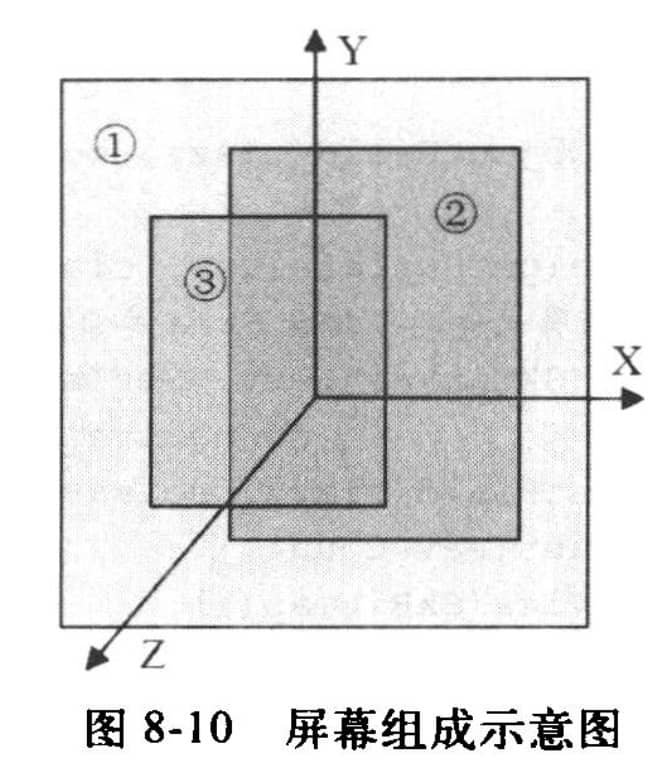

# 概述

Surface系统主要处理：

-   应用程序和Surface的关系。
-   Surface和SurfaceFlinger之间的关系。


-   不论是使用Skia绘制二维图像，还是用OpenGL绘制三维图像，最终Application都要和Surface交互。Surface就像是UI的画布，而App则像是在Surface上作画。

-   Surface向SurfaceFlinger提供数据，而SurfaceFlinger则混合数据。

# Activity的显示

## Activity的创建

一般会在Activity的onCreate回调中设置视图：setContentView。

```java
public void setContentView(@LayoutRes int layoutResID) {
    getWindow().setContentView(layoutResID);
    initWindowDecorActionBar();
}
```

setContentView出现了两个和UI有关系的类：View和Window。

-   Window是一个抽象基类，用于控制顶层窗口的外观和行为。作为顶层窗口它有什么特殊的职能呢？即绘制背景和标题栏、默认的按键处理等。
-   View是一个基本的UI单元，占据屏幕的一块矩形区域，可用于绘制，并能处理事件。

### Window的创建

Window是一个抽象类 ，它的具体实现类为PhoneWindow。

在Activity启动过程中会调用ActivityThread的performLaunchActivity方法，performLaunchActivity方法中又会调用Activity的attach方法，PhoneWindow就是在Activity的attach方法中创建的。

```java
final void attach(Context context, ActivityThread aThread, Instrumentation instr, IBinder token, int ident, Application application, Intent intent, ActivityInfo info, CharSequence title, Activity parent, String id, NonConfigurationInstances lastNonConfigurationInstances, Configuration config, String referrer, IVoiceInteractor voiceInteractor, Window window, ActivityConfigCallback activityConfigCallback) {
    //...
    //创建Window，mWindow是Activity的成员变量，说明一个Activity对应一个Window
    mWindow = new PhoneWindow(this, window, activityConfigCallback);
    //...
    //Window关联WindowManager
    mWindow.setWindowManager((WindowManager)context.getSystemService(Context.WINDOW_SERVICE), mToken, mComponent.flattenToString(), (info.flags & ActivityInfo.FLAG_HARDWARE_ACCELERATED) != 0);
    //...
}
```

这里创建了一个PhoneWindow ，并调用setWindowManager方法设置一个Manager。

### WindowManager的创建

在Window关联WM时会调用setWindowManager方法。

```java
public void setWindowManager(WindowManager wm, IBinder appToken, String appName, boolean hardwareAccelerated) {
    // 。。。
    if (wm == null) {
        //类型为WindowManagerImpl
        wm = (WindowManager)mContext.getSystemService(Context.WINDOW_SERVICE);
    }
    mWindowManager = ((WindowManagerImpl)wm).createLocalWindowManager(this);
}
```

这里会获取一个WindowManagerImpl实例，是WindowManager的具体实现。

WindowManagerImpl内部的操作主要由WindowManagerGlobal来完成。WindowManagerImpl持有Window的引用，可以对Window进行操作，如addView方法。

### DecorView

Window是以View的形式存在的，所以Activity里的Window也需要一个View，这个View就是DecorView，它分为title部分和content部分：


content部分一般是在onCreate里通过setContentView来设置的，里面会调用getDecorView方法：

```java
//PhoneWindow.java
@Override
public final View getDecorView() {
    if (mDecor == null || mForceDecorInstall) {
        installDecor();
    }
    return mDecor;
}
```

当不存在DecorView就会创建一个。

即使没有在onCreate调用setContentView方法，最终也会创建DecorView。performLaunchActivity执行完，界面要与用户进行交互时，会调用ActivityThread的handleResumeActivity方法：

```java
final void handleResumeActivity(IBinder token, boolean clearHide, boolean isForward, boolean reallyResume, int seq, String reason) {
    //...
    r = performResumeActivity(token, clearHide, reason);//performResumeActivity方法最终会调用Activity的onResume方法
        //...
        if (r.window == null && !a.mFinished && willBeVisible) {
            r.window = r.activity.getWindow();
            // 创建decorView
            View decor = r.window.getDecorView();
            // 。。。
        }
}
```

在handleResumeActivity方法中会获取DecorView（如果没有就创建），并通过WM的addView展现出来。这样Activity的Window是以DecorView的形式展现的。

### ViewRootImpl

在WM的addView时会创建ViewRootImpl，然后调用ViewRootImpl的setView。

```java
public void addView(View view, ViewGroup.LayoutParams params, Display display, Window parentWindow, int userId) {    
    ViewRootImpl root;
    // ...
	root = new ViewRootImpl(view.getContext(), display);
}
```

```java
public ViewRootImpl(Context context, Display display) {
    this(context, display, WindowManagerGlobal.getWindowSession(), false);
}

public ViewRootImpl(Context context, Display display, IWindowSession session, boolean useSfChoreographer) {
    mContext = context;
    mWindowSession = session;
    // ....
}
```

mWindowSession是ViewRootImpl的一个成员变量，其值是` WindowManagerGlobal.getWindowSession()`，而WindowManagerGlobal是一个单例对象，所以一个进程中只有一个mWindowSession。

```java
public void setView(View view, WindowManager.LayoutParams attrs, View panelParentView, int userId) {
    synchronized (this) {
        if (mView == null) {
            mView = view;

            // Schedule the first layout -before- adding to the window
            // manager, to make sure we do the relayout before receiving
            // any other events from the system.
            requestLayout();
            
            try {
                // ...
                res = mWindowSession.addToDisplayAsUser(mWindow, mSeq, mWindowAttributes, getHostVisibility(), mDisplay.getDisplayId(), userId, mTmpFrame, mAttachInfo.mContentInsets, mAttachInfo.mStableInsets, mAttachInfo.mDisplayCutout, inputChannel, mTempInsets, mTempControls);
                // ...
            }
	}
}
```

ViewRootImpl主要做这些事：

-   View树的根并管理View树。（代码中的mView，即DecorView）
-   触发View的测量、布局和绘制。（requestLayout）
-   输入事件的中转站。
-   管理Surface。
-   负责与WMS进行进程间通信。

### ViewRootImpl和WMS的交互

frameworks/base/services/core/java/com/android/server/wm/Session.java

```java
public int addToDisplayAsUser(IWindow window, int seq, WindowManager.LayoutParams attrs, int viewVisibility, int displayId, int userId, Rect outFrame, Rect outContentInsets, Rect outStableInsets, DisplayCutout.ParcelableWrapper outDisplayCutout, InputChannel outInputChannel, InsetsState outInsetsState, InsetsSourceControl[] outActiveControls) {
    return mService.addWindow(this, window, seq, attrs, viewVisibility, displayId, outFrame, outContentInsets, outStableInsets, outDisplayCutout, outInputChannel, outInsetsState, outActiveControls, userId);
}
```

然后调用WMS的addWindow：

```java
public int addWindow(Session session, IWindow client, int seq, LayoutParams attrs, int viewVisibility, int displayId, Rect outFrame, Rect outContentInsets, Rect outStableInsets, DisplayCutout.ParcelableWrapper outDisplayCutout, InputChannel outInputChannel, InsetsState outInsetsState, InsetsSourceControl[] outActiveControls, int requestUserId) {
    // ...
    synchronized (mGlobalLock) {
        // ...
        final WindowState win = new WindowState(this, session, client, token, parentWindow, appOp[0], seq, attrs, viewVisibility, session.mUid, userId, session.mCanAddInternalSystemWindow);
        // ...
        win.attach();
        // ...
    }
	// ...
    return res;
}
```

frameworks/base/services/core/java/com/android/server/wm/WindowState.java

```java
void attach() {
    // mSession是Session类型
    mSession.windowAddedLocked(mAttrs.packageName);
}
```

```java
void windowAddedLocked(String packageName) {
    // ...
    if (mSurfaceSession == null) {
        // ...
        mSurfaceSession = new SurfaceSession();
        // ...
    }
    mNumWindow++;
}
```

ViewRootImpl通过IWindowSession与WMS联系，而WMS通过W与ViewRootImpl联系。W是ViewRootImpl的内部静态类，是一个Binder类型。

IWindowSession.aidl的描述：

```
System private per-application interface to the window manager.
```

每个App进程都会和WMS建立一个IWindowSession会话。这个会话被App进程用于和WMS通信。

IWindow.aidl的描述：

```
API back to a client window that the Window Manager uses to inform it of interesting things happening.
```

大意是IWindow是WMS用来进行事件通知的。每当发生一些事情时，WMS就会把这些事情告诉某个IWindow。可以把IWindow想象成一个回调函数。比如按键、触屏等事件。

那么，一个按键事件是如何被分发的呢？下面是它大致的流程：

1.   WMS所在的SystemServer进程接收到按键事件。
2.   WMS找到UI位于屏幕顶端的进程所对应的IWindow对象，这是一个Bp端对象。
3.   调用这个IWindow对象的dispatchKey。IWindow对象的Bn端位于ViewRoot中，ViewRootImpl再根据内部View的位置信息找到真正处理这个事件的View，最后调用dispatchKey函数完成按键的处理。

### Surface

View、DecorView等都是UI单元，这些UI单元的绘画工作都在onDraw函数中完成。如果把onDraw想象成画图过程，那么画布是什么？这块画布就是Surface。SDK文档对Surface类的说明是：

```
Handle onto a raw buffer that is being managed by the screen compositor.
```

这句话的意思是：

-   有一块Raw buffer（内存/显存）
-   Surface操作这块Raw buffer
-   screen compositor（SurfaceFlinger）管理这块Raw buffer。

Surface和SF、ViewRootImpl的关系：


## Activity的UI绘制

ViewRoot的setView函数中会有一个requestLayout：

```java
public void requestLayout() {
    if (!mHandlingLayoutInLayoutRequest) {
        //...
        scheduleTraversals();
    }
}
```

```java
void scheduleTraversals() {
    if (!mTraversalScheduled) {
        // ...
        mChoreographer.postCallback(Choreographer.CALLBACK_TRAVERSAL, mTraversalRunnable, null);
        // ...
    }
}
```

Choreographer用于接收显示系统的VSync信号，在下一个帧渲染时控制执行一些操作。Choreographer的postCallback方法用于发起添加回调，这个添加的回调将在下一帧被渲染时执行。这个添加的回调是TraversalRunnable类型的mTraversalRunnable：

```java
final class TraversalRunnable implements Runnable {
    @Override
    public void run() {
        doTraversal();
    }
}
```

```java
void doTraversal() {
    if (mTraversalScheduled) {
        // ...
        performTraversals();
        // ...
    }
}
```

```java
private void performTraversals() {
        //...
    relayoutResult = relayoutWindow(params, viewVisibility, insetsPending);//relayoutWindow方法内部会调用IWindowSession的relayout方法来更新Window视图，最终会调用WMS的relayoutWindow方法。
        //。。。

    if (!mStopped || mReportNextDraw) {
        //。。。
        performMeasure(childWidthMeasureSpec, childHeightMeasureSpec);//注释2
    }

    if (didLayout) {
          //。。。
        performLayout(lp, mWidth, mHeight);//注释3
    }

    if (!cancelDraw && !newSurface) {
          //。。。
        performDraw();//注释4
    }
}
```

performTraversals方法会在注释2、3、4处分别调用performMeasure、performLayout和performDraw方法，这样就完成了View的绘制流程。

## 总结

1.   Activity和UI有关，它包含一个Window（真实类型是PhoneWindow）和一个WindowManager（真实类型是WindowManagerImpl，具体实现是单例对象WindowManagerGlobal）对象。
2.   Activity的顶层View是DecorView，在onCreate函数中通过setContentView设置的View只不过是这个DecorView中的一部分（Content）。DecorView是一个FrameLayout类型。
3.   ViewRootImpl实现了ViewParent接口，它有两个重要的成员变量，一个是mView，它指向Activity顶层UI单元的DecorView，另外一个是mSurface，这个Surface包含了一个Canvas。
4.   整个Activity的绘图流程就是从mSurface中lock一块Canvas，然后交给mView去自由发挥画画的才能，最后unlockCanvasAndPost释放这块Canvas。

### 个人额外总结

在ViewRootImpl的DecorView（mView）初始化时，会触发View树的重绘（requestLayout）。除此之外，还会将创建的Window和WMS建立联系（`mWindowSession.addToDisplayAsUser`）

应用层的渲染流程时这样的：

1. Activity创建后会创建一个Window，在setContentView或者performLaunchActivity执行完界面要与用户进行交互时会创建一个DecorView，并把这个DecorView add到Window中，同时创建一个ViewRootImpl。
2. 当主线程发起渲染时，ViewRootImpl调用performTraversals发起performMeasure、performLayout和performDraw。
3. ViewRootImpl和WMS交互，获取一块新的Surface。
4. performDraw时，从Surface中lock一块Canvas，然后交给View去draw，最后unlockCanvasAndPost释放这块Canvas。（软件绘制）

### Android中Window、Surface、View的关系

Window相当于一个画框、Surface相当于一个画布，而View相当于绘制的图形。

# 简单分析Surface

## Surface的Java层分析

ViewRootImpl在performTraversals会调用IWindowSession的relayout，ViewRootImpl的代码：

```java
private void performTraversals() {
    relayoutResult = relayoutWindow(params, viewVisibility, insetsPending);
}
```

```java
private int relayoutWindow(WindowManager.LayoutParams params, int viewVisibility, boolean insetsPending) throws RemoteException {
    int relayoutResult = mWindowSession.relayout(/*参数略*/);
    if (mSurfaceControl.isValid()) {
		mSurface.copyFrom(mSurfaceControl);
    } else {
		destroySurface();
    }
    return relayoutResult;
}
```

>   mWindowSession是IWindowSession类型，是一个Binder对象，其aidl文件为frameworks/base/core/java/android/view/IWindowSession.aidl，我尝试生成此文件对应的Java文件，但是没有成功。
>
>   书中提到，在IPC过程中，out并没有传入到服务端，而是传了一个空的对象。在服务端接收的onTransact回调方法中，创建了out对象。

frameworks/base/services/core/java/com/android/server/wm/Session.java的代码：

```java
public int relayout(/*参数略*/) {
    // ...
    int res = mService.relayoutWindow(this, window, seq, attrs,
            requestedWidth, requestedHeight, viewFlags, flags, frameNumber,
            outFrame, outContentInsets, outVisibleInsets,
            outStableInsets, outBackdropFrame, cutout,
            mergedConfiguration, outSurfaceControl, outInsetsState, outActiveControls,
            outSurfaceSize, outBLASTSurfaceControl);
    // ...
    return res;
}
```

frameworks/base/services/core/java/com/android/server/wm/WindowManagerService.java的代码：

```java
public int relayoutWindow(/*参数略*/) {
    
    synchronized (mGlobalLock) {
        final WindowState win = windowForClientLocked(session, client, false);
        if (shouldRelayout) {
            try {
                result = createSurfaceControl(outSurfaceControl, outBLASTSurfaceControl,
                        result, win, winAnimator);
            }
        }
    }
    return result;
}
```

```java
private int createSurfaceControl(SurfaceControl outSurfaceControl,
                                 SurfaceControl outBLASTSurfaceControl, int result,
                                 WindowState win, WindowStateAnimator winAnimator) {
    WindowSurfaceController surfaceController;
    try {
        // 创建本地的WindowSurfaceController对象，内部持有一个SurfaceControl对象
        surfaceController = winAnimator.createSurfaceLocked(win.mAttrs.type, win.mOwnerUid);
    }
    if (surfaceController != null) {
		surfaceController.getSurfaceControl(outSurfaceControl);
		surfaceController.getBLASTSurfaceControl(outBLASTSurfaceControl);
	} else {
       outSurfaceControl.release();
	}
    return result;
}
```

frameworks/base/services/core/java/com/android/server/wm/WindowStateAnimator.java的代码：

```java
WindowSurfaceController createSurfaceLocked(int windowType, int ownerUid) {
    final WindowState w = mWin;
    if (mSurfaceController != null) {
        return mSurfaceController;
    }
    // 。。。
    try {
        mSurfaceController = new WindowSurfaceController(attrs.getTitle().toString(), width,
                height, format, flags, this, windowType, ownerUid);
        // 。。。
    }
    // 。。。
    return mSurfaceController;
}
```

frameworks/base/services/core/java/com/android/server/wm/WindowSurfaceController.java

```java
WindowSurfaceController(String name, int w, int h, int format,
                        int flags, WindowStateAnimator animator, int windowType, int ownerUid) {
    // ...
    final SurfaceControl.Builder b = win.makeSurface()
            .setParent(win.getSurfaceControl())
            .setName(name)
            .setBufferSize(w, h)
            .setFormat(format)
            .setFlags(flags)
            .setMetadata(METADATA_WINDOW_TYPE, windowType)
            .setMetadata(METADATA_OWNER_UID, ownerUid)
            .setCallsite("WindowSurfaceController");
    mSurfaceControl = b.build();
    //。。。
}
```

```java
void getSurfaceControl(SurfaceControl outSurfaceControl) {
        outSurfaceControl.copyFrom(mSurfaceControl, "WindowSurfaceController.getSurfaceControl");
}
```

将本地的SurfaceControl信息拷贝到outSurfaceControl。

```java
public void copyFrom(@NonNull SurfaceControl other, String callsite) {
    mName = other.mName;
    mWidth = other.mWidth;
    mHeight = other.mHeight;
    mLocalOwnerView = other.mLocalOwnerView;
    // 主要调用了Native方法
    assignNativeObject(nativeCopyFromSurfaceControl(other.mNativeObject), callsite);
}
```

最后回到ViewRootImpl的relayoutWindow：

```java
private int relayoutWindow(WindowManager.LayoutParams params, int viewVisibility,
        boolean insetsPending) throws RemoteException {
    int relayoutResult = mWindowSession.relayout(mWindow, mSeq, params,
            (int) (mView.getMeasuredWidth() * appScale + 0.5f),
            (int) (mView.getMeasuredHeight() * appScale + 0.5f), viewVisibility,
            insetsPending ? WindowManagerGlobal.RELAYOUT_INSETS_PENDING : 0, frameNumber,
            mTmpFrame, mPendingOverscanInsets, mPendingContentInsets, mPendingVisibleInsets,
            mPendingStableInsets, mPendingOutsets, mPendingBackDropFrame, mPendingDisplayCutout,
            mPendingMergedConfiguration, mSurfaceControl, mTempInsets);
    if (mSurfaceControl.isValid()) {
		mSurface.copyFrom(mSurfaceControl);
    } else {
		destroySurface();
    }
    return relayoutResult;
}
```

调用Surface的copyFrom，将SurfaceControl的内容拷贝到Surface中。

### 小结

>   以上代码和书中的代码差别很大，书中是对Surface进行操作。而Android 11（看的是Android 11源码，不一定是从Android 11开始的）的代码是对SurfaceController进行操作。
>
>   TODO 最新代码涉及到的类和书中的大不相同，有时间再次整理一下。

**应用进程的流程**

ViewRootImpl内部有Surface和SurfaceControl变量，其创建用的无参构造方法。在通过IWindowSession与WMS交互过程中，将SurfaceControl传入到WMS中。

这部分涉及到aidl，aosp里没有aidl编译过的源码。书中提到，输入的对象实际上没有传到WMS中，而是WMS new了一个新对象。这部分我没有用aidl验证，但也可以理解，因为不是同一个进程，同一个对象不能随意的传输。

IPC完成，调用Surface的copyFrom，将SurfaceControl的内容拷贝到Surface中。

SurfaceControl实现了Parcelable接口，说明此对象可以IPC。

**WMS的流程**

IWindowSession的实例Session接收到SurfaceControl对象（out）后，创建一个WMS中的WindowSurfaceController，这个WindowSurfaceController内部持有了SurfaceControl对象。然后通过SurfaceControl的copyFrom方法将WindowSurfaceController的内容拷贝到out中。

这个out虽然是在WMS中新创建的，但是通过aidl，内容又重新写回到应用进程中的SurfaceControl。


## Surface的JNI层分析

### Surface的无参构造方法

```java
private final Canvas mCanvas = new CompatibleCanvas();

public Surface() {
}
```

### SurfaceSession的无参构造方法

在前面addWindow过程中，WMS会创建一个SurfaceSession：

```java
private long mNativeClient; // SurfaceComposerClient*

private static native long nativeCreate();

public SurfaceSession() {
    mNativeClient = nativeCreate();
}

```

nativeCreate的JNI实现，frameworks/base/core/jni/android_view_SurfaceSession.cpp：

```cpp
static jlong nativeCreate(JNIEnv* env, jclass clazz) {
    // 创建一个SurfaceComposerClient对象
    SurfaceComposerClient* client = new SurfaceComposerClient();
    client->incStrong((void*)nativeCreate);
    return reinterpret_cast<jlong>(client);// Java层保存该对象的指针
}
```

### SurfaceControl的无参构造方法

```java
public long mNativeObject;
private long mNativeHandle;

public SurfaceControl() {
}
```

### SurfaceControl的有参构造方法

```java
public long mNativeObject;
private long mNativeHandle;

private SurfaceControl(SurfaceSession session, String name, int w, int h, int format, int flags, SurfaceControl parent, SparseIntArray metadata, WeakReference<View> localOwnerView, String callsite) throws OutOfResourcesException, IllegalArgumentException {
    // ...
    Parcel metaParcel = Parcel.obtain();
    try {
        // ...
        mNativeObject = nativeCreate(session, name, w, h, format, flags,
                parent != null ? parent.mNativeObject : 0, metaParcel);
    } finally {
        metaParcel.recycle();
    }
    // ...
    mNativeHandle = nativeGetHandle(mNativeObject);
}
```

frameworks/base/core/jni/android_view_SurfaceControl.cpp

```cpp
static jlong nativeCreate(JNIEnv* env, jclass clazz, jobject sessionObj, jstring nameStr, jint w, jint h, jint format, jint flags, jlong parentObject, jobject metadataParcel) {
    // SurfaceSession里会创建一个SurfaceComposerClient（见上），这里就是获取传入的参数sessionObj的SurfaceComposerClient
    sp<SurfaceComposerClient> client;
    if (sessionObj != NULL) {
        client = android_view_SurfaceSession_getClient(env, sessionObj);
    } else {
        client = SurfaceComposerClient::getDefault();
    }
    SurfaceControl *parent = reinterpret_cast<SurfaceControl*>(parentObject);
    sp<SurfaceControl> surface;
    // 创建一个SurfaceControl类型的对象
    status_t err = client->createSurfaceChecked(
    String8(name.c_str()), w, h, format, &surface, flags, parent, std::move(metadata));
    // ...
    surface->incStrong((void *)nativeCreate);
    // 将此SurfaceControl对象的指针返回给Java对象
    return reinterpret_cast<jlong>(surface.get());
}
```

### SurfaceControl的copyFrom

```java
public void copyFrom(@NonNull SurfaceControl other, String callsite) {
    mName = other.mName;
    mWidth = other.mWidth;
    mHeight = other.mHeight;
    mLocalOwnerView = other.mLocalOwnerView;
    assignNativeObject(nativeCopyFromSurfaceControl(other.mNativeObject), callsite);
}
```

WMS进程会把WMS进程的SurfaceControl拷贝到out中，而copyFrom主要也是native方法：

```java
static jlong nativeCopyFromSurfaceControl(JNIEnv* env, jclass clazz, jlong surfaceControlNativeObj) {
    sp<SurfaceControl> surface(reinterpret_cast<SurfaceControl *>(surfaceControlNativeObj));
    if (surface == nullptr) {
        return 0;
    }

    sp<SurfaceControl> newSurface = new SurfaceControl(surface);
    newSurface->incStrong((void *)nativeCreate);
    return reinterpret_cast<jlong>(newSurface.get());
}
```

就是简单的clone一下。

### SurfaceControl的IPC

上面分析到，这里的创建、拷贝的对象都是在WMS进程中的，不能直接传输到应用进程。而我这无法使用AIDL工具，所以就照着书里的内容推测一下实际的做法。

1.   write把SurfaceControl中的信息写到Parcel包中，然后利用Binder通信传递到对端，对端通过readFromParcel来处理Parcel包。
2.   根据服务端传递的Parcel包来构造一个新的SurfaceControl。

### Surface的copyFrom

```java
public void copyFrom(SurfaceControl other) {
    // ...
    long surfaceControlPtr = other.mNativeObject;
    long newNativeObject = nativeGetFromSurfaceControl(mNativeObject, surfaceControlPtr);
	// ...
}
```

```cpp
static jlong nativeGetFromSurfaceControl(JNIEnv* env, jclass clazz,
                                         jlong nativeObject,
                                         jlong surfaceControlNativeObj) {
    Surface* self(reinterpret_cast<Surface *>(nativeObject));
    sp<SurfaceControl> ctrl(reinterpret_cast<SurfaceControl *>(surfaceControlNativeObj));
    // ...
    return reinterpret_cast<jlong>(surface.get());
}
```

也没有什么复杂的逻辑，就是新创建一个Native Surface对象。

## Surface创建总结

结合Java层和JNI层的分析，ViewRootImpl在performTraversals调用的relayoutWindow方法，实际上是通过IPC机制，得到了一个新的Native Surface对象。

## Surface和画图

```java
private void performTraversals() {
    if (!cancelDraw) {
        // ...
        performDraw();
    }
	// ..
}
```

```java
private void performDraw() {
    try {
         // ...
         boolean canUseAsync = draw(fullRedrawNeeded);
         // ...
     }
}
```

```java
private boolean draw(boolean fullRedrawNeeded) {
    Surface surface = mSurface;
    // ...
    if (!drawSoftware(surface, mAttachInfo, xOffset, yOffset, scalingRequired, dirty, surfaceInsets)) {
		return false;
    }
	// ...
    return useAsyncReport;
}
```

```java
private boolean drawSoftware(Surface surface, AttachInfo attachInfo, int xoff, int yoff, boolean scalingRequired, Rect dirty, Rect surfaceInsets) {
    final Canvas canvas;
	// ...
    canvas = mSurface.lockCanvas(dirty);
    // ...
    surface.unlockCanvasAndPost(canvas);
    // ...
    return true;
}
```

在ViewRootImpl的performTraversals的draw方法里，最终会调用Surface的lockCanvas和unlockCanvasAndPost。

### lockCanvas

```java
public Canvas lockCanvas(Rect inOutDirty) throws Surface.OutOfResourcesException, IllegalArgumentException {
    synchronized (mLock) {
        // ...
        mLockedObject = nativeLockCanvas(mNativeObject, mCanvas, inOutDirty);
        return mCanvas;
    }
}
```

```cpp
static jlong nativeLockCanvas(JNIEnv* env, jclass clazz, jlong nativeObject, jobject canvasObj, jobject dirtyRectObj) {
    // 从Java中的Surface对象中，取出费尽千辛万苦得到的Native的Surface对象。
    sp<Surface> surface(reinterpret_cast<Surface *>(nativeObject));
	// ...

    Rect dirtyRect(Rect::EMPTY_RECT);
    Rect* dirtyRectPtr = NULL;

    // dirtyRectObj表示需要重绘的矩形块，下面根据这个dirtyRectObj设置dirtyRect
    if (dirtyRectObj) {
        dirtyRect.left   = env->GetIntField(dirtyRectObj, gRectClassInfo.left);
        dirtyRect.top    = env->GetIntField(dirtyRectObj, gRectClassInfo.top);
        dirtyRect.right  = env->GetIntField(dirtyRectObj, gRectClassInfo.right);
        dirtyRect.bottom = env->GetIntField(dirtyRectObj, gRectClassInfo.bottom);
        dirtyRectPtr = &dirtyRect;
    }

    ANativeWindow_Buffer buffer;
    status_t err = surface->lock(&buffer, dirtyRectPtr);
    // ...
    graphics::Canvas canvas(env, canvasObj);
    canvas.setBuffer(&buffer, static_cast<int32_t>(surface->getBuffersDataSpace()));
	// ...
    sp<Surface> lockedSurface(surface);
    lockedSurface->incStrong(&sRefBaseOwner);
    return (jlong) lockedSurface.get();
}
```

先获得一块存储区域（buffer），然后将它和Canvas绑定到一起，这样，UI绘画的结果就记录在这块存储区域里了。

### unlockCanvasAndPost

```java
public void unlockCanvasAndPost(Canvas canvas) {
    //...
    unlockSwCanvasAndPost(canvas);
}
```

```java
private void unlockSwCanvasAndPost(Canvas canvas) {
    // ...
    nativeUnlockCanvasAndPost(mLockedObject, canvas);
    // ...
}
```

对应的native方法：

```cpp
static void nativeUnlockCanvasAndPost(JNIEnv* env, jclass clazz,
                                     jlong nativeObject, jobject canvasObj) {
    // 取出Native的Surface对象
    sp<Surface> surface(reinterpret_cast<Surface *>(nativeObject));
    if (!isSurfaceValid(surface)) {
        return;
    }

    // 释放Surface中的buffer
    graphics::Canvas canvas(env, canvasObj);
    canvas.setBuffer(nullptr, ADATASPACE_UNKNOWN);

    // 解锁Surface
    status_t err = surface->unlockAndPost();
    if (err < 0) {
        jniThrowException(env, IllegalArgumentException, NULL);
    }
}
```

### 小结

1.   先获得一块存储区域（buffer），然后将它和Canvas绑定到一起。这样，UI绘画的结果就记录在这块存储区域里了。
2.   当UI绘制结束，释放buffer。

# 深入分析Surface

## 与Surface相关的基础知识介绍

### 显示层（Layer）和屏幕组成



-   屏幕位于一个三维坐标系中，其中Z轴从屏幕内指向屏幕外。
-   编号为1、2、3的矩形块叫显示层（Layer）。每一层有自己的属性，例如颜色、透明度、所处屏幕的位置、宽、高等。除了属性之外，每一层还有自己对应的显示内容，也就是需要显示的图像。

在Android中，Surface系统工作时，会由SurfaceFlinger对这些按照Z轴排好序的显示层进行图像混合，混合后的图像就是在屏幕上看到的美妙画面了。

### PageFlipping

图形/图像数据是一帧一帧的，是有边界的，所以在图形/图像数据的生产/消费过程中，使用了一种叫PageFlipping的技术。PageFlipping的中文名叫画面交换，其操作过程如下所示：

-   分配一个能容纳两帧数据的缓冲，前面一个缓冲叫FrontBuffer，后面一个缓冲叫BackBuffer。
-   消费者使用FrontBuffer中的旧数据，而生产者用新数据填充BackBuffer，二者互不干扰。
-   当需要更新显示时，BackBuffer变成FrontBuffer，FrontBuffer变成BackBuffer。如此循环，这样就总能显示最新的内容了。这个过程很像平常的翻书动作，所以它被形象地称为PageFlipping。

## SurfaceComposerClient分析

### SurfaceSession构造方法

addWindow过程中，WMS会创建一个SurfaceSession。SurfaceSession构造方法，主要目的就是创建SurfaceComposerClient。

```java
private long mNativeClient; // SurfaceComposerClient*

private static native long nativeCreate();

public SurfaceSession() {
    mNativeClient = nativeCreate();
}
```

nativeCreate的JNI实现，frameworks/base/core/jni/android_view_SurfaceSession.cpp：

```cpp
static jlong nativeCreate(JNIEnv* env, jclass clazz) {
    // 创建一个SurfaceComposerClient对象
    SurfaceComposerClient* client = new SurfaceComposerClient();
    client->incStrong((void*)nativeCreate);
    return reinterpret_cast<jlong>(client);// Java层保存该对象的指针
}
```

system/core/libutils/RefBase.cpp

SurfaceComposerClient的基类是RefBase，incStrong方法如下：

```cpp
void RefBase::incStrong(const void* id) const
    {
        // 。。。
        refs->mBase->onFirstRef();
    }
```

在incStrong函数中，会调用SurfaceComposerClient的onFirstRef函数。

### SurfaceComposerClient构造函数

SurfaceComposerClient这个对象会和SurfaceFlinger进行交互，因为SurfaceFlinger派生于SurfaceComposer。

```cpp
SurfaceComposerClient::SurfaceComposerClient()
: mStatus(NO_INIT)
{}

void SurfaceComposerClient::onFirstRef() {
    // getComposerService返回SF的Binder代理端的BpSurfaceFlinger对象。
    sp<ISurfaceComposer> sf(ComposerService::getComposerService());
    if (sf != nullptr && mStatus == NO_INIT) {
        sp<ISurfaceComposerClient> conn;
        // 调用SF的createConnection()
        conn = sf->createConnection();
        if (conn != nullptr) {
            mClient = conn;
            mStatus = NO_ERROR;
        }
    }
}
```

frameworks/native/libs/gui/include/private/gui/ComposerService.h

```cpp
// This holds our connection to the composer service (i.e. SurfaceFlinger).
// If the remote side goes away, we will re-establish the connection.
// Users of this class should not retain the value from
// getComposerService() for an extended period.
//
// (It's not clear that using Singleton is useful here anymore.)
    class ComposerService : public Singleton<ComposerService>
    {
        // ....
        friend class Singleton<ComposerService>;
        public:

        // Get a connection to the Composer Service.  This will block until
        // a connection is established.
        static sp<ISurfaceComposer> getComposerService();
    };
```

从ComposerService的注释中可以看出SF运行在composer service中。SurfaceComposerClient建立了和SF的交互通道。

### createConnection

frameworks/native/services/surfaceflinger/SurfaceFlinger.cpp：

```cpp
sp<ISurfaceComposerClient> SurfaceFlinger::createConnection() {
	const sp<Client> client = new Client(this);
    return client->initCheck() == NO_ERROR ? client : nullptr;
}
```

### 小结

应用程序进程与WMS联系，而WMS与SF进程联系。

## SurfaceControl分析

### SurfaceControl的创建

SurfaceControl在Java层的创建有2处。一处是在应用层，用的是无参构造方法，另一个是在WMS中，用的是有参构造方法。

```java
public long mNativeObject;
private long mNativeHandle;

private SurfaceControl(SurfaceSession session, String name, int w, int h, int format, int flags, SurfaceControl parent, SparseIntArray metadata, WeakReference<View> localOwnerView, String callsite) throws OutOfResourcesException, IllegalArgumentException {
    // ...
    Parcel metaParcel = Parcel.obtain();
    try {
        // ...
        mNativeObject = nativeCreate(session, name, w, h, format, flags,
                parent != null ? parent.mNativeObject : 0, metaParcel);
    } finally {
        metaParcel.recycle();
    }
    // ...
    mNativeHandle = nativeGetHandle(mNativeObject);
}
```

frameworks/base/core/jni/android_view_SurfaceControl.cpp

```cpp
static jlong nativeCreate(JNIEnv* env, jclass clazz, jobject sessionObj, jstring nameStr, jint w, jint h, jint format, jint flags, jlong parentObject, jobject metadataParcel) {
    // SurfaceSession里会创建一个SurfaceComposerClient，这里就是获取传入的参数sessionObj的SurfaceComposerClient
    sp<SurfaceComposerClient> client;
    if (sessionObj != NULL) {
        client = android_view_SurfaceSession_getClient(env, sessionObj);
    } else {
        client = SurfaceComposerClient::getDefault();
    }
    SurfaceControl *parent = reinterpret_cast<SurfaceControl*>(parentObject);
    sp<SurfaceControl> surface;
    // 创建一个SurfaceControl类型的对象
    status_t err = client->createSurfaceChecked(String8(name.c_str()), w, h, format, &surface, flags, parent, std::move(metadata));
    // ...
    surface->incStrong((void *)nativeCreate);
    // 将此SurfaceControl对象的指针返回给Java对象
    return reinterpret_cast<jlong>(surface.get());
}
```

在Java层的有参构造方法中，最终调用了SurfaceComposerClient的createSurfaceChecked函数创建SurfaceControl对象。

```cpp
status_t SurfaceComposerClient::createSurfaceChecked(/*参数略*/) {
    sp<SurfaceControl> sur;
    status_t err = mStatus;

    if (mStatus == NO_ERROR) {
        sp<IBinder> handle;
        sp<IBinder> parentHandle;
        sp<IGraphicBufferProducer> gbp;
        // ...
        // 这个Client就是上面分析中的，与SF交互的Client
        err = mClient->createSurface(/*参数略*/);
        // ...
        if (err == NO_ERROR) {
        	*outSurface = new SurfaceControl(this, handle, gbp, transformHint);
        }
    }
    return err;
}
```

创建SurfaceControl之前调用了Client的createSurface函数。

### Client的createSurface

frameworks/native/services/surfaceflinger/Client.cpp

```cpp
status_t Client::createSurface(const String8& name, uint32_t w, uint32_t h, PixelFormat format, uint32_t flags, const sp<IBinder>& parentHandle, LayerMetadata metadata, sp<IBinder>* handle, sp<IGraphicBufferProducer>* gbp, uint32_t* outTransformHint) {
    return mFlinger->createLayer(name, this, w, h, format, flags, std::move(metadata), handle, gbp, parentHandle, nullptr, outTransformHint);
}
```

通过IPC，在SF进程中执行createLayer函数：

### SurfaceFlinger的createLayer

frameworks/native/services/surfaceflinger/SurfaceFlinger.cpp

```cpp
status_t SurfaceFlinger::createLayer(const String8& name, const sp<Client>& client, uint32_t w, uint32_t h, PixelFormat format, uint32_t flags, LayerMetadata metadata, sp<IBinder>* handle, sp<IGraphicBufferProducer>* gbp, const sp<IBinder>& parentHandle, const sp<Layer>& parentLayer, uint32_t* outTransformHint) {
    // 。。。
    status_t result = NO_ERROR;
    sp<Layer> layer;
    // 。。。
    switch (flags & ISurfaceComposerClient::eFXSurfaceMask) {
        case ISurfaceComposerClient::eFXSurfaceBufferQueue:
            result = createBufferQueueLayer(client, std::move(uniqueName), w, h, flags, std::move(metadata), format, handle, gbp, &layer);
            break;
        case ISurfaceComposerClient::eFXSurfaceBufferState:
            result = createBufferStateLayer(client, std::move(uniqueName), w, h, flags, std::move(metadata), handle, &layer);
            break;
        case ISurfaceComposerClient::eFXSurfaceEffect:
            //。。。
            result = createEffectLayer(client, std::move(uniqueName), w, h, flags, std::move(metadata), handle, &layer);
            break;
        case ISurfaceComposerClient::eFXSurfaceContainer:
            // 。。。
            result = createContainerLayer(client, std::move(uniqueName), w, h, flags, std::move(metadata), handle, &layer);
            break;
        default:
            result = BAD_VALUE;
            break;
    }
	// 。。。
    result = addClientLayer(client, *handle, *gbp, layer, parentHandle, parentLayer, addToCurrentState, outTransformHint);
    return result;
}
```

```cpp
status_t SurfaceFlinger::addClientLayer(const sp<Client>& client, const sp<IBinder>& handle, const sp<IGraphicBufferProducer>& gbc, const sp<Layer>& lbc, const sp<IBinder>& parentHandle, const sp<Layer>& parentLayer, bool addToCurrentState, uint32_t* outTransformHint) {
    // add this layer to the current state list
    {
        // 。。。
        if (parent == nullptr && addToCurrentState) {
            mCurrentState.layersSortedByZ.add(lbc);
        } 
        // ...
        if (gbc != nullptr) {
            mGraphicBufferProducerList.insert(IInterface::asBinder(gbc).get());
            // 。。。
        }
		// 。。。
    }

    // attach this layer to the client
    client->attachLayer(handle, lbc);

    return NO_ERROR;
}
```

frameworks/native/services/surfaceflinger/Client.cpp

```cpp
void Client::attachLayer(const sp<IBinder>& handle, const sp<Layer>& layer)
{
    Mutex::Autolock _l(mLock);
    mLayers.add(handle, layer);
}
```

createLayer根据flag创建不同的Layer，Layer用于标示一个图层。

addClientLayer将创建的Layer保存到当前State的Z秩序列表layersSortedByZ中，同时将这个Layer所对应的IGraphicBufferProducer本地Binder对象gbp保存到SurfaceFlinger的成员变量mGraphicBufferProducerList中。

除了SurfaceFlinger需要统一管理系统中创建的所有Layer对象外，专门为每个应用程序进程服务的Client也需要统一管理当前应用程序进程所创建的Layer，因此在addClientLayer函数里还会通过`Client::attachLayer`将创建的Layer保存到Client的成员变量mLayers表中。

### 创建SurfaceControl对象

还是上面的代码，间隔有点远，复制了一下

```cpp
status_t SurfaceComposerClient::createSurfaceChecked(/*参数略*/) {
    sp<SurfaceControl> sur;
    status_t err = mStatus;

    if (mStatus == NO_ERROR) {
        sp<IBinder> handle;
        sp<IBinder> parentHandle;
        sp<IGraphicBufferProducer> gbp;
        // ...
        // 这个Client就是上面分析中的，与SF交互的Client
        err = mClient->createSurface(/*参数略*/);
        // ...
        if (err == NO_ERROR) {
        	*outSurface = new SurfaceControl(this, handle, gbp, transformHint);
        }
    }
    return err;
}
```

创建完Layer后，执行SurfaceControl构造函数，创建SurfaceControl对象。

```cpp
SurfaceControl::SurfaceControl(const sp<SurfaceComposerClient>& client, const sp<IBinder>& handle, const sp<IGraphicBufferProducer>& gbp, uint32_t transform)
      : mClient(client),
        mHandle(handle),
        mGraphicBufferProducer(gbp),
        mTransformHint(transform) {}
```

### 创建Layer对象

在`SurfaceFlinger::createLayer`中会根据不同的flag创建不同的Layer。以createBufferQueueLayer为例进行分析：

```cpp
status_t SurfaceFlinger::createBufferQueueLayer(const sp<Client>& client, std::string name, uint32_t w, uint32_t h, uint32_t flags, LayerMetadata metadata, PixelFormat& format, sp<IBinder>* handle, sp<IGraphicBufferProducer>* gbp, sp<Layer>* outLayer) {
    // ...
    sp<BufferQueueLayer> layer;
    // ...
    layer = getFactory().createBufferQueueLayer(args);
    // ...
    if (err == NO_ERROR) {
        *handle = layer->getHandle();
        // 在这里，对生产者Buffer进行了赋值
        *gbp = layer->getProducer();
        *outLayer = layer;
    }
    return err;
}
```

frameworks/native/services/surfaceflinger/SurfaceFlingerDefaultFactory.cpp

```cpp
sp<BufferQueueLayer> DefaultFactory::createBufferQueueLayer(const LayerCreationArgs& args) {
    return new BufferQueueLayer(args);
}
```

frameworks/native/services/surfaceflinger/BufferQueueLayer.cpp

```cpp
BufferQueueLayer::BufferQueueLayer(const LayerCreationArgs& args) : BufferLayer(args) {}

void BufferQueueLayer::onFirstRef() {
    BufferLayer::onFirstRef();

    // Creates a custom BufferQueue for SurfaceFlingerConsumer to use
    sp<IGraphicBufferProducer> producer;
    sp<IGraphicBufferConsumer> consumer;
    mFlinger->getFactory().createBufferQueue(&producer, &consumer, true);
    mProducer = mFlinger->getFactory().createMonitoredProducer(producer, mFlinger, this);
    mConsumer = mFlinger->getFactory().createBufferLayerConsumer(consumer, mFlinger->getRenderEngine(), mTextureName, this);
    // ...
}
```

frameworks/native/services/surfaceflinger/SurfaceFlingerDefaultFactory.cpp

```cpp
void DefaultFactory::createBufferQueue(sp<IGraphicBufferProducer>* outProducer,
                                       sp<IGraphicBufferConsumer>* outConsumer,
                                       bool consumerIsSurfaceFlinger) {
    BufferQueue::createBufferQueue(outProducer, outConsumer, consumerIsSurfaceFlinger);
}
```

frameworks/native/libs/gui/BufferQueue.cpp

```cpp
void BufferQueue::createBufferQueue(sp<IGraphicBufferProducer>* outProducer,
        sp<IGraphicBufferConsumer>* outConsumer,
        bool consumerIsSurfaceFlinger) {
    // ...
    sp<BufferQueueCore> core(new BufferQueueCore());
    // ...
    sp<IGraphicBufferProducer> producer(new BufferQueueProducer(core, consumerIsSurfaceFlinger));
    // ...
    sp<IGraphicBufferConsumer> consumer(new BufferQueueConsumer(core));
    // ...
    *outProducer = producer;
    *outConsumer = consumer;
}
```

### 小结

在处理SurfaceControl创建期间，会创建一个图层。

## lockCanvas和unlockCanvasAndPost

在ViewRootImpl的performTraversals的draw方法里，最终会调用Surface的lockCanvas和unlockCanvasAndPost。

### lockCanvas

```java
public Canvas lockCanvas(Rect inOutDirty) {
    synchronized (mLock) {
        // ...
        mLockedObject = nativeLockCanvas(mNativeObject, mCanvas, inOutDirty);
        return mCanvas;
    }
}
```

```cpp
static jlong nativeLockCanvas(JNIEnv* env, jclass clazz, jlong nativeObject, jobject canvasObj, jobject dirtyRectObj) {
    // 从Java中的Surface对象中，取出Native的Surface对象。
    sp<Surface> surface(reinterpret_cast<Surface *>(nativeObject));
	// ...
    Rect dirtyRect(Rect::EMPTY_RECT);
    Rect* dirtyRectPtr = NULL;
    //...
    ANativeWindow_Buffer buffer;
    status_t err = surface->lock(&buffer, dirtyRectPtr);
    // ...
    graphics::Canvas canvas(env, canvasObj);
    canvas.setBuffer(&buffer, static_cast<int32_t>(surface->getBuffersDataSpace()));
	// ...
    sp<Surface> lockedSurface(surface);
    lockedSurface->incStrong(&sRefBaseOwner);
    return (jlong) lockedSurface.get();
}
```

UI在绘制前都需要通过lockCanvas得到一块存储空间。这个过程中最终会调用Surface的lock函数。

```cpp
status_t err = surface->lock(&buffer, dirtyRectPtr);
```

frameworks/native/libs/gui/Surface.cpp

```cpp
status_t Surface::lock(ANativeWindow_Buffer* outBuffer, ARect* inOutDirtyBounds) {
    // ...
    ANativeWindowBuffer* out;
    // 从2个元素的缓冲队列dequeueBuffer取出一个空闲缓冲
    status_t err = dequeueBuffer(&out, &fenceFd);
    
    if (err == NO_ERROR) {
        // 注意这个backBuffer
        sp<GraphicBuffer> backBuffer(GraphicBuffer::getSelf(out));
        // 。。。

    	const sp<GraphicBuffer>& frontBuffer(mPostedBuffer);
    	const bool canCopyBack = ...;
        if (canCopyBack) {
            // copy the area that is invalid and not repainted this round
        	const Region copyback(mDirtyRegion.subtract(newDirtyRegion));
            if (!copyback.isEmpty()) {
                // 把frontBuffer中的数据拷贝到BackBuffer中
                copyBlt(backBuffer, frontBuffer, copyback, &fenceFd);
            }
        }
		// ...
        void* vaddr;
        // 内存地址被赋值给了vaddr，后续的作画将在这块内存上展开。
        status_t res = backBuffer->lockAsync( GRALLOC_USAGE_SW_READ_OFTEN | GRALLOC_USAGE_SW_WRITE_OFTEN, newDirtyRegion.bounds(), &vaddr, fenceFd);

        // ...
        if (res != 0) {
            err = INVALID_OPERATION;
        } else {
            mLockedBuffer = backBuffer;
            outBuffer->width  = backBuffer->width;
            outBuffer->height = backBuffer->height;
            outBuffer->stride = backBuffer->stride;
            outBuffer->format = backBuffer->format;
            outBuffer->bits   = vaddr;// 最重要的是这个内存地址
        }
    }
    return err;
}
```

在上面的代码中，列出了三个关键点：

-   调用dequeueBuffer得到一个空闲缓冲，也可以叫空闲缓冲出队。
-   调用lockAsync。
-   调用copyBlt函数，把frontBuffer数据拷贝到backBuffer中。

dequeueBuffer的目的很简单，就是选取一个空闲的Buffer，其代码如下所示：

```cpp
int Surface::dequeueBuffer(android_native_buffer_t** buffer, int* fenceFd) {
    // ...
    int buf = -1;
    // dequeueBuffer
    status_t result = mGraphicBufferProducer->dequeueBuffer(&buf, &fence, dqInput.width, dqInput.height, dqInput.format, dqInput.usage, &mBufferAge, dqInput.getTimestamps ? &frameTimestamps : nullptr);
    // ...
    sp<GraphicBuffer>& gbuf(mSlots[buf].buffer);
    // ...
    if ((result & IGraphicBufferProducer::BUFFER_NEEDS_REALLOCATION) || gbuf == nullptr) {
        // ...
        // requestBuffer
        result = mGraphicBufferProducer->requestBuffer(buf, &gbuf);
        // ...
    }

    *buffer = gbuf.get();
	// ...
    mDequeuedSlots.insert(buf);
    return OK;
}
```

小结：

from zsy：lockCanvas的主要作用是：

1.   调用GraphicBuffer生产者的dequeueBuffer函数申请一块GraphicBuffer。
2.   调用GraphicBuffer生产者的requestBuffer函数获取GraphicBuffer。

### unlockCanvasAndPost

```java
public void unlockCanvasAndPost(Canvas canvas) {
    // ...
    unlockSwCanvasAndPost(canvas);
    // ...
}
```

```java
private void unlockSwCanvasAndPost(Canvas canvas) {
    // ...
    nativeUnlockCanvasAndPost(mLockedObject, canvas);
    // ...
}
```

nativeUnlockCanvasAndPost是一个native方法，对应的JNI函数：

frameworks/base/core/jni/android_view_Surface.cpp

```cpp
static void nativeUnlockCanvasAndPost(JNIEnv* env, jclass clazz,
                                     jlong nativeObject, jobject canvasObj) {
    // 。。。
    // 解锁Surface
    status_t err = surface->unlockAndPost();
    // 。。。
}
```

frameworks/native/libs/gui/Surface.cpp

```cpp
status_t Surface::unlockAndPost(){
    // ...
    err = queueBuffer(mLockedBuffer.get(), fd);
    // ...
    return err;
}
```

````cpp
int Surface::queueBuffer(android_native_buffer_t* buffer, int fenceFd) {
    // ...
    status_t err = mGraphicBufferProducer->queueBuffer(i, input, &output);
    // ...
    return err;
}
````

小结：

from zsy：unlockCanvasAndPost的主要作用是将填充完图形数据的GraphicBuffer进行queueBuffer，将其放入队列中，等待消费者去消费。

### 小结

from zsy：lockCanvas和unlockCanvasAndPost两者的作用就是生产者-消费者模型中生产者的一环，用来生产GraphicBuffer。

## 总结

1.   在应用进程和WMS联系过程中，WMS也会和SF进程建立联系。
2.   上面说到，ViewRootImpl在relayoutWindow中获得了一个新的native Surface对象，在创建该Surface对象过程中，SF会创建对应的Layer。
3.   在Surface的lock和unlock过程中，完成了生产者-消费者模型中生产者的部分，生产了一个Buffer。

# GraphicBuffer介绍

GraphicBuffer是Surface系统中一个高层次的显示内存管理类，它封装了和硬件相关的一些细节，简化了应用层的处理逻辑。

### GraphicBuffer结构

```cpp
class GraphicBuffer
    : public ANativeObjectBase<ANativeWindowBuffer, GraphicBuffer, RefBase>,
      public Flattenable<GraphicBuffer>
```

GraphicBuffer的继承结构：

1.   继承ANativeWindowBuffer，ANativeWindowBuffer本质是一个android_native_buffer_t类型的结构体
2.   从Flattenable派生使GraphicBuffer支持序列化，它的flatten和unflatten函数用于序列化和反序列化，这样，GraphicBuffer的信息就可以存储到Parcel包中并被Binder传输了。

```cpp
typedef struct ANativeWindowBuffer
{
	// ...
	// 这个android_native_base_t是struct的第一个成员，根据C/C++编译的特性可知，这个成员在它的派生类对象所占有的内存中也是排第一个。
    struct android_native_base_t common;

    int width;
    int height;
    int stride;
    int format;
    int usage_deprecated;
    uintptr_t layerCount;

    void* reserved[1];
	// 这是一个关键成员，保存一些和显示内存分配/管理相关的内容。
    const native_handle_t* handle;
    uint64_t usage;

    // 64位字节对齐
    void* reserved_proc[8 - (sizeof(uint64_t) / sizeof(void*))];
} ANativeWindowBuffer_t;

typedef struct ANativeWindowBuffer ANativeWindowBuffer;

typedef ANativeWindowBuffer_t android_native_buffer_t;
```

GraphicBuffer和显示内存分配相关的部分主要集中在native_handle_t这个变量上，它实际上是一个指针，定义如下：

```cpp
typedef struct native_handle
{
    int version;        /* sizeof(native_handle_t) */
    int numFds;         /* number of file-descriptors at &data[0] */
    int numInts;        /* number of ints at &data[numFds] */
    // data是数据存储空间的首地址
    int data[0];        /* numFds + numInts ints */
} native_handle_t;
```

### GraphicBuffer和存储的分配

GraphicBuffer的无参构造函数没有作具体的内存分配，所以看一下reallocate函数：

```cpp
// Create a GraphicBuffer to be unflatten'ed into or be reallocated.
GraphicBuffer();
```

```cpp
status_t GraphicBuffer::reallocate(uint32_t inWidth, uint32_t inHeight, PixelFormat inFormat, uint32_t inLayerCount, uint64_t inUsage) {
    // ...
    return initWithSize(inWidth, inHeight, inFormat, inLayerCount, inUsage, "[Reallocation]");
}
```

```cpp
status_t GraphicBuffer::initWithSize(uint32_t inWidth, uint32_t inHeight, PixelFormat inFormat, uint32_t inLayerCount, uint64_t inUsage, std::string requestorName) {
    // GraphicBufferAllocatorオ是真正的存储分配的管理奏，它的创建也是采用的单例模式，也就是说每个进程只有一个GraphicBufferAllocator对象。
    GraphicBufferAllocator& allocator = GraphicBufferAllocator::get();
    uint32_t outStride = 0;
    // 调用GraphicBufferAllocator的allocate来分配存储，注意handle作为指针被传了进去，看来handle的值会被修改。
    status_t err = allocator.allocate(inWidth, inHeight, inFormat, inLayerCount,
            inUsage, &handle, &outStride, mId,
            std::move(requestorName));
    // ...
    return err;
}
```

>   from zsy：GraphicBufferAllocator对图形内存的操作进行封装，用来屏蔽不同硬件平台的差别。

