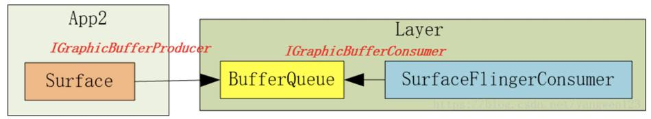

# BufferQueue

## BufferQueue的创建

在创建Layer对象过程中：frameworks/native/services/surfaceflinger/BufferQueueLayer.cpp

```cpp
BufferQueueLayer::BufferQueueLayer(const LayerCreationArgs& args) : BufferLayer(args) {}

void BufferQueueLayer::onFirstRef() {
    BufferLayer::onFirstRef();

    sp<IGraphicBufferProducer> producer;// 类型是BufferQueueProducer
    sp<IGraphicBufferConsumer> consumer;// 类型是BufferQueueConsumer
    mFlinger->getFactory().createBufferQueue(&producer, &consumer, true);
    // 类型是MonitoredProducer
    mProducer = mFlinger->getFactory().createMonitoredProducer(producer, mFlinger, this);
    // 类型是BufferLayerConsumer
    mConsumer = mFlinger->getFactory().createBufferLayerConsumer(consumer, mFlinger->getRenderEngine(), mTextureName, this);
    // 。。。
    mContentsChangedListener = new ContentsChangedListener(this);
    mConsumer->setContentsChangedListener(mContentsChangedListener);
    // ...
}
```

frameworks/native/services/surfaceflinger/SurfaceFlingerDefaultFactory.cpp
中间过程代码略

frameworks/native/libs/gui/BufferQueue.cpp

```cpp
void BufferQueue::createBufferQueue(sp<IGraphicBufferProducer>* outProducer,
        sp<IGraphicBufferConsumer>* outConsumer,
        bool consumerIsSurfaceFlinger) {
    // ...
    sp<BufferQueueCore> core(new BufferQueueCore());
    // ...
    sp<IGraphicBufferProducer> producer(new BufferQueueProducer(core, consumerIsSurfaceFlinger));
    // ...
    sp<IGraphicBufferConsumer> consumer(new BufferQueueConsumer(core));
    // ...
    *outProducer = producer;
    *outConsumer = consumer;
}
```

## 生产者IGraphicBufferProducer

IGraphicBufferProducer的调用主要在Surface的lock和unlock操作中（见Surface系统 上）。

### dequeueBuffer

frameworks/native/libs/gui/include/gui/IGraphicBufferProducer.h

客户端类型：BpGraphicBufferProducer （代码也在IGraphicBufferProducer.cpp中）

```cpp
virtual status_t dequeueBuffer(int* buf, sp<Fence>* fence, uint32_t width, uint32_t height, PixelFormat format, uint64_t usage, uint64_t* outBufferAge, FrameEventHistoryDelta* outTimestamps) {
    // 。。。
    return result;
}
```

通过Binder传输到SurfaceFlinger进程中。

服务端类型：BnGraphicBufferProducer （代码也在IGraphicBufferProducer.cpp中）

```cpp
status_t BnGraphicBufferProducer::onTransact(uint32_t code, const Parcel& data, Parcel* reply, uint32_t flags) {
    switch(code) {
        // ...
        case DEQUEUE_BUFFER: {
            // ...
            // 在服务进程中调用了dequeueBuffer
            int result = dequeueBuffer(&buf, &fence, width, height, format, usage, &bufferAge, getTimestamps ? &frameTimestamps : nullptr);
            // ...
            reply->writeInt32(result);
            return NO_ERROR;
        }
        // ...
    }
}
```

最终调用了BufferQueueProducer的dequeueBuffer
frameworks/native/libs/gui/BufferQueueProducer.cpp

```cpp
status_t BufferQueueProducer::dequeueBuffer(int* outSlot, sp<android::Fence>* outFence, uint32_t width, uint32_t height, PixelFormat format, uint64_t usage, uint64_t* outBufferAge, FrameEventHistoryDelta* outTimestamps) {
    // ...

    { // Autolock scope
        //. ..
        int found = BufferItem::INVALID_BUFFER_SLOT;
        while (found == BufferItem::INVALID_BUFFER_SLOT) {
            //1. 寻找可用的Slot，可用指Buffer状态为FREE
            status_t status = waitForFreeSlotThenRelock(FreeSlotCaller::Dequeue, lock, &found);
			// ...
            const sp<GraphicBuffer>& buffer(mSlots[found].mGraphicBuffer);
			// ...
        }
        // ...
        *outSlot = found;
        // 。。。
		//2.找到可用的Slot，将Buffer状态设置为DEQUEUED，由于步骤1找到的Slot状态为FREE，因此这一步完成了FREE到DEQUEUED的状态切换
        mSlots[found].mBufferState.dequeue();

        //3. 找到的Slot如果需要申请GraphicBuffer，则申请GraphicBuffer，这里采用了懒加载机制，如果内存没有申请，申请内存放在生产者来处理
        if ((buffer == nullptr) || buffer->needsReallocation(width, height, format, BQ_LAYER_COUNT, usage)) {
            // ...
        }
        // ...
    }
	// ...
    return returnFlags;
}
```

>   TODO waitForFreeSlotThenRelock分析
>

### requestBuffer

在Surface的lock中，调用完dequeueBuffer后又调用了requestBuffer。

```cpp
status_t BufferQueueProducer::requestBuffer(int slot, sp<GraphicBuffer>* buf) {
    // 。。。
    *buf = mSlots[slot].mGraphicBuffer;
    return NO_ERROR;
}
```

requestBuffer的逻辑比较简单，在dequeueBuffer中找到了可用得到slot，通过索引来获取GraphicBuffer。

### queueBuffer

在Surface的unlock中，会调用queueBuffer。

```cpp
status_t BufferQueueProducer::queueBuffer(int slot, const QueueBufferInput &input, QueueBufferOutput *output) {
    // ...
    sp<IConsumerListener> frameAvailableListener;
    sp<IConsumerListener> frameReplacedListener;
    // ...
    {
        // ...
        const sp<GraphicBuffer>& graphicBuffer(mSlots[slot].mGraphicBuffer);
        // ...
        // 将Buffer状态扭转成QUEUED，此步完成了Buffer的状态由DEQUEUED到QUEUED的过程
        mSlots[slot].mBufferState.queue();
		// ...
        if (mCore->mQueue.empty()) {
            // buffer入列
            mCore->mQueue.push_back(item);
            frameAvailableListener = mCore->mConsumerListener;
        } 
        // ...
    }
	// ...
    {   
		// 消费者回调
        if (frameAvailableListener != nullptr) {
            frameAvailableListener->onFrameAvailable(item);
        } else if (frameReplacedListener != nullptr) {
            frameReplacedListener->onFrameReplaced(item);
        }
		// ...
    }
	// ...
    return NO_ERROR;
}
```

## 消费者IGraphicBufferConsumer

### BufferLayerConsumer的创建

BufferQueue的创建隔得远，再看一遍：

```cpp
BufferQueueLayer::BufferQueueLayer(const LayerCreationArgs& args) : BufferLayer(args) {}

void BufferQueueLayer::onFirstRef() {
    BufferLayer::onFirstRef();

    sp<IGraphicBufferProducer> producer;// 类型是BufferQueueProducer
    sp<IGraphicBufferConsumer> consumer;// 类型是BufferQueueConsumer
    mFlinger->getFactory().createBufferQueue(&producer, &consumer, true);
    // 类型是MonitoredProducer
    mProducer = mFlinger->getFactory().createMonitoredProducer(producer, mFlinger, this);
    // 类型是BufferLayerConsumer
    mConsumer = mFlinger->getFactory().createBufferLayerConsumer(consumer, mFlinger->getRenderEngine(), mTextureName, this);
    // 。。。
    mContentsChangedListener = new ContentsChangedListener(this);
    mConsumer->setContentsChangedListener(mContentsChangedListener);
    // ...
}
```

在BufferLayerConsumer的构造函数中会调用父类ConsumerBase的构造函数

```cpp
BufferLayerConsumer::BufferLayerConsumer(const sp<IGraphicBufferConsumer>& bq, renderengine::RenderEngine& engine, uint32_t tex, Layer* layer)
      : ConsumerBase(bq, false),
        // ...
```

```cpp
ConsumerBase::ConsumerBase(const sp<IGraphicBufferConsumer>& bufferQueue, bool controlledByApp) :
        mAbandoned(false),
        mConsumer(bufferQueue),// mConsumer的类型是BufferQueueConsumer
        mPrevFinalReleaseFence(Fence::NO_FENCE) {
    // ...
    wp<ConsumerListener> listener = static_cast<ConsumerListener*>(this);
    sp<IConsumerListener> proxy = new BufferQueue::ProxyConsumerListener(listener);

    status_t err = mConsumer->consumerConnect(proxy, controlledByApp);
    // 。。。
}
```

### 消费者回调设置

```cpp
status_t BufferQueueConsumer::connect(const sp<IConsumerListener>& consumerListener, bool controlledByApp) {
    // ...
    mCore->mConsumerListener = consumerListener;
    // ...
    return NO_ERROR;
}
```

当生产者queueBuffer触发回调时，回调对象就是这个consumerListener：

```cpp
status_t BufferQueueProducer::queueBuffer(int slot, const QueueBufferInput &input, QueueBufferOutput *output) {
    // ...
    sp<IConsumerListener> frameAvailableListener;
    // ...
    frameAvailableListener = mCore->mConsumerListener;
	// ...
    if (frameAvailableListener != nullptr) {
    	frameAvailableListener->onFrameAvailable(item);
    }
	// ...
    return NO_ERROR;
}
```

consumerListener（类型是ConsumerBase）的onFrameAvailable：

```cpp
void ConsumerBase::onFrameAvailable(const BufferItem& item) {
	// ...
    sp<FrameAvailableListener> listener;
    {
        Mutex::Autolock lock(mFrameAvailableMutex);
        listener = mFrameAvailableListener.promote();// promote函数是将wp升级为sp
    }

    if (listener != nullptr) {
        // ...
        listener->onFrameAvailable(item);
    }
}
```

可以看到，ConsumerBase的回调并不是真正的实现，真正的实现在哪呢？看一下mFrameAvailableListener的赋值，在BufferQueueLayer的创建中：

```cpp
BufferQueueLayer::BufferQueueLayer(const LayerCreationArgs& args) : BufferLayer(args) {}

void BufferQueueLayer::onFirstRef() {
    // ...
    sp<IGraphicBufferConsumer> consumer;// 类型是BufferQueueConsumer
    // ...
    // 类型是BufferLayerConsumer
    mConsumer = mFlinger->getFactory().createBufferLayerConsumer(consumer, mFlinger->getRenderEngine(), mTextureName, this);
    // 。。。
    mContentsChangedListener = new ContentsChangedListener(this);
    mConsumer->setContentsChangedListener(mContentsChangedListener);
    // ...
}
```

setContentsChangedListener：

```cpp
void ConsumerBase::setFrameAvailableListener(const wp<FrameAvailableListener>& listener) {
    // ...
    mFrameAvailableListener = listener;
}
```

所以消费者回调的具体实现类型是BufferQueueLayer。

```cpp
void BufferQueueLayer::onFrameAvailable(const BufferItem& item) {
    // ...
    mFlinger->signalLayerUpdate();
    mConsumer->onBufferAvailable(item);
}
```

signalLayerUpdate内部会触发SF的handlePageFlip。

### acquireBuffer

```cpp
status_t BufferQueueConsumer::acquireBuffer(BufferItem* outBuffer, nsecs_t expectedPresent, uint64_t maxFrameNumber) {
    // ...
    sp<IProducerListener> listener;
    {
        // 取出元素
        // 更新Slot的状态为ACQUIRED
        mSlots[slot].mBufferState.acquire();
		// ...
    }

    if (listener != nullptr) {
        for (int i = 0; i < numDroppedBuffers; ++i) {
            // 回调
            listener->onBufferReleased();
        }
    }

    return NO_ERROR;
}
```

### releaseBuffer

消费者获取到Slot后开始消费数据（典型的消费如SurfaceFlinger的UI合成），消费完毕后，需要告知BufferQueueCore这个Slot被消费者消费完毕了，可以给生产者重新生产数据，releaseBuffer流程如下：

```cpp
status_t BufferQueueConsumer::releaseBuffer(int slot, uint64_t frameNumber, const sp<Fence>& releaseFence, EGLDisplay eglDisplay, EGLSyncKHR eglFence) {
    // ...

    sp<IProducerListener> listener;
    {
        // ...
        // 将Slot的状态扭为RELEASE
        mSlots[slot].mBufferState.release();
        // ...
        if (mCore->mBufferReleasedCbEnabled) {
            listener = mCore->mConnectedProducerListener;
        }
        // ...
    }
    
    // 回调生产者
    if (listener != nullptr) {
        listener->onBufferReleased();
    }

    return NO_ERROR;
}
```

## 小结

1.   BufferQueue
     可以认为BufferQueue是一个服务中心，IGraphicBufferProducer和IGraphicBufferConsumer
     所需要使用的buffer必须要通过它来管理。
2.   IGraphicBufferProducer
     IGraphicBufferProducer就是“填充”buffer空间的人，通常情况下是应用程序。因为应用程序不断地刷新UI，从而将产生的显示数据源源不断地写到buffer中。当IGraphicBufferProducer需要使用一块buffer时，它首先会向BufferQueue发起dequeueBuffer申请，然后才能对指定的buffer进行操作。此时buffer就只属于IGraphicBufferProducer一个人的了，它可以对buffer进行任何必要的操作，而IGraphicBufferConsumer此刻绝不能操作这块buffer。当IGraphicBufferProducer认为一块buffer已经写入完成后，它进一步调用queueBuffer函数。从字面上看这个函数是“入列”的意思，形象地表达了buffer此时的操作，把buffer归还到BufferQueue的队列中。一旦queue成功后，buffer的owner也就随之改变为BufferQueue了。
3.   IGraphicBufferConsumer
     IGraphicBufferConsumer是与IGraphicBufferProducer相对应的，它的操作同样受到BufferQueue的管控。当一块buffer已经就绪后，IGraphicBufferConsumer就可以开始工作了。



# SurfaceFlinger进程的启动

>   和书中说的不同，SurfaceFlinger单独放在了一个进程。
>
>   参考：[surfaceflinger 进程启动](https://blog.csdn.net/u012439416/article/details/79733178)

surfaceflinger进程对应的配置不是在init.rc中，而是在surfaceflinger.rc中，对应的main文件：frameworks/native/services/surfaceflinger/main_surfaceflinger.cpp

```cpp
int main(int, char**) {
    // ...
    // 创建SurfaceFlinger对象，SurfaceFlinger的构造函数里没有复杂逻辑
    // instantiate surfaceflinger
    sp<SurfaceFlinger> flinger = surfaceflinger::createSurfaceFlinger();
    
    // ...
    // 执行SurfaceFlinger的init函数，init函数也没有复杂逻辑
    // initialize before clients can connect
    flinger->init();
    
    // 添加系统服务
    // publish surface flinger
    sp<IServiceManager> sm(defaultServiceManager());
    sm->addService(String16(SurfaceFlinger::getServiceName()), flinger, false,
                   IServiceManager::DUMP_FLAG_PRIORITY_CRITICAL | IServiceManager::DUMP_FLAG_PROTO);
    
    // 执行SurfaceFlinger的run函数
    // ...
    // run surface flinger in this thread
    flinger->run();
    return 0;
}
```

frameworks/native/services/surfaceflinger/SurfaceFlinger.cpp

在SurfaceFlinger的其他方法之前，onFirstRef方法会被调用，onFirstRef方法如下：

```cpp
void SurfaceFlinger::onFirstRef() {
    mEventQueue->init(this);
}
```

```cpp
void MessageQueue::init(const sp<SurfaceFlinger>& flinger) {
    mFlinger = flinger;
    mLooper = new Looper(true);
    mHandler = new Handler(*this);
}
```

创建了类似Android Java层中Handler的一套消息机制，最后调用SurfaceFlinger的run函数等待消息。

```cpp
void SurfaceFlinger::run() {
    while (true) {
        mEventQueue->waitMessage();
    }
}
```

## 小结

SurfaceFlinger进程的启动主要是这几步：

1.   开机启动SurfaceFlinger进程。
2.   创建SurfaceFlinger对象。
3.   调用SurfaceFlinger的init函数。
4.   调用SurfaceFlinger的run函数，等待Message。

# EventThread

## EventThread的创建

frameworks/native/services/surfaceflinger/SurfaceFlinger.cpp

```cpp
void SurfaceFlinger::init() {
    // ...
    processDisplayHotplugEventsLocked();
    // ...
}
```

```cpp
void SurfaceFlinger::processDisplayHotplugEventsLocked() {
    // ...
    initScheduler(displayId);
    // ...
}
```

```cpp
void SurfaceFlinger::initScheduler(DisplayId primaryDisplayId) {
    // ...

    // start the EventThread
    mScheduler = getFactory().createScheduler([this](bool enabled) { setPrimaryVsyncEnabled(enabled); }, *mRefreshRateConfigs, *this);
    mAppConnectionHandle = mScheduler->createConnection("app", mPhaseConfiguration->getCurrentOffsets().late.app, impl::EventThread::InterceptVSyncsCallback());
    mSfConnectionHandle = mScheduler->createConnection("sf", mPhaseConfiguration->getCurrentOffsets().late.sf, [this](nsecs_t timestamp) { mInterceptor->saveVSyncEvent(timestamp); });

    mEventQueue->setEventConnection(mScheduler->getEventConnection(mSfConnectionHandle));
    // ...
}
```

frameworks/native/services/surfaceflinger/Scheduler/Scheduler.cpp

```cpp
Scheduler::ConnectionHandle Scheduler::createConnection(const char* connectionName, nsecs_t phaseOffsetNs, impl::EventThread::InterceptVSyncsCallback interceptCallback) {
    auto vsyncSource = makePrimaryDispSyncSource(connectionName, phaseOffsetNs);
    auto eventThread = std::make_unique<impl::EventThread>(std::move(vsyncSource), std::move(interceptCallback));
    return createConnection(std::move(eventThread));
}

Scheduler::ConnectionHandle Scheduler::createConnection(std::unique_ptr<EventThread> eventThread) {
    const ConnectionHandle handle = ConnectionHandle{mNextConnectionHandleId++};
    // ...
    auto connection = createConnectionInternal(eventThread.get(), ISurfaceComposer::eConfigChangedSuppress);
    mConnections.emplace(handle, Connection{connection, std::move(eventThread)});
    return handle;
}

sp<EventThreadConnection> Scheduler::createConnectionInternal(EventThread* eventThread, ISurfaceComposer::ConfigChanged configChanged) {
    return eventThread->createEventConnection([&] { resync(); }, configChanged);
}
```

frameworks/native/services/surfaceflinger/Scheduler/EventThread.cpp

```cpp
sp<EventThreadConnection> EventThread::createEventConnection(ResyncCallback resyncCallback, ISurfaceComposer::ConfigChanged configChanged) const {
    return new EventThreadConnection(const_cast<EventThread*>(this), std::move(resyncCallback),configChanged);
}
```

小结：在SF的初始化过程中，分别创建了APP和SF的EventThread，以及对应的EventThreadConnection。

>   因为 Vsync 是通知 SurfaceFlinger 刷新的信号，如果 App 信号和 SF 信号是同步的话，那么就会造成系统工作的拥挤，按照正常的思路，我们应该是希望处理 App 事务和处理 SF 事务是错开的，所以这里用了两个线程来分开处理。并且这两个线程还采用了不同的时间偏移量。
>
>   作者：YuLong
>   链接：https://juejin.cn/post/7045996528942448648
>   来源：稀土掘金
>   著作权归作者所有。商业转载请联系作者获得授权，非商业转载请注明出处。

## setEventConnection

```cpp
void SurfaceFlinger::initScheduler(DisplayId primaryDisplayId) {
    // ...
    mEventQueue->setEventConnection(mScheduler->getEventConnection(mSfConnectionHandle));
    // ...
}
```

在SF的initScheduler中会调用MessageQueue的setEventConnection。

```cpp
gui::BitTube mEventTube;

void MessageQueue::setEventConnection(const sp<EventThreadConnection>& connection) {
    if (mEventTube.getFd() >= 0) {
        mLooper->removeFd(mEventTube.getFd());
    }

    mEvents = connection;
    mEvents->stealReceiveChannel(&mEventTube);
    mLooper->addFd(mEventTube.getFd(), 0, Looper::EVENT_INPUT, MessageQueue::cb_eventReceiver, this);
}
```

创建完 EventThread 之后，就将 SurfaceFlinger 的 EventConnection 设置进了 EventQueue。

接收者实际上是SF的MessageQueue，cb_eventReceiver就是接收的回调。

## EventThread的运行

```cpp
EventThread::EventThread(std::unique_ptr<VSyncSource> vsyncSource,
                         InterceptVSyncsCallback interceptVSyncsCallback)
      : mVSyncSource(std::move(vsyncSource)),
        mInterceptVSyncsCallback(std::move(interceptVSyncsCallback)),
        mThreadName(mVSyncSource->getName()) {
    mVSyncSource->setCallback(this);

    mThread = std::thread([this]() NO_THREAD_SAFETY_ANALYSIS {
        std::unique_lock<std::mutex> lock(mMutex);
        threadMain(lock);
    });
	// 。。。
}
```

threadMain会开启一个死循环，这个循环会一直处理事件：

```cpp
void EventThread::threadMain(std::unique_lock<std::mutex>& lock) {
    DisplayEventConsumers consumers;

    while (mState != State::Quit) {
        std::optional<DisplayEventReceiver::Event> event;

        // 。。。
        // 从 mPendingEvents 头部获取 VSYNC 事件 Event 。
        event = mPendingEvents.front();
        mPendingEvents.pop_front();
        
        // 。。。
        // 找到需要消费此event的connection
		
		// 。。。
        // 分发此event
        if (!consumers.empty()) {
            dispatchEvent(*event, consumers);
            consumers.clear();
        }
		// 。。。

        // Wait for event or client registration/request.
        if (mState == State::Idle) {
            // 通过条件变量mCondition让线程陷入等待
            mCondition.wait(lock);
        } else {
            // Generate a fake VSYNC after a long timeout in case the driver stalls. When the display is off, keep feeding clients at 60 Hz.
            // 如果没有事件，那么创建一个假的VSync发送给请求者。
            // 。。。
        }
    }
}
```

threadMain主要就是处理事件。

## 事件分发

在EventThread的消息处理循环中，找到了event，并给消费者分发此event：

```cpp
void EventThread::dispatchEvent(const DisplayEventReceiver::Event& event,
                                const DisplayEventConsumers& consumers) {
    for (const auto& consumer : consumers) {
        switch (consumer->postEvent(event)) {
            // ...
        }
    }
}
```

consumer的具体类型是EventThreadConnection：

```cpp
using DisplayEventConsumers = std::vector<sp<EventThreadConnection>>;
```

```cpp
status_t EventThreadConnection::postEvent(const DisplayEventReceiver::Event& event) {
    ssize_t size = DisplayEventReceiver::sendEvents(&mChannel, &event, 1);
    return size < 0 ? status_t(size) : status_t(NO_ERROR);
}
```

frameworks/native/libs/gui/DisplayEventReceiver.cpp

```cpp
ssize_t DisplayEventReceiver::sendEvents(gui::BitTube* dataChannel,
        Event const* events, size_t count)
{
    return gui::BitTube::sendObjects(dataChannel, events, count);
}
```

事件的分发会通过Channel来完成。

BitTube 是 Android 中封装了的 socketpair，它是用于 socket 通信的。也就是说这里通过 socket 通信的方式，将事件从 EventThreadConnection 所在的进程传递到了 mChannel 接收的进程。

# SF消息循环

涉及类型：MessageQueue、Looper、Handler。在SF的初始化过程中会创建这些对象。

```cpp
void SurfaceFlinger::onFirstRef() {
    mEventQueue->init(this);
}
```

```cpp
void MessageQueue::init(const sp<SurfaceFlinger>& flinger) {
    mFlinger = flinger;
    mLooper = new Looper(true);
    mHandler = new Handler(*this);
}
```

## waitMessage

```cpp
void SurfaceFlinger::run() {
    while (true) {
        mEventQueue->waitMessage();
    }
}
```

在一个死循环中，SF一直等待消息，当消息来临时，进行处理：

```cpp
void MessageQueue::waitMessage() {
    do {
        IPCThreadState::self()->flushCommands();
        int32_t ret = mLooper->pollOnce(-1);
        // ...
    } while (true);
}
```

```cpp
int Looper::pollOnce(int timeoutMillis, int* outFd, int* outEvents, void** outData) {
    int result = 0;
    for (;;) {
        // ...
        result = pollInner(timeoutMillis);
    }
}
```

```cpp
int Looper::pollInner(int timeoutMillis) {
    // ...
    while (mMessageEnvelopes.size() != 0) {
        // ...
        const MessageEnvelope& messageEnvelope = mMessageEnvelopes.itemAt(0);
        // ...
        sp<MessageHandler> handler = messageEnvelope.handler;
        Message message = messageEnvelope.message;
		// ...
		handler->handleMessage(message);
        // ...
    }
    // ...
    return result;
}
```

和Java中的Handler类似，MessageQueue处理消息时，取出一个消息，获取对应的Handler，并交给其进行处理。

frameworks/native/services/surfaceflinger/Scheduler/MessageQueue.cpp

```cpp
void MessageQueue::Handler::handleMessage(const Message& message) {
    switch (message.what) {
        case INVALIDATE:
            mEventMask.fetch_and(~eventMaskInvalidate);
            mQueue.mFlinger->onMessageReceived(message.what, mVsyncId, mExpectedVSyncTime);
            break;
        case REFRESH:
            mEventMask.fetch_and(~eventMaskRefresh);
            mQueue.mFlinger->onMessageReceived(message.what, mVsyncId, mExpectedVSyncTime);
            break;
    }
}
```

frameworks/native/services/surfaceflinger/SurfaceFlinger.cpp

```cpp
void SurfaceFlinger::onMessageReceived(int32_t what, int64_t vsyncId, nsecs_t expectedVSyncTime) {
    switch (what) {
        case MessageQueue::INVALIDATE: {
            onMessageInvalidate(vsyncId, expectedVSyncTime);
            break;
        }
        case MessageQueue::REFRESH: {
            onMessageRefresh();
            break;
        }
    }
}
```

## postMessage

```cpp
void MessageQueue::postMessage(sp<MessageHandler>&& handler) {
    mLooper->sendMessage(handler, Message());
}
```

```cpp
void Looper::sendMessage(const sp<MessageHandler>& handler, const Message& message) {
    nsecs_t now = systemTime(SYSTEM_TIME_MONOTONIC);
    sendMessageAtTime(now, handler, message);
}
```

```cpp
void Looper::sendMessageAtTime(nsecs_t uptime, const sp<MessageHandler>& handler,
        const Message& message) {
	// ...
    MessageEnvelope messageEnvelope(uptime, handler, message);
    mMessageEnvelopes.insertAt(messageEnvelope, i, 1);
	// ...
}
```

## 小结

SF中的消息循环和Java层中的Handler类似：

1.   post一个msg到MessageQueue中，会将msg封装成一个MessageEnvelope，并放入到mMessageEnvelopes中。
2.   处理消息时，从mMessageEnvelopes中取出一个MessageEnvelope，并从MessageEnvelope中获取msg对应的Handler，交其处理。

# SF消息接收：onMessageReceived

```cpp
void SurfaceFlinger::onMessageReceived(int32_t what, int64_t vsyncId, nsecs_t expectedVSyncTime) {
    switch (what) {
        case MessageQueue::INVALIDATE: {
            onMessageInvalidate(vsyncId, expectedVSyncTime);
            break;
        }
        case MessageQueue::REFRESH: {
            onMessageRefresh();
            break;
        }
    }
}
```

1.   onMessageInvalidate内部会调用handlePageFlip来处理Layer的合成，以及BufferQueue中消费者部分。

2.   onMessageRefresh会合并以及渲染输出。

# Choreographer

Choreographer：编舞者，指对CPU/GPU绘制的指导，收到VSync信号才开始绘制，保证绘制拥有完整的16.6ms。通常应用层不会直接使用Choreographer，而是使用更高级的API，如`View.invalidate()`等，可以通过Choreographer来监控应用的帧率。

## Choreographer实例化

**ViewRootImpl**

```java
// ViewRootImpl在WindowManager.addView时创建
public ViewRootImpl(Context context, Display display) {
    // ...
    mChoreographer = Choreographer.getInstance();
    // ...
}
```

**Choreographer**

```java
private static final ThreadLocal<Choreographer> sThreadInstance =
        new ThreadLocal<Choreographer>() {
    @Override
    protected Choreographer initialValue() {
        Looper looper = Looper.myLooper();
        if (looper == null) {
            throw new IllegalStateException("The current thread must have a looper!");
        }
        Choreographer choreographer = new Choreographer(looper, VSYNC_SOURCE_APP);
        if (looper == Looper.getMainLooper()) {
            mMainInstance = choreographer;
        }
        return choreographer;
    }
};
```

```java
public static Choreographer getInstance() {
    return sThreadInstance.get();
}
```

Choreographer是线程单例，由ThreadLocal实现。

```java
// 默认true
private static final boolean USE_VSYNC = SystemProperties.getBoolean(
            "debug.choreographer.vsync", true);
// VSync事件接收器
private final FrameDisplayEventReceiver mDisplayEventReceiver;

public static final int CALLBACK_INPUT = 0;
public static final int CALLBACK_ANIMATION = 1;
public static final int CALLBACK_INSETS_ANIMATION = 2;
public static final int CALLBACK_TRAVERSAL = 3;

public static final int CALLBACK_COMMIT = 4;
private static final int CALLBACK_LAST = CALLBACK_COMMIT;
private final CallbackQueue[] mCallbackQueues;

private Choreographer(Looper looper, int vsyncSource) {
    mLooper = looper;
    mHandler = new FrameHandler(looper);
    mDisplayEventReceiver = USE_VSYNC
            ? new FrameDisplayEventReceiver(looper, vsyncSource)
            : null;
    mLastFrameTimeNanos = Long.MIN_VALUE;

    // 计算一帧的时间，60帧即16.6ms
    mFrameIntervalNanos = (long)(1000000000 / getRefreshRate());

    mCallbackQueues = new CallbackQueue[CALLBACK_LAST + 1];
    for (int i = 0; i <= CALLBACK_LAST; i++) {
        mCallbackQueues[i] = new CallbackQueue();
    }
    // b/68769804: For low FPS experiments.
    setFPSDivisor(SystemProperties.getInt(ThreadedRenderer.DEBUG_FPS_DIVISOR, 1));
}
```

### callbackType

```java
/**
 * Callback type: Input callback.  Runs first.
 */
public static final int CALLBACK_INPUT = 0;

/**
 * Callback type: Animation callback.  Runs before {@link #CALLBACK_INSETS_ANIMATION}.
 */
public static final int CALLBACK_ANIMATION = 1;

/**
 * Callback type: Animation callback to handle inset updates. This is separate from
 * {@link #CALLBACK_ANIMATION} as we need to "gather" all inset animation updates via
 * {@link WindowInsetsAnimationController#setInsetsAndAlpha(Insets, float, float)} for multiple
 * ongoing animations but then update the whole view system with a single callback to
 * {@link View#dispatchWindowInsetsAnimationProgress} that contains all the combined updated
 * insets.
 * <p>
 * Both input and animation may change insets, so we need to run this after these callbacks, but
 * before traversals.
 * <p>
 * Runs before traversals.
 * @hide
 */
public static final int CALLBACK_INSETS_ANIMATION = 2;

/**
 * Callback type: Traversal callback.  Handles layout and draw.  Runs
 * after all other asynchronous messages have been handled.
 * @hide
 */
public static final int CALLBACK_TRAVERSAL = 3;

/**
 * Callback type: Commit callback.  Handles post-draw operations for the frame.
 * Runs after traversal completes.  The {@link #getFrameTime() frame time} reported
 * during this callback may be updated to reflect delays that occurred while
 * traversals were in progress in case heavy layout operations caused some frames
 * to be skipped.  The frame time reported during this callback provides a better
 * estimate of the start time of the frame in which animations (and other updates
 * to the view hierarchy state) actually took effect.
 * @hide
 */
public static final int CALLBACK_COMMIT = 4;

private static final int CALLBACK_LAST = CALLBACK_COMMIT;
```

这四种类型的任务存入对应类型的CallbackQueue中，每当收到VSYNC信号时，Choreographer将按顺序处理这些类型的任务。

### FrameHandler

FrameHandler用来处理异步消息：

```java
private final class FrameHandler extends Handler {
    public FrameHandler(Looper looper) {
        super(looper);
    }

    @Override
    public void handleMessage(Message msg) {
        switch (msg.what) {
            case MSG_DO_FRAME:
                doFrame(System.nanoTime(), 0);
                break;
            case MSG_DO_SCHEDULE_VSYNC:
                doScheduleVsync();
                break;
            case MSG_DO_SCHEDULE_CALLBACK:
                doScheduleCallback(msg.arg1);
                break;
        }
    }
}
```

### 小结

1.   Choreographer是线程单例，一个线程对应一个对象。
2.   Choreographer内部的FrameHandler处理异步消息。

## Vsync信号注册

### FrameDisplayEventReceiver

mDisplayEventReceiver 是 FrameDisplayEventReceiver 类型的实例，在Choreographer构造方法中实例化，其父类为 DisplayEventReceiver。

```java
private final class FrameDisplayEventReceiver extends DisplayEventReceiver
        implements Runnable {
    // ....

    public FrameDisplayEventReceiver(Looper looper, int vsyncSource) {
        super(looper, vsyncSource, CONFIG_CHANGED_EVENT_SUPPRESS);
    }

    @Override
    public void onVsync(long timestampNanos, long physicalDisplayId, int frame) {
        // ...
        Message msg = Message.obtain(mHandler, this);
        msg.setAsynchronous(true);
        mHandler.sendMessageAtTime(msg, timestampNanos / TimeUtils.NANOS_PER_MS);
    }

    @Override
    public void run() {
        mHavePendingVsync = false;
        doFrame(mTimestampNanos, mFrame);
    }
}
```

### DisplayEventReceiver

```java
public abstract class DisplayEventReceiver {
	// ....

    public DisplayEventReceiver(Looper looper, int vsyncSource, int configChanged) {
        if (looper == null) {
            throw new IllegalArgumentException("looper must not be null");
        }

        mMessageQueue = looper.getQueue();
        mReceiverPtr = nativeInit(new WeakReference<DisplayEventReceiver>(this), mMessageQueue, vsyncSource, configChanged);

        mCloseGuard.open("dispose");
    }

    private static native long nativeInit(WeakReference<DisplayEventReceiver> receiver, MessageQueue messageQueue, int vsyncSource, int configChanged);
}
```

### nativeInit

nativeInit是一个native方法，其实现在`frameworks/base/core/jni/android_view_DisplayEventReceiver.cpp`中：

```c++
static jlong nativeInit(JNIEnv* env, jclass clazz, jobject receiverWeak, jobject messageQueueObj, jint vsyncSource, jint eventRegistration) {
    sp<MessageQueue> messageQueue = android_os_MessageQueue_getMessageQueue(env, messageQueueObj);
    // ...
    sp<NativeDisplayEventReceiver> receiver =
            new NativeDisplayEventReceiver(env, receiverWeak, messageQueue, vsyncSource, eventRegistration);
    status_t status = receiver->initialize();
    // ...
    receiver->incStrong(gDisplayEventReceiverClassInfo.clazz); // retain a reference for the object
    return reinterpret_cast<jlong>(receiver.get());
}
```

```c++
status_t DisplayEventDispatcher::initialize() {
    status_t result = mReceiver.initCheck();
    // 。。。
	int rc = mLooper->addFd(mReceiver.getFd(), 0, Looper::EVENT_INPUT, this, NULL);
    // 。。。
    return OK;
}
```

```c++
std::unique_ptr<gui::BitTube> mDataChannel;

int DisplayEventReceiver::getFd() const {
    if (mDataChannel == nullptr) return mInitError.has_value() ? mInitError.value() : NO_INIT;

    return mDataChannel->getFd();
}
```

```c++
DisplayEventReceiver::DisplayEventReceiver(
        ISurfaceComposer::VsyncSource vsyncSource,
        ISurfaceComposer::EventRegistrationFlags eventRegistration) {
    sp<ISurfaceComposer> sf(ComposerService::getComposerService());
    if (sf != nullptr) {
        mEventConnection = sf->createDisplayEventConnection(vsyncSource, eventRegistration);
        if (mEventConnection != nullptr) {
            // 创建BitTube
            mDataChannel = std::make_unique<gui::BitTube>();
            const auto status = mEventConnection->stealReceiveChannel(mDataChannel.get());
            if (!status.isOk()) {
                ALOGE("stealReceiveChannel failed: %s", status.toString8().c_str());
                mInitError = std::make_optional<status_t>(status.transactionError());
                mDataChannel.reset();
                mEventConnection.clear();
            }
        }
    }
}
```

### 小结

1.   Choreographer创建时会创建一个DisplayEventReceiver。
2.   在native的DisplayEventReceiver创建中，会通过BitTube与SF建立联系。
3.   BitTube内部通过socket来实现全双工通讯。在 BitTube 对象中有两个文件描述符：mReceiveFd 和 mSendFd，以及 read 和 write 方法分别用来进行读写操作。
4.   创建完DisplayEventReceiver对象后再初始化。
5.   `mLooper->addFd(mReceiver.getFd(), 0, Looper::EVENT_INPUT, this, NULL)` 用来监听 mReceiver 所获取的文件句柄，当有存在对 Vsync 信号感兴趣的连接且接收到了Vsync 信号时，会发送数据到 mReceiver，然后回调 DisplayEventDispatcher 中的 handleEvent 方法。

## 接收Vsync

### handleEvent

```c++
int DisplayEventDispatcher::handleEvent(int, int events, void*) {
    // ....
    if (processPendingEvents(&vsyncTimestamp, &vsyncDisplayId, &vsyncCount, &vsyncEventData)) {
        ALOGV("dispatcher %p ~ Vsync pulse: timestamp=%" PRId64
              ", displayId=%s, count=%d, vsyncId=%" PRId64,
              this, ns2ms(vsyncTimestamp), to_string(vsyncDisplayId).c_str(), vsyncCount,
              vsyncEventData.preferredVsyncId());
        mWaitingForVsync = false;
        mLastVsyncCount = vsyncCount;
        dispatchVsync(vsyncTimestamp, vsyncDisplayId, vsyncCount, vsyncEventData);
    }

    if (mWaitingForVsync) {
        const nsecs_t currentTime = systemTime(SYSTEM_TIME_MONOTONIC);
        const nsecs_t vsyncScheduleDelay = currentTime - mLastScheduleVsyncTime;
        if (vsyncScheduleDelay > WAITING_FOR_VSYNC_TIMEOUT) {
            ALOGW("Vsync time out! vsyncScheduleDelay=%" PRId64 "ms", ns2ms(vsyncScheduleDelay));
            mWaitingForVsync = false;
            dispatchVsync(currentTime, vsyncDisplayId /* displayId is not used */,
                          ++mLastVsyncCount, vsyncEventData /* empty data */);
        }
    }

    return 1; // keep the callback
}
```

### dispatchVsync

```c++
void NativeDisplayEventReceiver::dispatchVsync(nsecs_t timestamp, PhysicalDisplayId displayId, uint32_t count, VsyncEventData vsyncEventData) {
    JNIEnv* env = AndroidRuntime::getJNIEnv();

    ScopedLocalRef<jobject> receiverObj(env, GetReferent(env, mReceiverWeakGlobal));
    if (receiverObj.get()) {
        ALOGV("receiver %p ~ Invoking vsync handler.", this);

        jobject javaVsyncEventData = createJavaVsyncEventData(env, vsyncEventData);
        env->CallVoidMethod(receiverObj.get(), gDisplayEventReceiverClassInfo.dispatchVsync,
                            timestamp, displayId.value, count, javaVsyncEventData);
        ALOGV("receiver %p ~ Returned from vsync handler.", this);
    }

    mMessageQueue->raiseAndClearException(env, "dispatchVsync");
}
```

通过jni反射调用Java的DisplayEventReceiver的dispatchVsync。

```java
private void dispatchVsync(long timestampNanos, long physicalDisplayId, int frame) {
    onVsync(timestampNanos, physicalDisplayId, frame);
}
```

### onVsync

```java
public void onVsync(long timestampNanos, long physicalDisplayId, int frame) {
    // ...
    mTimestampNanos = timestampNanos;
    mFrame = frame;
    Message msg = Message.obtain(mHandler, this);
    msg.setAsynchronous(true);
    mHandler.sendMessageAtTime(msg, timestampNanos / TimeUtils.NANOS_PER_MS);
}
```

onVsync发送一个异步消息，具体逻辑在FrameDisplayEventReceiver的run中。

```java
public void run() {
    mHavePendingVsync = false;
    doFrame(mTimestampNanos, mFrame);
}
```

**doFrame**

```java
void doFrame(long frameTimeNanos, int frame) {
    final long startNanos;
    synchronized (mLock) {
        // ...

        if (frameTimeNanos < mLastFrameTimeNanos) {
            // ...
            scheduleVsyncLocked();
            return;
        }

        if (mFPSDivisor > 1) {
            long timeSinceVsync = frameTimeNanos - mLastFrameTimeNanos;
            if (timeSinceVsync < (mFrameIntervalNanos * mFPSDivisor) && timeSinceVsync > 0) {
                scheduleVsyncLocked();
                return;
            }
        }

        // ...
    }

    try {
        Trace.traceBegin(Trace.TRACE_TAG_VIEW, "Choreographer#doFrame");
        AnimationUtils.lockAnimationClock(frameTimeNanos / TimeUtils.NANOS_PER_MS);

        mFrameInfo.markInputHandlingStart();
        doCallbacks(Choreographer.CALLBACK_INPUT, frameTimeNanos);

        mFrameInfo.markAnimationsStart();
        doCallbacks(Choreographer.CALLBACK_ANIMATION, frameTimeNanos);
        doCallbacks(Choreographer.CALLBACK_INSETS_ANIMATION, frameTimeNanos);

        mFrameInfo.markPerformTraversalsStart();
        doCallbacks(Choreographer.CALLBACK_TRAVERSAL, frameTimeNanos);

        doCallbacks(Choreographer.CALLBACK_COMMIT, frameTimeNanos);
    } finally {
        AnimationUtils.unlockAnimationClock();
        Trace.traceEnd(Trace.TRACE_TAG_VIEW);
    }

    // ...
}
```

### doCallbacks

```java
void doCallbacks(int callbackType, long frameTimeNanos) {
    CallbackRecord callbacks;
    synchronized (mLock) {
        // 取出小于当前时间的Callback
        final long now = System.nanoTime();
        callbacks = mCallbackQueues[callbackType].extractDueCallbacksLocked(
                now / TimeUtils.NANOS_PER_MS);
        if (callbacks == null) {
            return;
        }
        mCallbacksRunning = true;
		// 。。。
    }
    try {
        Trace.traceBegin(Trace.TRACE_TAG_VIEW, CALLBACK_TRACE_TITLES[callbackType]);
        // 执行Callback
        for (CallbackRecord c = callbacks; c != null; c = c.next) {
            // 。。。
            c.run(frameTimeNanos);
        }
    } finally {
        synchronized (mLock) {
            mCallbacksRunning = false;
            do {
                final CallbackRecord next = callbacks.next;
                recycleCallbackLocked(callbacks);
                callbacks = next;
            } while (callbacks != null);
        }
        Trace.traceEnd(Trace.TRACE_TAG_VIEW);
    }
}
```

1.   取出小于当前时间的Callback，意味着一个Callback只会执行一次。
2.   run Callback。

### 小结

1.   当DisplayEventReceiver接收到Vsync信号时，会发送一个异步消息，用来执行doFrame。
2.   doFrame主要是执行Callback。

## 再看scheduleTraversals

```java
void scheduleTraversals() {
	if (!mTraversalScheduled) {
    	mTraversalScheduled = true;
    	mTraversalBarrier = mHandler.getLooper().getQueue().postSyncBarrier();
    	mChoreographer.postCallback(Choreographer.CALLBACK_TRAVERSAL, mTraversalRunnable, null);
    	notifyRendererOfFramePending();
    	pokeDrawLockIfNeeded();
	}
}
```

### postCallback

```java
public void postCallback(int callbackType, Runnable action, Object token) {
    postCallbackDelayed(callbackType, action, token, 0);
}

public void postCallbackDelayed(int callbackType, Runnable action, Object token, long delayMillis) {
    // ...
    postCallbackDelayedInternal(callbackType, action, token, delayMillis);
}

private void postCallbackDelayedInternal(int callbackType, Object action, Object token, long delayMillis) {
    synchronized (mLock) {
        final long now = SystemClock.uptimeMillis();
        final long dueTime = now + delayMillis;
        // 对应类型的CallbackQueue添加Callback
        mCallbackQueues[callbackType].addCallbackLocked(dueTime, action, token);

        if (dueTime <= now) {
            // 立即执行
            scheduleFrameLocked(now);
        } else {
            Message msg = mHandler.obtainMessage(MSG_DO_SCHEDULE_CALLBACK, action);
            msg.arg1 = callbackType;
            msg.setAsynchronous(true);
            // handleMessage会调用doScheduleCallback(msg.arg1)方法
            mHandler.sendMessageAtTime(msg, dueTime);
        }
    }
}

void doScheduleCallback(int callbackType) {
    synchronized (mLock) {
        if (!mFrameScheduled) {
            final long now = SystemClock.uptimeMillis();
            if (mCallbackQueues[callbackType].hasDueCallbacksLocked(now)) {
                scheduleFrameLocked(now);
            }
        }
    }
}
```

可以看到延迟与否都会调用 scheduleFrameLocked 方法。

```java
private void scheduleFrameLocked(long now) {
    if (!mFrameScheduled) {
        mFrameScheduled = true;
        // Android 4.1后默认开启
        if (USE_VSYNC) {
            // Looper.myLooper() == mLooper
            if (isRunningOnLooperThreadLocked()) {
                // 当前执行的线程是mLooper所在线程
                scheduleVsyncLocked();
            } else {
                // 否则通过handleMessage会调用doScheduleVsync方法
                Message msg = mHandler.obtainMessage(MSG_DO_SCHEDULE_VSYNC);
                msg.setAsynchronous(true);
                mHandler.sendMessageAtFrontOfQueue(msg);
            }
        } else {
            // private static final long DEFAULT_FRAME_DELAY = 10;
            // private static volatile long sFrameDelay = DEFAULT_FRAME_DELAY;
            final long nextFrameTime = Math.max(mLastFrameTimeNanos / TimeUtils.NANOS_PER_MS + sFrameDelay, now);
            // 会调用doFrame(System.nanoTime(), 0)方法
            Message msg = mHandler.obtainMessage(MSG_DO_FRAME);
            msg.setAsynchronous(true);
            mHandler.sendMessageAtTime(msg, nextFrameTime);
        }
    }
}

void doScheduleVsync() {
    synchronized (mLock) {
        if (mFrameScheduled) {
            scheduleVsyncLocked();
        }
    }
}

private void scheduleVsyncLocked() {
    mDisplayEventReceiver.scheduleVsync();
}
```

### scheduleVsync

```java
public void scheduleVsync() {
    if (mReceiverPtr == 0) {
        // ...
    } else {
        nativeScheduleVsync(mReceiverPtr);
    }
}
```

```c++
status_t DisplayEventDispatcher::scheduleVsync() {
    if (!mWaitingForVsync) {
        // ....
        status_t status = mReceiver.requestNextVsync();
        // ...
    }
    return OK;
}
```

scheduleVsync方法用来请求接收下一次 Vsync 信号，可以唤醒 EventThread 线程，等到 Vsync 信号到来后回调给 APP。

### 小结

ViewRootImpl的scheduleTraversals方法会post一个TraversalRunnable，同时请求接收下一次 Vsync 信号。

## 总结

1.   Choreographer是线程单例，一个线程对应一个对象。
2.   Choreographer创建时会创建一个DisplayEventReceiver。DisplayEventReceiver在native层会通过BitTube与SF建立联系，用于监听Vsync信号。
3.   当有绘制请求时通过 postCallback 方法请求下一次 Vsync 信号。
4.   当Vsync信号来临时，会回调 DisplayEventDispatcher 中的 handleEvent 方法。
5.   handleEvent发送一个异步消息，用来执行doFrame。
6.   doFrame会执行Callback。
7.   这样逻辑就到了ViewRootImpl的performTraversals。

一些结论：

-   只有当 App 注册监听下一个 Vsync 信号后才能接收到 Vsync 到来的回调。如果界面一直保持不变，那么 App 不会去接收每隔 16.6ms 一次的 Vsync 事件，但底层依旧会以这个频率来切换每一帧的画面(也是通过监听 Vsync 信号实现)。即当界面不变时屏幕也会固定每 16.6ms 刷新，但 CPU/GPU 不走绘制流程。
-   当 View 请求刷新时，这个任务并不会马上开始，而是需要等到下一个 Vsync 信号到来时才开始。
-   造成丢帧主要有两个原因：一是遍历绘制 View 树以及计算屏幕数据超过了16.6ms；二是主线程一直在处理其他耗时消息，导致绘制任务迟迟不能开始(同步屏障不能完全解决这个问题)。
-   可通过`Choreographer.getInstance().postFrameCallback()`来监听帧率情况。

# 消费buffer

在BufferQueue的循环中提到，生产者处理完会调用queueBuffer，而queueBuffer会触发消费者的回调：

```cpp
void BufferQueueLayer::onFrameAvailable(const BufferItem& item) {
    // ...
    mFlinger->signalLayerUpdate();
    mConsumer->onBufferAvailable(item);
}
```

调用了SF的signalLayerUpdate。

```cpp
void SurfaceFlinger::signalLayerUpdate() {
    // ...
    mEventQueue->invalidate();
}
```

frameworks/native/services/surfaceflinger/Scheduler/MessageQueue.cpp

```cpp
void MessageQueue::invalidate() {
    mEvents->requestNextVsync();
}
```

frameworks/native/services/surfaceflinger/Scheduler/EventThread.cpp

```cpp
void EventThreadConnection::requestNextVsync() {
    ATRACE_NAME("requestNextVsync");
    mEventThread->requestNextVsync(this);
}
```

frameworks/native/services/surfaceflinger/Scheduler/EventThread.cpp

```cpp
void EventThread::requestNextVsync(const sp<EventThreadConnection>& connection) {
    if (connection->resyncCallback) {
        connection->resyncCallback();
    }

    std::lock_guard<std::mutex> lock(mMutex);

    if (connection->vsyncRequest == VSyncRequest::None) {
        connection->vsyncRequest = VSyncRequest::Single;
        // 主要看这里
        mCondition.notify_all();
    }
}
```

`mCondition.notify_all();`唤醒这个条件变量，那么看一下这个mCondition在哪wait的。

## 再看事件分发

```cpp
ssize_t DisplayEventReceiver::sendEvents(gui::BitTube* dataChannel, Event const* events, size_t count) {
    return gui::BitTube::sendObjects(dataChannel, events, count);
}
```

```cpp
ssize_t BitTube::sendObjects(BitTube* tube, void const* events, size_t count, size_t objSize) {
    const char* vaddr = reinterpret_cast<const char*>(events);
    ssize_t size = tube->write(vaddr, count * objSize);

    // ...
    return size < 0 ? size : size / static_cast<ssize_t>(objSize);
}
```

```cpp
ssize_t BitTube::write(void const* vaddr, size_t size) {
    ssize_t err, len;
    do {
        len = ::send(mSendFd, vaddr, size, MSG_DONTWAIT | MSG_NOSIGNAL);
        // cannot return less than size, since we're using SOCK_SEQPACKET
        err = len < 0 ? errno : 0;
    } while (err == EINTR);
    return err == 0 ? len : -err;
}
```

在BitTube的write函数中，发送了信息，那么另一端就会接收到信息，也就是BitTube的read函数：

```cpp
ssize_t BitTube::read(void* vaddr, size_t size) {
    ssize_t err, len;
    do {
        len = ::recv(mReceiveFd, vaddr, size, MSG_DONTWAIT);
        err = len < 0 ? errno : 0;
    } while (err == EINTR);
    // ...
    return err == 0 ? len : -err;
}
```

>   c++的Socket源码不是很熟悉，这里是从原理的角度理解。最终会走到MessageQueue的cb_eventReceiver函数；

## 事件接收

frameworks/native/services/surfaceflinger/Scheduler/MessageQueue.cpp

```cpp
int MessageQueue::cb_eventReceiver(int fd, int events, void* data) {
    MessageQueue* queue = reinterpret_cast<MessageQueue*>(data);
    return queue->eventReceiver(fd, events);
}
```

```cpp
int MessageQueue::eventReceiver(int /*fd*/, int /*events*/) {
    ssize_t n;
    DisplayEventReceiver::Event buffer[8];
    while ((n = DisplayEventReceiver::getEvents(&mEventTube, buffer, 8)) > 0) {
        for (int i = 0; i < n; i++) {
            if (buffer[i].header.type == DisplayEventReceiver::DISPLAY_EVENT_VSYNC) {
                mHandler->dispatchInvalidate(buffer[i].vsync.expectedVSyncTimestamp);
                break;
            }
        }
    }
    return 1;
}
```

frameworks/native/services/surfaceflinger/Scheduler/MessageQueue.cpp

```cpp
void MessageQueue::Handler::dispatchInvalidate(nsecs_t expectedVSyncTimestamp) {
    // ...
    mQueue.mLooper->sendMessage(this, Message(MessageQueue::INVALIDATE));
    // ...
}
```

看到了熟悉的函数：`Looper::sendMessage`。在上面的SF消息循环中，`Looper::sendMessage`最终会触发SF的handlePageFlip。

## 小结

Vsync信号的处理，即requestNextVsync，最终触发SF的handlePageFlip。

# handlePageFlip

frameworks/native/services/surfaceflinger/SurfaceFlinger.cpp

```cpp
bool SurfaceFlinger::handlePageFlip() {
    // 。。。

    // Store the set of layers that need updates. This set must not change as
    // buffers are being latched, as this could result in a deadlock.
    // Example: Two producers share the same command stream and:
    // 1.) Layer 0 is latched
    // 2.) Layer 0 gets a new frame
    // 2.) Layer 1 gets a new frame
    // 3.) Layer 1 is latched.
    // Display is now waiting on Layer 1's frame, which is behind layer 0's
    // second frame. But layer 0's second frame could be waiting on display.
    mDrawingState.traverse([&](Layer* layer) {
         uint32_t trFlags = layer->getTransactionFlags(eTransactionNeeded);
         if (trFlags || mForceTransactionDisplayChange) {
             const uint32_t flags = layer->doTransaction(0);
             if (flags & Layer::eVisibleRegion)
                 mVisibleRegionsDirty = true;
         }

         if (layer->hasReadyFrame()) {
            frameQueued = true;
            // shouldPresentNow：是否需要显示该Layer
            if (layer->shouldPresentNow(expectedPresentTime)) {
                mLayersWithQueuedFrames.emplace(layer);
            } else {
                ATRACE_NAME("!layer->shouldPresentNow()");
                layer->useEmptyDamage();
            }
         } else {
            layer->useEmptyDamage();
        }
    });
    mForceTransactionDisplayChange = false;

    // 。。。

    // mLayersWithQueuedFrames保存需要进行合成的Layer
    if (!mLayersWithQueuedFrames.empty()) {
        // 。。。
        for (const auto& layer : mLayersWithQueuedFrames) {
            if (layer->latchBuffer(visibleRegions, latchTime, expectedPresentTime)) {
                mLayersPendingRefresh.push_back(layer);
            }
            layer->useSurfaceDamage();
            if (layer->isBufferLatched()) {
                newDataLatched = true;
            }
        }
    }

    mVisibleRegionsDirty |= visibleRegions;

    // If we will need to wake up at some time in the future to deal with a
    // queued frame that shouldn't be displayed during this vsync period, wake
    // up during the next vsync period to check again.
    if (frameQueued && (mLayersWithQueuedFrames.empty() || !newDataLatched)) {
        //如果Layer中有QUEUED的帧，但是在该VSYNC检查出来不需要显示Layer, 那么说明QUEUED的帧要显示的条件还不满足，则触发下一个 VSYNC
        signalLayerUpdate();
    }
    // 。。。
    // 返回值确定是否需要刷新显示
    return !mLayersWithQueuedFrames.empty() && newDataLatched;
}
```

## latchBuffer

```cpp
bool BufferLayer::latchBuffer(bool& recomputeVisibleRegions, nsecs_t latchTime, nsecs_t expectedPresentTime) {
    // ...
    status_t err = updateTexImage(recomputeVisibleRegions, latchTime, expectedPresentTime);
    // ...
    return true;
}
```

frameworks/native/services/surfaceflinger/BufferQueueLayer.cpp

```cpp
status_t BufferQueueLayer::updateTexImage(bool& recomputeVisibleRegions, nsecs_t latchTime, nsecs_t expectedPresentTime) {
    // ...
    status_t updateResult = mConsumer->updateTexImage(&r, expectedPresentTime, &mAutoRefresh, &queuedBuffer, maxFrameNumberToAcquire);
    // ...
    return NO_ERROR;
}
```

mConsumer是BufferLayerConsumer类型的：

frameworks/native/services/surfaceflinger/BufferLayerConsumer.cpp

```cpp
status_t BufferLayerConsumer::updateTexImage(BufferRejecter* rejecter, nsecs_t expectedPresentTime, bool* autoRefresh, bool* queuedBuffer, uint64_t maxFrameNumber) {
    // ...

    BufferItem item;
    // Acquire the next buffer.
    // In asynchronous mode the list is guaranteed to be one buffer deep, while in synchronous mode we use the oldest buffer.
    status_t err = acquireBufferLocked(&item, expectedPresentTime, maxFrameNumber);
    // ...

    // We call the rejecter here, in case the caller has a reason to
    // not accept this buffer.  This is used by SurfaceFlinger to
    // reject buffers which have the wrong size
    int slot = item.mSlot;
    if (rejecter && rejecter->reject(mSlots[slot].mGraphicBuffer, item)) {
        releaseBufferLocked(slot, mSlots[slot].mGraphicBuffer);
        return BUFFER_REJECTED;
    }

    // Release the previous buffer.
    err = updateAndReleaseLocked(item, &mPendingRelease);
    if (err != NO_ERROR) {
        return err;
    }
    // ...
    return err;
}
```

### acquireBufferLocked

```cpp
status_t BufferLayerConsumer::acquireBufferLocked(BufferItem* item, nsecs_t presentWhen, uint64_t maxFrameNumber) {
    status_t err = ConsumerBase::acquireBufferLocked(item, presentWhen, maxFrameNumber);
    // ...
    return NO_ERROR;
}
```

```cpp
status_t ConsumerBase::acquireBufferLocked(BufferItem *item, nsecs_t presentWhen, uint64_t maxFrameNumber) {
    // ...
    status_t err = mConsumer->acquireBuffer(item, presentWhen, maxFrameNumber);
    // ...
    return OK;
}
```

acquireBufferLocked最终触发了BufferQueue循环中的acquireBuffer。

### releaseBufferLocked

```cpp
status_t ConsumerBase::releaseBufferLocked(
        int slot, const sp<GraphicBuffer> graphicBuffer,
        EGLDisplay display, EGLSyncKHR eglFence) {
    // ...
    status_t err = mConsumer->releaseBuffer(slot, mSlots[slot].mFrameNumber,
            display, eglFence, mSlots[slot].mFence);
    // ...

    return err;
}
```

releaseBufferLocked最终触发了BufferQueue循环中的releaseBuffer。

### updateAndReleaseLocked

```cpp
status_t BufferLayerConsumer::updateAndReleaseLocked(const BufferItem& item, PendingRelease* pendingRelease) {
    // ...
	status_t status = releaseBufferLocked(mCurrentTexture, mCurrentTextureBuffer->graphicBuffer());
    // ...
    return err;
}
```

updateAndReleaseLocked最终也触发了BufferQueue循环中的releaseBuffer。

## 总结

handlePageFlip主要是acquire和release BufferQueue。获取Layer的buffer以及计算显示设备的脏区域。

# onMessageRefresh

```cpp
void SurfaceFlinger::onMessageRefresh() {
   	// ...
    postFrame();
    postComposition();
	// ...
}
```

postComposition将图像合成并传递到物理屏幕。

# Vsync

1.  app的Vsync：服务于客户端APP UI渲染。
2.  sf的Vsync：服务于`SurfaceFlinger`合成和上屏。

## app的Vsync

1.   Choreographer创建时，会通过Binder获取SF对象，并与SF中的app EventThread建立BitTube。
2.   当Choreographer postCallback时，会调用scheduleVsync，最终调用requestNextVsync。
3.   requestNextVsync通过BitTube会唤醒app EventThread。
4.   app EventThread再通过BitTube通知app进程handleEvent。

## sf的Vsync

1.   生产者处理完会调用queueBuffer，而queueBuffer会触发消费者的回调，最终调用sf EventThread的requestNextVsync。
2.   这样sf的MessageQueue接收到event，并调用handlePageFlip。

## 为什么用2个vsync

个人思考：主要原因是错开app ui渲染和sf的合成。如果只有一个，那么app ui渲染需要等sf合成完再进行渲染。