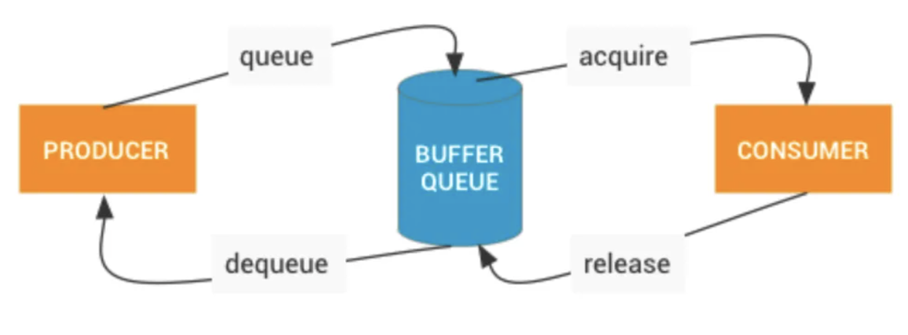

# Window的创建

1.   在Activity启动时会创建一个Window（PhoneWindow），并将这个Window关联一个WindowManager。
2.   WindowManager的类型是WindowManagerImpl，但是具体逻辑是WindowManagerGlobal实现的，WindowManagerGlobal是一个单例。
3.   一般在Activity的onCreate方法中setContentView，setContentView会创建一个DecorView。即使没有setContentView，在ActivityThread的handleResumeActivity中也会创建，并将添加到WindowManager中。
4.   在WindowManagerGlobal的addView方法中，会创建ViewRootImpl。
5.   ViewRootImpl通过WindowSession和WMS建立联系。
6.   在WMS中会为这个添加的Window分配Surface，而WMS会将它所管理的Surface交由SurfaceFlinger处理，SurfaceFlinger会将这些Surface混合并绘制到屏幕上。

# ViewRootImpl

1.   View树的根并管理View树。
2.   触发View的测量、布局和绘制。
3.   输入事件的中转站。
4.   管理Surface。
5.   负责与WMS进行进程间通信。

# View的绘制流程

## invalidate

1.  当View调用invalidate后，会添加`PFLAG_INVALIDATED`标志位，并不断遍历ViewParent。软件绘制会添加`PFLAG_INVALIDATED`，但是硬件绘制不一定会添加，这也是硬件绘制中子View invalidate不一定会触发ViewGroup draw的原因。
2.  顶层ViewParent是ViewRootImpl，ViewRootImpl最终会调用scheduleTraversals。
3.  软件绘制和硬件绘制流程类似，只是细节不一样，最终都会调用scheduleTraversals。
4.  scheduleTraversals最终会调用performTraversals。
5.  **由于没有设置mLayoutRequested，因此只有满足其它条件时才会执行 measure 和 layout 流程，否则只执行 draw 流程**（即invalidate方法并不一定会触发测量和布局）。

## requestLayout

代码流程略

1.  requestLayout的流程和invalidate类似，调用Parent的requestLayout，最终调用ViewRootImpl的requestLayout。requestLayout中View和Parent都会添加`PFLAG_INVALIDATED`。
2.  ViewRootImpl的requestLayout将mLayoutRequested设置为true，并调用scheduleTraversals。
3.  因为mLayoutRequested置为了true，requestLayout一定会触发 measure 和 layout 流程。

## scheduleTraversals

1.  scheduleTraversals做了2件事，一是在主线程消息循环放置一个同步屏障。二是通过Choreographer post一个TraversalRunnable。
2.  TraversalRunnable会移除同步屏障（通过一个token标识）并且调用performTraversals。

## performTraversals

1.   在ViewRootImpl的requestLayout中会触发经典的performTraversals，在performTraversals中会调用会调用performMeasure、performLayout、performDraw触发View的绘制。

# 软件绘制

1.   ViewRootImpl通过WindowSession从WMS获取一个Surface。
2.   通过这个Surface的lockCanvas获取一个Canvas，将它传递给各个View draw。
3.   lockCanvas会获取一块buffer，用Canvas来填充buffer。
4.   绘制完成，调用unlockCanvasAndPost，释放buffer。

# 硬件绘制

1.   在ViewRootImpl通过setView添加DecorView的时候会开启硬件绘制并创建ThreadedRenderer。
2.   在ThreadedRenderer初始化期间，会创建一个RootRenderNode，用来表示RenderNode的根节点。ThreadedRenderer还会在Native层启动一个RenderThread单例线程。
3.   在ViewRootImpl的performTraversals，最终调用ThreadedRenderer的draw方法。
4.   在绘制前会申请一块buffer。
5.   ThreadedRenderer会遍历View树来更新DisplayList，记录绘制操作，但不进行具体的渲染。
6.   最终调用syncAndDrawFrame交给RenderThread渲染。


# Vsync

1.  app的Vsync：服务于客户端APP UI渲染。
2.  sf的Vsync：服务于`SurfaceFlinger`合成和上屏。

## app的Vsync

1.   Choreographer创建时，会通过Binder获取SF对象，并与SF中的app EventThread建立BitTube。
2.   当Choreographer postCallback时，会调用scheduleVsync，最终调用requestNextVsync。
3.   requestNextVsync通过BitTube会唤醒app EventThread。
4.   app EventThread再通过BitTube通知app进程handleEvent。

## sf的Vsync

1.   生产者处理完会调用queueBuffer，而queueBuffer会触发消费者的回调，最终调用sf EventThread的requestNextVsync。
2.   这样sf的MessageQueue接收到event，并调用handlePageFlip。

## 为什么用2个vsync

个人思考：主要原因是错开app ui渲染和sf的合成。如果只有一个，那么app ui渲染需要等sf合成完再进行渲染。

# BufferQueue循环



1.   app在lockCanvas时会dequeueBuffer，在unlockCanvasAndPost会queueBuffer。
2.   sf在handlePageFlip中会acquireBuffer和releaseBuffer。

# Surface相关

## SurfaceView

[SurfaceView官方介绍](https://source.android.com/docs/core/graphics/arch-sv-glsv?hl=zh-cn)

```
public class SurfaceView extends View implements ViewRootImpl.SurfaceChangedCallback
```

1.   SurfaceView继承了View类，可以嵌入到 View 层次结构中。
2.   SurfaceView 的内容是透明的，因为SurfaceView有一个单独的Surface，独立于主线程的Surface，可以在子线程中单独渲染。
3.   当使用外部缓冲区来源（例如 GL 上下文和媒体解码器）进行渲染时，需要从缓冲区来源复制缓冲区，以便在屏幕上显示这些缓冲区。为此，可以使用 SurfaceView。
4.   网上说SurfaceView不支持平移，缩放，旋转等动画，但是经个人测试，在android11手机上可以执行这些操作。

## GLSurfaceView

```
public class GLSurfaceView extends SurfaceView implements SurfaceHolder.Callback2
```

GLSurfaceView继承了SurfaceView，具有SurfaceView的特性。除此之外，GLSurfaceView 会创建一个渲染线程，并在线程上配置 EGL 上下文。

可以理解为：GLSurfaceView是带有gl环境的SurfaceView。

## SurfaceTexture

[SurfaceTexture官方介绍](https://source.android.com/docs/core/graphics/arch-st?hl=zh-cn)

基本使用：

1.   OpenGl创建Texture并返回textureId。
2.   通过textureId来创建SurfaceTexture。
3.   生产Buffer
4.   SurfaceTexture会回调onFrameAvailable，并在其中调用updateTexImage释放Buffer。这样OpenGl可以将此Buffer作为外部纹理使用。

生产Buffer的一种方式：

1.   通过这个SurfaceTexture来创建一个Surface。
2.   再通过这个Surface的lockCanvas和unlockCanvas来生产Buffer。

## TextureView

[TextureView官方介绍](https://source.android.com/docs/core/graphics/arch-tv?hl=zh-cn)

TextureView封装了SurfaceTexture，当外层生产了Buffer，TextureView在onFrameAvailable回调中调用View的invalidate。

View的invalidate会触发TextureView的draw方法。

1.   一般的View通过draw方法的Canvas来生产Buffer，而TextureView并直接没有使用Canvas，而是通过TextureLayer绘制的。
2.   TextureView的绘制需要硬件渲染。因为draw方法判断了`canvas.isHardwareAccelerated()`

## SurfaceView和TextureView的区别

两者的介绍见上，从介绍中可以看出区别。

SurfaceView的性能较好，因为可以单独渲染。而TextureView需要将Buffer合到主线程中，再通过主线程渲染。

