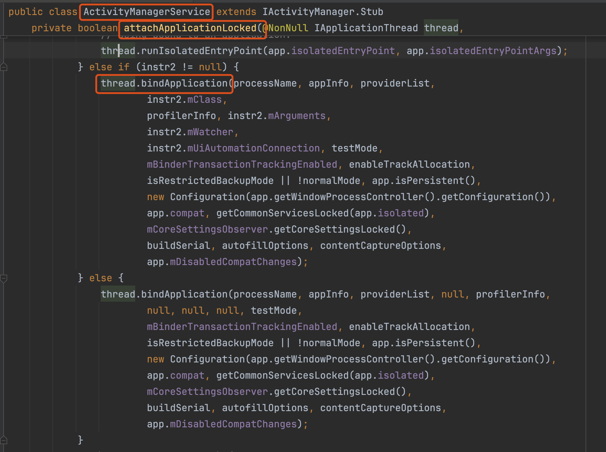

# 介绍

AMS在启动应用程序的时候会检查对应的进程是否存在，如果不存在就会请求Zygote进程启动需要的应用程序进程。

在Zygote进程中会有一个名为zygote的Socket，这个Socket用来等待AMS请求Zygote来创建新的应用程序进程。Zygote进程通过fock自身创建应用程序进程，这样应用程序进程就会获得Zygote进程在启动时创建的虚拟机实例副本。除此之外，还创建了Binder线程池和消息循环。

主要流程分为两部分：AMS发送启动应用程序进程请求、Zygote接收请求并创建应用程序进程。

# AMS发送启动请求

启动前会进行创建启动需要的参数，如uid、gid等，然后连接Zygote进程中名为zygote的Socket，从而通知启动进程请求。

注意，这里说的Socket和`java.net.Socket`不一样，其类型为：

```java
/**
 * Creates a (non-server) socket in the UNIX-domain namespace. The interface
 * here is not entirely unlike that of java.net.Socket. This class and the streams
 * returned from it may be used from multiple threads.
 */
public class LocalSocket implements Closeable { ... }
```

Java的Socket连接一般要指定Host和端口，而这里只要name。

# Zygote接收请求并创建进程

当Zygote进程接收到AMS的请求时，根据请求参数来fork自身创建应用程序进程。

除了创建进程，还做了这么一些事情：

1.  创建Binder线程池。
2.  通过抛异常的方式来清空设置过程的堆栈帧。
3.  调用ActivityThread的main方法。

第二点说明一下：

在调用main方法之前会有很多配置方法，为了让main方法像是入口方法，通过抛异常的方式来将之前的栈帧移除。同时也会将栈中过时栈帧移除，因为Android主线程是一个死循环，如果不通过这种方式，之前的栈帧不会被抛出。

# 消息循环创建过程

Zygote创建完应用进程后会调用ActivityThread的main方法。ActivityThread主要用来管理主线程，main方法内部会创建H类对象，继承自Handler，用于处理主线程的消息循环。然后通过`Looper.loop()`开启消息循环。

```java
public static void main(String[] args) {
  // ...
  Looper.prepareMainLooper();
  // ...
  ActivityThread thread = new ActivityThread();
  thread.attach(false, startSeq);
  // ...
  Looper.loop();
  // ... 
}
```

构造ActivityThread对象时会创建H对象：

```java
final H mH = new H();
```

# 创建并初始化 Application

ActivityThread的main调用attach方法进行 Binder 通信，通知system_server进程执行 `ActivityManagerService#attachApplication(mAppThread)`方法，用于初始化Application和Activity。



在system_server进程中，`ActivityManagerService#attachApplication(mAppThread)`里初始化Application。

`thread#bindApplication() `方法通知主线程H，然后调用handleBindApplication方法创建 Application 对象、绑定 Context 、执行 Application#onCreate() 生命周期。

# 总结

1.   AMS在启动应用程序的时候会检查对应的进程是否存在，如果不存在就会请求Zygote进程启动需要的应用程序进程。
2.   当Zygote进程接收到AMS的请求时，根据请求参数来fork自身创建应用程序进程。
3.   调用ActivityThread的main方法，并开启主线程的消息循环。
4.   调用handleBindApplication方法创建 Application 对象、绑定 Context 、执行 Application#onCreate 生命周期。

# 参考

1. https://juejin.cn/post/6844904116561379341
