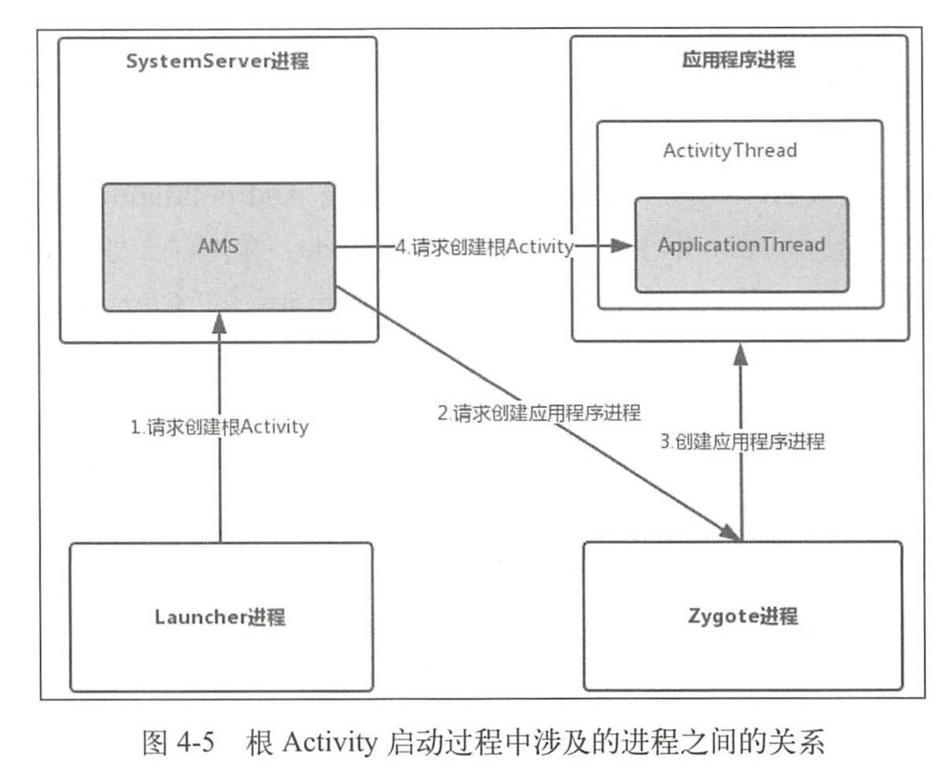

这里总结根Activity的启动过程。主要分为3个部分：Launcher请求AMS过程、AMS到ApplicationThread的调用过程和ActivityThread启动Activity。

# Launcher请求AMS过程

一般情况下启动根Activity都是通过点击桌面的快捷图标，所以从这里当作入口。

桌面对应着类是Launcher，Launcher本身也是一个Activity：

```java
public final class Launcher extends Activity
```

和一般启动Activity一样，Launcher启动应用程序时也会调用startActivity方法。

startActivity方法方法内部会获取AMS（运行在SystemServer进程）在本地的代理对象（IActivityTaskManager），并调用其startActivity方法。

由于Launcher和AMS处在不同的进程，所以这期间是通过跨进程通信进行交互。

# AMS到ApplicationThread的调用过程

此时代码逻辑已经到了AMS中。

根Activity启动Intent的flag为`FLAG_ACTIVITY_NEW_TASK`，因此会创建一个新的TaskRecord，用来描述一个Activity任务栈。

然后获取Activity的启动进程，如果不存在就创建（见[应用程序进程的创建](./02 应用进程启动过程.md)）。

如果存在应用程序进程，就在应用程序进程中启动根Activity。

上述逻辑都是运行在AMS所在的SystemServer进程中，如果想要与目标应用程序进程通信，就需要跨进程通信。类似地，AMS也需要一个本地代理来与目标进程交互，这个对象就是ActivityThread的内部类ApplicationThread，它继承了IApplicationThread.Stub。


# ActivityThread启动Activity的过程

此时逻辑就运行在应用程序进程中了。

## 切到主线程

先调用ApplicationThread的scheduleLaunchActivity方法（ApplicationThread是ActivityThread的内部类）。将启动Activity的参数封装成ActivityClientRecord，然后通过sendMessage将消息发送出去。

上面说到AMS与应用程序进程是通过ApplicationThread进行跨进程通信，所以ApplicationThread本质是一个Binder，运行在Binder线程池。另外一个点，在应用程序进程创建完，会创建主线程消息循环处理对象`H`对象，并开启主线程消息循环。所以需要Handler将逻辑回调到主线程。

## 预启动performLaunchActivity

启动Activity的一个核心方法：

```java
//ActivityThread.java
private Activity performLaunchActivity(ActivityClientRecord r, Intent customIntent) {

    //获取ActivityInfo
    ActivityInfo aInfo = r.activityInfo;//ActivityInfo用于存储AndroidManifes设置的Activity和Receiver节点信息，比如Activity的theme和launchMode。
    
    if (r.packageInfo == null) {
        //获取APK的描述类LoadApk
        r.packageInfo = getPackageInfo(aInfo.applicationInfo, r.compatInfo, Context.CONTEXT_INCLUDE_CODE);//获取APK的描述类LoadApk，应用程序进程在启动Activity的时候会将Activity所属的APK加载进来，LoadApk就是描述已加载的APK文件的。
    }

    ComponentName component = r.intent.getComponent();//获取要启动的Activity的ComponentName，在ComponentName类中保存了该Activity的包名和类名。
    
    //创建要启动Activity的上下文。
    ContextImpl appContext = createBaseContextForActivity(r);
    
    Activity activity = null;
    try {
        java.lang.ClassLoader cl = appContext.getClassLoader();
        
        //用类加载器来创建Activity的实例
        activity = mInstrumentation.newActivity( cl, component.getClassName(), r.intent);
      //。。。
    } //。。。

    try {
        Application app = r.packageInfo.makeApplication(false, mInstrumentation);//创建Application，makeApplication内部会调用Application的onCreate方法。
		
        //。。。
        if (activity != null) {
            //。。。
            
            //初始化Activity
            activity.attach(appContext, this, getInstrumentation(), r.token, r.ident, app, r.intent, r.activityInfo, title, r.parent, r.embeddedID, r.lastNonConfigurationInstances, config, r.referrer, r.voiceInteractor, window, r.configCallback);//这里调用Activity的attach方法初始化Activity，并会创建Window对象（PhoneWindow）与自身关联。

            //。。。
            if (r.isPersistable()) {
                mInstrumentation.callActivityOnCreate(activity, r.state, r.persistentState);//这里调用Instrumentation的callActivityOnCreate方法来启动Activity。
            } else {
                mInstrumentation.callActivityOnCreate(activity, r.state);
            }
        }
    }
    //。。。
    return activity;
}
```

上面最后一个注释调用了Instrumentation的callActivityOnCreate方法。

**Instrumentation#callActivityOnCreate**

```java
public void callActivityOnCreate(Activity activity, Bundle icicle,
        PersistableBundle persistentState) {
    prePerformCreate(activity);
    activity.performCreate(icicle, persistentState);
    postPerformCreate(activity);
}
```

**Activity#performCreate**

```java
final void performCreate(Bundle icicle, PersistableBundle persistentState) {
    //。。。
    if (persistentState != null) {
        onCreate(icicle, persistentState);
    } else {
        onCreate(icicle);
    }
    //。。。
}
```

在performCreate会调用Activity的onCreate方法，这样根Activity就启动了，即应用程序启动了。

## 小结

先梳理一些关键的类：

-   应用程序进程创建后会运行代表主线程的实例ActivityThread，它管理着当前应用程序进程的主线程。

-   ActivityClientRecord：启动Activity的参数
-   H：应用程序进程中主线程的消息管理类。
-   ActivityInfo：存储AndroidManifes设置的Activity和Receiver节点信息，比如Activity的theme和launchMode。
-   LoadApk：应用程序进程在启动Activity的时候会将Activity所属的APK加载进来，LoadApk就是描述已加载的APK文件的。
-   ComponentName：保存Activity的包名和类名。
-   Instrumentation：主要用来监控应用程序和系统的交互。

然后梳理一下ActivityThread启动Activity的过程：

ApplicationThread将启动Activity的参数进行封装，并通知H消息管理类发送处理启动Activity的逻辑（因为ApplicationThread是一个Binder，方法运行在Binder池中，所以需要Handler将逻辑回调到主线程）。

然后根据参数创建Context对象，Activity对象和Application对象。

接着初始化Activity，并回调onCreate生命周期，至此应用程序启动了。

# 根Activity启动过程中涉及的进程

根Activity启动过程中会涉及到四个进程：Zygote进程，Launcher进程，AMS所在进程（SystemServer），应用程序进程。关系如下：



首先Launcher进程向AMS请求创建根Activity，AMS会判断根Activity所需的应用程序进程是否存在并启动，如果不存在就会请求Zygote进程创建应用程序进程。应用程序进程启动后，AMS会请求创建应用程序进程并启动根Activity。

步骤2采用的是Socket通信，步骤1和步骤4采用的是Binder通信。

如果是普通Activity的话，启动过程只会涉及2个：AMS所在进程和应用程序进程。

# 总结

1.   应用进程调用startActivity方法。
2.   startActivity方法内部会获取AMS（运行在SystemServer进程）在应用进程的代理对象（IActivityTaskManager），并调用其startActivity方法。
3.   此时逻辑到了AMS中。如果任务栈不存在，那么会创建一个新的TaskRecord，用来描述一个Activity任务栈。
4.   如果Activity进程不存在，那么通过一个Socket通知Zygote进程。
5.   当Zygote进程接收到AMS的请求时，根据请求参数来fork自身创建应用程序进程。
6.   调用ActivityThread的main方法，并开启主线程的消息循环。
7.   Activity进程启动后，AMS通过ActivityThread的内部类ApplicationThread（继承了IApplicationThread.Stub）与应用进程交互。
8.   ApplicationThread将启动Activity的参数进行封装，并通知H消息管理类发送处理启动Activity的逻辑（因为ApplicationThread是一个Binder，方法运行在Binder池中，所以需要Handler将逻辑回调到主线程）。
9.   然后在performLaunchActivity中创建Context对象，Activity对象和Application对象。
10.   最后回调Activity的onCreate，Activity启动完毕。
