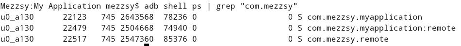
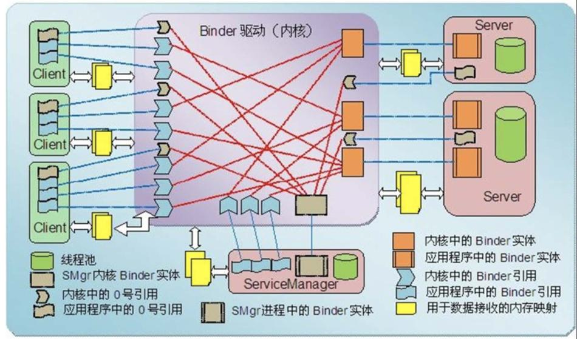

# 简介

IPC，Inter Process Communication，含义为进程间通信，是指两个进程之间进行数据交换的过程。

Android的内核是Linux，但是它的IPC方式并不能完全继承Linux，它有自己的IPC方式，最有特色的就是Binder，也可以用Socket。

# Linux进程基本概念


上图展示了 Linux 中跨进程通信涉及到的一些基本概念：

- 进程隔离
- 进程空间划分：用户空间(User Space)/内核空间(Kernel Space)
- 系统调用：用户态/内核态

## 进程隔离

简单的说就是操作系统中，进程与进程间内存是不共享的。A 进程和 B 进程之间要进行数据交互就得采用特殊的通信机制：进程间通信（IPC）。

## 用户空间和内核空间

现在操作系统都是采用的虚拟存储器，对于 32 位系统而言，它的寻址空间（虚拟存储空间）就是 2 的 32 次方，也就是 4GB。操作系统的核心是内核，独立于普通的应用程序，可以访问受保护的内存空间，也可以访问底层硬件设备的权限。为了保护用户进程不能直接操作内核，保证内核的安全，操作系统从逻辑上将虚拟空间划分为用户空间（User Space）和内核空间（Kernel Space）。针对 Linux 操作系统而言，将最高的 1GB 字节供内核使用，称为内核空间；较低的 3GB 字节供各进程使用，称为用户空间。

## 系统调用：用户态与内核态

虽然从逻辑上进行了用户空间和内核空间的划分，但不可避免的用户空间需要访问内核资源，比如文件操作、访问网络等等。为了突破隔离限制，就需要借助**系统调用**来实现。系统调用是用户空间访问内核空间的唯一方式，保证了所有的资源访问都是在内核的控制下进行的，避免了用户程序对系统资源的越权访问，提升了系统安全性和稳定性。

Linux 使用两级保护机制：0 级供系统内核使用，3 级供用户程序使用。

当一个任务（进程）执行系统调用而陷入内核代码中执行时，称进程处于**内核运行态（内核态）**。此时处理器处于特权级最高的（0级）内核代码中执行。当进程处于内核态时，执行的内核代码会使用当前进程的内核栈。每个进程都有自己的内核栈。

当进程在执行用户自己的代码的时候，我们称其处于**用户运行态（用户态）**。此时处理器在特权级最低的（3级）用户代码中运行。

系统调用主要通过如下两个函数来实现：

```
copy_from_user() //将数据从用户空间拷贝到内核空间
copy_to_user() //将数据从内核空间拷贝到用户空间
```

# Android中的多进程模式

## 开启多进程

```xml
<activity android:name=".demo06.D06Activity" />
<activity
    android:name=".demo06.FirstActivity"
    android:process=":remote" />
<activity
    android:name=".demo06.SecondActivity"
    android:process="com.mezzsy.remote" />
```

分别为FirstActivity和SecondActivity指定了process 属性，并且它们的属性值不同，这意味着当前应用又增加了两个新进程。当前应用的包名为"com.mezzsy.myapplication"，当FirstActivity 启动时，系统会为它创建一个单独的进程，进程名为"com.mezzsy.myapplication:remote"，当SecondActivity启动时，系统也会为它创建一个单独的进程，进程名为“com.mezzsy.remote"。同时D06Activity没有为它指定process属性，那么它运行在默认进程中，默认进程的进程名是包名。运行一下看看效果：

输入`adb shell ps | grep "com.mezzsy"`查看相关的进程



FirstActivity 和SecondActivity的`android:process`属性分别为 ":remote" 和 "com.mezzsy.remote" 。这两种方式的区别：

1. ":" 的含义是指要在当前的进程名前面附加上当前的包名，这是一种简写的方法，对于FirstActivity 来说，它完整的进程名为 com.mezzsy.myapplication:remote ，通过图中的进程信息也能看出来。
   对于SecondActivity中的声明方式，它是一种完整的命名方式，不会附加包名信息。
2. 其次，进程名以“:”开头的进程属于当前应用的私有进程，其他应用的组件不可以和它跑在同一个进程中，而进程名不以“:”开头的进程属于全局进程，其他应用通过ShareUID方式可以和它跑在同一个进程中。
   Android系统会为每个应用分配一个唯一的UID，具有相同UID的应用才能共享数据。两个应用通过ShareUID跑在同一个进程中是有要求的，需要这两个应用有相同的ShareUID并且签名相同才可以。在这种情况下，它们可以互相访问对方的私有数据，比如data目录、组件信息等，不管它们是否跑在同一个进程中。当然如果它们跑在同一个进程中，那么除了能共享data目录、组件信息，还可以共享内存数据，或者说它们看起来就像是一个应用的两个部分。

## 多进程会出现的问题

1. 静态成员和单例模式完全失效
2. 线程同步进制完全失效。
3. SharePreferences的可靠性降低
4. Application会被多次创建

分析问题原因：

1. Android会为每个应用或者进程分配一个独立的虚拟机，不同的虚拟机在内存分配上有不同的分配空间，导致同一个类的对象会有多个副本。
2. 和第一个类似，因为不同进程锁的不是同一个对象。
3. SharePreferences不支持两个进程同时执行写操作，否则会一定几率导致数据丢失，因为SharePreferences底层是通过XML文件来实现的，系统对它的读写有一定的缓存策略，即在内存中会有一份SharePreferences文件的缓存，并发写可能会出现问题
4. 系统创建新的进程会分配独立的虚拟机，相当于启动一个应用。或者这么说，运行在同一个进程的组件是属于同一个虚拟机和同一个Application的。

可以这么理解：一个应用的多进程，相当于两个不同的应用采用了ShareUID的模式。

# 序列化

对象的序列化是把`Java`对象转化为字节序列并存储至一个存储媒介（硬盘或者内存）的过程，反序列化则是把字节序列恢复为`Java`对象的过程，但它们仅处理`Java`变量而不处理方法。

## 序列化的使用场景

- Intent和Binder传输数据时就需要序列化。
- 需要把对象持久化到存储设备上或者通过网络传输给其他客户端。

## Serializable使用

```kotlin
val obj = SerializableObject(1, "a")
// 序列化
val byteOut = ByteArrayOutputStream()
val objectOut = ObjectOutputStream(byteOut)
objectOut.writeObject(obj)
objectOut.close()
// 反序列化
val byteIn = ByteArrayInputStream(byteOut.toByteArray())
val objectIn = ObjectInputStream(byteIn)
val secondObj: SerializableObject = objectIn.readObject() as SerializableObject
objectIn.close()

Log.i(TAG, "testSerializable: first:$obj")
Log.i(TAG, "testSerializable: second:$secondObj")
Log.i(TAG, "testSerializable: equal:${obj == secondObj}")
```

```
I/MeTestSerializeActivity: testSerializable: first:SerializableObject(intVal=1, StringVal=a)
I/MeTestSerializeActivity: testSerializable: second:SerializableObject(intVal=1, StringVal=a)
I/MeTestSerializeActivity: testSerializable: equal:true
```

也可以自定义实现序列化方式：

```
private void readObject(java.io.ObjectInputStream stream)
       throws IOException, ClassNotFoundException;
private void writeObject(java.io.ObjectOutputStream stream)
       throws IOException
private void readObjectNoData()
       throws ObjectStreamException;
```

## Serializable原理

### 介绍

1.   Serializable是java的一个序列化接口，是一个空接口，为对象提供标准的序列化和反序列化。
2.   serialVersionUID在序列化和反序列化中启到作用。
     serialVersionUID相同才能够正常地被反序列化。serialVersionUID的详细工作机制是这样的：序列化的时候系统会把当前类的serialVersionUID写入序列化的文件中（也可能是其他中介），当反序列化的时候系统会去检测文件中的serialVersionUID， 看它是否和当前类的serialVersionUID一致，如果一致就说明序列化的类的版本和当前类的版本是相同的，这个时候可以成功反序列化；否则就说明当前类和序列化的类相比发生了某些变换，比如成员变量的数量、类型可能发生了改变，这个时候是无法正常反序列化的。
3.   静态成员属于类不属于对象，不会参与序列化，加了transient的不会参与序列化。
4.   Serializable接口之所以定义为空，是因为它只起到了一个标识的作用，告诉程序实现了它的对象是可以被序列化的，但真正序列化和反序列化的操作并不需要它来完成。

>   原理参考：https://blog.csdn.net/abc123lzf/article/details/82318148

Serializable的原理主要是ObjectOutputStream和ObjectInputStream，这里偷个懒，只介绍ObjectOutputStream，ObjectInputStream原理应该差不多。

### 核心方法writeObject

```java
public final void writeObject(Object obj) throws IOException {
    // ...
    try {
        writeObject0(obj, false);
    } catch (IOException ex) {
        // ...
    }
}
```

```java
private void writeObject0(Object obj, boolean unshared) throws IOException
    {
        // ...
        try {
            // ...
            Object orig = obj;
            Class<?> cl = obj.getClass();
            ObjectStreamClass desc;
			// ...
            Class repCl;
            desc = ObjectStreamClass.lookup(cl, true);
            // ...

            // BEGIN Android-changed: Make Class and ObjectStreamClass replaceable.
            if (obj instanceof Class) {
                writeClass((Class) obj, unshared);
            } else if (obj instanceof ObjectStreamClass) {
                writeClassDesc((ObjectStreamClass) obj, unshared);
            // END Android-changed:  Make Class and ObjectStreamClass replaceable.
            } else if (obj instanceof String) {
                writeString((String) obj, unshared);
            } else if (cl.isArray()) {
                writeArray(obj, desc, unshared);
            } else if (obj instanceof Enum) {
                writeEnum((Enum<?>) obj, desc, unshared);
            } else if (obj instanceof Serializable) {
                writeOrdinaryObject(obj, desc, unshared);
            } else {
                if (extendedDebugInfo) {
                    throw new NotSerializableException(
                        cl.getName() + "\n" + debugInfoStack.toString());
                } else {
                    throw new NotSerializableException(cl.getName());
                }
            }
        } finally {
            // ...
        }
    }
```

writeObject根据obj的类型选择对应的方法，这里分析writeOrdinaryObject，也就是对象是Serializable类型。

### lookup方法

简单提一下lookup方法。（有空可以看一下lookup的实现细节，其中的代码考虑了并发、弱应用、缓存）

lookup方法从缓存里找到一个ObjectStreamClass，如果没有就创建一个。

ObjectStreamClass存储了一个Class对象的信息，其实例变量包括：Class对象，Class名称，serialVersionUID，实现了Serializable接口还是 Externalizable接口，非transient修饰的变量，自定义的writeObject和readObject的Method对象。

### 写入对象数据

```java
private void writeOrdinaryObject(Object obj,
                                 ObjectStreamClass desc,
                                 boolean unshared)
    throws IOException
{
    // ...
    try {
        // ...
        bout.writeByte(TC_OBJECT);
        writeClassDesc(desc, false);
        handles.assign(unshared ? null : obj);
        if (desc.isExternalizable() && !desc.isProxy()) {
            writeExternalData((Externalizable) obj);
        } else {
            writeSerialData(obj, desc);
        }
    } finally {
        if (extendedDebugInfo) {
            debugInfoStack.pop();
        }
    }
}
```

```java
private void writeSerialData(Object obj, ObjectStreamClass desc)
    throws IOException
{
    ObjectStreamClass.ClassDataSlot[] slots = desc.getClassDataLayout();
    for (int i = 0; i < slots.length; i++) {
        ObjectStreamClass slotDesc = slots[i].desc;
        if (slotDesc.hasWriteObjectMethod()) {
            // ...通过自定义的writeObject来写入对象数据
        } else {
            defaultWriteFields(obj, slotDesc);
        }
    }
}
```

```java
private void defaultWriteFields(Object obj, ObjectStreamClass desc)
    throws IOException
{
    // ...先写入基础类型数据
    int primDataSize = desc.getPrimDataSize();
    if (primVals == null || primVals.length < primDataSize) {
        primVals = new byte[primDataSize];
    }
    desc.getPrimFieldValues(obj, primVals);
    bout.write(primVals, 0, primDataSize, false);

    // 再写入Object类型数据
    ObjectStreamField[] fields = desc.getFields(false);
    Object[] objVals = new Object[desc.getNumObjFields()];
    int numPrimFields = fields.length - objVals.length;
    desc.getObjFieldValues(obj, objVals);
    for (int i = 0; i < objVals.length; i++) {
        // ...
        writeObject0(objVals[i],
                         fields[numPrimFields + i].isUnshared());
        // ...
    }
}
```

1.   先写入TC_OBJECT（*0x73*）表示是对象，再写入*class*信息，最后再写入对象数据。
2.   writeSerialData方法里有个ClassDataSlot数组，是因为对象类型是有父类的，还需要序列化父类数据。如果类型自定义了writeObject方法就通过自定义的writeObject来写入对象数据。否则调用defaultWriteFields方法。
3.   defaultWriteFields方法先是写入基础类型数据，再写入Object类型数据，Object类型就递归调用writeObject方法。

### 总结

1.  ObjectOutputStream的构造函数内部会创建一个BlockDataOutputStream对象，这个对象处理写入流的逻辑。
2.  ObjectOutputStream一般调用writeObject方法，先获取ObjectStreamClass对象，该对象封装了Obj的class信息。
3.  然后根据Obj的类型执行对应的write方法，Obj一般是Serializable，所以调用writeOrdinaryObject方法。
4.  先写入字节*0x73*，表示是对象，再写入*class*信息，最后写入这个对象变量信息及其父类的成员变量（writeSerialData）。
5.  writeSerialData方法遍历了ClassDataSlot数组，是因为对象类型是有父类的，还需要序列化父类数据。
6.  如果Obj自定义了writeObject方法就使用Obj的方法，否则默认处理。
7.  默认的写入方式是这样的：先写入基础类型的成员变量，再写入Object类型的成员变量。Object类型的成员变量的写入会递归调用writeObject方法。

## Parcelable使用

```kotlin
data class ParcelableObject(val intVal: Int, val StringVal: String) : Parcelable {
    constructor(parcel: Parcel) : this(
            parcel.readInt(),
            parcel.readString() ?: "") {
    }

    override fun writeToParcel(parcel: Parcel, flags: Int) {
        parcel.writeInt(intVal)
        parcel.writeString(StringVal)
    }

    override fun describeContents(): Int {
        return 0
    }

    companion object CREATOR : Parcelable.Creator<ParcelableObject> {
        override fun createFromParcel(parcel: Parcel): ParcelableObject {
            return ParcelableObject(parcel)
        }

        override fun newArray(size: Int): Array<ParcelableObject?> {
            return arrayOfNulls(size)
        }
    }
}
```

其中相关方法介绍：

| 方法                                 | 功能                                                         | 标记位                         |
| ------------------------------------ | ------------------------------------------------------------ | ------------------------------ |
| createFromParcel(Parcel in)          | 从序列化后的对象中创建原始对象                               |                                |
| newArray(int size)                   | 创建指定长度的原始对象数组                                   |                                |
| User(Parcel in)                      | 从序列化后的对象中创建原始对象                               |                                |
| writeToParcel(Parcel out, int flags) | 将当前对象写入序列化结构中，其中flags标识有两种值：0或者1。为1时标识当前对象需要作为返回值返回，不能立即释放资源，几乎所有情况都为0 | PARCELABLE_ WRITE RETURN VALUE |
| describeContents                     | 返回当前对象的内容描述。如果含有文件描述符，返回1，否则返回0，几乎所有情况都返回0 | CONTENTS FILE_ DESCRIPTOR      |

序列化部分：

```kotlin
private fun testParcelable() {
    var parcel = Parcel.obtain()

    // 序列化
    val firstObj = ParcelableObject(1, "a")
    // 反序列化，两种方式
    // 方式一
    firstObj.writeToParcel(parcel, 0)
    parcel.setDataPosition(0)
    val secondObj = ParcelableObject.createFromParcel(parcel)

    parcel.recycle()

    parcel = Parcel.obtain()

    // 方式二
    parcel.writeParcelable(firstObj, 0)
    parcel.setDataPosition(0)
    val thirdObj = parcel.readParcelable<ParcelableObject>(firstObj.javaClass.classLoader)
    Log.i(TAG, "testSerializable: first:$firstObj")
    Log.i(TAG, "testSerializable: second:$secondObj")
    Log.i(TAG, "testSerializable: third:$thirdObj")
    Log.i(TAG, "testSerializable: equal:${firstObj == secondObj}")
    Log.i(TAG, "testSerializable: equal:${firstObj == thirdObj}")

    parcel.recycle()
}
```

```
I/MeTestSerializeActivity: testParcelable: class1:class com.mezzsy.myapplication.other.serialize.ParcelableObject
I/MeTestSerializeActivity: testSerializable: first:ParcelableObject(intVal=1, StringVal=a)
I/MeTestSerializeActivity: testSerializable: second:ParcelableObject(intVal=1, StringVal=a)
I/MeTestSerializeActivity: testSerializable: third:ParcelableObject(intVal=1, StringVal=a)
I/MeTestSerializeActivity: testSerializable: equal:true
I/MeTestSerializeActivity: testSerializable: equal:true
```

说明：

1.   序列化功能由writeToParcel方法来完成，最终是通过Parcel中的一系列write方法来完成的；
2.   反序列化功能由CREATOR来完成，其内部标明了如何创建序列化对象和数组，并通过Parcel的一系列 read方法来完成反序列化过程；
3.   内容描述功能由describeContents方法来完成，几乎在所有情况下这个方法都应该返回0，仅当当前对象中存在文件描述符时，此方法返回1。
4.   需要注意的是，在User(Parcel in)方法中，由于book是另一个可序列化对象，所以它的反序列化过程需要传递当前线程的上下文类加载器，否则会报无法找到类的错误。
5.   Parcelable的原理是将对象转为byte数组，所以可以将byte数组存储到本地。

## Parcelable原理

c++Parcel

**写数据**

```c++
template<class T>
status_t Parcel::writeAligned(T val) {
    static_assert(PAD_SIZE_UNSAFE(sizeof(T)) == sizeof(T));

    if ((mDataPos+sizeof(val)) <= mDataCapacity) {
restart_write:
        *reinterpret_cast<T*>(mData+mDataPos) = val;
        return finishWrite(sizeof(val));
    }

    status_t err = growData(sizeof(val));
    if (err == NO_ERROR) goto restart_write;
    return err;
}
```

**扩容**

```c++
status_t Parcel::growData(size_t len)
{
    // ...
    size_t newSize = ((mDataSize+len)*3)/2;
    return continueWrite(newSize);
}
```

总结
1. 通过Parcel.obtain获取Parcel对象。该方法会创建一个nativePtr，在c++层创建一个对应的Parcel对象。
2. 通过writeValue写入对象数据。最终是调用c++层的`Parcel::writeAligned`，如果buffer长度够，就写入。如果不够，就扩容`Parcel::growData`再写入。新size：`newSize = ((mDataSize+len)*3)/2`。如果是Obj对象，会先wirteInt，写入对象的类型，再写入对象本身的数据。比如对象是Double，先写入int VAL_DOUBLE = 8，再写入obj。
3. 在写入时，会移动指针mDataPos，所以在readValue前需要setDataPosition(0)。
4. 通过readValue反解对象，实现Parcelable接口的类需要有CREATOR对象，readValue在反解时会反射获取CREATOR对象，调用CREATOR对象的createFromParcel来创建新对象。

## 两者区别

Serializable使用IO读写存储在硬盘上。序列化过程使用了反射技术，并且期间产生临时对象，容易引发频繁的gc。优点代码少。

Parcelable是直接在内存中读写，我们知道内存的读写速度肯定优于硬盘读写速度，所以Parcelable序列化方式性能上要优于Serializable方式很多。但是代码写起来相比Serializable方式麻烦一些。

在这两种情况下建议使用Serializable：将对象序列化到存储设备，将序列化对象通过网络传输。

## 两者选择

既然Parcelable和Serializable都能实现序列化并且都可用于Intent间的数据传递，那么二者该如何选取呢？

Serializable是Java中的序列化接口，其使用起来简单但是开销很大，序列化和反序列化过程需要大量I/O操作。而Parcelable是Android中的序列化方式，因此更适合用在Android平台上，它的缺点就是使用起来稍微麻烦点，但是它的效率很高，这是Android推荐的序列化方式，因此首选Parcelable。 

Parcelable主要用在内存序列化上，通过Parcelable将对象序列化到存储设备中或者将对象序列化后通过网络传输也都是可以的，但是这个过程会稍显复杂，因此在这两种情况下建议大家使用Serializable。 

## Intent对象为什么要序列化

假如两个avtivity传递的是一个对象，那么当在TwoActivity里继续操作MainActivity的对象那么必将造成内存泄漏。

# Binder笔记

## Binder设计原因

目前linux支持的IPC包括传统的管道，即消息队列/共享内存/信号量，以及socket，其中只有socket支持Client-Server的通信方式。

另一方面是传输性能。socket作为一款通用接口，其传输效率低，开销大，主要用在跨网络的进程间通信和本机上进程间的低速通信。消息队列和管道采用存储-转发方式，即数据先从发送方缓存区拷贝到内核开辟的缓存区中，然后再从内核缓存区拷贝到接收方缓存区，至少有两次拷贝过程。共享内存虽然无需拷贝，但控制复杂，难以使用。

各种IPC方式数据拷贝次数表

| **IPC**              | **数据拷贝次数** |
| -------------------- | ---------------- |
| 共享内存             | 0                |
| Binder               | 1                |
| Socket/管道/消息队列 | 2                |

还有一点是出于安全性考虑。传统IPC没有任何安全措施，完全依赖上层协议来确保。首先传统IPC的接收方无法获得对方进程可靠的UID/PID（用户ID/进程ID），从而无法鉴别对方身份。Android为每个安装好的应用程序分配了自己的UID，故进程的UID是鉴别进程身份的重要标志。使用传统IPC只能由用户在数据包里填入UID/PID，但这样不可靠，容易被恶意程序利用。可靠的身份标记只有由IPC机制本身在内核中添加。其次传统IPC访问接入点是开放的，无法建立私有通道。比如命名管道的名称，system V的键值，socket的ip地址或文件名都是开放的，只要知道这些接入点的程序都可以和对端建立连接，不管怎样都无法阻止恶意程序通过猜测接收方地址获得连接。

基于以上原因，Android需要建立一套新的IPC机制来满足系统对通信方式，传输性能和安全性的要求，这就是Binder。Binder基于Client-Server通信模式，传输过程只需一次拷贝，为发送方添加UID/PID身份，既支持实名Binder也支持匿名Binder，安全性高。

## Binder的设计思想

Binder使用Client-Server通信方式：一个进程作为Server提供诸如视频/音频解码，视频捕获，地址本查询，网络连接等服务；多个进程作为Client向Server发起服务请求，获得所需要的服务。

要想实现Client-Server通信据必须实现以下两点：一是server必须有确定的访问接入点或者说地址来接受Client的请求，并且Client可以通过某种途径获知Server的地址；二是制定Command-Reply协议来传输数据。
例如在网络通信中Server的访问接入点就是Server主机的IP地址+端口号，传输协议为TCP协议。对Binder而言，Binder可以看成Server提供的实现某个特定服务的访问接入点， Client通过这个‘地址’向Server发送请求来使用该服务；对Client而言，Binder可以看成是通向Server的管道入口，要想和某个Server通信首先必须建立这个管道并获得管道入口。

与其它IPC不同，Binder**使用了面向对象的思想**来描述作为访问接入点的Binder及其在Client中的入口：Binder是一个实体位于Server中的对象，该对象提供了一套方法用以实现对服务的请求，就像类的成员函数。遍布于client中的入口可以看成指向这个binder对象的引用，一旦获得了这个引用就可以调用该对象的方法访问server。在Client看来，通过Binder引用调用其提供的方法和通过引用调用其它任何本地对象的方法并无区别，尽管前者的实体位于远端Server中，而后者实体位于本地内存中。

面向对象思想的引入将进程间通信转化为通过对某个Binder对象的引用调用该对象的方法，而其独特之处在于Binder对象是一个可以跨进程引用的对象，它的实体位于一个进程中，而它的引用却遍布于系统的各个进程之中。
最诱人的是，这个引用和java里引用一样既可以是强类型，也可以是弱类型，而且可以从一个进程传给其它进程，让大家都能访问同一Server，就象将一个对象或引用赋值给另一个引用一样。

当然面向对象只是针对应用程序而言，对于Binder驱动和内核其它模块一样使用C语言实现，没有类和对象的概念。Binder驱动为面向对象的进程间通信提供底层支持。

## Binder通信模型

Binder框架定义了四个角色：Server，Client，ServiceManager（以后简称SMgr）以及Binder驱动。其中Server，Client，SMgr运行于用户空间，驱动运行于内核空间。这四个角色的关系和互联网类似：Server是服务器，Client是客户终端，SMgr是域名服务器（DNS），驱动是路由器。

### Binder驱动

和路由器一样，Binder驱动虽然默默无闻，却是通信的核心。尽管名叫‘驱动’，实际上和硬件设备没有任何关系，只是实现方式和设备驱动程序是一样的：它工作于内核态，提供标准文件操作。

**驱动负责进程之间Binder通信的建立，Binder在进程之间的传递，Binder引用计数管理，数据包在进程之间的传递和交互等一系列底层支持。**

### ServiceManager与实名Binder

和DNS类似，SMgr的作用是将字符形式的Binder名字转化成Client中对该Binder的引用，使得Client能够通过Binder名字获得对Server中Binder实体的引用。

注册了名字的Binder叫实名Binder，就象每个网站除了有IP地址外还有自己的网址。Server创建了Binder实体，为其取一个字符形式，可读易记的名字，将这个Binder连同名字以数据包的形式通过Binder驱动发送给SMgr，通知SMgr注册一个名叫张三的Binder，它位于某个Server中。

驱动为这个穿过进程边界的Binder创建位于内核中的实体节点以及SMgr对实体的引用，将名字及新建的引用打包传递给SMgr。SMgr收数据包后，从中取出名字和引用填入一张查找表中。

细心的读者可能会发现其中的蹊跷：SMgr是一个进程，Server是另一个进程，Server向SMgr注册Binder必然会涉及进程间通信。当前实现的是进程间通信却又要用到进程间通信。
Binder的实现比较巧妙：预先创造一只鸡来孵蛋：SMgr和其它进程同样采用Binder通信，SMgr是Server端，有自己的Binder对象（实体），其它进程都是Client，需要通过这个Binder的引用来实现Binder的注册，查询和获取。
SMgr提供的Binder比较特殊，它没有名字也不需要注册，当一个进程使用BINDER_SET_CONTEXT_MGR命令将自己注册成SMgr时Binder驱动会自动为它创建Binder实体。
其次这个Binder的引用在所有Client中都固定为0而无须通过其它手段获得。也就是说，一个Server若要向SMgr注册自己Binder就必需通过0这个引用号和SMgr的Binder通信。类比网络通信，0号引用就好比域名服务器的地址，必须预先手工或动态配置好。要注意这里说的Client是相对SMgr而言的，一个应用程序可能是个提供服务的Server，但对SMgr来说它仍然是个Client。

### Client 获得实名Binder的引用

Server向SMgr注册了Binder实体及其名字后，Client就可以通过名字获得该Binder的引用了。Client也利用保留的0号引用向SMgr请求访问某个Binder。
SMgr收到这个连接请求，从请求数据包里获得Binder的名字，在查找表里找到该名字对应的条目，从条目中取出Binder的引用，将该引用作为回复发送给发起请求的Client。
从面向对象的角度，这个Binder对象现在有了两个引用：一个位于SMgr中，一个位于发起请求的Client中。如果接下来有更多的Client请求该Binder，系统中就会有更多的引用指向该Binder，就象java里一个对象存在多个引用一样。而且类似的这些指向Binder的引用是强类型，从而确保只要有引用Binder实体就不会被释放掉。

### 匿名Binder

并不是所有Binder都需要注册给SMgr广而告之的。Server端可以通过已经建立的Binder连接将创建的Binder实体传给Client，当然这条已经建立的Binder连接必须是通过实名Binder实现。由于这个Binder没有向SMgr注册名字，所以是个匿名Binder。Client将会收到这个匿名Binder的引用，通过这个引用向位于Server中的实体发送请求。匿名Binder为通信双方建立一条私密通道，只要Server没有把匿名Binder发给别的进程，别的进程就无法通过穷举或猜测等任何方式获得该Binder的引用，向该Binder发送请求。



### Linux补充概念


当两个进程之间需要通信的时候，Binder 驱动会在两个进程之间建立两个映射关系：内核缓存区和内核中数据接收缓存区之间的映射关系，以及内核中数据接收缓存区和接收进程用户空间地址的映射关系。这样，当把数据从 1 个用户空间拷贝到内核缓冲区的时候，就相当于拷贝到了另一个用户空间中。这样只需要做一次拷贝，省去了内核中暂存这个步骤，提升了一倍的性能。实现内存映射靠的就是上面的 `mmap()` 函数。

## Binder源码分析

Binder是客户端和服务端进行通信的媒介。

Android开发中，Binder主要用在Service中，包括AIDL和Messenger，其中普通的Service中的Binder不涉及进程间通信。

首先看客户端和服务端在不在同一个进程，如果在的就不会走跨进程的transact过程，直接返回服务端的Stub对象，反之会走跨进程的transact过程，返回代理对象，也就是Stub.Proxy。（因为不在同一进程，不能传递同一对象，所以这里传递代理对象）

以下代码是自动生成的，为了方便看，我把分析写在代码的注释上。

```java
@Override
public void onServiceConnected(ComponentName name, IBinder service) {
		mBookManager = IBookManager.Stub.asInterface(service);
		try {
				mBookManager.getBookList();
		} catch (RemoteException e) {
				e.printStackTrace();
		}
}
```

```java
//所有可以在Binder中传输的接口都需要继承IInterface，同时自己是一个接口。
public interface IBookManager extends android.os.IInterface {
    //首先声明了两个方法，这两个方法是在之前的IBookManager.aidl文件中声明的。
    public java.util.List<com.mezzsy.androidlearn.Book> getBookList() throws android.os.RemoteException;

    public void addBook(com.mezzsy.androidlearn.Book book) throws android.os.RemoteException;

    //声明了一个内部类Stub，这个Stub是一个Binder类，当客户端和服务端都位于同一个进程时，方法调用不会走跨进程的transact过程，而当两者位于不同进程时，方法调用需要走transact过程，这个逻辑由Stub的内部代理类Proxy来完成，所以这个接口的核心就在Stub和Proxy。
    public static abstract class Stub extends android.os.Binder implements com.mezzsy.androidlearn.IBookManager {
        //声明两个整型的id分别用于标识这两个方法，这两个id用于标识在transact过程中客户端所请求的到底是哪个方法。
        static final int TRANSACTION_getBookList = (android.os.IBinder.FIRST_CALL_TRANSACTION + 0);
        
        static final int TRANSACTION_addBook = (android.os.IBinder.FIRST_CALL_TRANSACTION + 1);
        
        //Binder的唯一标识，一般用于当前Binder的类名表示。
        private static final java.lang.String DESCRIPTOR = "com.mezzsy.androidlearn.IBookManager";

        public Stub() {
            this.attachInterface(this， DESCRIPTOR);
        }

        //用于将服务端的Binder对象转换成客户端所需的AIDL接口类型的对象，这种转换是区分进程的，如果客户端和服务端位于同一进程，那么此方法返回的就是服务端的Stub对象本身，否则返回的就是系统封装后的Stub.Proxy。
        public static com.mezzsy.androidlearn.IBookManager asInterface(android.os.IBinder obj) {
            if ((obj == null)) {
                return null;
            }
            android.os.IInterface iin = obj.queryLocalInterface(DESCRIPTOR);
            if (((iin != null) && (iin instanceof com.mezzsy.androidlearn.IBookManager))) {
                return ((com.mezzsy.androidlearn.IBookManager) iin);
            }
            return new com.mezzsy.androidlearn.IBookManager.Stub.Proxy(obj);//返回代理对象
        }

        //返回当前的Binder
        @Override
        public android.os.IBinder asBinder() {
            return this;
        }

        //这个方法运行在服务端中的Binder线程池，当客户端发起跨线程请求时，远程请求会通过系统底层封装后交给此方法来处理。
        @Override
        public boolean onTransact(int code， android.os.Parcel data， android.os.Parcel reply， int flags) throws android.os.RemoteException {
            switch (code) {
                case INTERFACE_TRANSACTION: {
                    reply.writeString(DESCRIPTOR);
                    return true;
                }
                case TRANSACTION_getBookList: {
                    data.enforceInterface(DESCRIPTOR);
                    java.util.List<com.mezzsy.androidlearn.Book> _result = this.getBookList();
                    reply.writeNoException();
                    reply.writeTypedList(_result);
                    return true;
                }
                case TRANSACTION_addBook: {
                    data.enforceInterface(DESCRIPTOR);
                    com.mezzsy.androidlearn.Book _arg0;
                    if ((0 != data.readInt())) {
                        _arg0 = com.mezzsy.androidlearn.Book.CREATOR.createFromParcel(data);
                    } else {
                        _arg0 = null;
                    }
                    this.addBook(_arg0);
                    reply.writeNoException();
                    return true;
                }
            }
            return super.onTransact(code， data， reply， flags);
        }

        private static class Proxy implements com.mezzsy.androidlearn.IBookManager {
            private android.os.IBinder mRemote;

            Proxy(android.os.IBinder remote) {
                mRemote = remote;
            }

            @Override
            public android.os.IBinder asBinder() {
                return mRemote;
            }

            public java.lang.String getInterfaceDescriptor() {
                return DESCRIPTOR;
            }

            //这个方法运行在客户端
            @Override
            public java.util.List<com.mezzsy.androidlearn.Book> getBookList() throws android.os.RemoteException {
                android.os.Parcel _data = android.os.Parcel.obtain();
                android.os.Parcel _reply = android.os.Parcel.obtain();
                java.util.List<com.mezzsy.androidlearn.Book> _result;
                try {
                    _data.writeInterfaceToken(DESCRIPTOR);
                    mRemote.transact(Stub.TRANSACTION_getBookList， _data， _reply， 0);
                    _reply.readException();
                    _result = _reply.createTypedArrayList(com.mezzsy.androidlearn.Book.CREATOR);
                } finally {
                    _reply.recycle();
                    _data.recycle();
                }
                return _result;
            }

            //这个方法运行在客户端
            @Override
            public void addBook(com.mezzsy.androidlearn.Book book) throws android.os.RemoteException {
                android.os.Parcel _data = android.os.Parcel.obtain();
                android.os.Parcel _reply = android.os.Parcel.obtain();
                try {
                    _data.writeInterfaceToken(DESCRIPTOR);
                    if ((book != null)) {
                        _data.writeInt(1);
                        book.writeToParcel(_data， 0);
                    } else {
                        _data.writeInt(0);
                    }
                    mRemote.transact(Stub.TRANSACTION_addBook， _data， _reply， 0);
                    _reply.readException();
                } finally {
                    _reply.recycle();
                    _data.recycle();
                }
            }
        }
    }
}
```

首先，当客户端发起远程请求时，由于当前线程会被挂起直至服务端进程返回数据，所以**如果一个远程方法是很耗时的**，那么不能在UI线程中发起此远程请求；

其次，由于服务端的Binder方法运行在Binder的线程池中，所以Binder方法不管是否耗时都应该采用同步的方式去实现，因为它已经运行在一个线程中了。

### 总结

用户创建AIDL接口文件，系统会根据这个文件创建对应的接口。这个接口的核心实现是其内部类Stub和Stub的内部代理类。

服务端会传递一个Binder对象（如果在同一个进程，两个对象的地址相同；否则不同，由上面的通信模型可知，这是一个Binder实体的引用），`mBookManager = IBookManager.Stub.asInterface(service);`，传入asInterface方法获取对象，如果客户端和服务端位于同一进程，那么此方法返回的就是服务端的Stub对象，否则返回的就是系统封装后的代理对象。

以下对于同一进程的情况省略。

当客户端调用方法时，代理对象会将请求交给服务端运行。服务端通过方法标识可以确定客户端所请求的目标方法是什么，接着从data中取出目标方法所需的参数（如果目标方法有参数的话），然后执行目标方法。当目标方法执行完毕后，就向reply中写入返回值（如果目标方法有返回值的话）。此过程在服务端的onTransact方法（运行在Binder线程池）中进行转发。如果此方法返回false，那么客户端的请求会失败，因此可以利用这个特性来做权限验证。

代理对象要做的事情就是，封装客户端请求的参数交给服务端，然后获取回复，根据这个回复返回结果。

本质是代理模式的实现。

## Binder通信中的代理模式

A 进程想要 B 进程中某个对象（object）是如何实现的呢？毕竟它们分属不同的进程，A 进程 没法直接使用 B 进程中的 object。

前面介绍过跨进程通信的过程都有 Binder 驱动的参与，因此在数据流经 Binder 驱动的时候驱动会对数据做一层转换。当 A 进程想要获取 B 进程中的 object 时，驱动并不会真的把 object 返回给 A，而是返回了一个跟 object 看起来一模一样的代理对象 objectProxy，这个 objectProxy 具有和 object 一摸一样的方法，但是这些方法并没有 B 进程中 object 对象那些方法的能力，这些方法只需要把把请求参数交给驱动即可。对于 A 进程来说和直接调用 object 中的方法是一样的。

当 Binder 驱动接收到 A 进程的消息后，发现这是个 objectProxy 就去查询自己维护的表单，一查发现这是 B 进程 object 的代理对象。于是就会去通知 B 进程调用 object 的方法，并要求 B 进程把返回结果发给自己。当驱动拿到 B 进程的返回结果后就会转发给 A 进程，一次通信就完成了。


## Binder通信模型总结

Binder涉及的4个主要模块，分别是：

- **Binder Client**：相当于客户端。
- **Binder Server**：相当于服务器。
- **ServerManager**：相当于DNS服务器。
- **Binder Driver**：相当于一个路由器。（实现在内核空间里，其余实现在用户空间里）

Binder Driver负责进程之间Binder通信的建立，Binder在进程之间的传递，Binder引用计数管理，数据包在进程之间的传递和交互等一系列底层支持。

Server创建了Binder实体，为其取一个字符形式，可读易记的名字，将这个Binder连同名字以数据包的形式通过Binder驱动发送给ServerManager，向ServerManager注册。

Driver为这个穿过进程边界的Binder创建位于内核中的实体节点以及ServerManager对实体的引用，将名字及新建的引用打包传递给ServerManager。ServerManager收数据包后，从中取出名字和引用填入一张查找表中。

ServerManager是将字符形式的Binder名字转化成Client中对该Binder的引用，使得Client能够通过Binder名字获得对Server中Binder实体的引用。ServerManager本身对其他进程来说是个Server，可以通过0号引用去访问。

Binder Client需要通过名字获得该Binder的引用。先是通过0号引用去访问ServerManager，ServerManager根据提供的名字来返回binder的引用，Binder Client得到引用后就可以像普通方法调用那样调用Binder实体的方法。

>   Client是在一进程，ServerManager是在另一进程。2者如何联系？
>
>   个人理解：Client通过系统调用访问内核空间，从而访问ServerManager。

这跟DNS中存储的域名到IP地址的映射原理类似。

另外，并不是所有Binder都需要注册给ServerManager广而告之的。Server端可以通过已经建立的Binder连接将创建的Binder实体传给Client，当然这条已经建立的Binder连接必须是通过实名Binder实现。由于这个Binder没有向ServerManager注册名字，所以是个匿名Binder。Client将会收到这个匿名Binder的引用，通过这个引用向位于Server中的实体发送请求。匿名Binder为通信双方建立一条私密通道，只要Server没有把匿名Binder发给别的进程，别的进程就无法通过穷举或猜测等任何方式获得该Binder的引用，向该Binder发送请求。

## Android为什么要采用Binder机制

具体见笔记的Binder设计思想。

Android是基于Linux的，Linux中的跨进程通信包括传统的管道，System V IPC，即消息队列/共享内存/信号量，以及socket，其中只有socket支持Client-Server的通信方式。

一方面是传输性能。socket作为一款通用接口，其传输效率低，开销大，主要用在跨网络的进程间通信和本机上进程间的低速通信。消息队列和管道采用存储-转发方式，即数据先从发送方缓存区拷贝到内核开辟的缓存区中，然后再从内核缓存区拷贝到接收方缓存区，至少有两次拷贝过程。共享内存虽然无需拷贝，但控制复杂，难以使用。

还有一点是出于安全性考虑。Android作为一个开放式，拥有众多开发者的的平台，应用程序的来源广泛，确保智能终端的安全是非常重要的。终端用户不希望从网上下载的程序在不知情的情况下偷窥隐私数据，连接无线网络，长期操作底层设备导致电池很快耗尽等等。

## 最终总结

在底层Binder模型中，Driver负责建立Binder通信以及Binder的传递。

Server创建Binder实体并赋予一个名字，通过Driver交给ServerManager注册。
Driver为这个穿过进程边界的Binder创建位于内核中的实体节点以及ServerManager对实体的引用，将名字及新建的引用打包传递给ServerManager。ServerManager收到数据包后，从中取出名字和引用填入一张查找表中。
这里就有两个实体节点，一个位于Server用户空间中，一个位于内核空间中。这里运用了内存映射的方式，对Server实体的修改会立即响应到内核实体节点中。

Client通过0号引用去访问ServerManager，ServerManager根据提供的名字来返回Server的引用。这里因为是两个进程，进程之间会有进程隔离，所以Driver传递的不是实际的对象，而是一个代理对象。

在上层代码中，Server端创建Stub对象并返回此对象。

在Client端中的onServiceConnected方法中获取到了一个对象，这是底层模型中的一个代理对象，将此对象传入asInterface方法中获取一个代理对象（代理了代理对象）。
调用接口方法时，代理对象将参数封装并传递到Server端运行（在Server端的Binder池中运行），Server将运行结果返回。

# IPC方式

## Bundle

一种轻量级的，最简单的IPC方式。

Bundle实现了Parcelable接口，所以它可以方便地在不同的进程间传输。

Bundle的内部结构其实是Map，传递的数据可以是boolean、byte、int、long、float、double、string等基本类型或它们对应的数组，也可以是对象或对象数组。当Bundle传递的是对象或对象数组时，必须实现Serializable 或Parcelable接口。

### Bundle和Intent.putExtra的区别

现在要从A界面跳转到B界面或者C界面 ，这样的话就需要写2个Intent，还要涉及的传值的话，Intent就要写两遍添加值的方法。如果用1个Bundle  直接把值先存里边 然后再存到Intent可以更简洁。

另外一个例子  如果我现在有  Activity A ，B ，C；
现在我要把值通过A经过B传给C
你怎么传 如果用Intent的话，A-B先写一遍   再在B中都取出来 然后在把值塞到Intent中 再跳到C   累吗？
如果我在A中用了 Bundle 的话  我把Bundle传给B 在B中再转传到C  C就可以直接去了 
这样的话 还有一个好处就是在B中还可以给Bundle对象添加新的 key - value  同样可以在C中取出来 。

## 使用文件共享

通过序列化写文件，反序列化读文件，这样得到的对象只是内容上一样，本质上还是两个对象。

缺点：容易出现并发读/写的问题。

SharedPreferences 是个特例，SharedPreferences 是Android中提供的轻量级存储方案，它通过键值对的方式来存储数据，在底层实现上它采用XML文件来存储键值对，每个应用的SharedPreferences文件都可以在当前包所在的data目录下查看到。

一般来说，它的目录位于/data/data/package_name/shared_prefs 目录下，其中package_name表示的是当前应用的包名。从本质上来说，SharedPreferences 也属于文件的一种， 但是由于系统对它的读/写有一定的缓存策略，即在内存中会有一份SharedPreferences文件的缓存，因此在多进程模式下，系统对它的读/写就变得不可靠，当面对高并发的读/写访问，Sharedpreferences有很大几率会丢失数据，因此，不建议在进程间通信中使用SharedPreferences。

## Messenger

Messenger是一种轻量级的方式，底层实现是AIDL。

对AIDL进行了封装，另外，一次处理一个请求，使用在服务端不用考虑线程同步的问题。

**基本使用见笔记。**

## AIDL

Messenger是以串行的方式处理客户端发来的消息，如果大量的消息同时发生到服务端，服务端只能一个个处理，如果有大量的并发请求，那么Messenger就不合适了。

当需要跨进程调用服务端的方法，这种情形用Messenger就无法做到了，但是可以使用AIDL来实现跨进程的方法调用。

在AIDL中，不是所有文件都可以使用的，以下可以使用：

- 基本数据类型；
- String和CharSequence
- List：只支持ArrayList，里面的元素要能够被AIDL支持。
- Map：只支持HashMap，里面的元素要能够被AIDL支持。
- Parcelable：所有实现了Parcelable接口的对象。
- AIDL：所有的AIDL接口本身也可以在AIDL中使用。

> 另外，AIDL所支持的是抽象的List，而List是一个接口，因此服务器虽然返回的是CopyOnWriteArrayList，但是在Binder中会按照List的规范去访问数据最终形成一个新的ArrayList传递给客户端。与此类似的还有ConcurrentHashMap。

AIDL除了基本数据类型，其他类型的都要标上方向：in、out、inout。

AIDL接口中只支持方法，不支持声明静态常量。

**基本用法见笔记**

回顾流程：

首先创建一个Service和一个AIDL接口，接着创建一个类继承自AIDL接口中的Stub类并实现Stub中的抽象方法，在Service的onBind方法中返回这个类的对象，然后客户端就可以绑定服务端Service，建立连接后就可以访问远程服务端的方法了。

## ContentProvider

底层实现是Binder。

自定义ContentProvider

```java
public class BookProvider extends ContentProvider {
    private static final String TAG = "BookProvider";
    public BookProvider() {
    }

    @Override
    public int delete(Uri uri， String selection， String[] selectionArgs) {
        Log.d(TAG， "delete: ");
        return 0;
    }

    //用来返回一个Uri请求所对应的MIME类型，比如图片、视频等。
    @Override
    public String getType(Uri uri) {
        Log.d(TAG， "getType: ");
        return null;
    }

    @Override
    public Uri insert(Uri uri， ContentValues values) {
        Log.d(TAG， "insert: ");
        return null;
    }

    @Override
    public boolean onCreate() {
        Log.d(TAG， "onCreate: ");
        return false;
    }

    @Override
    public Cursor query(Uri uri， String[] projection， String selection，
                        String[] selectionArgs， String sortOrder) {
        Log.d(TAG， "query: "+Thread.currentThread().getName());
        return null;
    }

    @Override
    public int update(Uri uri， ContentValues values， String selection，
                      String[] selectionArgs) {
        Log.d(TAG， "update: ");
        return 0;
    }
}

public class ProviderActivity extends AppCompatActivity {

    @Override
    protected void onCreate(Bundle savedInstanceState) {
        super.onCreate(savedInstanceState);
        setContentView(R.layout.activity_provider);
        Uri uri=Uri.parse("content://com.mezzsy.androidlearn.provider");
        getContentResolver().
                query(uri，null，null，null，null);
        getContentResolver().
                query(uri，null，null，null，null);
        getContentResolver().
                query(uri，null，null，null，null);
    }
}
```

```
log：
09-15 18:16:44.112 26489-26489/com.mezzsy.androidlearn D/BookProvider: onCreate: 
09-15 18:16:45.384 26489-26489/com.mezzsy.androidlearn D/BookProvider: query: main
    query: main
    query: main
09-15 18:17:45.928 26489-26489/com.mezzsy.androidlearn D/BookProvider: query: main
    query: main
    query: main
09-15 18:17:49.253 26489-26489/com.mezzsy.androidlearn D/BookProvider: query: main
    query: main
    query: main
09-15 18:17:51.423 26489-26489/com.mezzsy.androidlearn D/BookProvider: query: main
    query: main
    query: main

```

除了onCreate运行在主线程，其他五个方法均由外界回调运行在Binder线程池中。

> 书原文是说query会运行在Binder线程池中，而实际log显示，运行在UI线程中。

## Socket

Socket也称为“套接字”，是网络通信中的概念，它分为流式套接字和用户数据报套接字两种，分别对应于网络的传输层中的TCP和UDP协议。

# Messenger

**服务端的代码**

```java
public class MessengerService extends Service {
    private static final String TAG = "MessengerService";

    private final Messenger mMessenger = new Messenger(new MessengerHandler());

    public MessengerService() {
    }

    @Override
    public IBinder onBind(Intent intent) {
        return mMessenger.getBinder();
    }

    private static class MessengerHandler extends Handler {
        @Override
        public void handleMessage(Message msg) {
            if (msg.what == 0) {
                Log.d(TAG, "handleMessage: " + msg.getData().getString("msg"));
            }
        }
    }
}
```

MessengerService运行在aidlserver应用中。

**客户端的代码**

```java
public class MessengerActivity extends AppCompatActivity {
    private static final String TAG = "MessengerTest";

    //发送消息
    private Messenger mMessenger;
    private ServiceConnection mConnection = new ServiceConnection() {
        @Override
        public void onServiceConnected(ComponentName name, IBinder service) {
            //发送消息给服务端
            mMessenger = new Messenger(service);
            Message message = Message.obtain(null, 0);
            Bundle bundle = new Bundle();
            bundle.putString("msg", "这是客户端");
            message.setData(bundle);

            message.replyTo = mReplyMessenger;//设置回复的Messenger，否则客户端接受不到回复

            try {
                mMessenger.send(message);
            } catch (RemoteException e) {
                e.printStackTrace();
            }
        }

        @Override
        public void onServiceDisconnected(ComponentName name) {

        }
    };

    //接受回复
    private Messenger mReplyMessenger = new Messenger(new MessengerHandler());

    @Override
    protected void onCreate(Bundle savedInstanceState) {
        super.onCreate(savedInstanceState);
        setContentView(R.layout.activity_messenger);

        Intent intent = new Intent();
        intent.setClassName("com.mezzsy.aidlserver"
                , "com.mezzsy.aidlserver.MessengerService");
        bindService(intent, mConnection, Context.BIND_AUTO_CREATE);
    }

    @Override
    protected void onDestroy() {
        super.onDestroy();
        unbindService(mConnection);
    }

    private static class MessengerHandler extends Handler {
        @Override
        public void handleMessage(Message msg) {
            if (msg.what == 1) {
                //打印接受到的回复
                Log.d(TAG, "handleMessage: " + msg.getData().getString("reply"));
            }
        }
    }

}
```

log显示：

```
handleMessage: 这是客户端
handleMessage: 收到！
```

# AIDL

## AIDL 基本用法

为了进行明显的区分，这里创建了两个应用，AIDLServer和AIDLClient。

### AIDLServer

先创建Bean类：

```java
public class MultiProcessBook implements Parcelable {
    private final String name;
    // ...略
}

```

AIDLServer中创建AIDL文件：


创建一个IBookManager.aidl文件：

```java
// IBookManager.aidl
package com.mezzsy.aidlserver;

import com.mezzsy.aidlserver.MultiProcessBook;
import com.mezzsy.aidlserver.IOnNewBookArrivedListener;

interface IBookManager {
    List<MultiProcessBook> getBookList();
    void addBook(in MultiProcessBook book);
    void registerListener(IOnNewBookArrivedListener listener);
    void unregisterListener(IOnNewBookArrivedListener listener);
}
```

在AIDL 文件中，只支持以下类型：

- 基本数据类型(int、 long、 char、 boolean、 double等)
- String 和CharSequence
- List：只支持ArrayList，里面每个元素都必须能够被AIDL支持
- Map：只支持HashMap，里面的每个元素都必须被AIDL支持，包括key和value
- Parcelable：所有实现了Parcelable接口的对象
- AIDL：所有的AIDL接口本身也可以在AIDL文件中使用

其中自定义的Parcelable对象和AIDL对象必须要显式import进来，不管它们是否和当前的AIDL文件位于同一个包内。比如IBookManager.aidl这个文件，里面用到了MultiProcessBook这个类，这个类实现了Parcelable接口并且和IBookManageraidl位于同一个包中，但是遵守AIDL的规范，仍然需要显式地import进来。

另外一个需要注意的地方是，如果AIDL文件中用到了自定义的Parcelable对象，那么必须新建一个和它同名的AIDL文件，并在其中声明它为Parcelable 类型。在上面的IBookManager.aidl中，用到了MultiProcessBook这个类，所以必须要创建MultiProcessBook.aidl，然后在里面添加如下内容：

```java
// MultiProcessBook.aidl
package com.mezzsy.aidlserver;

parcelable MultiProcessBook;
```

> 小问题：android studio AIDL 编译时 错误：找不到符号。
>
> 不能把java文件和AIDL文件放在同一个包下，应该这样：
>
> 

上面讲述了如何定义AIDL接口，接下来需要实现这个接口了。先创建一个Service，称为BookManagerService，代码如下：

```kotlin
package com.mezzsy.myapplication.other.multiprocess

import android.app.Service
import android.content.Intent
import android.os.Binder
import android.os.IBinder
import android.util.Log
import com.mezzsy.aidlserver.IBookManager
import com.mezzsy.aidlserver.IOnNewBookArrivedListener
import com.mezzsy.aidlserver.MultiProcessBook
import java.util.concurrent.CopyOnWriteArrayList

class BookManagerService : Service() {
    companion object {
        private const val TAG = "跨进程：主进程的Service"
    }

    private val bookList: CopyOnWriteArrayList<MultiProcessBook> = CopyOnWriteArrayList()

    private val binder: Binder = object : IBookManager.Stub() {
        override fun getBookList(): MutableList<MultiProcessBook> = this@BookManagerService.bookList

        override fun addBook(book: MultiProcessBook?) {
            if (book != null) {
                Log.i(TAG, "addBook: $book")
                bookList.add(book)
            }
        }

        override fun registerListener(listener: IOnNewBookArrivedListener?) {
//            TODO("Not yet implemented")
        }

        override fun unregisterListener(listener: IOnNewBookArrivedListener?) {
//            TODO("Not yet implemented")
        }
    }

    override fun onCreate() {
        super.onCreate()
        bookList.add(MultiProcessBook("Android"))
        bookList.add(MultiProcessBook("IOS"))
    }

    override fun onBind(intent: Intent?): IBinder {
        return binder
    }
}
```

上面是一个服务端Service的典型实现，首先在onCreate中初始化添加了两本图书的信息，然后创建了一个Binder对象并在onBind中返回它，这个对象继承自IBookManager.Stub并实现了它内部的AIDL方法。

这里主要看getBookList和addBook这两个AIDL方法的实现，实现过程也比较简单，注意这里采用了CopyOnWriteArrayList，这个CopyOnWriteArayList支持并发读/写。AIDL方法是在服务端的Binder线程池中执行的，因此当多个客户端同时连接的时候，会存在多个线程同时访问的情形，所以要在AIDL方法中处理线程同步。

### AIDLClient

客户端的实现就比较简单了，首先要绑定远程服务，绑定成功后将服务端返回的Binder对象转换成AIDL接口，然后就可以通过这个接口去调用服务端的远程方法了。需要注意，再客户端中的AIDL文件的包名需要和服务端中的一致。

```kotlin
package com.mezzsy.another.multiprocess

import android.content.ComponentName
import android.content.Context
import android.content.Intent
import android.content.ServiceConnection
import android.content.pm.PackageManager
import android.os.Bundle
import android.os.IBinder
import android.os.RemoteException
import android.util.Log
import android.view.View
import com.mezzsy.aidlserver.IBookManager
import com.mezzsy.aidlserver.MultiProcessBook
import com.mezzsy.commonlib.demo.activity.BaseLinearLayoutActivity

class TestMultiProcessActivity : BaseLinearLayoutActivity() {
    override fun generateLogTag(): String = "跨进程：另一个进程的Activity"

    override fun onCreate(savedInstanceState: Bundle?) {
        super.onCreate(savedInstanceState)
        tvContent.visibility = View.VISIBLE
        tvContent.text = TAG

        val intent = Intent()
        intent.action = "com.mezzsy.aidlserver.demo"
        bindService(createExplicitFromImplicitIntent(this, intent), connection, Context.BIND_AUTO_CREATE)
    }

    private val connection: ServiceConnection = object : ServiceConnection {
        override fun onServiceConnected(name: ComponentName, service: IBinder) {
            val bookManager = IBookManager.Stub.asInterface(service)
            try {
                val books: List<MultiProcessBook> = bookManager.bookList
                Log.d(TAG, "list type:" + books.javaClass)
                Log.d(TAG, books.toString())
                bookManager.addBook(MultiProcessBook("Macos"))
            } catch (e: RemoteException) {
                e.printStackTrace()
            }
        }

        override fun onServiceDisconnected(name: ComponentName) {}
    }

    /**
     * Android5.0中service的intent一定要显性声明，如果一定要隐式启动，需要用此方法
     */
    private fun createExplicitFromImplicitIntent(context: Context, implicitIntent: Intent): Intent? {
        // Retrieve all services that can match the given intent
        val pm: PackageManager = context.packageManager
        val resolveInfo = pm.queryIntentServices(implicitIntent, 0)

        // Make sure only one match was found
        if (resolveInfo.size != 1) {
            return null
        }

        // Get component info and create ComponentName
        val serviceInfo = resolveInfo[0]
        val packageName = serviceInfo.serviceInfo.packageName
        val className = serviceInfo.serviceInfo.name
        val component = ComponentName(packageName, className)

        // Create a new intent. Use the old one for extras and such reuse
        val explicitIntent = Intent(implicitIntent)

        // Set the component to be explicit
        explicitIntent.component = component
        return explicitIntent
    }

    override fun onDestroy() {
        super.onDestroy()
        unbindService(connection)
    }
}
```

先运行Server，再运行Client，打印日志如下：

```
D/跨进程：另一个进程的Activity: list type:class java.util.ArrayList
D/跨进程：另一个进程的Activity: [MultiProcessBook{name='Android'}, MultiProcessBook{name='IOS'}]
I/跨进程：主进程的Service: addBook: com.mezzsy.aidlserver.MultiProcessBook@d2bfd11
```

### 服务端通知客户端

现在考虑一种情况，假设有一种需求：用户不想时不时地去查询图书列表了，太累了，于是，他去问图书馆，“当有新书时能不能把书的信息告诉我呢？”。这就是一种典型的观察者模式，每个感兴趣的用户都观察新书，当新书到的时候，图书馆就通知每一个对这本书感兴趣的用户，这种模式在实际开发中用得很多。

首先，需要提供一个AIDL接口，每个用户都需要实现这个接口并且向图书馆申请新书的提醒功能，当然用户也可以随时取消这种提醒。之所以选择AIDL接口而不是普通接口，是因为AIDL中无法使用普通接口。

创建一个IOnNewBookArrivedListener.aidl文件，所期望的情况是：当服务端有新书到来时，就会通知每一个已经申请提醒功能的用户。从程序上来说就是调用所有IOnNewBookArrivedListener对象中的onNewBookArrived方法，并把新书的对象通过参数传递给客户端，内容如下所示。

```java
// IOnNewBookArrivedListener.aidl
package com.mezzsy.aidlserver;

import com.mezzsy.aidlserver.MultiProcessBook;

interface IOnNewBookArrivedListener {
    void onNewBookArrived(in MultiProcessBook book);
}
```

修改一下Service：

```java
package com.mezzsy.aidlserver;

import android.app.Service;
import android.content.Intent;
import android.os.Binder;
import android.os.IBinder;
import android.os.RemoteException;
import android.util.Log;

import java.util.List;
import java.util.concurrent.CopyOnWriteArrayList;
import java.util.concurrent.atomic.AtomicBoolean;

public class BookManagerService extends Service {
    private static final String TAG = "BookManagerService";

    private AtomicBoolean isServiceDestoryed = new AtomicBoolean(false);

    private CopyOnWriteArrayList<Book> mBookList = new CopyOnWriteArrayList<>();
    private CopyOnWriteArrayList<IOnNewBookArrivedListener> mListeners
            = new CopyOnWriteArrayList<>();

    private Binder mBinder = new IBookManager.Stub() {
        @Override
        public List<Book> getBookList() throws RemoteException {
            return mBookList;
        }

        @Override
        public void addBook(Book book) throws RemoteException {
            mBookList.add(book);
        }

        @Override
        public void registerListener(IOnNewBookArrivedListener listener) throws RemoteException {
            if (mListeners.contains(listener)) {
                Log.d(TAG, "The listener has existed");
            } else {
                mListeners.add(listener);
                Log.d(TAG, "register listener");
            }
        }

        @Override
        public void unregisterListener(IOnNewBookArrivedListener listener) throws RemoteException {
            if (mListeners.contains(listener)) {
                mListeners.remove(listener);
                Log.d(TAG, "unregister listener");
            } else {
                Log.d(TAG, "listener not found");
            }
        }
    };

    @Override
    public void onCreate() {
        Log.d(TAG, "BookManagerService onCreate ");
        super.onCreate();
        mBookList.add(new Book(1, "Android"));
        mBookList.add(new Book(2, "IOS"));
        new Thread(new ServiceWorker()).start();
 		}

    @Override
    public IBinder onBind(Intent intent) {
        return mBinder;
    }

    @Override
    public void onDestroy() {
        super.onDestroy();
        isServiceDestoryed.set(true);
    }

    private class ServiceWorker implements Runnable {

        @Override
        public void run() {
            while (!isServiceDestoryed.get()) {
                try {
                    Thread.sleep(1000);
                    int id = mBookList.size() + 1;
                    String name = "book#" + id;
                    Book book = new Book(id, name);
                    newBookArrived(book);
                } catch (InterruptedException e) {
                    e.printStackTrace();
                }
            }
        }
    }

    private void newBookArrived(Book book) {
        mBookList.add(book);
        for (int i = 0; i < mListeners.size(); i++) {
            try {
                mListeners.get(i).onNewBookArrived(book);
            } catch (RemoteException e) {
                e.printStackTrace();
            }
        }
    }
}
```

客户端：

```java
package com.mezzsy.aidlclient;

import android.annotation.SuppressLint;
import android.content.ComponentName;
import android.content.Context;
import android.content.Intent;
import android.content.ServiceConnection;
import android.content.pm.PackageManager;
import android.content.pm.ResolveInfo;
import android.os.Bundle;
import android.os.Handler;
import android.os.IBinder;
import android.os.Message;
import android.os.RemoteException;
import android.support.v7.app.AppCompatActivity;
import android.util.Log;

import com.mezzsy.aidlserver.Book;
import com.mezzsy.aidlserver.IBookManager;
import com.mezzsy.aidlserver.IOnNewBookArrivedListener;

import java.util.List;

public class MainActivity extends AppCompatActivity {
    private static final String TAG = "MainActivityz";

    @SuppressLint("HandlerLeak")
    private Handler mHandler = new Handler() {
        @Override
        public void handleMessage(Message msg) {
            if (msg.what == 0) {
                Log.d(TAG, "receive a new book : " + msg.obj);
            }
        }
    };

    private IOnNewBookArrivedListener mListener = new IOnNewBookArrivedListener.Stub() {
        @Override
        public void onNewBookArrived(Book book) throws RemoteException {
            mHandler.obtainMessage(0, book).sendToTarget();
        }

    };

    private IBookManager mBookManager;
    private ServiceConnection mConnection = new ServiceConnection() {
        @Override
        public void onServiceConnected(ComponentName name, IBinder service) {
            mBookManager = IBookManager.Stub.asInterface(service);

            try {
                mBookManager.registerListener(mListener);
            } catch (RemoteException e) {
                e.printStackTrace();
            }
        }

        @Override
        public void onServiceDisconnected(ComponentName name) {
        }
    };

    @Override
    protected void onCreate(Bundle savedInstanceState) {
        super.onCreate(savedInstanceState);
        setContentView(R.layout.activity_main);

        Intent intent = new Intent();
        intent.setAction("com.mezzsy.aidlserver.demo");
        bindService(createExplicitFromImplicitIntent(this, intent)
                , mConnection, Context.BIND_AUTO_CREATE);
    }

    /**
     * Android5.0中service的intent一定要显性声明，如果一定要隐式启动，需要用此方法
     *
     * @param context
     * @param implicitIntent
     * @return
     */
    private Intent createExplicitFromImplicitIntent(Context context, Intent implicitIntent) {
        // Retrieve all services that can match the given intent
        PackageManager pm = context.getPackageManager();
        List<ResolveInfo> resolveInfo = pm.queryIntentServices(implicitIntent, 0);

        // Make sure only one match was found
        if (resolveInfo == null || resolveInfo.size() != 1) {
            return null;
        }

        // Get component info and create ComponentName
        ResolveInfo serviceInfo = resolveInfo.get(0);
        String packageName = serviceInfo.serviceInfo.packageName;
        String className = serviceInfo.serviceInfo.name;
        ComponentName component = new ComponentName(packageName, className);

        // Create a new intent. Use the old one for extras and such reuse
        Intent explicitIntent = new Intent(implicitIntent);

        // Set the component to be explicit
        explicitIntent.setComponent(component);

        return explicitIntent;
    }

    @Override
    protected void onDestroy() {
        super.onDestroy();
        unbindService(mConnection);
        if (mBookManager != null && mBookManager.asBinder().isBinderAlive()) {
            try {
                mBookManager.unregisterListener(mListener);
            } catch (RemoteException e) {
                e.printStackTrace();
            }
        }
    }
}
```

log显示：


服务端没有像预期的那样执行。在解注册的过程中，服务端无法找到之前注册的那个listener。其实，这种解注册的处理方式在日常开发过程中时常使用到，但是放到多进程中却无法奏效，因为Binder会把客户端传递过来的对象重新转化并生成一个新的对象。虽然在注册和解注册过程中使用的是同一个客户端对象，但是通过Binder传递到服务端后，却会产生一个全新的对象。对象是不能跨进程直接传输的，对象的跨进程传输本质上是反序列化的过程，这就是为什么AIDL中的自定义对象都必须要实现Parcelable接口。

解决方法是使用RemoteCallbackLis。RemoteCallbackList是系统专门提供的用于删除跨进程listener 的接口。RemoteCallbackList是一个泛型，支持管理任意的AIDL接口，这点从它的声明就可以看出，因为所有的AIDL接口都继承自Interface接口。

它的工作原理很简单，在它的内部有一个Map结构专门用来保存所有的AIDL回调, 这个Map的key是IBinder类型，value 是Callback类型。

```java
ArrayMap<IBinder, Callback> mCallbacks = new ArrayMap<IBinder, Callback>();
```

其中Callback中封装了真正的远程listener。当客户端注册listener 的时候，它会把这
个listener的信息存入mCallbacks中，其中key和value分别通过下面的方式获得:

```java
IBinder key = listener.asBinder();
Callback value = new Callback(listener, cookie);
```

虽然说多次跨进程传输客户端的同一个对象会在服务端生成不同的对象，但是这些新生成的对象有一个共同点，那就是它们引用的Binder对象是同一个，利用这个特性，就可以实现上面我们无法实现的功能。当客户端解注册的时候，只要遍历服务端所有的listener，找出那个和解注册 listener 具有相同Binder对象的服务端 listener 并把它删掉即可，这就是RemoteCallbackList 做的事情。同时RemoteCallbackList还有一个很有用的功能，那就是当客户端进程终止后，它能够自动移除客户端所注册的listener。 另外 RemoteCallbackList 内部自动实现了线程同步的功能，所以使用它来注册和解注册时，不需要做额外的线程同步工作。做下修改：

```java
private RemoteCallbackList<IOnNewBookArrivedListener> mListeners
        = new RemoteCallbackList<>();
```

```java
@Override
public void registerListener(IOnNewBookArrivedListener listener) throws RemoteException {
    mListeners.register(listener);
}

@Override
public void unregisterListener(IOnNewBookArrivedListener listener) throws RemoteException {
    mListeners.unregister(listener);
}
```

```java
private void newBookArrived(Book book) {
    mBookList.add(book);
    int N = mListeners.beginBroadcast();
    for (int i = 0; i < N; i++) {
        try {
            IOnNewBookArrivedListener listener = mListeners.getBroadcastItem(i);
            if (listener != null) {
                listener.onNewBookArrived(book);
            }
        } catch (RemoteException e) {
            e.printStackTrace();
        }
    }
    mListeners.finishBroadcast();
}
```

log：


> 注意，beginBroadcast方法和finishBroadcast要配对使用。

### 备注

server和client的代码是新代码，“服务端通知客户端”的代码是老代码

## AIDL需要注意的地方

**一**

客户端调用远程服务的方法，被调用的方法运行在服务端的Binder线程池中，同时客户端线程会被挂起，这个时候如果服务端方法执行比较耗时，就会导致客户端线程长时间地阻塞在这里，而如果这个客户端线程是UI线程的话，就会导致客户端ANR。

因此，如果明确知道某个远程方法是耗时的，那么就要避免在客户端的UI线程中去访问远程方法。由于客户端的onServiceConnected和onServiceDisconnected方法都运行在UI线程中，所以也不可以在它们里面直接调用服务端的耗时方法，这点要尤其注意。

另外，由于服务端的方法本身就运行在服务端的Binder线程池中，所以服务端方法本身就可以执行大量耗时操作，这个时候不要在服务端方法中开线程去进行异步任务。

**解决办法是在非UI线程中调用方法。**

同理，当远程服务端需要调用客户端的listener中的方法时，被调用的方法也运行在Binder线程池中，只不过是客户端的线程池。所以，同样不可以在服务端中调用客户端的耗时方法。比如针对BookManagerService的onNewBookArrived方法，在它内部调用了客户端的IOnNewBookArrivedListener中的onNewBookArrived方法，如果客户端的这个onNewBookArrived方法比较耗时的话，那么请确保BookManagerService中的onNewBookArrived运行在非UI线程中，否则将导致服务端无法响应。

**二**

由于客户端的IOnNewBookArrivedListener中的onNewBookArrived方法运行在客户端的Binder线程池中，所以不能在它里面去访问UI相关的内容，如果要访问UI，请使用Handler切换到UI线程。

**三**

Binder 是可能意外死亡的，这往往是由于服务端进程意外停止了，这时需要重新连接服务。有两种方法，第一种方法是给Binder设置DeathRecipient 监听，当Binder 死亡时，会收到binderDied 方法的回调，在binderDied方法中可以重连远程服务。另一种方法是在onServiceDisconnected中重连远程服务。这两种方法可以随便选择一种来使用， 它们的区别在于: onServiceDisconnected 在客户端的UI线程中被回调，而binderDied在客户端的Binder线程池中被回调。也就是说，在binderDied方法中不能访问UI，**这就是它们的区别。**

## 在AIDL中使用权限验证

默认情况下，远程服务是任何人都可以连接，所以必须给服务加入权限验证功能，权限验证失败则无法调用服务中的方法。在AIDL中进行权限验证，这里介绍两种常用的方法：

1. 在onBind中进行验证，验证不通过就直接返回null，这样验证失败的客户端直接无法绑定服务，至于验证方式可以有多种，比如使用自定义permission 验证，然后在BookManagerService的onBind方法中做权限验证，如下所示：

   ```java
   public IBinder onBind(Intent intent) {
       int check = checkCallingOrSelfPermission("com.mezzsy.aidlserver.permission.ACCESS_BOOK_SERVICE");
       if (check == PackageManager.PERMISSION_DENIED)
           return null;
       return mBinder;
   }
   ```
   
2. 可以在服务端的onTransact 方法中进行权限验证，如果验证失败就直接返回false，这样服务端就不会终止执行AIDL中的方法从而达到保护服务端的效果。

3. 可以采用Uid和Pid来做验证，通过getCallingUid和getCallingPid可以拿到客户端所属应用的Uid和Pid，通过这两个参数可以做一些验证工作，比如验证包名。在下面的代码中，既验证了permission，又验证了包名。

   ```java
   public boolean onTransact(int code, Parcel data, Parcel reply, int flags) throws RemoteException {
       int check = checkCallingOrSelfPermission(PERMISSION);
       if (check == PackageManager.PERMISSION_DENIED)
           return false;
   
       String packageName = null;
       String[] packages = getPackageManager().getPackagesForUid(getCallingUid());
       if (packages != null && packages.length > 0) {
           packageName = packages[0];
       }
       Log.d(TAG, "onTransact: packageName = " + packageName);
       //TODO 包名判断
   
       return super.onTransact(code, data, reply, flags);
   }
   ```

   注意，onTransact是在Binder中的。

# IPC方式的优缺点和适用场景


>   RPC（Remote Procedure Call）远程过程调用，简单的理解是一个节点请求另一个节点提供的服务
>
>   -   本地过程调用：如果需要将本地student对象的age+1，可以实现一个addAge()方法，将student对象传入，对年龄进行更新之后返回即可，本地方法调用的函数体通过函数指针来指定。
>   -   远程过程调用：上述操作的过程中，如果addAge()这个方法在服务端，执行函数的函数体在远程机器上，如何告诉机器需要调用这个方法呢？
>
>   1.  首先客户端需要告诉服务器，需要调用的函数，这里函数和进程ID存在一个映射，客户端远程调用时，需要查一下函数，找到对应的ID，然后执行函数的代码。
>   2.  客户端需要把本地参数传给远程函数，本地调用的过程中，直接压栈即可，但是在远程调用过程中不再同一个内存里，无法直接传递函数的参数，因此需要客户端把参数转换成字节流，传给服务端，然后服务端将字节流转换成自身能读取的格式，是一个序列化和反序列化的过程。

# Android中代理模式的实现

代理模式中的角色：

抽象被代理类、被代理类、代理类、客户类（使用代理类的类）。

Android中有不少关于代理模式的实现，比如AndroidManagerProxy代理类，被代理类是ActivityManagerNative的子类ActivityManagerService。

AndroidManagerProxy实现了IAndroidManager接口，这个接口相当于抽象被代理类

ActivityManagerService和AndroidManagerProxy分别运行在不同的进程中，它们的通信是通过Binder来进行的。

AndroidManagerProxy将数据打包跨进程传递给ActivityManagerService处理并返回结果。

# 参考

1. 《Android Bander设计与实现 - 设计篇》，[universus](https://blog.csdn.net/universus)，https://blog.csdn.net/universus/article/details/6211589#commentBox

2. 《Android艺术探索》，任玉刚
3. 《写给 Android 应用工程师的 Binder 原理剖析》，https://www.jianshu.com/p/429a1ff3560c