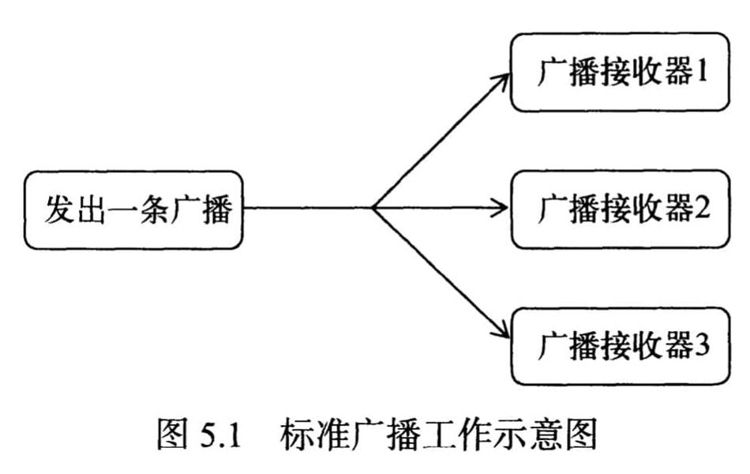
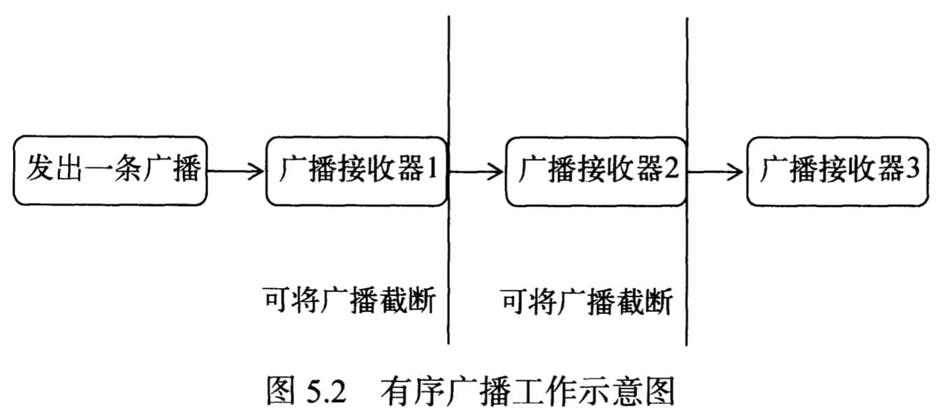

# 广播类型

-   标准广播（Normal broadcasts）是一种完全异步执行的广播，在广播发出之后，所有的广播接收器几乎都会在同一时刻接收到这条广播消息，因此它们之间没有任何先后顺序可言。这种广播的效率会比较高，但同时也意味着它是无法被截断的。
    
-   有序广播（Ordered broadcasts）则是一种同步执行的广播，在广播发出之后，同一时刻只会有一个广播接收器能够收到这条广播消息，当这个广播接收器中的逻辑执行完毕后，广播才会继续传递。所以此时的广播接收器是有先后顺序的，优先级高的广播接收器就可以先收到广播消息，并且前面的广播接收器还可以截断正在传递的广播，这样后面的广播接收器就无法收到广播消息了。
    

# 注册Receiver

注册广播的方式一般有两种，在代码中注册和在AndroidManifest.xml中注册，其中前者也被称为动态注册，后者也被称为静态注册。

## 动态注册

```java
class MyDynamicBroadcastReceiver extends BroadcastReceiver {
    private static final String TAG = TestBroadcastActivity.TAG;

    @Override
    public void onReceive(Context context, Intent intent) {
        int intVal = intent.getIntExtra("intVal", 123);
        Log.i(TAG, "onReceive: int val = " + intVal);
    }
}
```

```java
public class TestBroadcastActivity extends BaseDemoActivity {
    static final String TAG = "TestBroadcastActivity";

    private final MyDynamicBroadcastReceiver receiver = new MyDynamicBroadcastReceiver();

    @Override
    protected void onCreate(Bundle savedInstanceState) {
        super.onCreate(savedInstanceState);
        IntentFilter intentFilter = new IntentFilter();
        intentFilter.addAction("com.mezzsy.test.broadcast.VALUE");
        registerReceiver(receiver, intentFilter);
    }

    @Override
    protected void onDestroy() {
        super.onDestroy();
        unregisterReceiver(receiver);
    }
}
```

通过adb发送一个全局的广播：

```
adb shell am broadcast -a com.mezzsy.test.broadcast.VALUE --ei intVal 200
```

日志：

```
TestBroadcastActivity: onReceive: int val = 200
```

## 静态注册

动态注册的广播接收器可以自由地控制注册与注销，在灵活性方面有很大的优势，但是它也存在着一个缺点，即必须要在程序启动之后才能接收到广播，因为注册的逻辑是写在onCreate里的。

```xml
<receiver android:name=".basic.broadcast.MyStaticBroadcastReceiver"
    android:exported="false"
    android:enabled="true">
    <intent-filter>
        <action android:name="com.mezzsy.test.broadcast.VALUE"/>
    </intent-filter>
</receiver>
```

发送广播：

```java
@Override
protected void onResume() {
    super.onResume();
    Intent intent = null;
    try {
        intent = new Intent(this, Class.forName("com.mezzsy.myapplication.basic.broadcast.MyStaticBroadcastReceiver"));
    } catch (ClassNotFoundException e) {
        return;
    }
    intent.putExtra("intVal", 200);
    intent.setAction("com.mezzsy.test.broadcast.VALUE");
    sendBroadcast(intent);
}
```

从8.0开始，系统对静态注册的广播会有所限制，无法使用清单为大多数隐式广播声明接收方，所以通过直接执行上面的adb命令行不通。

# 有序广播

## 设置优先级

```java
IntentFilter intentFilter = new IntentFilter();
intentFilter.addAction("com.mezzsy.test.broadcast.VALUE");
intentFilter.setPriority(100);
registerReceiver(receiver1, intentFilter);

intentFilter.setPriority(90);
registerReceiver(receiver2, intentFilter);
```

## 发送有序广播

```java
private void sendOrderedBroadcast() {
    Intent intent = new Intent();
    intent.putExtra("intVal", 200);
    intent.setAction("com.mezzsy.test.broadcast.VALUE");
    sendOrderedBroadcast(intent, null);
}
```

## 拦截广播

```java
if ("first".equals(id)) {
    abortBroadcast();
}
```

# 本地广播

前面发送和接收的广播全部属于系统全局广播，即发出的广播可以被其他任何应用程序接收到，并且也可以接收来自于其他任何应用程序的广播，这样就很容易引起安全性的问题。

为了能够简单地解决广播的安全性问题，Android引入了一套本地广播机制，使用这个机制发出的广播只能够在应用程序的内部进行传递，并且广播接收器也只能接收来自本应用程序发出的广播，这样所有的安全性问题就都不存在了。

本地广播的用法并不复杂，主要就是使用了一个LocalBroadcastManager来对广播进行管理，并提供了发送广播和注册广播接收器的方法。

```java
package com.mezzsy.myapplication.basic.broadcast;

import android.content.Intent;
import android.content.IntentFilter;
import android.os.Bundle;

import androidx.localbroadcastmanager.content.LocalBroadcastManager;

import com.mezzsy.commonlib.ui.BaseDemoActivity;

public class TestBroadcastActivity extends BaseDemoActivity {
    static final String TAG = "MyTestBroadcastActivity";

    private LocalBroadcastManager localBroadcastManager;
    private final MyDynamicBroadcastReceiver receiver1 = new MyDynamicBroadcastReceiver("first");
    private final MyDynamicBroadcastReceiver receiver2 = new MyDynamicBroadcastReceiver("second");
    private final MyDynamicBroadcastReceiver receiver3 = new MyDynamicBroadcastReceiver("third");

    @Override
    protected void onCreate(Bundle savedInstanceState) {
        super.onCreate(savedInstanceState);
        localBroadcastManager = LocalBroadcastManager.getInstance(this);

        IntentFilter intentFilter = new IntentFilter();
        intentFilter.addAction("com.mezzsy.test.broadcast.VALUE");
        intentFilter.setPriority(100);
        registerReceiver(receiver1, intentFilter);
        intentFilter.setPriority(90);
        registerReceiver(receiver2, intentFilter);
        localBroadcastManager.registerReceiver(receiver3, intentFilter);
    }

    @Override
    protected void onResume() {
        super.onResume();
        sendLocalBroadcast();
    }

    private void sendLocalBroadcast() {
        Intent intent = new Intent();
        intent.putExtra("intVal", 200);
        intent.setAction("com.mezzsy.test.broadcast.VALUE");
        localBroadcastManager.sendBroadcast(intent);
    }
    
    @Override
    protected void onDestroy() {
        super.onDestroy();
        unregisterReceiver(receiver1);
        unregisterReceiver(receiver2);
        localBroadcastManager.unregisterReceiver(receiver3);
    }
}
```

```
MyTestBroadcastActivity: dynamic id = third, onReceive: val = 200
```

从日志看，虽然注册了三个receiver，但是只有localBroadcastManager注册的receiver收到了广播。
