# 逐帧动画

帧动画的实现方式有两种：

## xml形式

### 创建

在res/drawable文件夹下新建animation-list的XML实现帧动画

1、首先在res/drawable文件夹下添加图片

2、新建anim_0.xml 

> 看的内容说在anim文件夹下创建xml文件，但是在输入animation-list后Android Studio自动纠错把文件放进了drawable文件夹

```xml
<?xml version="1.0" encoding="utf-8"?>
<animation-list xmlns:android="http://schemas.android.com/apk/res/android"
    android:oneshot="false">

    <item
        android:drawable="@drawable/a"
        android:duration="300"/>

    <item
        android:drawable="@drawable/b"
        android:duration="300"/>

    <item
        android:drawable="@drawable/c"
        android:duration="300"/>
</animation-list>

```

android:oneshot 控制动画是否循环播放

android:duration 控制每一帧的播放时间

### 使用

```xml
<ImageView
    android:id="@+id/img"
    android:layout_width="100dp"
    android:layout_height="100dp"
    android:layout_centerInParent="true"
    android:background="@drawable/anim_0"/>

```

```java
ImageView imageView=findViewById(R.id.img);
AnimationDrawable animationDrawable= (AnimationDrawable) imageView.getBackground();
animationDrawable.start();
```

### 代码方式

不常使用，故略。

# View动画

使用View动画框架可以在Views上执行补间动画。 补间动画是指只要指定动画的开始、动画结束的"关键帧"，而动画变化的"中间帧"由系统计算并补齐；无论动画怎样改变View的显示区域（移动或者改变大小），持有该动画的View的边界不会自动调整来适应View的显示区域， 即使如此，该动画仍将被绘制在超出其视图边界并且不会被剪裁， 但是，如果动画超过父视图的边界，则会出现裁剪。在Android中的View动画框架中一共提供了AlphaAnimation（透明度动画）、RotateAnimation（旋转动画）、ScaleAnimation（缩放动画）、TranslateAnimation（平移动画）四种类型的补间动画。

VIew动画的作用对象是View，支持4种动画效果，分别是平移、缩放、旋转和透明度动画。

View动画的四种变换效果对应着Animation的四个子类：TranslateAnimation、ScaleAnimation、RotateAnimation和AlphaAnimation。

|    名称    |     标签      |        子类        |       效果       |
| :--------: | :-----------: | :----------------: | :--------------: |
|  平移动画  | \<translate\> | TranslateAnimation |     移动View     |
|  缩放动画  |   \<scale\>   |   ScaleAnimation   |  放大或缩小View  |
|  旋转动画  |  \<rotate\>   |  RotateAnimation   |     旋转View     |
| 透明度动画 |   \<alpha\>   |   AlphaAnimation   | 改变View的透明度 |

```xml
<?xml version="1.0" encoding="utf-8"?>
<set xmlns:android="http://schemas.android.com/apk/res/android"
    android:interpolator=""
    android:duration="11"
    android:fillAfter="true"
    android:shareInterpolator="true">

    <alpha
        android:fromAlpha="1.0"
        android:toAlpha="1.0"/>

    <scale
        android:fromXScale="1.0"
        android:toXScale="1.0"
        android:fromYScale="1.0"
        android:toYScale="1.0"
        android:pivotX="1.0"
        android:pivotY="1.0"/>

    <translate
        android:fromXDelta="1.0"
        android:toXDelta="1.0"
        android:fromYDelta="1.0"
        android:toYDelta="1.0"/>

    <rotate
        android:fromDegrees="1.0"
        android:toDegrees="1.0"
        android:pivotY="1.0"
        android:pivotX="1.0"/>

</set>
```

## set

- android:interpolator
  表示动画集合所采用的插值器，插值器影响动画的速度，这个属性可以不指定，默认为加速减速插值器。
- android:shareInterpolator
  表示集合中的动画是否和集合共享同一个插值器。如果不指定，那么子动画就需要单独指定插值器或者默认的插值器。
- android:duration
  动画持续的时间，默认值是0 (单位ms)  
- android:fillAfter="true"
  动画结束后View是否停留在结束位置，true表示View停留，false反之。
- android:repeatCount 
  设置动画重复执行的次数  ，默认值是0   
- android:repeatMode 
  设置动画重复的模式，其值可以有，restart( 1 )，表示顺序播放，reverse（2）表示重复的时候逆向播放
- android:startOffset
  设置开始的延迟的时间(单位ms)  ，默认值是0

## translate

- android:fromXDelta
  表示x的起始值，比如0，例如：如50表示以当前View左上角坐标加50px为初始点、50%表示以当前View的左上角加上当前View宽高的50%做为初始点、50%p表示以当前View的左上角加上父控件宽高的50%做为初始点
- android:toXDelta
  表示x的结束值，比如100
- android:fromYDelta
- android:toYDelta

## scale

- android:fromXScale
  水平方向缩放的起始值，比如0.5
- android:toXScale
  水平方向缩放的结束值，比如1.2
- android:pivotX
  缩放的轴点的x坐标，例如：如50表示以当前View左上角坐标加50px为初始点、50%表示以当前View的左上角加上当前View宽高的50%做为初始点、50%p表示以当前View的左上角加上父控件宽高的50%做为初始点
- android:fromYScale
- android:toYScale
- android:pivotY

## rotate

- android:fromDegrees
  旋转开始的角度，比如0
- android:toDegrees
  旋转结束的角度，比如180，ps：toDegrees -fromDegrees > 0，则顺时针旋转；否则，逆时针旋转。
- android:pivotY
  旋转的轴点的x坐标
- android:pivotX
  旋转的轴点的y坐标

## alpha

- android:fromAlpha
  表示透明度的起始值，比如0.1,这里设置为0.0，表示完全透明，取值范围0~1
- android:toAlpha
  表示透明度的结束值，比如1

**使用**

```xml
<?xml version="1.0" encoding="utf-8"?>
<set xmlns:android="http://schemas.android.com/apk/res/android"
    android:fillAfter="true">

    <translate
        android:duration="1000"
        android:fromXDelta="0"
        android:toXDelta="0"
        android:fromYDelta="100"
        android:toYDelta="100"/>

    <rotate
        android:duration="4000"
        android:fromDegrees="0"
        android:toDegrees="90"/>

</set>
```

```java
imageView = findViewById(R.id.img);
Animation animation = AnimationUtils.loadAnimation(this, R.anim.anim);
imageView.startAnimation(animation);
```

## 特殊使用场景

View动画可以在一些特殊的场景下使用，比如在ViewGroup中可以控制子元素的出场效果，在Activity中可以实现不同的Activity之间的切换效果。

**LayoutAnimation**

LayoutAnimation作用于ViewGroup，为ViewGroup指定一个动画，这样它的子元素出场时都会具有这种动画效果。这种效果常常用在ListView上，但目前RecyclerView内置了动画，顾略过。

**Activity的切换效果**

Activity有默认的切换效果，但是这个效果是可以自定义的，主要用到`overridePendingTransition`这个方法，这个方法必须在startActivity方法或者finish方法之后调用才能生效。

### demo

**R.anim.anim_enter**

```xml
<?xml version="1.0" encoding="utf-8"?>
<set xmlns:android="http://schemas.android.com/apk/res/android"
    android:duration="2000">
    <alpha
        android:fromAlpha="0.0"
        android:toAlpha="1.0" />
</set>
```

**R.anim.anim_exit**

```xml
<?xml version="1.0" encoding="utf-8"?>
<set xmlns:android="http://schemas.android.com/apk/res/android"
    android:duration="2000">
    <alpha
        android:fromAlpha="1.0"
        android:toAlpha="0.0" />
</set>
```

启动另一个Activity。

```java
public void open(View view) {
    Intent intent = new Intent(this, D20BActivity.class);
    startActivity(intent);
    overridePendingTransition(R.anim.anim_enter, R.anim.anim_exit);
}
```

退出

```java
@Override
public void finish() {
    super.finish();
    overridePendingTransition(R.anim.anim_enter, R.anim.anim_exit);
}
```

# 属性动画

与属性动画相比View动画存在一个缺陷，View动画改变的只是View的显示，而没有改变View的响应区域，并且View动画只能对View做四种类型的补间动画，因此Google在Android3.0及其后续版本中添加了属性动画框架。同样属性动画框架还提供了动画集合类（AnimatorSet），通过动画集合类（AnimatorSet）可以将多个属性动画以组合的形式显示出来。

## ViewPropertyAnimator

直接使用View.animate() 获取 ViewPropertyAnimator 对象，只能使用api提供的动画

使用方式

```java
/**
 * 利用ViewPropertyAnimator实现平移动画
 */
private void ranslation2() {
    mImageView
            .animate()
            .translationX(500)
            .setDuration(1000);//默认是300ms
}
```

具体可以跟的方法以及方法所对应的 `View` 中的实际操作的方法如图所示

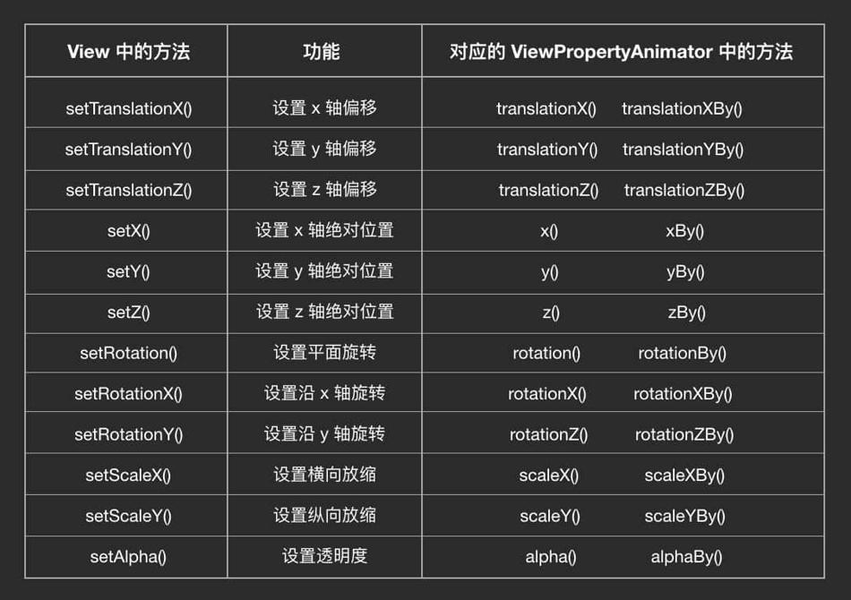

不加By的操作是将值渐变为100，加By的是增加100。

## ObjectAnimator

使用方式：

1. 如果是自定义控件，需要添加 `setter` / `getter` 方法，并记得在setter方法中调用invalidate方法进行重绘
2. 用 `ObjectAnimator.ofXXX()` 创建 `ObjectAnimator` 对象
3. 用 `start()` 方法执行动画

```Java
/**
 * 利用ObjectAnimator实现旋转动画
 */
private void rotation() {
    ObjectAnimator.ofFloat(mImageView, "rotation", 0, 180)
            .setDuration(1000)
            .start();
}

/**
 * 利用AnimatorSet和ObjectAnimator实现平移动画
 */
private void ranslation() {
    AnimatorSet animatorSet = new AnimatorSet();
    animatorSet.playTogether(
            ObjectAnimator.ofFloat(mImageView, "translationX", 0, 500)
            , ObjectAnimator.ofFloat(mImageView, "translationY", 0, 500));
    animatorSet.setDuration(3000);
    animatorSet.start();
}

/**
 * 利用AnimatorSet和ObjectAnimator实现缩放动画
 */
private void scale() {
    AnimatorSet animatorSet = new AnimatorSet();
    animatorSet.playTogether(
            ObjectAnimator.ofFloat(mImageView, "scaleX", 1, 2)
            , ObjectAnimator.ofFloat(mImageView, "scaleY", 1, 2));
    animatorSet.setDuration(3000);
    animatorSet.start();
}

/**
 * 利用ObjectAnimator实现透明度动画
 */
private void alpha() {
    ObjectAnimator.ofFloat(mImageView, "alpha", 1, 0, 1)
            .setDuration(3000)
            .start();
}
```

```java
final Button button=findViewById(R.id.btn);
ValueAnimator anim = ValueAnimator.ofInt(button.getLayoutParams().width , 500);
anim.setDuration(2000);
anim.setRepeatCount(0);
anim.addUpdateListener(new ValueAnimator.AnimatorUpdateListener() {
            @Override
            public void onAnimationUpdate(ValueAnimator animation) {
                int currentValue = (Integer) animation.getAnimatedValue();
                button.getLayoutParams().width = currentValue;
                button.requestLayout();
            }
        });
anim.start();
```

## 插值器Interpolator

### AccelerateDecelerateInterpolator

先加速再减速。这是默认的 `Interpolator`。

它的动画效果**看起来就像是物体从速度为 0 开始逐渐加速，然后再逐渐减速直到 0 的运动**。它的速度 / 时间曲线以及动画完成度 / 时间曲线都是一条正弦 / 余弦曲线。

具体的效果如下：


**用途**：就像上面说的，它是一种最符合物理世界的模型，所以如果你要做的是最简单的状态变化（位移、放缩、旋转等等），那么一般不用设置 `Interpolator`，就用这个默认的最好。

### LinearInterpolator

匀速。


### AccelerateInterpolator

持续加速。

在整个动画过程中，一直在加速，直到动画结束的一瞬间，直接停止。


主要用在离场效果中，比如某个物体从界面中飞离，就可以用这种效果。它给人的感觉就会是「这货从零起步，加速飞走了」。到了最后动画骤停的时候，物体已经飞出用户视野，看不到了，所以他们是并不会察觉到这个骤停的。

### DecelerateInterpolator

持续减速直到 0。

动画开始的时候是最高速度，然后在动画过程中逐渐减速，直到动画结束的时候恰好减速到 0。


它的效果和上面这个 `AccelerateInterpolator` 相反，适用场景也和它相反：它主要用于入场效果，比如某个物体从界面的外部飞入界面后停在某处。

### AnticipateInterpolator

先回拉一下再进行正常动画轨迹。效果看起来有点像投掷物体或跳跃等动作前的蓄力。


如果是图中这样的平移动画，那么就是位置上的回拉；如果是放大动画，那么就是先缩小一下再放大；其他类型的动画同理。

### OvershootInterpolator

动画会超过目标值一些，然后再弹回来。效果看起来有点像你一屁股坐在沙发上后又被弹起来一点的感觉。


### AnticipateOvershootInterpolator

上面这两个的结合版：开始前回拉，最后超过一些然后回弹。


### BounceInterpolator

在目标值处弹跳。有点像玻璃球掉在地板上的效果。


### CycleInterpolator

这个也是一个正弦 / 余弦曲线，不过它和 `AccelerateDecelerateInterpolator` 的区别是，它可以自定义曲线的周期，所以动画可以不到终点就结束，也可以到达终点后回弹，回弹的次数由曲线的周期决定，曲线的周期由 `CycleInterpolator()` 构造方法的参数决定。

> 参数为 0.5f：


> 参数为 2f：


### PathInterpolator

自定义动画完成度 / 时间完成度曲线。

用这个 `Interpolator` 你可以定制出任何你想要的速度模型。定制的方式是使用一个 `Path` 对象来绘制出你要的动画完成度 / 时间完成度曲线。例如：

```java
Path interpolatorPath = new Path();

...

// 匀速
interpolatorPath.lineTo(1, 1);  
```

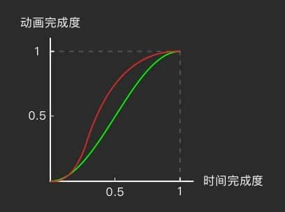


```java
Path interpolatorPath = new Path();

...

// 先以「动画完成度 : 时间完成度 = 1 : 1」的速度匀速运行 25%
interpolatorPath.lineTo(0.25f, 0.25f);  
// 然后瞬间跳跃到 150% 的动画完成度
interpolatorPath.moveTo(0.25f, 1.5f);  
// 再匀速倒车，返回到目标点
interpolatorPath.lineTo(1, 1);  
```

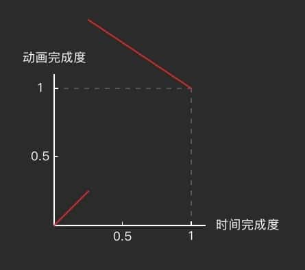


这条 `Path` 描述的其实是一个 `y = f(x) (0 ≤ x ≤ 1)` （y 为动画完成度，x 为时间完成度）的曲线，所以同一段时间完成度上不能有两段不同的动画完成度，而且每一个时间完成度的点上都必须要有对应的动画完成度（因为内容不能在某段时间段内消失呀）。所以，下面这样的 `Path` 是非法的，会导致程序 FC：

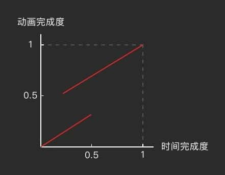

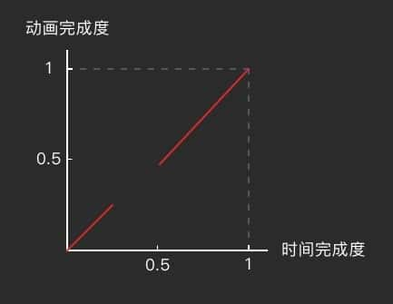

除了上面的这些，Android 5.0 （API 21）引入了三个新的 `Interpolator` 模型，并把它们加入了 support v4 包中。这三个新的 `Interpolator` 每个都和之前的某个已有的 `Interpolator` 规则相似，只有略微的区别。

### FastOutLinearInInterpolator

加速运动。

这个 `Interpolator` 的作用你不能看它的名字，一会儿 fast 一会儿 linear 的，完全看不懂。其实它和 `AccelerateInterpolator` 一样，都是一个持续加速的运动路线。只不过 `FastOutLinearInInterpolator` 的曲线公式是用的贝塞尔曲线，而 `AccelerateInterpolator` 用的是指数曲线。具体来说，它俩最主要的区别是 `FastOutLinearInInterpolator` 的初始阶段加速度比 `AccelerateInterpolator` 要快一些。

`FastOutLinearInInterpolator`：

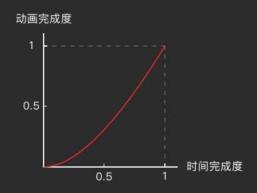


`AccelerateInterpolator`：

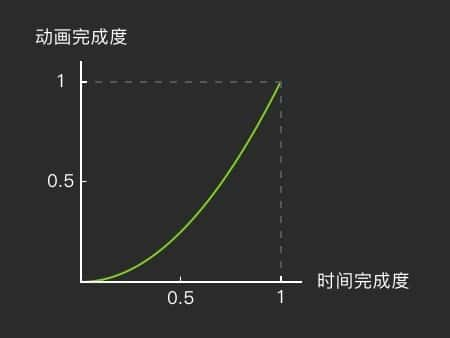


这俩的速度模型几乎就是一样的

实际上，这点区别，在实际应用中用户根本察觉不出来。而且，`AccelerateInterpolator` 还可以在构造方法中调节变速系数，可以调节到和 `FastOutLinearInInterpolator` （几乎）一模一样。所以在使用加速模型的时候，这两个选哪个都一样，没区别的。

### FastOutSlowInInterpolator

先加速再减速。

同样也是先加速再减速的还有前面说过的 `AccelerateDecelerateInterpolator`，不过它们的效果是明显不一样的。`FastOutSlowInInterpolator` 用的是贝塞尔曲线，`AccelerateDecelerateInterpolator`用的是正弦 / 余弦曲线。具体来讲， `FastOutSlowInInterpolator` 的前期加速度要**快得多**。

`FastOutSlowInInterpolator`：

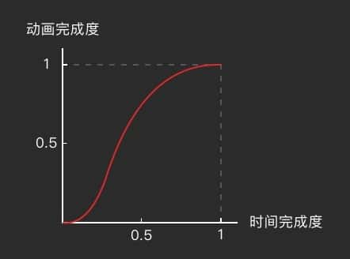


`AccelerateDecelerateInterpolator`：

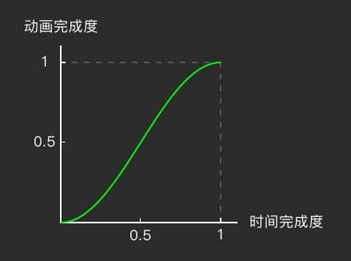


不论是从动图还是从曲线都可以看出，这二者比起来，`FastOutSlowInInterpolator` 的前期加速更猛一些，后期的减速过程的也减得更迅速。用更直观一点的表达就是，`AccelerateDecelerateInterpolator`像是物体的自我移动，而 `FastOutSlowInInterpolator` 则看起来像有一股强大的外力「推」着它加速，在接近目标值之后又「拽」着它减速。总之，`FastOutSlowInterpolator` 看起来有一点「着急」的感觉。

### LinearOutSlowInInterpolator

持续减速。

它和 `DecelerateInterpolator` 比起来，同为减速曲线，主要区别在于 `LinearOutSlowInInterpolator`的初始速度更高。对于人眼的实际感觉，区别其实也不大，不过还是能看出来一些的。

## 设置监听器

设置监听器的方法， `ViewPropertyAnimator` 和 `ObjectAnimator` 略微不一样： `ViewPropertyAnimator` 用的是 `setListener()` 和 `setUpdateListener()` 方法，可以设置一个监听器，要移除监听器时通过 `set[Update]Listener(null)` 填 null 值来移除

 `ObjectAnimator` 则是用 `addListener()` 和 `addUpdateListener()` 来添加一个或多个监听器，移除监听器则是通过 `remove[Update]Listener()` 来指定移除对象。

另外，由于 `ObjectAnimator` 支持使用 `pause()` 方法暂停，所以它还多了一个 `addPauseListener()` / `removePauseListener()` 的支持；

 `ViewPropertyAnimator` 则独有 `withStartAction()` 和 `withEndAction()` 方法，可以设置一次性的动画开始或结束的监听。

### ViewPropertyAnimator.setListener() / ObjectAnimator.addListener()

这两个方法的名称不一样，可以设置的监听器数量也不一样，但它们的参数类型都是 `AnimatorListener`，所以本质上其实都是一样的。 `AnimatorListener` 共有 4 个回调方法：

#### onAnimationStart(Animator animation)

当动画开始执行时，这个方法被调用。

#### onAnimationEnd(Animator animation)

当动画结束时，这个方法被调用。

#### onAnimationCancel(Animator animation)

当动画被通过 `cancel()` 方法取消时，这个方法被调用。

另外就算动画被取消，`onAnimationEnd()` 也会被调用。所以当动画被取消时，如果设置了 `AnimatorListener`，那么 `onAnimationCancel()` 和 `onAnimationEnd()` 都会被调用。`onAnimationCancel()` 会先于 `onAnimationEnd()` 被调用。

#### onAnimationRepeat(Animator animation)

当动画通过 `setRepeatMode()` / `setRepeatCount()` 或 `repeat()` 方法重复执行时，这个方法被调用。

由于 `ViewPropertyAnimator` 不支持重复，所以这个方法对 `ViewPropertyAnimator` 相当于无效。

### ViewPropertyAnimator.setUpdateListener() / ObjectAnimator.addUpdateListener()

和上面的两个方法一样，这两个方法虽然名称和可设置的监听器数量不一样，但本质其实都一样的，它们的参数都是 `AnimatorUpdateListener`。它只有一个回调方法：`onAnimationUpdate(ValueAnimator animation)`。

#### onAnimationUpdate(ValueAnimator animation)

当动画的属性更新时（不严谨的说，即每过 10 毫秒，动画的完成度更新时），这个方法被调用。

方法的参数是一个 `ValueAnimator`，`ValueAnimator` 是 `ObjectAnimator` 的父类，也是 `ViewPropertyAnimator` 的内部实现，所以这个参数其实就是 `ViewPropertyAnimator` 内部的那个 `ValueAnimator`，或者对于 `ObjectAnimator` 来说就是它自己本身。

`ValueAnimator` 有很多方法可以用，它可以查看当前的动画完成度、当前的属性值等等。不过 `ValueAnimator` 是下一期才讲的内容，所以这期就不多说了。

### ObjectAnimator.addPauseListener()

### ViewPropertyAnimator.withStartAction/EndAction()

这两个方法是 `ViewPropertyAnimator` 的独有方法。它们和 `set/addListener()` 中回调的 `onAnimationStart()` / `onAnimationEnd()` 相比起来的不同主要有两点：

1. `withStartAction()` / `withEndAction()` 是一次性的，在动画执行结束后就自动弃掉了，就算之后再重用 `ViewPropertyAnimator` 来做别的动画，用它们设置的回调也不会再被调用。而 `set/addListener()` 所设置的 `AnimatorListener` 是持续有效的，当动画重复执行时，回调总会被调用。
2. `withEndAction()` 设置的回调只有在动画正常结束时才会被调用，而在动画被取消时不会被执行。这点和 `AnimatorListener.onAnimationEnd()` 的行为是不一致的。

## 无法使用属性动画或者属性动画不起作用的情况和解决方法

无法使用属性动画或者属性动画不起作用的情况如下：
 1 该字段没有没有set和get方法
 2 该属性的set方法仅仅改变了对象的属性值，但是没有将这种改变用动画的形式表现出来
 解决方法如下：
 1 如果你又权限的话，给这个字段添加get和set方法，比如在自定义View中。
 2 使用一个包装类来封装该字段对应的类，间接为该字段提供get和set方法。

例如使ImageView从当前高度变化到600

```java
ViewWrapper viewWrapper = new ViewWrapper(mImageView);
ObjectAnimator.ofInt(viewWrapper, "height", 600).setDuration(5000).start();

public class ViewWrapper {

    private View view;

    public ViewWrapper(View view) {
        this.view = view;
    }

    public int getHeight(){
        return view.getLayoutParams().height;
    }

    public void setHeight(int height){
        view.getLayoutParams().height = height;
        view.requestLayout();
    }
}
```

## 常用的场景

**属性动画可以为ViewGroup的子View的显示和隐藏设置过渡动画**

Android系统中已经提供了默认过渡动画（在layout文件中将ViewGroup的**animateLayoutChanges**属性打开就可以使用系统提供的默认过渡动画）。

Android系统中一共提供了如下所示的4种类型的过渡动画：

1. APPEARING 
   当通过设置子View的可见性为VISIBLE或者通过addView方法添加子View来显示子View时，子View就会执行该类型的动画。
   该类型动画的周期为300毫秒，默认延迟为300毫秒。
2. DISAPPEARING
   当通过设置子View的可见性为GONE或者通过removeView方法移除子View来隐藏子View时，子View就会执行该类型的动画。
   该类型动画的周期为300毫秒，默认延迟为0毫秒。
3. CHANGE_APPEARING
   当显示子View时，所有的兄弟View就会立即依次执行该类型动画并且兄弟View之间执行动画的间隙默认为0毫秒，然后才会执行显示子View的动画。
   该类型动画的周期为300毫秒，默认延迟为0毫秒。
4. CHANGE_DISAPPEARING
   当隐藏子View的动画执行完毕后，所有的兄弟View就会依次执行该类型动画并且兄弟View之间执行动画的间隙默认为0毫秒。
   该类型动画的周期为300毫秒，默认延迟为300毫秒。

**自定义过渡动画**

```java
llImageView = (LinearLayout) root.findViewById(R.id.ll_image);

LayoutTransition transition = new LayoutTransition();

transition.setStagger(LayoutTransition.CHANGE_APPEARING, 30);
transition.setDuration(LayoutTransition.CHANGE_APPEARING, transition.getDuration(LayoutTransition.CHANGE_APPEARING));
transition.setStartDelay(LayoutTransition.CHANGE_APPEARING, 0);

ObjectAnimator appearingAnimator = ObjectAnimator
        .ofPropertyValuesHolder(
                (Object) null,
                PropertyValuesHolder.ofFloat("scaleX", 0.0f, 1.0f),
                PropertyValuesHolder.ofFloat("scaleY", 0.0f, 1.0f),
                PropertyValuesHolder.ofFloat("alpha", 0, 1.0f));
transition.setAnimator(LayoutTransition.APPEARING, appearingAnimator);
transition.setDuration(LayoutTransition.APPEARING, transition.getDuration(LayoutTransition.APPEARING));
transition.setStartDelay(LayoutTransition.APPEARING, transition.getDuration(LayoutTransition.CHANGE_APPEARING));

ObjectAnimator disappearingAnimator = ObjectAnimator
        .ofPropertyValuesHolder(
                (Object) null,
                PropertyValuesHolder.ofFloat("scaleX", 1.0f, 0.0f),
                PropertyValuesHolder.ofFloat("scaleY", 1.0f, 0.0f),
                PropertyValuesHolder.ofFloat("alpha", 1.0f, 0));
transition.setAnimator(LayoutTransition.DISAPPEARING, disappearingAnimator);
transition.setDuration(LayoutTransition.DISAPPEARING, transition.getDuration(LayoutTransition.DISAPPEARING));
transition.setStartDelay(LayoutTransition.DISAPPEARING, 0);

transition.setStagger(LayoutTransition.CHANGE_DISAPPEARING, 30);
transition.setDuration(LayoutTransition.CHANGE_DISAPPEARING, transition.getDuration(LayoutTransition.CHANGE_DISAPPEARING));
transition.setStartDelay(LayoutTransition.CHANGE_DISAPPEARING, transition.getDuration(LayoutTransition.DISAPPEARING));

llImageView.setLayoutTransition(transition);
```

上面代码依次对CHANGE_APPEARING、APPEARING、DISAPPEARING和CHANGE_DISAPPEARING类型的过渡动画进行了设置，下面就来分析常用的设置方法：

- setStagger方法
  当多个子View要执行同一个类型的动画时，就可以通过该方法来设置子View之间执行动画的间隙，默认为0毫秒。
- setAnimator方法
  为指定类型的过渡动画设置自定义的属性动画。
- setDuration方法
  为指定类型的过渡动画设置执行动画的周期，默认为300毫秒。
- setStartDelay方法
  为指定类型的过渡动画设置延迟执行的时间，默认与过渡动画的类型相关，上面已经说过。
- setLayoutTransition方法
  为ViewGroup设置过渡动画。

经过上面代码的设置后，LinearLayout显示或者隐藏子View时就会执行相关的过渡动画，显示或者隐藏子View的代码如下所示：

### demo

**自定义View**

```java
public class LoadingAnimation extends View {
    private int mProcess = 0;
    private Paint mPaint;
    private final float mRadius = 100;
    private RectF mArcRectF;

    public LoadingAnimation(Context context) {
        super(context);
        init();
    }

    public LoadingAnimation(Context context, AttributeSet attrs) {
        super(context, attrs);
        init();
    }

    private void init() {
        mPaint = new Paint(Paint.ANTI_ALIAS_FLAG);
        mArcRectF = new RectF();
    }

    @SuppressWarnings("IntegerDivisionInFloatingPointContext")
    @Override
    protected void onDraw(Canvas canvas) {
        super.onDraw(canvas);

        float centerX = getWidth() / 2;
        float centerY = getHeight() / 2;

        //绘制圆弧
        mPaint.setColor(Color.parseColor("#E91E63"));
        mPaint.setStyle(Paint.Style.STROKE);
        mPaint.setStrokeCap(Paint.Cap.ROUND);
        mPaint.setStrokeWidth(20);
        mArcRectF.set((int) (centerX - mRadius), (int) (centerY - mRadius)
                , (int) (centerX + mRadius), (int) (centerY + mRadius));
        canvas.drawArc(mArcRectF, 135, mProcess * 2.7f, false, mPaint);

        //绘制数字
        mPaint.setTextSize(40);
        mPaint.setTextAlign(Paint.Align.CENTER);
        mPaint.setColor(Color.WHITE);
        mPaint.setStyle(Paint.Style.FILL);
        canvas.drawText(mProcess + "%",
                centerX, centerY - (mPaint.ascent() + mPaint.descent()) / 2, mPaint);
    }

    public int getProcess() {
        return mProcess;
    }

    public void setProcess(int process) {
        mProcess = process;
        invalidate();
    }
}
```

**布局文件**

```xml
<?xml version="1.0" encoding="utf-8"?>
<LinearLayout xmlns:android="http://schemas.android.com/apk/res/android"
    xmlns:tools="http://schemas.android.com/tools"
    android:layout_width="match_parent"
    android:layout_height="match_parent"
    android:orientation="vertical"
    tools:context=".demo23.D23Activity">

    <com.mezzsy.myapplication.demo23.LoadingAnimation
        android:id="@+id/anim"
        android:layout_width="100dp"
        android:layout_height="100dp"
        android:background="#000000" />

    <Button
        android:layout_width="wrap_content"
        android:layout_height="wrap_content"
        android:text="开始"
        android:onClick="start"/>

</LinearLayout>
```

**Activity**

```java
public class D23Activity extends AppCompatActivity {
    private LoadingAnimation mLoadingAnimation;
    private ObjectAnimator mObjectAnimator;

    @Override
    protected void onCreate(Bundle savedInstanceState) {
        super.onCreate(savedInstanceState);
        setContentView(R.layout.activity_d23);
        mLoadingAnimation = findViewById(R.id.anim);
    }

    @Override
    protected void onResume() {
        super.onResume();
        mObjectAnimator = ObjectAnimator
                .ofInt(mLoadingAnimation, "process", 0, 100)
                .setDuration(4000);
    }

    public void start(View view) {
        mObjectAnimator.start();
    }
}
```

**效果**

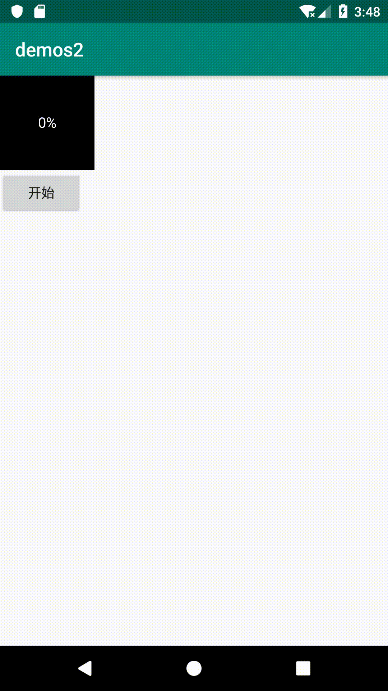

## TypeEvaluator

关于 ObjectAnimator，可以用 `ofInt()` 来做整数的属性动画和用 `ofFloat()` 来做小数的属性动画。这两种属性类型是属性动画最常用的两种，不过在实际的开发中，可以做属性动画的类型还是有其他的一些类型。当需要对其他类型来做属性动画的时候，就需要用到 `TypeEvaluator` 了。

它的作用是让你可以对同样的属性有不同的解析方式，对本来无法解析的属性也可以打造出你需要的解析方式。有了 `TypeEvaluator`，你的属性动画就有了更大的灵活性，从而有了无限的可能。

### ArgbEvaluator

如视频中的例子，`TypeEvaluator` 最经典的用法是使用 `ArgbEvaluator` 来做颜色渐变的动画。

```java
ObjectAnimator animator = ObjectAnimator.ofInt(view, "color", 0xffff0000, 0xff00ff00);  
animator.setEvaluator(new ArgbEvaluator());  
animator.start();  
```

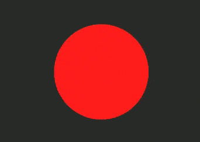

另外，在 Android 5.0 （API 21） 加入了新的方法 `ofArgb()`，所以 `minSdk` 大于或者等于 21，你可以直接用下面这种方式：

```java
ObjectAnimator animator = ObjectAnimator.ofArgb(view, "color", 0xffff0000, 0xff00ff00);  
animator.start();  
```

### 自定义 Evaluator

```java
// 自定义 HslEvaluator
private class HsvEvaluator implements TypeEvaluator<Integer> {  
   float[] startHsv = new float[3];
   float[] endHsv = new float[3];
   float[] outHsv = new float[3];

   @Override
   public Integer evaluate(float fraction, Integer startValue, Integer endValue) {
       // 把 ARGB 转换成 HSV
       Color.colorToHSV(startValue, startHsv);
       Color.colorToHSV(endValue, endHsv);

       // 计算当前动画完成度（fraction）所对应的颜色值
       if (endHsv[0] - startHsv[0] > 180) {
           endHsv[0] -= 360;
       } else if (endHsv[0] - startHsv[0] < -180) {
           endHsv[0] += 360;
       }
       outHsv[0] = startHsv[0] + (endHsv[0] - startHsv[0]) * fraction;
       if (outHsv[0] > 360) {
           outHsv[0] -= 360;
       } else if (outHsv[0] < 0) {
           outHsv[0] += 360;
       }
       outHsv[1] = startHsv[1] + (endHsv[1] - startHsv[1]) * fraction;
       outHsv[2] = startHsv[2] + (endHsv[2] - startHsv[2]) * fraction;

       // 计算当前动画完成度（fraction）所对应的透明度
       int alpha = startValue >> 24 + (int) ((endValue >> 24 - startValue >> 24) * fraction);

       // 把 HSV 转换回 ARGB 返回
       return Color.HSVToColor(alpha, outHsv);
   }
}


ObjectAnimator animator = ObjectAnimator.ofInt(view, "color", 0xff00ff00);  
// 使用自定义的 HslEvaluator
animator.setEvaluator(new HsvEvaluator());  
animator.start();  
```

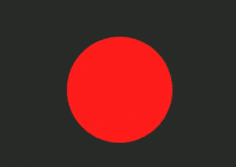

### ofObject()

借助于 `TypeEvaluator`，属性动画就可以通过 `ofObject()` 来对不限定类型的属性做动画了。方式很简单：

1. 为目标属性写一个自定义的 `TypeEvaluator`
2. 使用 `ofObject()` 来创建 `Animator`，并把自定义的 `TypeEvaluator` 作为参数填入

```java
private class PointFEvaluator implements TypeEvaluator<PointF> {  
   PointF newPoint = new PointF();

   @Override
   public PointF evaluate(float fraction, PointF startValue, PointF endValue) {
       float x = startValue.x + (fraction * (endValue.x - startValue.x));
       float y = startValue.y + (fraction * (endValue.y - startValue.y));

       newPoint.set(x, y);

       return newPoint;
   }
}

ObjectAnimator animator = ObjectAnimator.ofObject(view, "position",  
        new PointFEvaluator(), new PointF(0, 0), new PointF(1, 1));
animator.start();  
```

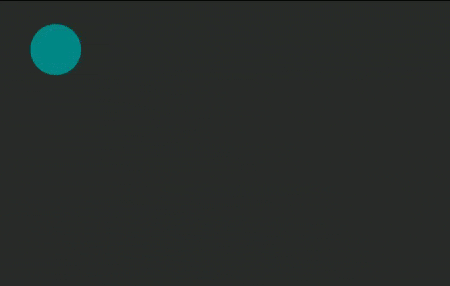

另外在 API 21 中，已经自带了 `PointFEvaluator` 这个类，所以如果你的 `minSdk` 大于或者等于 21，上面这个类你就不用写了，直接用就行了。

## PropertyValuesHolder 同一个动画中改变多个属性

很多时候，你在同一个动画中会需要改变多个属性，例如在改变透明度的同时改变尺寸。如果使用 `ViewPropertyAnimator`，你可以直接用连写的方式来在一个动画中同时改变多个属性：

```java
view.animate()  
        .scaleX(1)
        .scaleY(1)
        .alpha(1);
```


而对于 `ObjectAnimator`，是不能这么用的。不过你可以使用 `PropertyValuesHolder` 来同时在一个动画中改变多个属性。

```java
PropertyValuesHolder holder1 = PropertyValuesHolder.ofFloat("scaleX", 1);  
PropertyValuesHolder holder2 = PropertyValuesHolder.ofFloat("scaleY", 1);  
PropertyValuesHolder holder3 = PropertyValuesHolder.ofFloat("alpha", 1);

ObjectAnimator animator = ObjectAnimator.ofPropertyValuesHolder(view, holder1, holder2, holder3)  
animator.start();  
```

`PropertyValuesHolder` 是一个属性值的批量存放地。所以你如果有多个属性需要修改，可以把它们放在不同的 `PropertyValuesHolder` 中，然后使用 `ofPropertyValuesHolder()` 统一放进 `Animator`。这样你就不用为每个属性单独创建一个 `Animator` 分别执行了。

## AnimatorSet 多个动画配合执行

有的时候，你不止需要在一个动画中改变多个属性，还会需要多个动画配合工作，比如，在内容的大小从 0 放大到 100% 大小后开始移动。这种情况使用 `PropertyValuesHolder` 是不行的，因为这些属性如果放在同一个动画中，需要共享动画的开始时间、结束时间、Interpolator 等等一系列的设定，这样就不能有先后次序地执行动画了。

这就需要用到 `AnimatorSet` 了。

```java
ObjectAnimator animator1 = ObjectAnimator.ofFloat(...);  
animator1.setInterpolator(new LinearInterpolator());  
ObjectAnimator animator2 = ObjectAnimator.ofInt(...);  
animator2.setInterpolator(new DecelerateInterpolator());

AnimatorSet animatorSet = new AnimatorSet();  
// 两个动画依次执行
animatorSet.playSequentially(animator1, animator2);  
animatorSet.start();  
```


使用 `playSequentially()`，就可以让两个动画依次播放，而不用为它们设置监听器来手动为他们监管协作。

`AnimatorSet` 还可以这么用：

```java
// 两个动画同时执行
animatorSet.playTogether(animator1, animator2);  
animatorSet.start();  
```

以及这么用：

```java
// 使用 AnimatorSet.play(animatorA).with/before/after(animatorB)
// 的方式来精确配置各个 Animator 之间的关系
animatorSet.play(animator1).with(animator2);  
animatorSet.play(animator1).before(animator2);  
animatorSet.play(animator1).after(animator2);  
animatorSet.start();  
```

有了 `AnimatorSet` ，你就可以对多个 `Animator` 进行统一规划和管理，让它们按照要求的顺序来工作。

## PropertyValuesHolders.ofKeyframe() 把同一个属性拆分

除了合并多个属性和调配多个动画，你还可以在 `PropertyValuesHolder` 的基础上更进一步，通过设置 `Keyframe` （关键帧），把同一个动画属性拆分成多个阶段。例如，你可以让一个进度增加到 100% 后再「反弹」回来。

```java
// 在 0% 处开始
Keyframe keyframe1 = Keyframe.ofFloat(0, 0);  
// 时间经过 50% 的时候，动画完成度 100%
Keyframe keyframe2 = Keyframe.ofFloat(0.5f, 100);  
// 时间见过 100% 的时候，动画完成度倒退到 80%，即反弹 20%
Keyframe keyframe3 = Keyframe.ofFloat(1, 80);  
PropertyValuesHolder holder = PropertyValuesHolder.ofKeyframe("progress", keyframe1, keyframe2, keyframe3);

ObjectAnimator animator = ObjectAnimator.ofPropertyValuesHolder(view, holder);  
animator.start();  
```

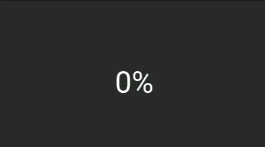