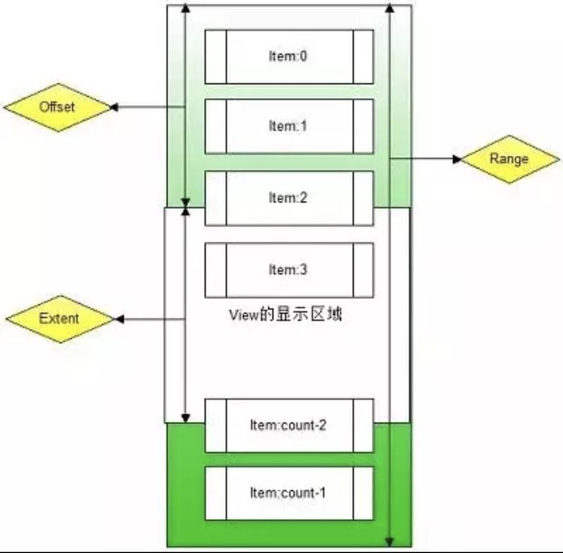
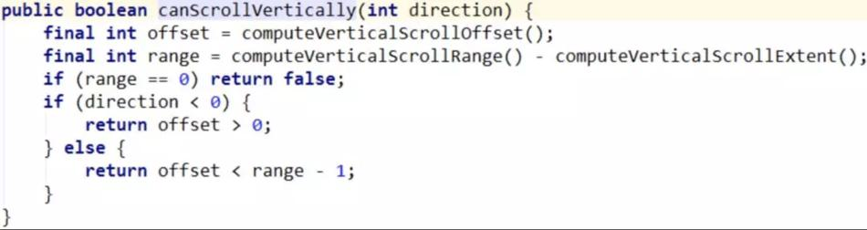
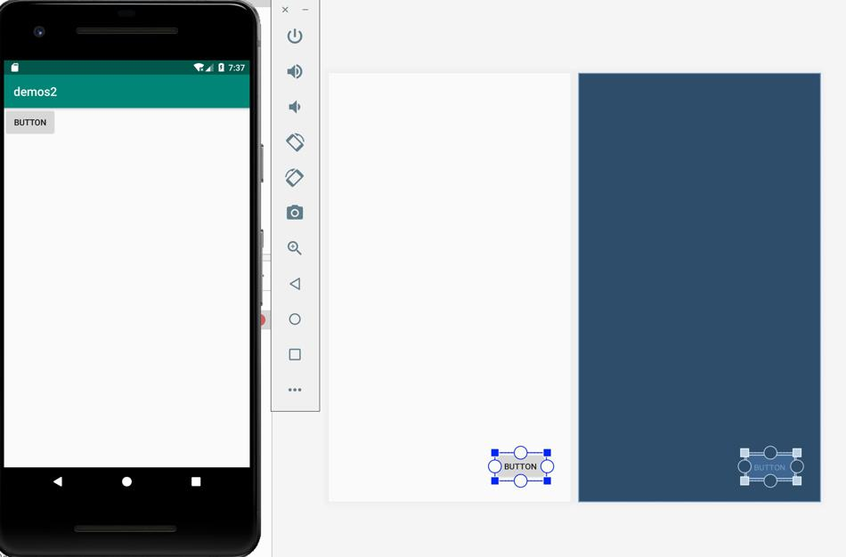
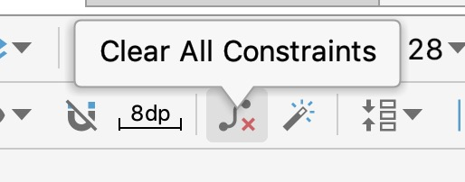
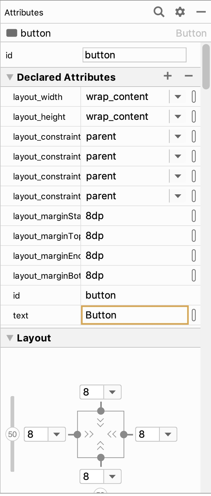
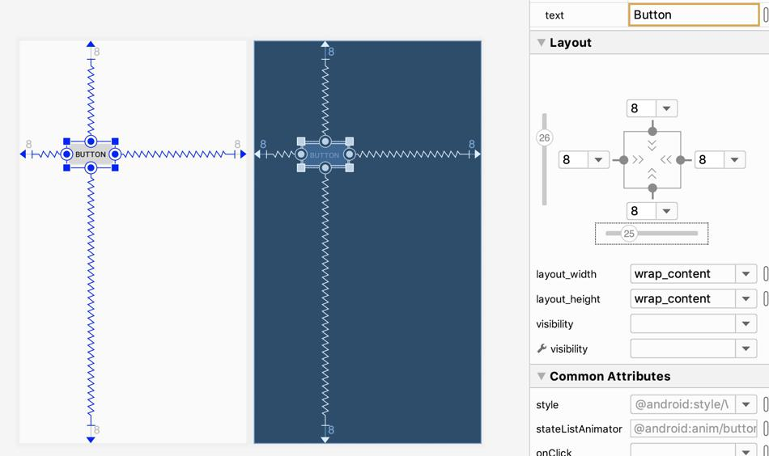
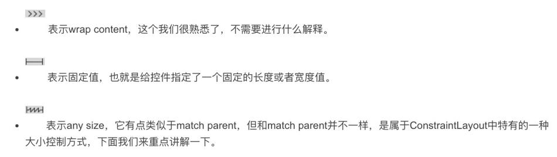
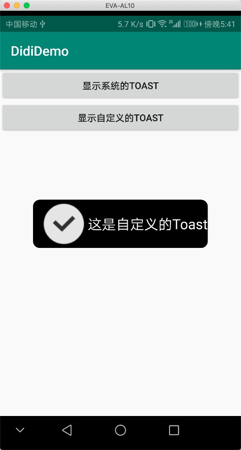

# 控件属性

## clickable、enabled、focusable含义及区别

### clickable

setClickable 设置为true时，表明控件可以点击，如果为false，就不能点击；“点击”适用于鼠标、键盘按键、遥控器等；

注意，setOnClickListener方法会默认把控件的setClickable设置为true。

```java
/**
 * Enables or disables click events for this view. When a view
 * is clickable it will change its state to "pressed" on every click.
 * Subclasses should set the view clickable to visually react to
 * user's clicks.
 *
 * @param clickable true to make the view clickable, false otherwise
 *
 * @see #isClickable()
 * @attr ref android.R.styleable#View_clickable
 */
public void setClickable(boolean clickable) {
    setFlags(clickable ? CLICKABLE : 0, CLICKABLE);
}
```

### enabled

```java
/**
 * Set the enabled state of this view. The interpretation of the enabled
 * state varies by subclass.
 *
 * @param enabled True if this view is enabled, false otherwise.
 */
@RemotableViewMethod
public void setEnabled(boolean enabled) {
    if (enabled == isEnabled()) return;

    setFlags(enabled ? ENABLED : DISABLED, ENABLED_MASK);

    /*
     * The View most likely has to change its appearance, so refresh
     * the drawable state.
     */
    refreshDrawableState();

    // Invalidate too, since the default behavior for views is to be
    // be drawn at 50% alpha rather than to change the drawable.
    invalidate(true);

    if (!enabled) {
        cancelPendingInputEvents();
    }
}
```

setEnabled 使能控件，如果设置为false，该控件永远不会活动，不管设置为什么属性，都无效；
设置为true，表明激活该控件，控件处于活动状态，处于活动状态，就能响应事件了，比如触摸、点击、按键事件等；

setEnabled就相当于总开关一样，只有总开关打开了，才能使用其他事件。

### focusable

```java
/**
 * Set whether this view can receive the focus.
 *
 * Setting this to false will also ensure that this view is not focusable
 * in touch mode.
 *
 * @param focusable If true, this view can receive the focus.
 *
 * @see #setFocusableInTouchMode(boolean)
 * @attr ref android.R.styleable#View_focusable
 */
public void setFocusable(boolean focusable) {
    if (!focusable) {
        setFlags(0, FOCUSABLE_IN_TOUCH_MODE);
    }
    setFlags(focusable ? FOCUSABLE : NOT_FOCUSABLE, FOCUSABLE_MASK);
}
```

setFocusable使能控件获得焦点，设置为true时，并不是说立刻获得焦点，要想立刻获得焦点，得用requestFocus；

使能获得焦点，就是说具备获得焦点的机会、能力，当有焦点在控件之间移动时，控件就有这个机会、能力得到焦点。

# ListView

推荐适配器：ArrayAdapter   (来自《第一行代码》)

用法：

```java
ArrayAdapter<String> adapter=new ArrayAdapter<String>(MyListView.this, android.R.layout.simple_list_item_1,data);
```

第一个是上下文.

android.R.layout.simple_list_item_1 是ListView子项布局的Id，是一个Android内置的布局文件，里面内置一个TextView，简单显示一段文本。

data是一个String数组（适配的数据，和泛型对应）

## xml属性 

```xml
android:divider="@android:color/darker_gray"
android:dividerHeight="10dp"
```

divider用来设置分割线，dividerHeight设置宽度

android:divider="@null" 分割线设置成透明

隐藏滚动条：

```
android:scrollbars="none"
```

取消点击效果：

```
android:listSelector="#00000000"
```

或者用自带的透明效果：

```
android:listSelector="@android:color/transparent"
```

## 动态修改ListView

```
data.add("new")
adapter.notifyDataSetChanged()
```

# PopupWindow

这篇博客不错：	https://www.jianshu.com/p/1a009b964d00

```java
private void showPopupWindow() {
    Button btnRestore, btnLeft, btnRight;
    View view = LayoutInflater.from(getContext()).inflate(R.layout.pop_window, null);
    //设置屏幕的高度和宽度
    final PopupWindow popupWindow = new PopupWindow
            (view, ViewGroup.LayoutParams.MATCH_PARENT, ViewGroup.LayoutParams.WRAP_CONTENT);
    //如果不设置背景颜色的话，无法是pop dimiss掉。
    popupWindow.setBackgroundDrawable(null);
    popupWindow.setOutsideTouchable(true);

    btnRestore =view.findViewById(R.id.btn_restore);
    btnLeft =view.findViewById(R.id.btn_left);
    btnRight =view.findViewById(R.id.btn_right);

    btnRestore.setOnClickListener(new OnClickListener() {
        @Override
        public void onClick(View v) {
            initImageViewSize();
            moveToCenter();
        }
    });

    btnLeft.setOnClickListener(new OnClickListener() {
        @Override
        public void onClick(View v) {
            //TODO
        }
    });

    btnRight.setOnClickListener(new OnClickListener() {
        @Override
        public void onClick(View v) {
            //TODO
        }
    });

    popupWindow.showAtLocation(this, Gravity.BOTTOM, 0, 0);
}
```

## 创建 PopupWindow

```java
public PopupWindow() 

public PopupWindow(View contentView) 
public PopupWindow(int width, int height)
public PopupWindow(View contentView, int width, int height)
public PopupWindow(View contentView, int width, int height, boolean focusable)

public PopupWindow(Context context)
public PopupWindow(Context context, AttributeSet attrs)
public PopupWindow(Context context, AttributeSet attrs, int defStyleAttr)
public PopupWindow(Context context, AttributeSet attrs, int defStyleAttr, int defStyleRes)
```

数一数不多不少 9 个构造方法，一个无参的 8 个有参的，参数代表的意思分别为：
`View contentView` 表示该 PopupWindow 内装载的内容，即展示各位用户的内容
`int width, int height`表示该 PopupWindow 对象的长度和宽度，参数可以是 `ViewGroup.LayoutParams.WRAP_CONTENT`和`ViewGroup.LayoutParams.MATCH_PARENT`
也可以是具体的数值了。但是 这里规定的 是 PopupWindow 内加载到的 view 对象的大小。相当于 PopupWindow 设置的值 为 xml 内最外层布局是等效的。

如果，需要控制加载展示的 view 大小，那么需要将该参数设置`ViewGroup.LayoutParams.WRAP_CONTENT` 并且 目标样式外再包裹一层布局，类似于：

```xml
<?xml version="1.0" encoding="utf-8"?>
<RelativeLayout xmlns:android="http://schemas.android.com/apk/res/android"
    android:layout_width="match_parent"
    android:layout_height="match_parent">

    <RelativeLayout
        android:layout_width="200dp"
        android:layout_height="200dp"
        android:layout_centerInParent="true">

        <ImageView
            android:id="@+id/iv_home"
            android:layout_width="wrap_content"
            android:layout_height="wrap_content"
            android:contentDescription="@string/app_name"
            android:src="@mipmap/home" />
    </RelativeLayout>
</RelativeLayout>
```

`boolean focusable` PopupWindow 响应内部的点击事件，例如 TextView、Button 等
`Context context` 上下文，不多讲
剩下下面的三个构造方法，不常用，但是会自定义 view 的大佬都知道啥意思。

## 常用设置方法

```java
//设置动画特效 即 展示和消失动画
public void setAnimationStyle(int animationStyle)
//主要作用是为了设置 PopupWindow 显示的时候是否会与 StatusBar 重叠（如果存在的话也包括 SystemBar ）
public void setAttachedInDecor(boolean enabled)
//设置  PopupWindow 的背景。该属性不设置的会，会导致 PopupWindow 出现后不会消失，即便是 点击 back 键也不起作用。这应该是 PopupWindow 较为变态的地方。
public void setBackgroundDrawable(Drawable background)
//设置 PopupWindow 允许超出窗口
public void setClippingEnabled(boolean enabled)
//设置 PopupWindow  内展示的内容
public void setContentView(View contentView)
//设置 PopupWindow  的高度，类似于 3D 效果的阴影
public void setElevation(float elevation)
//设置 PopupWindow的入场动画
public void setEnterTransition(Transition enterTransition) 
//有如就得有出 设置出场动画
public void setExitTransition(Transition exitTransition)
//设置 popupWindow 是否可以获取焦点
 public void setFocusable(boolean focusable)
//设置 PopupWindow的高度
 public void setHeight(int height) 
//脸颊事件  Events 都是有大小的当触摸点大于手指头大小时，则为 脸颊事件 ，蛮有意思的 你可以尝试一下。
 public void setIgnoreCheekPress()
//设置输入法的操作模式 
 public void setInputMethodMode(int mode)
//监听 PopupWindow关闭的事件
 public void setOnDismissListener(OnDismissListener onDismissListener)
//设置 点击 PopupWindow意外区域，隐藏 popupWindow  然而并没有什么卵用
 public void setOutsideTouchable(boolean touchable) 
// PopupWindow触摸时的监听回调
 public void setTouchInterceptor(OnTouchListener l)
//设置 PopupWindow是否可触摸
 public void setTouchable(boolean touchable)
//设置 popwindow 的宽度
 public void setWidth(int width)
//设置 PopupWindow布局类型
  public void setWindowLayoutType(int layoutType)
```

设置 PopupWindow 显示位置 相对重要 拿出来写

```java
//设置 PopupWindow 在某个控件的下方，某控件的左下角与 PopupWindow 的左上角对齐
public void showAsDropDown(View anchor)

//设置 PopupWindow 在某个控件的下方，某控件的左下角与 PopupWindow 的左上角对齐，可以设置偏移量 向左为副 ，向右为正；向上为负，向下为正
 public void showAsDropDown(View anchor, int xoff, int yoff) 
//设置 PopupWindow 在相当于父布局进行摆放，可以设置偏移量。
public void showAtLocation(View parent, int gravity, int x, int y)
//隐藏 PopupWindow 
public void dismiss()
```

## 常用获取方法

```java
//获取 PopupWindow 动画样式
 public int getAnimationStyle()
//获取 PopupWindow 背景
 public Drawable getBackground() 
//获取 PopupWindow 设置的 view 返回一个view对象
 public View getContentView() 
//获得 PopupWindow 的悬浮高度
 public float getElevation() 
//获取 PopUpWindow 的入场动画
 public float getElevation() 
//获取 PopupWindow 的出场动画
public Transition getExitTransition()
//获取 PopupWindow 的高度
public int getHeight() 
//获取输入模式
public int getInputMethodMode() 
//获取 PopupWindow 是否应该与寄生（不太合理但是不知道用啥词）对象重叠
public boolean getOverlapAnchor()
//获取 Popwindow 的宽度
 public int getWidth()
//获取 PopupWindow 的布局类型
 public int getWindowLayoutType() 

//获取可以让 PopupWindow 设置的最大高度
public int getMaxAvailableHeight(View anchor)
public int getMaxAvailableHeight(View anchor, int yOffset) 
//获取可以设置 PopupWindow 的最大高度，可以忽略软键盘。
public int getMaxAvailableHeight(
            View anchor, int yOffset, boolean ignoreBottomDecorations)
```

## 常用判断方法

```java
//判断 PopupWindow 是否在超出父布局
public boolean isAboveAnchor() 
// 判断 PopupWindow 是否在父布局的 装饰上
public boolean isAttachedInDecor()
//判读 PopupWindow 是否可以超出窗口
public boolean isClippingEnabled()
//判断 PopupWindow 是否可以获取焦点
public boolean isFocusable()
//判断 PopupWindow 是否相应自身以外的点击事件
public boolean isOutsideTouchable()
//判断 PopupWindow 是否展示
public boolean isShowing()
//判断 PopupWindow 是否支持多点触控
public boolean isSplitTouchEnabled()
//判断 PopupWindow 是否支持触摸事件
public boolean isTouchable()
```

## 不常使用 更新位置或更新内容方法

```java
//更新当前 PopupWindow
public void update() 
//更新 Popwindow 到新的形态  参数：长度、宽度
public void update(int width, int height) 
//更新 Popwindow 到新的位置、新的形态  参数：新位置的坐标，长度、宽度
public void update(int x, int y, int width, int height)
//同上
public void update(int x, int y, int width, int height, boolean force)

//相对于宿主 更新体型
public void update(View anchor, int width, int height)
//相对宿主更新 大小 位置
public void update(View anchor, int xoff, int yoff, int width, int height) 
```

## 部分主要事项

- PopupWindow 默认是不允许超出窗口的，具体演示请看下篇笔记；
- PopupWindow 的 `public void setOutsideTouchable(boolean touchable)` 方法默认没有什么卵用 ，是否可以点击 PopupWindow 外部进行隐藏 PopupWindow ，必须设置 `public void setBackgroundDrawable(Drawable background)` 该方法
- `getHeight()` 和 `getWidth()` 方法不太好用，一般返回为 0；如果获取 PopupWindow 的长宽建议使用如下方法：

```
devPop.getContentView().measure(0, 0);
int hight=devPop.getContentView().getMeasuredHeight();
int width=devPop.getContentView().getMeasuredWidth();
```

- 将 PopupWindow 的四角设置为圆角方法，可以将事先准备的 view 的父布局加一个带有圆角的 shape background， 之后设置 PopupWindow 的 setBackgroundDrawable() 方法 设置为`devPop.setBackgroundDrawable(new ColorDrawable(0x00ffffff));`
- 一定要在显示 PopupWindow 的界面的 OnDestroy（）方法内调用 dismiss（）方法，否则会产生 “意想不到”的惊喜。

```
 @Override
    protected void onDestroy() {
        super.onDestroy();
        if (popupWindow != null) {
            popupWindow.dismiss();
        }
    }
```

# ListPopupWindow

## 效果展示


## 相关 API

### 构造方法

```java
public ListPopupWindow( Context context)
public ListPopupWindow( Context context,  AttributeSet attrs)
public ListPopupWindow( Context context,  AttributeSet attrs,int defStyleAttr) 
public ListPopupWindow(Context context,  AttributeSet attrs,int defStyleAttr,  int defStyleRes)
```

### 设置类方法

```java
//为列表设置 适配器
public void setAdapter( ListAdapter adapter)
//设置锚点 view 寄生的view
public void setAnchorView(@Nullable View anchor)
//为 ListPopupWindow 设置动画样式
public void setAnimationStyle( int animationStyle) 
//为 ListPopupWindow 设置背景
public void setBackgroundDrawable( Drawable d)
//设置 ListPopupWindow 的宽度 单位：像素
public void setContentWidth(int width)
//设置下拉列表的对齐方式
public void setDropDownGravity(int gravity)
//设置 ListPopupWindow 的高度 单位：像素
public void setHeight(int height)
//设置横向偏移量 单位：像素
public void setHorizontalOffset(int offset)
//设置 Drawable 为列表的选择器
public void setListSelector(Drawable selector) 
//将 ListPopupWindow 设置为模态框
 public void setModal(boolean modal)
//设置 ListPopupWindow  提示位置
public void setPromptView( View prompt)
//设置 ListPopupWindow  的选定位置
public void setSelection(int position)
//设置 ListPopupWindow  输入区域的输入模式
public void setSoftInputMode(int mode)
//设置 ListPopupWindow  的竖直方向偏移量
public void setVerticalOffset(int offset)
//设置 ListPopupWindow  的宽度
public void setWidth(int width) 
//设置 ListPopupWindow  的布局类型
public void setWindowLayoutType(int layoutType)
// 可将返回对象 添加到 源视图中，进而实现拖动并打开。
public OnTouchListener createDragToOpenListener(View src)

//展示 ListPopupWindow  
public void show() 
```

### 监听器

```java
//设置 ListPopupWindow  关闭的 时的监听
public void setOnDismissListener(PopupWindow.OnDismissListener listener) 
//设置 ListPopupWindow 的 item 单击时的监听回调
public void setOnItemClickListener(AdapterView.OnItemClickListener clickListener)
//设置 ListPopupWindow  item 被选择 时的监听回调
public void setOnItemSelectedListener(OnItemSelectedListener selectedListener)
```

#### 获取方法

```java
//获取 ListPopupWindow  的锚点 view
public View getAnchorView()
//获取 ListPopupWindow  的动画样式
public  int getAnimationStyle() 
//获取 ListPopupWindow  的背景
public  Drawable getBackground() 
//获取 ListPopupWindow 的高度
public int getHeight()
//获取 ListPopupWindow 的横向偏移量
public int getHorizontalOffset() 
//获取 ListPopupWindow 的 列表
public  ListView getListView()
//获取可选的 ListPopupWindow 的位置
public int getPromptPosition()
//获取 ListPopupWindow 内被选中的 item
public  Object getSelectedItem() 
//获取被选中的 item 的 id
public long getSelectedItemId()
//获取被选中的 item 的位置
public int getSelectedItemPosition() 
//获取被选中的 view
public  View getSelectedView() 
//获取 垂直方向的偏移量  单位：像素
public int getVerticalOffset() 
//获取 ListPopupWindow 的宽度
public int getWidth()
```

### 判断方法

```java
//判断是否为 模态框样式
public boolean isModal()
//判断是否为显示状态
public boolean isShowing()

//过了关键按键  点击事件
public boolean onKeyDown(int keyCode,  KeyEvent event)
//过滤关键按键 点击抬起事件
public boolean onKeyUp(int keyCode,  KeyEvent event)
//判断 是否 在指定 item 下执行点击事件
public boolean performItemClick(int position)
```

### 其他的重要方法

```java
//执行相关 对 ui 线程的操作
public void postShow()
//删除 当前列表的所有选择
public void clearListSelection() 
//关闭 ListPopupWindow 
public void dismiss()
```

# ImageView

## scaleType 属性

**1.android:scaleType=“center” **

保持原图的大小，显示在ImageView的中心。当原图的size大于ImageView的size时，多出来的部分被截掉。  	

**2.android:scaleType=“center_inside”  **

以原图正常显示为目的，如果原图大小大于ImageView的size，就按照比例缩小原图的宽高，居中显示在ImageView中。如果原图size小于ImageView的size，则不做处理居中显示图片。  

**3.android:scaleType=“center_crop” **

以原图填满ImageView为目的，如果原图size大于ImageView的size，则与center_inside一样，按比例缩小，居中显示在ImageView上。如果原图size小于ImageView的size，则按比例拉升原图的宽和高，填充ImageView居中显示。  

**4.android:scaleType=“matrix” ** 

不改变原图的大小，从ImageView的左上角开始绘制，超出部分做剪切处理。 

**5.androd:scaleType=“fit_xy” **

把图片按照指定的大小在ImageView中显示，拉伸显示图片，不保持原比例，填满ImageView. 

**6.android:scaleType=“fit_start”  **

把原图按照比例放大缩小到ImageView的高度，显示在ImageView的start（前部/上部）。  

**7.android:sacleType=“fit_center”  **

把原图按照比例放大缩小到ImageView的高度，显示在ImageView的center（中部/居中显示）。  

**8.android:scaleType=“fit_end”  **

把原图按照比例放大缩小到ImageView的高度，显示在ImageVIew的end（后部/尾部/底部）

# ExpandableListView

一种用于垂直滚动展示两级列表的视图，和 ListView 的不同之处就是它可以展示两级列表，分组可以单独展开显示子选项。这些选项的数据是通过 ExpandableListAdapter 关联的。 可以实现好友列表功能。

## 定义布局文件 

```xml
<ExpandableListView
    android:id="@+id/expand_list"
    android:layout_marginTop="10dp"
    android:layout_marginRight="8dp"
    android:layout_marginLeft="8dp"
    android:divider="@null"
    android:dividerHeight="20dp"
    android:layout_width="match_parent"
    android:layout_height="match_parent" />
```

定义要显示的数据 

```java
public String[] groupStrings = {"zzsy1", "zzsy2", "zzsy3", "zzsy4"};
public String[][] childStrings = {
        {"1", "2", "3", "4"},
        {"5", "6", "7", "8"},
        {"9", "10", "11", "12", "13"},
        {"14", "15", "16", "17"}
};
```

## 定义分组的视图和子选项的视图 

### 父视图

```xml
<TextView
    android:id="@+id/label_expand_group"
    android:layout_width="match_parent"
    android:layout_height="wrap_content"
    android:layout_gravity="center_vertical"
    android:paddingStart="30dp"
    android:textColor="#000"
    android:textSize="22sp" />

```

### 子视图

```xml
<LinearLayout
    android:layout_width="match_parent"
    android:layout_height="wrap_content"
    android:orientation="horizontal">

    <ImageView
        android:id="@+id/img"
        android:layout_width="38dp"
        android:layout_height="38dp"
        android:src="@mipmap/ic_launcher"
        android:layout_gravity="center_vertical"
        android:scaleType="centerInside"/>

    <TextView
        android:id="@+id/item_expand_group"
        android:layout_width="match_parent"
        android:layout_height="wrap_content"
        android:layout_gravity="center_vertical"
        android:textColor="#000"
        android:paddingStart="10dp"
        android:textSize="20sp" />
</LinearLayout>
```

### 自定义适配器

需要继承 BaseExpandableListAdapter 抽象类，重写相关的方法 

```java
public class Adapter extends BaseExpandableListAdapter {
    private String[] group;
    private String[][] children;
    private Context context;

    public Adapter(Context context, String[] group, String[][] children) {
        this.context = context;
        this.group = group;
        this.children = children;
    }

    @Override
    public int getGroupCount() {
        return group.length;
    }

    @Override
    public int getChildrenCount(int i) {
        return children[i].length;
    }

    @Override
    public Object getGroup(int i) {
        return group[i];
    }

    @Override
    public Object getChild(int i, int i1) {
        return children[i][i1];
    }

    @Override
    public long getGroupId(int i) {
        return i;
    }

    @Override
    public long getChildId(int i, int i1) {
        return i1;
    }

    @Override
    public boolean hasStableIds() {
        return true;
    }

    @Override
    public View getGroupView(int i, boolean b, View view, ViewGroup viewGroup) {
        GroupViewHolder groupViewHolder;
        if (view == null) {
            view = LayoutInflater.from(context)
                    .inflate(R.layout.label_expand_list, viewGroup, false);
            groupViewHolder = new GroupViewHolder();
            groupViewHolder.textView = view.findViewById(R.id.label_expand_group);
            view.setTag(groupViewHolder);
        } else {
            groupViewHolder = (GroupViewHolder) view.getTag();
        }
        groupViewHolder.textView.setText(group[i]);
        return view;
    }

    @Override
    public View getChildView(int i, int i1, boolean b, View view, ViewGroup viewGroup) {
        ChildViewHolder childViewHolder;
        if (view == null) {
            view = LayoutInflater.from(context).
                    inflate(R.layout.item_expand_list, viewGroup, false);
            childViewHolder = new ChildViewHolder();
            childViewHolder.textView = view.findViewById(R.id.item_expand_group);
            view.setTag(childViewHolder);
        } else {
            childViewHolder = (ChildViewHolder) view.getTag();
        }
        childViewHolder.textView.setText(children[i][i1]);
        return view;
    }

    @Override
    public boolean isChildSelectable(int i, int i1) {
        return true;
    }

    static class GroupViewHolder {
        TextView textView;
    }

    static class ChildViewHolder {
        TextView textView;
    }
}
```

### 设置适配器 

```
Adapter adapter=new Adapter(this,groupStrings,childStrings);
expandableListView.setAdapter(adapter);
```

## 参考博客

https://www.jianshu.com/p/9fa82c15fe1e

https://blog.csdn.net/u012702547/article/details/49254463

# RecyclerView

## 参考

https://www.jianshu.com/p/9cf13dc21b82

https://blog.csdn.net/lmj623565791/article/details/45059587 (鸿洋_)

概述

- 你想要控制其显示的方式，请通过布局管理器LayoutManager
- 你想要控制Item间的间隔（可绘制），请通过ItemDecoration
- 你想要控制Item增删的动画，请通过ItemAnimator
- 你想要控制点击、长按事件，请自己写

## 基本使用

添加依赖

```
compile 'com.android.support:recyclerview-v7:27.1.1'
```

```
mRecyclerView = findView(R.id.id_recyclerview);
//设置布局管理器
mRecyclerView.setLayoutManager(layout);
//设置adapter
mRecyclerView.setAdapter(adapter)
//设置Item增加、移除动画
mRecyclerView.setItemAnimator(new DefaultItemAnimator());
//添加分割线
mRecyclerView.addItemDecoration(new DividerItemDecoration(
                getActivity(), DividerItemDecoration.HORIZONTAL_LIST));
```

## 分割线

官方提供的默认实现类 `DividerItemDecoration`

抽象类ItemDecoration

```java
public abstract static class ItemDecoration {
    
    //使用此方法绘制的任何内容都将在绘制子项视图之前绘制，从而出现在视图之下。
    public void onDraw(Canvas c, RecyclerView parent, State state) {
        onDraw(c, parent);
    }

    //onDraw方法先于drawChildren
    @Deprecated
    public void onDraw(Canvas c, RecyclerView parent) {
    }

    //onDrawOver在drawChildren之后，一般我们选择复写其中一个即可。
    public void onDrawOver(Canvas c, RecyclerView parent, State state) {
        onDrawOver(c, parent);
    }

    //使用此方法绘制的任何内容都将在绘制子项视图之后绘制，从而出现在视图之上。
    @Deprecated
    public void onDrawOver(Canvas c, RecyclerView parent) {
    }

    //为每个Item设置一定的偏移量
    @Deprecated
    public void getItemOffsets(Rect outRect, int itemPosition, RecyclerView parent) {
        outRect.set(0, 0, 0, 0);
    }

    //为每个Item设置一定的偏移量
    public void getItemOffsets(Rect outRect, View view, RecyclerView parent, State state) {
        getItemOffsets(outRect, ((LayoutParams) view.getLayoutParams()).getViewLayoutPosition(),parent);
    }
}
```

自己实现一个自定义的分割线

```java
public class MyItemDecoration extends RecyclerView.ItemDecoration {
    public static final int HORIZONTAL = LinearLayout.HORIZONTAL;
    public static final int VERTICAL = LinearLayout.VERTICAL;

    private static final String TAG = "DividerItem";
    private static final int[] ATTRS = new int[]{android.R.attr.listDivider};
    private final Rect mBounds = new Rect();
    private Drawable mDivider;
    private int mOrientation;

    public MyItemDecoration(Context context, int orientation) {
        //读取系统主题中的@android:attr/listDivider作为 Item 的分割线
        final TypedArray a = context.obtainStyledAttributes(ATTRS);
        mDivider = a.getDrawable(0);
        a.recycle();
        setOrientation(orientation);
    }

    public void setOrientation(int orientation) {
        mOrientation = orientation;
    }

    public void setDrawable(@NonNull Drawable drawable) {
        mDivider = drawable;
    }

    @Override
    public void onDraw(Canvas c, RecyclerView parent, RecyclerView.State state) {
        if (parent.getLayoutManager() == null || mDivider == null) {
            return;
        }
        if (mOrientation == VERTICAL) {
            drawVertical(c, parent);
        } else {
            drawHorizontal(c, parent);
        }
    }

    private void drawVertical(Canvas canvas, RecyclerView parent) {
        canvas.save();
        final int left;
        final int right;
        if (parent.getClipToPadding()) {
            left = parent.getPaddingLeft();
            right = parent.getWidth() - parent.getPaddingRight();
            canvas.clipRect(left, parent.getPaddingTop(), right,
                    parent.getHeight() - parent.getPaddingBottom());
        } else {
            left = 0;
            right = parent.getWidth();
        }

        final int childCount = parent.getChildCount();
        for (int i = 0; i < childCount; i++) {
            final View child = parent.getChildAt(i);
            parent.getDecoratedBoundsWithMargins(child, mBounds);
            final int bottom = mBounds.bottom + Math.round(child.getTranslationY());
            final int top = bottom - mDivider.getIntrinsicHeight();
            mDivider.setBounds(left, top, right, bottom);
            mDivider.draw(canvas);
        }
        canvas.restore();
    }

    private void drawHorizontal(Canvas canvas, RecyclerView parent) {
        canvas.save();
        final int top;
        final int bottom;
       
        if (parent.getClipToPadding()) {
            top = parent.getPaddingTop();
            bottom = parent.getHeight() - parent.getPaddingBottom();
            canvas.clipRect(parent.getPaddingLeft(), top,
                    parent.getWidth() - parent.getPaddingRight(), bottom);
        } else {
            top = 0;
            bottom = parent.getHeight();
        }

        final int childCount = parent.getChildCount();
        for (int i = 0; i < childCount; i++) {
            final View child = parent.getChildAt(i);
            parent.getLayoutManager().getDecoratedBoundsWithMargins(child, mBounds);
            final int right = mBounds.right + Math.round(child.getTranslationX());
            final int left = right - mDivider.getIntrinsicWidth();
            mDivider.setBounds(left, top, right, bottom);
            mDivider.draw(canvas);
        }
        canvas.restore();
    }

    @Override
    public void getItemOffsets(Rect outRect, View view, RecyclerView parent,
                               RecyclerView.State state) {
        if (mDivider == null) {
            outRect.set(0, 0, 0, 0);
            return;
        }
        if (mOrientation == VERTICAL) {
            outRect.set(0, 0, 0, mDivider.getIntrinsicHeight());
        } else {
            outRect.set(0, 0, mDivider.getIntrinsicWidth(), 0);
        }
    }
}
```

改变分割线的样式：

- 调用 setDrawable() 直接传入一个 drawable 对象

  ```java
  MyItemDecoration myItemDecoration =
          new MyItemDecoration(this, MyItemDecoration.VERTICAL);
  Drawable d = ContextCompat.getDrawable(this, R.drawable.decoration);
  if (d != null) {
      myItemDecoration.setDrawable(d);
  }
  recyclerView.addItemDecoration(myItemDecoration);
  ```

- 修改系统主题中的 `android:listDivider` 属性值

  ```xml
  <resources>
  
      <!-- Base application theme. -->
      <style name="AppTheme" parent="Theme.AppCompat.Light.DarkActionBar">
          <!-- Customize your theme here. -->
          <item name="colorPrimary">@color/colorPrimary</item>
          <item name="colorPrimaryDark">@color/colorPrimaryDark</item>
          <item name="colorAccent">@color/colorAccent</item>
          
          <!--修改分割线样式-->
          <item name="android:listDivider">@drawable/decoration</item>
      </style>
  
  </resources>
  ```

## 非Linear下的分割线

因为要绘制水平和垂直方向上的，所以要另写一个类。

```java
public class MyGridItemDecoration extends RecyclerView.ItemDecoration {
    private static final int[] ATTRS = new int[]{android.R.attr.listDivider};
    private Drawable mDivider;

    public MyGridItemDecoration(Context context) {
        final TypedArray a = context.obtainStyledAttributes(ATTRS);
        mDivider = a.getDrawable(0);
        a.recycle();
    }

    @Override
    public void onDraw(Canvas c, RecyclerView parent, RecyclerView.State state) {

        drawHorizontal(c, parent);
        drawVertical(c, parent);

    }

    private int getSpanCount(RecyclerView parent) {
        // 列数
        int spanCount = -1;
        RecyclerView.LayoutManager layoutManager = parent.getLayoutManager();
        if (layoutManager instanceof GridLayoutManager) {

            spanCount = ((GridLayoutManager) layoutManager).getSpanCount();
        } else if (layoutManager instanceof StaggeredGridLayoutManager) {
            spanCount = ((StaggeredGridLayoutManager) layoutManager)
                    .getSpanCount();
        }
        return spanCount;
    }

    public void drawHorizontal(Canvas c, RecyclerView parent) {
        int childCount = parent.getChildCount();
        for (int i = 0; i < childCount; i++) {
            final View child = parent.getChildAt(i);
            final RecyclerView.LayoutParams params = (RecyclerView.LayoutParams) child
                    .getLayoutParams();
            final int left = child.getLeft() - params.leftMargin;
            final int right = child.getRight() + params.rightMargin
                    + mDivider.getIntrinsicWidth();
            final int top = child.getBottom() + params.bottomMargin;
            final int bottom = top + mDivider.getIntrinsicHeight();
            mDivider.setBounds(left, top, right, bottom);
            mDivider.draw(c);
        }
    }

    public void drawVertical(Canvas c, RecyclerView parent) {
        final int childCount = parent.getChildCount();
        for (int i = 0; i < childCount; i++) {
            final View child = parent.getChildAt(i);

            final RecyclerView.LayoutParams params = (RecyclerView.LayoutParams) child
                    .getLayoutParams();
            final int top = child.getTop() - params.topMargin;
            final int bottom = child.getBottom() + params.bottomMargin;
            final int left = child.getRight() + params.rightMargin;
            final int right = left + mDivider.getIntrinsicWidth();

            mDivider.setBounds(left, top, right, bottom);
            mDivider.draw(c);
        }
    }

    private boolean isLastColum(RecyclerView parent, int pos, int spanCount,
                                int childCount) {
        RecyclerView.LayoutManager layoutManager = parent.getLayoutManager();
        if (layoutManager instanceof GridLayoutManager) {
            if ((pos + 1) % spanCount == 0)// 如果是最后一列，则不需要绘制右边
            {
                return true;
            }
        } else if (layoutManager instanceof StaggeredGridLayoutManager) {
            int orientation = ((StaggeredGridLayoutManager) layoutManager)
                    .getOrientation();
            if (orientation == StaggeredGridLayoutManager.VERTICAL) {
                if ((pos + 1) % spanCount == 0)// 如果是最后一列，则不需要绘制右边
                {
                    return true;
                }
            } else {
                childCount = childCount - childCount % spanCount;
                if (pos >= childCount)// 如果是最后一列，则不需要绘制右边
                    return true;
            }
        }
        return false;
    }

    private boolean isLastRaw(RecyclerView parent, int pos, int spanCount,
                              int childCount) {
        RecyclerView.LayoutManager layoutManager = parent.getLayoutManager();
        if (layoutManager instanceof GridLayoutManager) {
            childCount = childCount - childCount % spanCount;
            if (pos >= childCount)// 如果是最后一行，则不需要绘制底部
                return true;
        } else if (layoutManager instanceof StaggeredGridLayoutManager) {
            int orientation = ((StaggeredGridLayoutManager) layoutManager)
                    .getOrientation();
            // StaggeredGridLayoutManager 且纵向滚动
            if (orientation == StaggeredGridLayoutManager.VERTICAL) {
                childCount = childCount - childCount % spanCount;
                // 如果是最后一行，则不需要绘制底部
                if (pos >= childCount)
                    return true;
            } else
            // StaggeredGridLayoutManager 且横向滚动
            {
                // 如果是最后一行，则不需要绘制底部
                if ((pos + 1) % spanCount == 0) {
                    return true;
                }
            }
        }
        return false;
    }

    @Override
    public void getItemOffsets(Rect outRect, int itemPosition,
                               RecyclerView parent) {
        int spanCount = getSpanCount(parent);
        int childCount = parent.getAdapter().getItemCount();
        if (isLastRaw(parent, itemPosition, spanCount, childCount))// 如果是最后一行，则不需要绘制底部
        {
            outRect.set(0, 0, mDivider.getIntrinsicWidth(), 0);
        } else if (isLastColum(parent, itemPosition, spanCount, childCount))// 如果是最后一列，则不需要绘制右边
        {
            outRect.set(0, 0, 0, mDivider.getIntrinsicHeight());
        } else {
            outRect.set(0, 0, mDivider.getIntrinsicWidth(),
                    mDivider.getIntrinsicHeight());
        }
    }

}
```

主要在getItemOffsets方法中，去判断如果是最后一行，则不需要绘制底部；如果是最后一列，则不需要绘制右边，整个判断也考虑到了StaggeredGridLayoutManager的横向和纵向，所以稍稍有些复杂。最重要还是去理解，如何绘制什么的不重要。一般如果仅仅是希望有空隙，还是去设置item的margin方便。

## 动画ItemAnimator

```
//添加动画
//其实这段不需要写，因为默认的动画就是DefaultItemAnimator()
recyclerView.setItemAnimator(new DefaultItemAnimator());
```

注意，这里更新数据集不是用`adapter.notifyDataSetChanged()`而是`notifyItemInserted(position)`与`notifyItemRemoved(position)` 否则没有动画效果。 

在Adapter里添加两个方法

```
public void addData(int position) {
    list.add(position, "插入的");
    notifyItemInserted(position);
}

public void removeData(int position) {
    list.remove(position);
    notifyItemRemoved(position);
}

```

## 上下拉刷新

下拉刷新就用Material Design的SwipeRefreshLayout,上拉加载更多主要思想就是底部设置一个FootHolder。

[源码](https://github.com/MEzzsy/RecyclerViewDemo)

## 判断滑到最底部

有这么几种：

```
1.lastVisibleItemPosition == totalItemCount - 1判断；
2.computeVerticalScrollRange()等三个方法判断；
3.canScrollVertically(1)判断；
4.利用RecyclerView的LinearLayoutManager几个方法判断。

```

### 第一种方法

```java
public boolean isVisBottom(RecyclerView recyclerView) {
    LinearLayoutManager layoutManager = (LinearLayoutManager) recyclerView.getLayoutManager();
    //屏幕中最后一个可见子项的position
    int lastVisibleItemPosition = layoutManager.findLastVisibleItemPosition();
    //当前屏幕所看到的子项个数
    int visibleItemCount = layoutManager.getChildCount();
    //当前RecyclerView的所有子项个数
    int totalItemCount = layoutManager.getItemCount();
    //RecyclerView的滑动状态
    int state = recyclerView.getScrollState();
    if (visibleItemCount > 0
            && lastVisibleItemPosition == totalItemCount - 1
            && state == RecyclerView.SCROLL_STATE_IDLE) {
        return true;
    } else {
        return false;
    }
}
```

很明显，当屏幕中最后一个子项lastVisibleItemPosition等于所有子项个数totalItemCount - 1，那么RecyclerView就到达了底部。但是，我在这种方法中发现了极为极端的情况，就是当totalItemCount等于1，而这个子项的高度比屏幕还要高。

可以发现这个子项没完全显示出来就已经被判断为拉到底部。当然，这种方法一般情况下都能满足开发者的需求。

### 第二种方法

```java
public boolean isSlideToBottom(RecyclerView recyclerView) {
    if (recyclerView == null) return false;
    //（1）computeVerticalScrollOffset()：
    //已经向下滚动的距离，为0时表示已处于顶部。
    //（2）computeVerticalScrollRange()：
    //整体的高度，注意是整体，包括在显示区域之外的。
    //（3）computeVerticalScrollExtent()：
    //显示区域的高度。
    if (recyclerView.computeVerticalScrollExtent() + recyclerView.computeVerticalScrollOffset()
            >= recyclerView.computeVerticalScrollRange())
        return true;
    return false;
}
```

这种方法原理其实很简单，而且也是View自带的方法。



这样就很清晰明了，computeVerticalScrollExtent()是当前屏幕显示的区域高度，computeVerticalScrollOffset() 是当前屏幕之前滑过的距离，而computeVerticalScrollRange()是整个View控件的高度。
这种方法经过测试，暂时还没发现有bug，而且它用的是View自带的方法，所以个人觉得比较靠谱。

### 第三个方法

```
RecyclerView.canScrollVertically(1)的值表示是否能向上滚动，false表示已经滚动到底部
RecyclerView.canScrollVertically(-1)的值表示是否能向下滚动，false表示已经滚动到顶部
```

这种方法更简单，就通过简单的调用方法，就可以得到你想要的结果。我一讲过这种方法与第二种方法其实是同一种方法，那下面来分析一下，看看canScrollVertically的源码：



是不是一目了然了，canScrollVertically方法的实现实际上运用到的是方法二的三个函数，只是这个方法Android已经帮我们封装好了，原理一模一样的。

### 第四种方法

最后一种方法其实是比较呆板的，就是利用LinearLayoutManager的几个方法，1.算出已经滑过的子项的距离，2.算出屏幕的高度，3.算出RecyclerView的总高度。然后用他们做比较，原理类似于方法二。

```java
public static int getItemHeight(RecyclerView recyclerView) {  
  int itemHeight = 0;  
  View child = null;  
  LinearLayoutManager layoutManager = (LinearLayoutManager) recyclerView.getLayoutManager();  
  int firstPos = layoutManager.findFirstCompletelyVisibleItemPosition(); 
  int lastPos = layoutManager.findLastCompletelyVisibleItemPosition();  
  child = layoutManager.findViewByPosition(lastPos);  
  if (child != null) {   
     RecyclerView.LayoutParams params = (RecyclerView.LayoutParams) child.getLayoutParams();   
     itemHeight = child.getHeight() + params.topMargin + params.bottomMargin;  
  }   
 return itemHeight;}
```

算出一个子项的高度

```java
public static int getLinearScrollY(RecyclerView recyclerView) {  
  int scrollY = 0;  
  LinearLayoutManager layoutManager = (LinearLayoutManager) recyclerView.getLayoutManager();  
  int headerCildHeight = getHeaderHeight(recyclerView);  
  int firstPos = layoutManager.findFirstVisibleItemPosition();  
  View child = layoutManager.findViewByPosition(firstPos);  
  int itemHeight = getItemHeight(recyclerView);  
  if (child != null) {   
     int firstItemBottom = layoutManager.getDecoratedBottom(child);   
     scrollY = headerCildHeight + itemHeight * firstPos - firstItemBottom;    
     if(scrollY < 0){    
         scrollY = 0;    
     }  
  }  
  return scrollY;
}
```

算出滑过的子项的总距离

```java
public static int getLinearTotalHeight(RecyclerView recyclerView) {    int totalHeight = 0;  
  LinearLayoutManager layoutManager = (LinearLayoutManager) recyclerView.getLayoutManager();  
  View child = layoutManager.findViewByPosition(layoutManager.findFirstVisibleItemPosition());  
  int headerCildHeight = getHeaderHeight(recyclerView);  
  if (child != null) {   
     int itemHeight = getItemHeight(recyclerView);    
     int childCount = layoutManager.getItemCount();    
     totalHeight = headerCildHeight + (childCount - 1) * itemHeight;  
  }  
  return totalHeight;
}
```

算出所有子项的总高度

```java
public static boolean isLinearBottom(RecyclerView recyclerView) {    
boolean isBottom = true;  
  int scrollY = getLinearScrollY(recyclerView);  
  int totalHeight = getLinearTotalHeight(recyclerView); 
  int height = recyclerView.getHeight();
 //    Log.e("height","scrollY  " + scrollY + "  totalHeight  " +  totalHeight + "  recyclerHeight  " + height);  
  if (scrollY + height < totalHeight) {    
    isBottom = false;  
  }  
  return isBottom;
}
```

高度作比较。

## Adapter

```java
class MyRecyclerAdapter extends RecyclerView.Adapter<MyRecyclerAdapter.ViewHolder> {
    private Context mContext;

    public MyRecyclerAdapter(Context context) {
        mContext = context;
    }

    @NonNull
    @Override
    public ViewHolder onCreateViewHolder(@NonNull ViewGroup viewGroup, int i) {
        View view = LayoutInflater.from(mContext).inflate(R.layout.d15_recyclerview_item, viewGroup, false);
        return new ViewHolder(view);
    }

    @Override
    public void onBindViewHolder(@NonNull ViewHolder viewHolder, int i) {
        Random random = new Random();
        viewHolder.mView.setBackgroundColor(Color.rgb(random.nextInt(255)
                , random.nextInt(255), random.nextInt(255)));
    }

    @Override
    public int getItemCount() {
        return 10;
    }

    class ViewHolder extends RecyclerView.ViewHolder {
        private View mView;

        ViewHolder(@NonNull View itemView) {
            super(itemView);
            mView = itemView.findViewById(R.id.view);
        }
    }
}
```

## SnapHelper

SnapHelper有两种：PagerSnapHelper，LinearSnapHelper。

```
private PagerSnapHelper mPagerSnapHelper;

private LinearSnapHelper mLinearSnapHelper;
```

PagerSnapHelper的使用效果：像ViewPager一样的效果，每次只能滑动一页

LinearSnapHelper的使用效果：使当前Item居中显示，常用场景是横向的RecyclerView，类似ViewPager效果，但是又可以快速滑动多个条目。

一般配合LinearLayoutManager使用，通过设置方向setOrientation来达到竖直或垂直的效果。

# ToolBar

设置标题居中，只要在内部嵌一个TextView。

```xml
<android.support.v7.widget.Toolbar
    android:id="@+id/tool_bar"
    android:layout_width="match_parent"
    android:layout_height="wrap_content"
    android:background="#81eaf1"
    android:theme="@style/ThemeOverlay.AppCompat.Dark.ActionBar"
    app:layout_scrollFlags="scroll|enterAlways|snap"
    app:popupTheme="@style/ThemeOverlay.AppCompat.Light">

    <TextView
        android:id="@+id/tv_title"
        android:layout_width="wrap_content"
        android:layout_height="wrap_content"
        android:layout_gravity="center"
        android:text="图片"
        android:textColor="#000"
        android:textSize="22sp" />
</android.support.v7.widget.Toolbar>
```

# ConstraintLayout

### 参考

https://blog.csdn.net/guolin_blog/article/details/53122387 （可视化操作）

https://www.jianshu.com/p/502127a493fb （xml操作）

## 基本操作

虽说Button已经添加到界面上了，但是由于还没有给Button添加任何的约束，因此Button并不知道自己应该出现在什么位置。现在在预览界面上看到的Button位置并不是它最终运行后的实际位置，如果一个控件没有添加任何约束的话，它在运行之后会自动位于界面的左上角。



每个控件的约束都分为垂直和水平两类，一共可以在四个方向上给控件添加约束。

给Button的右边和下边添加了约束，因此Button就会将自己定位到布局的右下角了。


除此之外，还可以使用约束让一个控件相对于另一个控件进行定位。比如，希望再添加一个Button，让它位于第一个Button的正下方，并且间距108dp。


删除约束的方式一共有两种：

- 第一种用于删除一个单独的约束，将鼠标悬浮在某个约束的圆圈上，然后该圆圈会变成红色，这个时候单击一下就能删除了。
- 第二种用于删除当前界面中的所有约束，点击工具栏中的删除约束图标即可。



## Inspector

当你选中任意一个控件的时候，在右侧的Properties区域就会出现很多的属性选项，如下图所示。



在这里可以设置当前控件的所有属性，如文本内容、颜色、点击事件等等。

在Inspector中有一个纵向的轴和一个横向的轴，这两个轴也是用于确定控件的位置的。我们刚才给Button的上下左右各添加了一个约束，然后Button就能居中显示了，其实就是因为这里纵横轴的值都是50。

如果调整了纵横轴的比例，那么Button的位置也会随之改变。



而Android Studio给控件的每个方向上的约束都默认添加了一个8dp的间距，从Inspector上面也可以明显地看出来这些间距的值。修改成0之后Button右侧的间距就没了。

接下来我们再来学习一下位于Inspector最中间的那个正方形区域，它是用来控制控件大小的。一共有三种模式可选，每种模式都使用了一种不同的符号表示，点击符号即可进行切换。


首先需要说明，在ConstraintLayout中是有match parent的，只不过用的比较少，因为ConstraintLayout的一大特点就是为了解决布局嵌套，既然没有了布局嵌套，那么match parent也就没有多大意义了。

any size就是用于在ConstraintLayout中顶替match parent的，先看一下我们怎样使用any size实现和match parent同样的效果吧。将Button的宽度指定成any size，它就会自动充满整个布局了。当然还要记得将Button左侧的间距设置成0才行。

match parent是用于填充满当前控件的父布局，而any size是用于填充满当前控件的约束规则。举个例子更好理解，如果我们有一个新的Button，它的其中一个约束是添加到当前这个Button上的，那么any size的效果也会发生改变，

## Guidelines

### 自动添加约束

自动添加约束的方式主要有两种，一种叫Autoconnect，一种叫Inference，我们先来看第一种。

Autoconnect可以根据我们拖放控件的状态自动判断应该如何添加约束，比如我们将Button放到界面的正中央，那么它的上下左右都会自动地添加上约束。


Inference也是用于自动添加约束的，但它比Autoconnect的功能要更为强大，因为AutoConnect只能给当前操作的控件自动添加约束，而Inference会给当前界面中的所有元素自动添加约束。因而Inference比较适合用来实现复杂度比较高的界面，它可以一键自动生成所有的约束。


# MediaPlay

**获得MediaPlayer实例**

```java
//可以使用直接new的方式：
MediaPlayer mp = new MediaPlayer();

//也可以使用create的方式，如：
MediaPlayer mp = MediaPlayer.create(this, R.raw.test);//这时就不用调用setDataSource了
```

**设置要播放的文件**

1. 用户在应用中事先自带的resource资源，例如：MediaPlayer.create(this, R.raw.test)
2. 存储在SD卡或其他文件路径下的媒体文件，例如：mp.setDataSource("/sdcard/test.mp3");
3. 网络上的媒体文件，例如：mp.setDataSource("http://www.citynorth.cn/music/confucius.mp3");

MediaPlayer的setDataSource一共四个方法：

```java
setDataSource (String path) 
setDataSource (FileDescriptor fd) 
setDataSource (Context context, Uri uri) 
setDataSource (FileDescriptor fd, long offset, long length)
```

其中使用FileDescriptor时，需要将文件放到与res文件夹平级的assets文件夹里，然后使用：

```java
AssetFileDescriptor fileDescriptor = getAssets().openFd("rain.mp3");

m_mediaPlayer.setDataSource(fileDescriptor.getFileDescriptor(), fileDescriptor.getStartOffset(), fileDescriptor.getLength());
```

为了方便初始化，还提供了几个静态的create()方法用于完成MediaPlayer初始化的工作。

- static MediaPlayer create(Context context,int resid)：通过音频资源的Id来创建一个MediaPlayer实例。
- static MediaPlayer create(Context context,Uri uri)：通过一个音频资源的Uri地址来创建一个MediaPlayer实例。

MediaPlayer除了通过上面两个create()方法在初始化的时候指定媒体资源，还可以通过MediaPlayer.setDataSource()方法为初始化后的MediaPlayer设置媒体资源，setDataSource()具有多个重载函数，适用于不同的媒体资源来源，以下讲解几个常用的，其他的可以查阅官方文档。

- void setDataSource(String path)：通过一个媒体资源的地址指定MediaPlayer的数据源，这里的path可以是一个本地路径，也可以是网络路径。
- void setDataSource(Context context,Uri uri)：通过一个Uri指定MediaPlayer的数据源，这里的Uri可以是网络路径或这一个内容提供者的Uri。
- void setDataSource(FileDescriptor fd)：通过一个FileDescriptor指定一个MediaPlayer的数据源。

### **播放**

MediaPlayer也为我们提供了相应的方法来直接操作流媒体。

- void start()：开始或恢复播放。
- void stop()：停止播放。
- void pause()：暂停播放。　　

通过上面三个方法，只要设定好流媒体数据源，即可在应用中播放流媒体资源。

## 常用方法

- int getDuration()：获取流媒体的总播放时长，单位是毫秒。
- int getCurrentPosition()：获取当前流媒体的播放的位置，单位是毫秒。
- void seekTo(int msec)：设置当前MediaPlayer的播放位置，单位是毫秒。
- void setLooping(boolean looping)：设置是否循环播放。
- boolean isLooping()：判断是否循环播放。
- boolean  isPlaying()：判断是否正在播放。
- void prepare()：同步的方式装载流媒体文件。
- void prepareAsync()：异步的方式装载流媒体文件。
- void release ()：回收流媒体资源。 
- void setAudioStreamType(int streamtype)：设置播放流媒体类型。
- void setWakeMode(Context context, int mode)：设置CPU唤醒的状态。
- setNextMediaPlayer(MediaPlayer next)：设置当前流媒体播放完毕，下一个播放的MediaPlayer。

大部分方法的看方法名就可以理解，但是有几个方法需要单独说明一下。

在使用MediaPlayer播放一段流媒体的时候，需要使用prepare()或prepareAsync()方法把流媒体装载进MediaPlayer，才可以调用start()方法播放流媒体。　　　　　　　　　　　　　　　　　

setAudioStreamType()方法用于指定播放流媒体的类型，它传递的是一个int类型的数据，均以常量定义在AudioManager类中， 一般我们播放音频文件，设置为AudioManager.STREAM_MUSIC即可。

## 接口回调

- setOnCompletionListener(MediaPlayer.OnCompletionListener listener)：当流媒体播放完毕的时候回调。
- setOnErrorListener(MediaPlayer.OnErrorListener listener)：当播放中发生错误的时候回调。
- setOnPreparedListener(MediaPlayer.OnPreparedListener listener)：当装载流媒体完毕的时候回调。
- setOnSeekCompleteListener(MediaPlayer.OnSeekCompleteListener listener)：当使用seekTo()设置播放位置的时候回调。

## **使用技巧**

在使用MediaPlayer的使用过程中，有个小技巧需要说明一下：

1. 在使用start()播放流媒体之前，需要装载流媒体资源。这里最好使用prepareAsync()用异步的方式装载流媒体资源。因为流媒体资源的装载是会消耗系统资源的，在一些硬件不理想的设备上，如果使用prepare()同步的方式装载资源，可能会造成UI界面的卡顿，这是非常影响用于体验的。因为推荐使用异步装载的方式，为了避免还没有装载完成就调用start()而报错的问题，需要绑定MediaPlayer.setOnPreparedListener()事件，它将在异步装载完成之后回调。异步装载还有一个好处就是避免装载超时引发ANR（(Application Not Responding）错误。
2. 使用完MediaPlayer需要回收资源。MediaPlayer是很消耗系统资源的，所以在使用完MediaPlayer，不要等待系统自动回收，最好是主动回收资源。
3. 使用MediaPlayer最好使用一个Service来使用，并且在Service的onDestory()方法中回收MediaPlayer资源，实际上，就算是直接使用Activity承载MediaPlayer，也最好在销毁的时候判断一下MediaPlayer是否被回收，如果未被回收，回收其资源，因为底层调用的native方法，如果不销毁还是会在底层继续播放，而承载的组件已经被销毁了，这个时候就无法获取到这个MediaPlayer进而控制它。
4. 对于单曲循环之类的操作，除了可以使用setLooping()方法进行设置之外，还可以为MediaPlayer注册回调函数，MediaPlayer.setOnCompletionListener()，它会在MediaPlayer播放完毕被回调。
5. 因为MediaPlayer一直操作的是一个流媒体，所以无可避免的可能一段流媒体资源，前半段可以正常播放，而中间一段因为解析或者源文件错误等问题，造成中间一段无法播放问题，需要我们处理这个错误，否则会影响用户体验。可以为MediaPlayer注册回调函数setOnErrorListener()来设置出错之后的解决办法，一般重新播放或者播放下一个流媒体即可。　　

# TextInputLayout

## 主要功能

1. 当里面的EditText获取焦点后，EditText的hint文字，会移动到EditText的上面做Label，提示用户。

2. 具有错误提示机制，当用户输入的内容不符合要求时，可以提示用户，以前我们都是用toast的方式，体验很差。在布局中设置app:errorEnabled=”true” 在代码中调用textInputLayout.setError(tip)方法，就可以在EditText的下方显示错误内容。

3. 具有字数统计功能，很多情况下输入文字都有文字字数限制，比如输入反馈、描述等。以前我们都是自己去实现，现在好了，有系统控件帮我们实现了。

   ```
   app:counterEnabled="true"
   app:counterMaxLength="10"
   ```

## 具体使用

### 错误提醒

`TextInputLayout`也很友好,为我们提供了设置错误提醒的功能

```
textInputEditText.setError(CharSequence error);
```

当我们调用了这个方法之后提示是会一直在的,所以我们要当用户输入正确之后我们手动调用`textInputEditText,setErro(null)`去取消错误提示.我们可以通过addTextChangedListener监听,在合适的时候调用`textInputEditText,setErro(null)`

### **更改EditText的下方的横线颜色**

这个颜色的控制是在样式文件里设置的

```
<color name="colorAccent">#00fff2</color>
```

### **更改上面Label的颜色/大小等**

在styles里先创建一个样式

```
<style name="HintAppearance" parent="TextAppearance.AppCompat">
    <item name="android:textSize">14sp</item>
    <item name="android:textColor">@color/colorAccent</item>
</style>
```

然后在属性里

```
app:hintTextAppearance="@style/HintAppearance"
```

### **修改错误提示的颜色**

在app:errorTextAppearance里设置

操作同上

需要注意的是，该属性不止改变的是错误文字的颜色、大小，还修改了EditText的的那条横线的颜色。

### 密码小眼睛

其他的app在密码那栏的最右边有个👁的图标,`TextInputLayout`也为我们提供了这个功能

```
app:counterEnabled="true"
```

可能用自己设计的图标

```
app:passwordToggleDrawable="@mipmap/ic_launcher"
```

`passwordToggleTint`给图标加颜色

```
app:passwordToggleTint="@color/colorAccent"
```

`passwordToggleTintMode`设置模式

```
//screen,src_in,src_atop,src_over,multiply等几种设计模式
app:passwordToggleTintMode="screen" //screen
```

### 监听虚拟键盘

有时候我们在用虚拟键盘的时候,在输入账号之后,我们点击`下一项`,焦点会跑到输入密码这一栏,当我们密码输入完成之后,点击`确定`按钮就能登录了,这个怎么实现的呢.

可以设置android:imeOptions、android:imeActionId以及android:imeActionLabel的属性来定义Enter键的内容，不同的设置，enter键会有不同的图标。

如：

账号EditText中加入

```
android:imeOptions="actionNext"
```

密码EditText中加入

```
android:imeOptions="actionDone"
```

然后在编写具体动作

```
editText.setOnEditorActionListener(this);
editText2.setOnEditorActionListener(this);

@Override
    public boolean onEditorAction(TextView v, int actionId, KeyEvent event) {
        switch (actionId) {
            case EditorInfo.IME_ACTION_NEXT:
                Toast.makeText(TextInputLayoutActivity.this, "ccc", Toast.LENGTH_SHORT).show();
                return true;
            case EditorInfo.IME_ACTION_DONE:
                Toast.makeText(TextInputLayoutActivity.this, "bbb", Toast.LENGTH_SHORT).show();
                return true;
        }
        return false;
    }
```

如果要响应自定义的android:imeActionId的值，必须自己定义一个resources文件，如integers.xml，在里面定义id的值。

另外自己在实践的时候发现了一个问题，在第一个EditText里按Enter没有反应，设置了`android:singleLine="true"`后就解决问题了。

# Tablayout

## 基本用法

```java
public class TablayoutActivity extends AppCompatActivity {
    private TabLayout tabLayout;
    private ViewPager viewPager;
    private String[] titles = new String[10];
    private String[] tabs = new String[10];

    @Override
    protected void onCreate(Bundle savedInstanceState) {
        super.onCreate(savedInstanceState);
        setContentView(R.layout.activity_tablayout);

        tabLayout = findViewById(R.id.tab_layout);
        viewPager = findViewById(R.id.view_pager);

        for (int i = 0; i < 10; i++) titles[i] = "第" + i + "个Fragment";
        for (int i = 0; i < 10; i++) tabs[i] = "TAB" + i + "";
        viewPager.setAdapter(new FragmentPagerAdapter(getSupportFragmentManager()) {

            //此方法用来显示tab上的名字
            @Override
            public CharSequence getPageTitle(int position) {
                return tabs[position % 10];
            }

            @Override
            public Fragment getItem(int position) {
                MyFragment fragment = new MyFragment();
                fragment.setTitle(titles[position % 10]);
                return fragment;
            }

            @Override
            public int getCount() {
                return titles.length;
            }
        });

        setTabLayout();
        //将ViewPager关联到TabLayout上
        tabLayout.setupWithViewPager(viewPager);
    }

    private void setTabLayout() {
        //tab可滚动
        tabLayout.setTabMode(TabLayout.MODE_SCROLLABLE);
        //tab居中显示
        tabLayout.setTabGravity(TabLayout.GRAVITY_CENTER);
        //tab的字体选择器,默认黑色,选择时红色
        tabLayout.setTabTextColors(Color.BLACK, Color.RED);
        //tab的下划线颜色,默认是粉红色
        tabLayout.setSelectedTabIndicatorColor(Color.BLUE);

        //设置监听,
        // 注意:如果设置了setOnTabSelectedListener,
        // 则setupWithViewPager不会生效
        //  因为setupWithViewPager内部也是通过设置该监听来触发ViewPager的切换的.
//        tabLayout.addOnTabSelectedListener(new TabLayout.OnTabSelectedListener() {
//            @Override
//            public void onTabSelected(TabLayout.Tab tab) {
//
//            }
//
//            @Override
//            public void onTabUnselected(TabLayout.Tab tab) {
//
//            }
//
//            @Override
//            public void onTabReselected(TabLayout.Tab tab) {
//
//            }
//        });


    }
}
```

### 参考

https://www.jb51.net/article/120336.htm

# SnackBar

Snackbar 是 Android design support library 中的另一个组件，样子相信大家都见过，就是屏幕底部快速的显示一条消息，大体与 Toast 相同，但是很灵活，多了些操作，列举一下：

- 一小段时间之后、或者用户与屏幕触发交互，Snackbar 会自动消失；
- 可以包含一个可选的操作；
- 把 Snackbar 划出屏幕，可以弃用；
- 作为一条上下文敏感的消息，也是 UI 的一部分，并在屏幕内所有元素的上层显示，而不是像 Toast 消息一样位于屏幕中央；
- 一个时刻只能有唯一一个 Snackbar 显示。

## 几个方法

**make(@NonNull View view, @NonNull CharSequence text, @Duration int duration)**

make() 方法的第一个参数是一个 view，snackbar 会找到一个父 view，以寄存所赋的 snackbar 值。Snackbar 会沿着 view 的树状路径，找到第一个合适的布局或窗口视图，作为父 view。

持续时间属性与 Toast 的相同，可选 LENG_SHORT 或者 LENGTH_LONG。

```
make(v,"这是SnackBar",Snackbar.LENGTH_SHORT)
```

**setAction(CharSequence text, final View.OnClickListener listener)**

设置一个动作，让SnackBar可以和用户交互。

```java
setAction("点我", new View.OnClickListener() {
    @Override
    public void onClick(View v) {
        textView.setText("已被点击");
    }
})
```

**addCallback(@NonNull BaseCallback\<B\> callback)**

注：setCallback已经被丢弃。

可以在Callback里回调几个方法

```java
void    onDismissed(Snackbar snackbar, int event)
void    onShown(Snackbar snackbar)
```

例：

```java
addCallback(new Snackbar.Callback(){
    @SuppressLint("SetTextI18n")
    @Override
    public void onDismissed(Snackbar transientBottomBar, int event) {
        super.onDismissed(transientBottomBar, event);
        textView.setText("SnackBar已消示");
    }

    @SuppressLint("SetTextI18n")
    @Override
    public void onShown(Snackbar sb) {
        super.onShown(sb);
        textView.setText("SnackBar已显示");
    }
})
```

## 具体使用

```java
private void showSnackBar(View v) {
        Snackbar snackbar =
                Snackbar.make(v, "这是SnackBar", Snackbar.LENGTH_LONG)
                        .setAction("点我", new View.OnClickListener() {
                            @Override
                            public void onClick(View v) {
                                textView.setText("已被点击");
                            }
                        })
                        .addCallback(new Snackbar.Callback() {
                            @SuppressLint("SetTextI18n")
                            @Override
                            public void onDismissed(Snackbar transientBottomBar, int event) {
                                super.onDismissed(transientBottomBar, event);
                                textView.setText("SnackBar已消示");
                            }

                            @SuppressLint("SetTextI18n")
                            @Override
                            public void onShown(Snackbar sb) {
                                super.onShown(sb);
                                textView.setText("SnackBar已显示");
                            }
                        });
        View snackBarView = snackbar.getView();
        Snackbar.SnackbarLayout snackbarLayout = (Snackbar.SnackbarLayout) snackBarView;
        //设置背景色
        snackBarView.setBackgroundColor(0xffffffff);
        TextView lefttv = snackbarLayout.findViewById(R.id.snackbar_text);
        TextView actiontv = snackbarLayout.findViewById(R.id.snackbar_action);
        actiontv.setTextColor(Color.parseColor("#FF8040"));
        lefttv.setTextColor(Color.parseColor("#FF8040"));

        //以下是添加自定义的布局，但会出现重叠的现象。
//        //要添加图片的布局
//        View view = LayoutInflater
//                .from(snackBarView.getContext())
//                .inflate(R.layout.layout_snack_bar, null);
//        LinearLayout.LayoutParams p = new LinearLayout.LayoutParams(
//                LinearLayout.LayoutParams.MATCH_PARENT,
//                LinearLayout.LayoutParams.WRAP_CONTENT);
//        p.gravity = Gravity.CENTER_VERTICAL;
//        //添加布局
//        snackbarLayout.addView(view, 0, p);

        //以下是将SnackBar显示在顶部，但是会有严重的bug
//        ViewGroup.LayoutParams p = snackbarLayout.getLayoutParams();
//        LinearLayout.LayoutParams ll=new LinearLayout.LayoutParams(p.width,p.height);
//        ll.setMargins(3,0,3,0);
//        ll.gravity=Gravity.TOP;
//        snackbarLayout.setLayoutParams(ll);

        snackbar.show();

    }
```

另外SnackBar内部的两处文字是TextView显示的。可以这样来获取并设置成自己想要的样式：

```java
TextView lefttv = snackbarLayout.findViewById(R.id.snackbar_text);
TextView actiontv = snackbarLayout.findViewById(R.id.snackbar_action);

actiontv.setTextColor(Color.parseColor("#FF8040"));
lefttv.setTextColor(Color.parseColor("#FF8040"));
```

获取总体的View，然后可以更改背景：

```java
View snackBarView = snackbar.getView();
snackBarView.setBackgroundColor(0xffffffff);
```

附两个TextView的源码：

```xml
<?xml version="1.0" encoding="utf-8"?><!--  ~ Copyright (C) 2015 The Android Open Source Project  ~  ~ Licensed under the Apache License, Version 2.0 (the "License");  ~ you may not use this file except in compliance with the License.  ~ You may obtain a copy of the License at  ~  ~      http://www.apache.org/licenses/LICENSE-2.0  ~  ~ Unless required by applicable law or agreed to in writing, software  ~ distributed under the License is distributed on an "AS IS" BASIS,  ~ WITHOUT WARRANTIES OR CONDITIONS OF ANY KIND, either express or implied.  ~ See the License for the specific language governing permissions and  ~ limitations under the License.--> <merge xmlns:android="http://schemas.android.com/apk/res/android">     <TextView            android:id="@+id/snackbar_text"            android:layout_width="wrap_content"            android:layout_height="wrap_content"            android:layout_weight="1"            android:paddingTop="@dimen/snackbar_padding_vertical"            android:paddingBottom="@dimen/snackbar_padding_vertical"            android:paddingLeft="@dimen/snackbar_padding_horizontal"            android:paddingRight="@dimen/snackbar_padding_horizontal"            android:textAppearance="@style/TextAppearance.Design.Snackbar.Message"            android:maxLines="@integer/snackbar_text_max_lines"            android:layout_gravity="center_vertical|left|start"            android:ellipsize="end"/>     <TextView            android:id="@+id/snackbar_action"            android:layout_width="wrap_content"            android:layout_height="wrap_content"            android:layout_marginLeft="@dimen/snackbar_extra_spacing_horizontal"            android:layout_marginStart="@dimen/snackbar_extra_spacing_horizontal"            android:layout_gravity="center_vertical|right|end"            android:background="?attr/selectableItemBackground"            android:paddingTop="@dimen/snackbar_padding_vertical"            android:paddingBottom="@dimen/snackbar_padding_vertical"            android:paddingLeft="@dimen/snackbar_padding_horizontal"            android:paddingRight="@dimen/snackbar_padding_horizontal"            android:visibility="gone"            android:textAppearance="@style/TextAppearance.Design.Snackbar.Action"/> </merge><!-- From: file:/usr/local/google/buildbot/repo_clients/https___googleplex-android.googlesource.com_a_platform_manifest.git/lmp-mr1-supportlib-release/frameworks/support/design/res/layout/layout_snackbar_include.xml -->
```

# 可折叠式标题栏CollapsingToolbarLayout

CollapsingToolbarLayout是不能独立存在的，它需要AppBarLayout的直接子布局来使用，而AppBarLayout又必须是CoordinatorLayout的子布局。

贴出完整代码并作注释解释

```xml
<?xml version="1.0" encoding="utf-8"?>
<LinearLayout xmlns:android="http://schemas.android.com/apk/res/android"
    xmlns:app="http://schemas.android.com/apk/res-auto"
    xmlns:tools="http://schemas.android.com/tools"
    android:layout_width="match_parent"
    android:layout_height="match_parent"
    tools:context=".CollapsingToolbarLayoutActivity">

    <android.support.design.widget.CoordinatorLayout
        android:layout_width="match_parent"
        android:layout_height="match_parent">

        <android.support.design.widget.AppBarLayout
            android:layout_width="match_parent"
            android:layout_height="250dp"
            android:id="@+id/app_bar">
            <android.support.design.widget.CollapsingToolbarLayout
                android:layout_width="match_parent"
                android:layout_height="match_parent"
                android:id="@+id/collasping_toolbar"
                android:theme="@style/ThemeOverlay.AppCompat.Dark.ActionBar"
                //用于指定CollapsingToolbarLayout在趋于折叠状态以及之后的背景色
                app:contentScrim="@color/colorPrimary"
                app:layout_scrollFlags="scroll|exitUntilCollapsed">

                <ImageView
                    android:layout_width="match_parent"
                    android:layout_height="match_parent"
                    android:scaleType="centerCrop"
                    android:src="@drawable/a"
                    //指定CollapsingToolbarLayout在折叠过程中的折叠模式，
                    //parallax表示在折叠过程中产生一定的错位偏移
                    //pin表示位置始终不变
                    app:layout_collapseMode="parallax"/>

                <android.support.v7.widget.Toolbar
                    android:layout_width="match_parent"
                    android:layout_height="?attr/actionBarSize"
                    app:layout_collapseMode="pin" />
            </android.support.design.widget.CollapsingToolbarLayout>
        </android.support.design.widget.AppBarLayout>

        <android.support.v4.widget.NestedScrollView
            android:layout_width="match_parent"
            android:layout_height="match_parent"
            app:layout_behavior="@string/appbar_scrolling_view_behavior">
            <LinearLayout
                android:layout_width="match_parent"
                android:layout_height="match_parent"
                android:orientation="vertical">

                <View
                    android:layout_width="match_parent"
                    android:layout_height="500dp"
                    android:background="#000"/>

                <View
                    android:layout_width="match_parent"
                    android:layout_height="500dp"
                    android:background="#ff0000"/>

                <View
                    android:layout_width="match_parent"
                    android:layout_height="500dp"
                    android:background="#00ff48"/>

                <View
                    android:layout_width="match_parent"
                    android:layout_height="500dp"
                    android:background="#fff700"/>
            </LinearLayout>
        </android.support.v4.widget.NestedScrollView>
    </android.support.design.widget.CoordinatorLayout>

</LinearLayout>
```

如果要更改标题，可以这样

```java
collapsingToolbarLayout=findViewById(R.id.collapsing);
collapsingToolbarLayout.setTitle("标题");
```

另外在实践中发现，滚动的View一开始使用的是ScrollView，但CollapsingToolbarLayout不会折叠，后来改了NestedScrollView之后就可以了，因为NestedScrollView在ScrollView的基础上嵌套了响应滚动事件的功能。

# FrameLayout

写在前面放在底下

# 自定义Toast

## 系统的Toast


系统的Toast用起来简单，但是界面很丑。

**使用**

```java
Toast.makeText(context, content, duration).show();
```

## 自定义Toast

自定义Toast很简单，只要传入一个View，即可实现自己需要的界面，而且可以自定义位置。

```java
private static Toast createMyToast(Context context, String content, int duration, int imgId) {
    View toastView = LayoutInflater.from(context).inflate(R.layout.d39_my_toast, null);

    ImageView ivIcon = toastView.findViewById(R.id.iv_icon);
    TextView tvContent = toastView.findViewById(R.id.tv_content);
    ivIcon.setImageResource(imgId);
    tvContent.setText(content);

    Toast toast = new Toast(context);
    toast.setDuration(duration);
    toast.setView(toastView);
    toast.setGravity(Gravity.CENTER, 0, 0);
    return toast;
}
```

效果如下：



可能更丑了。

## 源码

### Activity

```java
public class D39Activity extends AppCompatActivity {
    private Button mBtnShowSystemToast;
    private Button mBtnShowMyToast;

    @Override
    protected void onCreate(Bundle savedInstanceState) {
        super.onCreate(savedInstanceState);
        setContentView(R.layout.activity_d39);
        mBtnShowSystemToast=findViewById(R.id.btn_show_system_toat);
        mBtnShowMyToast=findViewById(R.id.btn_show_my_toat);

        mBtnShowSystemToast.setOnClickListener(new View.OnClickListener() {
            @Override
            public void onClick(View v) {
                showSystemToast();
            }
        });

        mBtnShowMyToast.setOnClickListener(new View.OnClickListener() {
            @Override
            public void onClick(View v) {
                showMyToast();
            }
        });
    }

    private void showSystemToast(){
        ToastHelper.showSystemToast(this,"这是系统的Toast");
    }

    private void showMyToast(){
        ToastHelper.showMyToast(this,"这是自定义的Toast");
    }
}
```

布局就不放了，就是两个Button。

### 封装的ToastHelper

```java
public class ToastHelper {
    private static final String TAG = "ToastHelper";
    private static final int DEFAULT_IMG_ICON = R.drawable.d39_icon;

    public static void showSystemToast(Context context, String content) {
        showSystemToast(context, content, Toast.LENGTH_SHORT);
    }

    public static void showSystemToast(Context context, String content, int duration) {
        if (context == null || TextUtils.isEmpty(content)) {
            Log.e(TAG, "showSystemToast: IllegalArgumentException");
            return;
        }
        Toast.makeText(context, content, duration).show();
    }

    public static void showMyToast(Context context, String content) {
        showMyToast(context, content, Toast.LENGTH_SHORT, DEFAULT_IMG_ICON);
    }

    public static void showMyToast(Context context, String content, int duration, int imgId) {
        if (context == null || TextUtils.isEmpty(content)) {
            Log.e(TAG, "showSystemToast: IllegalArgumentException");
            return;
        }
        createMyToast(context, content, duration, imgId).show();
    }

    private static Toast createMyToast(Context context, String content, int duration, int imgId) {
        View toastView = LayoutInflater.from(context).inflate(R.layout.d39_my_toast, null);

        ImageView ivIcon = toastView.findViewById(R.id.iv_icon);
        TextView tvContent = toastView.findViewById(R.id.tv_content);
        ivIcon.setImageResource(imgId);
        tvContent.setText(content);

        Toast toast = new Toast(context);
        toast.setDuration(duration);
        toast.setView(toastView);
        toast.setGravity(Gravity.CENTER, 0, 0);
        return toast;
    }
}
```

### 自定义ToastView的布局

```xml
<?xml version="1.0" encoding="utf-8"?>
<RelativeLayout xmlns:android="http://schemas.android.com/apk/res/android"
    android:layout_width="match_parent"
    android:layout_height="50dp"
    android:background="@drawable/d39_round_corner_rectangle">

    <ImageView
        android:id="@+id/iv_icon"
        android:layout_width="wrap_content"
        android:layout_height="wrap_content"
        android:src="@drawable/d39_icon"
        android:layout_alignParentLeft="true"
        android:layout_marginLeft="10dp"/>

    <TextView
        android:id="@+id/tv_content"
        android:layout_width="wrap_content"
        android:layout_height="wrap_content"
        android:text="这是自定义的Toast"
        android:layout_toRightOf="@id/iv_icon"
        android:textSize="21sp"
        android:textColor="@color/white"
        android:layout_centerVertical="true"/>
</RelativeLayout>
```

**d39_round_corner_rectangle.xml**

```xml
<?xml version="1.0" encoding="utf-8"?>
<shape xmlns:android="http://schemas.android.com/apk/res/android"
    android:shape="rectangle">

    <corners
        android:radius="10dp"/>

    <solid
        android:color="@color/black"/>
</shape>
```
