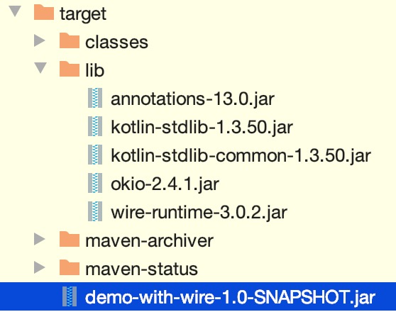

# 关于jar包的操作

## 引入第三方jar包

首先项目要先引入第三方jar包，如`wire-runtime-3.0.2.jar`。

可以通过`maven install`指令把指定的文件安装到本地maven仓库（需要配置环境变量），有三种方式：

1.  `mvn install:install-file -Dfile=<path-to-file> -DgroupId=<group-id> -DartifactId=<artifact-id> -Dversion=<version> -Dpackaging=<packaging>`
	指定jar包、groupid、artifactId和version，maven会自动生成相应的pom.xml文件。
2.  `mvn install:install-file -Dfile=<path-to-file> -DpomFile=<path-to-pomfile>`
	如果jar包是用maven打包生成的，可以直接指定jar包和pom.xml文件。
3.  `mvn install:install-file -Dfile=<path-to-file>`
	如果jar包是用maven打包生成的，maven 2.5版本会自动根据jar包生成pom.xml文件。

这里的需要的jar包只能用第一种方式，引入：

```
mvn install:install-file -Dfile=/Users/shengyuan/Projects/Java/demo-with-wire-2/src/main/resources/lib/wire-runtime-3.0.2.jar -DgroupId=com.squareup.wire -DartifactId=wire-runtime -Dversion=3.0.2 -Dpackaging=jar
```

安装后在`~/.m2/repository`路径下能够看到此jar包。

以上操作成功后，在项目的pom.xml中添加此库：

```xml
<dependencies>
    <dependency>
        <groupId>com.squareup.wire</groupId>
        <artifactId>wire-runtime</artifactId>
        <version>3.0.2</version>
    </dependency>
</dependencies>
```

添加完成后就可以使用此库了。

**其他方式**

网上还有类似添加进项目的lib文件夹里的方式，并在pom文件里添加：

```xml
<dependency>
    <groupId>com.yuewen</groupId>
    <artifactId>lucene</artifactId>
    <version>1.0.0-SNAPSHORT</version>
    <scope>system</scope>
    <systemPath>${project.basedir}/src/main/resources/lib/lucene-1.0.0-SNAPSHORT.jar</systemPath>
</dependency>
```

这种方式有坑，不太推荐，具体做法就不记录了。

## 打包

Maven可以使用mvn package指令对项目进行打包，如果使用`java -jar xxx.jar`执行运行jar文件，会出现"no main manifest attribute, in xxx.jar"（没有设置Main-Class）、ClassNotFoundException（找不到依赖包）等错误。

>   建议用mvn clean package进行打包，mvn clean可以清除之前的缓存。

要想jar包能直接通过`java -jar xxx.jar`运行，需要满足：

1.  在jar包中的META-INF/MANIFEST.MF中指定Main-Class，这样才能确定程序的入口在哪里

2.  要能加载到依赖包

### 方法一：使用maven-jar-plugin和maven-dependency-plugin插件打包

在pom.xml中配置：

```xml
    <build>
        <plugins>
            <!--maven-jar-plugin-->
            <plugin>
                <groupId>org.apache.maven.plugins</groupId>
                <artifactId>maven-jar-plugin</artifactId>
                <version>3.0.2</version>
                <configuration>
                    <archive>
                        <manifest>
                            <addClasspath>true</addClasspath>
                            <classpathPrefix>lib/</classpathPrefix>
                            <mainClass>com.mezzsy.demowithwire.Main</mainClass>
                        </manifest>
                    </archive>
                </configuration>
            </plugin>
          
            <!--maven-dependency-plugin-->
            <plugin>
                <groupId>org.apache.maven.plugins</groupId>
                <artifactId>maven-dependency-plugin</artifactId>
                <version>3.1.1</version>
                <executions>
                    <execution>
                        <id>copy-dependencies</id>
                        <phase>package</phase>
                        <goals>
                            <goal>copy-dependencies</goal>
                        </goals>
                        <configuration>
                            <outputDirectory>${project.build.directory}/lib</outputDirectory>
                        </configuration>
                    </execution>
                </executions>
            </plugin>
        </plugins>
    </build>
```


maven-jar-plugin用于生成META-INF/MANIFEST.MF文件的部分内容，`<mainClass>xxx</mainClass>`指定MANIFEST.MF中的Main-Class，`<addClasspath>true</addClasspath>`会在MANIFEST.MF加上Class-Path项并配置依赖包，`<classpathPrefix>lib/</classpathPrefix>`指定依赖包所在目录。

例如下面是一个通过maven-jar-plugin插件生成的MANIFEST.MF文件片段：


只是生成MANIFEST.MF文件还不够，maven-dependency-plugin插件用于将依赖包拷贝到`<outputDirectory>${project.build.directory}/lib</outputDirectory>`指定的位置，即lib目录下。

配置完成后，通过mvn package指令打包，会在target目录下生成jar包，并将依赖包拷贝到target/lib目录下，目录结构如下：



指定了Main-Class，有了依赖包，那么就可以直接通过java -jar xxx.jar运行jar包。

```
localhost:target shengyuan$ java -jar demo-with-wire-1.0-SNAPSHOT.jar 
```

输出：

```
com.squareup.wire.Wire
```

这里贴一下Main的代码：

```java
public class Main {
    public static void main(String[] args) {
        Main main = new Main();
        System.out.println(main.testWire());
    }

    public String testWire() {
        return Wire.class.getName();
    }
}
```

就是输出Wire的包名，所以上面的jar包输出正确。

这个方式有个缺点，就是需要lib文件夹，jar包本身不包含第三方jar，第三方jar需要外置在lib文件夹中。

>   在target文件夹中运行此jar包成功，但是将此jar包转移位置，发现不能成功，后来发现原因是上面所讲的缺点。

### 方法二：使用maven-assembly-plugin插件打包

在pom.xml中配置：

```xml
<build>
    <plugins>
        <!--maven-assembly-plugin-->
        <plugin>
            <groupId>org.apache.maven.plugins</groupId>
            <artifactId>maven-assembly-plugin</artifactId>
            <version>3.0.0</version>
            <configuration>
                <archive>
                    <manifest>
                        <mainClass>com.mezzsy.demowithwire.Main</mainClass>
                    </manifest>
                </archive>
                <descriptorRefs>
                    <descriptorRef>jar-with-dependencies</descriptorRef>
                </descriptorRefs>
            </configuration>

        </plugin>

    </plugins>
</build>
```

打包方式：

```
mvn package assembly:single
```

打包后会在target目录下生成一个xxx-jar-with-dependencies.jar文件，这个文件不但包含了自己项目中的代码和资源，还包含了所有依赖包的内容。所以可以直接通过java -jar来运行。

此外还可以直接通过mvn package来打包，无需assembly:single，不过需要加上一些配置：

```xml
    <build>
        <plugins>
            <!--maven-assembly-plugin-->
            <plugin>
                <groupId>org.apache.maven.plugins</groupId>
                <artifactId>maven-assembly-plugin</artifactId>
                <version>3.0.0</version>
                <configuration>
                    <archive>
                        <manifest>
                            <mainClass>com.mezzsy.demowithwire.Main</mainClass>
                        </manifest>
                    </archive>
                    <descriptorRefs>
                        <descriptorRef>jar-with-dependencies</descriptorRef>
                    </descriptorRefs>
                </configuration>
              
                <executions>
                    <execution>
                        <id>make-assembly</id>
                        <phase>package</phase>
                        <goals>
                            <goal>single</goal>
                        </goals>
                    </execution>
                </executions>
              
            </plugin>

        </plugins>
    </build>
```

其中`<phase>package</phase>`、`<goal>single</goal>`即表示在执行package打包时，执行assembly:single，所以可以直接使用mvn package打包。

用这种方式打出来的jar包有两个，一个带有jar-with-dependencies后缀，通过jd-gui打开发现，带有后缀的包含了第三方lib，无后缀的jar只有本项目文件不含其他文件。

不过，如果项目中用到Spring Framework，用这种方式打出来的包运行时会出错，使用下面的方法三可以处理。

### 方法三：使用maven-shade-plugin插件打包

在pom.xml中配置：

```xml
<build>
	<plugins>
 
		<plugin>
			<groupId>org.apache.maven.plugins</groupId>
			<artifactId>maven-shade-plugin</artifactId>
			<version>2.4.1</version>
			<executions>
				<execution>
					<phase>package</phase>
					<goals>
						<goal>shade</goal>
					</goals>
					<configuration>
						<transformers>
							<transformer implementation="org.apache.maven.plugins.shade.resource.ManifestResourceTransformer">
								<mainClass>com.mezzsy.demowithwire.Main2</mainClass>
							</transformer>
						</transformers>
					</configuration>
				</execution>
			</executions>
		</plugin>
 
	</plugins>
</build>
```

配置完成后，执行mvn package即可打包。在target目录下会生成两个jar包，注意不是`original-xxx.jar`文件，而是另外一个。和maven-assembly-plugin一样，生成的jar文件包含了所有依赖，所以可以直接运行。

如果项目中用到了Spring Framework，将依赖打到一个jar包中，运行时会出现读取XML schema文件出错。原因是Spring Framework的多个jar包中包含相同的文件spring.handlers和spring.schemas，如果生成一个jar包会互相覆盖。为了避免互相影响，可以使用AppendingTransformer来对文件内容追加合并：

```xml
<build>
	<plugins>
 
		<plugin>
			<groupId>org.apache.maven.plugins</groupId>
			<artifactId>maven-shade-plugin</artifactId>
			<version>2.4.1</version>
			<executions>
				<execution>
					<phase>package</phase>
					<goals>
						<goal>shade</goal>
					</goals>
					<configuration>
						<transformers>
							<transformer implementation="org.apache.maven.plugins.shade.resource.ManifestResourceTransformer">
								<mainClass>com.xxg.Main</mainClass>
							</transformer>
							<transformer implementation="org.apache.maven.plugins.shade.resource.AppendingTransformer">
								<resource>META-INF/spring.handlers</resource>
							</transformer>
							<transformer implementation="org.apache.maven.plugins.shade.resource.AppendingTransformer">
								<resource>META-INF/spring.schemas</resource>
							</transformer>
						</transformers>
					</configuration>
				</execution>
			</executions>
		</plugin>
 
	</plugins>
</build>
```

## 第三方库包名重定向

自己写的jar包可能引入第三方jar包，如果有人调用了我的jar包又调用了另一个人的jar包并且恰好我和另一个人的jar包引用了同一个库，那么会产生冲突，所以需要将第三方jar包重定向，这里用`maven-shade-plugin`进行重定向，使用方法：

```xml
<plugin>
    <groupId>org.apache.maven.plugins</groupId>
    <artifactId>maven-shade-plugin</artifactId>
    <version>3.2.1</version>
    <executions>
        <execution>
            <phase>package</phase>
            <goals>
                <goal>shade</goal>
            </goals>
            <configuration>
                <relocations>
                    <relocation>
                        <pattern>com.squareup.wire</pattern>
                        <shadedPattern>com.dmap.wire</shadedPattern>
                    </relocation>
                    <relocation>
                        <pattern>okio</pattern>
                        <shadedPattern>shaded.okio</shadedPattern>
                    </relocation>
                    <relocation>
                        <pattern>org.intellij.lang.annotations</pattern>
                        <shadedPattern>shaded.org.intellij.lang.annotations</shadedPattern>
                    </relocation>
                    <relocation>
                        <pattern>org.jetbrains.annotations</pattern>
                        <shadedPattern>shaded.org.jetbrains.annotations</shadedPattern>
                    </relocation>
                </relocations>
                <transformers>
                    <transformer
                            implementation="org.apache.maven.plugins.shade.resource.ServicesResourceTransformer"/>
                </transformers>
            </configuration>
        </execution>
    </executions>
</plugin>
```

relocation标签用于重定向包名。

其余标签含义先略过。

这里有个小问题，如果以上文方法二的方式打包，要么包名没有重定向，要么第三方库没了。需要以第三种方式进行打包，因为maven-shade-plugin不仅可以重定向类，也可以打包，具体功能可以见官方文档。

这里贴一下代码：

```xml
    <build>
        <plugins>
            <plugin>
                <groupId>org.apache.maven.plugins</groupId>
                <artifactId>maven-shade-plugin</artifactId>
                <version>3.2.1</version>
                <executions>
                    <execution>
                        <phase>package</phase>
                        <goals>
                            <goal>shade</goal>
                        </goals>
                        <configuration>
                            <relocations>
                                <relocation>
                                    <pattern>com.squareup.wire</pattern>
                                    <shadedPattern>com.dmap.wire</shadedPattern>
                                </relocation>
                                <relocation>
                                    <pattern>okio</pattern>
                                    <shadedPattern>shaded.okio</shadedPattern>
                                </relocation>
                                <relocation>
                                    <pattern>org.intellij.lang.annotations</pattern>
                                    <shadedPattern>shaded.org.intellij.lang.annotations</shadedPattern>
                                </relocation>
                                <relocation>
                                    <pattern>org.jetbrains.annotations</pattern>
                                    <shadedPattern>shaded.org.jetbrains.annotations</shadedPattern>
                                </relocation>
                            </relocations>
                            <transformers>
                                <transformer
                                        implementation="org.apache.maven.plugins.shade.resource.ServicesResourceTransformer"/>
                                <transformer
                                        implementation="org.apache.maven.plugins.shade.resource.ManifestResourceTransformer">
                                    <mainClass>com.mezzsy.demowithwire.Main2</mainClass>
                                </transformer>
                            </transformers>
                        </configuration>
                    </execution>
                </executions>
            </plugin>
        </plugins>
    </build>
```

## 对已有的Jar包进行重打包

上面的包名重定向的打包方式是通过源代码进行打包的，如果只有jar包该怎么办重命名包名并打包？

Google有个工具，jarjar.jar，https://code.google.com/archive/p/jarjar/downloads，可以解决这个问题。

通过`java -jar jarjar-1.4.jar help`可以查看使用说明，英文看不懂可以看别人翻译的：https://www.cnblogs.com/yejiurui/p/4283505.html

**速记**

rule.txt

```
rule com.squareup.wire.** com.dmap.wire.@1
```

备注

```
pattern为要对比的字串，可以使用「*」和「**」來表示任意的Package名稱。「*」可以代表一层的Package，「**」可以代表多层的Package。

result為要取代成的字串，可以使用「@1」、「@2」这类的符号表示要使用第几个pattern的「*」或「**」所代表的字串。

如果要将Jar包內的「cn.domob」名称全都替換成「com.google」，可以编写以下的rulesFile：
rule cn.domob.** com.google.@1
```

然后执行命令：

```
java -jar jarjar-1.4.jar process rule.txt wire-runtime-1.6.1.jar my-wire-runtime-1.6.1.jar
```

包名替换成功。

# 关于aar包的操作

记录jar包的操作，顺便记录一下aar包的操作。

jar包是 Java 的一种文档格式，只包含了class文件与清单文件 ，不包含资源文件，如图片等所有res中的文件。

aar是Android库项目的二进制归档文件，包含所有资源，class以及res资源文件