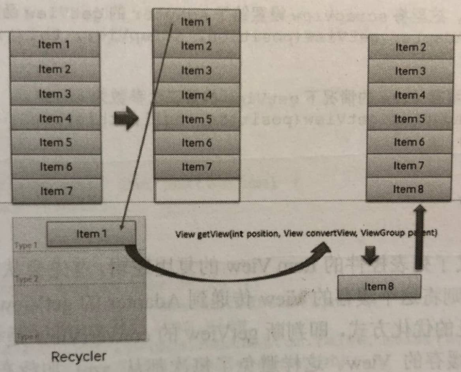

# 参考

《Android源码设计模式解析与实战》

学了适配器模式后，发现写的demo太简单，而在Android中ListView是一个常见的控件并且具有适配器模式，所以分析一下源码顺便深入理解适配器模式。

Adapter是将Item View（细一点说，是用户传入的数据）转为View的一个中间类。

在ListView中并没有Adapter的相关变量，而在ListView的父类AbsListView中。

# AbsListView

```java
public abstract class AbsListView extends AdapterView<ListAdapter> implements TextWatcher,ViewTreeObserver.OnGlobalLayoutListener, Filter.FilterListener,ViewTreeObserver.OnTouchModeChangeListener,
        RemoteViewsAdapter.RemoteAdapterConnectionCallback {
            
    //Adapter成员变量
    ListAdapter mAdapter
        
    /**其余代码略**/

    @Override
    protected void onAttachedToWindow() {
        super.onAttachedToWindow();
		//...
        //给适配器注册一个观察者。
        if (mAdapter != null && mDataSetObserver == null) {
            mDataSetObserver = new AdapterDataSetObserver();
            mAdapter.registerDataSetObserver(mDataSetObserver);

            mDataChanged = true;
            mOldItemCount = mItemCount;
            //获取Item的数量
            mItemCount = mAdapter.getCount();
        }
    }
            
    //子类需要覆写layoutChildren()来布局child view，也就是item view
    @Override
    protected void onLayout(boolean changed, int l, int t, int r, int b) {
        super.onLayout(changed, l, t, r, b);

        mInLayout = true;

        final int childCount = getChildCount();
        if (changed) {
            for (int i = 0; i < childCount; i++) {
                getChildAt(i).forceLayout();
            }
            mRecycler.markChildrenDirty();
        }

        layoutChildren();

        mOverscrollMax = (b - t) / OVERSCROLL_LIMIT_DIVISOR;

        if (mFastScroll != null) {
            mFastScroll.onItemCountChanged(getChildCount(), mItemCount);
        }
        mInLayout = false;
    }
}
```

AbsListView定义了集合视图的逻辑框架，比如Adapter模式的应用、复用Item View的逻辑、布局子视图的逻辑等，子类只需要覆写特定的方法即可实现集合视图的功能。

首先在AbsListView类型的View中添加窗口(onAttachedToWindow方法)时会调用Adapter中的getCount方法获取到元素的个数，然后在onLayout方法中调用layoutChilden方法对所有子元素进行布局。AbsListView中并没有实现layoutChilden这个方法，具体的实现在子类中。

# ListView

```java
public class ListView extends AbsListView {
    
    //ListView中layoutChildren的具体逻辑
	protected void layoutChildren() {
      	//...
        try {
            super.layoutChildren();
            invalidate();
			//...
            switch (mLayoutMode) {
            //...
            case LAYOUT_FORCE_BOTTOM:
                //此处调用fillUp方法
                sel = fillUp(mItemCount - 1, childrenBottom);
                adjustViewsUpOrDown();
                break;
            case LAYOUT_FORCE_TOP:
                mFirstPosition = 0;
                //此处调用filldown方法
                sel = fillFromTop(childrenTop);
                adjustViewsUpOrDown();
                break;
            //...
            }
		//...
    }
        
    //从下到上填充item view
    private View fillUp(int pos, int nextBottom) {
        View selectedView = null;

        int end = 0;
        if ((mGroupFlags & CLIP_TO_PADDING_MASK) == CLIP_TO_PADDING_MASK) {
            end = mListPadding.top;
        }

        while (nextBottom > end && pos >= 0) {
            // is this the selected item?
            boolean selected = pos == mSelectedPosition;
            View child = makeAndAddView(pos, nextBottom, false, mListPadding.left, selected);
            nextBottom = child.getTop() - mDividerHeight;
            if (selected) {
                selectedView = child;
            }
            pos--;
        }

        mFirstPosition = pos + 1;
        setVisibleRangeHint(mFirstPosition, mFirstPosition + getChildCount() - 1);
        return selectedView;
    }
        
    //从上到下填充item view
    private View fillDown(int pos, int nextTop) {
        View selectedView = null;

        int end = (mBottom - mTop);
        if ((mGroupFlags & CLIP_TO_PADDING_MASK) == CLIP_TO_PADDING_MASK) {
            end -= mListPadding.bottom;
        }

        while (nextTop < end && pos < mItemCount) {
            // is this the selected item?
            boolean selected = pos == mSelectedPosition;
            View child = makeAndAddView(pos, nextTop, true, mListPadding.left, selected);

            nextTop = child.getBottom() + mDividerHeight;
            if (selected) {
                selectedView = child;
            }
            pos++;
        }

        setVisibleRangeHint(mFirstPosition, mFirstPosition + getChildCount() - 1);
        return selectedView;
    }
}
```

在每种布局方式的方法中都会从makeAndAddView方法获取一个View，这个View就是ListView的每项的视图，这里有一个pos参数，也就是对应这个View是ListView中的第几项。

```java
private View makeAndAddView(int position, int y, boolean flow, int childrenLeft,
        boolean selected) {
    if (!mDataChanged) {
        // Try to use an existing view for this position.
        final View activeView = mRecycler.getActiveView(position);
        if (activeView != null) {
            // Found it. We're reusing an existing child, so it just needs
            // to be positioned like a scrap view.
            setupChild(activeView, position, y, flow, childrenLeft, selected, true);
            return activeView;
        }
    }

    // Make a new view for this position, or convert an unused view if
    // possible.
    final View child = obtainView(position, mIsScrap);

    // This needs to be positioned and measured.
    setupChild(child, position, y, flow, childrenLeft, selected, mIsScrap[0]);

    return child;
}
```

在makeAndAddView函数中主要分为两个步骤，第一是根据position获取一个item View，然后将这个View布局到特定的位置。获取一个item View调用的是obatinView函数，这个函数在AbsListView中。核心代码如下。

```java
View obtainView(int position, boolean[] outMetadata) {
    outMetadata[0] = false;
	//从缓存的Item View中获取，ListView的复用机制就在这
    final View scrapView = mRecycler.getScrapView(position);
    //将scrapView设置给了Adapter的getView方法，有缓存就调用缓存，没有就设置null。
    final View child = mAdapter.getView(position, scrapView, this);
    return child;
}
```

obatinView方法定义了列表控件的Item View的复用逻辑，首先会从RecyclerBin中获取一个缓存的View，如果有缓存则将这个缓存的View传递到Adapter的getView第二个参数中，这也就是我们对Adapter的最常见的优化方式，即判断getView的convertView是否为空，如果为空则从xml中创建视图，否则使用缓存的View。 这样避免了每次都从xml加载布局的消耗，能够显著提升ListView等列表控件的效率。

通过这种缓存机制，即使有成千上万的数据项，ListView也能够流畅运行，因此，只有填满屏所需的Item View存在内存中。ListView根据Adapter设置的数据项数量循环调用getView方法获取视图，第一次加载填满屏幕的数据项时getView的第二个参数convertView都为空，此时每次都需要从xml中加载布局文件，填充数据之后返回给ListView。当整屏的数据项加载完毕之后用户向下滚动屏幕，此时item1滚出屏幕，并且一个新的项目从屏幕低端上来时，ListView再请求一个视图，此时item1被缓存起来，在下一项数据加载时传递给getView的第二个参数convertView，因此，convertView此时不是空值，它的值是item1。此时只需设定新的数据然后返回convertView，这样就避免了每次都从xml加载、初始化视图，减少了时间、性能上的消耗。原理如图所示。



了解了它的工作原理后，就可以重复利用ListView的Item View，只要convertView不为空就直接使用，改变它绑定的数据就行了。当然，由于视图被缓存了，视图中的数据也会被缓存，因此，你需要在每次获取到了Item view时对每个数据项重新赋值，否则会出现数据错误的现象。

# 总结

ListView等集合控件通过Adapter来获取Item View的数量、布局、数据等，在这里最为重要的就是getView函数，这个方法返回一个View类型的对象，也就是Item View。由于它返回的是一个View抽象，而千变万化的UI视图都是View的子类，通过依赖抽象这个简单的原则和Adaper模式就将Item View的变化隔离了，保证了AbsListView类族的高度可定制化。在获取了View之后，将这些View通过特定的布局方式设置到对应的位置上，再加上ItemView的复用机制，整个ListView就运转起来了。

当然，这里的Adapter并不是经典的适配器模式，却是对象适配器模式的优秀示例，也很好地体现了面向对象的一些基本原则。这里的Target角色就是View，Adapter角色就是将ItemView输出为View抽象的角色，Adaptee就是需要被处理的ItemView。通过增加Adapter一层来将ItemView的操作抽象起来，ListView 等集合视图通过Adapter对象获得Item的个数、数据、Item View等，从而达到适配各种数据、各种Item视图的效果。因为Item View和数据类型千变万化，Android的架构师们将这些变化的部分交给用户来处理，通过getCount、getItem、getView等几个方法抽象出来，也就是将Item View的构造过程交给用户来处理，灵活地运用了适配器模式，达到了无限适配、拥抱变化的目的。