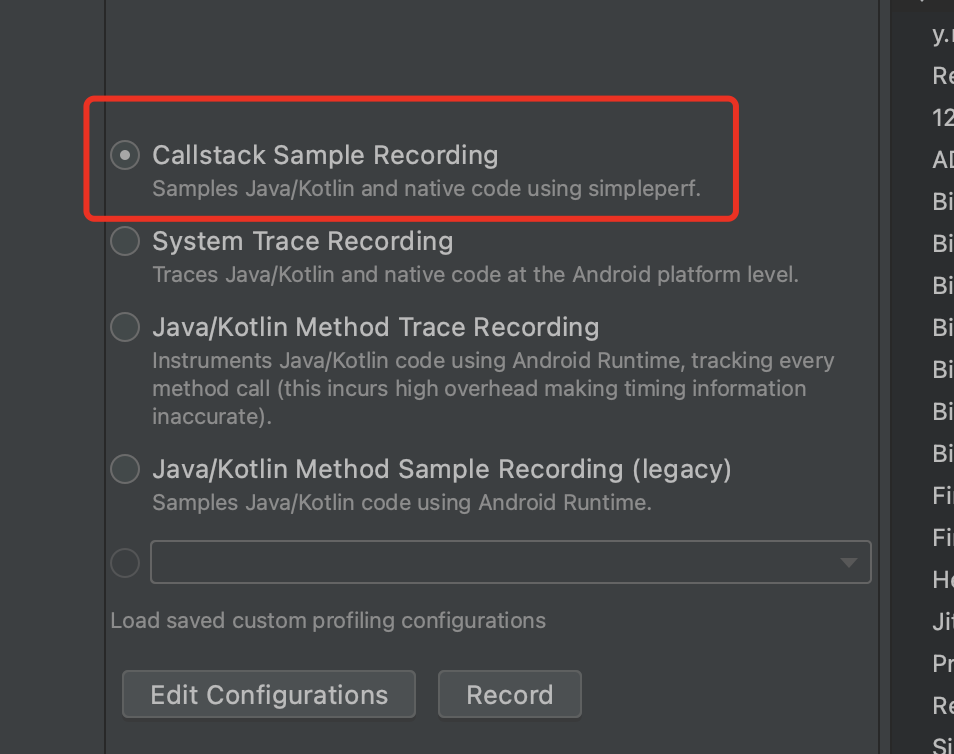
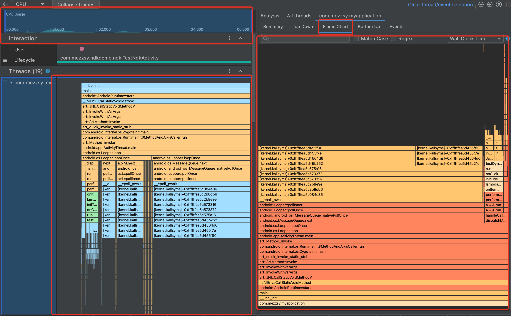
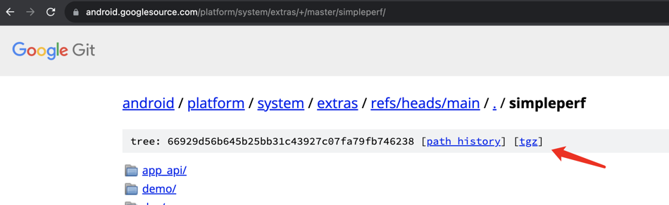
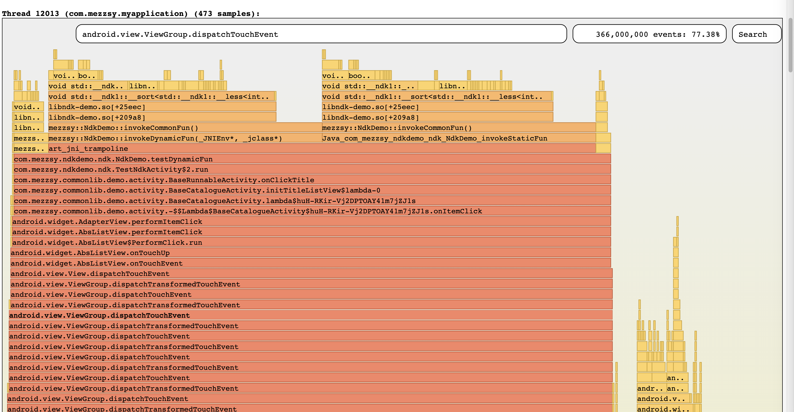

# Simpleperf

[官网介绍](https://developer.android.com/ndk/guides/simpleperf?hl=zh-cn)

## 可视化操作



选择`Callstack Sample Recording`点击 Record，交互完成时点击 Stop。

### 分析堆栈



1.   通过`w/s`键缩小/放大时间轴，通过`a/d`键左/右移动时间轴。
2.   左边是某个线程实时的堆栈，用于寻找单次耗时函数。
3.   右边是整体的火焰图，用于分析整体耗时情况。

## python脚本

>   官方文档：https://android.googlesource.com/platform/system/extras/+/master/simpleperf/doc/README.md
>
>   源码：https://android.googlesource.com/platform/system/extras/+/master/simpleperf/
>   

### dump堆栈5s

```
python /Users/mezzsy/Projects/Android/SimplePerf/scripts/app_profiler.py -p "com.mezzsy.myapplication" -r "-e task-clock:u -f 1000 -g --duration 5"
```

### 导出

```
adb pull /data/local/tmp/perf.data ~/Downloads/
```

### 生成火焰图

--symfs表示so的位置，比如此时so放在了~/Downloads

```
python /Users/mezzsy/Projects/Android/SimplePerf/scripts/inferno/inferno.py -sc --record_file ~/Downloads/perf.data --symfs ~/Downloads
```



## adb命令行

使用demo略。

# Systrace

## python脚本

