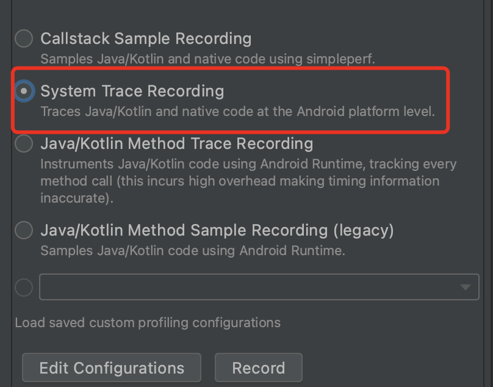
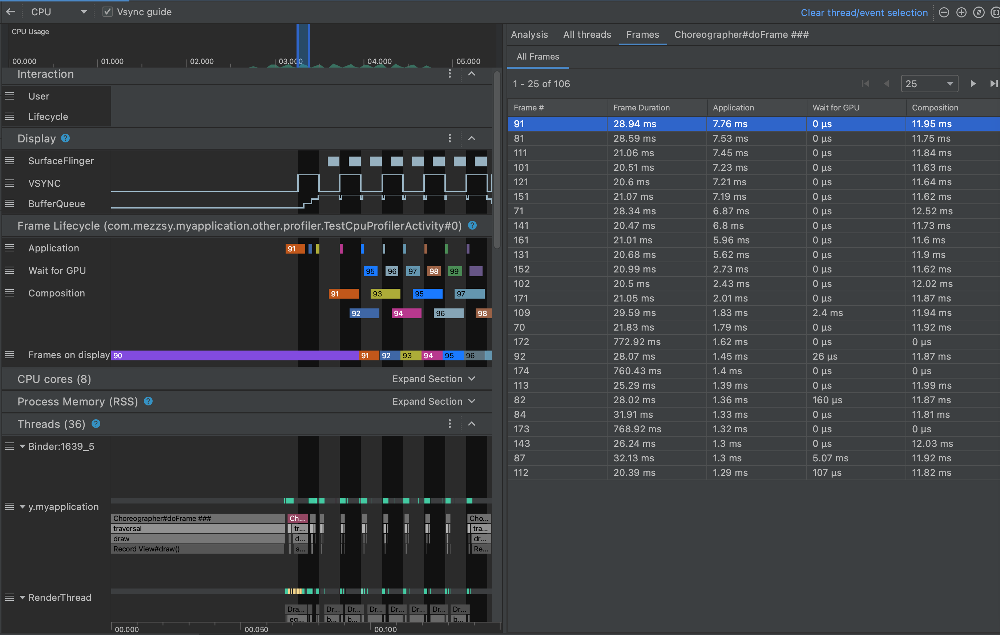

# Simpleperf

[官网介绍](https://developer.android.com/ndk/guides/simpleperf?hl=zh-cn)

## 可视化操作


选择`Callstack Sample Recording`点击 Record，交互完成时点击 Stop。

### 分析堆栈


1.   通过`w/s`键缩小/放大时间轴，通过`a/d`键左/右移动时间轴。
2.   左边是某个线程实时的堆栈，用于寻找单次耗时函数。
3.   右边是整体的火焰图，用于分析整体耗时情况。

## python脚本

>   官方文档：https://android.googlesource.com/platform/system/extras/+/master/simpleperf/doc/README.md
>
>   源码：https://android.googlesource.com/platform/system/extras/+/master/simpleperf/
>   

### dump堆栈5s

```
python /Users/mezzsy/Projects/Android/SimplePerf/scripts/app_profiler.py -p "com.mezzsy.myapplication" -r "-e task-clock:u -f 1000 -g --duration 5"
```

### 导出

```
adb pull /data/local/tmp/perf.data ~/Downloads/
```

### 生成火焰图

--symfs表示so的位置，比如此时so放在了~/Downloads

```
python /Users/mezzsy/Projects/Android/SimplePerf/scripts/inferno/inferno.py -sc --record_file ~/Downloads/perf.data --symfs ~/Downloads
```


## adb命令行

使用demo略。

# Systrace

[浏览 Systrace 报告](https://developer.android.com/topic/performance/tracing/navigate-report?hl=zh-cn)

## python脚本

[在命令行上捕获系统跟踪记录](https://developer.android.com/topic/performance/tracing/command-line?hl=zh-cn)

使用demo略，因为我的sdk里没有`systrace.py`。

## 可视化操作



选择`System Trace Recording`点击 Record，交互完成时点击 Stop。



**Frame Lifecycle** 部分包含层名称和四个轨迹。每个轨迹分别代表帧呈现流水线中的一个阶段。**Frame Lifecycle** 元素如下：

1.  **Frame Lifecycle (层名称)**：该部分的标题包含用括号括起来的层名称。层是单个组合单元。
2.  **Application**：此轨迹显示从缓冲区被应用移出队列到重新回到队列的时间。这通常对应于 `RenderThread` 中的轨迹事件。
3.  **Wait for GPU**：此轨迹显示 GPU 拥有相应缓冲区的时长。该时长指的是，从相应缓冲区的内容被发送至 GPU，到 GPU 利用相应缓冲区的内容完成其工作，期间所经历的时间。**这并不表示 GPU 在此期间仅使用相应缓冲区的内容工作。**如需详细了解给定时间内 GPU 执行的工作，您可能需要使用 [Android GPU 检查器](https://developer.android.com/agi?hl=zh-cn)。
4.  **Composition**：此轨迹显示，从 SurfaceFlinger 占有相应缓冲区并发送相应缓冲区的内容以进行合成，到相应缓冲区的内容被发送到显示屏，期间所经历的时间。
5.  **Frames on display**：此轨迹显示相应帧在屏幕上的时长。

分析：

1.   按 **Application** 列对 **All Frames** 表进行降序排序，使耗时最长的帧首先显示。
2.   找到运行时间最长的帧，然后选择表中的一行。这将在左侧的时间轴视图中放大所选的帧。
3.   在 **Frame Lifecycle** 和 **Threads** 部分查找相关线程。

## 自定义Trace

### Java

如需检测 Java 代码，请使用 Trace 类。

```java
public void onBindViewHolder(MyViewHolder holder, int position) {
    Trace.beginSection("MyAdapter.onBindViewHolder");
    try {
        try {
            Trace.beginSection("MyAdapter.queryDatabase");
            RowItem rowItem = queryDatabase(position);
            dataset.add(rowItem);
        } finally {
            Trace.endSection();
        }
        holder.bind(dataset.get(position));
    } finally {
        Trace.endSection();
    }
}
```

通过Trace的beginSection和endSection来追踪。

### c++

https://developer.android.com/topic/performance/tracing/custom-events-native?hl=zh-cn

