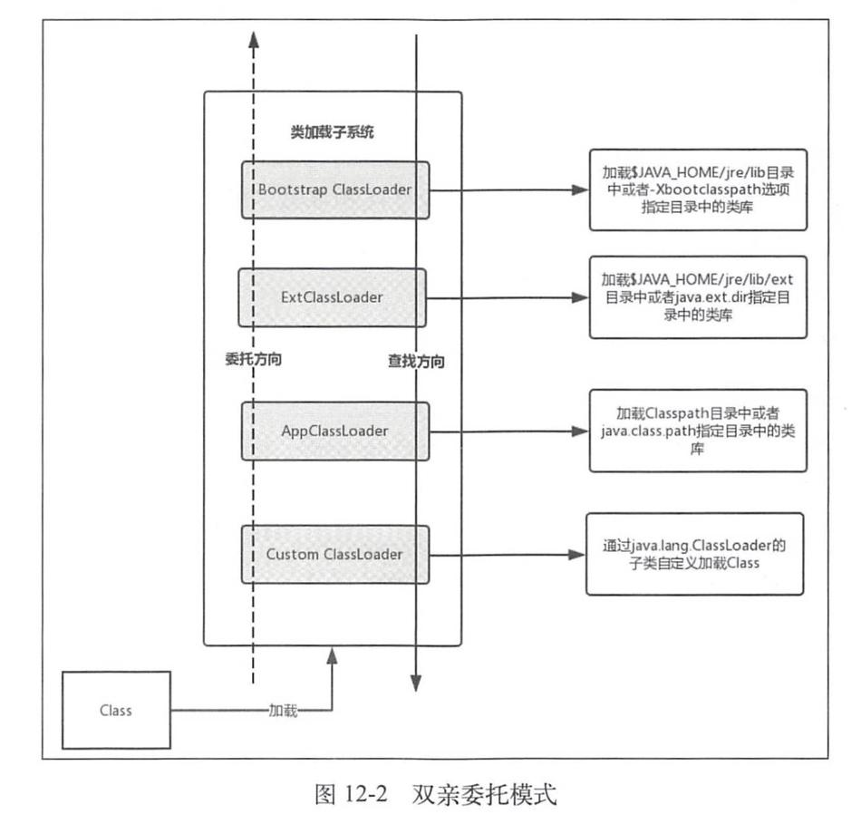

> 本文讨论一段代码如何从源码变成 DEX，并最终成为 ART 中可以执行的类。

# 完整链路

Android 类从源码到运行时，大致经历下面几个阶段：

```text
Kotlin / Java 源码
        ↓ Kotlin 编译器 / javac
JVM 字节码（.class）
        ↓ D8，或者开启压缩时由 R8 统一处理
DEX 字节码（classes.dex、classes2.dex...）
        ↓ Android Gradle Plugin 打包
APK，或者 AAB 中各模块的 DEX
        ↓ 安装
Base APK / Split APK 被 PackageManager 登记
        ↓ 应用进程启动
系统根据 APK 路径创建应用 ClassLoader
        ↓ 某个类第一次被使用
ClassLoader 查找 DEX → ART 定义、验证、链接、初始化类
        ↓ 方法被执行
解释执行，或者运行 AOT / JIT 编译后的机器码
```

# 从源码到 JVM 字节码

Android 项目中的 Java 和 Kotlin 源码会先被各自的编译器编译成 JVM `.class` 文件，其中包含类结构、JVM 指令和相关元数据。这些 `.class` 是后续 D8 或 R8 生成 DEX 的输入，并不会直接由 Android 运行时执行。

源码文件与 `.class` 不是一一对应的。例如，Kotlin 编译器可能为 lambda、协程或匿名对象生成额外的 `.class`。

# 从 class 到 DEX

## DEX 是什么

DEX 是 Dalvik Executable 的缩写。它不是简单地把多个 `.class` 文件拼接到一起，而是重新组织类定义、字符串、类型、字段和方法等数据，使多个类可以共享相同的数据表。

DEX 文件主要包含：

- 字符串、类型、原型、字段和方法 ID 表；
- 每个类的定义及其继承关系；
- 方法对应的 DEX 指令；
- 注解、调试信息及其他元数据。

具体二进制结构可以参考 Android 开源项目的 [DEX 格式说明](https://source.android.com/docs/core/runtime/dex-format)。理解类加载时不需要记住所有字段，只要知道一个 DEX 可以保存大量类，而 ClassLoader 最终会按类的二进制名称在这些 DEX 中查找定义。

## Desugaring

源码可能使用了低版本 Android 不直接支持的 Java 语言特性或 Java API。DEX 转换期间会进行 desugaring，将这些用法改写成目标 Android 版本能够执行的形式。

例如，某些语言特性可以被改写为兼容的字节码结构；启用 core library desugaring 后，部分较新的 Java API 调用也可以被改写到随应用打包的兼容实现中。

Desugaring 改变的是最终代码形态，并不会改变业务源码表达的主要语义。

## D8 的职责

D8 接收项目及依赖中的 JVM 字节码，完成 desugaring，并生成 DEX 字节码。Android Gradle Plugin 会替应用组织这些输入，通常不需要直接调用 D8。[D8 官方说明](https://developer.android.com/tools/d8)

概念上可以表示为：

```text
.class / JAR 中的 .class
          ↓ D8
classes.dex、classes2.dex...
```

Debug 构建通常更重视构建速度和调试信息，Release 构建则可能额外启用完整的代码压缩和优化。

## R8 的职责

开启代码压缩后，R8 会分析整个程序，并完成多项工作：

- Shrinking：删除被判断为不可达的类、字段和方法；
- Optimization：内联或重写部分代码；
- Obfuscation：缩短类名、方法名和字段名；
- Dexing：生成最终 DEX。

因此，开启 R8 后不应机械地理解成“先生成一套最终 DEX，再由另一个完全独立的步骤压缩”。现代构建工具可以将分析、优化和 DEX 生成整合起来。[R8 优化说明](https://developer.android.com/topic/performance/app-optimization/enable-app-optimization)

R8 会直接影响运行时类查找：

- 类被删除后，运行时自然不可能找到它；
- 类被混淆后，原始字符串类名可能不再有效；
- 反射、JNI、序列化和框架回调等隐式入口需要正确的 keep 规则。

## 为什么会有多个 DEX

DEX 不会在每条指令中重复保存完整的方法名、类型和参数，而是把被引用的方法集中记录在 `method_ids` 等表中，指令只保存对应的索引。这样可以减小指令体积并提高查找效率，但索引位数是有限的。

方法引用索引使用 16 位表示，取值范围为 `0x0000`～`0xffff`，因此单个 DEX 最多只能容纳 65,536 个方法引用：

```text
16 位索引 → 2¹⁶ = 65,536 个可用编号
```

这里限制的是方法引用数，不只是应用自己声明的方法数，还包括代码引用的依赖库方法和 Android Framework 方法。字段等其他索引也存在类似限制。当一个 DEX 无法容纳全部引用时，构建工具就会把代码拆分到多个具有独立索引表的 DEX 中：

```text
classes.dex
classes2.dex
classes3.dex
...
```

这称为 MultiDex。Android 5.0 及以上的 ART 原生支持从 APK 加载多个 DEX；更老的系统需要 AndroidX MultiDex 在运行时扩展类路径。[MultiDex 官方说明](https://developer.android.com/build/multidex)

“一个 APK 只有一个 DEX”只适用于规模较小或被有效压缩的应用，不是 Android 打包的普遍规则。

# DEX 如何进入 APK 与 AAB

## APK 中的 DEX

构建普通 APK 时，DEX 通常位于 APK 根目录：

```text
app.apk
├── AndroidManifest.xml
├── classes.dex
├── classes2.dex
├── resources.arsc
├── res/
└── lib/
```

APK 是设备可以安装和执行的格式。ClassLoader 可以把 APK 本身作为代码路径，不需要开发者先手动把 `classes.dex` 解压到某个固定目录。

## AAB 中的 DEX

AAB 是发布格式，不能直接安装。它按照 Base、Dynamic Feature 等模块保存编译后的代码和资源；每个模块的 DEX 位于该模块自己的 `dex/` 目录中。应用商店再根据设备和交付条件，从 AAB 生成 Base APK、Feature APK 与配置 APK。[Android App Bundle 格式](https://developer.android.com/guide/app-bundle/app-bundle-format)

```text
app.aab
├── base/dex/classes.dex
└── feature_checkout/dex/classes.dex

Google Play 生成后：

base-master.apk              → Base DEX
feature_checkout-master.apk  → Feature DEX
```

因此在模块化应用中，“这个类最终属于哪个模块”会决定其 DEX 被放入哪个 APK，也会决定设备未安装对应 split 时能否找到该类。

# 安装与 ART 编译产物

## PackageManager 登记 APK 路径

安装 APK 后，PackageManager 会校验并登记应用及其代码路径。对包含 split 的应用，运行时可以从 `ApplicationInfo` 获得：

- `sourceDir`：Base APK 路径；
- `splitNames`：已安装 split 的名称；
- `splitSourceDirs`：已安装 split 的 APK 路径。

这些路径是后续建立应用 ClassLoader 的输入。Base 与 split 虽然是多个文件，但平台可以把它们作为同一个已安装应用处理。[ApplicationInfo](https://developer.android.com/reference/android/content/pm/ApplicationInfo)

## DEX 优化不等于类加载

安装期间或安装后，ART 可能验证 DEX，并通过 `dex2oat`、后台编译任务和 profile 生成优化产物。Android 7.0 以后通常综合使用：

> 见 [03 虚拟机.md](03 虚拟机.md) 

- 解释执行；
- JIT，即运行时即时编译；
- AOT，即运行前编译；
- 基于 profile 的引导优化。

不同系统版本、设备厂商和编译策略产生的 `.vdex`、`.odex`、`.art` 等文件并不完全一致，不能把它们当作稳定的应用接口。[ART 执行与编译模式](https://source.android.com/docs/core/runtime/configure)

需要区分两件事：

```text
类加载：根据类名找到定义，并在 ART 中形成 Class 对象
方法编译：把方法的 DEX 指令转换成可执行机器码
```

某个方法可以已经被 AOT 编译，但对应类仍要经过运行时解析；某个类也可以已经加载，而其中的方法仍通过解释器执行，之后才被 JIT 编译。

# 应用进程如何建立类路径

## Zygote 与框架类

Android 应用进程通常由 Zygote fork 而来。Zygote 已经加载了一批系统框架类，因此应用进程可以共享这些只读内存页，减少启动成本。

框架类位于 boot class path，由引导类加载体系负责。应用自己的类不在 boot class path 中，而是由应用 ClassLoader 加载。常见关系可以简化为：

```text
BootClassLoader
      ↑ parent
应用 PathClassLoader
```

这表示应用 ClassLoader 遇到 `java.lang.String`、`android.app.Activity` 等类型时，会优先委托给能够访问系统类的父加载器，而不是从应用 DEX 中定义同名类型。

## 系统收集 Base 与 split 路径

应用启动时，framework 中的 `LoadedApk` 根据 `ApplicationInfo.sourceDir` 与 `splitSourceDirs` 组织代码路径，默认顺序是 Base 在前、split 在后。随后 `ApplicationLoaders` 创建或复用应用 ClassLoader。[LoadedApk 源码](https://android.googlesource.com/platform/frameworks/base/+/refs/heads/main/core/java/android/app/LoadedApk.java)

```text
ApplicationInfo
├── sourceDir = /data/app/.../base.apk
└── splitSourceDirs = [.../split_feature.apk, ...]
             ↓
LoadedApk.makePaths()
             ↓
ApplicationLoaders
             ↓
PathClassLoader
```

`Context.getClassLoader()` 最终返回的就是能够加载该 Context 对应包代码的 ClassLoader。

## 默认模式与 isolated split

默认情况下，Base APK 和普通 split 的代码路径通常进入同一个应用 `PathClassLoader`，并不是每个 APK 创建一个 ClassLoader。

isolated split 是 Android 8.0（API 26）引入的 split 隔离加载模式。在 Base APK 的 `<manifest>` 中设置 `android:isolatedSplits="true"` 后，split 的代码和资源不会再自动加入 Base Context；framework 会根据依赖关系，为含代码的 feature split 创建对应的 ClassLoader 和 Context。

此时，split Context 只能访问 Base、自身及其依赖 split 的代码和资源，不能直接访问无依赖关系的其他 split。需要主动获取某个 split 的环境时，可以调用 `Context.createContextForSplit(splitName)`。

这种隔离只限制代码和资源的查找范围，不会改变应用的进程、UID 或权限。它也不是 Dynamic Feature 的默认行为，不能与 `isolatedProcess` 混为一谈。

### 应用场景

isolated split 主要适用于模块较多、依赖关系明确的大型应用：一方面可以限制 Base 和各 feature split 只能访问声明的依赖，避免无关模块产生隐式耦合；另一方面可以通过独立 Context 按需加载已安装 split 的代码和资源，避免全部加入 Base 的查找范围。

普通 Dynamic Feature 通常使用默认模式即可。由于 isolated split 不提供进程或权限隔离，因此不适合用来运行不可信插件。

## 常见 Android ClassLoader

| ClassLoader | 主要用途 |
| --- | --- |
| `BootClassLoader` | 加载 boot class path 中的系统核心类，属于运行时内部实现 |
| `PathClassLoader` | Android 默认用来加载应用 APK、split 和系统库代码 |
| `DexClassLoader` | 从包含 DEX 的 APK、JAR 或 DEX 路径创建额外加载器 |
| `InMemoryDexClassLoader` | 从内存中的 DEX `ByteBuffer` 加载代码，API 26 引入 |
| `DelegateLastClassLoader` | 采用 delegate-last 查找策略的特殊加载器 |

`PathClassLoader` 和 `DexClassLoader` 都继承 `BaseDexClassLoader`。现代 Android 中不应再简单地把二者解释成“已安装 APK”和“未安装 APK”的绝对区别；它们的公开构造方式和适用场景不同，但底层都围绕 DEX 路径工作。尤其是 `optimizedDirectory` 参数从 API 26 起已经废弃且不起作用。[BaseDexClassLoader 源码](https://android.googlesource.com/platform/libcore/+/refs/heads/main/dalvik/src/main/java/dalvik/system/BaseDexClassLoader.java)

# ClassLoader 内部如何表示 DEX

## 🌟🌟🌟整体介绍

1. loadClass加载应用类
2. 一般基于双亲委托模式最终由 PathClassLoader（继承 BaseDexClassLoader） 加载。
3. BaseDexClassLoader的pathList（DexPathList）负责维护和查找 DEX、资源及 Native Library。
4. DexPathList通过有序数组 `dexElements` 保存各个 APK、JAR 或 DEX 容器，查找类时按数组顺序依次遍历。
5. 每个 `Element` 内部通常关联一个 `DexFile`。`DexFile` 表示 ART 已打开的 DEX 文件，负责根据类的完整二进制名查找并交由 ART 定义类。

## BaseDexClassLoader

应用 `PathClassLoader` 继承自 `BaseDexClassLoader`。后者保存核心字段 `pathList`：

```text
PathClassLoader
└── BaseDexClassLoader
    └── pathList: DexPathList
```

`BaseDexClassLoader.findClass()` 自己不解析 DEX，而是把查找交给 `pathList.findClass()`。

## DexPathList 与 dexElements

`DexPathList` 把每个 DEX、APK 或含 DEX 的容器表示成一个 `Element`，并保存在有序的 `dexElements` 数组中：

```text
DexPathList
└── dexElements: Element[]
    ├── Element(Base APK → DexFile)
    ├── Element(classes2.dex → DexFile)
    └── Element(Feature Split APK → DexFile)
```

这里的 `Element` 不是一个类，而是一个代码容器。一个 Element 对应的 `DexFile` 中可以包含大量类。

`DexPathList.findClass()` 会按数组顺序遍历 Element，并返回最先找到的类。AOSP 源码明确把它描述为“在最早列出的 path element 中命中”。[DexPathList 源码](https://android.googlesource.com/platform/libcore/+/refs/heads/main/dalvik/src/main/java/dalvik/system/DexPathList.java)

这会产生一个重要结果：如果不同 DEX 中存在相同二进制名称的类，排在前面的 Element 优先。但已经定义过的类还会更早被 `findLoadedClass()` 命中，所以仅修改 Element 顺序也无法替换当前 ClassLoader 已经加载的类。

## DexFile

Element 内部的 `DexFile` 表示 ART 已打开的 DEX。查找命中后，调用链可以概括为：

```text
BaseDexClassLoader.findClass(name)
        ↓
DexPathList.findClass(name)
        ↓ 遍历 dexElements
Element.findClass(name)
        ↓
DexFile.loadClassBinaryName(name, definingClassLoader)
        ↓
ART native runtime 定义类
```

最终定义类的是 ART 的 native 实现，Java 层的 ClassLoader、DexPathList 和 DexFile 主要负责维护路径、执行委派和把查找请求传给运行时。[DexFile 源码](https://android.googlesource.com/platform/libcore/+/refs/heads/main/dalvik/src/main/java/dalvik/system/DexFile.java)

# 一个类在运行时如何被加载

## 什么操作会触发类加载

常见触发点包括：

- 创建对象；
- 调用某个尚未加载类的静态方法；
- 访问某些静态字段；
- framework 根据 Manifest 中的类名创建 Activity、Service、Provider 或 Application；
- `Class.forName()` 或其他反射调用；
- 解析另一个类的字段、方法签名或父类时需要该类型。

编译期能解析某个类型，只说明编译器当时能在依赖中找到它；运行时是否能加载，还要看目标类是否保留在最终 DEX 中，以及对应 DEX 是否位于当前 ClassLoader 的查找范围。

## loadClass 的双亲委派

`ClassLoader.loadClass(name)` 的默认查找过程可以概括为：

1. 调用 `findLoadedClass()`，检查该 ClassLoader 是否已经加载过目标类；
2. 如果没有，委托 parent 加载；
3. parent 找不到时，再调用当前加载器的 `findClass()`；
4. 仍然找不到则抛出 `ClassNotFoundException`。

```text
应用请求 com.example.User
        ↓
应用 PathClassLoader 是否已加载？
        ↓ 否
委托父加载器查找
        ↓ 找不到应用类
应用 PathClassLoader.findClass()
        ↓
遍历自己的 dexElements
```

这通常称为 parent-first 或双亲委派。父子关系由 ClassLoader 构造时保存的 `parent` 引用形成，不是 Java 类继承关系。[ClassLoader API](https://developer.android.com/reference/java/lang/ClassLoader)

Android 的共享 Java 库和 `DelegateLastClassLoader` 等场景会对查找顺序进行扩展，因此“双亲委派”是理解普通应用加载路径的主干模型，而不是所有 Android ClassLoader 的唯一策略。

### 双亲委托模式

类加载器查找Class所采用的是双亲委托模式，所谓双亲委托模式就是首先判断该Class是否已经加载，如果没有则不是自身去查找而是委托给父加载器进行查找，这样依次进行递归，直到委托到最顶层的Bootstrap ClassLoader，如果Bootstrap ClassLoader找到了该Class，就会直接返回，如果没找到，则继续依次向下查找，如果还没找到则最后会交由自身去查找。



类加载子系统用来查找和加载Class文件到Java虚拟机中，假设要加载一个位于D盘的Class文件，这时系统所提供的类加载器不能满足条件，这时就需要自定义类加载器继承自`java.lang.ClassLoader`，并复写它的findClass方法。加载D盘的Class文件步骤如下：

1.  自定义类加载器首先从缓存中查找Class文件是否已经加载，如果已经加载就返回该Class，如果没加载则委托给父加载器也就是AppClassLoader。
2.  按照图中虚线的方向递归步骤1。
3.  一直委托到Bootstrap ClassLoader，如果Bootstrap ClassLoader查找缓存也没有加载Class文件，则在`$JAVA_HOME/jre/lib`目录中或者`--Xbootclasspath`参数指定的目录中进行查找，如果找到就加载并返回该Class，如果没有找到则交给子加载器ExtClassLoader。
4.  ExtClassLoader在`$JAVA_HOME/jre/lib/ext`目录中或者系统属性`java.ext.dir`所指定的目录中进行查找，如果找到就加载并返回，找不到则交给AppClassLoader。
5.  AppClassLoader在Classpath目录中或者系统属性`java.class.path`指定的目录中进行查找，如果找到就加载并返回，找不到交给自定义的类加载器，如果还找不到则抛出异常。

总的来说就是Class文件加载到类加载子系统后，先沿着图中虚线的方向自下而上进行委托，再沿着实线的方向自上而下进行查找和加载，整个过程就是先上后下。结合ClassLoader的继承关系，可以得出ClassLoader的父子关系并不是使用继承来实现的，而是使用组合来实现代码复用的。

**采取双亲委托模式主要有如下两点好处：**

-   避免重复加载，如果已经加载过一次Class，就不需要再次加载，而是直接读取已经加载的Class。
-   更加安全，如果不使用双亲委托模式，就可以自定义一个String类来替代系统的String类，这显然会造成安全隐患，采用双亲委托模式会使得系统的String类在Java虚拟机启动时就被加载，也就无法自定义String类来替代系统的String类，除非修改类加载器搜索类的默认算法。还有一点，只有两个类名一致并且被同一个类加载器加载的类，Java虚拟机才会认为它们是同一个类。

## DEX 内部查找

轮到应用 `PathClassLoader.findClass()` 后，查找过程是：

```text
dexElements[0] 是否包含目标类？──是──▶ 定义并返回
        │ 否
        ▼
dexElements[1] 是否包含目标类？──是──▶ 定义并返回
        │ 否
        ▼
继续遍历，全部失败后抛出 ClassNotFoundException
```

查找依据是类的二进制名称，例如 `com.example.User`。源码文件路径本身不参与运行时类查找。

## 加载、链接和初始化

“加载一个类”在宽泛表述中常包含几个阶段：

1. 加载：找到 DEX 中的类定义，并在 ART 中创建对应的 `Class` 对象；
2. 验证：检查字节码结构、类型使用和指令是否合法；
3. 链接：准备类的运行时结构，并解析父类、接口、字段和方法等符号引用；
4. 初始化：执行静态初始化逻辑，也就是编译结果中的 `<clinit>`。

ART 可以提前验证或延迟解析部分内容，因此这些阶段在具体实现中不一定严格集中发生在一个瞬间。对业务最重要的区分是：

- 得到 `SomeClass::class.java` 不等于已经执行该类的静态初始化；
- `Class.forName("com.example.SomeClass")` 默认会初始化类；
- `Class.forName(name, false, loader)` 可以请求加载但不主动初始化；
- 一个类的静态初始化失败后，后续使用可能得到 `NoClassDefFoundError`。

## 类何时真正占用内存

把 APK 路径放入 ClassLoader，只是让 DEX 成为可搜索来源，不会把其中所有类对象一次性创建出来。

运行时通常按需完成：

- 映射或打开 DEX 及相关 ART 编译产物；
- 为实际使用的类建立运行时元数据；
- 解析实际访问到的字段和方法；
- 对热点方法进行 JIT 编译。

因此“安装了一个很大的 DEX”“ClassLoader 已经包含该 DEX”和“DEX 中所有类都驻留在内存”是三种不同状态。

## 类的身份包含 ClassLoader

运行时判断两个类是否相同，不只看类名，还要看定义它们的 ClassLoader：

```text
类的运行时身份 = 二进制类名 + defining ClassLoader
```

两个互不相关的 ClassLoader 即使都加载了 `com.example.User`，也会得到两个不同类型。把一个加载器创建的对象强转成另一个加载器中的同名类型，仍然可能发生 `ClassCastException`。

这也是插件化需要把公共接口放在共同父 ClassLoader 中的原因；Dynamic Feature 默认复用应用 ClassLoader，因此通常没有这个类型隔离问题。

# 常见异常对应链路中的位置

| 异常 | 通常表示什么 |
| --- | --- |
| `ClassNotFoundException` | 显式调用 ClassLoader 或反射查找类，但当前加载路径中不存在目标定义 |
| `NoClassDefFoundError` | 执行代码需要某个类，但类缺失，或者该类之前的定义、验证、初始化已经失败 |
| `VerifyError` | ART 验证类时发现不合法或不兼容的字节码、类型关系 |
| `ExceptionInInitializerError` | 类的静态初始化代码抛出异常 |
| `ClassCastException` | 对象的实际类型不兼容，也可能是同名类由不同 ClassLoader 定义 |

排查时应从完整链路定位问题，而不是一看到 `ClassNotFoundException` 就认定是 ClassLoader 实现错误：

```text
源码是否参与编译？
  ↓
R8 是否删除或重命名？
  ↓
目标类是否位于最终 DEX？
  ↓
包含该 DEX 的 APK / split 是否已安装？
  ↓
APK 路径是否进入当前 ClassLoader？
  ↓
目标类的依赖能否完成验证和链接？
```

# 动态扩展类路径

## Legacy MultiDex

Android 5.0 以下的运行时默认只认识主 DEX。AndroidX MultiDex 的核心工作之一，就是在应用启动早期把 `classes2.dex` 等次要 DEX 加入 ClassLoader 的查找范围。

这与 Dynamic Feature 的底层问题相似：DEX 文件已经存在，但当前 ClassLoader 还不知道它，需要扩展 `DexPathList`。Android 5.0 及以上已经原生支持 APK 内的 MultiDex，不需要再由应用完成这一步。

## Dynamic Feature

Dynamic Feature 的类也遵循本文描述的完整链路：源码先变成 Feature DEX，再被打包进 Feature Split APK。区别只在于按需模块的 split 可能在应用进程启动后才安装。

默认应用 ClassLoader 已经建立时，新 Feature DEX 不在原有 `dexElements` 中。Play Feature Delivery 的兼容层需要让当前进程认识新增的 split，后续 `loadClass()` 才能找到 Feature 类。具体注入过程见 [Google Dynamic Feature 插件](<01 Google Dynamic Feature插件.md#dynamic-feature-安装后的运行时加载机制>)。

## 热修复与插件化

热修复和插件化也常修改 DEX 路径，但目标不同：

- Dynamic Feature：同一应用的官方 split 交付，重点是让新增功能代码变得可见；
- Legacy MultiDex：让旧系统能够找到 APK 内的次要 DEX；
- 热修复：可能把补丁 DEX 放在原 DEX 前面，尝试优先命中修复类；
- 插件化：可能创建独立 ClassLoader，形成代码隔离与依赖边界。

这些方案都涉及 ClassLoader，并不代表它们具有相同的安装、安全和生命周期语义。

# 如何观察这条链路

## 检查构建产物中的 DEX

列出 APK 中的 DEX：

```shell
zipinfo -1 app-debug.apk | rg '^classes[0-9]*\.dex$'
```

也可以使用 Android Studio 的 APK Analyzer，查看类最终进入了哪个 DEX、方法数、引用关系以及压缩后的类名。

## 检查设备上的 APK 路径

```shell
adb shell pm path com.example.app
```

包含 split 的应用通常会输出多个路径，例如 Base APK 和 Feature Split APK。这个结果能回答“设备上是否真的存在目标代码容器”，但不能单独证明当前进程已经刷新了 ClassLoader。

## 查看类与 ClassLoader

```kotlin
Log.d("ClassLoad", SomeClass::class.java.name)
Log.d("ClassLoad", SomeClass::class.java.classLoader.toString())
Log.d("ClassLoad", applicationContext.classLoader.toString())
```

如果只想判断类是否可见而不主动初始化：

```kotlin
val clazz = Class.forName(
    "com.example.SomeClass",
    false,
    applicationContext.classLoader
)
```

`pathList`、`dexElements` 等字段属于非公开实现。调试和理解源码时可以关注它们，但业务代码不应依赖反射访问这些字段；Android 版本变化和非 SDK 接口限制都可能使这种代码失效。

# 总结

Android 类加载的主线可以压缩为下面几句话：

1. Kotlin 和 Java 源码先编译成 JVM `.class`；
2. D8 或 R8 将应用及依赖字节码转换成一个或多个 DEX；
3. DEX 被打包进 Base APK 或 Split APK，并在安装后成为应用代码路径；
4. 应用进程启动时，系统根据 Base 与 split 路径创建应用 ClassLoader；
5. `loadClass()` 先检查已加载类并委托父加载器，再由 `BaseDexClassLoader` 遍历 `DexPathList.dexElements`；
6. 命中目标 DEX 后，ART 定义、验证、链接并在需要时初始化类；
7. 类的方法可以解释执行，也可以运行 AOT 或 JIT 编译后的机器码，这与“类是否已加载”是不同维度。

理解这条链路后，MultiDex、Dynamic Feature、热修复和插件化的共同点就会很清楚：它们都在回答“新的 DEX 如何进入某个 ClassLoader 的可搜索范围”，只是代码来源、加入时机和隔离策略不同。
