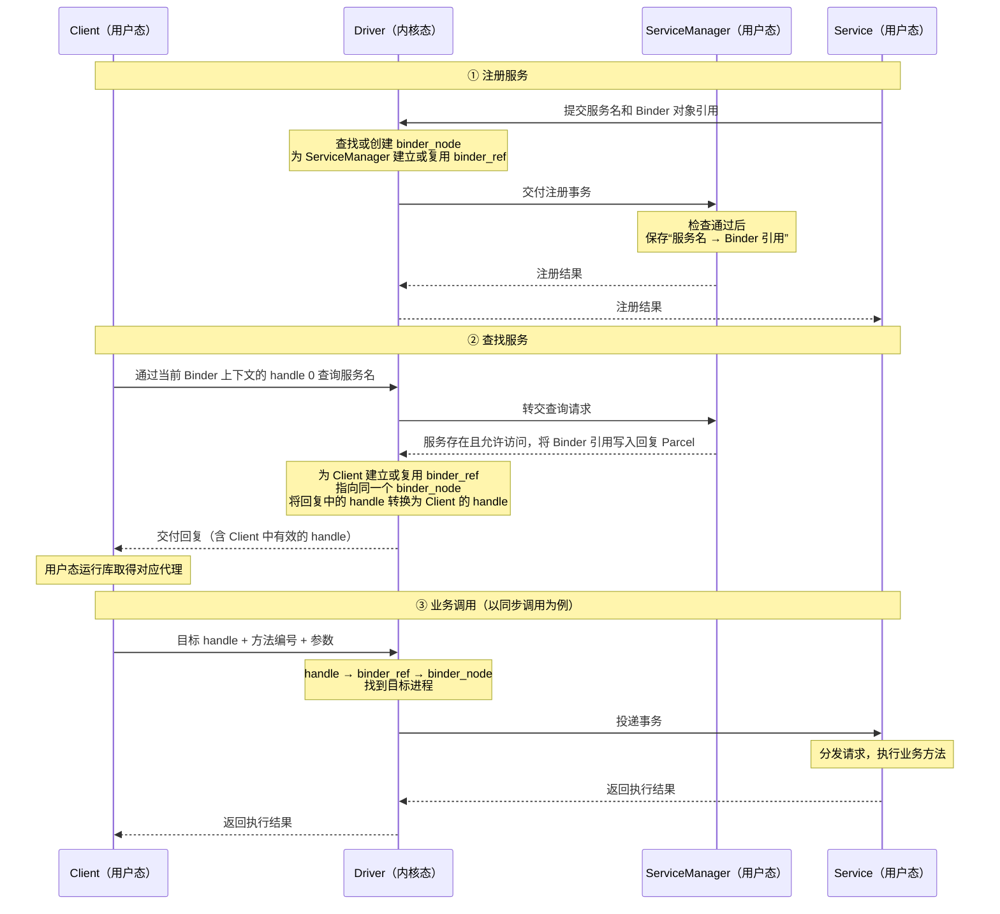

# Android 多进程

在组件的 Manifest 声明中设置 `android:process=":remote"`，可让组件运行在应用私有的 `包名:remote` 进程中；未指定时通常使用应用默认进程。进程按需创建，声明属性不代表立即启动。[进程与线程](https://developer.android.com/guide/components/processes-and-threads)、[process 属性](https://developer.android.com/guide/topics/manifest/service-element#proc)

多进程主要影响以下内容：

- **对象与同步**：静态变量、单例和普通线程锁只在各自进程内生效，不能直接共享状态或实现跨进程互斥。
- **初始化**：应用的各进程通常分别创建 Application，需要按进程安排初始化，避免重复启动不必要的任务。
- **数据一致性**：`SharedPreferences` 不支持跨进程使用，应通过明确的 IPC 接口统一读写共享状态。[SharedPreferences 文档](https://developer.android.com/reference/android/content/SharedPreferences)

# 🌟序列化与数据传递

| 对比维度 | Serializable | Parcelable |
| --- | --- | --- |
| 定位 | Java 的通用对象序列化接口 | Android 面向 IPC 的数据编码接口 |
| 实现方式 | 实现标记接口，由 `ObjectOutputStream`、`ObjectInputStream` 默认处理对象状态，也可自定义读写逻辑 | 通过 `writeToParcel()` 写入、`CREATOR` 重建；Kotlin 可用 `@Parcelize` 生成实现 |
| 字段处理 | 默认保存非 `static`、非 `transient` 字段，并处理引用的对象 | 由手写或生成的代码决定传输哪些字段，读写顺序与类型必须对应 |
| 性能开销 | 通用机制需要处理类信息、对象关系等，通常开销较大 | 按约定编码字段，针对 Android IPC 优化，通常更高效 |
| 适用场景 | Java 对象流读写、兼容已有 Java 序列化数据；也能用于 Intent / Bundle | Android 组件传参、Binder 通信中的自定义数据 |
| 兼容性 | 需维护 `serialVersionUID` 和类结构兼容；版本号相同不保证任意变更都兼容 | 需保持双方读写约定一致；Parcel 格式不保证跨平台版本稳定 |

Serializable 同样可以写入内存流，性能差异主要来自编码机制与额外开销，不能简单归结为“磁盘与内存的差别”。Android 官方也指出，将 Serializable 写入 Parcel 的开销较大。[Serializable 文档](https://developer.android.com/reference/java/io/Serializable)、[Parcel 性能说明](https://developer.android.com/reference/android/os/Parcel#writeSerializable(java.io.Serializable))

**Android 组件间传递自定义数据通常优先使用 Parcelable，Kotlin 配合 `@Parcelize` 可减少样板代码。** 需要兼容 Java 对象流时可使用 Serializable，并维护数据版本；**Parcel 不适合长期存储或作为稳定的网络协议格式**。[Parcelize 指南](https://developer.android.com/kotlin/parcelize)、[序列化兼容规则](https://docs.oracle.com/en/java/javase/26/docs/specs/serialization/version.html)、[Parcel 文档](https://developer.android.com/reference/android/os/Parcel)

Intent 的 Extras 使用 Bundle 保存；Bundle 是数据容器，实际传递由组件通信等机制完成。参数需要可编码，是为了跨进程传输与重建，不能归因于“防止 Activity 内存泄漏”。

Parcel有哪些局限：

Parcel 是 Parcelable 读写数据的容器，主要有这些局限：

- **格式不稳定**：不保证不同 Android 版本之间兼容，不适合长期存储，也不适合作为跨平台网络协议。[官方说明](https://developer.android.com/reference/android/os/Parcel)
- **维护成本较高**：手写 Parcelable 时，读写顺序和类型必须对应，修改字段要考虑双方兼容性。`@Parcelize` 能减少样板代码，但不能自动解决协议兼容问题。[Parcelize 指南](https://developer.android.com/kotlin/parcelize)
- **不适合传输大数据**：通过 Binder 传输时，事务缓冲区约为 **1 MB，且由进程内进行中的事务共享**，容易触发 `TransactionTooLargeException`。这是 Binder 的限制，并非 Parcel 本身只能容纳 1 MB。[事务大小限制](https://developer.android.com/reference/android/os/TransactionTooLargeException)

# Binder

## 🌟Binder设计原因

> Android 选择 Binder，因为它
>
> 1. 调用方便：支持面向对象的远程过程调用（RPC）
> 2. 传输高效：数据只需要复制一次
> 3. 安全性：内核提供可信 UID，驱动校验对象引用，Service 执行权限检查
> 4. 对象引用管理：支持对象引用和生命周期管理

Android 的应用与系统服务分布在不同进程中，访问相机等系统能力需要频繁进行跨进程调用。**从这一架构需求看，Binder 的优势是将远程接口调用、调用者身份、对象引用和生命周期管理整合在一起，同时控制本机通信的传输开销。** [Binder 概览](https://source.android.com/docs/core/architecture/ipc/binder-overview)

### 便于组织跨进程的服务接口

Binder 支持面向对象的远程过程调用（RPC）：Client 持有代理，通过接口调用 Service 提供的方法；请求经过驱动送到 Service 所在进程，由真正的服务对象执行。AIDL 可以生成代理、Stub 和参数编解码代码，减少各个服务重复实现通信协议的工作。调用形式接近本地方法调用，但仍需处理跨进程调用的延迟、并发和失败。[AIDL 指南](https://developer.android.com/develop/background-work/services/aidl)

### 减少事务数据的复制开销

对于普通 Binder 事务，驱动将发送方用户缓冲区中的数据复制到接收方映射的事务缓冲区，接收方可以直接读取这些数据，省去从内核接收缓冲区再复制到接收方用户缓冲区的一次复制。这有利于频繁传递方法参数、结果和控制消息。[Binder 缓冲区实现](https://android.googlesource.com/kernel/common/+/refs/heads/android-mainline/drivers/android/binder_alloc.c)

> 图中的实线表示数据复制，虚线表示地址映射，映射本身不复制数据。
>

具体分三步：

> 接收方准备接收区（接收方用户空间），发送方通过driver将数据复制进去，然后接收方直接读取接收缓冲区的数据。

1. **接收方准备接收区**
   Binder 运行库通过 `mmap()` 在接收进程中建立一块只读的虚拟地址区域。驱动根据需要分配物理页，并将其映射到这个区域。[映射代码](https://android.googlesource.com/platform/frameworks/native/+/refs/heads/main/libs/binder/ProcessState.cpp)
2. **驱动向目标物理页写入数据**
   发送方通过 `ioctl()` 提交事务，携带数据地址、长度等信息。驱动找到接收缓冲区对应的物理页，通过 `kmap_local_page()` 获得内核可访问地址，再调用 `copy_from_user()`，将发送方数据复制进去。[复制代码](https://android.googlesource.com/kernel/common/+/refs/heads/android-mainline/drivers/android/binder_alloc.c)
3. **接收方直接读取这些物理页**
   驱动把接收缓冲区在接收进程中的地址随事务通知交给接收方。接收方通过自己的虚拟地址，读取刚才写入的同一份数据，因此省去了第二次载荷复制。[事务交付代码](https://android.googlesource.com/kernel/common/+/refs/heads/android-mainline/drivers/android/binder.c)

这里共享物理页的是**内核与接收方**；发送方原始缓冲区仍是另一份内存。

### 提供可靠的调用者身份

Binder 驱动提供调用方的 UID，Service 在处理传入事务时可通过 `Binder.getCallingUid()` 取得它，结合 Android 权限机制判断调用者是否有权执行操作，避免依赖请求参数中自报的身份。**可靠身份为鉴权提供依据，具体接口仍需执行相应的权限检查。** [Binder 身份 API](https://developer.android.com/reference/android/os/Binder#getCallingUid())

其他 Linux IPC 同样具备安全机制。例如，Unix domain socket 支持通过 `SO_PEERCRED` 获取内核提供的对端凭据，路径形式的 socket 也有访问权限检查。Binder 的优势在于把身份信息与远程调用机制结合起来，便于系统服务统一使用。[Linux unix(7)](https://www.man7.org/linux/man-pages/man7/unix.7.html)

### 支持对象引用和生命周期管理

Binder 可以跨进程传递对象引用，便于提供回调接口和会话对象；其引用管理机制协调远程对象的生命周期。客户端还可以通过 `linkToDeath()` 注册死亡通知，在远端进程退出时清理状态或准备重新连接。这些能力减少了各个服务自行维护远程对象关系和失效通知的工作。持有引用并不能保证服务进程一直存活。[IBinder 文档](https://developer.android.com/reference/android/os/IBinder)

### 与其他 IPC 方式的取舍

Android 会根据数据和通信方式选择合适的 IPC。Binder 适合系统服务的接口调用，Socket 和共享内存也有各自的用途：

| 方式 | 更适合的场景 | 需要考虑的问题 |
| --- | --- | --- |
| Binder | 本机进程间的接口调用、控制消息和回调 | 事务缓冲区有限，需要处理线程安全和远端失效 |
| Socket | 本机流式通信、已有协议对接；网络 Socket 还可用于跨设备通信 | 需要选择或设计应用层协议，处理连接与消息组织 |
| 共享内存 | 多进程交换大量数据，减少重复搬运 | 需要协调读写同步、访问权限和内存生命周期 |

这些机制也可以组合使用：例如，通过 Binder 传递控制信息和文件描述符，用共享内存或文件承载大数据，避免让大块内容占用 Binder 事务缓冲区。[Parcel 数据类型](https://developer.android.com/reference/android/os/Parcel)、[事务大小限制](https://developer.android.com/reference/android/os/TransactionTooLargeException)

## Binder通信模型

以下以跨进程通信为例，可以按四个角色理解 Binder：

| 角色 | 所在空间 | 主要职责 |
| --- | --- | --- |
| Client | 用户空间 | 持有服务的代理，发起调用 |
| Service | 用户空间 | 提供 Binder 实现对象，执行具体业务 |
| ServiceManager | 用户空间 | 管理服务名称与 Binder 引用的对应关系，提供注册和查询 |
| Binder Driver | 内核空间 | 投递事务、转换跨进程引用、管理接收缓冲区和引用状态 |

### Binder驱动

用户态提交事务后，驱动根据目标引用找到对应进程，传递数据并安排事务交付；具体业务方法由 Service 进程中的用户态代码执行。

**驱动管理通信、引用和缓冲区；服务名称的登记与查询由用户态 ServiceManager 完成。** [Binder 驱动实现](https://android.googlesource.com/kernel/common/+/refs/heads/android-mainline/drivers/android/binder.c)、[ServiceManager 实现](https://android.googlesource.com/platform/frameworks/native/+/refs/heads/main/cmds/servicemanager/ServiceManager.cpp)

### 用户态对象、内核节点与引用

这几个概念需要区分：

- **用户态 Binder 对象**：位于 Service 进程中，提供接口实现并保存业务状态，例如 AIDL 的 Stub 实现对象。
- **`binder_node`**：驱动为本地 Binder 对象维护的内核管理记录，包含所属进程、对象标识和引用状态等。
- **`binder_ref` 与 handle**：驱动用 `binder_ref` 记录某个进程对目标节点的引用；该进程通过 handle 指定这个引用。handle 属于相应进程的 Binder 驱动连接，不是全局通用的对象编号。[内核数据结构](https://android.googlesource.com/kernel/common/+/refs/heads/android-mainline/drivers/android/binder_internal.h)

用户态首次将本地 Binder 对象传过驱动时，驱动按对象标识查找或创建对应节点。**用户态对象与内核节点通过标识关联，不通过内存映射同步业务字段。** 例如，服务对象中的 `count` 改变，内核节点不需要保存或同步这个值；后续调用仍被投递到服务对象，由它读取当前值并返回。

### ServiceManager与实名Binder

ServiceManager 可以理解为**服务目录**。这里将“在 ServiceManager 登记了名称的 Binder”称为实名 Binder，“未登记名称的 Binder”称为匿名 Binder；这是按是否登记名称作的分类，并非两种不同的驱动对象类型。

以一个系统服务注册为例：

1. Service 创建本地 Binder 对象，将服务名和 Binder 对象引用通过事务传给 ServiceManager。
2. 驱动查找或创建该对象对应的 `binder_node`，并为 ServiceManager 建立或复用相应的引用。
3. ServiceManager 检查注册权限等条件，通过后在自己的用户空间保存“服务名 → Binder 引用”的对应关系。[ServiceManager 注册实现](https://android.googlesource.com/platform/frameworks/native/+/refs/heads/main/cmds/servicemanager/ServiceManager.cpp)

ServiceManager 本身也是 Binder 服务。它在启动时通过 `BINDER_SET_CONTEXT_MGR_EXT` 等命令登记为所在 Binder 上下文（context）的管理者，驱动记录对应的管理节点。**同一上下文中的 handle 0 是访问该管理者的特殊入口**，因此其他进程不必先按名称查找 ServiceManager，也不需要自行配置这个编号。不同 Binder 上下文可以有各自的管理者。[管理者登记实现](https://android.googlesource.com/platform/frameworks/native/+/refs/heads/main/libs/binder/ProcessState.cpp)、[Binder 驱动实现](https://android.googlesource.com/kernel/common/+/refs/heads/android-mainline/drivers/android/binder.c)

### Client 获得实名Binder的引用

1. Client 通过 handle 0 向 ServiceManager 发起查询，提供目标服务名。
2. ServiceManager 检查查询权限，并在名称表中查找服务；服务存在且允许访问时，返回对应的 Binder 引用。
3. 驱动为 Client 建立或复用指向同一 `binder_node` 的 `binder_ref`，提供在 Client 中有效的 handle，用户态运行库据此取得代理。
4. Client 获得代理后，通过驱动向 Service 发起业务调用，**业务请求不再经过 ServiceManager**。[服务查询实现](https://android.googlesource.com/platform/frameworks/native/+/refs/heads/main/cmds/servicemanager/ServiceManager.cpp)、[引用转换实现](https://android.googlesource.com/kernel/common/+/refs/heads/android-mainline/drivers/android/binder.c)

ServiceManager 和 Client 持有的引用可以指向同一个服务对象，但各自的 handle 数值可能不同，不能把一个进程中的整数 handle 直接当成另一个进程中的有效引用。

这里描述的是系统服务通过 ServiceManager 注册和发现的过程。普通应用使用 `bindService()` 时，框架将服务端 `onBind()` 返回的 Binder 交给客户端的 `onServiceConnected()`，并不是把每个 `android.app.Service` 都注册到原生 ServiceManager。[绑定服务指南](https://developer.android.com/develop/background-work/services/bound-services)

### 匿名Binder

Binder 对象不必向 ServiceManager 注册名称，也可以作为参数、返回值或回调接口，通过已有的 Binder 调用传给其他进程。例如，Client 可以把回调 Binder 传给 Service，Service 再通过它通知 Client；传递通道本身也可以是匿名 Binder。

**没有取得引用的进程，不能仅靠猜测其他进程的 handle 来访问任意 Binder；已经持有引用的一方，在安全策略允许时可以继续将它转交给第三方。** 因此，匿名 Binder 不保证仅限最初两方使用，敏感接口仍需检查调用者身份和权限。[Binder 引用传递](https://developer.android.com/reference/android/os/IBinder)、[驱动引用转换](https://android.googlesource.com/kernel/common/+/refs/heads/android-mainline/drivers/android/binder.c)

### 用户空间和内核空间

各进程拥有独立的用户虚拟地址空间，系统内核负责内存、调度和设备等资源管理。App 不能直接访问其他进程的私有内存，也不能因使用 Binder 而获得内核权限。

| 区域 | 运行的内容 | Binder 中的作用 |
| --- | --- | --- |
| 用户空间 | App、系统服务及其运行库 | 发起调用、编码和解码参数、执行服务方法 |
| 内核空间 | 操作系统内核、设备驱动 | 管理节点与引用、传递事务数据、调度相关线程 |

例如，发送线程调用 `ioctl()` 时会进入内核态执行驱动代码，系统调用返回后再回到用户态。**“空间”指虚拟地址范围，“态”指 CPU 执行时的权限级别。**

Binder 的接收缓冲区映射在接收方用户空间中，底层物理页由驱动管理。驱动通过内核地址写入这些页，接收方通过自己的用户地址读取同一份数据，所以普通事务载荷无需再复制一次到接收方用户缓冲区。具体过程见前面的“减少事务数据的复制开销”。

这里的 `mmap()` 用于**事务接收缓冲区**，不用于把 Binder 实现对象映射为 `binder_node`；减少一次载荷复制也不能直接推出整体性能翻倍。[接收缓冲区实现](https://android.googlesource.com/kernel/common/+/refs/heads/android-mainline/drivers/android/binder_alloc.c)

## 🌟最终总结

| 概念          | 在哪里                     | 是什么                                                       |
| ------------- | -------------------------- | ------------------------------------------------------------ |
| `handle`      | 用户态代理持有，内核也记录 | 一个整数编号，用来查找当前进程对应的 `binder_ref`            |
| `binder_ref`  | 内核空间                   | 记录某个进程对目标 Binder 对象的引用，指向对应的 `binder_node` |
| `binder_node` | 内核空间                   | 代表一个 Binder 对象，记录对象所属进程、对象标识等信息       |

Binder 的四个角色：Client 发起调用，Service 处理业务，ServiceManager 帮忙找服务，Driver 负责跨进程传递请求和结果。

拿一个通过 ServiceManager 注册、供其他进程调用的系统服务来说，流程是这样的：

**注册服务**

1. Service 创建本地 Binder 对象，将服务名和 Binder 对象引用通过 Driver 传给 ServiceManager 注册。
2. Driver 创建该对象对应的 `binder_node`，为 ServiceManager 建立相应的 `binder_ref`，然后交给 ServiceManager注册。
3. ServiceManager 保存“服务名 → Binder 引用”的对应关系。

**查找服务**

1. Client 通过 **handle 0** 向 ServiceManager 查询服务名。服务存在且允许访问时，ServiceManager 把对应的 Binder 引用写入回复 Parcel，其中携带的是 ServiceManager 使用的 handle。
2. Driver 根据这个 handle 找到同一个 `binder_node`，为 Client 建立或复用 `binder_ref`，并将回复中的 handle 转换成 Client 可用的值。Client 的运行库读取回复后，据此取得代理。

**业务调用**

1. Client 获得代理后，通过 Driver 向 Service 发起业务调用，**业务请求不再经过 ServiceManager**。

数据传输可以简单理解为：接收方先通过 `mmap()` 建立接收缓冲区的映射。普通 Binder 事务中，Driver 把发送方用户缓冲区的数据复制到接收方缓冲区的底层物理页，接收方再通过自己的用户空间地址读取这份数据。

> 对这个服务对象来说，ServiceManager 和 Client 在内核中各有自己的 `binder_ref`，它们指向同一个 `binder_node`。
>
> Binder 引用也可以通过已有的调用继续传给其他进程，不一定要注册到 ServiceManager。

# IPC 方式选择

| 方式 | 适用场景与主要限制 |
| --- | --- |
| Intent / Bundle | 启动组件、发送广播时携带少量数据；Bundle 本身不是独立的 IPC 通道 |
| Messenger | 基于 Binder 发送 Message，由目标 Handler 串行处理；可通过 `replyTo` 回复，适合简单消息交互 |
| AIDL | 跨进程的类型化接口调用，支持回调和并发请求；服务端需要处理线程安全 |
| ContentProvider | 通过 URI 提供结构化数据访问与共享，常见操作为增删改查；跨进程访问基于 Binder |
| 文件共享 | 交换需要持久化的数据；需自行处理访问权限、并发读写和更新通知 |
| Socket | 本机或跨设备通信；需自行设计协议、连接管理和身份验证 |

Messenger 的串行性限于目标 Handler 的消息处理，不代表应用其他线程无需同步。ContentProvider 的数据访问方法也可能被多线程调用，不能根据一次同进程测试就认定其始终运行在主线程。[绑定服务指南](https://developer.android.com/develop/background-work/services/bound-services)、[ContentProvider 指南](https://developer.android.com/guide/topics/providers/content-provider-creating)

# AIDL 基本用法

1. 定义 `.aidl` 接口，约定方法和可传输的数据类型；需要时声明 Parcelable 数据及 AIDL 回调接口。
2. 服务端实现生成的 `Stub`，在 `Service.onBind()` 中返回它。
3. 客户端使用显式 Intent 绑定服务，在 `onServiceConnected()` 中通过 `Stub.asInterface()` 取得接口，再发起调用。

AIDL 支持常量声明。对需要指定传输方向的参数，按实际需求选择 `in`、`out`、`inout`；基本类型、String、IBinder 和 AIDL 接口默认为 `in`，不能任意修改方向。接口升级还需保持双方兼容。[AIDL 指南](https://developer.android.com/develop/background-work/services/aidl)

# 实际使用注意

- **线程与耗时**：同步远程调用会阻塞调用线程，客户端应避免在主线程调用可能耗时的接口；远程请求通常在服务端 Binder 线程池处理，需要保证线程安全。长任务宜设计为异步提交并通过回调返回，避免长期占用 Binder 线程；回调更新 UI 时应切回主线程。[AIDL 指南](https://developer.android.com/develop/background-work/services/aidl)
- **异步与死锁**：`oneway` 远程调用不等待业务执行结果，但不会让同进程调用自动异步。发起 Binder 调用时应避免持有业务锁，防止嵌套调用造成死锁。[Binder 线程模型](https://source.android.com/docs/core/architecture/ipc/binder-threading)
- **回调管理**：用 `RemoteCallbackList` 按底层 IBinder 身份管理远程监听器，可自动移除进程已死亡的客户端。使用 `beginBroadcast()` 遍历时，应确保在 `finally` 中执行 `finishBroadcast()`。[RemoteCallbackList 文档](https://developer.android.com/reference/android/os/RemoteCallbackList)
- **连接失效**：处理 `RemoteException`、Binder 死亡及连接回调，停止使用失效代理。`onServiceDisconnected()` 后绑定仍保留，服务再次运行时可重新连接；`onBindingDied()` 则需要解绑再绑定。[ServiceConnection 文档](https://developer.android.com/reference/android/content/ServiceConnection)
- **数据大小**：Binder 事务缓冲区约为 1 MB，由进程内正在进行的事务共享，并非单次调用可安全传满 1 MB。大数据应分页，或通过文件描述符、共享内存等方式传递，避免 `TransactionTooLargeException`。[事务大小限制](https://developer.android.com/reference/android/os/TransactionTooLargeException)
- **权限校验**：通过组件的 `exported`、`permission` 控制外部访问，并在敏感 Binder 调用入口校验权限和调用者身份。`Binder.getCallingUid()` 应在处理传入事务时读取，不能把 `onBind()` 中的一次检查当成每次远程调用的鉴权。[Service 配置](https://developer.android.com/guide/topics/manifest/service-element)、[Binder 身份](https://developer.android.com/reference/android/os/Binder#getCallingUid())
