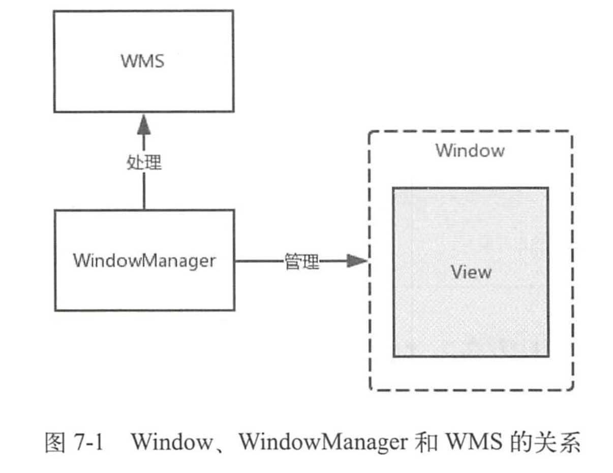

# Window、WM和WMS之间的关系

1.  Window是一个抽象类，具体的实现类为PhoneWindow，它对View进行管理。
2.  WindowManager是个接口类，继承自接口ViewManager，是用来管理Window的，实现类为WindowManagerlmpl。如果要对Window(View)进行添加、更新和删除操作就可以使用WindowManager。
3.  WindowManager会将具体的工作交由WMS来处理，WindowManager和WMS通过Binder来进行跨进程通信。



Window包含了View并对View进行管理，Window用虚线来表示是因为Window是一个抽象概念，用来描述一个窗口，并不是真实存在的，Window的实体其实也是View。

WindowManager用来管理Window，而WindowManager所提供的功能最终会由WMS进行
处理。

# WindowManager的关联类

WindowManager是一个接口类，继承自接口ViewManager，ViewManager中定义了3个方法，分别用来添加、更新和删除View：

```java
public interface ViewManager{
    public void addView(View view, ViewGroup.LayoutParams params);
    public void updateViewLayout(View view, ViewGroup.LayoutParams params);
    public void removeView(View view);
}
```

这些方法传入的参数都是View类型，说明Window是以View的形式存在的。

WindowManager在继承VewManager的同时，又加入了很多功能，包括Window的类型和层级相关的常量、内部类以及些方法， 其中有两个方法是根据Window的特性加入的：

```java
public Display getDefaultDisplay(); 
public void removeViewImmediate(View view);
```

getDefaultDisplay方法能够得知这个WindowManager实例将Window添加到哪个屏幕上了，换句话说，就是得到WindowManager所管理的屏幕(Display)。

removeViewImmediate方法则规定在这个方法返回前要立即执行View.onDetachedFromWindow方法，来完成传入的View相关的销毁工作。

## Window的创建

Window是一个抽象类 ，它的具体实现类为PhoneWindow。

在Activity启动过程中会调用ActivityThread的performLaunchActivity方法，performLaunchActivity方法中又会调用Activity的attach方法，PhoneWindow就是在Activity的attach方法中创建的。

```java
final void attach(Context context, ActivityThread aThread, Instrumentation instr, IBinder token, int ident, Application application, Intent intent, ActivityInfo info, CharSequence title, Activity parent, String id, NonConfigurationInstances lastNonConfigurationInstances, Configuration config, String referrer, IVoiceInteractor voiceInteractor, Window window, ActivityConfigCallback activityConfigCallback) {
    //...
    //创建Window，mWindow是Activity的成员变量，说明一个Activity对应一个Window
    mWindow = new PhoneWindow(this, window, activityConfigCallback);
    //...
    //Window关联WindowManager
    mWindow.setWindowManager((WindowManager)context.getSystemService(Context.WINDOW_SERVICE), mToken, mComponent.flattenToString(), (info.flags & ActivityInfo.FLAG_HARDWARE_ACCELERATED) != 0);
    //...
}
```

这里创建了一个PhoneWindow ，并调用setWindowManager方法设置一个Manager。

## WindowManager的创建

在Window关联WM时会调用setWindowManager方法。

```java
public void setWindowManager(WindowManager wm, IBinder appToken, String appName, boolean hardwareAccelerated) {
    mAppToken = appToken;
    mAppName = appName;
    mHardwareAccelerated = hardwareAccelerated || SystemProperties.getBoolean(PROPERTY_HARDWARE_UI, false);
    if (wm == null) {
        //类型为WindowManagerImpl
        wm = (WindowManager)mContext.getSystemService(Context.WINDOW_SERVICE);
    }
    mWindowManager = ((WindowManagerImpl)wm).createLocalWindowManager(this);
}
```

这里会获取一个WindowManagerImpl实例，是WindowManager的具体实现。

setWindowManager方法会调用createLocalWindowManager方法，createLocalWindowManager同样也是创建新的WindowManagerImpl，不同的是这次创建WindowManagerlmpl时将创建它的Window作为参数传了进来，**这WindowManagerImpl就持有了Window的引用，可以对Window进行操作**。如addView方法：

```java
public void addView(@NonNull View view, @NonNull ViewGroup.LayoutParams params) {
    applyDefaultToken(params);
    mGlobal.addView(view, params, mContext.getDisplay(), mParentWindow);
}
```

调用了WindowManagerGlobal的addView 方法，其中最后一个参数mParentWindow就是上面提到的Window，可以看出WindowManagerlmpl虽然是WindowManager的实现类，但是没有实现什么功能，而是将功能实现委托给了WindowManagerGlobal，这里用到的是桥接模式。

```java
public final class WindowManagerImpl implements WindowManager {
    //WindowManagerGlobal 是一个单例，说明在一个进程中只有一个WindowManagerGlobal实例。
    private final WindowManagerGlobal mGlobal = WindowManagerGlobal.getInstance();
    private final Context mContext;
    private final Window mParentWindow;//注释2
		//...
    private WindowManagerImpl(Context context, Window parentWindow) {
        mContext = context;
        mParentWindow = parentWindow;//注释3
    }
  	//...
}
```

注释2处的代码结合注释3处的代码说明这个WindowManagerlmpl实例会作为哪个Window的子Window，这也就说明在一个进程中WindowManagerlmpl可能会有多个实例。

WindowManager的关联类如图所示：


# Window的属性

## Window的类型和显示次序

Window的类型有很多种，比如应用程序窗口、系统错误窗口、输入法窗口、PopupWindow、Toast、Dialog等。总的来说Window分为三大类型，分别是：

- Application Window(应用程序窗口)
- Sub Window(子窗口)
- System Window(系统窗口)

每个大类型中又包含了很多种类型，它们都定义在WindowManager的静态内部类LayoutParams 中。

### 应用程序窗口

Activity就是一个典型的应用程序窗口，应用程序窗口包含的类型如下所示：

```java
public interface WindowManager extends ViewManager {
  	//...

    public static class LayoutParams extends ViewGroup.LayoutParams implements Parcelable {
				public static final int FIRST_APPLICATION_WINDOW = 1;//表示应用程序窗口类型初始值
				public static final int TYPE_BASE_APPLICATION = 1;//窗口的基础值，其他的窗口值要大于这个值
      	public static final int TYPE_APPLICATION = 2;//普通的应用程序窗口类型
      	public static final int TYPE_APPLICATION_STARTING = 3;//应用程序启动窗口类型，用于系统在应用程序窗口启动前显示的窗口
      	public static final int LAST_APPLICATION_WINDOW = 99;//表示应用程序窗口类型结束值，也就是说应用程序窗口的Type值范围为1~99
      	
      	//...
    }
}
```

应用程序窗口的Type值范围为1～99。

还有一些数值未列出，这些数值的大小涉及窗口的层级。

### 子窗口

子窗口，它不能独立存在，需要附着在其他窗口才可以，PopupWindow就属于子窗口。
子窗口的类型定义如下所示：

```java
public static final int FIRST_SUB_WINDOW = 1000;
public static final int TYPE_APPLICATION_PANEL = FIRST_SUB_WINDOW;
public static final int TYPE_APPLICATION_MEDIA = FIRST_SUB_WINDOW + 1;
public static final int TYPE_APPLICATION_SUB_PANEL = FIRST_SUB_WINDOW + 2;
public static final int TYPE_APPLICATION_ATTACHED_DIALOG = FIRST_SUB_WINDOW + 3;
public static final int TYPE_APPLICATION_MEDIA_OVERLAY  = FIRST_SUB_WINDOW + 4;
public static final int TYPE_APPLICATION_ABOVE_SUB_PANEL = FIRST_SUB_WINDOW + 5;
public static final int LAST_SUB_WINDOW = 1999;
```

子窗口的Type值范围为1000 ~ 1999。

### 系统窗口

Toast、输入法窗口、系统音量条窗口、系统错误窗口都属于系统窗口。系统窗口的类型定义如下所示：

```java
public static final int FIRST_SYSTEM_WINDOW     = 2000;

public static final int TYPE_STATUS_BAR         = FIRST_SYSTEM_WINDOW;

public static final int TYPE_SEARCH_BAR         = FIRST_SYSTEM_WINDOW+1;

@Deprecated
public static final int TYPE_PHONE              = FIRST_SYSTEM_WINDOW+2;

@Deprecated
public static final int TYPE_SYSTEM_ALERT       = FIRST_SYSTEM_WINDOW+3;

public static final int TYPE_KEYGUARD           = FIRST_SYSTEM_WINDOW+4;

@Deprecated
public static final int TYPE_TOAST              = FIRST_SYSTEM_WINDOW+5;
//...
public static final int LAST_SYSTEM_WINDOW      = 2999;
```

这里只列出了一小部分，系统窗口的Type值范围为2000~ 2999。

### 窗口显示次序

当一个进程向WMS申请一个窗口时，WMS会为窗口确定显示次序。为了方便窗口显示次序的管理，手机屏幕可以虚拟地用X、Y、Z轴来表示，其中Z轴垂直于屏幕，从屏幕内指向屏幕外，这样确定窗口显示次序也就是确定窗口在Z轴上的次序，这个次序称为Z-Oder。

Type值是Z-Oder排序的依据，应用程序窗口的Type值范围为1~ 99，子窗口1000~1999，系统窗口2000~2999，在一般情况下，Type值越大则Z-Oder排序越靠前，就越靠近用户。

这只是基本规则，实际的逻辑复杂的多，这里不再讨论。

## Window的标志

Window的Flag用于控制Window的显示，同样被定义在WindowManager的内部类LayoutParms中，一共有20多个，这里给出几个比较常用的：

| Flag                            | 描述                                                         |
| ------------------------------- | ------------------------------------------------------------ |
| FLAG_ALLOW_LOCK_WHILE_SCREEN_ON | 只要窗口可见，就允许在开启状态的屏幕上锁屏                   |
| FLAG_NOT_FOCUSABLE              | 窗口不能获得输入焦点，设置该标志的同时，FLAG_NOT_TOUCH_MODAL也会被设置 |
| FLAG_NOT_TOUCHABLE              | 窗口不接收任何触摸事件                                       |
| FLAG_NOT_TOUCH_MODAL            | 将该窗口区城外的触摸事件传递给其他的Window，而自己只会处理窗口区域内的触摸事件 |
| FLAG_KEEP_SCREEN_ON             | 只要窗口可见，屏幕就会一直亮着                               |
| FLAG_LAYOUT_NO_LIMITS           | 允许窗口超过屏幕之外                                         |
| FLAG_FULLSCREEN                 | 隐藏所有的屏称装饰窗口，比如在游戏、播放器中的全屏显示       |
| FLAG_SHOW_WHEN_LOCKED           | 窗口可以在锁屏的窗口之上显示                                 |
| FLAG_IGNORE_CHEEK_PRESSES       | 当用户的脸贴近屏幕时(比如打电话)， 不会去响应此事件          |
| FLAG_TURN_SCREEN_ON             | 窗口显示时将屏幕点亮                                         |

## 软键盘相关模式

窗口和窗口的叠加是十分常见的场景，但如果其中的窗口是软键盘窗口，可能就会出现些问题，比如典型的用户登录界面，默认的情况弹出的软键盘窗口可能会盖住输入框下方的按钮，这样用户体验会非常糟糕。为了使得软键盘窗口能够按照期望来显示，WindowManager的静态内部类LayouParamns中定义了软键盘相关模式，这里给出常用的几个：

| SoftInputMode                  | 描述                                                       |
| ------------------------------ | ---------------------------------------------------------- |
| SOFT_INPUT_STATE_UNSPECIFIED   | 没有指定状态，系统会选择一个合适的状态或依赖于主题的设置   |
| SOFT_INPUT_STATE_UNCHANGED     | 不会改变软键盘状态                                         |
| SOFT_INPUT_STATE_HIDDEN        | 当用户进入该窗口时，软键盘默认隐藏                         |
| SOFT_INPUT_STATE_ALWAYS_HIDDEN | 当窗口获取焦点时，软键盘总是被隐藏                         |
| SOFT_INPUT_ADJUST_RESIZE       | 当软键盘弹出时，窗口会调整大小                             |
| SOFT_INPUT_ADJUST_PAN          | 当软键盘弹出时，窗口不需要调整大小，要确保输入焦点是可见的 |

上面的与AndroidManifest中Activity的属性android:windowSoftInputMode是对应的。因此，除了在AndroidMainfest中为Activity设置android:windowSoftInputMode以外还可以在Java代码中为Window设置SoftInputMode：

```java
getWindow().setSoftInputMode(WindowManager.LayoutParams.SOFT_INPUT_ADJUST_RESIZE);
```

# Window的操作

对于Window 的操作，最终都是交由WMS来进行处理的。窗口的操作分为两大部分，一部分是WindowManager处理部分，另一部分是WMS处理部分。

## 系统窗口的添加过程

以系统窗口StatusBar为例，StatusBar是SystemUI的重要组成部分，具体就是指系统状态栏，用于显示时间、电量和信号等信息。

来看一下StatusBar的addStatusBarWindow方法，这个方法负责为StatusBar添加Window：

```java
private void addStatusBarWindow() {
    makeStatusBarView();//构建StatusBar的视图。
    mStatusBarWindowManager = Dependency.get(StatusBarWindowManager.class);
    mRemoteInputController = new RemoteInputController(mHeadsUpManager);
    mStatusBarWindowManager.add(mStatusBarWindow, getStatusBarHeight());//添加Window
}
```

StatusBarWindowManager的add方法如下所示：

```java
public void add(View statusBarView, int barHeight) {
    mLp = new WindowManager.LayoutParams(//创建LayoutParams来配置StatusBar视图的属性
            ViewGroup.LayoutParams.MATCH_PARENT,
            barHeight,
            WindowManager.LayoutParams.TYPE_STATUS_BAR,//表示StatusBar视图的窗口类型是状态栏
            WindowManager.LayoutParams.FLAG_NOT_FOCUSABLE
                    | WindowManager.LayoutParams.FLAG_TOUCHABLE_WHEN_WAKING
                    | WindowManager.LayoutParams.FLAG_SPLIT_TOUCH
                    | WindowManager.LayoutParams.FLAG_WATCH_OUTSIDE_TOUCH
                    | WindowManager.LayoutParams.FLAG_DRAWS_SYSTEM_BAR_BACKGROUNDS,
            PixelFormat.TRANSLUCENT);
    mLp.token = new Binder();
    mLp.flags |= WindowManager.LayoutParams.FLAG_HARDWARE_ACCELERATED;
    mLp.gravity = Gravity.TOP;
    mLp.softInputMode = WindowManager.LayoutParams.SOFT_INPUT_ADJUST_RESIZE;
    mLp.setTitle("StatusBar");
    mLp.packageName = mContext.getPackageName();
    mStatusBarView = statusBarView;
    mBarHeight = barHeight;
    mWindowManager.addView(mStatusBarView, mLp);//添加窗口
    mLpChanged = new WindowManager.LayoutParams();
    mLpChanged.copyFrom(mLp);
}
```

WindowManagerImpl的addView：

```java
public void addView(@NonNull View view, @NonNull ViewGroup.LayoutParams params) {
    applyDefaultToken(params);
    mGlobal.addView(view, params, mContext.getDisplay(), mParentWindow);
}
```

addView方法中会调用WindowManagerGlobal的addView方法：

```java
public void addView(View view, ViewGroup.LayoutParams params,
        Display display, Window parentWindow) {
    //...
    final WindowManager.LayoutParams wparams = (WindowManager.LayoutParams) params;
    if (parentWindow != null) {
        parentWindow.adjustLayoutParamsForSubWindow(wparams);//如果当前窗口要作为子窗口，就会根据父窗口对子窗口的WindowManager.LayoutParams类型的wparams对象进行相应调整
    } else {
        //。。。
    }

    ViewRootImpl root;
    View panelParentView = null;

    synchronized (mLock) {
        //...
        root = new ViewRootImpl(view.getContext(), display);//创建了ViewRootlmp并赋值给root

        view.setLayoutParams(wparams);

        mViews.add(view);//将添加的View保存到View列表中。
        mRoots.add(root);//将root存入到ViewRootImpl列表中。
        mParams.add(wparams);//将窗口的参数保存到布局参数列表中

        try {
            root.setView(view, wparams, panelParentView);//将窗口和窗口的参数通过setView方法设置到ViewRootImpl中
        } catch (RuntimeException e) {
            //。。。
        }
    }
}
```

WindowManagerGlobal中维护了和Window操作相关的3个列表，在窗口的添加、更新和删除过程中都会涉及这3个列表，它们分别是View列表 `ArrayList<View> mViews`、 布局参数列表 `ArrayList<WindowManager.LayouParamns> mParms`和ViewRootImpl列表 `ArrayList<VievRootlmpl> mRoots`。

ViewRootImpl主要做这些事：

- View树的根并管理View树。
- 触发View的测量、布局和绘制。
- 输入事件的中转站。
- 管理Surface。
- 负责与WMS进行进程间通信。

接着来查看ViewRootImpl的setView方法：

```java
public void setView(View view, WindowManager.LayoutParams attrs, View panelParentView) {
    synchronized (this) {
        //...
            try {
                //。。。
                res = mWindowSession.addToDisplay(mWindow, mSeq, mWindowAttributes, getHostVisibility(), mDisplay.getDisplayId(), mAttachInfo.mContentInsets, mAttachInfo.mStableInsets, mAttachInfo.mOutsets, mInputChannel);
            } 
      	//....
}
```

在setView方法主要就是调用了mWindowSession的addToDisplay方法，mWindowSession是IWindowSession类型的，它是一个Binder对象，用于进行进程间通信，IWindowSession是Client端的代理，它的Server端的实现为Session，此前的代码逻辑都是运行在本地进程的，而Session的addToDisplay方法则运行在WMS所在的进程(SystemServer进程)中。

本地进程的ViewRootImpl要想和WMS进行通信需要经过Session，那么Session为何包含在WMS中呢？

看一下Session的addToDisplay方法：

```java
public int addToDisplay(IWindow window, int seq, WindowManager.LayoutParams attrs, int viewVisibility, int displayId, Rect outContentInsets, Rect outStableInsets, Rect outOutsets, InputChannel outInputChannel) {
    return mService.addWindow(this, window, seq, attrs, viewVisibility, displayId, outContentInsets, outStableInsets, outOutsets, outInputChannel);
}
```

在addToDisplay方法中调用了WMS的addWindow方法，并将自身也就是Session作为参数传了进去，每个应用程序进程都会对应一个 Session，WMS会用ArrayList来保存这此Session。

剩下的工作就交给WMS来处理，在WMS中会为这个添加的窗口分配Surface，并确定窗口显示次序，可见负责显示界面的是画布Surface，而不是窗口本身。WMS会将它所管理的Surface交由SurfaceFlinger处理，SurfaceFlinger会将这些Surface混合并绘制到屏幕上。

### 小结

首先，Window是以View的形式存在的，也就是创建Window时需要创建对应的View。Window的操作也就是WM的操作，WM的操作又交给WMG（WindowManagerGlobal），WMG通过ViewRootImpl对View进行管理。WMG最后将对Window的操作交给WMS完成。

>   WM的addView是指add根View，所以会创建ViewRootImpl。

## Activity的添加过程

Activity在启动过程中，如果Activity所在的进程不存在则会创建新的进程，创建新的进程之后就会运行代表主线程的实例ActivityThread，ActivityThread管理着当前应用程序进程的线程。

上文说过Window的创建，performLaunchActivity会调用Activity的attach方法，里面会创建Window。

Window是以View的形式存在的，所以Activity里的Window也需要一个View，这个View就是DecorView，它分为title部分和content部分：


content部分一般是在onCreate里通过setContentView来设置的，里面会调用getDecorView方法：

```java
//PhoneWindow.java
@Override
public final View getDecorView() {
    if (mDecor == null || mForceDecorInstall) {
        installDecor();
    }
    return mDecor;
}
```

当不存在DecorView就会创建一个。

即使没有在onCreate调用setContentView方法，最终也会创建DecorView。performLaunchActivity执行完，界面要与用户进行交互时，会调用ActivityThread的handleResumeActivity方法：

```java
final void handleResumeActivity(IBinder token, boolean clearHide, boolean isForward, boolean reallyResume, int seq, String reason) {
    //...
    r = performResumeActivity(token, clearHide, reason);//performResumeActivity方法最终会调用Activity的onResume方法
		//...
        if (r.window == null && !a.mFinished && willBeVisible) {
            r.window = r.activity.getWindow();
            View decor = r.window.getDecorView();
            decor.setVisibility(View.INVISIBLE);
            ViewManager wm = a.getWindowManager();//得到ViewManager类型的wm对象
            WindowManager.LayoutParams l = r.window.getAttributes();
            a.mDecor = decor;
            l.type = WindowManager.LayoutParams.TYPE_BASE_APPLICATION;
            l.softInputMode |= forwardBit;
            if (r.mPreserveWindow) {
                a.mWindowAdded = true;
                r.mPreserveWindow = false;
                ViewRootImpl impl = decor.getViewRootImpl();
                if (impl != null) {
                    impl.notifyChildRebuilt();
                }
            }
            if (a.mVisibleFromClient) {
                if (!a.mWindowAdded) {
                    a.mWindowAdded = true;
                    wm.addView(decor, l);//调用了ViewManager的addView方法，而addView方法则是在WindowManagerlmpl中实现的，此后的过程在上面的系统窗口的添加过程中已经讲过，唯一需要注意的是ViewManager的addView方法的第一个参数为DecorView，这说明Acitivty窗口中会包含DecorView。
                } else {
                    a.onWindowAttributesChanged(l);
                }
            }
			//...
}
```

在handleResumeActivity方法中会获取DecorView（如果没有就创建），并通过WM的addView展现出来。这样Activity的Window是以DecorView的形式展现的。

## Window的更新过程

Window的更新过程和Window的添加过程是类似的。需要调用ViewManager的updateViewLayout方法，updateViewLayout方法在WindowManagerlmpl中实现WindowManagerImpl的updateViewLayout方法会调用WindowManagerGlobal的updateViewLayout方法，如下所示：

```java
public void updateViewLayout(@NonNull View view, @NonNull ViewGroup.LayoutParams params) {
    applyDefaultToken(params);
    mGlobal.updateViewLayout(view, params);
}
```

```java
public void updateViewLayout(View view, ViewGroup.LayoutParams params) {
    //...

    final WindowManager.LayoutParams wparams = (WindowManager.LayoutParams)params;
    view.setLayoutParams(wparams);//将更新的参数设置到View中
    synchronized (mLock) {
        int index = findViewLocked(view, true);//得到要更新的窗口在View列表中的索引
        ViewRootImpl root = mRoots.get(index);//在ViewRootImpl列表中根据索引得到窗口的ViewRootImpl
        //下面2行用于更新布局参数列表
        mParams.remove(index);
        mParams.add(index, wparams);
        
        root.setLayoutParams(wparams, false);//调用ViewRootImpl的setLayoutParams方法将更新的参数设置到ViewRootImpl中
    }
}
```

ViewRootImpl的setLayoutParams方法在最后会调用ViewRootImpl的scheduleTraversals方法，如下所示：

```java
void scheduleTraversals() {
    if (!mTraversalScheduled) {
        mTraversalScheduled = true;
        mTraversalBarrier = mHandler.getLooper().getQueue().postSyncBarrier();
        mChoreographer.postCallback(Choreographer.CALLBACK_TRAVERSAL, mTraversalRunnable, null);//注释1
        if (!mUnbufferedInputDispatch) {
            scheduleConsumeBatchedInput();
        }
        notifyRendererOfFramePending();
        pokeDrawLockIfNeeded();
    }
}
```

注释1处的Choreographer译为“舞蹈指导”，用于接收显示系统的VSync信号，在下一个帧渲染时控制执行一些操作。

Choreographer的postCallback方法用于发起添加回调，这个添加的回调将在下一帧被渲染时执行。这个添加的回调指的是注释1处的TraversalRunnable类型的mTraversalRunnable，如下所示：

```java
final class TraversalRunnable implements Runnable {
    @Override
    public void run() {
        doTraversal();
    }
}
```

在TraversalRunnable的run方法中调用了doTraversal方法，内部会调用performTraversals方法，performTraversals方法开始绘制View，如下所示：

```java
private void performTraversals() {
		//...
    relayoutResult = relayoutWindow(params, viewVisibility, insetsPending);//relayoutWindow方法内部会调用IWindowSession的relayout方法来更新Window视图，最终会调用WMS的relayoutWindow方法。
		//。。。

    if (!mStopped || mReportNextDraw) {
      	//。。
        int childWidthMeasureSpec = getRootMeasureSpec(mWidth, lp.width);
        int childHeightMeasureSpec = getRootMeasureSpec(mHeight, lp.height);
        performMeasure(childWidthMeasureSpec, childHeightMeasureSpec);//注释2
    }

    if (didLayout) {
      	//。。。
        performLayout(lp, mWidth, mHeight);//注释3
    }

    if (!cancelDraw && !newSurface) {
      	//。。。
        performDraw();//注释4
    }
}
```

performTraversals方法会在注释2、3、4处分别调用performMeasure、performLayout和performDraw方法，这样就完成了View的工作流程。

在performTraversals方法中更新了Window视图，又执行Window中的View的工作流程，这样就完成了Window的更新。

## Window的删除

最后看一下Window的删除操作，在WindowManager中，除了removeView方法，还有一个removeViewImmediate方法可以用来删除：

```java
@Override
public void removeView(View view) {
    mGlobal.removeView(view, false);
}

@Override
public void removeViewImmediate(View view) {
    mGlobal.removeView(view, true);
}
```

这两个方法内部都调用了WindowManagerGlobal的removeView，只是一个闯入的是true，一个是false。

看一下WindowManagerGlobal的removeView方法：

```java
public void removeView(View view, boolean immediate) {
    //...
    synchronized (mLock) {
        int index = findViewLocked(view, true);
        View curView = mRoots.get(index).getView();
        removeViewLocked(index, immediate);
        if (curView == view) {
            return;
        }

        throw new IllegalStateException("Calling with view " + view
                + " but the ViewAncestor is attached to " + curView);
    }
}
```

通过findViewLocked来查找待删除的View的索引，然后再调用removeViewLocked来做进一步的删除：

```java
private void removeViewLocked(int index, boolean immediate) {
    ViewRootImpl root = mRoots.get(index);
    View view = root.getView();

    if (view != null) {
        InputMethodManager imm = InputMethodManager.getInstance();
        if (imm != null) {
            imm.windowDismissed(mViews.get(index).getWindowToken());
        }
    }
    boolean deferred = root.die(immediate);
    if (view != null) {
        view.assignParent(null);
        if (deferred) {
            mDyingViews.add(view);
        }
    }
}
```

删除操作是通过ViewRootlmpl的die方法来完成的。

```java
boolean die(boolean immediate) {
    // Make sure we do execute immediately if we are in the middle of a traversal or the damage
    // done by dispatchDetachedFromWindow will cause havoc on return.
    if (immediate && !mIsInTraversal) {
        doDie();
        return false;
    }

    if (!mIsDrawing) {
        destroyHardwareRenderer();
    } else {
        Log.e(mTag, "Attempting to destroy the window while drawing!\n" +
                "  window=" + this + ", title=" + mWindowAttributes.getTitle());
    }
    mHandler.sendEmptyMessage(MSG_DIE);
    return true;
}
```

```java
case MSG_DIE:
    doDie();
    break;
```

这里可以看出removeViewImmediate和removeView方法的区别：

removeViewImmediate方法是同步删除，这里的immediate是true，直接调用doDie方法。

removeView是异步删除，发送了一个请求删除的消息后就立刻返回了，这个时候View并没有完成删除操作，而是等待被删除，最后还是会调用doDie方法。

```java
void doDie() {
    //...
    synchronized (this) {
        if (mRemoved) {
            return;
        }
        mRemoved = true;
        if (mAdded) {
            dispatchDetachedFromWindow();
        }

        if (mAdded && !mFirst) {
            destroyHardwareRenderer();

            if (mView != null) {
                int viewVisibility = mView.getVisibility();
                boolean viewVisibilityChanged = mViewVisibility != viewVisibility;
                if (mWindowAttributesChanged || viewVisibilityChanged) {
                    try {
                        if ((relayoutWindow(mWindowAttributes, viewVisibility, false) & WindowManagerGlobal.RELAYOUT_RES_FIRST_TIME) != 0) {
                            mWindowSession.finishDrawing(mWindow);
                        }
                    } catch (RemoteException e) {
                    }
                }

                mSurface.release();
            }
        }

        mAdded = false;
    }
    WindowManagerGlobal.getInstance().doRemoveView(this);
}
```

doDie内部会调用dispatchDetachedFromWindow方法，真正删除View的逻辑在dispatchDetachedFromWindow方法的内部实现。

dispatchDetachedFromWindow方法主要做四件事：

1.  垃圾回收相关的工作，比如清除数据和消息、移除回调。
2.  通过Session的remove方法删除Window，这是一个跨进程通信过程，最终会调用WMS的removeWindow方法。
3.  调用View的dispatchDetachedFromWindow方法，在内部会调用View的onDetachedFromWindow方法以及onDetachedFromWindowInternal方法。 可以onDetachedFromWindow方法内部做一些资源回收的工作，比如终止动画、停止线程等。
4.  调用WindowManagerGlobal的doRemoveView方法来刷新数据。

## 总结

WindowManager对Window的操作会交给WindowManagerGlobal来处理，这些逻辑是运行在应用进程中的，而最终的逻辑是由WindowManagerService来完成，运行在服务进程中。这里涉及到跨进程通信，具体可见其它资料。

上面关于Window的操作全是涉及了View，这是因为Window是一个抽象的概念，每一个Window都对应着一个View和一个ViewRootImpl，Window和View通过ViewRootImpl来建立联系，因此Window并不是实际存在的，它是以View的形式存在，对Window的操作本质上是对View的操作。

>   个人理解
>
>   Window是以View的形式存在，可以认为Window是一群View的集合，而WM管理着这些View（通过ViewRootImpl），对Window的操作会触发所有名下View的绘制流程。
>
>   Activity的Window是以DecorView的形式展现的。