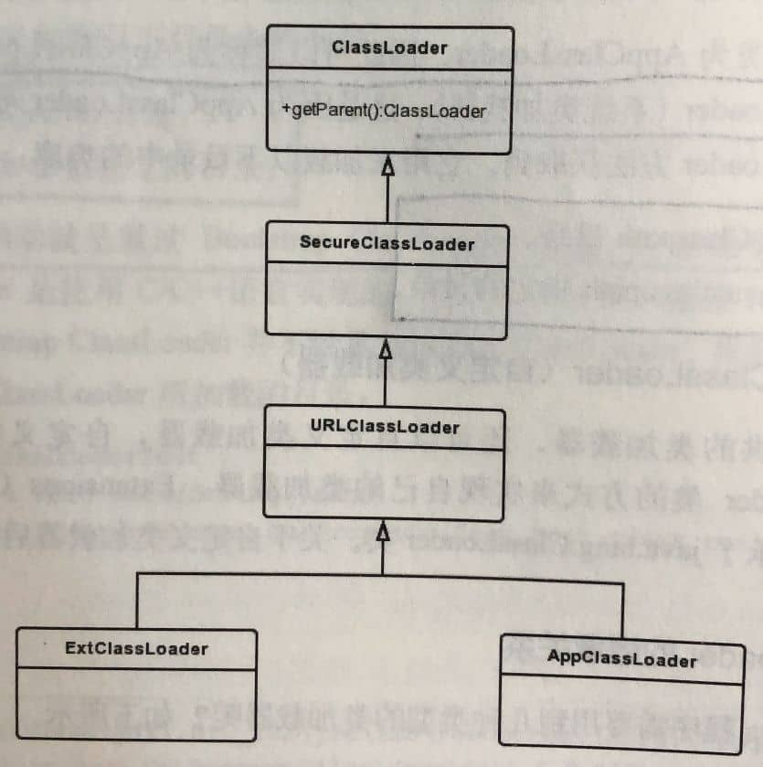

https://www.jianshu.com/p/7193600024e7

https://www.cnblogs.com/NeilZhang/p/8467721.html

https://www.jianshu.com/p/a620e368389a (good)

https://juejin.im/post/5a0ad2b551882531ba1077a2（good）

Java中的ClassLoader是加载class文件，而Android中的虚拟机无论是dvm还是art都只能识别dex文件。因此Java中的ClassLoader在Android中不适用。Android中的`java.lang.ClassLoader`这个类也不同于Java中的`java.lang.ClassLoader`。

Android平台上虚拟机运行的是Dex字节码，一种对class文件优化的产物，传统Class文件是一个Java源码文件会生成一个.class文件，而Android是把所有Class文件进行合并，优化，然后生成一个最终的class.dex，目的是把不同class文件重复的东西只需保留一份，如果我们的Android应用不进行分dex处理，最后一个应用的apk只会有一个dex文件。 

和java虚拟机中不同的是BootClassLoader是ClassLoader内部类，由java代码实现而不是c++实现，是Android平台上所有ClassLoader的最终parent，这个内部类是包内可见，所以我们没法使用。

- PathClassLoader是用来加载Android系统类和应用的类。PathClassLoader是用来加载Android系统类和应用的类，并且不建议开发者使用。 
- DexClassLoader支持加载APK、DEX和JAR，也可以从SD卡进行加载。


PathClassLoader用来操作本地文件系统中的文件和目录的集合。并不会加载来源于网络中的类。Android采用这个类加载器一般是用于加载系统类和它自己的应用类。这个应用类放置在data/data/包名下。 

DexClassLoader可以加载一个未安装的APK，也可以加载其它包含dex文件的JAR/ZIP类型的文件。DexClassLoader需要一个对应用私有且可读写的文件夹来缓存优化后的class文件。而且一定要注意不要把优化后的文件存放到外部存储上，避免使自己的应用遭受代码注入攻击。

> Android中具体负责类加载的并不是哪个ClassLoader，而是通过DexFile的defineClassNative()方法来加载的。 

通过观察PathClassLoader与DexClassLoader的源码我们就可以确定，真正有意义的处理逻辑肯定在BaseDexClassLoader中 。

```java
public class BaseDexClassLoader extends ClassLoader {
    ...
    public BaseDexClassLoader(String dexPath， File optimizedDirectory， String libraryPath， ClassLoader parent){
        super(parent);
        this.pathList = new DexPathList(this， dexPath， libraryPath， optimizedDirectory);
    }
    ...
}
```

- dexPath：要加载的程序文件（一般是dex文件，也可以是jar/apk/zip文件）所在目录。
- optimizedDirectory：dex文件的输出目录（因为在加载jar/apk/zip等压缩格式的程序文件时会解压出其中的dex文件，该目录就是专门用于存放这些被解压出来的dex文件的）。
- libraryPath：加载程序文件时需要用到的库路径。
- parent：父加载器

> 上面说到的"程序文件"这个概念是我自己定义的，因为从一个完整App的角度来说，程序文件指定的就是apk包中的classes.dex文件；但从热修复的角度来看，程序文件指的是补丁。 

DexPathList的构造函数是将一个个的程序文件（可能是dex、apk、jar、zip）封装成一个个Element对象，最后添加到Element集合中。 

结合DexPathList的构造函数，其实DexPathList的findClass()方法很简单，就只是对Element数组进行遍历，一旦找到类名与name相同的类时，就直接返回这个class，找不到则返回null。 

> 为什么是调用DexFile的loadClassBinaryName()方法来加载class？这是因为一个Element对象对应一个dex文件，而一个dex文件则包含多个class。也就是说Element数组中存放的是一个个的dex文件，而不是class文件！！！这可以从Element这个类的源码和dex文件的内部结构看出。

数组的遍历是有序的，假设有两个dex文件存放了二进制名称相同的Class，类加载器肯定就会加载在放在数组前面的dex文件中的Class。现在很多热修复技术就是把修复的dex文件放在DexPathList中Element[]数组的前面，这样就实现了修复后的Class抢先加载了，达到了修改bug的目的。

> 热修复基本原理

# 个人总结

BaseDexClassLoader中有个pathList对象，pathList中包含一个DexFile的数组dexElements ，dexPath传入的原始dex(.apk，.zip，.jar等)文件在optimizedDirectory文件夹中生成相应的优化后的odex文件，dexElements数组就是这些odex文件的集合，对于类加载呢，就是遍历这个集合。

# Java中的ClassLoader

类加载子系统的主要作用就是通过多种类加载器(ClassLoader)来查找和加载Class文件到Java虚拟机中。

## ClassLoader的类型

Java中的类加载器主要有两种类型，即系统类加载器和自定义类加载器。其中系统类加载器包括3种，分别是Bootstrap ClassLoader、Extensions ClassLoader和Application ClassLoader。

1. **Bootstrap ClassLoader(引导类加载器)**
    C/C++代码实现的加载器，用于加载指定的JDK的核心类库，比如`java.lang.`，`java.util.`等这些系统类。它用来加载以下目录中的类库：

  -   `$JAVA_HOME/jre/lib`目录。
  -   `-Xbootclasspath`参数指定的目录。

Java虚拟机的启动就是通过Bootstrap ClassLoader创建一个初始类来完成的。由于Bootstrap ClassLoader是使用C/C++语言实现的，所以该加载器不能被Java代码访问到。
Bootstrap ClassLoader并不继承`java.lang.ClassLoader`。

2. **Extensions ClassLoader(拓展类加载器)**
    Java中的实现类为ExtClassLoader，因此可以简称为ExtClassLoader，它用于加载Java的拓展类，提供除了系统类之外的额外功能。ExtClassLoader用来加载以下目录中的类库：

  -   加载`$JAVA_HOME/jre/lib/ext`目录。
  -   系统属性`java.ext.dir`所指定的目录。

3. **Application ClassLoader(应用程序类加载器)**
    Java中的实现类为AppClassLoader，因此可以简称为AppClassLoader同时它又可以称作System ClassLoader(系统类加载器)，这是因为AppClassLoader可以通过ClassLoader的getSystemCassLoader方法获取到。它用来加载以下目录中的类库：

  -   当前程序的Classpath目录。
  -   系统属性`java.class.path`指定的目录

4. **Custom ClassLoader(自定义类加载器)**
    除了系统提供的类加载器，还可以自定义类加载器，自定义类加载器通过继承`java.lang.ClassLoader`类的方式来实现自己的类加载器，`Extensions ClassLoader`和`AppClassLoader`也继承了`java.lang.ClassLoader`类。

## ClassLoader的继承关系

```java
public static void main(String[] args) {
    ClassLoader loader = Main.class.getClassLoader();

    while (loader != null) {
        System.out.println(loader);
        loader = loader.getParent();
    }
}
```

```
sun.misc.Launcher$AppClassLoader@18b4aac2
sun.misc.Launcher$ExtClassLoader@7f31245a
```



-   ClassLoader是一个抽象类，其中定义了ClassLoader的主要功能。
-   SecureClassLoader继承了抽象类ClassLoader，但SecureClassLoader并不是ClassLoader的实现类，而是拓展了ClassLoader类，加入了权限方面的功能，加强ClassLoader的安全性。
-   URLClassLoader继承自SecureClassLoader，可以通过URL路径从jar文件和文件夹中加载类和资源。
-   ExtClassLoader和AppClassLoader都继承自URLClassLoader，它们都是Launcher的内部类，Launcher是Java虚拟机的入口应用，ExtClassLoader和AppClassLoader都是在Launcher中进行初始化的。

## 双亲委托模式

类加载器查找Class所采用的是双亲委托模式，所谓双亲委托模式就是首先判断该Class是否已经加载，如果没有则不是自身去查找而是委托给父加载器进行查找，这样依次进行递归，直到委托到最顶层的Bootstrap ClassLoader，如果Bootstrap ClassLoader找到了该Class，就会直接返回，如果没找到，则继续依次向下查找，如果还没找到则最后会交由自身去查找。


类加载子系统用来查找和加载Class文件到Java虚拟机中，假设要加载一个位于D盘的Class文件，这时系统所提供的类加载器不能满足条件，这时就需要自定义类加载器继承自`java.lang.ClassLoader`，并复写它的findClass方法。加载D盘的Class文件步骤如下：

1.  自定义类加载器首先从缓存中查找Class文件是否已经加载，如果已经加载就返回该Class，如果没加载则委托给父加载器也就是AppClassLoader。
2.  按照图中虚线的方向递归步骤1。
3.  一直委托到Bootstrap ClassLoader，如果Bootstrap ClassLoader查找缓存也没有加载Class文件，则在`$JAVA_HOME/jre/lib`目录中或者`--Xbootclasspath`参数指定的目录中进行查找，如果找到就加载并返回该Class，如果没有找到则交给子加载器ExtClassLoader。
4.  ExtClassLoader在`$JAVA_HOME/jre/lib/ext`目录中或者系统属性`java.ext.dir`所指定的目录中进行查找，如果找到就加载并返回，找不到则交给AppClassLoader。
5.  AppClassLoader在Classpath目录中或者系统属性`java.class.path`指定的目录中进行查找，如果找到就加载并返回，找不到交给自定义的类加载器，如果还找不到则抛出异常。

总的来说就是Class文件加载到类加载子系统后，先沿着图中虚线的方向自下而上进行委托，再沿着实线的方向自上而下进行查找和加载，整个过程就是先上后下。结合ClassLoader的继承关系，可以得出ClassLoader的父子关系并不是使用继承来实现的，而是使用组合来实现代码复用的。

**采取双亲委托模式主要有如下两点好处：**

-   避免重复加载，如果已经加载过一次Class，就不需要再次加载，而是直接读取已经加载的Class。
-   更加安全，如果不使用双亲委托模式，就可以自定义一个String类来替代系统的String类，这显然会造成安全隐患，采用双亲委托模式会使得系统的String类在Java虚拟机启动时就被加载，也就无法自定义String类来替代系统的String类，除非修改类加载器搜索类的默认算法。还有一点，只有两个类名一致并且被同一个类加载器加载的类，Java虚拟机才会认为它们是同一个类。

## 自定义ClassLoader

系统提供的类加载器只能够加载指定目录下的jar包和Class文件，如果想要加载网络上的或者本地某一文件中的jar包和Class文件则需要自定义ClassLoader。

实现自定义ClassLoader需要如下两个步骤：

1.  定义一个自定义ClassLoader并继承抽象类ClassLoader。
2.  复写findClass方法，并在findClass方法中调用defineClass方法。

先定义一个测试的java文件：

```java
package com.mezzsy.learnsomething.java.classloaderdemo;

class Coder {
    void say() {
        System.out.println("Hello World!");
    }
}
```

将此文件放入DownLoads目录，执行`javac Coder.java`进行编译，然后编写自定义ClassLoader：

```java
package com.mezzsy.learnsomething.java.classloaderdemo;

import java.io.ByteArrayOutputStream;
import java.io.File;
import java.io.FileInputStream;
import java.io.IOException;
import java.io.InputStream;
import java.lang.reflect.Constructor;
import java.lang.reflect.InvocationTargetException;
import java.lang.reflect.Method;

class MyClassLoader extends ClassLoader {
    private String mPath;

    public MyClassLoader(String path) {
        mPath = path;
    }

  	//测试
    @SuppressWarnings("unchecked")
    public static void main(String[] args) {
        MyClassLoader classLoader = new MyClassLoader("/Users/mezzsy/Downloads/");
        try {
            Class coderClass = classLoader.loadClass("com.mezzsy.learnsomething.java.classloaderdemo.Coder");
            if (coderClass != null) {
                Constructor constructor = coderClass.getDeclaredConstructor();
                constructor.setAccessible(true);
                Object o = constructor.newInstance();
                Method method = coderClass.getDeclaredMethod("say");
                method.setAccessible(true);
                method.invoke(o);
            }
        } catch (ClassNotFoundException |
                IllegalAccessException |
                InstantiationException |
                NoSuchMethodException |
                InvocationTargetException e) {
            e.printStackTrace();
        }
    }

    @Override
    protected Class<?> findClass(String name) throws ClassNotFoundException {
        Class clazz = null;
        byte[] classData = loadClassData(name);
        if (classData == null) {
            throw new ClassNotFoundException();
        } else {
          	//调用define方法将字节码数组转为Class示例
            clazz = defineClass(name, classData, 0, classData.length);
        }
        return clazz;
    }

  	/**
     * 获取class文件的字节码数组
     * @param name
     * @return
     */
    private byte[] loadClassData(String name) {
        String fileName = getFileName(name);
        File file = new File(mPath, fileName);
        InputStream in = null;
        ByteArrayOutputStream out = null;
        try {
            in = new FileInputStream(file);
            out = new ByteArrayOutputStream();

            byte[] bytes = new byte[1024];
            int len;
            while ((len = in.read(bytes)) != -1) {
                out.write(bytes, 0, len);
            }
            return out.toByteArray();
        } catch (IOException e) {
            e.printStackTrace();
        } finally {
            if (out != null) {
                try {
                    out.close();
                } catch (IOException e) {
                    e.printStackTrace();
                }
            }
            if (in != null) {
                try {
                    in.close();
                } catch (IOException e) {
                    e.printStackTrace();
                }
            }
        }
        return null;
    }

    private String getFileName(String name) {
        int index = name.lastIndexOf('.');
        if (index == -1) {
            return name + ".class";
        } else {
            return name.substring(index + 1) + ".class";
        }
    }
}
```

输出结果：

```
Hello World!
```

# Android中的ClassLoader

因为Android中的虚拟机和Java虚拟机不太一样，所以Android的ClassLoader与Java的也有区别。

## ClassLoader的类型

Android也分为系统类加载器和自定义类加载器。其中系统类加载器主要包括BootClassLoader、PathClassLoader和DexClassLoader。

1.  **BootClassLoader**
    Android系统启动时会使用BootClassLoader来预加载常用类，与SDK中的Bootstrap ClassLoader不同，它并不是由C/C++代码实现的，而是由Java实现的，BootClassLoader是ClassLoader的内部类，并继承自ClassLoader。

2.  **DexClassLoader**
    DexClassLoader可以加载dex文件以及包含dex的压缩文件(apk和jar文件)，不管加载哪种文件，最终都要加载dex文件。
      DexClassLoader的构造方法有如下4个参数：

  -   dexPath：dex相关文件路径集合，多个路径用文件分隔符分隔，默认文件分隔符为“:”。
  -   optimizedDirectory：解压的dex文件存储路径，这个路径必须是一个内部存储路径，在一般情况下，使用当前应用程序的私有路径：`/data/data/<Package Name/...`
  -   librarySearchPath：包含C/C++库的路径集合，多个路径用文件分隔符分隔，可以为null。
  -   parent：父加载器。

DexClassLoader继承自BaseDexClassLoader，方法都在BaseDexClassLoader中实现。

3. **PathClassLoader**
    Android系统使用PathClassLoader来加载系统类和应用程序的类。PathClassLoader继承自BaseDexClassLoader，也都在BaseDexClassLoader中实现。在PathClassLoader的构造方法中没有参数optimizedDirectory，这是因为PathClassLoader已经默认了参数optimizedDirectory的值为`/data/dalvik-cache`，PathClassLoader无法定义解压的dex文件存储路径，因此PathClassLoader通常用来加载已经安装的apk的dex文件(安装的apk的dex文件会存储在`/data/dalvik-cache`中)。

### 小结

**DexClassLoader和PathClassLoader的区别**

从下面的log中可以看出，Acticity的加载只涉及到了PathClassLoader和BootClassLoader，DexClassLoader是做什么的？

1.  DexClassLoader可以加载jar/apk/dex，可以从SD卡中加载未安装的apk
2.  PathClassLoader只能加载系统中已经安装过的apk

## ClassLoader的继承关系

```java
protected void onCreate(Bundle savedInstanceState) {
    super.onCreate(savedInstanceState);
    setContentView(R.layout.activity_d38);
    ClassLoader classLoader = D38Activity.class.getClassLoader();
    while (classLoader != null) {
        Log.d(TAG, classLoader.toString());
        classLoader = classLoader.getParent();
    }
}
```

log：

```
D/D38Activity: dalvik.system.PathClassLoader[DexPathList[[zip file "/data/app/com.mezzsy.myapplication-TIh5Su8UFr1OqfYo6W1tyw==/base.apk"],nativeLibraryDirectories=[/data/app/com.mezzsy.myapplication-TIh5Su8UFr1OqfYo6W1tyw==/lib/arm64, /data/app/com.mezzsy.myapplication-TIh5Su8UFr1OqfYo6W1tyw==/base.apk!/lib/arm64-v8a, /system/lib64, /vendor/lib64, /product/lib64]]]
D/D38Activity: java.lang.BootClassLoader@4abfb82
```

可以看到有两种类加载器：一种是PathClassLoader，另一种是BootClassLoader


一共有8个ClassLoader相关类，其中有一些和Java中的ClassLoader相关类十分类似：

-   ClassLoader是一个抽象类， 其中定义了ClassLoader的主要功能。BootClassLoader是它的内部类。
-   SecureClassLoader类和JDK8中的SecureClassLoader类的代码是一样的，它继承了抽象类ClassLoader。SecureClassLoader主要是拓展了ClassLoader类加入了权限方面的功能，加强ClassLoader的安全性。
-   URLClassLoader类和JDK8中的URLClassLoader类的代码是一样的，它继承自SecureClassLoader，用来通过URL路径从jar文件和文件夹中加载类和资源。
-   InMemoryDexClassLoader是Android8.0新增的类加载器，继承自BaseDexClassLoader，用于加载内存中的dex文件。
-   BaseDexClassLoader继承自ClassLoader，是抽象类ClassLoader的具体实现类，PathClassLoader、DexClassLoader和InMemoryDexClassLoader都继承自它。

## ClassLoader的加载过程

Android的类加载也遵循双亲委托模型，加载方法为loadClass：

### **ClassLoader#loadClass**

```java
public Class<?> loadClass(String name) throws ClassNotFoundException {
    return loadClass(name, false);
}
```

```java
protected Class<?> loadClass(String name, boolean resolve) throws ClassNotFoundException {
        // 检查类是否加载
        Class<?> c = findLoadedClass(name);
        if (c == null) {
            try {
              	//判断父加载器是否存在，存在就调用父加载器的loadClass，否则就调用findBootstrapClassOrNull方法，这个方法直接返回null。
                if (parent != null) {
                    c = parent.loadClass(name, false);
                } else {
                    c = findBootstrapClassOrNull(name);
                }
            } catch (ClassNotFoundException e) {
            }

          	//如果为null，就表示向上委托的类加载没有完成，就会执行这里的findClass方法。
            if (c == null) {
                c = findClass(name);
            }
        }
        return c;
}
```

解析见注释。

### **ClassLoader#findClass**

findClass直接抛出异常，此方法需要在子类中进行重写。

```java
protected Class<?> findClass(String name) throws ClassNotFoundException {
    throw new ClassNotFoundException(name);
}
```

#### **BaseDexClassLoader#findClass**

```java
public class BaseDexClassLoader extends ClassLoader {
    private final DexPathList pathList;

    public BaseDexClassLoader(String dexPath, File optimizedDirectory, String librarySearchPath, ClassLoader parent) {
        super(parent);
        this.pathList = new DexPathList(this, dexPath, librarySearchPath, null);
				//...
    }

    @Override
    protected Class<?> findClass(String name) throws ClassNotFoundException {
        List<Throwable> suppressedExceptions = new ArrayList<Throwable>();
        Class c = pathList.findClass(name, suppressedExceptions);
        if (c == null) {
            ClassNotFoundException cnfe = new ClassNotFoundException("Didn't find class \"" + name + "\" on path: " + pathList);
            for (Throwable t : suppressedExceptions) {
                cnfe.addSuppressed(t);
            }
            throw cnfe;
        }
        return c;
    }
}
```

在BaseDexClassLoader构造方法中创建了DexPathList对象，并且任务交给DexPathList的findClass方法。

#### **DexPathList#findClass**

```java
public Class<?> findClass(String name, List<Throwable> suppressed) {
    for (Element element : dexElements) {
        Class<?> clazz = element.findClass(name, definingContext, suppressed);
        if (clazz != null) {
            return clazz;
        }
    }

    if (dexElementsSuppressedExceptions != null) {
        suppressed.addAll(Arrays.asList(dexElementsSuppressedExceptions));
    }
    return null;
}
```

Element是DexPathList的内部类，其封装了DexFile（用于加载Dex文件）

```java
static class Element {
    private final File path;
    private final DexFile dexFile;
    private ClassPathURLStreamHandler urlHandler;
    private boolean initialized;

		//。。。

    public Class<?> findClass(String name, ClassLoader definingContext, List<Throwable> suppressed) {
      	//如果dexFile不为null就调用dexFile的loadClassBinaryName方法
        return dexFile != null ? dexFile.loadClassBinaryName(name, definingContext, suppressed) : null;
    }
}
```

#### **DexFile#loadClassBinaryName**

```java
public Class loadClassBinaryName(String name, ClassLoader loader, List<Throwable> suppressed) {
    return defineClass(name, loader, mCookie, this, suppressed);
}
```

```java
private static Class defineClass(String name, ClassLoader loader, Object cookie, DexFile dexFile, List<Throwable> suppressed) {
    Class result = null;
    try {
      	//这里调用defineClassNative方法来加载dex文件，这是一个native方法
        result = defineClassNative(name, loader, cookie, dexFile);
    } catch (NoClassDefFoundError e) {
        if (suppressed != null) {
            suppressed.add(e);
        }
    } catch (ClassNotFoundException e) {
        if (suppressed != null) {
            suppressed.add(e);
        }
    }
    return result;
}
```

### 小结

Android的ClassLoader也遵循了双亲委托模式，如果类已经加载，那么直接返回，如果没有加载，交给父加载器加载。重复此过程一直到加载完成，如果还没有加载完成，那么抛出ClassNotFoundException异常。

## BootClassLoader的创建

具体分析略，这里直接说结论。

BootClassLoader是在ZygoteInit入口方法中被创建的，用于加载preloaded-classes文件中存有的预加载类。

## PathClassLoader的创建

PathClassLoader是在系统服务进程（SystemServer）中创建的。

# 总结

-   Java的引导类加载器是由C++编写的，Android中的引导类加载器则是用Java编写的
-   Android的继承关系要比Java继承关系复杂一些，提供的功能也多。
-   由于Android中加载的不再是Class文件，因此Android中没有ExtClassLoader和
    AppClassLoader，替代它们的是PathClassoader和DexClassLoader。

