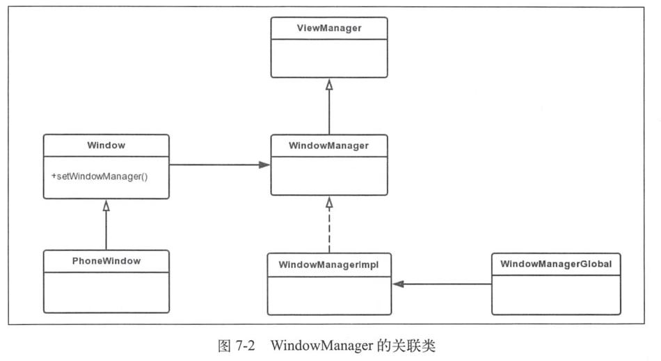
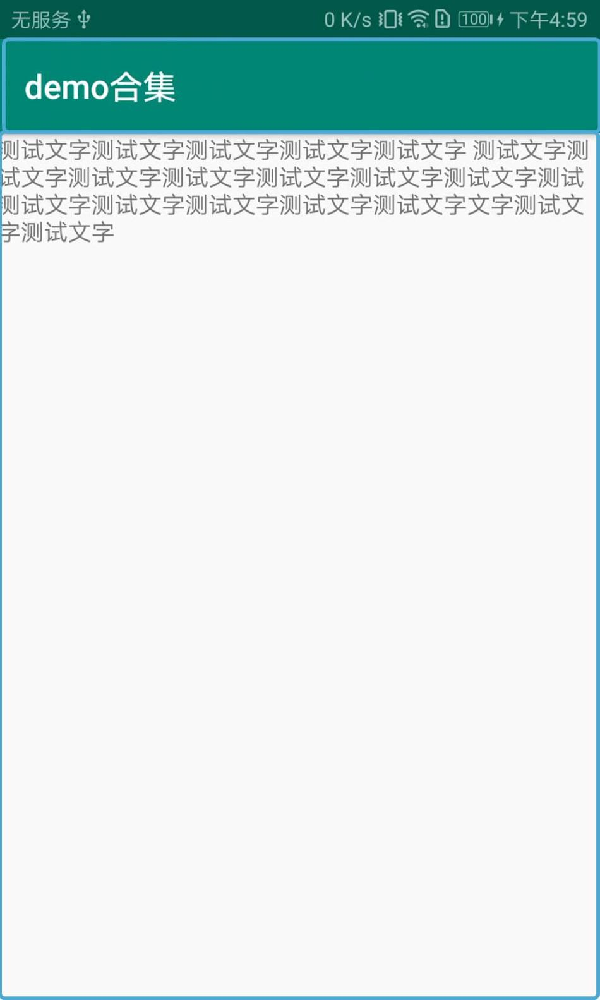

# 概述

Surface系统主要处理：

-   应用程序和Surface的关系。
-   Surface和SurfaceFlinger之间的关系。


-   不论是使用Skia绘制二维图像，还是用OpenGL绘制三维图像，最终Application都要和Surface交互。Surface就像是UI的画布，而App则像是在Surface上作画。

-   Surface向SurfaceFlinger提供数据，而SurfaceFlinger则混合数据。

# Activity的显示

## Activity的创建

一般会在Activity的onCreate回调中设置视图：setContentView。

```java
public void setContentView(@LayoutRes int layoutResID) {
    getWindow().setContentView(layoutResID);
    initWindowDecorActionBar();
}
```

setContentView出现了两个和UI有关系的类：View和Window。

-   Window是一个抽象基类，用于控制顶层窗口的外观和行为。作为顶层窗口它有什么特殊的职能呢？即绘制背景和标题栏、默认的按键处理等。
-   View是一个基本的UI单元，占据屏幕的一块矩形区域，可用于绘制，并能处理事件。

### Window的创建

Window是一个抽象类 ，它的具体实现类为PhoneWindow。在Activity启动过程中会调用ActivityThread的performLaunchActivity方法，performLaunchActivity方法中又会调用Activity的attach方法，PhoneWindow就是在Activity的attach方法中创建的。

```java
final void attach(Context context, ActivityThread aThread, Instrumentation instr, IBinder token, int ident, Application application, Intent intent, ActivityInfo info, CharSequence title, Activity parent, String id, NonConfigurationInstances lastNonConfigurationInstances, Configuration config, String referrer, IVoiceInteractor voiceInteractor, Window window, ActivityConfigCallback activityConfigCallback) {
    //...
    //创建Window，mWindow是Activity的成员变量，说明一个Activity对应一个Window
    mWindow = new PhoneWindow(this, window, activityConfigCallback);
    //...
    //Window关联WindowManager
    mWindow.setWindowManager((WindowManager)context.getSystemService(Context.WINDOW_SERVICE), mToken, mComponent.flattenToString(), (info.flags & ActivityInfo.FLAG_HARDWARE_ACCELERATED) != 0);
    //...
}
```

这里创建了一个PhoneWindow ，并调用setWindowManager方法设置一个Manager。

### WindowManager的创建

在Window关联WM时会调用setWindowManager方法。

```java
public void setWindowManager(WindowManager wm, IBinder appToken, String appName, boolean hardwareAccelerated) {
    mAppToken = appToken;
    mAppName = appName;
    mHardwareAccelerated = hardwareAccelerated || SystemProperties.getBoolean(PROPERTY_HARDWARE_UI, false);
    if (wm == null) {
        //类型为WindowManagerImpl
        wm = (WindowManager)mContext.getSystemService(Context.WINDOW_SERVICE);
    }
    mWindowManager = ((WindowManagerImpl)wm).createLocalWindowManager(this);
}
```

这里会获取一个WindowManagerImpl实例，是WindowManager的具体实现。

setWindowManager方法会调用createLocalWindowManager方法，createLocalWindowManager同样也是创建新的WindowManagerImpl，不同的是这次创建WindowManagerlmpl时将创建它的Window作为参数传了进来，**这WindowManagerImpl就持有了Window的引用，可以对Window进行操作**。如addView方法：

```java
public void addView(@NonNull View view, @NonNull ViewGroup.LayoutParams params) {
    applyDefaultToken(params);
    mGlobal.addView(view, params, mContext.getDisplay(), mParentWindow);
}
```

调用了WindowManagerGlobal的addView 方法，其中最后一个参数mParentWindow就是上面提到的Window，可以看出WindowManagerlmpl虽然是WindowManager的实现类，但是没有实现什么功能，而是将功能实现委托给了WindowManagerGlobal。

```java
public final class WindowManagerImpl implements WindowManager {
    //WindowManagerGlobal 是一个单例，说明在一个进程中只有一个WindowManagerGlobal实例。
    private final WindowManagerGlobal mGlobal = WindowManagerGlobal.getInstance();
    private final Context mContext;
    private final Window mParentWindow;//注释2
        //...
    private WindowManagerImpl(Context context, Window parentWindow) {
        mContext = context;
        mParentWindow = parentWindow;//注释3
    }
      //...
}
```

注释2处的代码结合注释3处的代码说明这个WindowManagerlmpl实例会作为哪个Window的子Window，这也就说明在一个进程中WindowManagerlmpl可能会有多个实例。

WindowManager的关联类如图所示：



### DecorView

Window是以View的形式存在的，所以Activity里的Window也需要一个View，这个View就是DecorView，它分为title部分和content部分：



content部分一般是在onCreate里通过setContentView来设置的，里面会调用getDecorView方法：

```java
//PhoneWindow.java
@Override
public final View getDecorView() {
    if (mDecor == null || mForceDecorInstall) {
        installDecor();
    }
    return mDecor;
}
```

当不存在DecorView就会创建一个。即使没有在onCreate调用setContentView方法，最终也会创建DecorView。performLaunchActivity执行完，界面要与用户进行交互时，会调用ActivityThread的handleResumeActivity方法：

```java
final void handleResumeActivity(IBinder token, boolean clearHide, boolean isForward, boolean reallyResume, int seq, String reason) {
    //...
    r = performResumeActivity(token, clearHide, reason);//performResumeActivity方法最终会调用Activity的onResume方法
        //...
        if (r.window == null && !a.mFinished && willBeVisible) {
            r.window = r.activity.getWindow();
            View decor = r.window.getDecorView();
            decor.setVisibility(View.INVISIBLE);
            ViewManager wm = a.getWindowManager();//得到ViewManager类型的wm对象
            WindowManager.LayoutParams l = r.window.getAttributes();
            a.mDecor = decor;
            l.type = WindowManager.LayoutParams.TYPE_BASE_APPLICATION;
            l.softInputMode |= forwardBit;
            if (r.mPreserveWindow) {
                a.mWindowAdded = true;
                r.mPreserveWindow = false;
                ViewRootImpl impl = decor.getViewRootImpl();
                if (impl != null) {
                    impl.notifyChildRebuilt();
                }
            }
            if (a.mVisibleFromClient) {
                if (!a.mWindowAdded) {
                    a.mWindowAdded = true;
                    wm.addView(decor, l);//调用了ViewManager的addView方法，而addView方法则是在WindowManagerlmpl中实现的，此后的过程在上面的系统窗口的添加过程中已经讲过，唯一需要注意的是ViewManager的addView方法的第一个参数为DecorView，这说明Acitivty窗口中会包含DecorView。
                } else {
                    a.onWindowAttributesChanged(l);
                }
            }
            //...
}
```

在handleResumeActivity方法中会获取DecorView（如果没有就创建），并通过WM的addView展现出来。这样Activity的Window是以DecorView的形式展现的。

### ViewRootImpl

在WM的addView时会创建ViewRootImpl，然后调用ViewRootImpl的setView。

```java
public void setView(View view, WindowManager.LayoutParams attrs, View panelParentView,
                    int userId) {
    synchronized (this) {
        if (mView == null) {
            mView = view;

            // Schedule the first layout -before- adding to the window
            // manager, to make sure we do the relayout before receiving
            // any other events from the system.
            requestLayout();
            
            try {
                // ...
                res = mWindowSession.addToDisplayAsUser(mWindow, mSeq, mWindowAttributes,
                        getHostVisibility(), mDisplay.getDisplayId(), userId, mTmpFrame,
                        mAttachInfo.mContentInsets, mAttachInfo.mStableInsets,
                        mAttachInfo.mDisplayCutout, inputChannel,
                        mTempInsets, mTempControls);
                // ...
            } catch (RemoteException e) {
                // ...
            } finally {
                // ...
            }
	}
}
```

ViewRootImpl主要做这些事：

-   View树的根并管理View树。（代码中的mView，即DecorView）
-   触发View的测量、布局和绘制。（requestLayout）
-   输入事件的中转站。
-   管理Surface。
-   负责与WMS进行进程间通信。

### ViewRootImpl和WMS的交互

frameworks/base/services/core/java/com/android/server/wm/Session.java

```java
public int addToDisplayAsUser(IWindow window, int seq, WindowManager.LayoutParams attrs,
                              int viewVisibility, int displayId, int userId, Rect outFrame,
                              Rect outContentInsets, Rect outStableInsets,
                              DisplayCutout.ParcelableWrapper outDisplayCutout, InputChannel outInputChannel,
                              InsetsState outInsetsState, InsetsSourceControl[] outActiveControls) {
    return mService.addWindow(this, window, seq, attrs, viewVisibility, displayId, outFrame,
            outContentInsets, outStableInsets, outDisplayCutout, outInputChannel,
            outInsetsState, outActiveControls, userId);
}
```

然后调用WMS的addWindow：

```java
public int addWindow(Session session, IWindow client, int seq,
                     LayoutParams attrs, int viewVisibility, int displayId, Rect outFrame,
                     Rect outContentInsets, Rect outStableInsets,
                     DisplayCutout.ParcelableWrapper outDisplayCutout, InputChannel outInputChannel,
                     InsetsState outInsetsState, InsetsSourceControl[] outActiveControls,
                     int requestUserId) {
    // ...
    synchronized (mGlobalLock) {
        // ...
        final WindowState win = new WindowState(this, session, client, token, parentWindow,
                appOp[0], seq, attrs, viewVisibility, session.mUid, userId,
                session.mCanAddInternalSystemWindow);
        // ...
        win.attach();
        // ...
    }
	// ...
    return res;
}
```

frameworks/base/services/core/java/com/android/server/wm/WindowState.java

```java
void attach() {
    // mSession是Session类型
    mSession.windowAddedLocked(mAttrs.packageName);
}
```

```java
void windowAddedLocked(String packageName) {
    // ...
    if (mSurfaceSession == null) {
        // ...
        mSurfaceSession = new SurfaceSession();
        // ...
    }
    mNumWindow++;
}
```

ViewRootImpl通过IWindowSession与WMS联系，而WMS通过W与ViewRootImpl联系。W是ViewRootImpl的内部静态类，是一个Binder类型。

IWindowSession.aidl的描述：

```
System private per-application interface to the window manager.
```

每个App进程都会和WMS建立一个IWindowSession会话。这个会话被App进程用于和WMS通信。

IWindow.aidl的描述：

```
API back to a client window that the Window Manager uses to inform it of interesting things happening.
```

大意是IWindow是WMS用来进行事件通知的。每当发生一些事情时，WMS就会把这些事情告诉某个IWindow。可以把IWindow想象成一个回调函数。比如按键、触屏等事件。

那么，一个按键事件是如何被分发的呢？下面是它大致的流程：

1.   WMS所在的SystemServer进程接收到按键事件。
2.   WMS找到UI位于屏幕顶端的进程所对应的IWindow对象，这是一个Bp端对象。
3.   调用这个IWindow对象的dispatchKey。IWindow对象的Bn端位于ViewRoot中，ViewRootImpl再根据内部View的位置信息找到真正处理这个事件的View，最后调用dispatchKey函数完成按键的处理。

### Surface

View、DecorView等都是UI单元，这些UI单元的绘画工作都在onDraw函数中完成。如果把onDraw想象成画图过程，那么画布是什么？这块画布就是Surface。SDK文档对Surface类的说明是：

```
Handle onto a raw buffer that is being managed by the screen compositor.
```

这句话的意思是：

-   有一块Raw buffer（内存/显存）
-   Surface操作这块Raw buffer
-   screen compositor（SurfaceFlinger）管理这块Raw buffer。

Surface和SF、ViewRootImpl的关系：


## Activity的UI绘制

ViewRoot的setView函数中会有一个requestLayout：

```java
public void requestLayout() {
    if (!mHandlingLayoutInLayoutRequest) {
        //...
        scheduleTraversals();
    }
}
```

```java
void scheduleTraversals() {
    if (!mTraversalScheduled) {
        // ...
        mChoreographer.postCallback(
                Choreographer.CALLBACK_TRAVERSAL, mTraversalRunnable, null);
        // ...
    }
}
```

Choreographer用于接收显示系统的VSync信号，在下一个帧渲染时控制执行一些操作。Choreographer的postCallback方法用于发起添加回调，这个添加的回调将在下一帧被渲染时执行。这个添加的回调是TraversalRunnable类型的mTraversalRunnable：

```java
final class TraversalRunnable implements Runnable {
    @Override
    public void run() {
        doTraversal();
    }
}
```

```java
void doTraversal() {
    if (mTraversalScheduled) {
        // ...
        performTraversals();
        // ...
    }
}
```

```java
private void performTraversals() {
        //...
    relayoutResult = relayoutWindow(params, viewVisibility, insetsPending);//relayoutWindow方法内部会调用IWindowSession的relayout方法来更新Window视图，最终会调用WMS的relayoutWindow方法。
        //。。。

    if (!mStopped || mReportNextDraw) {
          //。。
        int childWidthMeasureSpec = getRootMeasureSpec(mWidth, lp.width);
        int childHeightMeasureSpec = getRootMeasureSpec(mHeight, lp.height);
        performMeasure(childWidthMeasureSpec, childHeightMeasureSpec);//注释2
    }

    if (didLayout) {
          //。。。
        performLayout(lp, mWidth, mHeight);//注释3
    }

    if (!cancelDraw && !newSurface) {
          //。。。
        performDraw();//注释4
    }
}
```

performTraversals方法会在注释2、3、4处分别调用performMeasure、performLayout和performDraw方法，这样就完成了View的工作流程。

## 总结

1.   Activity的顶层View是DecorView，在onCreate函数中通过setContentView设置的View只不过是这个DecorView中的一部分（Content）。DecorView是一个FrameLayout类型。
2.   Activity和UI有关，它包含一个Window（真实类型是PhoneWindow）和一个WindowManager（真实类型是WindowManagerImpl）对象。这两个对象将控制整个Activity
3.   ViewRootImpl实现了ViewParent接口，它有两个重要的成员变量，一个是mView，它指向Activity顶层UI单元的DecorView，另外一个是mSurface，这个Surface包含了一个Canvas。除此之外，ViewRootImpl还通过Binder系统和WindowManagerService进行了跨进程交互。
4.   整个Activity的绘图流程就是从mSurface中lock一块Canvas，然后交给mView去自由发挥画画的才能，最后unlockCanvasAndPost释放这块Canvas。

# 简单分析Surface

## 和Surface有关的流程总结

先总结中和Surface有关的流程：

1.   在ViewRoot构造时，会创建一个Surface，它使用无参构造函数，代码如下所示：

     ```java
     public final Surface mSurface = new Surface();
     ```

2.   ViewRootImpl通过IWindowSession和WMS交互，而WMS中调用的一个attach函数会构造一个SurfaceSession。

     ```java
     void windowAddedLocked(String packageName) {
         // ...
         if (mSurfaceSession == null) {
             // ...
             mSurfaceSession = new SurfaceSession();
             // ...
         }
         mNumWindow++;
     }
     ```

3.   ViewRootImpl在performTraversals会调用IWindowSession的relayout。

4.   ViewRootImpl调用Surface的lockCanvas，得到一块画布。

5.   ViewRootImpl调用Surface的unlockCanvasAndPost释放这块画布。

## Surface的Java层分析

ViewRootImpl在performTraversals会调用IWindowSession的relayout：

ViewRootImpl的代码：

```java
private void performTraversals() {
    relayoutResult = relayoutWindow(params, viewVisibility, insetsPending);
}
```

```java
private int relayoutWindow(WindowManager.LayoutParams params, int viewVisibility,
        boolean insetsPending) throws RemoteException {
    int relayoutResult = mWindowSession.relayout(mWindow, mSeq, params,
            (int) (mView.getMeasuredWidth() * appScale + 0.5f),
            (int) (mView.getMeasuredHeight() * appScale + 0.5f), viewVisibility,
            insetsPending ? WindowManagerGlobal.RELAYOUT_INSETS_PENDING : 0, frameNumber,
            mTmpFrame, mPendingOverscanInsets, mPendingContentInsets, mPendingVisibleInsets,
            mPendingStableInsets, mPendingOutsets, mPendingBackDropFrame, mPendingDisplayCutout,
            mPendingMergedConfiguration, mSurfaceControl, mTempInsets);
    if (mSurfaceControl.isValid()) {
		mSurface.copyFrom(mSurfaceControl);
    } else {
		destroySurface();
    }
    return relayoutResult;
}
```

>   mWindowSession是IWindowSession类型，是一个Binder对象，其aidl文件为frameworks/base/core/java/android/view/IWindowSession.aidl，我尝试生成此文件对应的Java文件，但是没有成功。
>
>   书中提到，在IPC过程中，out并没有传入到服务端，而是传了一个空的对象。在服务端接收的onTransact回调方法中，创建了out对象。

frameworks/base/services/core/java/com/android/server/wm/Session.java的代码：

```java
public int relayout(IWindow window, int seq, WindowManager.LayoutParams attrs,
                    int requestedWidth, int requestedHeight, int viewFlags, int flags, long frameNumber,
                    Rect outFrame, Rect outContentInsets, Rect outVisibleInsets,
                    Rect outStableInsets, Rect outBackdropFrame,
                    DisplayCutout.ParcelableWrapper cutout, MergedConfiguration mergedConfiguration,
                    SurfaceControl outSurfaceControl, InsetsState outInsetsState,
                    InsetsSourceControl[] outActiveControls, Point outSurfaceSize,
                    SurfaceControl outBLASTSurfaceControl) {
    // ...
    int res = mService.relayoutWindow(this, window, seq, attrs,
            requestedWidth, requestedHeight, viewFlags, flags, frameNumber,
            outFrame, outContentInsets, outVisibleInsets,
            outStableInsets, outBackdropFrame, cutout,
            mergedConfiguration, outSurfaceControl, outInsetsState, outActiveControls,
            outSurfaceSize, outBLASTSurfaceControl);
    // ...
    return res;
}
```

frameworks/base/services/core/java/com/android/server/wm/WindowManagerService.java的代码：

```java
public int relayoutWindow(Session session, IWindow client, int seq, LayoutParams attrs,
                          int requestedWidth, int requestedHeight, int viewVisibility, int flags,
                          long frameNumber, Rect outFrame, Rect outContentInsets,
                          Rect outVisibleInsets, Rect outStableInsets, Rect outBackdropFrame,
                          DisplayCutout.ParcelableWrapper outCutout, MergedConfiguration mergedConfiguration,
                          SurfaceControl outSurfaceControl, InsetsState outInsetsState,
                          InsetsSourceControl[] outActiveControls, Point outSurfaceSize,
                          SurfaceControl outBLASTSurfaceControl) {
    
    synchronized (mGlobalLock) {
        final WindowState win = windowForClientLocked(session, client, false);
        if (shouldRelayout) {
            try {
                result = createSurfaceControl(outSurfaceControl, outBLASTSurfaceControl,
                        result, win, winAnimator);
            }
        }
    }
    return result;
}
```

```java
private int createSurfaceControl(SurfaceControl outSurfaceControl,
                                 SurfaceControl outBLASTSurfaceControl, int result,
                                 WindowState win, WindowStateAnimator winAnimator) {
    WindowSurfaceController surfaceController;
    try {
        // 创建本地的WindowSurfaceController对象，内部持有一个SurfaceControl对象
        surfaceController = winAnimator.createSurfaceLocked(win.mAttrs.type, win.mOwnerUid);
    }
    if (surfaceController != null) {
		surfaceController.getSurfaceControl(outSurfaceControl);
		surfaceController.getBLASTSurfaceControl(outBLASTSurfaceControl);
	} else {
       outSurfaceControl.release();
	}
    return result;
}
```

frameworks/base/services/core/java/com/android/server/wm/WindowStateAnimator.java的代码：

```java
WindowSurfaceController createSurfaceLocked(int windowType, int ownerUid) {
    final WindowState w = mWin;
    if (mSurfaceController != null) {
        return mSurfaceController;
    }
    // 。。。
    try {
        mSurfaceController = new WindowSurfaceController(attrs.getTitle().toString(), width,
                height, format, flags, this, windowType, ownerUid);
        // 。。。
    }
    // 。。。
    return mSurfaceController;
}
```

frameworks/base/services/core/java/com/android/server/wm/WindowSurfaceController.java

```java
WindowSurfaceController(String name, int w, int h, int format,
                        int flags, WindowStateAnimator animator, int windowType, int ownerUid) {
    // ...
    final SurfaceControl.Builder b = win.makeSurface()
            .setParent(win.getSurfaceControl())
            .setName(name)
            .setBufferSize(w, h)
            .setFormat(format)
            .setFlags(flags)
            .setMetadata(METADATA_WINDOW_TYPE, windowType)
            .setMetadata(METADATA_OWNER_UID, ownerUid)
            .setCallsite("WindowSurfaceController");
    mSurfaceControl = b.build();
    //。。。
}
```

```java
void getSurfaceControl(SurfaceControl outSurfaceControl) {
        outSurfaceControl.copyFrom(mSurfaceControl, "WindowSurfaceController.getSurfaceControl");
}
```

将本地的SurfaceControl信息拷贝到outSurfaceControl。

```java
public void copyFrom(@NonNull SurfaceControl other, String callsite) {
    mName = other.mName;
    mWidth = other.mWidth;
    mHeight = other.mHeight;
    mLocalOwnerView = other.mLocalOwnerView;
    // 主要调用了Native方法
    assignNativeObject(nativeCopyFromSurfaceControl(other.mNativeObject), callsite);
}
```

最后回到ViewRootImpl的relayoutWindow：

```java
private int relayoutWindow(WindowManager.LayoutParams params, int viewVisibility,
        boolean insetsPending) throws RemoteException {
    int relayoutResult = mWindowSession.relayout(mWindow, mSeq, params,
            (int) (mView.getMeasuredWidth() * appScale + 0.5f),
            (int) (mView.getMeasuredHeight() * appScale + 0.5f), viewVisibility,
            insetsPending ? WindowManagerGlobal.RELAYOUT_INSETS_PENDING : 0, frameNumber,
            mTmpFrame, mPendingOverscanInsets, mPendingContentInsets, mPendingVisibleInsets,
            mPendingStableInsets, mPendingOutsets, mPendingBackDropFrame, mPendingDisplayCutout,
            mPendingMergedConfiguration, mSurfaceControl, mTempInsets);
    if (mSurfaceControl.isValid()) {
		mSurface.copyFrom(mSurfaceControl);
    } else {
		destroySurface();
    }
    return relayoutResult;
}
```

调用Surface的copyFrom，将SurfaceControl的内容拷贝到Surface中。

### 小结

>   以上代码和书中的代码差别很大，书中是对Surface进行操作。而Android 11（看的是Android 11源码，不一定是从Android 11开始的）的代码是对SurfaceController进行操作。
>
>   TODO 最新代码涉及到的类和书中的大不相同，有时间再次整理一下。

应用进程的流程：
ViewRootImpl内部有Surface和SurfaceControl变量，其创建用的无参构造方法。在通过IWindowSession与WMS交互过程中，将SurfaceControl传入到WMS中。
这部分涉及到aidl，aosp里没有aidl编译过的源码。书中提到，输入的对象实际上没有传到WMS中，而是WMS new了一个新对象。这部分我没有用aidl验证，但也可以理解，因为不是同一个进程，同一个对象不能随意的传输。
调用完成，调用Surface的copyFrom，将SurfaceControl的内容拷贝到Surface中。
SurfaceControl实现了Parcelable接口，说明此对象可以IPC。

WMS的流程：
IWindowSession的实例Session接收到SurfaceControl对象（out）后，创建一个WMS中的WindowSurfaceController，这个WindowSurfaceController内部持有了SurfaceControl对象。然后通过SurfaceControl的copyFrom方法将WindowSurfaceController的内容拷贝到out中。
这个out虽然是在WMS中新创建的，但是通过aidl，内容又重新写回到应用进程中的SurfaceControl。

## Surface的JNI层分析

### Surface的无参构造方法

```java
private final Canvas mCanvas = new CompatibleCanvas();

public Surface() {
}
```

Android画图的四大要素：

1.   Bitmap：用于存储像素，也就是画布。可把它当做一块数据存储区域。
2.   Canvas：用于记载画图的动作，比如画一个圆，画一个矩形等。Canvas类提供了这些基本的绘图函数。
3.   Drawing primitive：绘图基元，例如矩形、圆、弧线、文本、图片等。
4.   Paint：它用来描述绘画时使用的颜色、风格（如实线、虚线等）等。

在一般情况下，Canvas会封装一块Bitmap，而作图就是基于这块Bitmap的。前面所说的画布，其实指的就是Canvas中的这块Bitmap。

### SurfaceSession的无参构造方法

在前面addWindow过程中，WMS会创建一个SurfaceSession：

```java
private long mNativeClient; // SurfaceComposerClient*

private static native long nativeCreate();

public SurfaceSession() {
    mNativeClient = nativeCreate();
}

```

nativeCreate的JNI实现，frameworks/base/core/jni/android_view_SurfaceSession.cpp：

```cpp
static jlong nativeCreate(JNIEnv* env, jclass clazz) {
    // 创建一个SurfaceComposerClient对象
    SurfaceComposerClient* client = new SurfaceComposerClient();
    client->incStrong((void*)nativeCreate);
    return reinterpret_cast<jlong>(client);// Java层保存该对象的指针
}
```

### SurfaceControl的无参构造方法

```java
public long mNativeObject;
private long mNativeHandle;

public SurfaceControl() {
}
```

### SurfaceControl的有参构造方法

```java
public long mNativeObject;
private long mNativeHandle;

private SurfaceControl(SurfaceSession session, String name, int w, int h, int format, int flags, SurfaceControl parent, SparseIntArray metadata, WeakReference<View> localOwnerView, String callsite) throws OutOfResourcesException, IllegalArgumentException {
    // ...
    Parcel metaParcel = Parcel.obtain();
    try {
        // ...
        mNativeObject = nativeCreate(session, name, w, h, format, flags,
                parent != null ? parent.mNativeObject : 0, metaParcel);
    } finally {
        metaParcel.recycle();
    }
    // ...
    mNativeHandle = nativeGetHandle(mNativeObject);
}
```

frameworks/base/core/jni/android_view_SurfaceControl.cpp

```cpp
static jlong nativeCreate(JNIEnv* env, jclass clazz, jobject sessionObj,
                          jstring nameStr, jint w, jint h, jint format, jint flags, jlong parentObject,
                          jobject metadataParcel) {
    // SurfaceSession里会创建一个SurfaceComposerClient（见上），这里就是获取传入的参数sessionObj的SurfaceComposerClient
    sp<SurfaceComposerClient> client;
    if (sessionObj != NULL) {
        client = android_view_SurfaceSession_getClient(env, sessionObj);
    } else {
        client = SurfaceComposerClient::getDefault();
    }
    SurfaceControl *parent = reinterpret_cast<SurfaceControl*>(parentObject);
    sp<SurfaceControl> surface;
    // 创建一个SurfaceControl类型的对象
    status_t err = client->createSurfaceChecked(
    String8(name.c_str()), w, h, format, &surface, flags, parent, std::move(metadata));
    // ...
    surface->incStrong((void *)nativeCreate);
    // 将此SurfaceControl对象的指针返回给Java对象
    return reinterpret_cast<jlong>(surface.get());
}
```

### SurfaceControl的copyFrom

```java
public void copyFrom(@NonNull SurfaceControl other, String callsite) {
    mName = other.mName;
    mWidth = other.mWidth;
    mHeight = other.mHeight;
    mLocalOwnerView = other.mLocalOwnerView;
    assignNativeObject(nativeCopyFromSurfaceControl(other.mNativeObject), callsite);
}
```

WMS进程会把WMS进程的SurfaceControl拷贝到out中，而copyFrom主要也是native方法：

```java
static jlong nativeCopyFromSurfaceControl(JNIEnv* env, jclass clazz, jlong surfaceControlNativeObj) {
    sp<SurfaceControl> surface(reinterpret_cast<SurfaceControl *>(surfaceControlNativeObj));
    if (surface == nullptr) {
        return 0;
    }

    sp<SurfaceControl> newSurface = new SurfaceControl(surface);
    newSurface->incStrong((void *)nativeCreate);
    return reinterpret_cast<jlong>(newSurface.get());
}
```

就是简单的clone一下。

### SurfaceControl的IPC

上面分析到，这里的创建、拷贝的对象都是在WMS进程中的，不能直接传输到应用进程。而我这无法使用AIDL工具，所以就照着书里的内容推测一下实际的做法。

1.   write把SurfaceControl中的信息写到Parcel包中，然后利用Binder通信传递到对端，对端通过readFromParcel来处理Parcel包。
2.   根据服务端传递的Parcel包来构造一个新的SurfaceControl。

### Surface的copyFrom

```java
public void copyFrom(SurfaceControl other) {
    // ...

    long surfaceControlPtr = other.mNativeObject;
    long newNativeObject = nativeGetFromSurfaceControl(mNativeObject, surfaceControlPtr);
	// ...
}
```

```cpp
static jlong nativeGetFromSurfaceControl(JNIEnv* env, jclass clazz,
                                         jlong nativeObject,
                                         jlong surfaceControlNativeObj) {
    Surface* self(reinterpret_cast<Surface *>(nativeObject));
    sp<SurfaceControl> ctrl(reinterpret_cast<SurfaceControl *>(surfaceControlNativeObj));

    // If the underlying IGBP's are the same, we don't need to do anything.
    if (self != nullptr &&
            IInterface::asBinder(self->getIGraphicBufferProducer()) ==
            IInterface::asBinder(ctrl->getIGraphicBufferProducer())) {
        return nativeObject;
    }

    sp<Surface> surface(ctrl->getSurface());
    if (surface != NULL) {
        surface->incStrong(&sRefBaseOwner);
    }

    return reinterpret_cast<jlong>(surface.get());
}
```

也没有什么复杂的逻辑，就是新创建一个Native Surface对象。

### 小结

ViewRootImpl在performTraversals调用的relayoutWindow方法，实际上是通过IPC机制，得到了一个新的Native Surface对象。

## Surface和画图

```java
private void performTraversals() {
    if (!cancelDraw) {
        // ...
        performDraw();
    }
	// ..
}
```

```java
private void performDraw() {
    try {
         // ...
         boolean canUseAsync = draw(fullRedrawNeeded);
         // ...
     }
}
```

```java
private boolean draw(boolean fullRedrawNeeded) {
    Surface surface = mSurface;
    
    boolean useAsyncReport = false;
    if (!dirty.isEmpty() || mIsAnimating || accessibilityFocusDirty) {
        if (mAttachInfo.mThreadedRenderer != null && mAttachInfo.mThreadedRenderer.isEnabled()) {
			// ...
        } else {
            if (!drawSoftware(surface, mAttachInfo, xOffset, yOffset,
                    scalingRequired, dirty, surfaceInsets)) {
                return false;
            }
        }
    }
	// ...
    return useAsyncReport;
}
```

```java
private boolean drawSoftware(Surface surface, AttachInfo attachInfo, int xoff, int yoff,
        boolean scalingRequired, Rect dirty, Rect surfaceInsets) {
    final Canvas canvas;
	// ...
    try {
        // ...
        canvas = mSurface.lockCanvas(dirty);
		// ...
    }

    try {
        // ...
    } finally {
        try {
            surface.unlockCanvasAndPost(canvas);
        } 
        // ...
    }
    return true;
}
```

在ViewRootImpl的performTraversals的draw方法里，最终会调用Surface的lockCanvas和unlockCanvasAndPost。

### lockCanvas

```java
public Canvas lockCanvas(Rect inOutDirty)
        throws Surface.OutOfResourcesException, IllegalArgumentException {
    synchronized (mLock) {
        // ...
        mLockedObject = nativeLockCanvas(mNativeObject, mCanvas, inOutDirty);
        return mCanvas;
    }
}
```

```cpp
static jlong nativeLockCanvas(JNIEnv* env, jclass clazz,
                              jlong nativeObject, jobject canvasObj, jobject dirtyRectObj) {
    // 从Java中的Surface对象中，取出费尽千辛万苦得到的Native的Surface对象。
    sp<Surface> surface(reinterpret_cast<Surface *>(nativeObject));
	// ...

    Rect dirtyRect(Rect::EMPTY_RECT);
    Rect* dirtyRectPtr = NULL;

    // dirtyRectObj表示需要重绘的矩形块，下面根据这个dirtyRectObj设置dirtyRect
    if (dirtyRectObj) {
        dirtyRect.left   = env->GetIntField(dirtyRectObj, gRectClassInfo.left);
        dirtyRect.top    = env->GetIntField(dirtyRectObj, gRectClassInfo.top);
        dirtyRect.right  = env->GetIntField(dirtyRectObj, gRectClassInfo.right);
        dirtyRect.bottom = env->GetIntField(dirtyRectObj, gRectClassInfo.bottom);
        dirtyRectPtr = &dirtyRect;
    }

    ANativeWindow_Buffer buffer;
    status_t err = surface->lock(&buffer, dirtyRectPtr);
    // ...
    graphics::Canvas canvas(env, canvasObj);
    canvas.setBuffer(&buffer, static_cast<int32_t>(surface->getBuffersDataSpace()));
	// ...
    sp<Surface> lockedSurface(surface);
    lockedSurface->incStrong(&sRefBaseOwner);
    return (jlong) lockedSurface.get();
}
```

先获得一块存储区域，然后将它和Canvas绑定到一起，这样，UI绘画的结果就记录在这块存储区域里了。


Page327
第8章深入理解Surface系统
309
注意
本书不打算讨论Android系统上Skia和OpenGL方面的知识，有兴趣的读者可自行
研究。
接下来看unlockCanvasAndPost函数，它也是一个native函数。
2。unlockCanvasAndPost
来看unlockCanvasAndPost的代码，如下所示：
[->android_view_Surface。cpp]
staticvoidSurface_unlockCanvasAndPost(JNIEnv*env，jobjectclazz，
jobjectargCanvas)
{
jobjectcanvas
//NativehSurface。
constsp<Surface>&surface(getSurface(env，clazz));
1/下面这些内容就讨论了，读者若有兴趣，可结合Skia库自行研究。
env->GetObjectField(clazz，so。canvas);
(SkCanvas*)env->GetIntField(canvas，
no。native_canvas);
SkCanvas*nativeCanvas=
intsaveCount=env->GetIntField(clazz，so。saveCount);
nativeCanvas->restoreToCount(saveCount);
nativeCanvas->setBitmapDevice(SkBitmap0);
env->SetIntField(clazz，so。saveCount，0);
//SurfaceunlockAndPost*。
=surface->unlockAndPost();
statusterr
}
unlockCanvasAndPost也很简单，这里就不再多说了。
8。3。5初识Surface小结
在本节的最后，我们来概括总结一下这一节所涉及的和Surface相关的调用流程，以备
攻克下一个难关，如图8-9所示：
E-ASurfaceComposerClient
ASurfaceá)unlockAndPost
UI画图
iSurfaceComposerClient#9createSurface
得到一个SurfaceControl对象
调用Surface的lock
igHSurfaceControlwriteToParcel
G根据Parcel包信息构造一个Surface
图8-9
Surface的精简流程图


Page328
310深入理解Android：卷!
8。4深入分析Surface
这一节将基于图8-9中的流程，对Surface进行深入分析。在分析之前，还需要介绍一
些Android平台上图形/图像显示方面的知识，这里统称为与Surface相关的基础知识。
8。4。1与Surface相关的基础知识介绍
1。显示层(Layer)和屏幕组成
你了解屏幕显示的漂亮界面是如何组织的吗?来看图8-10所展示的屏幕组成示意图。
X
图8-10屏幕组成示意图
从图8-10中可以看出：
口屏幕位于一个三维坐标系中，其中Z轴从屏幕内指向屏幕外。
口编号为①O③的矩形块叫显示层(Layer)。每一层有自己的属性，例如颜色、透明
度、所处屏幕的位置、宽、高等。除了属性之外，每一层还有自己对应的显示内容，
也就是需要显示的图像。
在Android中，Surface系统工作时，会由SurfaceFlinger对这些按照Z轴排好序的显示
层进行图像混合，混合后的图像就是在屏幕上看到的美妙画面了。这种按Z轴排序的方式符
合我们在日常生活中的体验，例如前面的物体会遮挡住后面的物体。
注意Surface系统中定义了一个名为Layer奏型的类，为了区分广义概念上的Layer和代码
中的Layer，这里称广义层的Layer为显示层，以免混淆。
Surface系统提供了三种属性，一共四种不同的显示层。简单介绍一下：
口第一种属性是eFXSurfaceNormal属性，大多数的UI界面使用的就是这种属性。它有
两种模式：
1)Normal模式，这种模式的数据，是通过前面的mView。draw(canvas)画上去的。这
也是绝大多数UI所采用的方式。
2)PushBuffer模式，这种模式对应于视频播放、摄像机摄录/预览等应用场景。以摄


Page329
第8章深入理解Surface系统
311
像机为例，当摄像机运行时，来自Camera的预览数据将直接push到Buffer中，无
须应用层自己再去draw了。
口第二种属性是eFXSurfaceBlur属性，这种属性的UI有点朦胧美，看起来很像隔着一
层毛玻璃。
口第三种属性是eFXSurfaceDim属性，这种属性的UI看起来有点暗，好像隔了一层深
色玻璃。从视觉上讲，虽然它的UI看起来有点暗，但并不模糊。而eFXSurfaceBlur
不仅暗，还有些模糊。
图8-11展示了最后两种类型的视觉效果图，其中左边的是Blur模式，右边的是Dim
模式。
4中
下午1：20
120
下午1：20
O输人网址
人搜索
Sna
新浪
淘
电源选项
O退出提示
关机
确定要退出UC浏览器吗?
一键清除所有浏览记录
关机
飞行模式
“飞行模式巴关闭
确定
取消
重新启动
关闭所有应用程序并重启电话
AndroidX
小说达人必看，玄幻穿越控
玩乐园麻iPhone4
图8-11
Blur和Dim效果图
注意关于Surface系统的显示层属性定义，读者可参考ISurfaceComposer。h。
本章将重点分析第一种属性的两类显示层的工作原理。
2。FrameBufferAPageFlipping
我们知道，在Audio系统中音频数据传输的过程是：
口由客户端把数据写到共享内存中。
口然后由AudioFlinger从共享内存中取出数据再往AudioHAL中发送。
根据以上介绍可知，在音频数据传输的过程中，共享内存起到了数据承载的重要作用。
无独有偶，Surface系统中的数据传输也存在同样的过程，但承载图像数据的是鼎鼎大名的


Page330
312
深入理解Android：卷」
FrameBuffer(简称FB)。下面先来介绍FrameBuffer，然后再介绍Surface的数据传输过程。
(1)FrameBufferfr
FrameBuffer的中文名叫帧缓冲，它实际上包括两个不同的方面：
OFrame：帧，就是指一幅图像。在屏幕上看到的那幅图像就是一帧。
口Buffer：缓沖，就是一段存储区域，不过这个区域存储的是帧。
FrameBuffer的概念很清晰，它就是一个存储图形/图像帧数据的缓冲。这个缓冲来自哪
里?理解这个问题，需要简单介绍一下Linux平台的虚拟显示设备FrameBufferDevice(简
称FBD)。FBD是Linux系统中的一个虚拟设备，设备文件对应为/dev/fb%d(比如/dev/
fb0)。这个虚拟设备将不同硬件厂商实现的真实设备统一在一个框架下，这样应用层就可以
通过标准的接口进行图形/图像的输入和输出了。图8-12展示了FBD示意图：
应用程序
iocti
mmap
readwrite
{LinuxKermel
FrameBufferDevice
真实Device0
真实Devicel
真实Device2
真实Device3
图8-12Linux系统中的FBD示意图
从上图中可以看出，应用层通过标准的ioctl或mmap等系统调用，就可以操作显示
设备了，用起来非常方便。这里把mmap的调用列出来，相信大部分读者都知道它的作
用了。
FrameBuffer中的Buffer，就是通过mmap把设备中的显存映射到用户空间的，在这块
缓冲上写数据，就相当于在屏幕上绘画。
注意上面所说的框架将引出另外一个概念LinuxFrameBuffer(简称LFB)。LFB是Linux
平台提供的一种可直接操作FB的机制，依托这个机制，应用层通过标准的系统调用，就可
以操作显示设备了。从使用的角度来看，它和LinuxAudio中的OSS有些类似。
为了加深读者对此节内容的理解，这里给出一个小例子，就是在DDMS工具中实现屏
幕截图功能，其代码在framebuffer_service。c中，如下所示：
[-->framebuffer_service。c]
structfbinfo{//定义一一个结构体。
unsignedintversion;


Page331
第8章深入理解Surface系统
313
unsignedintbpp;
unsignedintsize;
unsignedintwidth;
unsignedintheight;
unsignedintred_offset;
unsignedintred_length;
unsignedintblue_offset;
unsignedintblue_length;
unsignedintgreen_offset;
unsignedintgreen_length;
unsignedintalpha_offset;
unsignedintalpha_length;
}_attribute_((packed));
1/fd是一个文件的描述符，这个函数的目的，是把当前屏幕的內容写到一个文件中。
voidframebufferservice(intfd，void*cookie)
{
structfbvarscreeninfovinfo;
intfb，offset;
charx[256];
structfbinfofbinfo;
unsignedi，bytespp;
1/Android系统上的fb设备路径在/dev/graphics目录下。
fb=open("/dev/graphics/fb0"，O_RDONLY);
if(fb<0)gotodone;
1/取出屏幕的属性。
if(ioctl(fb，FBIOGET_VSCREENINFO，&vinfo)
<0)gotodone;
fcntl(fb，F_SETFD，FD_CLOEXEC);
=vinfo。bits_per_pixel/8;
1/根据屏幕的属性填充fbinfo结构，这个结构要写到输出文件的头部。
bytespp
fbinfo。version=DDMS_RAWIMAGE_VERSION;
fbinfo。bpp
vinfo。bits_per_pixel;
fbinfo。size=vinfo。xres*vinfo。yres
*bytespp;
fbinfo。width=vinfo。xres;
fbinfo。height=vinfo。yres;
/*
下面几个变量和颜色格式有关，以RGB565为例简单介绍一下。
RGB565表示一个像素点中的R分量为5位，G分量为6位，B分量为5位，并且没有Alpha分量。
这样一个像素点的大小为16位，占两个字节，比RGB888格式的一个像素少一个字节(它一个像素是三个字节)。
x_length的值为x分量的位数，例如，RGB565中R分量就是5位。
x_offset的值代表x分量在内存中的位置。如RGB565一个像素占两个字节，那么x_offeset
表示x分量在这两个字节内存区域中的起始位置，但这个顺序是反的，也就是B分量在前，
R在最后。所以red_offset的值就是11，而blue_offset的值是0，green_offset的值是6。
这些信息在做格式转换时(例如从RGB565转到RGB888的时候)有用。
*/
fbinfo。red_offset
vinfo。red。offset;
%3D
fbinfo。red_length
vinfo。red。length;
fbinfo。green_offset
fbinfo。green_length
vinfo。green。offset;
%3D
vinfo。green。length;


Page332
314
深入理解Android：卷!
=vinfo。blue。offset;
vinfo。blue。length;
fbinfo。blue_offset
fbinfo。blue_length=
=vinfo。transp。offset;
vinfo。transp。length;
fbinfo。alpha_offset
fbinfo。alpha_length
offset=vinfo。xoffset*bytespp;
offset
+=vinfo。xres*vinfo。yoffset*bytespp;
1/将fb信息写到文件头部。
if(writex(fd，&fbinfo，sizeof(fbinfo)))gotodone;
1seek(fb，offset，SEEK_SET);
for(i=0;i<fbinfo。size;i+=256){
if(readx(fb，&x，256))gotodone;//读取FBD中的数据。
if(writex(fd，&x，256))gotodone;//将数据写到文件中。
一
if(readx(fb，&x，fbinfo。size%256))gotodone;
if(writex(fd，&x，fbinfo。size%256))gotodone;
done：
if(fb>=0)close(fb);
close(fd);
}
上面函数的目的就是截屏，这个例子可加深我们对FB的直观感受，相信读者下次再碰
到FB时就不会犯怵了。
注意我们可根据这段代码，写一个简单的Native可执行程序，然后adbpush到设备上运
行。注意上面写到文件中的是RGB565格式的原始数据，如想在台式机上看到这幅图片，可
将它转换成BMP格式。我的个人博客上提供一个RGB565转BMP的程序，读者可以下载或
自己另写一个，这样或许有助于更深入地理解图形/图像方面的知识。
在继续分析前，先来问一个问题：
前面在Audio系统中讲过，CB对象通过读写指针来协调生产者/消费者的步调，那么
Surface系统中的数据传输过程，是否也需通过读写指针来控制呢?
答案是肯定的，但不像Audio中的CB那样复杂。
(2)PageFlipping
图形/图像数据和音频数据不太一样，我们一般把音频数据叫音频流，它是没有边界的，
而图形/图像数据是一帧一帧的，是有边界的。这一点非常类似UDP和TCP之间的区别。
所以在图形/图像数据的生产/消费过程中，人们使用了一种叫PageFlipping的技术。
PageFlipping的中文名叫画面交换，其操作过程如下所示：
ロ分配一个能容纳两帧数据的缓冲，前面一个缓冲叫FrontBuffer，后面一个缓冲叫
BackBuffer。


Page333
第8章深入理解Surface系统
315
口消费者使用FrontBuffer中的旧数据，而生产者用新数据填充BackBuffer，二者互不
干扰。
口当需要更新显示时，BackBuffer变成FrontBuffer，FrontBuffer变成BackBuffer。如
此循环，这样就总能显示最新的内容了。这个过程很像我们平常的翻书动作，所以它
被形象地称为PageFlipping。
说明说白了，PageFlipping其实就是使用了一个只有两个成员的帧缓冲队列，以后在分析析
数据传输的时候还会见到诸如dequeue和queue的操作。
3。图像混合
我们知道，在AudioFlinger中有混音线程，它能将来自多个数据源的数据混合后输出，
那么，SurfaceFlinger是不是也具有同样的功能呢?
答案是肯定的，否则它就不会叫Flinger了。Surface系统支持软硬两个层面的图像混合：
口软件层面的混合：例如使用copyBlt进行源数据和目标数据的混合。
口硬件层面的混合：使用Overlay系统提供的接口。
无论是硬件还是软件层面，都需将源数据和目标数据进行混合，混合需考虑很多内容，
例如源的颜色和目标的颜色叠加后所产生的颜色。关于这方面的知识，读者可以学习计算机
图形/图像学。这里只简单介绍一下copyBlt和Overlay。
口copyBlt，从名字上看是数据拷贝，它也可以由硬件实现，例如现在很多的2D图形加
速就是将copyBlt改由硬件来实现，以提高速度的。但不必关心这些，我们只需关心
如何调用copyBlt相关的函数进行数据混合即可。
口Overlay方法必须有硬件支持才可以，它主要用于视频的输出，例如视频播放、摄像
机摄像等，因为视频的内容往往变化很快，所以如改用硬件进行混合效率会更高。
总体来说，Surface是一个比较庞大的系统，由于篇幅和精力所限，本章后面的内容将
重点关注Surface系统的框架和工作流程。在掌握框架和流程后，读者就可以在大的脉络中
迅速定位到自己感兴趣的地方，然后展开更深人的研究了。
下面通过图8-9所示的精简流程，深入分析Android的Surface系统。
8。4。2SurfaceComposerClient
SurfaceComposerClientjHL：
Java层SurfaceSession对象的构造函数会调用Native的SurfaceSession_init函数，而该
函数的主要目的就是创建SurfaceComposerClient。
先回顾一下SurfaceSession_init函数，代码如下所示：
[-->android_view_Surface。cpp]
staticvoidSurfaceSession_init(JNIEnv*env，jobjectclazz)
{


Page334
316
深入理解Android：卷!
//new-AsurfaceComposerClientR。
sp<SurfaceComposerClient>client=newSurfaceComposerClient;
//sp的使用也有让人烦恼的地方，有时需要显式地增加强弱引用计数，要是忘记可就麻烦了。
client->incStrong(clazz);
env->SetIntField(clazz，sso。client，
(int)client。get());
}
上面代码中，显式地构造了一个SurfaceComposerClient对象。接下来看它是何方神圣。
1。£JSurfaceComposerClient
SurfaceComposerClient这个名字隐含的意思是：
这个对象会和SurfaceFlinger进行交互，因为SurfaceFlinger派生于SurfaceComposer。
通过它的构造函数来看是否是这样的。代码如下所示：
[-->SurfaceComposerClient。cpp]
SurfaceComposerClient：：SurfaceComposerClient()
{
//getComposerService()*SFBinderA*BpSurfaceFlingert。
sp<ISurfaceComposer>sm(getComposerService());
//tASF4createConnection，init。
init(sm，sm->createConnection());
if(mClient!=0){
Mutex：：Autolock_1(gLock);
7/gActiveConnections是全局变量，把刚才创建的client保存到这个map中去。
gActiveConnections。add(mClient->asBinder()，this);
}
}
果然如此，SurfaceComposerClient建立了和SF的交互通道，下面直接转到SF的
createConnection函数去观察。
(1)createConnection
直接看代码，如下所示：
[-->SurfaceFlinger。cpp]
sp<ISurfaceFlingerClient>SurfaceFlinger：：createConnection()
{
Mutex：：Autolock_1(mStateLock);
uint32_ttoken=mTokens。acquire();
1/先创建一个Client。
sp<Client>client=
1/把这个Client对象保存到mClientsMap中，token是它的标识。
statusterr=mClientsMap。add(token，client);
/*
newClient(token，this);
创建一个用于Binder通信的BClient，BClient派生于ISurfaceFlingerclient，
它的作用是接受客戶端的请求，然后把处理提交给SF，注意，并不是提交给Client。


Page335
第8章深入理解Surface系统
317
Client会创建一块共享內存，该内存由getControlBlockMemory函数返回。
*/
sp<BClient>bclient=
newBClient(this，token，client->getControlBlockMemory());
returnbclient;
}
上面代码中提到，Client会创建一块共享内存。熟悉Audio的读者或许会想到，这可能
是Surface的ControlBlock对象!确实是的。CB对象在协调生产/消费步调时，起到了决定
性的控制作用，所以非常重要，下面来看：
[-->SurfaceFlinger。cpp]
Client：：Client(ClientIDclientID，constsp<SurfaceFlinger>&flinger)
：ctrlblk(0)，cid(clientID)，mPid(0)，mBitmap(0)，mFlinger(flinger)
{
constintpgsize
1/下面这个操作会使cblksize为页的大小，目前是4096字节。
getpagesize();
((sizeof(SharedClient)+(pgsize-1))&~(pgsize-1));
/MemoryHeapBase是我们的老朋友了，不熟悉的读者可以回顾Audio系统中所介绍的内容。
constintcblksize=
newMemoryHeapBase(cblksize，0，
"SurfaceFlingerClientcontrol-block");
mCb1kHeap
%3D
ctriblk
=staticcast<SharedClient*>(mCblkHeap->getBase());
if(ctrlblk){
new(ctrlblk)SharedClient;//-**Re?placementnew。
}
原来，Surface的CB对象就是在共享内存中创建的这个SharedClient对象。先来认识一
下这个SharedClient。
(2)SharedClient
SharedClient定义了一些成员变量，代码如下所示：
classSharedClient
{
public：
SharedClient();
-SharedClient();
statustvalidate(sizettoken)const;
uint32_tgetIdentity(size_ttoken)const;//etihClienttoken。
private：
Mutexlock;
Conditioncv;//支持跨进程的同步对象。
//NUM_LAYERSMAX31，SharedBufferStackZH4?
SharedBufferStacksurfaces[NUM_LAYERS_MAX];
};
//sharedClient的构造函数，没什么新意，不如Audio的CB对象复杂。
SharedClient：：SharedClient()


Page336
318
深入理解Android：卷」
lock(Mutex：：SHARED)，
cv(Condition：：SHARED)
{
}
SharedClient的定义似乎简单到极致了，不过不要高兴得过早，在这个SharedClient的
定义中，没有发现和读写控制相关的变量，那怎么控制读写呢?
答案就在看起来很别扭的SharedBufferStack数组中，它有31个元素。关于它的作用就
不必卖关子了，答案是：
一个Client最多支持31个显示层。每一个显示层的生产/消费步调都由会对应的
SharedBufferStack来控制。而它内部就是用几个成员变量来控制读写位置的。
认识一下SharedBufferStack的这几个控制变量，如下所示：
[-->SharedBufferStack。h]
class
SharedBufferStack{
//Buffer是按块使用的，每个Buffer都有自己的编号，其实就是数组中的索引号。
volatileint32_thead;
volatileint32tavailable;//ÈBufferA。
volatileint32_tqueued;
//FrontBuffert。
1/脏Buffer的个数，有脏Buffer表示有新数据的Buffer。
volatileint32_tinUse;//SFEEBuffert。
volatilestatus_tstatus;//*
一
注意，上面定义的SharedBufferStack是一个通用的控制结构，而不仅是针对于只有
两个Buffer的情况。根据前面介绍的PageFlipping知识可知，如果只有两个FB，那么，
SharedBufferStack的控制就比较简单了：
要么SF读1号Buffer，客户端写0号Buffer，要么SF读0号Buffer，客户端写1号Buffer。
图8-13是展示了SharedClient的示意图：
FrontBuffer
BackBuffer
Layer0
SharedBufferStack0
Client
SharedBufferStack1
Layerl
客户端进程
3D
SharedBufferStack30
SurfaceFlinger#
跨进程共享SharedClient
图8-13SharedClient的示意图


Page337
第8章深入理解Surface系统
319
从上图可知：
ロSF的一个Client分配一个跨进程共享的SharedClient对象。这个对象有31个
SharedBufferStack元素，每一个SharedBufferStack对应于一个显示层。
ロー个显示层将创建两个Buffer，后续的PageFlipping就是基于这两个Buffer展开的。
另外，每一个显示层中，其数据的生产和消费并不是直接使用SharedClient对象来进行
具体控制的，而是基于SharedBufferServer和SharedBufferClient两个结构，由这两个结构来
对该显示层使用的SharedBufferStack进行操作，这些内容在以后的分析中还会碰到。
注意这里的显示层指的是Normal类型的显示层。
来接着分析后面的_init函数。
(3)_init函数分析
先回顾一下之前的调用，代码如下所示：
[-->SurfaceComposerClient。cpp]
SurfaceComposerClient：：SurfaceComposerClient()
{
init(sm，sm->createConnection()};
}
来看这个_init函数，代码如下所示：
[-->SurfaceComposerClient。cpp]
voidSurfaceComposerClient：：_init(
constsp<ISurfaceComposer>&sm，
constsp<ISurfaceFlingerClient>&conn)
{
mPrebuiltLayerState=
0;
mTransactionOpen
=0;
mStatus
NO_ERROR;
%3!
mControl
=0;
mClient=conn;//mClient*BClient
mControlMemory
mClient->getControlBlock();
mSignalServer
sm;//mSignalServer#*BpSurfaceFlinger。
1/mControl就是那个创建于共享內存之中的SharedClient。
mControl
static_cast<SharedClient*>(mControlMemory->getBase());
%3D
}
init函数的作用，就是初始化SurfaceComposerClient中的一些成员变量。最重要的是
得到了三个成员：
OmSignalServer，它其实是SurfaceFlinger在客户端的代理BpSurfaceFlinger，它的


Page338
320
深入理解Android：卷
主要作用是，在客户端更新完BackBuffer后(也就是刷新了界面后)，通知SF进行
PageFlipping和输出等工作。
OmControl，它是跨进程共享的SharedClient，是Surface系统的ControlBlock对象。
OmClient，它是BClient在客户端的对应物。
2。到底有多少种对象?
这一节出现了好几种类型的对象，通过图8-14来看看它们：
使用Binder的跨进程通信
BpSurfaceComposer
BnSurfaceComposer
Thread
WAF
使用Binder的跨进程通信
mSignalServer
的
SurfaceFlinger
BpSurfaceFlingerClient
BnSurfaceFlingerClient
SurfaceComposerClientmClient
mFlinger
mClients
BClient
Client
mControl
SharedClient
使用共享内存選函个音來
图8-14类之间关系的展示图
从上图中可以看出：
OSurfaceFlinger是从Thread派生的，所以它会有一个单独运行的工作线程。
口BClient和SF之间采用了Proxy模式，BClient支持Binder通信，它接收客户端的请
求，并派发给SF执行。
ロSharedClient构建于一块共享内存中，SurfaceComposerClient和Client对象均持有这
块共享内存。
在精筒流程中，关于SurfaceComposerClient就分析到这里，下面分析第二个步骤中的
SurfaceControl。
8。4。3SurfaceControl分析
1。SurfaceControl的来历
根据精简的流程可知，这一节要分析的是SurfaceControl对象。先回顾一下这个对象的
创建过程，代码如下所示：


Page339
第8章深入理解Surface系统
321
[-->android_view_Surface。cpp]
staticvoidSurface_init(JNIEnv*env，jobjectclazz，jobjectsession，
jintpid，jstringjname，jintdpy，jintw，jinth，jintformat，jintflags)
{
SurfaceComposerClient*client=
(SurfaceComposerClient*)env->GetIntField(session，sso。client);
1/注意这个变量，类型是SurfaceControl，名字却叫surface，稍不留神就出错了。
sp<SurfaceControl>surface;
if(jname
//AClientcreateSurface*，-SurfaceControl†。
surface=client->createSurface(pid，dpy，w，h，format，flags);
}
==NULL){
1/将这个SurfaceControl对象设置到Java层的对象中保存。
setSurfaceControl(env，clazz，surface);
}
通过上面的代码可知，SurfaceControl对象由createSurface得来，下面看看这个函数。
注意此时，读者或许会被代码中随意起的变量名搞糊涂，而我的处理方法是碰到了容易混
清的地方，尽量以对象类型来表示这个对象。
(1)createSurface的请求端分析
在createSurface内部会使用Binder通信将请求发给SF，所以它分为请求和响应两端，
先看请求端，代码如下所示：
[-->SurfaceComposerClient。cpp]
sp<SurfaceControl>SurfaceComposerClient：：createSurface(
ntpid，
DisplayIDdisplay，//DisplayIDAH2*?
uint32_tw，
uint32_th，
PixelFormatformat，
uint32_tflags)
{
String8name;
constsizetSIZE=128;
charbuffer[SIZE);
snprintf(buffer，SIZE，"<pid_%d>"，getpid());
name。append(buffer);
1/调用另外一个createSurface，多一个name参数。
returnSurfaceComposerClient：：createSurface(pid，name，display，
w，h，format，flags);
}


Page340
322
深入理解Android：卷!
在分析另外一个createSurface之前，应先介绍一下DisplayID的含义：
typedefint32_t
DisplayID;
DisplayID是一个int整型，它的意义是屏幕编号，例如双屏手机就有内屏和外屏两块屏
幕。由于目前Android的Surface系统只支持一块屏幕，所以这个变量的取值都是0。
再分析另外一个createSurface函数，它的代码如下所示：
[-->SurfaceComposerClient。cpp]
sp<SurfaceControl>SurfaceComposerClient：：createSurface(
intpid，constString8&name，DisplayIDdisplay，uint32_tw，
uint32_th，PixelFormatformat，uint32_tflags)
{
sp<SurfaceControl>result;
if(mStatus==NOERROR){
ISurfaceFlingerClient：：surface_data_tdata;
//BpSurfaceFlingerClientcreateSurface*
sp<ISurface>surface
=mClient->createSurface(&data，pid，name，
display，w，h，format，flags);
if(surface!=0){
if(uint32t(data。token)
1/以返回的ISurface对象创建一个SurfaceContro1对象。
<NUMLAYERSMAX){
result=newSurfaceControl(this，surface，data，w，h，
format，flags);
}
}
}
returnresult;//igažSurfaceControl。
}
请求端的处理比较简单：
口调用跨进程的createSurface函数，得到一个ISurface对象，根据第6章的Binder相
关知识可知，这个对象的真实类型是BpSurface。不过以后统称为ISurface。
ロ以这个ISurface对象为参数，构造一个SurfaceControl对象。
createSurface函数的响应端在SurfaceFlinger进程中，下面去看这个函数。
注意在Surface系统定义了很多类型，咱们也中途休息一下，不妨来看看和字符串
“Surface”有关的类有多少个，权当小小的娱乐：
NativeESurface，ISurface，SurfaceControl，SurfaceComposerClient。
JavaASurface，SurfaceSession。
上面还只列出了一部分，后面还有呢!*&@&*%Y*
(2)createSurface的响应端分析
前面讲过，可把BClient看作是SF的Proxy，它会把来自客户端的请求派发给SF处理，


Page341
第8章深入理解Surface系统
323
通过代码来看看是不是这样的。如下所示：
[-->SurfaceFlinger。cpp]
sp<ISurface>BClient：：createSurface(
ISurfaceFlingerClient：：surface_data_t*params，intpid，
constString8&name，
DisplayIDdisplay，uint32_tw，uint32_th，PixelFormatformat，
uint32_tflags)
{
1/果然是交给SF处理，以后我们将跳过BC1ient这个代理。
returnmFlinger->createSurface(MId，pid，name，params，display，w，h，
format，flags);
}
来看createSurface函数，它的目的就是创建一个ISurface对象，不过这中间的玄机还挺
多，代码如下所示：
[-->SurfaceFlinger。cpp]
sp<ISurface>SurfaceFlinger：：createSurface(ClientIDclientId，intpid，
constString8&name，ISurfaceFlingerClient：：surface_data_t*params，
DisplayIDd，uint32_tw，uint32_th，PixelFormatformat，
uint32_tflags)
{
sp<LayerBaseClient>layer;//LayerBaseClientALayer****。
1/这里又冒出一个LayerBaseclient的内部类，它也叫Surface，是不是有点头晕了?
sp<LayerBaseClient：：Surface>surfaceHandle;
Mutex：：Autolock_1(mStateLock);
//REclientIdR#createConnectionAAClient#。
sp<Client>client=mClientsMap。valueFor(clientId);
1/注意这个id，它的值表示Client创建的是第几个显示层，根据图8-14可以看出，这个id
1/同时也表示将使用SharedBufferstatck数组的第id个元素。
int32_tid=client->generateId(pid);
//一个C1ient不能创建多于NUM_LAYERS_MAX个的Layer。
if(uint32_t(id)
>=NUM_LAYERSMAX}{
>returnsurfaceHandle;
>}
>7/根据flags参数来创建不同类型的显示层，我们在8。4。1节介绍过相关知识。
>switch(flags&eFXSurfaceMask){
>caseeFXSurfaceNormal：
>if(UNLIKELY(flags&ePushBuffers)){
>1/创建PushBuffer奏型的显示层，我们将在本章的拓展思考部分分析它。
>layer
>createPushBuffersSurfaceLocked(client，d，id，
>w，h，flags);
>}else{


Page342
324
深入理解Android：卷1
1/①创建Normal类型的显示层，我们待会儿分析这个。
layer=createNormalSurfaceLocked(client，d，id，
w，h，flags，format);
}
break;
caseeFXSurfaceBlur：
1/创建Blur类型的显示层。
layer
=createBlurSurfaceLocked(client，d，id，w，h，flags);
break;
caseeFXSurfaceDim：
1/创建Dim类型的显示层。
layer
createDimSurfaceLocked(client，d，id，w，h，flags);
%3D
break;
}
if(layer!=0){
layer->setName(name);
setTransactionFlags(eTransactionNeeded);
/从显示层对象中取出一个ISurface对象赋值给SurfaceHandle。
surfaceHandle=
layer->getSurface();
if(surfaceHandle!=0){
params->token=surfaceHandle->getToken();
params->identity
surfaceHandle->getIdentity();
%3D
params->width=w;
params->height
=h;
params->format
format;
%3D
}
}
returnsurfaceHandle;//ISurface#hBnit
}
上面代码中的函数倒是很简单，只是代码里面冒出来的几个新类型和它们的名字让人有
点头晕。先用文字总结一下：
口LayerBaseClient：前面提到的显示层在代码中的对应物就是这个LayerBaseClient，不
过这是一个大家族，不同类型的显示层将创建不同类型的LayerBaseClient。
ロLayerBaseClient中有一个内部类，名字叫Surface，这是一个支持特Binder通信的类，
它派生于ISurface。
关于Layer的故事，后面会有单独的章节来介绍。这里先继续分析createNomalSurfaceLocked
函数。它的代码如下所示：
[-->SurfaceFlinger。cpp]
sp<LayerBaseClient>SurfaceFlinger：：createNormalSurfaceLocked(
constsp<Client>&client，DisplayIDdisplay，
int32_tid，uint32_tw，uint32_th，uint32_tflags，
PixelFormat&format)
{


Page343
第8章深入理解Surface系统
325
switch(format){//一些图像方面的参数设置，可以不去管它。
casePIXELFORMATTRANSPARENT：
casePIXELFORMATTRANSLUCENT：
format=PIXELFORMATRGBA8888;
break;
casePIXEL_FORMATOPAQUE：
format
PIXEL_FORMAT_RGB_565;
%3D
break;
}
11①创建一个Layer美型的对象。
sp<Layer>layer
newLayer(this，display，client，id);
//DitIBuffer。
statusterr
layer->setBuffers(w，h，format，flags);
%3D
if(LIKELY(err==NOERROR)){
1/初始化这个新layer的一些状态。
layer->initStates(w，h，flags);
1/O还记得在图8-10中提到的2轴吗?下面这个函数把这个layer加入到Z轴大军中。
addLayer_l(layer);
}
returnlayer;
}
createNormalSurfaceLocked函数有三个关键点，它们是：
口构造一个Layer对象。
口调用Layer对象的setBuffers函数。
口调用SF的addLayer_l函数。
暂且记住这三个关键点，后面有单独的章节分析它们。先继续分析SurfaceControl的流程。
(3)创建SurfaceControl对象
当跨进程的createSurface调用返回一个ISurface对象时，将通过下面的代码创建一个
SurfaceControl：
result=
newSurfaceControl(this，surface，data，w，h，format，flags);
下面来看这个SurfaceControl对象为何物。它的代码如下所示：
[-->SurfaceControl。cpp]
SurfaceControl：：SurfaceControl(
constsp<SurfaceComposerClient>&client，
constsp<ISurface>&surface，
constISurfaceFlingerClient：：surface_data_t&data，
uint32_tw，uint32_th，PixelFormatformat，uint32_tflags)
//mclient*SurfaceComposerClient，FomSurfacecreateSurfaceA
1/返回的ISurface对象。
：mClient(client)，mSurface(surface)，


Page344
326
深入理解Android：卷!
mToken(data。token)，mIdentity(data。identity)，
mWidth(data。width)，mHeight(data。height)，mFormat(data。format)，
mFlags(flags)
{
SurfaceControl类可以看作是一个wrapper类：
它封装了一些函数，通过这些函数可以方便地调用mClient或ISurface提供的函数。
在分析SurfaceControl的过程中，还遗留了和Layer相关的部分，下面就来解决它们。
2。Layer和它的家族
我们在createSurface中创建的是Normal的Layer，下面先看这个Layer的构造函数。
(1)Layer的构造
Layer是从LayerBaseClient派生的，其代码如下所示：
(-->Layer。cpp)
Layer：：Layer(SurfaceFlinger*flinger，DisplayIDdisplay，
constsp<Client>&c，int32_ti}//i±AikiSharedBufferStack#ta4Ý*3)。
LayerBaseClient(flinger，display，c，i)，//t*it。
msecure(false)，
：
MNOEGLImageForSwBuffers(false)，
mNeedsBlending(true)，
mNeedsDithering(false)
{
//getFrontBuffer$K*FrontBuffer#ài。
mFrontBufferIndex=lcblk->getFrontBuffer();
}
再来看基类LayerBaseClient的构造函数，代码如下所示：
[-->LayerBaseClient。cpp]
LayerBaseclient：：LayerBaseClient(SurfaceFlinger*flinger，DisplayIDdisplay，
constsp<Client>&client，int32_ti)
：LayerBase(flinger，display)，lcblk(NULL)，client(client)，mIndex(i)，
mIdentity(uint32_t(android_atomic_inc(&sIdentity)))
创建一个SharedBufferserver对象，注意它使用了Sharedclient对象，
并且传入了表示SharedBufferstack教组索引的i和一个常量NUM_BUFFERS。
*/
1cblk=
newSharedBufferServer(
client->ctrlblk，i，NUM_BUFFERS，//**2，ELayer。h+L
mIdentity);
}


Page345
第8章深入理解Surface系统
327
SharedBufferServer是什么?它和SharedClient有什么关系?
其实，之前在介绍SharedClient时曾提过与此相关的内容，这里再来认识一下，先看图
8-15：
Laver
SharedBufferStacko
Layer
SharedBufferClient
SharedBufferServer
SharedBufferStack1
客户端进程
SF中的Client对象
SharedBufferStack30
跨进程共享SharedClient
图8-15ShardBufferServer的示意图
根据上图并结合前面的介绍，可以得出以下结论：
口在SF进程中，Client的一个Layer将使用SharedBufferStack数组中的一个成员，并
通过SharedBufferServer结构来控制这个成员，我们知道SF是消费者，所以可由
SharedBufferServer来控制数据的读取。
口与之相对应的是，客户端的进程也会有一个对象来使用这个SharedBufferStatck，
可它是通过另外一个叫SharedBufferClient的结构来控制的。客户端为SF提供
数据，所以可由SharedBufferClient控制数据的写入。在后文的分析中还会碰到
SharedBufferClient。
注意在本章的拓展思考部分，会有单独小节来分析生产/消费过程中的读写控制。
通过前面的代码可知，Layer对象被new出来后，传给了一个sp对象，读者还记得
sp中的onFirstRef函数吗?Layer家族在这个函数中还有一些处理。但这个函数是由基类
LayerBaseClient实现的，一起去看看。
[-->LayerBase。cpp]
voidLayerBaseClient：：onFirstRef()
{
sp<Client>client(this->client。promote());
if(client!=0){
//把自己加入到client对象的mLayers数组中，这部分内容比校筒单，读者可以自行研究。
client->bindLayer(this，mIndex);
}
}
Layer创建完毕，下面来看第二个重要的函数setBuffers。
(2)setBuffers分析
setBuffers、Layer类以及Layer的基类都有实现。由于创建的是Layer类型的对


Page346
328
深入理解Android：卷」
象，所以请读者直接到Layer。cpp中寻找setBuffers函数。这个函数的目的就是创建用于
PageFlipping的FrontBuffer和BackBuffer。一起来看，代码如下所示：
[-->Layer。cpp]
status_tLayer：：setBuffers(uint32_tw，uint32_th，
PixelFormatformat，uint32_tflags)
{
PixelFormatInfoinfo;
status_terr=getPixelFormatInfo(format，&info);
if(err)
returnerr;
7/DisplayHardware是代表显示设备的HAL对象，0代表第一块屏幕的显示设备。
1/这里将从HAL中取出一些和显示相关的信息。
constDisplayHardware&hw(graphicPlane(0)。displayHardware());
uint32_tconstmaxSurfaceDims
min(
hw。getMaxTextureSize()，hw。getMaxViewportDims());
PixelFormatInfodisplayInfo;
getPixelFormatInfo(hw。getFormat()，&displayInfo);
constuint32_thwFlags
hw。getFlags();
创建Buffer，这里将创建两个GraphicBuffer。这两个GraphicBuffer就是我们前面
所说的FrontBuffer和BackBuffer。
*/
for(size_ti=0;i<NUM_BUFFERS;i++){
1/注意，这里调用的是GraphicBuffer的无参构造函数，mBuffers是一个二元数组。
mBuffers[i]
=newGraphicBuffer();
}
1/又冒出来一个SurfaceLayer类型，#Y*……&*!@
mSurface=
newSurfaceLayer(mFlinger，clientIndex()，this);
returnNO_ERROR;
}
setBuffers函数的工作内容比较简单，就是：
口创建一个GraphicBuffer缓冲数组，元素个数为2，即FrontBuffer和BackBuffer。
创建一个SurfaceLayer，关于它的身世我们后面再介绍。
注意GraphicBuffer是Android提供的显示内存管理的类，关于它的故事将在8。4。7节中介
绍。我们暂把它当作普通的Buffer即可。
setBuffers中出现的SurfaceLayer类是什么?读者可能对此感觉有些晕乎。待把最后一
个关键函数addLayer_1介绍完，或许就不太晕了。
(3)addLayer_1分析
addLayer_1把这个新创建的layer加入到自己的Z轴大军，下面来看：


Page347
第8章深入理解Surface系统
329
[-->SurfaceFlinger。cpp]
status_tSurfaceFlinger：：addLayer_l(constsp<LayerBase>&layer)
{
/*
mCurrentstate是SurfaceFlinger定义的一个结构，它有一个成员变量叫
layersSortedByz，其实就是一个排序数组。下面这个add函数将把这个断的1ayer按照
它在Z轴的位置加入到排序数组中。mCurrentstate保存了所有的显示层。
*/
ssize_ti=mCurrentState。layersSortedByZ。add(
layer，&LayerBase：：compareCurrentStatez);
sp<LayerBaseClient>lbc=
LayerBase：：dynamicCast<LayerBaseclient*>(layer。get());
if(lbc!=0){
mLayerMap。add(lbc->serverIndex(0，lbc);
returnNOERROR;
}
对Layer的三个关键函数都已分析过了，下面正式介绍Layer家族。
(4)Layer家族介绍
前面的内容确让人头晕眼花，现在应该帮大家恢复清晰的头脑。先来“一剂猛药”，见
图8-16：
LayerBase
+draw0
+onDraw)
LayerDim
LayerBaseClient
ISurface
Surface
+requestBuffer0
+postBuffer0
+createOverlay0
LayerBlur
LayerBuffer
Layer
Surfacelayer
SurfacelayerBuffer
图8-16Layer家族


Page348
330*深入理解Android：卷1
通过上图可知：
LayerBaseClientALayerBase**4。
OLayerBaseClientahaa*，HLayer，LayerBuffer，LayerDimfLayerBlur。
口LayerBaseClient定义了一个内部类Surface，这个Surface从ISurface类派生，它支持
Binder通信。
口针对不同的类型，Layer和LayerBuffer分别有一个内部类SurfaceLayer和
SurfaceLayerBuffer，ÈŢLayerBaseClientjSurface*。FLlNormal*
显示层来说，getSurface返回的ISurface对象的真正类型是SurfaceLayer。
OLayerDim和LayerBlur类没有定义自己的内部类，所以对于这两种类型的显示层来
说，它们直接使用了LayerBaseClient的Surface。
口ISurface接口提供了非常简单的函数，如requestBuffer、postBuffer等。
这里大量使用了内部类。我们知道，内部类最终都会把请求派发给外部类对象来
处理，既然如此，在以后的分析中，如果没有特殊情况，就会直接跳到外部类的处理
函数中。
注意强烈建议Google把Surface相关的代码好好整理一下，至少让类型名取得更直观些，
现在这样确实有点让人头晕。好了，咱们来小小娱乐一下。之前介绍的和“Surface”有关的
名字为：
NativeASurface，ISurface，SurfaceControl，SurfaceComposerClient。
JavaSurface，SurfaceSession。
在介绍完Layer家族后，看看与它相关的名字又多了几个，它们是：
LayerBaseClient：：Surface，Layer：：SurfaceLayer，LayerBuffer：：SurfaceLayerBuffer。
3。关于SurfaceControl的总结
SurfaceControl创建后得到了什么呢?可用图8-17来表示：
SurfaceComposerClient)
Layer
SurfaceControl
mSurface，
mOwner
mClient
SurfaceLayer
mSurface
图8-17SurfaceControl创建后的结果图
通过上图可以知道：
mClientAA*6SurfaceComposerClient，


Page349
第8章深入理解Surface系统
331
OmSurfaceJBinderaSurfaceLayer，
ロSurfaceLayer有一个变量mOwner指向它的外部类Layer，而Layer有一个成员变量
mSurfaceSurfaceLayer。iš↑SurfaceLayerfgetSurfaceED。
EmOwnerSurfaceLayertSurface(LayBaseClienttj)ŽL。
接下来就是writeToParcel分析和NativeSurface对象的创建了。注意，这个Native的
Surface可不是LayBaseClient的内部类Surface。
8。4。4writeToParcel和Surface对象的创建
从乾坤大挪移的知识可知，前面创建的所有对象都在WindowManagerService所在的进
程system_server中，而writeToParcel则需要把一些信息打包到Parcel后，发送到Activity
所在的进程中。到底哪些内容需要回传给Activity所在的进程呢?
注意后文将Activity所在的进程筒称为Activity端。
1。writeToParcel
writeToParcel比较简单，就是把一些信息写到Parcel中去。代码如下所示：
[-->SurfaceControl。cpp]
status_tSurfaceControl：：writeSurfaceToParcel(
constsp<SurfaceControl>&control，Parcel*parcel)
{
uint32_tflags=0;
uint32_tformat=0;
SurfaceIDtoken=-1;
uint32_tidentity
0;
%3D
uint32_twidth
uint32_theight
0;
%3D
0;
sp<SurfaceComposerClient>client;
sp<ISurface>sur;
if(SurfaceControl：：isValid(control)){
=control->mToken;
control->mIdentity;
token
identity
%3D
client
control->mClient;
=control->mSurface;
=control->mWidth;
sur
width
height
control->mHeight;
=control->mFormat;
=control->mFlags;
format
flags
}
1/surfaceComposerClient的信息需要传递到Activity端，这样客户端那边会构造一个
//SurfaceComposerClient。
parcel->writeStrongBinder(client!=0
?client->connection()
：NULL);


Page350
332
深入理解Android：卷」
//把ISurface对象信息也写到Parcel中，这样Activity端那边也会构造一个ISurface对象。
parcel->writeStrongBinder(sur!=0?sur->asBinder()：NULL);
parcel->writeInt32(token);
parcel->writeInt32(identity);
parcel->writeInt32(width);
parcel->writeInt32(height);
parcel->writeInt32(format);
parcel->writeInt32(flags);
returnNOERROR;
}
Parce包发到Activity端后，readFromParcel将根据这个Parcel包构造一个Native的
Surface对象，一起来看相关代码。
2。分析Native的Surface创建过程
[-->android_view_Surface。cpp]
staticvoidSurface_re
FromParcele
JNIEnv*env，jobjectclazz，jobjectargParcel)
{
Parcel*parcel
(Parcel*)env->GetIntField(argParcel，no。native_parcel);
constsp<Surface>&control(getSurface(env，clazz));
1/根据服务端的parcel信惠来构造客户端的Surface。
sp<Surface>rhs=newSurface(*parcel);
if(!Surface：：isSameSurface(control，rhs)){
setSurface(env，clazz，rhs);
}
}
Native的Surface是怎么利用这个Parcel包的呢?代码如下所示：
[-->Surface。cpp]
Surface：：Surface(constParcel&parcel)
：mBufferMapper(GraphicBufferMapper：：get())，
mSharedBufferClient(NULL)
{
Surface定义了一个mBuffers变量，它是一个sp<GraphicBuffer>的二元数组，也就是说Surface
也存在两个GraphicBuffer，可之前在创建Layer的时候也有两个GraphicBuffer，难道一共有四个
GraphicBuffer?这个问題后面再解答。
*/
sp<IBinder>clientBinder=parcel。readStrongBinder();
1/得到ISurface的Bp端BpSurface。
interface_cast<ISurface>(parcel。readStrongBinder());
=parcel。readInt32();
=parcel。readInt32();
mSurface
%3D
mToken
mIdentity


Page351
第8章深入理解Surface系统
333
parcel。readInt32();
parcel。readInt32();
parcel。readInt32();
mWidth
MHeight
mFormat
%3D
mFlags
parcel。readInt32();
if(clientBinder!=NULL){
/*
根据ISurfaceFlingerclient对象构造一个SurfaceComposerclient对象，注意我们
現在位于Activity端，这里还没有创建SurfaceComposerClient对象，所以需要创建一个。
*/
mClient=
SurfaceComposerClient：：clientForConnection(clientBinder);
//SharedBufferR**6-RShardBufferClient*t*。
mSharedBufferClient=newSharedBufferClient(
mClient->mControl，mToken，2，mIdentity);
一
init();//做一些初始化工作。
}
在Surface创建完后，得到什么了呢?看图8-18就可知道：
Surface(Native)
Layer
Binder通信
BpSurface
SurfaceLayer
跨进程共享SharedClient
SharedBufferClient
SharedBufferServer
通过SharedBufferStack控制：
读写位置
GraphicBuffer0GraphicBufferl
图8-18NativeSurface的示意图
上图很清晰地说明：
OShardBuffer家族依托共享内存结构SharedClient与它共同组成了Surface系统生产/
消费协调的中枢控制机构，它在SF端的代表是SharedBufferServer，在Activity端的
代表是SharedBufferClient。
ONative的Surface将和SF中的SurfaceLayer建立Binder联系。
另外，图中还特意画出了承载数据的GraphicBuffer数组，在代码的注释中也针对
GraphicBuffer提出了一个问题：Surface中有两个GraphicBuffer，Layer中也有两个，一共就
有四个GraphicBuffer了，可是为什么这里只画出了两个呢?
答案是，咱们不是有共享内存吗?这四个GraphicBuffer其实操纵的是同一段共享内存，


Page352
334
深入理解Android：卷」
为了简单，所以就只画了两个GraphicBuffer。在8。4。7节再介绍GraphicBuffer的故事。
下面，来看中枢控制机构的SharedBuffer家族。
3。SharedBuffer家族介绍
(1)SharedBuffer家族成员
SharedBuffer是一个家族名称，它包括多少成员呢?来看SharedBuffer的家族图谱，如
图8-19所示：
SharedBufferBase
Kト
UpdateBase
ConditionBase
SharedBufferServer
SharedBufferClient
+dequeue0
+undoDequeue)
Hock0
+queue0
+retireAndLock0
+unlock0
+setStatus0
+reallocate0
UnlockUpdate
QueueUpdate
UndoDequeueUpdate
RetireUpdate
DequeueCondition
StatusUpdate
LockCondition
ReallocateCondition
限音永的sda
图8-19SharedBuffer家族介绍
从上图可以知道：
ロXXXCondition、XXXUpdate等都是内部类，它们主要是用来更新读写位置的。不过
这些操作为什么要通过类来封装呢?因为SharedBuffer的很多操作都使用了C++中
的FunctionObject(函数对象)，而这些内部类的实例就是函数对象。函数对象是什
么?它怎么使用?对此，在以后的分析中会介绍。
(2)SharedBuffer*ASharedClient**
HTT，SharedBufferServerfuSharedBufferClientSharedBufferStack
数组中的一个，下面通过SharedBufferBase的构造函数，来看是否如此。代码如下所示：


Page353
第8章深入理解Surface系统
335
[-->SharedBufferStack。cpp]
SharedBufferBase：：SharedBufferBase(SharedClient*sharedClient，
intsurface，intnum，int32_tidentity)
：mSharedClient(sharedClient)，
mSharedStack(sharedCclient->surfaces+surface)，
mNumBuffers(num)，//根据前面PageFlipping的知识可知，num值为2
mIdentity(identity)
{
/*
上面的賦值语句中最重要的是第二句：
mSharedStack(sharedClient->surfaces+surface)
iL#ż↑SharedBufferXXXfoSharedClient+SharedBufferStack#a
的第surface个元素建立了关系。
4。关于NativeSurface的总结
至此，Activity端Java的Surface对象，终于和一个NativeSurface对象挂上了钩，并且
这个NativeSurface还准备好了绘图所需的一切，其中包括：
口两个GraphicBuffer，这就是PageFlipping所需的FrontBuffer和BackBuffer。
ロSharedBufferServer和SharedBufferClient结构，这两个结构将用于生产/消费的过程
控制。
ロー个ISurface对象，这个对象连接着SF中的一个SurfaceLayer对象。
ロー个SurfaceComposerClient对象，这个对象连接着SF中的一个BClient对象。
资源都已经准备好了，可以开始绘制UI了。下面，分析两个关键的函数lockCanvas和
unlockCanvasAndPost。
8。4。5lockCanvas0unlockCanvasAndPost
这一节，分析精简流程中的最后两个函数lockCanvas和unlockCanvasAndPost。
1。lockCanvas4
根据前文的分析可知，UI在绘制前都需要通过lockCanvas得到一块存储空间，也就是
所说的BackBuffer。这个过程中最终会调用Surface的lock函数。其代码如下所示：
[-->Surface。cpp]
status_tSurface：：lock(SurfaceInfo*other，Region*dirtyIn，boolblocking)
{
1/传入的参数中，other用来接收一些返回信息，dirtyIn表示需要重绘的区域。
if(mApiLock。tryLock(()
!=NO_BRROR){//多线程的情况下要销住。
returnWOULDBLOCK;


Page354
336
深入理解Android：卷!
}
1/设置usage标志，这个标志在GraphicBuffer分配缓冲时有指导作用。
setUsage(GRALLOC_USAGE_SW_READ_OFTEN|GRALLOC_USAGE_SW_WRITE_OFTEN);
//R2-^GraphicBuffer，%$backBuffer。
sp<GraphicBuffer>backBuffer;
1/①还记得我们说的2个元素的緩冲队列吗?下面的dequeueBuffer将取出一个空闲缓冲。
statusterr
dequeueBuffer(&backBuffer);
if(err==NO_ERROR){
//0锁住这块buffer。
=lockBuffer(backBuffer。get());
err
if(err==NO_ERROR){
constRectbounds(backBuffer->width，backBuffer->height);
Regionscratch(bounds);
Region&newDirtyRegion(dirtyIn?*dirtyIn：scratch);
1/mPostedBuffer是上一次绘画时使用的Buffer，也就是現在的frontBuffer。
constsp<GraphicBuffer>&frontBuffer(mPostedBuffer);
if(frontBuffer!=0&&
backBuffer->width
==frontBuffer->width&&
backBuffer->height==
frontBuffer->height&&
!(mFlags&ISurfaceComposer：：eDestroyBackbuffer))
{
constRegioncopyback(moldDirtyRegion。subtract(newDirtyRegion));
if(!copyback。isEmpty()&&frontBuffer!=0){
1O把frontBuffer中的數据烤贝到BackBuffer中，这是为什么?
copyBlt(backBuffer，frontBuffer，copyback);
}
}
mDirtyRegion
moldDirtyRegion
newDirtyRegion;
newDirtyRegion;
void*vaddr;
1/调用GraphicBuffer的1ock得到一块内存，内存地址被赋值給了vaddr，
1/后续的作画将在这块内存上展开。
statustres
backBuffer->lock(
GRALLOC_USAGE_SW_READ_OFTEN|GRALLOC_USAGE_Sw_WRITE_OFTEN，
newDirtyRegion。bounds()，&vaddr);
mLockedBuffer=backBuffer;
//other用来接收一些信息
other->w
backBuffer->width;
1/寬度信息
backBuffer->height;
=backBuffer->stride;
=backBuffer->usage;
other->h
%3D
other->s
other->usage
other->format=backBuffer->format;
other->bits
=vaddr;//最重要的是这个内存地址


Page355
第8章深入理解Surface系统
337
}
}
mApiLock。unlock();
returnerr;
}
在上面的代码中，列出了三个关键点：
口调用dequeueBuffer得到一个空闲缓冲，也可以叫空闲缓冲出队。
口调用lockBuffer。
口调用copyBlt函数，把frontBuffer数据拷贝到backBuffer中，这是为什么?
来分析这三个关键点。
(1)dequeueBuffer
dequeueBuffer的目的很简单，就是选取一个空闲的GraphicBuffer，其代码如下所示：
[-->Surface。cpp]
status_tSurface：：dequeueBuffer(sp<GraphicBuffer>*buffer){
android_native_buffer_t*out;
status_terr
dequeueBuffer(&out);//A3-AdequeueBuffer。
%3D
if(err==NO_ERROR){
*buffer=
GraphicBuffer：：getSelf(out);
}
returnerr;
}
这其中又调用了另外一个dequeueBuffer函数。它的代码如下所示：
[-->Surface。cpp]
intSurface：：dequeueBuffer(android_native_buffer_t**buffer)
{
sp<SurfaceComposerclient>client(getclient());
11①调用SharedBufferC1ient的degueue函数，它返回当前空用的缓冲号。
ssize_tbufIdx=mSharedBufferClient->dequeue();
constuint32_tusage(getUsage());
/*
mBuffers就是我们前面在Surface创建中介绍的那个二元sp<GraphicBuffer>数组。
这里定义的backBuffer是一个引用类型，也就是说如果修改backBuffer的信息，
就相当于修改了mBuffers[bufIdx]。
*/
constsp<GraphicBuffer>&backBuffer(mBuffers(bufIdx]);
1/mBuffers定义的GraphicBuffer使用的也是无参构造函数，所以此时还没有真实的存储被创建。
if(backBuffer==
0||//第一次进来满足backBuffer为空这个条件。
((uint32_t(backBuffer->usage)&usage)!=usage)||
mSharedBufferClient->needNewBuffer(bufIdx))
{
1/调用getBufferLocked，鸡要进去看看。


Page356
338
深入理解Android：卷!
err=getBufferLocked(bufIdx，usage);
if(err==NO_ERROR){
=uint32t(backBuffer->width);
uint32_t(backBuffer->height);
mWidth
mHeight
%3D
}
}
上面列出了一个关键点，就是SharedBufferClient的dequeue函数，暂且记住这个调用，
后面会有单独的章节分析生产/消费步调控制。先看getBufferLocked函数，其代码如下所示：
[-->Surface。cpp]
tatus_tSurface：：getBufferLocked(intindex，intusage)
{
sp<ISurface>s(mSurface);
statusterr
=NO_MEMORY;
1/注意这个currentBuffer也被定义为引用类型。
sp<GraphicBuffer>&currentBuffer(mBuffers(index]);
1/终于用上了ISurface对象，调用它的requestBuffer得到指定索引index的Buffer。
sp<GraphicBuffer>buffer=s->requestBuffer(index，usage);
if(buffer!=0){
mSharedBufferClient->getStatus();
if(!err&&buffer->handle!=NULL){
//getBufferMapperikeGraphicBufferMapper。
1/调用它的registerBuffer干什么?这个问題我们在8。4。7节回答。
err
%3D
getBufferMapper()。registerBuffer(buffer->handle);
err=
if(err==NO_ERROR){
//terequestBufferNecurrentBuffer，tcurrentBuffer3IAN，
//*t†mBuffers[index]=buffer。
currentBuffer=buffer;
//iIcurrentBuffer。
currentBuffer->setIndex(index);
MNeedFullUpdate
}
}else{
=true;
err<0
?err：NO_MEMORY;
err
%3D
}
returnerr;
}
至此，getBufferLocked的目的已比较清晰了：
调用ISurface的requestBuffer得到一个GraphicBuffer对象，这个GraphicBuffer对象被
设置到本地的mBuffers数组中。看来Surface定义的这两个GraphicBuffer和Layer定义的两
个GraphicBuffer是有联系的，所以图8-18中只画了两个GraphicBuffer。
我们已经知道，ISurface的Bn端实际上是定义在Layer类中的SurfaceLayer，下面来


Page357
第8章深入理解Surface系统
339
看它实现的requestBuffer。由于SurfaceLayer是Layer的内部类，它的工作最终都会交给
Layer来处理，所以这里可直接看Layer的requestBuffer函数：
[-->Layer。cpp]
sp<GraphicBuffer>Layer：：requestBuffer(intindex，intusage)
{
sp<GraphicBuffer>buffer;
sp<Client>ourClient(client。promote());
1/lcblk就是那个SharedBufferServer对象，下面这个调用确保index号GraphicBuffer
//没有被SF当做FrontBuffer使用。
statusterr
=1cblk->assertReallocate(index);
if(err!=NO_ERROR){
returnbuffer;
}
uint32_tw，h;
{
Mutex：：Autolock_1(mLock);
w=mWidth;
mHeight;
h=
/*
mBuffers是SF端创建的一个二元数组，这里取出第index个元素，之前说过，
mBuffers使用的也是GraphicBuffer的无参构造函数，所以此时也没有真实存储被创建。
*/
buffer=mBuffers[index];
mBuffers[index]。clear();
}
constuint32_teffectiveUsage
getEffectiveUsage(usa
e);
%3D
if(buffer!=0&&buffer->getStrongCount()
==1){
110分配物理存储，后面会分析这个。
=buffer->reallocate(w，h，mFormat，
err
effectiveUsage);
}else{
buffer。clear();
1/使用GraphicBuffer的有参构造，这也使得物理存储被分配。
newGraphicBuffer(w，h，mFormat，effectiveUsage);
=buffer->initCheck();
buffer=
err
}
if(err==NOERROR&&buffer->handle!=0){
Mutex：：Autolock_1(mLock);
if(mWidth&&mHeight){
mBuffers[index)
=buffer;
mTextures(index]。dirty
true;
%3D
}else{


Page358
340
深入理解Android：卷」
buffer。clear();
}
}
returnbuffer;//iáE
}
不管怎样，此时跨进程的这个requestBuffer返回的GraphicBuffer，已经和一块物
理存储绑定到一起了。所以dequeueBuffer顺利返回了它所需的东西。接下来则需调用
lockBuffer。
(2)lockBuffer
lockBuffer的代码如下所示：
[-->Surface。cpp]
intSurface：：lockBuffer(android_native_buffer_t*buffer)
{
sp<SurfaceComposerClient>client(getClient());
status_terr=validate();
GraphicBuffer：：getSelf(buffer)->getIndex();
=msharedBufferClient->lock(bufIdx);//SharedBufferClient#lock。
int32tbufIdx=
err
returnerr;
}
来看这个lock函数，代码如下所示：
[->SharedBufferStack。cpp]
statustSharedBufferClient：：1ock(intbuf)
{
LockConditioncondition(this，buf);//iż^bufXBackBufferéý*31。
status_terr=waitForCondition(condition);
returnerr;
}
注意，给waitForCondition函数传递的是一个LockCondition类型的对象，前面所说的
函数对象的作用将在这里见识到，先看waitForCondition函数，代码如下所示：
[-->SharedBufferStack。h]
template<typenameT>//这是一个模板函数。
status_tSharedBufferBase：：waitForCondition(Tcondition)
{
constSharedBufferStack&stack(*mSharedstack);
SharedClient&client(*mSharedclient);
constnsecstTIMEOUT=s2ns(1);
Mutex：：Autolock1(client。lock);
while((condition()==false)&&//iti↑condition()ýŁ。
(stack。identity
mIdentity)&&
==


Page359
第8章深入理解Surface系统
341
(stack。status==NOERROR))
{
statusterr
client。cv。waitRelative(client。lock，TIMEOUT);
if(CC_UNLIKELY(err!=NOERROR)){
if(err==TIMEDOUT){
if(condition()){//i*^：condition()，condition-^。
break;
}else{
}
}else{
returnerr;
}
}
return(stack。identity!=mIdentity)?status_t(BAD_INDEX)
}
：stack。status;
waitForCondition函数比较简单，就是等待一个条件为真，这个条件是否满足由
condition()这条语句来判断。但这个condition不是一个函数，而是一个对象，这又是怎么
回事?
说明这就是FuncitionObject(函数对象)的概念。函数对象的本质是一个对象，不过是重
载了操作符)，这和重载操作符+、一等没什么区别。可以把它当作是一个函数来看待。
为什么需要函数对象呢?因为对象可以保存信息，所以调用这个对象的()函数就可以利
用这个对象的信息了。
来看condition对象的()函数。网刚才传进来的是LockCondition，它的()定义如下：
[-->SharedBufferStack。cpp]
boolSharedBufferClient：：LockCondition：：operator()0{
1/stack、buf等都是这个对象的內部成员，这个对象的目的就是根据读写位置判断这个buffer是
1/否空闲。
return(buf!=stack。head||
(stack。queued>0&&stack。inUse!=buf));
}
SharedBufferStack的读写控制比Audio中的环形缓冲看起来要简单，实际上它却比较复
杂。本章会在扩展内容中进行分析。这里给读者准备一个问题，也是我之前百思不得其解的
问题：
既然已经调用dequeue得到了一个空闲缓冲，为什么这里还要lock呢?
(3)拷贝旧数据
在第三个关键点中，可看到这样的代码：


Page360
342
深入理解Android：卷!
[-->Surface。cpp]
status_tSurface：：lock(SurfaceInfo*other，Region*dirtyIn，boolblocking)
{
constsp<GraphicBuffer>&frontBuffer(mPostedBuffer);
if(frontBuffer!=0&&
backBuffer->width
==frontBuffer->width&&
backBuffer->height
==frontBuffer->height&&
!(mFlags&ISurfaceComposer：：eDestroyBackbuffer))
{
constRegioncopyback(moldDirtyRegion。subtract(newDirtyRegion));
if(!copyback。isEmpty()&&frontBuffer!=0){
//③把frontBuffer中的数据拷贝到BackBuffer中，这是为什么?
copyBlt(backBuffer，frontBuffer，copyback);
}
}
}
上面这段代码所解决的，其实是下面这个问题：
在大部分情况下，UI只有一小部分会发生变化(例如一个按钮被按下去，导致颜色发生
变化)，这一小部分UI只对应整个GraphicBuffer中的一小块存储(就是在前面代码中见到
的dirtyRegion)，如果整块存储都更新，则会极大地浪费资源。怎么办?
这就需要将变化的图像和没有发生变化的图像进行叠加了。上一次绘制的信息保存在
mPostedBuffer中，而这个mPostedBuffer则要在unLockAndPost函数中设置。这里将根
据需要，把mPostedBuffer中的旧数据拷贝到BackBuffer中。后续的绘画只要更新脏区域
就可以了，这会节约不少资源。
lockCanvas返回后，应用层将在这块画布上尽情作画。假设现在已经在BackBuffer上绘
制好了图像，下面就要通过unlockCanvasAndPost进行后续工作了，一起来看。
2。unlockCanvasAndPost
进入精简流程的最后一步，就是unlockCanvasAndPost函数，它的代码如下所示：
[-->Surface。cpp]
statustSurface：：unlockAndPost()
{
//iGraphicBufferýunlock*。
status_terr=mLockedBuffer->unlock();
1/get返回这个GraphicBuffer的编号，queueBuffer将含有新数据的缓冲加入队中。
queueBuffer(mLockedBuffer。get());
err=
mPostedBuffer
=mLockedBuffer;//&#↑BackBuffermPostedBuffer。
MLockedBuffer=0;
returnerr;
}


Page361
第8章深入理解Surface系统
343
来看queueBuffer调用，代码如下所示：
[-->Surface。cpp]
intSurface：：queueBuffer(android_native_buffer_t*buffer)
{
sp<SurfaceComposerClient>client(getClient());
int32_tbufIdx=
//iIRegion。
mSharedBufferClient->setDirtyRegion(bufIdx，mDirtyRegion);
1/更新写位置。
GraphicBuffer：：getSelf(buffer)->getIndex();
err=mSharedBufferClient->queue(bufIdx);
if(err==NOERROR){
1/client是BpSurfaceFlinger，调用它的signalserver，这样SF就知道断数据准备好了。
client->signalServer();
}
returnerr;
}
这里与读写控制有关的是queue函数，其代码如下所示：
[-->SharedBufferStack。cpp]
status_tSharedBufferClient：：queue(intbuf)
{
1/QueueUpdate也是一个函数对象。
QueueUpdateupdate(this);
//AupdateCondition*。
updateCondition(update);
SharedBufferStack&stack(*mSharedStack);
statusterr
constnsecs_tnow=systemTime(SYSTEMTIMETHREAD)
stack。stats。totalTime=ns2us(now
mDequeueTime[buf]);
returnerr;
}
这个updateCondition函数的代码如下所示：
[-->SharedBufferStack。h]
template<typenameT>
status_tSharedBufferBase：：updateCondition(Tupdate){
SharedClient&client(*mSharedClient);
Mutex：：Autolock
1(client。lock);
ssizetresult=
update();//updatet)*。
client。cv。broadcast();//。
returnresult;
}
updateCondition函数和前面介绍的waitForCondition函数一样，使用的都是函数对象。


Page362
344
深入理解Android：卷1
queue操作使用的是QueueUpdate类，关于它的故事，将在本章拓展内容中讨论。
3。*FlockCanvasAunlockCanvasAndPost
总结一下lockCanvas和unlockCanvasAndPost这两个函数的工作流程，用图8-20表示：
lockCanvas
SFGraphicBufferreallocate，
并返回一个GraphicBuffer对象
SharedBufferClient：：dequeue
得到空闲缓冲编号
根据需要调用ISurface：requestBuffer
得到GraphicBuffer，然后调用
unlockCanvasAndPost
GraphicBufferMapper：：registerBufferi
册到本地
GrahpicBuffer9unlock
解锁这块缓冲
SharedBufferClient：：lock
SharedBufferClient#)quaue
锁住这块空闲Buffer
入队含新数据的缓冲
根据情况复制mPostedBuffer
中的旧数据给BackBuffer
调用signalServer触发SF工作
画图
调用GraphicBuffer的lock函数
得到内存地址，lockCanvas返回
图8-20
lockCanvasFAunlockCanvasAndPost
8。4。6GraphicBuffer介绍
GraphicBuffer是Surface系统中一个高层次的显示内存管理类，它封装了和硬件相关的
一些细节，简化了应用层的处理逻辑。先来认识一下它。
1。初识GraphicBuffer
GraphicBuffer的代码如下所示：
[-->GraphicBuffer。h]
classGraphicBuffer
：publicEGLNativeBase<android_native_buffer_t，
GraphicBuffer，LightRefBase<GraphicBuffer>>，
publicFlattenable
其中，EGLNativeBase是一个模板类。它的定义代码如下所示：


Page363
第8章深入理解Surface系统
345
[-->Android_natives。h]
template<typenameNATIVE_TYPE，typenameTYPE，typenameREF>
classEGLNativeBase
publicNATIVE_TYPE，publicREF
通过替换，可得到GraphicBuffer的派生关系，如图8-21所示：
android_native_buffer_t
LightRefBase
EGLNativeBase
Flattenable
GraphicBuffer
图8-21GraphicBuffer派生关系的示意图
从图中可以看出：
口从LightRefBase派生使GraphicBuffer支持轻量级的引用计数控制。
口从Flattenable派生使GraphicBuffer支持序列化，它的flatten和unflatten函数用于序
列化和反序列化，这样，GraphicBuffer的信息就可以存储到Parcel包中并被Binder
传输了。
另外，图中的android_native_buffer_t是GraphicBuffer的父类，它是一个struct结构体。
可以将C++语言中的struct和class当作同一个东西，所以GraphicBuffer能从它派生出来。
其代码如下所示：
[-->android_native_buffer。h]
typedefstructandroid_native_buffer_t
{
срlusplus
android_native_buffer_t(){
common。magic
common。version=sizeof(android_native_buffer_t);
memset(common。reserved，0，sizeof(common。reserved));
}
#ifdef
=ANDROID_NATIVE_BUFFER_MAGIC;
#endif
1/这个android_native_base_t是struct的第一个成员，根据C/C++编译的特性可知，这个成员
1/在它的派生类对象所占有的内存中也是排第一个。
structandroid_native_base_tcommon;


Page364
346
深入理解Android：卷」
intwidth;
intheight;
intstride;
intformat;
intusage;
void*reserved[2];
1/这是一个关键成员，保存一些和显示内存分配/管理相关的内容。
buffer_handle_thandle;
void*reserved_proc[8];
}android_native_buffer_t;
GraphicBuffer和显示内存分配相关的部分主要集中在buffer_handle_t这个变量上，它实
际上是一个指针，定义如下：
[-->gralloc。h]
typedefconstnativehandle*bufferhandlet;
native_handle的定义如下：
[-->native_handle。h]
typedefstruct
{
intversion;
/*versionsizeof(native_handle_t)*/
intnumFds;
intnumInts;
/*data是数据存储空间的首地址*/
intdata[0];
}native_handle_t;
typedefnative_handle_tnative_handle;
读者可能要问，一个小小的GraphicBuffer为什么这么复杂?要回答这个问题，应先对
GraphicBuffer有比较全面的了解。按照图8-20中的流程来看GraphicBuffer。
2。GraphicBuffer和存储的分配
GraphicBuffer的构造函数最有可能分配存储了。注意，流程中使用的是无参构造函数，
所以应先看无参构造函数。
(1)无参构造函数分析
代码如下所示：
[-->GraphicBuffer。cpp]
GraphicBuffer：：GraphicBuffer()
BASE()，mowner(ownData)，mBufferMapper(GraphicBufferMapper：：get())，
mInitCheck(NOERROR)，
：
mVStride(0)，mIndex(-1)


Page365
第8章深入理解Surface系统
347
/*
其中mBufferMapper为GraphicBufferMapper类型，它的创建采用的是单例模式，也就是每个
进程只有一个GraphicBufferMapper对象，读者可以去看看get的实现。
*/
width
height
%3D
stride=
format
usage
0;
handle
=NULL;//handle*È
}
在无参构造函数中没有发现和存储分配有关的操作。那么，根据流程来看，下一个有可
能的地方就是reallocate函数了。
(2)reallocate
Reallocate的代码如下所示：
[-->GraphicBuffer。cpp]
status_tGraphicBuffer：：reallocate(uint32_tw，uint32_th，PixelFormatf，
uint32_treqUsage)
{
if(mowner!=ownData)
returnINVALID_OPERATION;
if(handle){//handle值在无参构造函数中初始化为空，所以不满足if的条件。
GraphicBufferAllocator&allocator(GraphicBufferAllocator：：get());
allocator。free(handle);
handle=0;
}
returninitSize(w，h，f，reqUsage);//initSize。
}
InitSize函数的代码如下所示：
[-->GraphicBuffer。cpp]
status_tGraphicBuffer：：initSize(uint32_tw，uint32_th，PixelFormatformat，
uint32_treqUsage)
{
if(format
PIXEL_FORMAT_RGBX_8888)
=PIXEL_FORMAT_RGBA_8888;
==
format
/*
GraphicBufferAllocatorオ是真正的存储分配的管理奏，它的创建也是采用的单例模式，
也就是说每个进程只有一个GraphicBufferAllocator对象。
*/
GraphicBufferAllocator&allocator=
1/调用GraphicBufferAllocator的al1loc来分配存储，注意handle作为指针
1/被传了进去，看来handle的值会被修改。
GraphicBufferAllocator：：get();


Page366
348
深入理解Android：卷!
statusterr
=allocator。alloc(w，h，format，reqUsage，&handle，&stride);
if(err==NO_ERROR){
this->width
W;
this->height
h;
this->format=
format;
this->usage
=reqUsage;
mVStride=0;
}
returnerr;
}
(3)GraphicBufferAllocatorfrR
从上面的代码中可以发现，GraphicBuffer的存储分配和GraphicBufferAllocator有关。
一个小小的存储分配为什么需要经过这么多道工序呢?还是先来看GraphicBufferAllocator
吧，代码如下所示：
[-->GraphicBufferAllocator。cpp]
GraphicBufferAllocator：：GraphicBufferAllocator()
：mAllocDev(0)
{
hwmoduletconst*module;
//hw_get_module，#)hw_module_t
interr
hw_get_module(GRALLOC_HARDWARE_MODULE_ID，&module);
%3D
if(err==0){
1/调用gralloc_open函数，注意我们把module参教传了进去。
gralloc_open(module，&mAllocDev);
}
}
GraphicBufferAllocator在创建时，首先会调用hw_get_module取出一个hw_module_
t类型的对象。从名字上看，它和硬件平台有关系。它会加载一个叫“libgralloc。硬件平台
名。so”的动态库。比如，我的HTCG7手机上加载的库是/system/lib/hw/libgraolloc。qsd-8k。
so，↑EBEhardware/msm7k/libgralloc-qsd8kF。
这个库有什么用呢?简言之，就是为了分配一块用于显示的内存，但为什么需要这种层
层封装呢?答案很简单：
封装的目的就是为了屏蔽不同硬件平台的差别。
说明读者可通过执行adbgetpropro。board。platform命令，得到具体手机上硬件平台的名字。
图8-22总结了GraphicBufferAllocator分配内存的途径。这部分代码读者可参考hardware/
libhardware/hardware。chardware/msm7k/libgralloc-qsd8k/gralloc。cpp，*Tit
和硬件平台有关的知识。


Page367
第8章深入理解Surface系统
349
GraphicBuffer
GraphicBufferAllocator
libgralloc。qsd-8k。so
硬件无关
FB设备
pmem4
ashmemi
A8-22GraphicBufferAllocatorA#aaa
注意这里是以G7的libgralloc。qsk-8k。so为示例的。其中pmem设备用来创建一块连续的
内存，因为有些硬件设备(例如Camera)工作时需要使用一块连续的内存，对于这种情况，
一般就会使用pmem设备来分配內存了。
这里仅讨论图8-22中与硬件无关的分配方式。在这种情况下，将使用ashmem分配共享
内存。下面看GraphicBufferAllocator的alloc函数，其代码如下所示：
[-->GraphicBufferAllocator。cpp]
status_tGraphicBufferAllocator：：alloc(uint32_tw，uint32_th，
PixelFormat
format，intusage，buffer_handle_t*handle，int32_t*stride)
{
//RÈLTbuffer_handle_t*native_handle_t**。
status_terr;
if(usage&GRALLOC_USAGE_HW_MASK){
err=mAllocDev->alloc(mAllOcDev，w，h，format，usage，handle，stride);
}else{
//SW分配，可以做到和HW无关了。
sw_gralloc_handle_t：：alloc(w，h，format，usage，handle，stride);
err
}
returnerr;
}
下面，来看软件分配的方式，代码如下所示：
[-->GraphicBufferAllocator。cpp]
status_tsw_gralloc_handle_t：：alloc(uint32_tw，uint32_th，intformat，
intusage，buffer_handle_t*pHandle，int32_t*pStride)
{
intalign
4;
%3D
intbpp
0;
%3D


Page368
350
深入理解Android：卷1
1/格式转换
size_tbpr
(w*bpp+(align-1))&-(align-1);
%3D
sizetsize=
bpr
*h;
size_tstride=
bpr/bpp;
size=
(size+
(PAGESIZE-1))&-(PAGE_SIZE-1);
1/直接使用了ashmem创建共享內存。
intfd=
ashmem_create_region("sw-gralloc-buffer"，size);
1/进行內存映射，得到共享内存的起始地址。
void*base
=mmap(0，size，prot，MAP_SHARED，fd，0);
sw_gralloc_handle_t*hnd=newsw_gralloc_handle_t();
hnd->fd=fd;//保存文件描述符。
size;//保存共享内存的大小。
intptr_t(base);//intptr_t#void*AT**int**1。
prot;//保存属性。
hnd->size
%3D
hnd->base
hnd->prot
%3D
*pStride
stride;
*pHandle
hnd;//pHandle就是传入的那个handle变量的指针，这里对它进行赋值。
returnNOERROR;
}
我们知道，调用GraphicBuffer的reallocate函数后，会导致物理存储被分配。前面曾说
过，Layer会创建两个GraphicBuffer，而NativeSurface端也会创建两个GraphicBuffer，那
么这两个GraphicBuffer是怎么建立联系的呢?为什么说native_handle_t是GraphicBuffer的
精髓呢?
3。flattenAunflattenf
试想，NativeSurface的GraphicBuffer是怎么和Layer的GraphicBuffer建立联系的?
先通过requestBuffer函数返回一个GraphicBuffer，然后这个GraphicBuffer被Native
SurfaceR。
这中间的过程其实是一个mini版的乾坤挪移，来看看，代码如下所示：
[-->ISurface。cpp]
//requestBufferta
status_tBnSurface：：onTransact(
uint32_tcode，constParcel&data，Parcel*reply，uint32_tflags)
{
switch(code){
caseREQUEST_BUFFER：{
CHECKINTERFACE(ISurface，data，reply);
intbufferIdx
data。readInt32();
%3D
intusage=
data。readInt32();
sp<GraphicBuffer>buffer(requestBuffer(bufferIdx，usage));


Page369
第8章深入理解Surface系统
351
/*
requestBufferjiki*5Parcelé¢，†GraphicBufferA
Flattenable类派生，这将导致它的flatten函数被调用。
*/
returnreply->write(*buffer);
}
}
1/再来看请求端的处理，在BpSurface中。
virtualsp<GraphicBuffer>requestBuffer(intbufferIdx，intusage)
{
Parceldata，reply;
data。writeInterfaceToken(ISurface：：getInterfaceDescriptor());
data。writeInt32(bufferIdx);
data。writeInt32(usage);
remote()->transact(REQUEST_BUFFER，data，&reply);
sp<GraphicBuffer>buffer=
reply。read(*buffer);//ParcelAunflattenttebuffer+。
returnbuffer;//requestBufferEonew*itGraphicBuffer。
}
newGraphicBuffer();
通过上面的代码可以发现，挪移的关键体现在flatten和unflatten函数上。请看一
(1)flatten
flatten的代码如下所示：
[-->GraphicBuffer。cpp]
status_tGraphicBuffer：：flatten(void*buffer，size_tsize，
intfds(]，size_tcount)const
{
1/buffer是装载数据的缓冲区，由Parcel提供。
if(handle){
buf[6]
=handle->numFds;
buf[7]
handle->numInts;
native_handletconst*consth=
handle;
1/把handle的信息也写到buffer中。
memcpy(fds，
memcpy(&buf[8]，h->data+h->numFds，h->numInts*sizeof(int));
}
h->data，
h->numFds*sizeof(int));
returnNO_ERROR;
}
flatten的工作就是把GraphicBuffer的handle变量信息写到Parcel包中。那么接收端如
何使用这个包呢?这就是unflatten的工作了。
(2)unflatten
unflatten的代码如下所示：


Page370
352*深入理解Android：卷!
[->GraphicBuffer。cpp]
status_tGraphicBuffer：：unflatten(voidconst*buffer，sizetsize，
intfds[]，size_tcount)
{
if(numFds||numInts){
width
buf(1];
%3D
height
buf[2];
%3D
stride=buf[3];
format
-buf(4];
usage
=buf(5];
native_handle_create(numFds，numInts);
numFds*sizeof(int));
native_handle*h=
memcpy(h->data，
memcpy(h->data+numFds，&buf[8]，numInts*sizeof(int));
fds，
handle=
h;//根据Parcel包中的数据还原一个handle。
}else{
width
height
=stride=format=usage=0;
handle=NULL;
}
mowner
=ownHandle;
returnNO_ERROR;
}
unflatten最重要的工作是，根据Parcel包中native_handle的信息，在NativeSurface端
构造一个对等的GraphicBuffer。这样，NativeSurface端的GraphicBuffer实际上就和Layer
端的GraphicBuffer管理着同一块共享内存了。
4。registerBuffer
registerBuffer有什么用呢?上一步调用unflatten后得到了代表共享内存的文件句柄，
regiserBuffer的目的就是对它进行内存映射，代码如下所示：
[-->GraphicBufferMapper。cpp]
status_tsw_gralloc_handle_t：：registerBuffer(sw_gralloc_handle_t*hnd)
{
if(hnd->pid!=getpid()){
1/原来是做一次內存映射操作。
void*base=mmap(0，hnd->size，hnd->prot，MAPSHARED，hnd->fd，0);
//base保存着共享内存的起始地址。
hnd->base=intptr_t(base);
}
returnNO_ERROR;
}


Page371
第8章深入理解Surface系统
353
5。lock和unlock分析
GraphicBuffer在使用前需要通过lock来得到内存地址，使用完后又会通过unlock释放
这块地址。在Sw分配方案中，这两个函数的实现却非常简单，如下所示：
[-->GraphicBufferMapper。cpp]
//1ock操作
intsw_gralloc_handle_t：：lock(sw_gralloc_handle_t*hnd，intusage，
int1，intt，intw，inth，void**vaddr)
{
*vaddr=
(void*)hnd->base;//得到共享內存的起始地址，后续作画就使用这块内存了。
returnNO_ERROR;
}
//unlock#*
status_tsw_gralloc_handle_t：：unlock(sw_gralloc_handle_t*hnd)
{
returnNO_ERROR;//X1
}
对GraphicBuffer的介绍就到这里。虽然采用的是SW方式，但是相信读者也能通过树
木领略到森林的风采。从应用层角度看，可以把GraphicBuffer当作一个构架在共享内存之
上的数据缓冲。对于想深人研究的读者，我建议可按图8-20中的流程来分析。因为流程体现
了调用顺序，表达了调用者的意图和目的，只有把握了流程，分析时オ不会迷失在茫茫的源
码海洋中，才不会被不熟悉的知识阻拦前进的脚步。
8。4。7深入分析Surface的总结
Surface系统最难的部分，是这个NativeSurface的创建和使用，它包括三个方面：
Activity的UI和Surface的关系是怎样的?这是8。2节回答的问题。
Activity中所使用的Surface是怎么和SurfaceFlinger挂上关系的?这是8。3节回答的
问题。
口本节则对第2个问题进行了进一步的研究，更深入地分析了Surface和SurfaceFlinger
之间的关系，以及生产/消费步调的中枢控制机构SharedBuffer家族和数据的承载者
GraphicBuffer，
从上面分析可看出，本章前四节均围绕着这个Surface进行讲解的，一路下来确实遇到
了不少曲折和坎坷，望读者跟着源码反复阅读、体会。
8。5SurfaceFlinger分析
这一节要对SurfaceFlinger进行分析。相比较而言，SurfaceFlinger不如AudioFlinger
复杂。


Page372
354
深入理解Android：卷!
8。5。1SurfaceFlinger89
SurfaceFlinger驻留于system_server进程，这一点和Audio系统的几个Service不太一
样。它创建的位置在SystemServer的initl函数中(本书4。3。2节的第3点有介绍)。虽然位
于SystemServer这个重要进程中，但是SF创建的代码却略显波澜不惊，没有什么特别之处。
SF的创建首先会调用instantiate函数，代码如下所示：
[-->SurfaceFlinger。cpp]
voidSurfaceFlinger：：instantiate(){
defaultServiceManager()->addService(
String16("SurfaceFlinger")，newSurfaceFlinger());
}
前面在图8-14中指出了SF同时从BnSurfaceComposer和Thread类中派生，相关代码
如下所示：
classSurfaceFlinger：publicBnSurfaceComposer，protectedThread
从Thread派生这件事给了我们一个很明确的提示：
SurfaceFlinger会单独启动一个工作线程。
我们知道，Thread类的工作线程要通过调用它的run函数来创建，那这个run函数是在
什么地方调用的呢?当然，最有可能的就是在构造函数中：
[-->SurfaceFlinger。cpp]
SurfaceFlinger：：SurfaceFlinger()
BnSurfaceComposer()，Thread(false)，
mTransactionFlags(0)，
mTransactionCount(0)，
mResizeTransationPending(false)，
MLayersRemoved(false)，
mBootTime(systemTime))，
mHardwareTest("android。permission。HARDWARETEST")，
MAccessSurfaceFlinger("android。permission。ACCESS_SURFACE_FLINGER")，
mDump("android。permission。DUMP")，
mVisibleRegionsDirty(false)，
mDeferReleaseConsole(false)，
mFreezeDisplay(false)，
mFreezeCount(0)，
MFreezeDisplayTime(0)，
mDebugRegion(0)，
mDebugBackground(0)，
mDebugInSwapBuffers(0)，
mLastSwapBufferTime(0)，
mDebugInTransaction(0)，
mLastTransactionTime(0)，
：


Page373
第8章深入理解Surface系统
355
mBootFinished(false)，
mConsoleSignals(0)，
mSecureFrameBuffer(0)
{
init();//上面没有调用run。必须到init去检查一番。
}
1/init函数更简单了。
voidSurfaceFlinger：：init()
{
charvalue[PROPERTY_VALUE_MAX];
property_get("debug。sf。showupdates"，value，"0");
mDebugRegion
=atoi(value);
property_get("debug。sf。showbackground"，value，"0");
mDebugBackground
atoi(value);
%3D
一
嗯?上面的代码竟然没有创建工作线程?难道在其他地方?读者别急着在文件中搜索
“run”，先猜测一下答案。
根据之前所学的知识，另外一个最有可能的地方就是onFirstRef函数了，这个函数在对
象第一次被Sp化后调用，很多初始化的工作也可以在这个函数中完成。
事实是这样吗?一起来看一一
1。onFirstRef分析
onFirstRef的代码如下所示：
[-->SurfaceFlinger。cpp]
voidSurfaceFlinger：：onFirstRef()
{
/梦里寻他千百度，却是在onFirstRef中创建了工作线程。
run("SurfaceFlinger"，PRIORITY_URGENTDISPLAY);
/*
mReadyToRunBarrier美型为Barrier，这个类封装了一个Mutex对象和一个Condition
对象。如果读者还记得第5章有关同步类的介绍，理解这个Barrier就非常筒单了。下面调用的
wait函数表示要等待一个同步条件满足。
*/
mReadyToRunBarrier。wait();
}
onFirstRef创建工作线程后，将等待一个同步条件，那么这个同步条件在哪里被触发
呢?相信不用多说大家也知道：
在工作线程中被触发，而且极有可能是在readyToRun函数中。
注意不清楚Thread类的读者可以复习一下与第5章有关Thread类的知识。


Page374
356
深入理解Android：卷!
2。readyToRuns
SF的readyToRun函数将完成一些初始化工作，代码如下所示：
[-->SurfaceFlinger。cpp]
status_tSurfaceFlinger：：readyToRun()
{
intdpy
0;
{
//OGraphicPlaneAt2?
GraphicPlane&plane(graphicPlane(dpy));
//②为这个GraphicPlane设置一个HAL对象一-DisplayHardware。
newDisplayHardware(this，dpy);
DisplayHardware*consthw=
plane。setDisplayHardware(hw);
}
1/创建Surface系统中的“CB”对象，按照老規矩，应该先创建一块共享內存，然后使用placmentnew。
mServerHeap
newMemoryHeapBase(4096，
%3D
MemoryHeapBase：：READ_ONLY，
"SurfaceFlingerread-onlyheap");
注意这个“CB”对象的类型是surface_flinger_cblk_t。为什么在CB上打引号呢?因为这个对象
谈不上什么控制，只不过被用来存储一些信息罢了。其控制作用完全达不到audio_track_cblk_t
的程度。基于这样的事实，我们把前面提到的SharedBuffer家族称之为CB对象。
*/
mserverCblk=
static_cast<surface_flinger_cblk_t*>(mServerHeap->getBase());
//placementnew€lsurface_flinger_cblk_t。
new(mServerCblk)surface_flinger_cblk_t;
constGraphicPlane&plane(graphicPlane(dpy));
constDisplayHardware&hw=
plane。displayHardware();
constuint32_tw=
hw。getWidth();
constuint32_th=
hw。getHeight();
constuint32tf=
hw。getFormat();
hw。makeCurrent();
1/当前只有一块屏。
mServerCblk->connected|=1<<dpy;
1/屏幕在“CB”对象中的代表是display_cblk_t。
display_cblk_t*dcblk=
memset(dcblk，0，sizeof(display_cblk_t));
mServerCblk->displays+dpy;
dcblk->w
plane。getWidth();
%3D
dcblk->h
plane。getHeight();
%3D
//获取屏幕信息。
1/还用上了内联汇编语句。
asmvolatile(""：：："memory");
/*
下面是一些和OpenGL相关的函数调用。读考如果感兴趣，可以研究究一下，


Page375
第8章深入理解Surface系统
357
至少SurfaceFlinger。cpp中所涉及的相关代码还不算难懂。
*/
glActiveTexture(GL_TEXTURE0);
glBindTexture(GL_TEXTURE_2D，0);
glorthof(0，w，h，0，0，1);
//LayerDimADimLayer。
LayerDim：：initDimmer(this，w，h);
1/还记得在onFirstRef函数中的wait吗?下面的open将触发这个同步条件。
mReadyTORunBarrier。open();
1/資源准备好后，init将启动bootanim程序，这样就见到开机动画了。
property_set("ctl。start"，"bootanim");
returnNO_ERROR;
}
在上面的代码中，列出了两个关键点(即①和の)，下面一一进行分析。
(1)GraphicPlane介绍
GraphicPlane是屏幕在SF代码中的对应物，根据前面的介绍可知，目前Android只支
持一块屏幕，所以SF定义了一个一元数组：
GraphicPlane
mGraphicPlanes[1];
GraphicPlane虽无什么特别之处，但它有一个重要的函数，叫setDisplayHardware，这
个函数把代表显示设备的HAL对象和GraphicPlane关联起来了。这也是下面要介绍的第二
个关键点DisplayHardware。
(2)DisplayHardware介绍
从代码上看，这个和显示相关的HAL对象是在工作线程中new出来的，先看它的构造
函数，代码如下所示：
[-->DisplayHardware。cpp]
DisplayHardware：：DisplayHardware(
constsp<SurfaceFlinger>&flinger，
uint32_tdpy)
：DisplayHardwareBase(flinger，dpy)
{
init(dpy);//最重要的是这个init函数。
}
init函数非常重要，应进去看看。下面先思考一个问题。
前面在介绍FrameBuffer时说过，显示这一块需要使用FrameBuffer，但在GraphicBuffer
中用的却是ashmem创建的共享內存。也就是说，之前在共享内存中绘制的图像和
FrameBuffer没有什么关系。那么FrameBuffer是在哪里创建的呢?


Page376
358
深入理解Android：卷」
答案就在init函数中，代码如下所示：
-(-->DisplayHardware。cpp]
"oidDisplayHardware：：init(uint32_tdpy)
{
1/FrameBufferNativeWindow实現了对FrameBuffer的管理和操作，该类中创建了两个
//FrameBuffer，)FrontBufferfrBackBufferéj4E。
mNativeWindow=
newFramebufferNativeWindow();
framebuffer_device_tconst
fbDev=mNativeWindow->getDevice();
moverlayEngine
hw_module_tconst*module;//Overlaya*
if(hw_get_module(OVERLAY_HARDWAREMODULEID，&module)
overlay_control_open(module，&mOverlayEngine);
}
=NULL;
==0){
EGLintw，h，dummy;
EGLintnumConfigs=0;
EGLSurfacesurface;
EGLContextcontext;
mFlags=CACHED_BUFFERS;
//EGLDisplay&EGL+AR。
EGLDisplaydisplay
eg1GetDisplay(EGL_DEFAULT_DISPLAY);
/*
surface是BGLSurface奏型，下面这个函数会将BGL和Android中的Display系统绑定起来，
后续就可以利用OpenGL在这个Surface上绘画，然后通过eglSwappBuffers输出图像了。
*/
surface=
eglCreateWindowSurface(display，config，
mNativeWindow。get()，NULL);
mDisplay
display;
config;
mConfig
mSurface=surface;
mContext
context;
mFormat
fbDev->format;
=
mPageFlipCount
}
=0;
看了上面的代码，现在可以回答前面的问题了：
SF创建FrameBuffer，并将各个Surface传输的数据(通过GraphicBuffer)混合后，
再由自己传输到FrameBuffer中显示。
注意本节的内容，实际上涉及另外一个比Surface更复杂的Display系统，出于篇幅和精力
的原因，本书目前不打算讨论它。


Page377
第8章深入理解Surface系统
359
8。5。2SF工作线程分析
SF中的工作线程就是用来做图像混合的，比起AudioFlinger来，它相当简单，下面是
它的代码：
[-->SurfaceFlinger。cpp]
boolSurfaceFlinger：：threadLoop()
{
waitForEvent();//①等待什么事件呢?
if(UNLIKELY(mConsoleSignals)){
handleConsoleEvents();
}
if(LIKELY(mTransactionCount==0)){
constuint32_tmask=eTransactionNeeded|eTraversalNeeded;
uint32_ttransactionFlags
if(LIKELY(transactionFlags)){
7/Transaction(事务)处理，放到本节最后来讨论。
handleTransaction(transactionFlags);
}
}
getTransactionFlags(mask);
//®*PageFlippingI#。
handlePageFlip();
constDisplayHardware&hw(graphicPlane(0)。displayHardware());
if(LIKELY(hw。canDraw()
&&!isFrozen())){
1/③处理重绘。
handleRepaint();
hw。compositionComplete();
//@BackBuffer。
unlockClients();
postFramebuffer();
}else{
unlockClients();
usleep(16667);
}
returntrue;
}
ThreadLoop一共有四个关键点(即①~④)，这里分析除Transaction外的三个关键点。
1。waitForEvent
SF工作线程一上来就等待事件，那会是什么事件呢?来看代码：
[-->SurfaceFlinger。cpp}
voidSurfaceFlinger：：waitForEvent()


Page378
360
深入理解Android：卷」
{
while(true){
nsecsttimeout=-1;
constnsecs_tfreezeDisplayTimeout=ms2ns(5000);
MessageList：：value_typemsg=mĒventQueue。waitMessage(timeout);
1/还有一些和冻屏相关的内容。
if(msg!=0){
switch(msg->what){
1/千辛万苦就等这一个重绘消息。
caseMessageQueue：：INVALIDATE：
return;
}
}
}
SF收到重绘消息后，将退出等待。那么，是谁发送的这个重绘消息呢?还记得在
unlockCanvasAndPost函数中调用的signal吗?它在SF端的实现代码如下：
[-->SurfaceFlinger]
voidSurfaceFlinger：：signal()const{
const_cast<SurfaceFlinger*>(this)->signalEvent();
}
voidSurfaceFlinger：：signalEvent({
mEventQueue。invalidate();//à%&ElPINVALIDATE。
}
2。handlePageFlipA
SF工作线程从waitForEvent中返回后，下一步要做的就是处理事务和handlePageFlip
了。先看handlePageFlip，从名字上可知，它和PageFlipping工作有关。
注意事务处理将在8。5。3节中介绍。
代码如下所示：
(->SurfaceFlinger。cpp]
voidSurfaceFlinger：：handlePageFlip()
{
boolvisibleRegions
mVisibleRegionsDirty;
/*
还记得前面所说的mCurrentState吗?它保存了所有显示层的信息，而绘制的时候使用的
mDrawingstate则保存了当前需要显示的显示层信息。
*/


Page379
第8章深入理解Surface系统
361
LayerVector&currentLayers
%3D
const_cast<LayerVector&>(mDrawingState。layersSortedByZ);
//OAAlockPageFlip。
visibleRegions|=lockPageFlip(currentLayers);
graphicPlane(0)。displayHardware();
constDisplayHardware&hw=
1/取得屏幕的区域。
constRegionscreenRegion(hw。bounds());
if(visibleRegions){
RegionopaqueRegion;
computeVisibleRegions(currentLayers，mDirtyRegion，opaqueRegion);
mWormholeRegion
mVisibleRegionsDirty
}
screenRegion。subtract(opaqueRegion);
%3D
false;
%3D
//®unlockPageFlip。
unlockPageFlip(currentLayers);
mDirtyRegion。andSelf(screenRegion);
}
hanldePageFlip调用了两个看起来是一对的函数：lockPageFlip和unlockPageFlip。这两
个函数会干些什么呢?
(1)lockPageFlip
先看lockPageFlip函数，代码如下所示：
[-->SurfaceFlinger。cpp]
boolSurfaceFlinger：：lockPageFlip(constLayerVector&currentLayers)
{
boolrecomputeVisibleRegions
=false;
size_tcount=
currentLayers。size();
currentLayers。array();
sp<LayerBase>const*layers
for(size_ti=0;i<count;i++){
%3D
constsp<LayerBase>&layer
layers[i];
%3D
1/调用每个显示层的lockPageFlip。
layer->lockPageFlip(recomputeVisibleRegions);
}
returnrecomputeVisibleRegions;
}
假设当前的显示层是Layer类型，那么得转到Layer类去看它的lockPageFlip函数了，
代码如下所示：
[-->Layer。cpp]
voidLayer：：lockPageFlip(bool&recomputeVisibleRegions)
{
//1cblkSharedBufferServer，retireAndLockh*eFrontBuffertj
1/索引号。
ssizetbuf=1cblk->retireAndLock();


Page380
362
深入理解Android：卷!
mFrontBufferIndex=buf;
//FrontBufferGraphicBuffer。
sp<GraphicBuffer>newFrontBuffer(getBuffer(buf)};
if(newFrontBuffer!=NULL){
1/取出脏区域。
constRegiondirty(lcblk->getDirtyRegion(buf));
1/和GraphicBuffer所表示的区域进行裁剪，得到一个脏区域。
mPostedDirtyRegion
dirty。intersect(newFrontBuffer->getBounds());
%3D
constLayer：：State&front(drawingState());
front。requested_w&&e
==front。requested_h)
if(newFrontBuffer->getWidth()
newFrontBuffer->getHeight()
{
if((front。w!=front。requested_w)||
(front。h!=front。requested_h))
{
1/需要重新计算可见区域。
recomputeVisibleRegions
=true;
}
mFreezeLock。clear(;
}
}else{
mPostedDirtyRegion。clear();
}
if(lcblk->getQueuedCount()){
MFlinger->signalEvent();
如果脏区域不为空，则需要绘制成纹理，reloadTexture将绘制一张纹理保存在
mTextures数组中，里边涉及很多OpenGL的操作，读者有兴趣可以自己研究。
*/
if(!mPostedDirtyRegion。isEmpty()){
reloadTexture(mPostedDirtyRegion);
}
}
我们知道，Layer的lockPageFlip将根据FrontBuffer的内容生成一张纹理。那么，
unlockPageFlip会做些什么呢?
(2)unlockPageFlip
unlockPageFlip的代码如下所示：
[-->SurfaceFlinger。cpp]
voidSurfaceFlinger：：unlockPageFlip(constLayerVector&currentLayers)
{
constGraphicPlane&plane(graphicPlane(0));
constTransform&planeTransform(plane。transform());


Page381
第8章深入理解Surface系统
363
size_tcount=currentLayers。size();
sp<LayerBase>const*layers
=currentLayers。array();
for(sizeti=0;i<count;i++){
layers[i];
constsp<LayerBase>&layer
1/调用每个显示层的unlockPageFlip，Layer的unlockPageFlip主要做一些
1/区域的清理工作，读者可以自己看看。
layer->unlockPageFlip(planeTransform，mDirtyRegion);
}
(3)关于handiePageFlip的总结
handlePageFlip的工作其实很简单，以Layer类型为例来总结一下：
各个Layer需要从FrontBuffer中取得新数据，并生成一张OpenGL中的纹理。纹理可
以看做是一个图片，这个图片的内容就是FrontBuffer中的图像。
现在每一个Layer都准备好了新数据，下一步的工作当然就是绘制了。来看
handleRepaintA。
3。handleRepainta
handleRepaint函数的代码如下所示：
[-->SurfaceFlinger。cpp]
voidSurfaceFlinger：：handleRepaint()
{
mInvalidRegion。orself(mDirtyRegion);
if(mInvalidRegion。isEmpty()){
return;
}
constDisplayHardware&hw(graphicPlane(0)。displayHardware());
glMatrixMode(GL_MODELVIEW);
glLoadIdentity();
uint32_tflags
hw。getFlags();
if((flags&DisplayHardware：：SWAP_RECTANGLE)||
(flags&DisplayHardware：：BUFFER_PRESERVED))
{
-//it#mDirtyRegion。
}
1/在脏区域上进行绘制。
composeSurfaces(mDirtyRegion);
mDirtyRegion。clear();
}
其中，composeSurfaces将不同的显示层内容进行混合，其实就是按Z轴的顺序由里到


Page382
364
深入理解Android：卷!
外依次绘制。当然，最后绘制的数据有可能遮盖前面绘制的数据，代码如下所示：
[-->SurfaceFlinger。cpp]
voidSurfaceFlinger：：composeSurfaces(constRegion&dirty)
{
constSurfaceFlinger&flinger(*this);
constLayerVector&drawingLayers(mDrawingState。layersSortedByZ);
constsize_tcount
drawingLayers。size();
sp<LayerBase>const*constlayers
drawingLayers。array();
%3D
for(size_ti=0;i<count;++i){
constsp<LayerBase>&layer
layers(i];
constRegion&visibleRegion(layer->visibleRegionScreen);
if(!visibleRegion。isEmpty())
constRegionclip(dirty。intersect(visibleRegion));
if(!clip。isEmpty()){
layer->draw(clip);//调用各个显示层的1ayer函数。
}
}
}
}
draw函数在LayerBase类中实现，代码如下所示：
[-->LayerBase。cpp]
voidLayerBase：：draw(constRegion&inclip)const
{
glEnable(GL_SCISSOR_TEST);
onDraw(clip);//onDraw。
}
至于Layer是怎么实现这个onDraw函数的，代码如下所示：
[-->Layer。cpp]
voidLayer：：onDraw(constRegion&clip)const
{
intindex=mFrontBufferIndex;
if(mTextures[index]。image
==EGL_NO_IMAGE_KHR)
index
0;
GLuinttextureName
=mTextures[index)。name;
Regionholes(clip。subtract(under));
if(!holes。isEmpty()){
clearwithOpenGL(holes);
}
return;
}
1/index是FrontBuffer对应生成的纹理，在lockPageFlip函数中就已经生成了。


Page383
第8章深入理解Surface系统
365
drawwithOpenGL(clip，mTextures[index]);//将纹理画上去，里面有很多和OpenGL相关的内容。
}
drawWithOpenGL函数由LayerBase实现，看它是不是使用了这张纹理，代码如下所示：
[-->LayerBase。cpp]
voidLayerBase：：drawWithOpenGL(constRegion&clip，constTexture&texture)const
{
constDisplayHardware&hw(graphicPlane(0)。displayHardware());
constuint32_tfbHeight
constState&s(drawingState());
hw。getHeight();
%3D
1/validateTexture函数内部将绑定指定的纹理。
validateTexture(texture。name);
7/下面就是OpenGL操作函数了。
glEnable(GL_TEXTURE_2D);
glMatrixMode(GL_TEXTURE);
glLoadIdentity();
1/坐标旋转。
switch(texture。transform){
caseHAL_TRANSFORM_ROT_90：
glTranslatef(0，1，0);
glRotatef(-90，0，0，1);
break;
caseHAL_TRANSFORM_ROT_180：
glTranslatef(1，1，0);
glRotatef(-180，0，0，1);
break;
caseHAL_TRANSFORM_ROT_270：
glTranslatef(1，0，0);
glRotatef(-270，0，0，1);
break;
}
if(texture。NPOTAdjust){
1/编放处理。
glScalef(texture。wScale，texture。hScale，1。0f);
1/使能纹理坐标
glEnableClientState(GL_TEXTURE_COORD_ARRAY);
1/设置顶点坐标。
glVertexPointer(2，GL_FIXED，0，mVertices);
1/设置纹理坐标。
glTexCoordPointer(2，GL_FIXED，0，texCoords);


Page384
366
深入理解Android：卷!
while(it!=end){
constRect&r
=*it++;
r。height());
constGLintsy=fbHeight
1/裁剪。
glscissor(r。left，sy，r。width(0，r。height());
1/画矩形。
(r。top+
glDrawArrays(GL_TRIANGLE_FAN，
}
1/禁止纹理坐标。
glDisableClientState(GL_TEXTURE_COORDARRAY);
}
0，4);
纹理绑定是OpenGL的常用函数，其代码如下所示。
[-->LayerBase。cpp]
voidLayerBase：：validateTexture(GLinttextureName)
{
/下面这个函数将绑定纹理。
glBindTexture(GL_TEXTURE_2D，textureName);
const
//其他一些设置
}
handleRepaint这个函数基本上就是按Z轴的顺序对每一层进行重绘，重绘的方法就是使
用OPENGL。
注意我在Android平台上有几个月的OpenGL开发经历，还该不上很深刻，不过整理了一
些资料，希望能够给感兴趣的读者提供参考。
1)OpenGL的入门教材当选NeHe的资料，大喀看前几章即可。
2)Android平台上关于OpenGLES的开发，有一篇很详细的Word文档叫《OpenGL
ESTutorialforAndroid》。该文详细地描述了在Android平台上进行OpenGL开发的流程。大
家可跟着这篇教材，在模拟器上做一些练习。那里面所涉及的一些基础知识，可从前面介绍
的入门教材中学到。
3)有了前面两点的基础后，就需要对整个OpenGL有比較完整深入的了解了。我在那
时所看的书是《OpenGLProgrammingGuide(7thEdition)》。该书很厚，有1000多页。里面
有一些内容可能与工作无关，只要大概知道有那回事就行了，暂时不必深入学习，等需要时
再进一步学习并运用。我在开发的项目中曾用到的光照、雾化等效果，都是之前先知道有这
个东西，后来在项目中才逐漸学习运用的。
4)嵌入式平台上用的其实是OpenGLES。这里，还有一本书叫《OpenGLES2。0
ProgrammingGuide》，它介绍了OpenGLES的开发，读者可认真学习。
5)在AndroidSDK文档中，对OpenGLAPI的描述只有家寥数语。怎么办?不过，由
于它使用了J2ME中的javax。microedition。khronos。opengles包，所以J2ME的SDK文档中对
OpenGL的API有着非常详细的描述，读者手头应该要有一个J2ME的文档。


Page385
第8章深入理解Surface系统
367
6)如果想做深入开发，就不得不学习计算机图形学了。我后来买了书，可惜没时间学了。
4。unlockClients1postFrameBufferT
在绘制完图后，还有两项工作需要做，一个涉及unlockClients函数，另外一个涉及
postFrameBuffer函数，这两个函数分别干了什么呢?unlockClients的代码如下所示：
[-->SurfaceFlinger。epp]
voidSurfaceFlinger：：unlockClients()
{
constLayerVector&drawingLayers(mDrawingState。layersSortedByZ);
constsizetcount=
drawingLayers。size();
sp<LayerBase>const*constlayers
i<count;++i){
drawingLayers。array();
for(size_ti=0;
constsp<LayerBase>&layer
layers[i];
%3D
layer->finishPageFlip();
}
}
再看Layer的finishPageFlip函数，代码如下所示：
[-->Layer。cpp]
voidLayer：：finishPageFlip()
{
//#*FrontBufferIndex。
status_terr=lcblk->unlock(mFrontBufferIndex);
}
原来，unlockClients会释放之前占着的FrontBuffer的索引号。下面看最后一个函数
postFrameBuffer，fE3T：
[-->SurfaceFlinger。cpp]
voidSurfaceFlinger：：postFramebuffer()
{
if(!mInvalidRegion。isEmpty()){
constDisplayHardware&hw(graphicPlane(0)。displayHardware()};
constnsecstnow=systemTime();
mDebugInSwapBuffers
=now;
1/调用这个函教后，混合后的图像就会传递到屏幕中显示了。
hw。flip(mInvalidRegion);
mLastSwapBufferTime=systemTime()
now;
mDebugInSwapBuffers
mInvalidRegion。clear(;
}
=0;
}


Page386
368
深入理解Android：卷」
flip*aDisplayHardware-eglSwapBuffer☆，UtFrameBuffer
的PageFlip操作，代码如下所示：
[-->DisplayHardware。cpp]
voidDisplayHardware：：flip(constRegion&dirty)const
{
checkGLErrors();
EGLDisplaydpy
EGLSurfacesurface=mSurface;
MDisplay;
if(mFlags&PARTIAL_UPDATES){
MNativeWindow->setUpdateRectangle(dirty。getBounds());
}
mPageFlipCount++;
eglSwapBuffers(dpy，surface);//PageFlipping，HÉBR!
}
8。5。3TransactionT
Transaction是“事务”的意思。在我脑海中，关于事务的知识来自数据库。在数据库操
作中，事务意味着一次可以提交多个SQL语句，然后一个commit就可让它们集中执行，而
且数据库中的事务还可以回滚，即恢复到事务提交前的状态。
SurfaceFlinger为什么需要事务呢?从上面对数据库事务的描述来看，是不是意味着一
次执行多个请求呢?如直接盯着SF的源码来分析，可能不太容易搞清楚事务的前因后果，
用老办法，从一个例子人手吧。
在WindowManagerService。java中有一个函数之前已分析过，现在再看看，代码如下所示：
[-->WindowManagerService。java：WinState]
SurfacecreateSurfaceLocked(){
Surface。openTransaction();//#to-iktransaction。
try{
try{
mSurfaceX=mFrame。left+mXOffset;
=mFrame。top+mYOffset;
mSurfaceY
1/设置Surface的位置。
mSurface。setPosition(mSurfaceX，mSurfaceY);
}
}finally{
Surface。closeTransaction();//****。
}


Page387
第8章深入理解Surface系统
369
这个例子很好地展示了事务的调用流程，它会依次调用：
OopenTransaction
setPosition
closeTransaction
下面就来分析这几个函数的调用。
1。openTransactioni
看JNI对应的函数，代码如下所示：
[-->android_View_Surface。cpp]
staticvoidSurface_openTransaction(JNIEnv*env，jobjectclazz)
{
//SurfaceComposerClient#ýopenGlobalTransaction*。
SurfaceComposerClient：：openGlobalTransaction();
}
下面转到SurfaceComposerClient，代码如下所示：
[-->SurfaceComposerClient。cpp]
voidSurfaceComposerClient：：openGlobalTransaction()
{
Mutex：：Autolock
1(gLock);
constsize_tN=gActiveConnections。size();
for(size_ti=0;i<N;i++){
sp<SurfaceComposerClient>
client(gActiveConnections。valueAt(i)。promote());
1/gopenTransactions存储当前提交事务请求的Client。
if(client!=0&&gOpenTransactions。index0f(client)<0){
//Client*☆ttgActiveConnections+SurfaceComposerClient
1/对象，调用它的openTransaction。
if(client->openTransaction()
if(gOpenTransactions。add(client)
==NOERROR){
<0){
client->closeTransaction();
}
}
}
}
上面是一个静态函数，内部调用了各个SurfaceComposerClient对象的openTranscation，
代码如下所示：


Page388
370
深入理解Android：卷!
[-->SurfaceComposerClient。cpp]
status_tSurfaceComposerClient：：openTransaction()
{
if(mStatus!=NOERROR)
returnmStatus;
Mutex：：Autolock
1(mLock);
mTransactionopen++;//一个计数值，用来控制事务的提交。
if(mPrebuiltLayerState==0){
mPrebuiltLayerState=
newlayer_state_t;
returnNO_ERROR;
}
layer_state_t是用来保存Surface的一些信息的，比如位置、宽、高等信息。实际上，调
用的setPosition等函数，就是为了改变这个layer_state_t中的值。
2。setPosition
上文说过，SFC中有一个layer_state_t对象用来保存Surface的各种信息。这里以
setPosition为例来看它的使用情况。这个函数是用来改变Surface在屏幕上的位置的，代码
如下所示：
[-->android_View_Surface。cpp]
staticvoidSurface_setPosition(JNIEnv*env，jobjectclazz，jintx，jinty)
{
constsp<SurfaceControl>&surface(getSurfaceControl(env，clazz));
if(surface
==0)return;
surface->setPosition(x，y);
status_terr
[-->Surface。cpp]
status_tSurfaceControl：：setPosition(int32_tx，int32_ty){
constsp<SurfaceComposerClient>&client(mClient);
status_terr=validate();
if(err<0)returnerr;
//SurfaceComposerClientésetPositionk*。
returnclient->setPosition(mToken，x，y);
}
[-->SurfaceComposerClient。cpp]
status_tSurfaceComposerClient：：setPosition(SurfaceIDid，int32_tx，int32_ty)
{
_lockLayerState(id);//Kayer_state_t。
layer_state_t*s
if(!s)returnBADINDEX;
s->what|=ISurfaceComposer：：ePositionChanged;


Page389
第8章深入理解Surface系统
371
S->X=x;
s->y=y;
1/上面几句修改了这块layer的参数。
_unlockLayerState();//该函数将unlock一个同步对象，其他没有做什么工作。
returnNO_ERROR;
}
setPosition修改了layer_state_t中的一些参数，那么，这个状狀态是什么时候传递到
SurfaceFlinger#?
3。closeTransaction
相信读者此时已明白为什么叫“事务”了。原来，在openTransaction和closeTransaction
中可以有很多操作，然后会由closeTransaction一次性地把这些修改提交到SF上，来看代码：
[-->android_View_Surface。cpp]
staticvoidSurface_closeTransaction(JNIEnv*env，jobjectclazz)
{
SurfaceComposerClient：：closeGlobalTransaction();
}
[-->SurfaceComposerClient。cpp}
voidSurfaceComposerClient：：closeGlobalTransaction()
{
constsize_tN=clients。size();
sp<ISurfaceComposer>sm(getComposerService());
//OtASFopenGlobalTransaction。
sm->openGlobalTransaction();
for(size_ti=0;i<N;i++){
//OAEASurfaceComposerClientgcloseTransaction。
clients[i)->closeTransaction();
}
//®EASFcloseGlobalTransaction。
sm->closeGlobalTransaction();
}
上面一共列出了三个函数，它们都是跨进程的调用，下面对其一一进行分析。
(1)SurfaceFlingerfjopenGlobalTransaction
这个函数其实很简单，略看一下就行了。
[-->SurfaceFlinger。cpp]
voidSurfaceFlinger：：openGlobalTransaction()
{
android_atomic_inc(&mTransactionCount);//l-fit。
}


Page390
372
深入理解Android：卷」
(2)SurfaceComposerClient#jcloseTransaction
代码如下所示：
[-->SurfaceComposerClient。cpp]
status_tSurfaceComposerClient：：closeTransaction()
{
if(mStatus!=NOERROR)
returnmStatus;
Mutex：：Autolock
1(mLock);
constssizetcount
=mStates。size();
if(count){
//mStatesit↑SurfaceComposerClient+*layer_state_ta，ŁiŁ
1/每个Surface一个。然后调用跨进程的setState。
mClient->setState(count，mStates。array());
mstates。clear();
}
returnNO_ERROR;
}
BClient的setState，最终会转到SF的setClientState上，代码如下所示：
[-->SurfaceFlinger。cpp]
statustSurfaceFlinger：：setClientState(ClientIDcid，int32_tcount，
constlayer_statet*states)
Mutex：：Autolock
1(mStateLock);
uint32_tflags
=0;
cid<<=16;
i<count;i++){
for(inti=0;
constlayer_state_t&s=states[i];
sp<LayerBaseClient>layer(getLayerUser_1(s。surface|cid));
if(layer!=0){
constuint32_twhat=
s。what;
if(what&ePositionChanged){
if(layer->setPosition(s。x，s。y))
1/eTraversalNeeded表示需要遍历所有显示层。
flags=eTraversalNeeded;
}
if(flags){
setTransactionFlags(flags);//threadLooph。
}
returnNO_ERROR;
}
[-->SurfaceFlinger。cpp]
uint32_tSurfaceFlinger：：setTransactionFlags(uint32_tflags，nsecs_tdelay)


Page391
第8章深入理解Surface系统
373
{
android_atomic_or(flags，&mTransactionFlags);
uint32_told
if((old&flags)==0){
if(delay>0){
signalDelayedEvent(delay);
}else{
signalEvent();
%3D
1/设置完mTransactionFlags后，触发事件。
}
returnold;
}
(3)SurfaceFlingerJcloseGlobalTransaction
来看代码：
[-->SurfaceFlinger。cpp]
voidSurfaceFlinger：：closeGlobalTransaction()
{
if(android_atomic_dec(&mTransactionCount)
//注意下面语句的执行条件，当mTransactionCount变为零时才执行，这意味着
//openGlobalTransaction*，R$-closeGlobalTransaction
1/才会真正地提交事务。
signalEvent();
==1){
Mutex：：Autolock
1(mStateLock);
1/如果这次事务涉及尺寸调整，则需要等一段时间。
while(mResizeTransationPending){
statusterr
=mTransactionCV。waitRelative(mStateLock，s2ns(5));
if(CC_UNLIKELY(err!=NO_ERROR)){
mResizeTransationPending
=false;
break;
}
}
}
关于事务的目的，相信读者已经比较清楚了：
就是将一些控制操作(例如setPosition)的修改结果一次性地传递给SF进行处理。
那么，哪些操作需要通过事务来传递呢?查看Surface。h可以知道，下面这些操作需
要通过事务来传递(这里只列出了几个经常用的函数)：setPosition、setAlpha、show/hide、
setSize，setFlag。
由于这些修改不像重绘那么简单，有时它会涉及其他的显示层，例如在显示层A的位置
调整后，之前被A遮住的显示层B，现在可能变得可见了。对于这种情况，所提交的事务会
设置eTraversalNeeded标志，这个标志表示要遍历所有显示层进行处理。关于这一点，我们
可以看看工作线程中的事务处理。


Page392
374や深入理解Android：卷!
4。工作线程中的事务处理
还是从代码入手分析，如下所示：
[-->SurfaceFlinger。cpp]
boolSurfaceFlinger：：threadLoop()
{
waitForEvent();
if(LIKELY(mTransactionCount==0)){
constuint32_tmask=eTransactionNeeded|eTraversalNeeded;
uint32_ttransactionFlags
if(LIKELY(transactionFlags)){
getTransactionFlags(mask);
handleTransaction(transactionFlags);
}
}
}
getTransactionFlags函数的实现蛮有意思，不妨看看其代码，如下所示：
[-->SurfaceFlinger。cpp]
uint32_tSurfaceFlinger：：getTransactionFlags(uint32_tflags)
1/先通过原子操作去掉mTransactionFlags中对应的位。
1/而后原子操作返回的旧值和flags进行与操作
returnandroid_atomic_and(~flags，&mTransactionFlags)&flags;
}
getTransactionFlags所做的工作不仅仅是get那么简单，它还设置了mTransactionFlags，
从这个角度来看，getTransactionFlags这个名字有点名不副实。
接着来看最重要的handleTransaction函数，代码如下所示：
[-->SurfaceFlinger。cpp]
voidSurfaceFlinger：：handleTransaction(uint32_ttransactionFlags)
{
Vector<sp<LayerBase>>ditchedLayers;
{
Mutex：：Autolockl(mStateLock);
//handleTransactionLocked*。
handleTransactionLocked(transactionFlags，ditchedLayers);
}
constsizetcount
ditchedLayers。size();
%3D
for(sizeti=0;i<count;i++){
if(ditchedLayers(i]!=0){
//ditch是丟弃的意思，有些显示层可能被hide了，所以这里做些收尾的工作。


Page393
第8章深入理解Surface系统
375
ditchedLayers[i]->ditch();
}
}
}
[-->SurfaceFlinger。cpp]
voidSurfaceFlinger：：handleTransactionLocked(
uint32_ttransactionFlags，Vector<sp<LayerBase>>&ditchedLayers)
{
1/这里使用了mCurrentState，它的layerssortedByz数组存储了SF中所有的显示层。
constLayerVector&currentLayers(mCurrentState。layersSortedByZ);
constsizetcount
=currentLayers。size();
constboollayersNeedTransaction
transactionFlags&eTraversalNeeded;
1/如果需要遍历所有显示层的话。
if(layersNeedTransaction){
for(sizeti=0;
i<count;i++){
constsp<LayerBase>&layer
currentLayers[i];
%3D
uint32_ttrFlags
layer->getTransactionFlags(eTransactionNeeded);
%3D
if(!trFlags)continue;
1/调用各个显示层的doTransaction函数。
constuint32_tflags
if(flags&Layer：：eVisibleRegion)
mVisibleRegionsDirty
layer->doTransaction(0);
%3D
true;
%3D
}
}
if(transactionFlags&eTransactionNeeded){
if(mCurrentState。orientation!=mDrawingState。orientation){
1/横坚屏如果发生切换，需要对应变換设置。
constintdpy
=0;
constintorientation=mCurrentState。orientation;
constuint32_ttype=mCurrentState。orientationType;
GraphicPlane&plane(graphicPlane(dpy));
plane。setOrientation(orientation);
}
mLayersRemoved变量在显示层被移除的时候设置，例如removeLayer函数，这些函数
LAf*handleTranscation*6*ti。
*/
if(mLayersRemoved){
mLayersRemoved=false;
mVisibleRegionsDirty
true;
constLayerVector&previousLayers(mDrawingState。layersSortedByZ);
constsize_tcount
for(size_ti=0;i<count;i++){
constsp<LayerBase>&layer(previousLayers(i]);
if(currentLayers。indexof(layer)<0){
ditchedLayers。add(layer);
mDirtyRegionRemovedLayer。orSelf(layer->visibleRegionScreen);
=previousLayers。size();


Page394
376
深入理解Android：卷1
}
}
}
freeresources_1(});
}
1/提交事务处理，有必要进去看看。
commitTransaction();
}
每个显示层对事务的具体处理，都在它们的doTransaction函数中，读者若有兴趣，可
进去看看。需要说明的是，每个显示层内部也有一个状态变量，doTransaction会更新这些状
态变量。
回到上面的函数，最后它将调用commitTransaction提交事务，代码如下所示：
[-->SurfaceFlinger。cpp]
voidSurfaceFlinger：：commitTransaction()
{
//mDrawingState#emCurrentState，
mDrawingState=mCurrentState;
mResizeTransationPending=false;
1/触发一个条件变量，这样等待在closeGlobalTransaction函数中的线程可以放心地返回了。
mTransactionCV。broadcast();
}
8。5。4关于SurfaceFlinger的总结
前面的分析让我们感受了SurfaceFlinger的风采。从整体上看，SurfaceFlinger不如
AudioFlinger复杂，它的工作集中在工作线程中，下面用图8-23来总线一下SF工作线程：
调用waitForEvent等待
AApostFrameBuffer，*
重绘或者事务处理
混合后的内容投递到屏幕
如果有事务处理请求，则
调用unlockClients，它会遍历
调用handleTransaction进行处理
各个显示层的finishPageFlip函数
调用handlePageFlip，对各个
调用handleRepaint，它会遍历
显示层进行PageFlip。对于Layer
各个显示层的onDraw函数
类，它会生成一个新的纹理
图8-23SF工作线程的流程总结


Page395
第8章深入理解Surface系统
377
8。6拓展思考
本章的拓展思考分三个部分：
口介绍SharedBufferServer和SharedBufferClient的工作流程。
口关于ViewRoot的一些问题的总结。
ロLayerBuffer的工作原理分析。
8。6。1
Surface系统的CB对象分析
根据前文的分析可知，Surface系统中的CB，其实是指SharedBuffer家族，它们是
Surface系统中对生产者和消费者进行步调控制的中枢机构。先通过图8-24来观察整体的工
作流程是怎样的。
为了书写方便，我们简称：
OSharedBufferServerSBS。
OSharedBufferClientSBC。
OSharedBufferStackSBT，
其中SBC和SBS都是建立在同一个SBT上的，所以应先看SBT，下面的代码列出了其
中几个与读写控制有关的成员变量：
SharedClientĐ
设置同一个SharedBufferStack
SharedBufferServer£J
SharedBufferClient£
dequeue得到BackBuffer索引号
retireAndUnlockAFrontBuffer
的索引号
lock对应索引号的Buffer
unlockFrontBuffer
queue入队使用完的Buffer
图8-24SharedBuffer家族的使用流程
[-->SharedBufferStack。h]
classSharedBufferStack{


Page396
378*深入理解Android：卷!
虽然PageFlipping使用Front和Back两个Buffer就可以了，但是SBT的结构和相关算法
是支持多个缓冲的。另外，缓冲是按照块来获取的，也就是一次获得一块緩冲，每块缓冲用
一个编号表示(这一点在之前的分析中已经介绍过了)。
*/
int32_thead;
1/当前可用的空闲缓冲个数。
//SBC投递的脏缓冲个数。
7/SBS当前正在使用的缓冲编号。
。//上面这几个参数联合SBC中的tail，我称之为控制参数。
int32tavailable;
int32_tqueued;
int32_tinUse;
}
SBT创建好后，下面就是SBS和SBC的创建了，它们会做什么特殊工作吗?
1。SBS和SBC的创建
下面分别看SBS和SBC的创建，代码如下所示：
[-->SharedBufferStack。cpp]
SharedBufferServer：：SharedBufferServer(SharedClient*sharedClient，
intsurface，intnum，int32_tidentity)
：SharedBufferBase(sharedClient，surface，num，identity)
mSharedStack->init(identity);//iż^*tiinUse*-1。
1/下面设置SBT中的参数，我们关注前三个。
mSharedStack->head
num-1;
%D
mSharedStack->available=
num;
mSharedStack->queued=0;
//iIÈÉ，head=2-1=1，available=2，queued=0，inUse=-1
mSharedStack->reallocMask=0;
memset(mSharedStack->dirtyRegion，0，sizeof(mSharedStack->dirtyRegion));
}
再看SBC的创建，代码如下所示：
[-->SharedBufferStack。cpp]
SharedBufferClient：：SharedBufferClient(SharedClient*sharedClient，
intsurface，intnum，int32_tidentity)
SharedBufferBase(sharedClient，surface，num，identity)，tail(0)
{
tail=
computeTail();//tail是SBC定义的变量，注意它不是SBT定义的。
}
看computeTail函数的代码，如下所示：
[-->SharedBufferStack。cpp]
int32_tSharedBufferClient：：computeTail(Oconst
{


Page397
第8章深入理解Surface系统
379
SharedBufferStack&stack(*mSharedStack);
int32_tnewTail;
int32_tavail;
int32_thead;
do{
avail=stack。available;//available=2，head=1
head=stack。head;
}while(stack。available!=avail);
newTail=head-avail+1;//newTail=1-2+1=0
if(newTail<0){
newTail+=mNumBuffers;
}elseif(newTail>=mNumBuffers){
-=mNumBuffers;
newTail
}
returnnewTail;//itnewTail=0
}
来看SBC和SBS创建后控制参数的变化，如图8-25所示：
head
tail
inUse=-1
queuedX
1号缓冲
0号缓冲
availableX
图8-25
SBC/SBS创建后的示意图
2。SBC端流程分析
下面看SBC端的工作流程。
(1)dequeue
先看SBC的dequeue函数：
[-->SharedBufferStack。cpp]
ssize_tSharedBufferClient：：dequeue()
{
SharedBufferStack&stack(*mSharedStack);
//DequeueCondition*。
DequeueConditioncondition(this);
status_terr=waitForCondition(condition);
7/成功以后，available减1，表示当前可用的空闲buffer只有1个。
if(android_atomic_dec(&stack。available)
==0){
}
intdequeued
=tail;//tail值为0，所以dequeued的值为0。


Page398
380
深入理解Android;卷!
1/tail加1。如果超过2，则重新置为0，这表明tail的值在0，1间循环。
((tail+1>=mNumBuffers)?0：tail+1);
tail
%3D
1/返回的这个dequeued值为零，也就是tail加1操作前的旧值。这一点请读考务必注意。
returndequeued;
}
其中DequeueCondition的操作函数很简单，代码如下所示：
boolSharedBufferClient：：DequeueCondition：：operator()0{
returnstack。availab1le>0;//只要available大于0就算满足条件，第一次进来肯定满足。
}
用图8-26来表示dequeue的结果：
dequeued
tail
head
inUse=-1i
queuedt
1号缓冲
0号缓冲
available区域，个数为1
图8-26dequeue结果图
注意在图8-26中，0号缓冲用虚线表示，SBC的dequeue函数的返回值用dequeued表示，
它指向这个0号缓冲。正如代码中注释的那样，由于dequeued的值用的是tail的1旧值，而
tail是SBC定义的变量，不是SBT定义的变量，所以tail在SBS端是不可见的。这就带来
了一个潜在危险，即0号缓冲不能保证当前是真正空闲的，因为SBS可能正在用它，怎么
办?试看下面的lock。
(2)lock分析
lock使用了LockCondition，其中传入的参数buf的值为0，也就是上图中的dequeue的
值，代码如下所示：
[-->SharedBufferStack。cpp]
statustSharedBufferClient：：lock(intbuf)
{
LockConditioncondition(this，buf);
status_terr
waitForCondition(condition);
returnerr;
}
来看LockCondition的()函数，代码如下所示：
boolSharedBufferClient：：LockCondition：：operator()(){


Page399
第8章深入理解Surface系统
381
这个条件其实就是判断编号为buf的Buffer是不是被使用了。
buf伍为0，head值为1，queued为0，inUse为-1
*/
return(buf!=stack。head||
(stack。queued>0&&stack。inUse!=buf));
}
现在知道为什么SBC需要调用dequeue和lock函数了吗?原来：
口dequeue只是根据本地变量taili计算一个本次应当使用的Buffer编号，其实也就是在
0，1之间循环。上次用0号缓冲，那么这次就用1号缓冲。
口lock函数要确保这个编号的Buffer没有被SF当作FrontBuffer使用。
(3)queue分析
Activity端在绘制完UI后，将把BackBuffer投递出去以便显示。接着看上面的流程，
这个BackBuffer的编号是0。待Activity投递完后，才会调用signal函数触发SF消费，所
以在此之前格局不会发生变化。试看投递用的queue函数，注意传入的buf参数为0，代码
如下所示：
[-->SharedBufferStack。cpp]
status_tSharedBufferclient：：queue(intbuf)
{
QueueUpdateupdate(this);
status_terr=updateCondition(update);
。。。。。
returnerr;
}
1/直接看这个QueueUpdate函数对象。
ssize_tSharedBufferClient：：QueueUpdate：：operator()({
android_atomic_inc(&stack。queued);//queued*1，Lkàib**1。
returnNOERROR;
至此，SBC端走完一个流程了，结果是什么?如图8-27所示：
queued区域
head
tail
inUse=-1
0号缓冲
1号缓冲
availableZ
图8-27
queue结果图


Page400
382
深入理解Android：卷」
0号缓冲被移到了queue的区域，可目前还没有变量指向它。假设SBC端此后没有绘制
UI的需求，那么它就会沉默一段时间。
3。SBS端分析
SBS的第一个函数是retireAndLock，它使用了RetireUpdate函数对象，代码如下所示：
[-->SharedBufferStack。cpp]
ssize_tSharedBufferServer：：retireAndLock()
{
RetireUpdateupdate(this，mNumBuffers);
ssize_tbuf=
updateCondition(update);
returnbuf;
}
这个RetireUpdate对象的代码如下所示：
ssize_tSharedBufferServer：：RetireUpdate：：operator()(){
//先取得head值，为1。
int32_thead=stack。head;
//inuse被设置为1。表明要使用1吗?目前的脏缓冲应该是0才对。
android_atomic_write(head，&stack。inUse);
int32_tqueued;
do{
queued
=stack。queued;//queuedAÍ☆1。
if(queued
==0){
returnNOT_ENOUGHDATA;
}
1/下面这个原子操作使得stack。queued减1。
}while(android_atomic_cmpxchg(queued，queued-1，&stack。queued));
1/while循环退出后，queued减1，又变为0。
1/head值也在0，1间循环，现在head值变为0了。
head=
((head+1
>=numBuffers)?0：head+1);
>1/inUse被设置为0。
>android_atomic_write(head，&stack。inUse);
>//head值被设为0。
>android_atomic_write(head，&stack。head);
>//available1，E☆2。
>android_atomic_inc(&stack。available);
>returnhead;//i0。
>}
>retireAndLock的结果是什么呢?看看图8-28就知道了。


Page401
第8章深入理解Surface系统
383
tail
bead
inUse
queued区域
0号缓冲
1号缓冲
0号缓冲
|available区域，个数为2
图8-28
retireAndLock
注意上面的available区域，1号缓冲右边的0号缓冲是用虚线表示的，这表示该0号缓
冲实际上并不存在于available区域，但available的个数却变成2了。这样不会出错吗?当
然不会，因为SBC的lock函数要确保这个缓冲没有被SBS使用。
我们来看SBS端的最后一个函数，它调用了SBS的unlock，这个unlock使用了
UnlockUpdate函数对象，就直接了解它好了，代码如下所示：
[-->SharedBufferStack。cpp]
ssize_tSharedBufferServer：：UnlockUpdate：：operator()(){
android_atomic_write(-1，&stack。inUse);//inUse*-1。
returnNO_ERROR;
}
unlock后最终的结果是什么呢?如图8-29所示：
tail
head
inUse=-1
queued区域
1号缓冲
0号缓冲
availableX
图8-29unlock结果图
比较一下图8-29和图8-25，可能会发现两图中tail和head刚好反了，这就是PageFlip。
另外，上面的函数大量使用了原子操作。原子操作的目的就是为了避免锁的使用。值得指
出的是，updateConditon函数和waitForCondition函数都使用了Mutex，也就是说，上面
这些函数对象又都是在Mutex锁的保护下执行的，为什么会这样呢?先来看一段代码：
像下面这样的代码，如果有锁控制的话根本用不着一个while循环，因为有锁的保护，没有其他线程
能够修改stack。queued的值，所以用while来循环判断android_atomic_cmpxchg没有什么意义。
int32_tqueued;
do{
queued=stack。queued;
if(queued
0){
==
returnNOTENOUGHDATA;


Page402
384
深入理解Android：卷!
}
}while(android_atomic_cmpxchg(queued，queued-1，&stack。queued));
对于上面这个问题，我目前还不知道答案，但对其进行修改后，把函数对象放在锁外执
行，结果在真机上运行没有出现任何异常现象。也许Google或哪位读者能给这个问题一个
较好的解释。
说明为什么我对生产/消费的同步控制如此感兴趣呢?这和自己工作的经历有些关系。因
为之前曾做过一个单写多读的跨进程缓冲类，也就是一个生产者，多个消费者。为了保证正
确性和一定的效率，我们在算法上曾做了很多改进，但还是大量使用了锁，所以我很好奇
Google是怎么做到的，这也体现了一个高手的内功修养。要是由读者自己来实现，结果会怎
样呢?
8。6。2ViewRoot的你问我答
ViewRoot是Surfac系统甚至UI系统中一个非常关键的类，下面把网上一些关于
ViewRoot的问题做个总结，希望这能帮助读者对ViewRoot有更加清楚的认识。
ViewRoot和View类的关系是什么?
ViewRoot是View视图体系的根。每一个Window(注意是Window，比如PhoneWindow)
有一个ViewRoot，它的作用是处理layout和View视图体系的绘制工作。那么视图体系又是什
么呢?它包括Views和ViewGroups，也就是SDK中能看到的View类都属于视图体系。根
据前面的分析可知，这些View是需要通过draw画出来的。而ViewRoot就是用来draw它们
的，ViewRoot本身没有draw/onDraw函数。
ViewRoot和它所控制的View及其子View使用同一个Canvas吗?
这个问题的答案就很简单了，我们在ViewRoot的performTraversals中见过。ViewRoot
提供Canvas给它所控制的View，所以它们使用同一个Canvas。但Canvas使用的内存却不
是固定的，而是通过Surface的lockCanvas得到的。
View、Surface和Canvas之间的关系是怎样的?我认为，每一个view将和一个
Canvas，以及一个surface绑定到一起(这里的“我”表示提问人)。
这个问题的答案也很简单。一个Window将和一个Surface绑定在一起，绘制前
-
ViewRoot会从Surface中lock出一个Canvas。
Canvas有一个bitmap，那么绘制UI时，数据是画在Canvas的这个bitmap中吗?
答案是肯定的，bitmap实际上包括了一块内存，绘制的数据最终都在这块内存上。
同一个ViewRoot下，不同类型的View(不同类型指不同的UI单元，例如按钮、文本
框等)使用同一个Surface吗?
是的，但是SurfaceView要除外。因为SurfaceView的绘制一般在单独的线程上，并且
由应用层主动调用lockCanvas、draw和unlockCanvasAndPost来完成绘制流程。应用层相当


Page403
第8章深入理解Surface系统
385
于抛开了ViewRoot的控制直接和屏幕打交道，这在camera、
video方面用得最多。
8。6。3LayerBuffer
T
前面介绍了Normal属性显示层中的第一类Layer，这里将介绍其中的第二类
LayerBuffer。LayerBuffer会在视频播放和摄像机预览等场景中用到，下面就以Camera的
View(预览)为例，来分析LayerBuffer的工作原理。
1。LayerBuffer@J
先看LayerBuffer的创建，它通过SF的createPushBuffersSurfaceLocked得到，代码如
下所示：
[-->SurfaceFlinger。cpp]
sp<LayerBaseClient>SurfaceFlinger：：createPushBuffersSurfaceLocked(
constsp<Client>&client，DisplayIDdisplay，
int32_tid，uint32_tw，uint32_th，uint32_tflags)
{
newLayerBuffer(this，display，client，id);
sp<LayerBuffer>layer
layer->initStates(w，h，flags);
addLayer_1(layer);
%3D
returnlayer;
}
LayerBuffer的派生关系如图8-30所示：
LayerBaseCient
Surface
LayerBuffer
Source
Buffer
Surfacelayerbuffer
BufferSource
OverlaySource
图8-30LayerBuffer的派生关系示意图


Page404
386
深入理解Android：卷」
从上图中可以发现：
ロLayerBuffer定义了一个内部类Source类，它有两个派生类BufferSource和Overlay-
Source。根据它们的名字，可以猜测到Source代表数据的提供者。
OLayerBuffer#mSurfaceI**NRSurfaceLayerBuffer。
LayerBuffer创建好了，不过该怎么用呢?和它相关的调用流程是怎样的呢?下面来分析
Camera。
2。CamerapreViewF
Camera是一个单独的Service，全称是CameraService，先看CameraService的
registerPreviewBuffers函数。这个函数会做什么呢?代码如下所示：
[-->CameraService。cpp]
status_tCameraService：：Client：：registerPreviewBuffers()
{
intw，h;
CameraParametersparams(mHardware->getParameters0);
params。getPreviewSize(&w，&h);
mHardware代表Camera设备的HAL对象。本书讨论CameraHardwareStub设备，它其实是
一个虚拟的设备，不过其代码却具有参考价值。
BufferHeap定义为ISurface的內部类，其实就是对IMemoryHeap的封装。
*/
ISurface：：BufferHeapbuffers(w，h，w，h，
HAL_PIXELFORMAT_YCrCb_
420SP，
morientation，
0，
mHardware->getPreviewHeap());
//®ASurfaceLayerBufferéýregisterBuffers。
status_tret=mSurface->registerBuffers(buffers);
returnret;
}
上面代码中列出了两个关键点，逐一来分析它们。
(1)êlBufferHeap
BufferHeap是ISurface定义的一个内部类，它的声明如下所示：
[-->ISurface。h]
classBufferHeap{
public：
1/使用这个构造函数。
BufferHeap(uint32_tw，uint32_th，
int32_thor_stride，int32_tver_stride，
PixelFormatformat，constsp<IMemoryHeap>&heap);


Page405
第8章深入理解Surface系统
387
-BufferHeaр();
uint32_tw;
uint32_th;
int32_thor_stride;
int32_tver_stride;
PixelFormatformat;
uint32_ttransform;
uint32_tflags;
sp<IMemoryHeap>heap;//heap☆。
};
从上面的代码可发现，BufferHeap基本上就是封装了一个IMemoryHeap对象，根据我
们对IMemoryHeap的了解，它应该包含了真实的存储对象，这个值由CameraHardwareStub
对象的getPreviewHeap得到，这个函数的代码如下所示：
[-->CameraHardwareStub。cpp]
sp<IMemoryHeap>CameraHardwareStub：：getP
{
returnmPreviewHeap;//返回一个成员变量，它又是在哪创建的呢?
}
1/上面的mPreivewHeap对象由initHeapLocked函数创建，该函数在HAL对象创建的时候被调用
voidCameraHardwarestub：：initHeapLocked()
{
eviewHeap(const
/*
&-AMemoryHeapBase，**mPreviewFrameSize*kBufferCount，*
kBufferCount为4。注意这是一段连续的缓冲。
*/
mPreviewHeap
newMemoryHeapBase(mPreviewFrameSize*kBufferCount);
7/mBuffer为MemoryBase数组，元素为4。
for(inti=0;i<kBufferCount;i++){
mBuffers[i]
=newMemoryBase(mPreviewHeap，
i*mPreviewFrameSize，mPreviewFrameSize);
}
}
从上面这段代码中可以发现，CameraHardwareStub对象创建的用于preView的内存结构
是按图8-31所示的方式来组织的：
BufferHeap
heap
mPreviewHeap
МеmогуВaselo]|MemoryBase[1]|MemoryBase[2]|MemoryBase[3]
图8-31
CameraHardwareStub用于preView的内存结构图


Page406
388
深入理解Android：卷」
其中：
口BufferHeap的heap变量指向一块MemoryHeap，这就是mPreviewHeap。
口在这块MemoryHeap上构建了4个MemoryBase。
(2)registerBuffers
BufferHeap准备好后，要调用ISurface的registerBuffers函数，ISurface在SF端的真实
类型是SurfaceLayerBuffer，所以要直接地看它的实现，代码如下所示：
[-->LayerBuffer。cpp]
statustLayerBuffer：：SurfaceLayerBuffer：：registerBuffers(
constISurface：：BufferHeap&buffers)
{
sp<LayerBuffer>owner(getOwner());
if(owner!=0)
//调用外部类对象的registerBuffers，所以SurfaceLayerBuffer也是一个Proxy哦。
returnowner->registerBuffers(buffers);
returnNOINIT;
}
1/外部类是LayerBuffer，调用它的registerBuffers函数。
status_tLayerBuffer：：registerBuffers(constISurface：：BufferHeap&buffers)
{
Mutex：：Autolock
1(mLock);
1/创建数据的来源Buffersource，注意我们其实把MemoryHeap设置上去了。
newBufferSource(*this，buffers);
sp<BufferSource>source
%3D
statustresult=
source->getStatus(;
if(result==NO_ERROR){
mSource
=source;//保存这个数据源为mSource。
}
returnresult;
}
BufferSource，曾在图8-30中见识过，它内部有一个成员变量mBufferHeap指向传人的
buffers参数，所以registerBuffers过后，就得到了图8-32：
BufferSource
BufferHeap
mPreviewHeap
heap
mBufferHeap
图8-32registerBuffers的结果示意图
请注意上图的箭头指向，不论中间有多少层封装，最终的数据存储区域还是
mPreivewHeap。
3。数据的传输
至此，Buffer在SF和Camera两端都准备好了，那么数据是怎么从Camera传递到SF
的呢?先来看数据源是怎么做的。


Page407
第8章深入理解Surface系统
389
(1)数据传输分析
CameraHardwareStub有一个preview线程，这个线程会做什么呢?代码如下所示：
[-->CameraHardwareStub。cpp]
1/preview线程从Thread类派生，下面这个函数在threadLoop中循环调用。
intCameraHardwareStub：：previewThread()
{
mLock。lock();
//mCurrentPreviewFrame1。
ssizetoffset
mCurrentPreviewFrame
*mPreviewFrameSize;
sp<MemoryHеарBase>heaр
mPreviewHeap;
FakeCamera*fakeCamera
mFakeCamera;//虚拟的摄像机设备。
%3D
1/从mBuffers中取一块內存，用于接收来自硬件的数据。
sp<MemoryBase>buffer=mBuffers[mCurrentPreviewFrame);
mLock。unlock();
if(buffer!=0){
(int)(1000000。0f/float(previewFrameRate));
void*base=heap->base();//base是mPreviewHeap的起始位置。
intdelay
//下面这个frame代表buffer在mPreviewHeap中的起始位置，还记得图8-31吗?
//四块MemoryBase的起始位置由下面这个代码计算得来。
uint8t*frame=
((uint8_t*)base)
+offset;
//取出一帧数据，放到对应的MemoryBase中。
fakeCamera->getNextFrameAsYuv422(frame);
1/①把含有帧数据的buffer传递到上层。
if(mMsgEnabled&CAMERA_MSG_PREVIEW_FRAME)
mDataCb(CAMERA_MSG_PREVIEW_FRAME，buffer，mCallbackCookie);
7/mCurrentPreviewFrame遴增，在0到3之间循环。
mCurrentPreviewFrame=
(mCurrentPreviewFrame+1)%kBufferCount;
usleep(delay);//模拟真实硬件的延时。
一
returnNO_ERROR;
}
读者是否明白Camerapreview的工作原理了?就是从四块内存中取一块出来接收
数据，然后再把这块内存传递到上层去处理。从缓冲使用的角度来看，mBuffers数组
构成了一个成员个数为四的缓冲队列。preview通过mData这个回调函数，把数据传递
到上层，而CameraService则实现了mData这个回调函数，这个回调函数最终会调用
handlePreviewData，直接看handlePreviewData即可，代码如下所示：


Page408
390
深入理解Android：卷1
[-->CameraService。cpp]
voidCameraService：：Client：：handlePreviewData(constsp<IMemory>&mem)
{
ssize_toffset;
size_tsize;
1/注意传入的mem参教，它实际上是CameraHAL创建的mBuffers教组中的一个。
//offset返回的是这个数组在mPreviewHeap中的偏移量。
sp<IMemoryНеар»heap%3
if(!mUseOverlay)
{
Mutex：：AutolocksurfaceLock(mSurfaceLock);
if(mSurface!=NULL){
1/调用ISurface的postBuffer，注意我们传入的参数是offset。
mSurface->postBuffer(offset);
}
mem->getMemory(&offset，&size);
}
}
上面的代码是什么意思?我们到底给ISurface传什么了?答案很明显：
handlePreviewData就是传递了一个偏移量，这个偏移量是mBuffers数组成员的首地址。
可用图8-33来表示：
offset0
offset1
offset2
offset3
mBuffers[0]mBuffers[1}mBuffers[2]mBuffers[3]
A8-33handlePreviewDataJËR
有了图8-33，读者明白数据传递的工作原理了吗?
下面看SurfaceLayerBuffer的postBuffer函数，不过它只是一个小小的代理，真正的工
作由外部类LayerBuffer完成，直接看它好了，代码如下所示：
[-->LayerBuffer。cpp]
voidLayerBuffer：：postBuffer(ssize_toffset)
{
sp<Source>source(getSource());//getSourceikemSource，BufferSourceA。
if(source!=0)
source->postBuffer(offset);//BufferSourceipostBuffer。
}
[-->LayerBuffer。cpp]
voidLayerBuffer：：BufferSource：：postBuffer(ssize_toffset)
{


Page409
第8章深入理解Surface系统
391
ISurface：：BufferHeapbuffers;
{
Mutex：：Autolock
1(mBufferSourceLock);
buffers
mBufferHeap;//还记得图8-32吗?
%3D
if(buffers。heap!=0){
7/BufferHeap的heap变量指向MemoryHeap，下面取出它的大小。
constsize_tmemorySize
1/做一下检查，判断这个offset是不是有问题。
=buffers。heap->getSize();
+mBufferSize)>memorySize){
if((size_t(offset)
LOGE("LayerBuffer：：BufferSource：：postBuffer()
11
"invalidbuffer(offset=%d，size=%d，heap-size=%d"，
int(offset)，int(mBufferSize)，int(memorySize));
return;
}
}
}
sp<Buffer>buffer;
if(buffers。heap!=0){
//&-LayerBuffer：：Buffer。
buffer=
newLayerBuffer：：Buffer(buffers，offset，mBufferSize);
if(buffer->getStatus()
buffer。clear();
setBuffer(buffer);//setBuffer?$f。
!=NO_ERROR)
1/mLayer就是外部类LayerBuffer，调用它的invalidate函数将触发SF的重绘。
mLayer。invalidate();
}
}
voidLayerBuffer：：BufferSource：：setBuffer(
constsp<LayerBuffer：：Buffer>&buffer)
{
1/setBuffer函数就是简单地将new出来的Buffer设置给成员变量mBuffer，这么做会有问题吗?
Mutex：：Autolock
1(mBufferSourceLock);
mBuffer=buffer;//*bufferiimBuffer，mBufferAß-delete。
}
从数据生产者的角度看，postBuffer函数将不断地new一个Buffer出来，然后将它赋值
给成员变量mBuffer，也就是说，mBuffer会不断变化。现在从缓冲的角度来思考一下这种情
况的结果：
口数据生产者有一个含四个成员的缓冲队列，也就是mBuffers数组。
消费者只有一个mBuffer。
这种情况会有什么后果呢?请记住这个问题，我们到最后再来揭示。下面先看mBuffer
的类型Buffer是什么。
(2)数据使用分析
Buffer被定义成LayerBuffer的内部类，代码如下所示：


Page410
392
深入理解Android：卷：
[-->LayerBuffer。cpp]
LayerBuffer：：Buffer：：Buffer(constISurface：：BufferHeap&buffers，
ssize_toffset，size_tbufferSize)
：mBufferHeap(buffers)，mSupportsCopybit(false)
{
7/注意，这个src被定义为引用，所以修改src的信息相当于修改mNativeBuffer的信息。
NativeBuffer&src(mNativeBuffer);
src。crop。1=0;
src。crop。t=0;
src。crop。r=buffers。w;
src。crop。b=buffers。h;
=buffers。hor_stride?：buffers。w;
=buffers。verstride?：buffers。h;
=buffers。format;
src。img。w
src。img。h
src。img。format
1/这个base将指向对应的内存起始地址。
+offset);
src。img。base
src。img。handle
gralloc_module_tconst*module=LayerBuffer：：getGrallocModule();
1/做一些处理，有兴趣的读者可以去看看。
if(module&&module->perform){
(void*)(intptr_t(buffers。heap->base())
%3D
=0;
interr=
module->perform(module，
GRALLOC_MODULE_PERFORM_CREATE_HANDLE_FROM_BUFFER，
buffers。heap->heapID()，bufferSize，
offset，buffers。heap->base()，
&src。img。handle);
mSupportsCopybit
(err==NO_ERROR);
}
}
上面是Buffer的定义，其中最重要的就是这个mNativeBuffer了，它实际上保存了
mBuffers数组成员的首地址。
下面看绘图函数，也就是LayerBuffer的onDraw函数，这个函数由SF的工作线程调
用，代码如下所示：
[-->LayerBuffer。cpp]
voidLayerBuffer：：onDraw(constRegion&clip)const
{
sp<Source>source(getSource());
if(LIKELY(source!=0)){
source->onDraw(clip);//sourceIBufferSource，fn。
}else{
clearWithOpenGL(clip);
}
voidLayerBuffer：：BufferSource：：onDraw(constRegion&clip)const


Page411
第8章深入理解Surface系统
393
{
sp<Buffer>ourBuffer(getBuffer(O);
。。//使用这个Buffer，注意使用的时候没有锁控制。
mLayer。drawwithopenGL(clip，mTexture);//生成一个贴图，然后绘制它。
一
。。。。
其中getBuffer函数返回mBuffer，代码如下所示：
sp<LayerBuffer：：Buffer>LayerBuffer：：BufferSource：：getBuffer()const
{
Mutex：：Autolock
1(mBufferSourceLock);
returnmBuffer;
}
从上面的代码中能发现，mBuffer的使用并没有锁的控制，这会导致什么问题发生呢?
请再次回到前面曾强调要记住的那个问题上。此时生产者的队列有四个元素，而消费者的队
列只有一个元素，它可用图8-34来表示：
使用
mBuffer
postBuffer
生产
mBuffers[0]]mBuffers[1]mBuffers[2]]mBuffers[3]
图8-34数据传递的问题示意图
从上图可以知道：
口使用者使用mBuffer，这是在SF的工作线程中做到的。假设mBuffer实际指向的内存
mBuffers[0]。
口数据生产者循环更新mBuffers数组各个成员的数据内容，这是在另外一个线程中完
成的。由于这两个线程之间没有锁同步，这就造成了当使用者还在使用mBuffers[0]
时，生产者又更新了mBuffers[0]。这会在屏幕上产生混杂的图像。
经过实际测试得知，如果给数据使用端加上一定延时，屏幕就会出现不连续的画面，即
前一帧和后一帧的数据混杂在一起输出。
说明从代码的分析来看，这种方式确实有问题。我在真实设备上测试的结果也在一定程度
上验证了这一点。通过修改LayerBuffer来解决这问题的难度比较大，是否可在读写具体缓
存时加上同步控制呢(例如使用mBuffers[0]的时候调用一下lock，用完后调用unlock)?
这样就不用修改LayerBuffer了。读者可再深入研究这个问题。

Page412
394
深入理解Android：卷!
8。7本章小结
本章可能是全书难度最大的一章了。在这一章的讲解中，我们把打通任督二脉做为破解
Surface系统的突破口：
口应用程序和Surface的关系，这是任脉。
OSurface和SurfaceFlinger的关系，这是督脉。
其中，打通任脉的过程是比较曲折的，从应用程序的Activity开始，一路追踪到
ViewRoot、WindowManagerService。任脉被打通后，还只是解决了Java层的问题，而督脉
则集中在Native层。在必杀技aidl工具的帮助下，我们首先成功找到了Surface乾坤大挪移
的踪迹。此后在精简流程方法的帮助下，乘胜追击，对Surface及SurfaceFlinger进行了深入
分析。我希望读者在阅读过程中，也要把握流程，这样就不至于迷失在代码中了。
在拓展部分，对Surface系统中CB对象的工作流程、ViewRoot的一些问题，以及
LayerBuffer进行了较为详细的介绍。