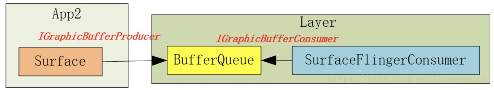

# BufferQueue

## BufferQueue的创建

在创建Layer对象过程中：frameworks/native/services/surfaceflinger/BufferQueueLayer.cpp

```cpp
BufferQueueLayer::BufferQueueLayer(const LayerCreationArgs& args) : BufferLayer(args) {}

void BufferQueueLayer::onFirstRef() {
    BufferLayer::onFirstRef();

    sp<IGraphicBufferProducer> producer;// 类型是BufferQueueProducer
    sp<IGraphicBufferConsumer> consumer;// 类型是BufferQueueConsumer
    mFlinger->getFactory().createBufferQueue(&producer, &consumer, true);
    // 类型是MonitoredProducer
    mProducer = mFlinger->getFactory().createMonitoredProducer(producer, mFlinger, this);
    // 类型是BufferLayerConsumer
    mConsumer = mFlinger->getFactory().createBufferLayerConsumer(consumer, mFlinger->getRenderEngine(), mTextureName, this);
    // 。。。
    mContentsChangedListener = new ContentsChangedListener(this);
    mConsumer->setContentsChangedListener(mContentsChangedListener);
    // ...
}
```

frameworks/native/services/surfaceflinger/SurfaceFlingerDefaultFactory.cpp
中间过程代码略

frameworks/native/libs/gui/BufferQueue.cpp

```cpp
void BufferQueue::createBufferQueue(sp<IGraphicBufferProducer>* outProducer,
        sp<IGraphicBufferConsumer>* outConsumer,
        bool consumerIsSurfaceFlinger) {
    // ...
    sp<BufferQueueCore> core(new BufferQueueCore());
    // ...
    sp<IGraphicBufferProducer> producer(new BufferQueueProducer(core, consumerIsSurfaceFlinger));
    // ...
    sp<IGraphicBufferConsumer> consumer(new BufferQueueConsumer(core));
    // ...
    *outProducer = producer;
    *outConsumer = consumer;
}
```

## 生产者IGraphicBufferProducer

IGraphicBufferProducer的调用主要在Surface的lock和unlock操作中（见Surface系统 上）。

### dequeueBuffer

frameworks/native/libs/gui/include/gui/IGraphicBufferProducer.h

客户端类型：BpGraphicBufferProducer （代码也在IGraphicBufferProducer.cpp中）

```cpp
virtual status_t dequeueBuffer(int* buf, sp<Fence>* fence, uint32_t width, uint32_t height, PixelFormat format, uint64_t usage, uint64_t* outBufferAge, FrameEventHistoryDelta* outTimestamps) {
    // 。。。
    return result;
}
```

通过Binder传输到SurfaceFlinger进程中。

服务端类型：BnGraphicBufferProducer （代码也在IGraphicBufferProducer.cpp中）

```cpp
status_t BnGraphicBufferProducer::onTransact(uint32_t code, const Parcel& data, Parcel* reply, uint32_t flags) {
    switch(code) {
        // ...
        case DEQUEUE_BUFFER: {
            // ...
            // 在服务进程中调用了dequeueBuffer
            int result = dequeueBuffer(&buf, &fence, width, height, format, usage, &bufferAge, getTimestamps ? &frameTimestamps : nullptr);
            // ...
            reply->writeInt32(result);
            return NO_ERROR;
        }
        // ...
    }
}
```

最终调用了BufferQueueProducer的dequeueBuffer
frameworks/native/libs/gui/BufferQueueProducer.cpp

```cpp
status_t BufferQueueProducer::dequeueBuffer(int* outSlot, sp<android::Fence>* outFence, uint32_t width, uint32_t height, PixelFormat format, uint64_t usage, uint64_t* outBufferAge, FrameEventHistoryDelta* outTimestamps) {
    // ...

    { // Autolock scope
        //. ..
        int found = BufferItem::INVALID_BUFFER_SLOT;
        while (found == BufferItem::INVALID_BUFFER_SLOT) {
            //1. 寻找可用的Slot，可用指Buffer状态为FREE
            status_t status = waitForFreeSlotThenRelock(FreeSlotCaller::Dequeue, lock, &found);
			// ...
            const sp<GraphicBuffer>& buffer(mSlots[found].mGraphicBuffer);
			// ...
        }
        // ...
        *outSlot = found;
        // 。。。
		//2.找到可用的Slot，将Buffer状态设置为DEQUEUED，由于步骤1找到的Slot状态为FREE，因此这一步完成了FREE到DEQUEUED的状态切换
        mSlots[found].mBufferState.dequeue();

        //3. 找到的Slot如果需要申请GraphicBuffer，则申请GraphicBuffer，这里采用了懒加载机制，如果内存没有申请，申请内存放在生产者来处理
        if ((buffer == nullptr) || buffer->needsReallocation(width, height, format, BQ_LAYER_COUNT, usage)) {
            // ...
        }
        // ...
    }
	// ...
    return returnFlags;
}
```

>   TODO waitForFreeSlotThenRelock分析
>

### requestBuffer

在Surface的lock中，调用完dequeueBuffer后又调用了requestBuffer。

```cpp
status_t BufferQueueProducer::requestBuffer(int slot, sp<GraphicBuffer>* buf) {
    // 。。。
    *buf = mSlots[slot].mGraphicBuffer;
    return NO_ERROR;
}
```

requestBuffer的逻辑比较简单，在dequeueBuffer中找到了可用得到slot，通过索引来获取GraphicBuffer。

### queueBuffer

在Surface的unlock中，会调用queueBuffer。

```cpp
status_t BufferQueueProducer::queueBuffer(int slot, const QueueBufferInput &input, QueueBufferOutput *output) {
    // ...
    sp<IConsumerListener> frameAvailableListener;
    sp<IConsumerListener> frameReplacedListener;
    // ...
    {
        // ...
        const sp<GraphicBuffer>& graphicBuffer(mSlots[slot].mGraphicBuffer);
        // ...
        // 将Buffer状态扭转成QUEUED，此步完成了Buffer的状态由DEQUEUED到QUEUED的过程
        mSlots[slot].mBufferState.queue();
		// ...
        if (mCore->mQueue.empty()) {
            // buffer入列
            mCore->mQueue.push_back(item);
            frameAvailableListener = mCore->mConsumerListener;
        } 
        // ...
    }
	// ...
    {   
		// 消费者回调
        if (frameAvailableListener != nullptr) {
            frameAvailableListener->onFrameAvailable(item);
        } else if (frameReplacedListener != nullptr) {
            frameReplacedListener->onFrameReplaced(item);
        }
		// ...
    }
	// ...
    return NO_ERROR;
}
```

## 消费者IGraphicBufferConsumer

### BufferLayerConsumer的创建

BufferQueue的创建隔得远，再看一遍：

```cpp
BufferQueueLayer::BufferQueueLayer(const LayerCreationArgs& args) : BufferLayer(args) {}

void BufferQueueLayer::onFirstRef() {
    BufferLayer::onFirstRef();

    sp<IGraphicBufferProducer> producer;// 类型是BufferQueueProducer
    sp<IGraphicBufferConsumer> consumer;// 类型是BufferQueueConsumer
    mFlinger->getFactory().createBufferQueue(&producer, &consumer, true);
    // 类型是MonitoredProducer
    mProducer = mFlinger->getFactory().createMonitoredProducer(producer, mFlinger, this);
    // 类型是BufferLayerConsumer
    mConsumer = mFlinger->getFactory().createBufferLayerConsumer(consumer, mFlinger->getRenderEngine(), mTextureName, this);
    // 。。。
    mContentsChangedListener = new ContentsChangedListener(this);
    mConsumer->setContentsChangedListener(mContentsChangedListener);
    // ...
}
```

在BufferLayerConsumer的构造函数中会调用父类ConsumerBase的构造函数

```cpp
BufferLayerConsumer::BufferLayerConsumer(const sp<IGraphicBufferConsumer>& bq, renderengine::RenderEngine& engine, uint32_t tex, Layer* layer)
      : ConsumerBase(bq, false),
        // ...
```

```cpp
ConsumerBase::ConsumerBase(const sp<IGraphicBufferConsumer>& bufferQueue, bool controlledByApp) :
        mAbandoned(false),
        mConsumer(bufferQueue),// mConsumer的类型是BufferQueueConsumer
        mPrevFinalReleaseFence(Fence::NO_FENCE) {
    // ...
    wp<ConsumerListener> listener = static_cast<ConsumerListener*>(this);
    sp<IConsumerListener> proxy = new BufferQueue::ProxyConsumerListener(listener);

    status_t err = mConsumer->consumerConnect(proxy, controlledByApp);
    // 。。。
}
```

### 消费者回调设置

```cpp
status_t BufferQueueConsumer::connect(const sp<IConsumerListener>& consumerListener, bool controlledByApp) {
    // ...
    mCore->mConsumerListener = consumerListener;
    // ...
    return NO_ERROR;
}
```

当生产者queueBuffer触发回调时，回调对象就是这个consumerListener：

```cpp
status_t BufferQueueProducer::queueBuffer(int slot, const QueueBufferInput &input, QueueBufferOutput *output) {
    // ...
    sp<IConsumerListener> frameAvailableListener;
    // ...
    frameAvailableListener = mCore->mConsumerListener;
	// ...
    if (frameAvailableListener != nullptr) {
    	frameAvailableListener->onFrameAvailable(item);
    }
	// ...
    return NO_ERROR;
}
```

consumerListener（类型是ConsumerBase）的onFrameAvailable：

```cpp
void ConsumerBase::onFrameAvailable(const BufferItem& item) {
	// ...
    sp<FrameAvailableListener> listener;
    {
        Mutex::Autolock lock(mFrameAvailableMutex);
        listener = mFrameAvailableListener.promote();// promote函数是将wp升级为sp
    }

    if (listener != nullptr) {
        // ...
        listener->onFrameAvailable(item);
    }
}
```

可以看到，ConsumerBase的回调并不是真正的实现，真正的实现在哪呢？看一下mFrameAvailableListener的赋值，在BufferQueueLayer的创建中：

```cpp
BufferQueueLayer::BufferQueueLayer(const LayerCreationArgs& args) : BufferLayer(args) {}

void BufferQueueLayer::onFirstRef() {
    // ...
    sp<IGraphicBufferConsumer> consumer;// 类型是BufferQueueConsumer
    // ...
    // 类型是BufferLayerConsumer
    mConsumer = mFlinger->getFactory().createBufferLayerConsumer(consumer, mFlinger->getRenderEngine(), mTextureName, this);
    // 。。。
    mContentsChangedListener = new ContentsChangedListener(this);
    mConsumer->setContentsChangedListener(mContentsChangedListener);
    // ...
}
```

setContentsChangedListener：

```cpp
void ConsumerBase::setFrameAvailableListener(const wp<FrameAvailableListener>& listener) {
    // ...
    mFrameAvailableListener = listener;
}
```

所以消费者回调的具体实现类型是BufferQueueLayer。

```cpp
void BufferQueueLayer::onFrameAvailable(const BufferItem& item) {
    // ...
    mFlinger->signalLayerUpdate();
    mConsumer->onBufferAvailable(item);
}
```

signalLayerUpdate内部会触发SF的handlePageFlip。

### acquireBuffer

```cpp
status_t BufferQueueConsumer::acquireBuffer(BufferItem* outBuffer, nsecs_t expectedPresent, uint64_t maxFrameNumber) {
    // ...
    sp<IProducerListener> listener;
    {
        // 取出元素
        // 更新Slot的状态为ACQUIRED
        mSlots[slot].mBufferState.acquire();
		// ...
    }

    if (listener != nullptr) {
        for (int i = 0; i < numDroppedBuffers; ++i) {
            // 回调
            listener->onBufferReleased();
        }
    }

    return NO_ERROR;
}
```

### releaseBuffer

消费者获取到Slot后开始消费数据（典型的消费如SurfaceFlinger的UI合成），消费完毕后，需要告知BufferQueueCore这个Slot被消费者消费完毕了，可以给生产者重新生产数据，releaseBuffer流程如下：

```cpp
status_t BufferQueueConsumer::releaseBuffer(int slot, uint64_t frameNumber, const sp<Fence>& releaseFence, EGLDisplay eglDisplay, EGLSyncKHR eglFence) {
    // ...

    sp<IProducerListener> listener;
    {
        // ...
        // 将Slot的状态扭为RELEASE
        mSlots[slot].mBufferState.release();
        // ...
        if (mCore->mBufferReleasedCbEnabled) {
            listener = mCore->mConnectedProducerListener;
        }
        // ...
    }
    
    // 回调生产者
    if (listener != nullptr) {
        listener->onBufferReleased();
    }

    return NO_ERROR;
}
```

## 小结

1.   BufferQueue
     可以认为BufferQueue是一个服务中心，IGraphicBufferProducer和IGraphicBufferConsumer
     所需要使用的buffer必须要通过它来管理。
2.   IGraphicBufferProducer
     IGraphicBufferProducer就是“填充”buffer空间的人，通常情况下是应用程序。因为应用程序不断地刷新UI，从而将产生的显示数据源源不断地写到buffer中。当IGraphicBufferProducer需要使用一块buffer时，它首先会向BufferQueue发起dequeueBuffer申请，然后才能对指定的buffer进行操作。此时buffer就只属于IGraphicBufferProducer一个人的了，它可以对buffer进行任何必要的操作，而IGraphicBufferConsumer此刻绝不能操作这块buffer。当IGraphicBufferProducer认为一块buffer已经写入完成后，它进一步调用queueBuffer函数。从字面上看这个函数是“入列”的意思，形象地表达了buffer此时的操作，把buffer归还到BufferQueue的队列中。一旦queue成功后，buffer的owner也就随之改变为BufferQueue了。
3.   IGraphicBufferConsumer
     IGraphicBufferConsumer是与IGraphicBufferProducer相对应的，它的操作同样受到BufferQueue的管控。当一块buffer已经就绪后，IGraphicBufferConsumer就可以开始工作了。



# 未完待续

TODO 

1.   VSYNC信号的处理，即`mFlinger->signalLayerUpdate();`
2.    listener->onBufferReleased();
3.   listener->onBufferReleased();


# SurfaceFlinger分析

## SurfaceFlinger进程的启动

>   和书中说的不同，SurfaceFlinger单独放在了一个进程。
>
>   参考：[surfaceflinger 进程启动](https://blog.csdn.net/u012439416/article/details/79733178)

surfaceflinger进程对应的配置不是在init.rc中，而是在surfaceflinger.rc中，对应的main文件：frameworks/native/services/surfaceflinger/main_surfaceflinger.cpp

```cpp
int main(int, char**) {
    // ...
    // 创建SurfaceFlinger对象，SurfaceFlinger的构造函数里没有复杂逻辑
    // instantiate surfaceflinger
    sp<SurfaceFlinger> flinger = surfaceflinger::createSurfaceFlinger();
    
    // ...
    // 执行SurfaceFlinger的init函数，init函数也没有复杂逻辑
    // initialize before clients can connect
    flinger->init();
    
    // 添加系统服务
    // publish surface flinger
    sp<IServiceManager> sm(defaultServiceManager());
    sm->addService(String16(SurfaceFlinger::getServiceName()), flinger, false,
                   IServiceManager::DUMP_FLAG_PRIORITY_CRITICAL | IServiceManager::DUMP_FLAG_PROTO);
    
    // 执行SurfaceFlinger的run函数
    // ...
    // run surface flinger in this thread
    flinger->run();
    return 0;
}
```

frameworks/native/services/surfaceflinger/SurfaceFlinger.cpp

在SurfaceFlinger的其他方法之前，onFirstRef方法会被调用，onFirstRef方法如下：

```cpp
void SurfaceFlinger::onFirstRef() {
    mEventQueue->init(this);
}
```

```cpp
void MessageQueue::init(const sp<SurfaceFlinger>& flinger) {
    mFlinger = flinger;
    mLooper = new Looper(true);
    mHandler = new Handler(*this);
}
```

创建了类似Android Java层中Handler的一套消息机制，最后调用SurfaceFlinger的run函数等待消息。

```cpp
void SurfaceFlinger::run() {
    while (true) {
        mEventQueue->waitMessage();
    }
}
```

小结：

SurfaceFlinger进程的启动主要是这几步：

1.   启动SurfaceFlinger进程。
2.   创建SurfaceFlinger对象。
3.   调用SurfaceFlinger的init函数。
4.   调用SurfaceFlinger的run函数，等待Message。

## SF消息循环

涉及类型：

```cpp
void SurfaceFlinger::onFirstRef() {
    mEventQueue->init(this);
}
```

```cpp
void MessageQueue::init(const sp<SurfaceFlinger>& flinger) {
    mFlinger = flinger;
    mLooper = new Looper(true);
    mHandler = new Handler(*this);
}
```

MessageQueue、Looper、Handler。

### waitMessage

```cpp
void SurfaceFlinger::run() {
    while (true) {
        mEventQueue->waitMessage();
    }
}
```

在一个死循环中，SF一直等待消息，当消息来临时，进行处理：

```cpp
void MessageQueue::waitMessage() {
    do {
        IPCThreadState::self()->flushCommands();
        int32_t ret = mLooper->pollOnce(-1);
        switch (ret) {
            case Looper::POLL_WAKE:
            case Looper::POLL_CALLBACK:
                continue;
            case Looper::POLL_ERROR:
                ALOGE("Looper::POLL_ERROR");
                continue;
            case Looper::POLL_TIMEOUT:
                // timeout (should not happen)
                continue;
            default:
                // should not happen
                ALOGE("Looper::pollOnce() returned unknown status %d", ret);
                continue;
        }
    } while (true);
}
```

```cpp
int Looper::pollOnce(int timeoutMillis, int* outFd, int* outEvents, void** outData) {
    int result = 0;
    for (;;) {
        // ...
        result = pollInner(timeoutMillis);
    }
}
```

```cpp
int Looper::pollInner(int timeoutMillis) {
    // ...
    while (mMessageEnvelopes.size() != 0) {
        // ...
        const MessageEnvelope& messageEnvelope = mMessageEnvelopes.itemAt(0);
        if (messageEnvelope.uptime <= now) {
            // ...
            { // obtain handler
                sp<MessageHandler> handler = messageEnvelope.handler;
                Message message = messageEnvelope.message;
                mMessageEnvelopes.removeAt(0);
                mSendingMessage = true;
                mLock.unlock();
                handler->handleMessage(message);
            } // release handler

            mLock.lock();
            mSendingMessage = false;
            result = POLL_CALLBACK;
        } 
        // ...
    }
    // ...
    return result;
}
```

和Java中的Handler类似，MessageQueue处理消息时，取出一个消息，获取对应的Handler，并交给其进行处理。

frameworks/native/services/surfaceflinger/Scheduler/MessageQueue.cpp

```cpp
void MessageQueue::Handler::handleMessage(const Message& message) {
    switch (message.what) {
        case INVALIDATE:
            mEventMask.fetch_and(~eventMaskInvalidate);
            mQueue.mFlinger->onMessageReceived(message.what, mVsyncId, mExpectedVSyncTime);
            break;
        case REFRESH:
            mEventMask.fetch_and(~eventMaskRefresh);
            mQueue.mFlinger->onMessageReceived(message.what, mVsyncId, mExpectedVSyncTime);
            break;
    }
}
```

frameworks/native/services/surfaceflinger/SurfaceFlinger.cpp

```cpp
void SurfaceFlinger::onMessageReceived(int32_t what, int64_t vsyncId, nsecs_t expectedVSyncTime) {
    switch (what) {
        case MessageQueue::INVALIDATE: {
            onMessageInvalidate(vsyncId, expectedVSyncTime);
            break;
        }
        case MessageQueue::REFRESH: {
            onMessageRefresh();
            break;
        }
    }
}
```

```cpp
void SurfaceFlinger::onMessageInvalidate(int64_t vsyncId, nsecs_t expectedVSyncTime) {
    // ...
    bool refreshNeeded;
    {
        // ...
        refreshNeeded = handleMessageTransaction();
        refreshNeeded |= handleMessageInvalidate();
        // ...
    }
    // ...
    refreshNeeded |= mRepaintEverything;
    if (refreshNeeded && CC_LIKELY(mBootStage != BootStage::BOOTLOADER)) {
        // Signal a refresh if a transaction modified the window state,
        // a new buffer was latched, or if HWC has requested a full
        // repaint
        // ...
        onMessageRefresh();
    }
    notifyRegionSamplingThread();
}
```

```cpp
bool SurfaceFlinger::handleMessageInvalidate() {
    ATRACE_CALL();
    bool refreshNeeded = handlePageFlip();

    // Send on commit callbacks
    mTransactionCallbackInvoker.sendCallbacks();

    if (mVisibleRegionsDirty) {
        computeLayerBounds();
    }

    for (auto& layer : mLayersPendingRefresh) {
        Region visibleReg;
        visibleReg.set(layer->getScreenBounds());
        invalidateLayerStack(layer, visibleReg);
    }
    mLayersPendingRefresh.clear();
    return refreshNeeded;
}
```

### postMessage

```cpp
void MessageQueue::postMessage(sp<MessageHandler>&& handler) {
    mLooper->sendMessage(handler, Message());
}
```

```cpp
void Looper::sendMessage(const sp<MessageHandler>& handler, const Message& message) {
    nsecs_t now = systemTime(SYSTEM_TIME_MONOTONIC);
    sendMessageAtTime(now, handler, message);
}
```

```cpp
void Looper::sendMessageAtTime(nsecs_t uptime, const sp<MessageHandler>& handler,
        const Message& message) {
	// ...

    size_t i = 0;
    { // acquire lock
        AutoMutex _l(mLock);

        size_t messageCount = mMessageEnvelopes.size();
        while (i < messageCount && uptime >= mMessageEnvelopes.itemAt(i).uptime) {
            i += 1;
        }

        MessageEnvelope messageEnvelope(uptime, handler, message);
        mMessageEnvelopes.insertAt(messageEnvelope, i, 1);

        // Optimization: If the Looper is currently sending a message, then we can skip
        // the call to wake() because the next thing the Looper will do after processing
        // messages is to decide when the next wakeup time should be.  In fact, it does
        // not even matter whether this code is running on the Looper thread.
        if (mSendingMessage) {
            return;
        }
    } // release lock

    // Wake the poll loop only when we enqueue a new message at the head.
    if (i == 0) {
        wake();
    }
}
```

### 小结

SF中的消息循环和Java层中的Handler类似：

1.   post一个msg到MessageQueue中，会将msg封装成一个MessageEnvelope，并放入到mMessageEnvelopes中。
2.   处理消息时，从mMessageEnvelopes中取出一个MessageEnvelope，并从MessageEnvelope中获取msg对应的Handler，交其处理。

## Vsync处理

见下Vsync处理。

## handlePageFlip

```cpp
bool SurfaceFlinger::handlePageFlip() {
    ATRACE_CALL();
    ALOGV("handlePageFlip");

    nsecs_t latchTime = systemTime();

    bool visibleRegions = false;
    bool frameQueued = false;
    bool newDataLatched = false;

    const nsecs_t expectedPresentTime = mExpectedPresentTime.load();

    // Store the set of layers that need updates. This set must not change as
    // buffers are being latched, as this could result in a deadlock.
    // Example: Two producers share the same command stream and:
    // 1.) Layer 0 is latched
    // 2.) Layer 0 gets a new frame
    // 2.) Layer 1 gets a new frame
    // 3.) Layer 1 is latched.
    // Display is now waiting on Layer 1's frame, which is behind layer 0's
    // second frame. But layer 0's second frame could be waiting on display.
    mDrawingState.traverse([&](Layer* layer) {
         uint32_t trFlags = layer->getTransactionFlags(eTransactionNeeded);
         if (trFlags || mForceTransactionDisplayChange) {
             const uint32_t flags = layer->doTransaction(0);
             if (flags & Layer::eVisibleRegion)
                 mVisibleRegionsDirty = true;
         }

         if (layer->hasReadyFrame()) {
            frameQueued = true;
            if (layer->shouldPresentNow(expectedPresentTime)) {
                mLayersWithQueuedFrames.emplace(layer);
            } else {
                ATRACE_NAME("!layer->shouldPresentNow()");
                layer->useEmptyDamage();
            }
         } else {
            layer->useEmptyDamage();
        }
    });
    mForceTransactionDisplayChange = false;

    // The client can continue submitting buffers for offscreen layers, but they will not
    // be shown on screen. Therefore, we need to latch and release buffers of offscreen
    // layers to ensure dequeueBuffer doesn't block indefinitely.
    for (Layer* offscreenLayer : mOffscreenLayers) {
        offscreenLayer->traverse(LayerVector::StateSet::Drawing,
                                         [&](Layer* l) { l->latchAndReleaseBuffer(); });
    }

    if (!mLayersWithQueuedFrames.empty()) {
        // mStateLock is needed for latchBuffer as LayerRejecter::reject()
        // writes to Layer current state. See also b/119481871
        Mutex::Autolock lock(mStateLock);

        for (const auto& layer : mLayersWithQueuedFrames) {
            if (layer->latchBuffer(visibleRegions, latchTime, expectedPresentTime)) {
                mLayersPendingRefresh.push_back(layer);
            }
            layer->useSurfaceDamage();
            if (layer->isBufferLatched()) {
                newDataLatched = true;
            }
        }
    }

    mVisibleRegionsDirty |= visibleRegions;

    // If we will need to wake up at some time in the future to deal with a
    // queued frame that shouldn't be displayed during this vsync period, wake
    // up during the next vsync period to check again.
    if (frameQueued && (mLayersWithQueuedFrames.empty() || !newDataLatched)) {
        signalLayerUpdate();
    }

    // enter boot animation on first buffer latch
    if (CC_UNLIKELY(mBootStage == BootStage::BOOTLOADER && newDataLatched)) {
        ALOGI("Enter boot animation");
        mBootStage = BootStage::BOOTANIMATION;
    }

    if (mNumClones > 0) {
        mDrawingState.traverse([&](Layer* layer) { layer->updateCloneBufferInfo(); });
    }

    // Only continue with the refresh if there is actually new work to do
    return !mLayersWithQueuedFrames.empty() && newDataLatched;
}
```


# Vsync处理

在BufferQueue的循环中提到，生产者处理完会调用queueBuffer，而queueBuffer会触发消费者的回调：

```cpp
void BufferQueueLayer::onFrameAvailable(const BufferItem& item) {
    // ...
    mFlinger->signalLayerUpdate();
    mConsumer->onBufferAvailable(item);
}
```

调用了SF的signalLayerUpdate。

```cpp
void SurfaceFlinger::signalLayerUpdate() {
    // ...
    mEventQueue->invalidate();
}
```

frameworks/native/services/surfaceflinger/Scheduler/MessageQueue.cpp

```cpp
void MessageQueue::invalidate() {
    mEvents->requestNextVsync();
}
```

frameworks/native/services/surfaceflinger/Scheduler/EventThread.cpp

```cpp
void EventThreadConnection::requestNextVsync() {
    ATRACE_NAME("requestNextVsync");
    mEventThread->requestNextVsync(this);
}
```

frameworks/native/services/surfaceflinger/Scheduler/EventThread.cpp

```cpp
void EventThread::requestNextVsync(const sp<EventThreadConnection>& connection) {
    if (connection->resyncCallback) {
        connection->resyncCallback();
    }

    std::lock_guard<std::mutex> lock(mMutex);

    if (connection->vsyncRequest == VSyncRequest::None) {
        connection->vsyncRequest = VSyncRequest::Single;
        // 主要看这里
        mCondition.notify_all();
    }
}
```

`mCondition.notify_all();`唤醒这个条件变量，那么看一下这个mCondition在哪wait的。

## EventThread

```cpp
EventThread::EventThread(std::unique_ptr<VSyncSource> vsyncSource,
                         InterceptVSyncsCallback interceptVSyncsCallback)
      : mVSyncSource(std::move(vsyncSource)),
        mInterceptVSyncsCallback(std::move(interceptVSyncsCallback)),
        mThreadName(mVSyncSource->getName()) {
    mVSyncSource->setCallback(this);

    mThread = std::thread([this]() NO_THREAD_SAFETY_ANALYSIS {
        std::unique_lock<std::mutex> lock(mMutex);
        threadMain(lock);
    });
	// 。。。
}
```

threadMain会开启一个死循环，这个循环会一直处理事件：

```cpp
void EventThread::threadMain(std::unique_lock<std::mutex>& lock) {
    DisplayEventConsumers consumers;

    while (mState != State::Quit) {
        std::optional<DisplayEventReceiver::Event> event;

        // 。。。
        // 从 mPendingEvents 头部获取 VSYNC 事件 Event 。
        event = mPendingEvents.front();
        mPendingEvents.pop_front();
        
        // 。。。
        // 找到需要消费此event的connection
		
		// 。。。
        // 分发此event
        if (!consumers.empty()) {
            dispatchEvent(*event, consumers);
            consumers.clear();
        }
		// 。。。

        // Wait for event or client registration/request.
        if (mState == State::Idle) {
            // 通过条件变量mCondition让线程陷入等待
            mCondition.wait(lock);
        } else {
            // Generate a fake VSYNC after a long timeout in case the driver stalls. When the display is off, keep feeding clients at 60 Hz.
            // 如果没有事件，那么创建一个假的VSync发送给请求者。
            // 。。。
        }
    }
}
```

EventThread在处理事件循环中，会等待下一次的event。上面的`mCondition.notify_all();`就是唤醒这里的循环。

## 事件分发

在EventThread的消息处理循环中，找到了event，并给消费者分发此event：

```cpp
void EventThread::dispatchEvent(const DisplayEventReceiver::Event& event,
                                const DisplayEventConsumers& consumers) {
    for (const auto& consumer : consumers) {
        switch (consumer->postEvent(event)) {
            // ...
        }
    }
}
```

consumer的具体类型是EventThreadConnection：

```cpp
using DisplayEventConsumers = std::vector<sp<EventThreadConnection>>;
```

```cpp
status_t EventThreadConnection::postEvent(const DisplayEventReceiver::Event& event) {
    ssize_t size = DisplayEventReceiver::sendEvents(&mChannel, &event, 1);
    return size < 0 ? status_t(size) : status_t(NO_ERROR);
}
```

frameworks/native/libs/gui/DisplayEventReceiver.cpp

```cpp
ssize_t DisplayEventReceiver::sendEvents(gui::BitTube* dataChannel,
        Event const* events, size_t count)
{
    return gui::BitTube::sendObjects(dataChannel, events, count);
}
```

事件的分发会通过Channel来完成。

## EventThreadConnection

### EventThread的创建

frameworks/native/services/surfaceflinger/SurfaceFlinger.cpp

```cpp
void SurfaceFlinger::init() {
    // ...
    processDisplayHotplugEventsLocked();
    // ...
}
```

```cpp
void SurfaceFlinger::processDisplayHotplugEventsLocked() {
    // ...
    initScheduler(displayId);
    // ...
}
```

```cpp
void SurfaceFlinger::initScheduler(DisplayId primaryDisplayId) {
    // ...

    // start the EventThread
    mScheduler = getFactory().createScheduler([this](bool enabled) { setPrimaryVsyncEnabled(enabled); }, *mRefreshRateConfigs, *this);
    mAppConnectionHandle = mScheduler->createConnection("app", mPhaseConfiguration->getCurrentOffsets().late.app, impl::EventThread::InterceptVSyncsCallback());
    mSfConnectionHandle = mScheduler->createConnection("sf", mPhaseConfiguration->getCurrentOffsets().late.sf, [this](nsecs_t timestamp) { mInterceptor->saveVSyncEvent(timestamp); });

    mEventQueue->setEventConnection(mScheduler->getEventConnection(mSfConnectionHandle));
    // ...
}
```

frameworks/native/services/surfaceflinger/Scheduler/Scheduler.cpp

```cpp
Scheduler::ConnectionHandle Scheduler::createConnection(const char* connectionName, nsecs_t phaseOffsetNs, impl::EventThread::InterceptVSyncsCallback interceptCallback) {
    auto vsyncSource = makePrimaryDispSyncSource(connectionName, phaseOffsetNs);
    auto eventThread = std::make_unique<impl::EventThread>(std::move(vsyncSource), std::move(interceptCallback));
    return createConnection(std::move(eventThread));
}

Scheduler::ConnectionHandle Scheduler::createConnection(std::unique_ptr<EventThread> eventThread) {
    const ConnectionHandle handle = ConnectionHandle{mNextConnectionHandleId++};
    // ...
    auto connection = createConnectionInternal(eventThread.get(), ISurfaceComposer::eConfigChangedSuppress);
    mConnections.emplace(handle, Connection{connection, std::move(eventThread)});
    return handle;
}

sp<EventThreadConnection> Scheduler::createConnectionInternal(EventThread* eventThread, ISurfaceComposer::ConfigChanged configChanged) {
    return eventThread->createEventConnection([&] { resync(); }, configChanged);
}
```

frameworks/native/services/surfaceflinger/Scheduler/EventThread.cpp

```cpp
sp<EventThreadConnection> EventThread::createEventConnection(ResyncCallback resyncCallback, ISurfaceComposer::ConfigChanged configChanged) const {
    return new EventThreadConnection(const_cast<EventThread*>(this), std::move(resyncCallback),configChanged);
}
```

在SF的初始化过程中，分别创建了APP和SF的EventThread，以及对应的EventThreadConnection。

### EventThreadConnection的创建

```cpp
EventThreadConnection::EventThreadConnection(EventThread* eventThread,
                                             ResyncCallback resyncCallback,
                                             ISurfaceComposer::ConfigChanged configChanged)
      : resyncCallback(std::move(resyncCallback)),
        mConfigChanged(configChanged),
        mEventThread(eventThread),
        mChannel(gui::BitTube::DefaultSize) {}
```

```cpp
gui::BitTube mChannel;
```

### BitTube的创建

```cpp
BitTube::BitTube(size_t bufsize) {
    init(bufsize, bufsize);
}

BitTube::BitTube(DefaultSizeType) : BitTube(DEFAULT_SOCKET_BUFFER_SIZE) {}

BitTube::BitTube(const Parcel& data) {
    readFromParcel(&data);
}

void BitTube::init(size_t rcvbuf, size_t sndbuf) {
    int sockets[2];
    if (socketpair(AF_UNIX, SOCK_SEQPACKET, 0, sockets) == 0) {
        size_t size = DEFAULT_SOCKET_BUFFER_SIZE;
        setsockopt(sockets[0], SOL_SOCKET, SO_RCVBUF, &rcvbuf, sizeof(rcvbuf));
        setsockopt(sockets[1], SOL_SOCKET, SO_SNDBUF, &sndbuf, sizeof(sndbuf));
        // since we don't use the "return channel", we keep it small...
        setsockopt(sockets[0], SOL_SOCKET, SO_SNDBUF, &size, sizeof(size));
        setsockopt(sockets[1], SOL_SOCKET, SO_RCVBUF, &size, sizeof(size));
        fcntl(sockets[0], F_SETFL, O_NONBLOCK);
        fcntl(sockets[1], F_SETFL, O_NONBLOCK);
        mReceiveFd.reset(sockets[0]);
        mSendFd.reset(sockets[1]);
    } else {
        mReceiveFd.reset();
        ALOGE("BitTube: pipe creation failed (%s)", strerror(errno));
    }
}
```

在EventThreadConnection的创建过程中，会创建一对socket，一个用来接收事件，一个用来发送事件。

**接收者**

```cpp
void SurfaceFlinger::initScheduler(DisplayId primaryDisplayId) {
    // ...
    mEventQueue->setEventConnection(mScheduler->getEventConnection(mSfConnectionHandle));
    // ...
}
```

在SF的initScheduler中会调用MessageQueue的setEventConnection。

```cpp
void MessageQueue::setEventConnection(const sp<EventThreadConnection>& connection) {
    if (mEventTube.getFd() >= 0) {
        mLooper->removeFd(mEventTube.getFd());
    }

    mEvents = connection;
    mEvents->stealReceiveChannel(&mEventTube);
    mLooper->addFd(mEventTube.getFd(), 0, Looper::EVENT_INPUT, MessageQueue::cb_eventReceiver,
                   this);
}
```

```
gui::BitTube mEventTube;
```

frameworks/native/services/surfaceflinger/Scheduler/EventThread.cpp

```cpp
status_t EventThreadConnection::stealReceiveChannel(gui::BitTube* outChannel) {
    outChannel->setReceiveFd(mChannel.moveReceiveFd());
    return NO_ERROR;
}
```

接收者实际上是MessageQueue，cb_eventReceiver就是接收的回调。

**发送者**

发送者就是EventThreadConnection创建的那一个。

## 再看事件分发

```cpp
ssize_t DisplayEventReceiver::sendEvents(gui::BitTube* dataChannel, Event const* events, size_t count) {
    return gui::BitTube::sendObjects(dataChannel, events, count);
}
```

```cpp
ssize_t BitTube::sendObjects(BitTube* tube, void const* events, size_t count, size_t objSize) {
    const char* vaddr = reinterpret_cast<const char*>(events);
    ssize_t size = tube->write(vaddr, count * objSize);

    // ...
    return size < 0 ? size : size / static_cast<ssize_t>(objSize);
}
```

```cpp
ssize_t BitTube::write(void const* vaddr, size_t size) {
    ssize_t err, len;
    do {
        len = ::send(mSendFd, vaddr, size, MSG_DONTWAIT | MSG_NOSIGNAL);
        // cannot return less than size, since we're using SOCK_SEQPACKET
        err = len < 0 ? errno : 0;
    } while (err == EINTR);
    return err == 0 ? len : -err;
}
```

在BitTube的write函数中，发送了信息，那么另一端就会接收到信息，也就是BitTube的read函数：

```cpp
ssize_t BitTube::read(void* vaddr, size_t size) {
    ssize_t err, len;
    do {
        len = ::recv(mReceiveFd, vaddr, size, MSG_DONTWAIT);
        err = len < 0 ? errno : 0;
    } while (err == EINTR);
    // ...
    return err == 0 ? len : -err;
}
```

>   c++的Socket源码不是很熟悉，这里是从原理的角度理解。最终会走到MessageQueue的cb_eventReceiver函数；

## 事件接收

frameworks/native/services/surfaceflinger/Scheduler/MessageQueue.cpp

```cpp
int MessageQueue::cb_eventReceiver(int fd, int events, void* data) {
    MessageQueue* queue = reinterpret_cast<MessageQueue*>(data);
    return queue->eventReceiver(fd, events);
}
```

```cpp
int MessageQueue::eventReceiver(int /*fd*/, int /*events*/) {
    ssize_t n;
    DisplayEventReceiver::Event buffer[8];
    while ((n = DisplayEventReceiver::getEvents(&mEventTube, buffer, 8)) > 0) {
        for (int i = 0; i < n; i++) {
            if (buffer[i].header.type == DisplayEventReceiver::DISPLAY_EVENT_VSYNC) {
                mHandler->dispatchInvalidate(buffer[i].vsync.expectedVSyncTimestamp);
                break;
            }
        }
    }
    return 1;
}
```

frameworks/native/services/surfaceflinger/Scheduler/MessageQueue.cpp

```cpp
void MessageQueue::Handler::dispatchInvalidate(nsecs_t expectedVSyncTimestamp) {
    // ...
    mQueue.mLooper->sendMessage(this, Message(MessageQueue::INVALIDATE));
    // ...
}
```

看到了熟悉的函数：`Looper::sendMessage`。在上面的SF消息循环中，`Looper::sendMessage`最终会触发SF的handlePageFlip。

## 小结

Vsync信号的处理，即requestNextVsync，最终触发SF的handlePageFlip。