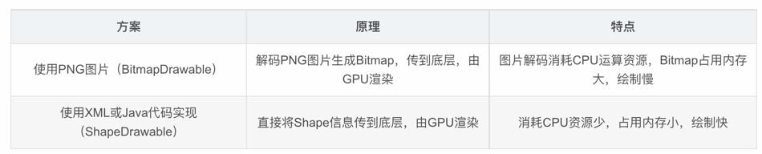

# 介绍

官网介绍：https://developer.android.com/guide/topics/graphics/hardware-accel?hl=zh-cn

参考博客：https://blog.csdn.net/liuwg1226/article/details/114767981

根据官网的介绍，开启和关闭的主要区别：

-   未开启硬件加速的View，在调用`invalidate()`时会触发整个View树的重绘。
-   开启硬件加速的View，在状态发生变化时，只更新该View，不会触发整个View树的重绘。

demo演示见TestHardwareAccelerateActivity。

从日志看出区别：

1.   开启硬件加速：只有变化的View触发了onDraw。在ViewRootImpl的draw方法中调用了ThreadedRenderer的draw方法，最终触发了onDraw。
2.   关闭硬件加速：变化的View和其父View都触发了onDraw。在ViewRootImpl的draw方法中调用了ViewRootImpl的drawSoftware方法，最终触发了onDraw。

# 硬件加速对App开发的意义

对于 App 开发者，简单了解硬件加速原理及上层 API 实现，开发时就可以充分利用硬件加速提高页面的性能。以 Android 举例，实现一个圆角矩形按钮通常有两种方案：使用 PNG 图片；使用代码（XML/Java）实现。简单对比两种方案如下。



# 开启硬件加速

```java
public void setView(View view, WindowManager.LayoutParams attrs, View panelParentView, int userId) {
    synchronized (this) {
        if (mView == null) {
            mView = view;
            // ...
            if (mSurfaceHolder == null) {
                // 开启硬件加速
                enableHardwareAcceleration(attrs);
                // ...
            }
            // ...
        }
    }
}
```

```java
private void enableHardwareAcceleration(WindowManager.LayoutParams attrs) {
    // ...
    // Try to enable hardware acceleration if requested
    final boolean hardwareAccelerated = (attrs.flags & WindowManager.LayoutParams.FLAG_HARDWARE_ACCELERATED) != 0;
    if (hardwareAccelerated) {
        // ...
        if (fakeHwAccelerated) {
            // ...
            mAttachInfo.mHardwareAccelerationRequested = true;
        } else if (!ThreadedRenderer.sRendererDisabled
                || (ThreadedRenderer.sSystemRendererDisabled && forceHwAccelerated)) {
           	// ...
            // 创建一个ThreadedRenderer
            mAttachInfo.mThreadedRenderer = ThreadedRenderer.create(mContext, translucent, attrs.getTitle().toString());
            // ...
            if (mAttachInfo.mThreadedRenderer != null) {
                mAttachInfo.mHardwareAccelerated =
                        mAttachInfo.mHardwareAccelerationRequested = true;
            }
        }
    }
}
```

在`ViewRootImpl`通过`setView`添加窗口的时候，会调用`enableHardwareAcceleration`开启硬件加速。

## 创建ThreadedRenderer

```java
mAttachInfo.mThreadedRenderer = ThreadedRenderer.create(mContext, translucent, attrs.getTitle().toString());
```

```java
public static ThreadedRenderer create(Context context, boolean translucent, String name) {
    ThreadedRenderer renderer = null;
    if (isAvailable()) {
        renderer = new ThreadedRenderer(context, translucent, name);
    }
    return renderer;
}
```

```java
ThreadedRenderer(Context context, boolean translucent, String name) {
    super();
    // ...
}
```

ThreadedRenderer父类的构造方法：

```java
public HardwareRenderer() {
    mRootNode = RenderNode.adopt(nCreateRootRenderNode());
    mRootNode.setClipToBounds(false);
    mNativeProxy = nCreateProxy(!mOpaque, mIsWideGamut, mRootNode.mNativeRenderNode);
    if (mNativeProxy == 0) {
        throw new OutOfMemoryError("Unable to create hardware renderer");
    }
    Cleaner.create(this, new DestroyContextRunnable(mNativeProxy));
    ProcessInitializer.sInstance.init(mNativeProxy);
}
```

frameworks/base/libs/hwui/jni/android_graphics_HardwareRenderer.cpp

```cpp
static jlong android_view_ThreadedRenderer_createProxy(JNIEnv* env, jobject clazz,
        jboolean translucent, jboolean isWideGamut, jlong rootRenderNodePtr) {
    RootRenderNode* rootRenderNode = reinterpret_cast<RootRenderNode*>(rootRenderNodePtr);
    ContextFactoryImpl factory(rootRenderNode);
    RenderProxy* proxy = new RenderProxy(translucent, rootRenderNode, &factory);
    proxy->setWideGamut(isWideGamut);
    return (jlong) proxy;
}
```

frameworks/base/libs/hwui/RootRenderNode.h

```cpp
class ANDROID_API RootRenderNode : public RenderNode
```

frameworks/base/libs/hwui/renderthread/RenderProxy.cpp

```cpp
// RenderThread::getInstance()以单例的方式开启RenderThread线程
RenderProxy::RenderProxy(bool translucent, RenderNode* rootRenderNode, IContextFactory* contextFactory) : mRenderThread(RenderThread::getInstance()), mContext(nullptr) {
    mContext = mRenderThread.queue().runSync([&]() -> CanvasContext* {
        return CanvasContext::create(mRenderThread, translucent, rootRenderNode, contextFactory);
    });
    mDrawFrameTask.setContext(&mRenderThread, mContext, rootRenderNode);
}
```

小结：

1.  在ThreadedRenderer初始化期间，会创建一个RootRenderNode，用来表示RenderNode的根节点。RootRenderNode的Java类型是RenderNode，native类型是RootRenderNode（继承自RenderNode）
2.  在native创建一个RenderProxy。RenderProxy初始化过程中会开启一个RenderThread单例线程以及创建CanvasContext。CanvasContext是对RenderThread和RootRenderNode的封装。

# 构建阶段

## 创建RenderNode

```java
final RenderNode renderNode = mRenderNode;
```

mRenderNode的创建：

```java
public View(Context context) {
    mContext = context;
   	// ...
    mRenderNode = RenderNode.create(getClass().getName(), new ViewAnimationHostBridge(this));
	// ...
}
```

frameworks/base/graphics/java/android/graphics/RenderNode.java

```java
public static RenderNode create(String name, @Nullable AnimationHost animationHost) {
	return new RenderNode(name, animationHost);
}
```

创建View对象的时候会创建对应的RenderNode。

```cpp
private RenderNode(String name, AnimationHost animationHost) {
    mNativeRenderNode = nCreate(name);
    NoImagePreloadHolder.sRegistry.registerNativeAllocation(this, mNativeRenderNode);
    mAnimationHost = animationHost;
}
```

frameworks/base/libs/hwui/jni/android_graphics_RenderNode.cpp

```cpp
static jlong android_view_RenderNode_create(JNIEnv* env, jobject, jstring name) {
    RenderNode* renderNode = new RenderNode();
    renderNode->incStrong(0);
    // ....
    return reinterpret_cast<jlong>(renderNode);
}
```

小结：

1.  在创建View对象的过程中会创建一个RenderNode。
2.  Java层对应的对象类型是RenderNode。Native层的对象类型是RenderNode。

# 状态改变

官网介绍：开启硬件加速的View，在状态发生变化时，只更新该View，不会触发整个View树的重绘。这里主要看一下，硬件加速是怎样做到不触发整个View树重绘的。

以setAlpha为例，当View的状态发生改变时，调用链：

```java
// View.java
public void setAlpha(@FloatRange(from=0.0, to=1.0) float alpha) {
    ensureTransformationInfo();
    if (mTransformationInfo.mAlpha != alpha) {
        setAlphaInternal(alpha);
        // onSetAlpha是监听Alpha变化的回调，一般是false
        if (onSetAlpha((int) (alpha * 255))) {
            mPrivateFlags |= PFLAG_ALPHA_SET;
            invalidateParentCaches();
            invalidate(true);
        } else {
            mPrivateFlags &= ~PFLAG_ALPHA_SET;
            invalidateViewProperty(true, false);
            // 在Native的RenderNode设置Alpha值，没有太多的额外逻辑
            mRenderNode.setAlpha(getFinalAlpha());
        }
    }
}
```

```java
// View.java
void invalidateViewProperty(boolean invalidateParent, boolean forceRedraw) {
    // if部分是软件绘制，else是硬件加速部分
    if (!isHardwareAccelerated()
            || !mRenderNode.hasDisplayList()
            || (mPrivateFlags & PFLAG_DRAW_ANIMATION) != 0) {
        // ...
    } else {
        damageInParent();
    }
}
```

后面的过程略，见调用链：

```
View#setAlpha -> 
View#invalidateViewProperty -> 
View#damageInParent -> 
ViewGroup#onDescendantInvalidated -> 
ViewRootImpl#onDescendantInvalidated -> 
ViewRootImpl#invalidate -> 
ViewRootImpl#scheduleTraversals  
```

1.   ViewRootImpl的scheduleTraversals会触发ViewRootImpl的invalidate方法，而因为post操作，所以setAlpha会先执行完。
2.   执行ViewRootImpl的invalidate，经过一个post操作，最终调用ThreadedRenderer的draw方法。

# 硬件绘制

硬件绘制主要看ThreadedRenderer的draw方法。

```java
// ThreadedRenderer.java
void draw(View view, AttachInfo attachInfo, DrawCallbacks callbacks) {
    // ...
    updateRootDisplayList(view, callbacks);
	// ...
    int syncResult = syncAndDrawFrame(choreographer.mFrameInfo);
    // ...
}
```

## 更新DisplayList

updateRootDisplayList：

```java
private void updateRootDisplayList(View view, DrawCallbacks callbacks) {
    // 第一步，从顶层视图开始，更新所有视图的DisplayList。
    updateViewTreeDisplayList(view);
	// 第二步，根节点绘制顶层视图RenderNode。
    if (mRootNodeNeedsUpdate || !mRootNode.hasDisplayList()) {
        RecordingCanvas canvas = mRootNode.beginRecording(mSurfaceWidth, mSurfaceHeight);
        try {
            final int saveCount = canvas.save();
            canvas.translate(mInsetLeft, mInsetTop);
            callbacks.onPreDraw(canvas);

            canvas.enableZ();
            canvas.drawRenderNode(view.updateDisplayListIfDirty());
            canvas.disableZ();

            callbacks.onPostDraw(canvas);
            canvas.restoreToCount(saveCount);
            mRootNodeNeedsUpdate = false;
        } finally {
            mRootNode.endRecording();
        }
    }
    Trace.traceEnd(Trace.TRACE_TAG_VIEW);
}
```

### 更新所有视图的DisplayList

```java
private void updateViewTreeDisplayList(View view) {
    // ...
    view.updateDisplayListIfDirty();
    // ...
}
```

```java
// View.java
public RenderNode updateDisplayListIfDirty() {
    final RenderNode renderNode = mRenderNode;
    // ...
    if ((mPrivateFlags & PFLAG_DRAWING_CACHE_VALID) == 0
            || !renderNode.hasDisplayList()
            || (mRecreateDisplayList)) {
        // 遍历View来构建DisplayList
        if (renderNode.hasDisplayList()
                && !mRecreateDisplayList) {
            mPrivateFlags |= PFLAG_DRAWN | PFLAG_DRAWING_CACHE_VALID;
            mPrivateFlags &= ~PFLAG_DIRTY_MASK;
            dispatchGetDisplayList();

            return renderNode; // no work needed
        }
		// 在最初的View渲染中，renderNode没有DisplayList（通过Debug验证）
        // ...
        final RecordingCanvas canvas = renderNode.beginRecording(width, height);
        try {
            if (layerType == LAYER_TYPE_SOFTWARE) {
                buildDrawingCache(true);
                Bitmap cache = getDrawingCache(true);
                if (cache != null) {
                    canvas.drawBitmap(cache, 0, 0, mLayerPaint);
                }
            } else {
                // ...
                // if部分表示不需要绘制背景
                if ((mPrivateFlags & PFLAG_SKIP_DRAW) == PFLAG_SKIP_DRAW) {
                    dispatchDraw(canvas);
                    // ...
                } else {
                    draw(canvas);
                }
            }
        } finally {
            renderNode.endRecording();
            setDisplayListProperties(renderNode);
        }
    } 
    // ...
    return renderNode;
}
```

每个View都有三个步骤：

1.   通过视图`renderNode.beginRecording`，创建RecordingCanvas对象。
2.   通过View的`draw (canvas)`方法，实现具体记录绘制操作，绘制自身与派发。
3.   最后，`enderNode.endRecording()`绘制结束，保存Canvas记录内容。

### beginRecording：创建Canvas

```java
final RecordingCanvas canvas = renderNode.beginRecording(width, height);
```

frameworks/base/graphics/java/android/graphics/RenderNode.java

```java
public @NonNull RecordingCanvas beginRecording(int width, int height) {
    // ...
    mCurrentRecordingCanvas = RecordingCanvas.obtain(this, width, height);
    return mCurrentRecordingCanvas;
}
```

frameworks/base/graphics/java/android/graphics/RecordingCanvas.java

```java
static RecordingCanvas obtain(@NonNull RenderNode node, int width, int height) {
    // ...
    RecordingCanvas canvas = sPool.acquire();
    if (canvas == null) {
        canvas = new RecordingCanvas(node, width, height);
    } else {
        nResetDisplayListCanvas(canvas.mNativeCanvasWrapper, node.mNativeRenderNode, width, height);
    }
    // ...
    return canvas;
}
```

从缓存池里获取一个RecordingCanvas对象（TODO 对象池的原理可以看看），如果没有就新建一个。

RecordingCanvas的继承链：

```
public final class RecordingCanvas extends DisplayListCanvas
public abstract class DisplayListCanvas extends BaseRecordingCanvas
public class BaseRecordingCanvas extends Canvas
```

构造方法：

```java
protected RecordingCanvas(@NonNull RenderNode node, int width, int height) {
    super(nCreateDisplayListCanvas(node.mNativeRenderNode, width, height));
    mDensity = 0; // disable bitmap density scaling
}
```

```java
protected DisplayListCanvas(long nativeCanvas) {
    super(nativeCanvas);
}
```

```java
public BaseRecordingCanvas(long nativeCanvas) {
    super(nativeCanvas);
}
```

```java
public Canvas(long nativeCanvas) {
    // ...
    mNativeCanvasWrapper = nativeCanvas;
    // ...
}
```

frameworks/base/libs/hwui/jni/android_graphics_DisplayListCanvas.cpp

```cpp
static jlong android_view_DisplayListCanvas_createDisplayListCanvas(CRITICAL_JNI_PARAMS_COMMA jlong renderNodePtr, jint width, jint height) {
    RenderNode* renderNode = reinterpret_cast<RenderNode*>(renderNodePtr);
    return reinterpret_cast<jlong>(Canvas::create_recording_canvas(width, height, renderNode));
}
```

frameworks/base/libs/hwui/hwui/Canvas.cpp

```cpp
Canvas* Canvas::create_recording_canvas(int width, int height, uirenderer::RenderNode* renderNode) {
    return new uirenderer::skiapipeline::SkiaRecordingCanvas(renderNode, width, height);
}
```

frameworks/base/libs/hwui/pipeline/skia/SkiaRecordingCanvas.h

```cpp
explicit SkiaRecordingCanvas(uirenderer::RenderNode* renderNode, int width, int height) {
	initDisplayList(renderNode, width, height);
}
```

frameworks/base/libs/hwui/pipeline/skia/SkiaRecordingCanvas.cpp

```cpp
void SkiaRecordingCanvas::initDisplayList(uirenderer::RenderNode* renderNode, int width, int height) {
    // ...
    if (renderNode) {
        mDisplayList = renderNode->detachAvailableList();
    }
    if (!mDisplayList) {
        mDisplayList.reset(new SkiaDisplayList());
    }
    mDisplayList->attachRecorder(&mRecorder, SkIRect::MakeWH(width, height));
    SkiaCanvas::reset(&mRecorder);
}
```

### Canvas记录DisplayList

在一般View的onDraw方法中，会利用onDraw参数中Canvas的drawxxx方法来绘制View，这里以drawBitmap为例，最终是调用了SkiaRecordingCanvas的drawBitmap。

frameworks/base/libs/hwui/pipeline/skia/SkiaRecordingCanvas.cpp

```cpp
void SkiaRecordingCanvas::drawBitmap(Bitmap& bitmap, const SkMatrix& matrix, const Paint* paint) {
    SkAutoCanvasRestore acr(&mRecorder, true);
    concat(matrix);

    sk_sp<SkImage> image = bitmap.makeImage();

    applyLooper(get_looper(paint), *filterBitmap(paint), [&](SkScalar x, SkScalar y, const SkPaint& p) {
        mRecorder.drawImage(image, x, y, &p, bitmap.palette());
    });

    if (!bitmap.isImmutable() && image.get() && !image->unique()) {
        // 更新DisplayList
        mDisplayList->mMutableImages.push_back(image.get());
    }
}
```

SkiaRecordingCanvas的drawBitmap没有执行复杂的绘制代码，而是简单的更新了DisplayList

### endRecording：构建displayList

```java
// RenderNode.java
public void endRecording() {
    // ...
	// 返回Native层的DisplayList指针。
    long displayList = canvas.finishRecording();
    // 将 DisplayListData 指针保存到底层 RenderNode 中。
    nSetDisplayList(mNativeRenderNode, displayList);
    // Canvas 释放，回收入缓存池。
    canvas.recycle();
}
```

frameworks/base/libs/hwui/jni/android_graphics_DisplayListCanvas.cpp

```cpp
static jlong android_view_DisplayListCanvas_finishRecording(CRITICAL_JNI_PARAMS_COMMA jlong canvasPtr) {
    Canvas* canvas = reinterpret_cast<Canvas*>(canvasPtr);
    return reinterpret_cast<jlong>(canvas->finishRecording());
}
```

frameworks/base/libs/hwui/pipeline/skia/SkiaRecordingCanvas.cpp

```cpp
uirenderer::DisplayList* SkiaRecordingCanvas::finishRecording() {
    // close any existing chunks if necessary
    insertReorderBarrier(false);
    mRecorder.restoreToCount(1);
    // std::unique_ptr<SkiaDisplayList> mDisplayList;
    return mDisplayList.release();
}
```

## 根RenderNode绘制

```java
private void updateRootDisplayList(View view, DrawCallbacks callbacks) {
    // 第一步，从顶层视图开始，更新所有视图的DisplayList。
    updateViewTreeDisplayList(view);
	// 第二步，根节点绘制顶层视图RenderNode。
    if (mRootNodeNeedsUpdate || !mRootNode.hasDisplayList()) {
        // 同样，通过根RenderNode创建RecordingCanvas
        RecordingCanvas canvas = mRootNode.beginRecording(mSurfaceWidth, mSurfaceHeight);
        try {
            final int saveCount = canvas.save();
            canvas.translate(mInsetLeft, mInsetTop);
            callbacks.onPreDraw(canvas);

            canvas.enableZ();
            // 绘制顶层视图DecorView的RenderNode节点。
            canvas.drawRenderNode(view.updateDisplayListIfDirty());
            canvas.disableZ();
			// 。。。
        } finally {
            mRootNode.endRecording();
        }
    }
}
```

这里需要注意的一点是，这里根 RenderNode 创建的 Canvas 不属于任一个 View 视图，因为 Canvas 是 View 的 RenderNode 搞出来的，顶层 RenderNode 不依赖任何 View，Canvas 负责绘制 DecorView 的 RenderNode。

看一下 RecordingCanvas 的 drawRenderNode 方法，其中还会调用一次根 View 的 updateDisplayListIfDirty 方法，不会再进行一次 View 树绘制，这时的 view 还是 DecorView，它的 RecordingCanvas 已经 end 结束记录，并且，View 的 RenderNode 节点 mValid 已有效。

## syncAndDrawFrame

frameworks/base/graphics/java/android/graphics/HardwareRenderer.java

```java
public int syncAndDrawFrame(@NonNull FrameInfo frameInfo) {
	return nSyncAndDrawFrame(mNativeProxy, frameInfo.frameInfo, frameInfo.frameInfo.length);
}
```

frameworks/base/libs/hwui/jni/android_graphics_HardwareRenderer.cpp

```cpp
static int android_view_ThreadedRenderer_syncAndDrawFrame(JNIEnv* env, jobject clazz, jlong proxyPtr, jlongArray frameInfo, jint frameInfoSize) {
    // ...
    RenderProxy* proxy = reinterpret_cast<RenderProxy*>(proxyPtr);
    env->GetLongArrayRegion(frameInfo, 0, frameInfoSize, proxy->frameInfo());
    return proxy->syncAndDrawFrame();
}
```

frameworks/base/libs/hwui/renderthread/RenderProxy.cpp

```cpp
int RenderProxy::syncAndDrawFrame() {
    return mDrawFrameTask.drawFrame();
}
```

frameworks/base/libs/hwui/renderthread/DrawFrameTask.cpp

```cpp
int DrawFrameTask::drawFrame() {
    LOG_ALWAYS_FATAL_IF(!mContext, "Cannot drawFrame with no CanvasContext!");

    mSyncResult = SyncResult::OK;
    mSyncQueued = systemTime(SYSTEM_TIME_MONOTONIC);
    postAndWait();

    return mSyncResult;
}

void DrawFrameTask::postAndWait() {
    AutoMutex _lock(mLock);
    mRenderThread->queue().post([this]() { run(); });
    mSignal.wait(mLock);
}


void DrawFrameTask::run() {
    ATRACE_NAME("DrawFrame");

    bool canUnblockUiThread;
    bool canDrawThisFrame;
    {
        TreeInfo info(TreeInfo::MODE_FULL, *mContext);
        canUnblockUiThread = syncFrameState(info);
        canDrawThisFrame = info.out.canDrawThisFrame;

        if (mFrameCompleteCallback) {
            mContext->addFrameCompleteListener(std::move(mFrameCompleteCallback));
            mFrameCompleteCallback = nullptr;
        }
    }

    // Grab a copy of everything we need
    CanvasContext* context = mContext;
    std::function<void(int64_t)> callback = std::move(mFrameCallback);
    mFrameCallback = nullptr;

    // From this point on anything in "this" is *UNSAFE TO ACCESS*
    if (canUnblockUiThread) {
        unblockUiThread();
    }

    // Even if we aren't drawing this vsync pulse the next frame number will still be accurate
    if (CC_UNLIKELY(callback)) {
        context->enqueueFrameWork(
                [callback, frameNr = context->getFrameNumber()]() { callback(frameNr); });
    }

    if (CC_LIKELY(canDrawThisFrame)) {
        context->draw();
    } else {
        // wait on fences so tasks don't overlap next frame
        context->waitOnFences();
    }

    if (!canUnblockUiThread) {
        unblockUiThread();
    }
}
```


# 硬件加速总结

1.   在根View初始化时开启硬件加速，并设置一个ThreadedRenderer。在ThreadedRenderer初始化期间，会创建一个RootRenderNode，用来表示RenderNode的根节点。ThreadedRenderer还会在Native层启动一个RenderThread单例线程。
2.   当View的状态发生改变时，会执行ViewRootImpl的invalidate，经过一个异步操作，最终调用ThreadedRenderer的draw方法。
3.   ThreadedRenderer会遍历View树来更新DisplayList，并绘制顶层视图RootRenderNode。
4.   最终调用syncAndDrawFrame交给RenderThread渲染。

# TODO

1.   RootRenderNode是如何与View RenderNode关联的？
2.   父View RenderNode是如何与子View RenderNode关联的？
3.   syncAndDrawFrame内部原理？

# 硬件加速绘制模型

硬件加速绘制包括两个阶段：**构建阶段和绘制阶段**，所谓构建就是递归遍历所有视图，将需要的绘制操作缓存下来，之后再交给单独的 Render 线程利用 OpenGL 渲染。在 Android 硬件加速框架中，View 视图被抽象成 RenderNode 节点。

