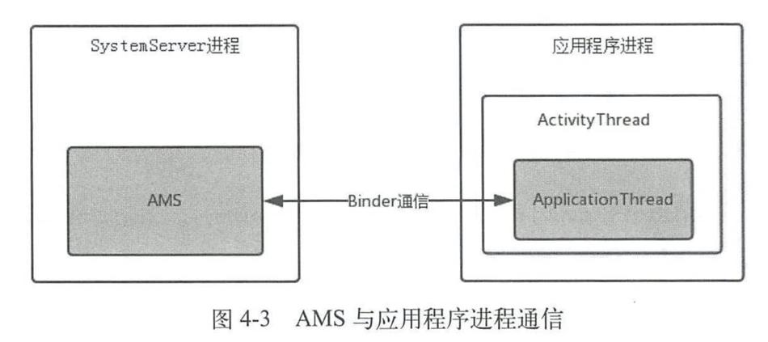

# 🌟总结

1. AMS 会先检查目标进程：已有可用进程就复用，否则由 AMS 通过 Socket 请求 Zygote 创建或提供应用进程。
2. 应用进程完成运行时和 Binder 线程池初始化后，进入 `ActivityThread.main()`，准备主线程消息循环、向 AMS 注册，再开始分发消息。
3. AMS 下发 `bindApplication` 指令，由应用主线程创建 Application 并执行其 `onCreate()`。

# Launcher 发起 Activity 启动请求

- **所在进程**：Launcher 进程。
- 用户点击应用图标，Launcher 使用指向入口 Activity 的 Intent 发起启动，通常包含 `ACTION_MAIN` 和 `CATEGORY_LAUNCHER`。
- 普通 `startActivity()` 路径经过 `Activity.startActivityForResult()`、`Instrumentation.execStartActivity()`，再通过 `ActivityTaskManager.getService()` 获取的 Binder 接口请求 ATMS。

> **ATMS 从 Android 10（Android Q，API 29）开始引入。**原先由 AMS 承担的 **Activity 和任务栈管理职责**被拆分到 ATMS，AMS 继续负责进程、Service、广播等管理。
>
> - **ATMS**：管 **Activity 和任务栈**，负责页面启动、切换及生命周期调度。
> - **AMS**：管 **应用进程、Service 和广播等**，负责进程管理及组件调度。
>
> 例如：启动 Activity 由 **ATMS** 调度；目标进程不存在时，交给 **AMS** 请求 Zygote 创建进程。

# ATMS 处理请求并检查目标进程

- ATMS 通过 Activity 启动调度逻辑解析目标、检查权限与启动限制，处理任务栈及 ActivityRecord。
- `ActivityTaskSupervisor.startSpecificActivity()` 检查目标进程是否已经存在并完成注册：
  - 有可用进程就进入 Activity 启动流程；
  - 没有则通过 `ATMS.startProcessAsync()` 请求 AMS 启动进程。

# AMS 请求 Zygote 创建应用进程

AMS 准备进程名入口类等参数，入口类为 `android.app.ActivityThread`。通过Socket通知Zygote fork应用进程。

# Zygote 创建子进程并进入应用入口

通过Zygote fork出应用进程，完成必要初始化后，最终执行Java代码的入口方法：`ActivityThread.main()`。

> 系统对此还有一套流程优化（USAP，Unspecialized App Process）
>
> **Zygote 提前 fork、尚未分配给具体应用的进程。**启动应用时，系统从池中取出一个 USAP，设置应用身份和运行参数，再执行应用初始化。
>
> 作用：**提前完成 fork，缩短启动时的等待时间**，代价是额外占用内存。

# ActivityThread 初始化主线程并向 AMS 注册

`ActivityThread.main()` 依次准备主线程 Looper、创建 ActivityThread、建立与AMS通信，随后进入 `Looper.loop()`。

- **ActivityThread**：应用主线程上的调度对象，负责 Application 初始化、Activity 生命周期等。
- **ApplicationThread**：应用向系统提供的 Binder 接口实现，接收 AMS/ATMS 的指令，再交给主线程执行。



## 主线程消息循环的Hook

见 [01 修改父类元数据实现 mH Hook.md](<../04 Hack/01 修改父类元数据实现 mH Hook.md>)

# AMS 下发应用绑定指令

- AMS 处理进程注册，通过 `IApplicationThread.bindApplication()` 下发应用信息等初始化参数。
- 应用侧 ApplicationThread 在 Binder 线程接收请求，向主线程 H 发送 `BIND_APPLICATION` 消息。
- 主线程开始分发消息后，执行 `ActivityThread.handleBindApplication()`。

# 应用主线程创建并初始化 Application

- `handleBindApplication()` 先准备应用的 Context 和资源访问环境。
- `handleBindApplication()` 内部会创建 Application 实例，调用 `attachBaseContext()` 绑定 Context。
- 安装本进程在此次绑定中需要初始化的 ContentProvider，并执行这些 Provider 的 `onCreate()`。
- 最后调用 `Application.onCreate()`。

## 初始化时的资源加载

```java
// ActivityThread
private void handleBindApplication(AppBindData data) {
    data.info = getPackageInfo(data.appInfo, ...); // 获取 LoadedApk

    // 先准备应用环境，这里会触发资源对象的创建或复用
    final ContextImpl appContext = ContextImpl.createAppContext(this, data.info);
    ...
    // 内部创建 Application，并为它绑定 Context
    Application app = data.info.makeApplicationInner(data.restrictedBackupMode, null);

    if (!data.restrictedBackupMode && !ArrayUtils.isEmpty(data.providers)) {
        installContentProviders(app, data.providers);
    }
    ...
    mInstrumentation.callApplicationOnCreate(app); // 最终调用 app.onCreate()
}
```

```java
// ContextImpl：合并展示 createAppContext() 的重载调用
static ContextImpl createAppContext(ActivityThread mainThread, LoadedApk packageInfo, ...) {
    ContextImpl context = new ContextImpl(..., mainThread, packageInfo, ...);
    context.setResources(packageInfo.getResources());
    ...
    return context;
}

// LoadedApk
public Resources getResources() {
    if (mResources == null) {
        final String[] splitPaths = getSplitPaths(null);
        ...
        mResources = ResourcesManager.getInstance().getResources(
                null, mResDir, splitPaths, mLegacyOverlayDirs, mOverlayPaths,
                mApplicationInfo.sharedLibraryFiles, ...);
    }
    return mResources; // 后续再调用时，复用已准备的 Resources
}
```

`handleBindApplication()` 获取到应用的 LoadedApk 后，已经知道应用 APK、相关 split APK 等资源位于哪里。接着调用 `ContextImpl.createAppContext()` 准备应用环境；ContextImpl 要提供 `getResources()` 能力，就会向 LoadedApk 调用 `getResources()`，取得应用的资源对象。

如果 LoadedApk 尚未持有 Resources，就把这些资源路径交给 ResourcesManager，由它创建或复用资源对象：Resources 提供访问接口，ResourcesImpl 承担具体实现，AssetManager 负责访问底层资源。 AssetManager 通过 ApkAssets 接入 APK，加载资源表（通常为 `resources.arsc`），从而具备按资源 ID 查找值或文件的能力。返回的 Resources 被 LoadedApk 缓存，并交给 ContextImpl 持有，此时 Context 已具备资源访问能力。

随后，`LoadedApk.makeApplicationInner()` 为 Application 准备 ContextImpl，复用上述资源对象，再通过 Instrumentation 实例化 Application，并调用 `Application.attach()` → `attachBaseContext()` 将 Context 绑定进去。因此，**Application 构造方法中尚不能通过自身访问资源；执行完 `super.attachBaseContext(base)` 后就可以了，无须等到 `onCreate()`。** 之后才是本次绑定的 ContentProvider 初始化和 `Application.onCreate()`。

