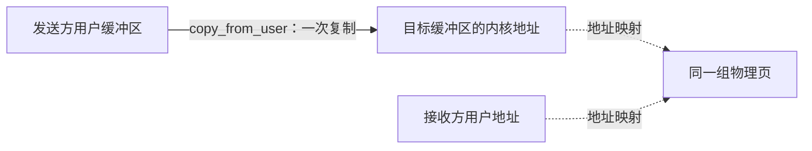
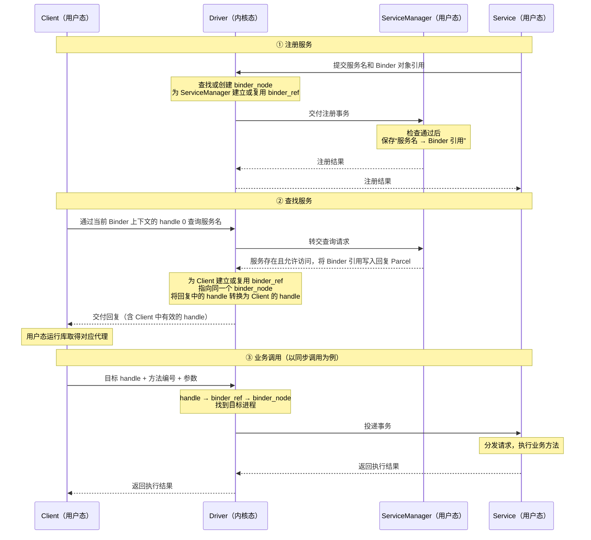

# Android 多进程

在组件的 Manifest 声明中设置 `android:process=":remote"`，可让组件运行在应用私有的 `包名:remote` 进程中；未指定时通常使用应用默认进程。进程按需创建，声明属性不代表立即启动。

多进程主要影响以下内容：

- **对象与同步**：静态变量、单例和普通线程锁只在各自进程内生效，不能直接共享状态或实现跨进程互斥。
- **初始化**：应用的各进程通常分别创建 Application，需要按进程安排初始化，避免重复启动不必要的任务。
- **数据一致性**：`SharedPreferences` 不支持跨进程使用，应通过明确的 IPC 接口统一读写共享状态。

# 序列化与数据传递

## 🌟整体介绍

**两者底层都是二进制数据：**

- **Serializable**：按 Java 对象序列化协议保存，包含类信息、字段描述和字段值。
- **Parcelable**：按约定顺序将字段写入 Parcel，读取时顺序和类型必须对应。

| 对比维度 | Serializable | Parcelable |
| --- | --- | --- |
| 定位 | Java 的通用对象序列化接口 | Android 面向 IPC 的数据编码接口 |
| 实现方式 | 实现标记接口，由 `ObjectOutputStream`、`ObjectInputStream` 默认处理对象状态，也可自定义读写逻辑 | 通过 `writeToParcel()` 写入、`CREATOR` 重建；Kotlin 可用 `@Parcelize` 生成实现 |
| 字段处理 | 默认保存非 `static`、非 `transient` 字段，并处理引用的对象 | 由手写或生成的代码决定传输哪些字段，读写顺序与类型必须对应 |
| 性能开销 | 通用机制需要处理类信息、对象关系等，通常开销较大 | 按约定编码字段，针对 Android IPC 优化，通常更高效 |
| 适用场景 | Java 对象流读写、兼容已有 Java 序列化数据；也能用于 Intent / Bundle | Android 组件传参、Binder 通信中的自定义数据 |
| 兼容性 | 需维护 `serialVersionUID` 和类结构兼容；版本号相同不保证任意变更都兼容 | 需保持双方读写约定一致；Parcel 格式不保证跨平台版本稳定 |

- Android 组件间传递自定义数据通常优先使用 Parcelable。
- 需要兼容 Java 对象流时可使用 Serializable，并维护数据版本
- Parcel 不适合长期存储或作为稳定的网络协议格式

## 🌟Parcel 有哪些局限？

Parcel 是 Parcelable 读写数据的容器，主要有这些局限：

- **格式不稳定**：不保证不同 Android 版本之间兼容，不适合长期存储，也不适合作为跨平台网络协议。
  - 有兜底格式不稳定的方法：可以预设一个版本号（即把版本号当成一个字段，写入Parcel）。但这样就复杂了，维护成本高。
- **维护成本较高**：手写 Parcelable 时，读写顺序和类型必须对应，修改字段要考虑双方兼容性。`@Parcelize` 能减少样板代码，但不能自动解决协议兼容问题。
- **不适合传输大数据**：通过 Binder 传输时，事务缓冲区约为 **1 MB，且由进程内进行中的事务共享**，容易触发 `TransactionTooLargeException`。这是 Binder 的限制，并非 Parcel 本身只能容纳 1 MB。

## Serializable 简单示例

实现 `Serializable` 标记接口即可，简单对象不需要手写字段读写逻辑：

```kotlin
import java.io.Serializable

data class SerializableUser(
    val id: Int,
    val name: String
) : Serializable {
    companion object {
        // 显式声明序列化版本号；字段变更仍需考虑兼容性。
        private const val serialVersionUID: Long = 1L
    }
}
```

发送对象：

```kotlin
import android.content.Intent

// 来源 Activity 中
val user = SerializableUser(id = 1, name = "小明")
val detailIntent = Intent(this, DetailActivity::class.java).apply {
    putExtra("serializable_user", user)
}
startActivity(detailIntent)
```

接收对象：

```kotlin
import androidx.core.content.IntentCompat

// DetailActivity.onCreate() 中
val user: SerializableUser? = IntentCompat.getSerializableExtra(
    intent,
    "serializable_user",
    SerializableUser::class.java
)
val name = user?.name
```

如果对象中还引用了其他自定义对象，默认序列化涉及的这些对象也需要支持 `Serializable`，否则可能抛出 `NotSerializableException`。

## Parcelable 简单示例

先看手写实现：`writeToParcel()` 负责写入，`CREATOR` 负责重建对象，**读取字段的顺序和类型必须与写入时一致**。

```kotlin
import android.os.Parcel
import android.os.Parcelable

data class ParcelableUser(
    val id: Int,
    val name: String
) : Parcelable {
    private constructor(parcel: Parcel) : this(
        id = parcel.readInt(),
        name = requireNotNull(parcel.readString())
    )

    override fun writeToParcel(dest: Parcel, flags: Int) {
        dest.writeInt(id)
        dest.writeString(name)
    }

    // 该对象不包含文件描述符，返回 0。
    override fun describeContents(): Int = 0

    companion object {
        @JvmField
        val CREATOR: Parcelable.Creator<ParcelableUser> =
            object : Parcelable.Creator<ParcelableUser> {
                override fun createFromParcel(source: Parcel): ParcelableUser =
                    ParcelableUser(source)

                override fun newArray(size: Int): Array<ParcelableUser?> =
                    arrayOfNulls(size)
            }
    }
}
```

发送对象：

```kotlin
import android.content.Intent

// 来源 Activity 中
val user = ParcelableUser(id = 1, name = "小明")
val detailIntent = Intent(this, DetailActivity::class.java).apply {
    putExtra("parcelable_user", user)
}
startActivity(detailIntent)
```

接收对象：

```kotlin
import androidx.core.content.IntentCompat

// DetailActivity.onCreate() 中
val user: ParcelableUser? = IntentCompat.getParcelableExtra(
    intent,
    "parcelable_user",
    ParcelableUser::class.java
)
val name = user?.name
```

实际 Kotlin 项目中，可以用 `@Parcelize` 自动生成上面的 Parcelable 实现。先在模块的 `build.gradle.kts` 中启用插件：

```kotlin
plugins {
    id("kotlin-parcelize")
}
```

然后用下面的定义**替换**手写的 `ParcelableUser`，发送和接收代码保持不变：

```kotlin
import android.os.Parcelable
import kotlinx.parcelize.Parcelize

@Parcelize
data class ParcelableUser(
    val id: Int,
    val name: String
) : Parcelable
```

`@Parcelize` 会生成字段读写逻辑和 `CREATOR`，这些代码仍然遵循 Parcelable 机制。

# Binder

## 传统IPC方式的不足

**Android 需要频繁调用其他进程的服务，传统 Linux IPC 通常还需要额外封装这些能力：**

| 方面     | 传统 IPC 的不足                                         | Binder 的改进                                    |
| -------- | ------------------------------------------------------- | ------------------------------------------------ |
| 使用方式 | 管道、Socket 主要传字节，方法、参数和返回值需要自己组织 | 提供 RPC，调用形式接近普通方法调用               |
| 传输开销 | 普通管道、Socket 的常规读写通常需要两次载荷复制         | 普通 Binder 事务通过接收区映射，实现一次载荷复制 |
| 身份鉴权 | 需要结合具体 IPC 的身份机制，自行接入权限检查           | 每次调用携带内核提供的 UID，方便服务鉴权         |
| 对象管理 | 远程对象引用、回调和失效处理需要自行设计                | 提供引用管理和死亡通知                           |

但不能概括为“传统 IPC 都慢、不安全”：共享内存传大数据很高效，但需要自行同步；Unix Socket 也能获取可信的对端身份。

### 与其他 IPC 方式的取舍

Binder 适合系统服务的接口调用，Socket 和共享内存也有各自的用途：

| 方式     | 更适合的场景                                               | 需要考虑的问题                               |
| -------- | ---------------------------------------------------------- | -------------------------------------------- |
| Binder   | 本机进程间的接口调用、控制消息和回调                       | 事务缓冲区有限，需要处理线程安全和远端失效   |
| Socket   | 本机流式通信、已有协议对接；网络 Socket 还可用于跨设备通信 | 需要选择或设计应用层协议，处理连接与消息组织 |
| 共享内存 | 多进程交换大量数据，减少重复搬运                           | 需要协调读写同步、访问权限和内存生命周期     |

这些机制也可以组合使用：例如，通过 Binder 传递控制信息和文件描述符，用共享内存或文件承载大数据，避免让大块内容占用 Binder 事务缓冲区。

## 🌟Binder设计原因

> Android 选择 Binder，因为它
>
> 1. 调用方便：支持面向对象的远程过程调用（RPC）
> 2. 传输高效：数据只需要复制一次
> 3. 安全性：内核提供可信 UID，驱动校验对象引用，Service 执行权限检查
> 4. 对象引用管理：支持对象引用和生命周期管理

Android 的应用与系统服务分布在不同进程中，访问相机等系统能力需要频繁进行跨进程调用。从这一架构需求看，Binder 的优势是将远程接口调用、调用者身份、对象引用和生命周期管理整合在一起，同时控制本机通信的传输开销。

### 便于组织跨进程的服务接口

Binder 支持面向对象的远程过程调用（RPC）：Client 持有代理，通过接口调用 Service 提供的方法；调用形式接近本地方法调用，但仍需处理跨进程调用的延迟、并发和失败。

### 减少事务数据的复制开销

对于普通 Binder 事务，驱动将发送方用户缓冲区中的数据复制到接收方映射的事务缓冲区，接收方可以直接读取这些数据，省去从内核接收缓冲区再复制到接收方用户缓冲区的一次复制。这有利于频繁传递方法参数、结果和控制消息。



> 图中的实线表示数据复制，虚线表示地址映射，映射本身不复制数据。
>

具体分三步：

1. **接收方准备接收区（接收方用户空间）**
   Binder 运行库通过 `mmap()` 在接收进程中建立一块只读的虚拟地址区域。驱动根据需要分配物理页，并将其映射到这个区域。
2. **发送方通过driver将数据复制进去**
   发送方通过 `ioctl()` 提交事务，携带数据地址、长度等信息。驱动找到接收缓冲区对应的物理页，通过 `kmap_local_page()` 获得内核可访问地址，再调用 `copy_from_user()`，将发送方数据复制进去。
3. **接收方直接读取这些物理页**
   驱动把接收缓冲区在接收进程中的地址随事务通知交给接收方。接收方通过自己的虚拟地址，读取刚才写入的同一份数据，因此省去了第二次载荷复制。

这里共享物理页的是**内核与接收方**；发送方原始缓冲区仍是另一份内存。

### 提供可靠的调用者身份

Binder 驱动提供调用方的 UID，Service 在处理传入事务时可通过 `Binder.getCallingUid()` 取得它，结合 Android 权限机制判断调用者是否有权执行操作，避免依赖请求参数中自报的身份。**可靠身份为鉴权提供依据，具体接口仍需执行相应的权限检查。

### 支持对象引用和生命周期管理

Binder 可以跨进程传递对象引用，便于提供回调接口和会话对象；其引用管理机制协调远程对象的生命周期。客户端还可以通过 `linkToDeath()` 注册死亡通知，在远端进程退出时清理状态或准备重新连接。这些能力减少了各个服务自行维护远程对象关系和失效通知的工作。持有引用并不能保证服务进程一直存活。

## 🌟Binder通信模型

| 角色 | 所在空间 | 主要职责 |
| --- | --- | --- |
| Client | 用户空间 | 持有服务的代理，发起调用 |
| Service | 用户空间 | 提供 Binder 实现对象，执行具体业务 |
| ServiceManager | 用户空间 | 管理服务名称与 Binder 引用的对应关系，提供注册和查询 |
| Binder Driver | 内核空间 | 投递事务、转换跨进程引用、管理接收缓冲区和引用状态 |

### 用户态对象、内核节点与引用

这几个概念需要区分：

- **用户态 Binder 对象**：位于 Service 进程中。真正实现业务方法的对象，例如 AIDL 的 `Stub` 实现
- **`binder_node`**：位于内核空间。驱动为本地 Binder 对象维护的内核管理记录，包含所属进程、对象标识和引用状态等。
- **`binder_ref` **：位于内核空间。驱动用 `binder_ref` 记录某个进程对目标节点的引用
- `handle`：客户端代理持有，内核也记录。一个整数编号。该进程通过 handle 查找对应的 `binder_ref`。


两个客户端调用同一个服务对象：

```
客户端 A：handle=3 → binder_ref A ─┐
                                 ├→ 同一个 binder_node → 服务端 Binder 对象
客户端 B：handle=8 → binder_ref B ─┘
```

注意：

- **handle 只在所属进程的 Binder 驱动连接内有效**，不是全局对象编号。
- **`binder_node` 只管理对象的通信和引用信息**，不会复制或同步对象里的业务字段。

### 整体流程



Binder 的四个角色：Client 发起调用，Service 处理业务，ServiceManager 帮忙找服务，Driver 负责跨进程传递请求和结果。

拿一个通过 ServiceManager 注册、供其他进程调用的系统服务来说，流程是这样的：

**注册服务**

1. Service 创建本地 Binder 对象，将服务名和 Binder 对象引用通过 Driver 传给 ServiceManager 注册。
2. Driver 创建该对象对应的 `binder_node`，为 ServiceManager 建立相应的 `binder_ref`，然后交给 ServiceManager注册。
3. ServiceManager 保存“服务名 → Binder 引用”的对应关系。

**查找服务**

1. Client 通过 **handle 0** 向 ServiceManager 查询服务名。服务存在且允许访问时，ServiceManager 把对应的 Binder 引用写入回复 Parcel，其中携带的是 ServiceManager 使用的 handle。
2. Driver 根据这个 handle 找到同一个 `binder_node`，为 Client 建立或复用 `binder_ref`，并将回复中的 handle 转换成 Client 可用的值。Client 的运行库读取回复后，据此取得代理。

**业务调用**

1. Client 获得代理后，通过 Driver 向 Service 发起业务调用，**业务请求不再经过 ServiceManager**。

数据传输可以简单理解为：接收方先通过 `mmap()` 建立接收缓冲区的映射。普通 Binder 事务中，Driver 把发送方用户缓冲区的数据复制到接收方缓冲区的底层物理页，接收方再通过自己的用户空间地址读取这份数据。

### 匿名Binder

Binder 对象不必向 ServiceManager 注册名称，也可以作为参数、返回值或回调接口，通过已有的 Binder 调用传给其他进程。例如，Client 可以把回调 Binder 传给 Service，Service 再通过它通知 Client；传递通道本身也可以是匿名 Binder。

**没有取得引用的进程，不能仅靠猜测其他进程的 handle 来访问任意 Binder；已经持有引用的一方，在安全策略允许时可以继续将它转交给第三方。** 因此，匿名 Binder 不保证仅限最初两方使用，敏感接口仍需检查调用者身份和权限。

# IPC 方式选择

| 方式 | 适用场景与主要限制 |
| --- | --- |
| Intent / Bundle | 启动组件、发送广播时携带少量数据；Bundle 本身不是独立的 IPC 通道 |
| Messenger | 基于 Binder 发送 Message，由目标 Handler 串行处理；可通过 `replyTo` 回复，适合简单消息交互 |
| AIDL | 跨进程的类型化接口调用，支持回调和并发请求；服务端需要处理线程安全 |
| ContentProvider | 通过 URI 提供结构化数据访问与共享，常见操作为增删改查；跨进程访问基于 Binder |
| 文件共享 | 交换需要持久化的数据；需自行处理访问权限、并发读写和更新通知 |
| Socket | 本机或跨设备通信；需自行设计协议、连接管理和身份验证 |

Messenger 的串行性限于目标 Handler 的消息处理，不代表应用其他线程无需同步。ContentProvider 的数据访问方法也可能被多线程调用，不能根据一次同进程测试就认定其始终运行在主线程。
