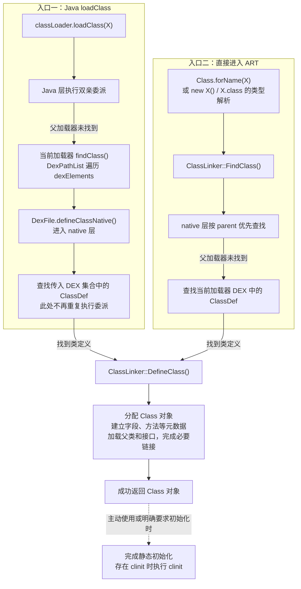

# 🌟🌟🌟完整链路

## 类从源码到运行时

Android 类从源码到运行时，大致经历下面几个阶段：

1. Kotlin 或 Java 源码经过 Kotlin 编译器或 `javac` 编译，生成 JVM 字节码（`.class`）。
2. D8 将 `.class` 转换成 DEX 字节码；开启代码压缩时，由 R8 完成优化并生成 DEX。
3. Android Gradle Plugin 将 DEX 打包进 APK，或者放入 AAB 的相应模块。
4. 应用安装后，PackageManager 登记 Base APK 和 Split APK 的路径。
5. 应用进程启动时，系统根据 APK 路径创建应用 ClassLoader。
6. 运行时加载类（见下）

## 类在运行时如何被加载

> PathClassLoader
> └── BaseDexClassLoader
>     └── pathList: DexPathList
>
> DexPathList
> └── dexElements: Element[]
>     ├── Element(Base APK → DexFile)
>     ├── Element(classes2.dex → DexFile)
>     └── Element(Feature Split APK → DexFile)
>
> - `dexElements`：有序的代码路径列表；
> - `Element`：对一个代码来源的包装；
> - `DexFile`：Element 内部用于访问 DEX 内容的对象；
> - `Class`：ART 根据某个类定义创建的运行时对象。

一个类进入运行时后，大致按照下面的顺序被加载：

1. 程序首次使用某个类时，向当前 ClassLoader 发起加载请求。
2. `loadClass()` 先检查该类是否已经加载；如果没有，则委托 parent 查找。
3. parent 未找到时，应用 `PathClassLoader` 按顺序遍历 `dexElements`，在各个 DEX 中查找类定义。
4. 某个 Element 命中目标类后，通过对应的 `DexFile` 将类名和 defining ClassLoader 交给 ART。
5. ART 创建对应的 `Class` 对象，并完成验证和链接。
6. 首次主动使用该类时，ART 执行静态初始化逻辑；此后即可创建对象或调用方法。

# 从源码到 JVM 字节码

Android 项目中的 Java 和 Kotlin 源码会先被各自的编译器编译成 JVM `.class` 文件。这些 `.class` 是后续 D8 或 R8 生成 DEX 的输入，并不会直接由 Android 运行时执行。

# 从 class 到 DEX

## DEX 是什么

DEX 是 Dalvik Executable 的缩写。它不是简单地把多个 `.class` 文件拼接到一起，而是重新组织类定义、字符串、类型、字段和方法等数据，使多个类可以共享相同的数据表。

DEX 文件主要包含：

- 字符串、类型、原型、字段和方法 ID 表；
- 每个类的定义及其继承关系；
- 方法对应的 DEX 指令；
- 注解、调试信息及其他元数据。

## D8 的职责（面向debug）

D8 接收项目及依赖中的 JVM 字节码，完成 desugaring，并生成 DEX 字节码。Android Gradle Plugin 会替应用组织这些输入，通常不需要直接调用 D8。

## R8 的职责（面向release）

开启代码压缩后，R8 会分析整个程序，并完成多项工作：

- Shrinking：删除被判断为不可达的类、字段和方法；
- Optimization：内联或重写部分代码；
- Obfuscation：缩短类名、方法名和字段名；
- Dexing：生成最终 DEX。

R8 会直接影响运行时类查找：

- 类被删除后，运行时自然不可能找到它；
- 类被混淆后，原始字符串类名可能不再有效；
- 反射、JNI、序列化和框架回调等隐式入口需要正确的 keep 规则。

## 为什么会有多个 DEX（64K限制）

DEX 不会在每条指令中重复保存完整的方法名、类型和参数，而是把被引用的方法集中记录在 `method_ids` 等表中，指令只保存对应的索引。这样可以减小指令体积并提高查找效率，但索引位数是有限的。

方法引用索引使用 16 位表示，取值范围为 `0x0000`～`0xffff`，因此单个 DEX 最多只能容纳 65,536 个方法引用：

```text
16 位索引 → 2¹⁶ = 65,536 个可用编号
```

这里限制的是方法引用数，不只是应用自己声明的方法数，还包括代码引用的依赖库方法和 Android Framework 方法。字段等其他索引也存在类似限制。当一个 DEX 无法容纳全部引用时，构建工具就会把代码拆分到多个具有独立索引表的 DEX 中：

```text
classes.dex
classes2.dex
classes3.dex
...
```

# DEX 如何进入 APK 与 AAB

 [02 Android编译产物基础.md](../02 应用层/02 Android编译打包/02 Android编译产物基础.md)

# 安装与 ART 编译产物

## PackageManager 登记 APK 路径

安装 APK 后，PackageManager 会校验并登记应用及其代码路径。对包含 split 的应用，运行时可以从 `ApplicationInfo` 获得：

- `sourceDir`：Base APK 路径；
- `splitNames`：已安装 split 的名称；
- `splitSourceDirs`：已安装 split 的 APK 路径。

这些路径是后续建立应用 ClassLoader 的输入。Base 与 split 虽然是多个文件，但平台可以把它们作为同一个已安装应用处理。

## DEX 优化不等于类加载

安装期间或安装后，ART 可能验证 DEX，并通过 `dex2oat`、后台编译任务和 profile 生成优化产物。Android 7.0 以后通常综合使用：

> 见 [05 虚拟机.md](<./05 虚拟机.md>)

- 解释执行；
- JIT，即运行时即时编译；
- AOT，即运行前编译；
- 基于 profile 的引导优化。

需要区分两件事：

```text
类加载：根据类名找到定义，并在 ART 中形成 Class 对象
方法编译：把方法的 DEX 指令转换成可执行机器码
```

某个方法可以已经被 AOT 编译，但对应类仍要经过运行时解析；某个类也可以已经加载，而其中的方法仍通过解释器执行，之后才被 JIT 编译。

# 应用进程如何建立类路径

## Zygote 与框架类

Android 应用进程通常由 Zygote fork 而来。Zygote 已经加载了一批系统框架类，因此应用进程可以共享这些只读内存页，减少启动成本。

框架类位于 boot class path，由引导类加载体系负责。应用自己的类不在 boot class path 中，而是由应用 ClassLoader 加载。这表示应用 ClassLoader 遇到 `java.lang.String`、`android.app.Activity` 等类型时，会优先委托给能够访问系统类的父加载器，而不是从应用 DEX 中定义同名类型。

## 🌟系统收集 Base 与 split 路径

应用启动时，framework 中的 `LoadedApk` 根据 `ApplicationInfo.sourceDir` 与 `splitSourceDirs` 组织代码路径，默认顺序是 Base 在前、split 在后。随后 `ApplicationLoaders` 创建或复用应用 ClassLoader。

```text
ApplicationInfo
├── sourceDir = /data/app/.../base.apk
└── splitSourceDirs = [.../split_feature.apk, ...]
             ↓
LoadedApk.makePaths()
             ↓
ApplicationLoaders
             ↓
PathClassLoader
```

`Context.getClassLoader()` 最终返回的就是能够加载该 Context 对应包代码的 ClassLoader。

## 默认模式与 isolated split

默认情况下，Base APK 和普通 split 的代码路径通常进入同一个应用 `PathClassLoader`，并不是每个 APK 创建一个 ClassLoader。

isolated split 是 Android 8.0（API 26）引入的 split 隔离加载模式。在 Base APK 的 `<manifest>` 中设置 `android:isolatedSplits="true"` 后，split 的代码和资源不会再自动加入 Base Context；framework 会根据依赖关系，为含代码的 feature split 创建对应的 ClassLoader 和 Context。

此时，split Context 只能访问 Base、自身及其依赖 split 的代码和资源，不能直接访问无依赖关系的其他 split。需要主动获取某个 split 的环境时，可以调用 `Context.createContextForSplit(splitName)`。

这种隔离只限制代码和资源的查找范围，不会改变应用的进程、UID 或权限。它也不是 Dynamic Feature 的默认行为，不能与 `isolatedProcess` 混为一谈。

### 应用场景

isolated split 主要适用于模块较多、依赖关系明确的大型应用：一方面可以限制 Base 和各 feature split 只能访问声明的依赖，避免无关模块产生隐式耦合；另一方面可以通过独立 Context 按需加载已安装 split 的代码和资源，避免全部加入 Base 的查找范围。

普通 Dynamic Feature 通常使用默认模式即可。由于 isolated split 不提供进程或权限隔离，因此不适合用来运行不可信插件。

## 常见 Android ClassLoader

| ClassLoader | 主要用途 | 创建时机 |
| --- | --- | --- |
| `BootClassLoader` | 加载 boot class path 中的系统核心类，属于运行时内部实现 | Java 层单例在首次调用 `getInstance()` 时创建；普通应用通常继承 Zygote 中已创建的实例 |
| `PathClassLoader` | Android 默认用来加载应用 APK、split 和系统库代码 | 应用默认加载器通常在进程启动、绑定应用期间按需创建，早于 `Application` 实例化；隔离 split 的加载器有各自的创建时机 |
| `DexClassLoader` | 从包含 DEX 的 APK、JAR 或 DEX 路径创建额外加载器 | 由应用或相关框架在需要动态加载代码时显式调用构造方法创建 |

`PathClassLoader` 和 `DexClassLoader`的区别

- **`PathClassLoader`**：应用默认加载器，通常由系统创建，加载应用 APK 及依赖。
- **`DexClassLoader`**：通常由开发者按需创建，动态加载额外的 DEX、APK 或 JAR，例如插件。
- 二者都继承 `BaseDexClassLoader`，底层机制相近，主要区别是**使用场景和构造参数**。


### BootClassLoader

#### **主要用途**

通过 ART 的引导加载机制，加载 boot class path 中的 Java 核心库和 Android Framework 基础类，为应用提供系统级基础类型。

例如：

- Java 核心类：`java.lang.String`、`java.util.ArrayList`。
- Android Framework 类：`android.app.Activity`、`android.view.View`、`android.os.Bundle`。

应用使用这些类时，即使加载请求从应用 ClassLoader 发起，最终也会委托给引导加载体系，从系统代码中取得定义。

#### 加载时机

> [!IMPORTANT]
>
> **Zygote 阶段准备，应用进程继承**

Java 层的 `BootClassLoader` 采用懒加载单例：首次调用 `BootClassLoader.getInstance()` 时执行 `new BootClassLoader()`，后续调用返回已有实例。这个实例通常在 Zygote 初始化期间就已准备好，子进程继承相应的内存状态，因此不需要为每个应用重新创建一个 `BootClassLoader`。例如，Zygote 预先缓存部分系统库加载器的流程，就会通过 `ApplicationLoaders` 获取系统 ClassLoader 及其 parent。

> 这里说的是 Java 层加载器对象的创建；ART 对核心类的引导加载能力属于运行时机制，不能理解成必须先创建这个 Java 对象，才能加载 `java.lang.ClassLoader` 等核心类。
>

### PathClassLoader

略

### DexClassLoader：业务需要动态代码时显式创建

`DexClassLoader` 没有统一的系统启动创建时机。应用或插件框架准备好 DEX、APK、JAR 路径后，通过 `new DexClassLoader(...)` 创建实例，parent 通常传入宿主应用的 ClassLoader。例如，插件可以在应用启动阶段初始化，也可以在用户首次进入相关功能时才创建加载器。

安装或下载代码文件本身不会自动创建 `DexClassLoader`。是否创建、何时创建、是否缓存复用，都由调用方决定。创建加载器主要是建立代码查找环境，具体类仍在后续使用或调用 `loadClass()` 时按需加载。

# ClassLoader 内部如何表示 DEX

## BaseDexClassLoader

应用 `PathClassLoader` 继承自 `BaseDexClassLoader`。后者保存核心字段 `pathList`：

```text
PathClassLoader
└── BaseDexClassLoader
    └── pathList: DexPathList
```

`BaseDexClassLoader.findClass()` 自己不解析 DEX，而是把查找交给 `pathList.findClass()`。

## DexPathList 与 dexElements

`DexPathList` 把每个 DEX、APK 或含 DEX 的容器表示成一个 `Element`，并保存在有序的 `dexElements` 数组中：

```text
DexPathList
└── dexElements: Element[]
    ├── Element(Base APK → DexFile)
    ├── Element(classes2.dex → DexFile)
    └── Element(Feature Split APK → DexFile)
```

这里的 `Element` 不是一个类，而是一个代码容器。一个 Element 对应的 `DexFile` 中可以包含大量类。

> 一个 `Element` 通常对应一个加入类路径的代码来源，例如整个 `base.apk`、某个 split APK，或者一个独立的 `.dex` 文件。

`DexPathList.findClass()` 会按数组顺序遍历 Element，并返回最先找到的类。AOSP 源码明确把它描述为“在最早列出的 path element 中命中”。

这会产生一个重要结果：如果不同 DEX 中存在相同二进制名称的类，排在前面的 Element 优先。但已经定义过的类还会更早被 `findLoadedClass()` 命中，所以仅修改 Element 顺序也无法替换当前 ClassLoader 已经加载的类。

## DexFile

Element 内部的 `DexFile` 表示 ART 已打开的 DEX。查找命中后，调用链可以概括为：

```text
BaseDexClassLoader.findClass(name)
        ↓
DexPathList.findClass(name)
        ↓ 遍历 dexElements
Element.findClass(name)
        ↓
DexFile.loadClassBinaryName(name, definingClassLoader)
        ↓
ART native runtime 定义类
```

最终定义类的是 ART 的 native 实现，Java 层的 ClassLoader、DexPathList 和 DexFile 主要负责维护路径、执行委派和把查找请求传给运行时。

# Class缓存

已加载类的登记、查找和链接主要由 ART 的 native 层管理。

具体略。

# 类在运行时如何被加载

常见触发点包括：

- 创建对象；
- 调用某个尚未加载类的静态方法；
- 访问某些静态字段；
- framework 根据 Manifest 中的类名创建 Activity、Service、Provider 或 Application；
- `Class.forName()` 或其他反射调用；
- 解析另一个类的字段、方法签名或父类时需要该类型。

编译期能解析某个类型，只说明编译器当时能在依赖中找到它；运行时是否能加载，还要看目标类是否保留在最终 DEX 中，以及对应 DEX 是否位于当前 ClassLoader 的查找范围。


| 方式                         | 从哪里进入加载流程                                           |
| ---------------------------- | ------------------------------------------------------------ |
| `new X()`、`X.class`         | 由 **ART 解析 DEX 中的类型引用**，需要时查找、加载 `X`。     |
| `Class.forName("X")`         | Java API 内部通过 native 方法，**直接进入 ART 的 `ClassLinker::FindClass()`**，不是先调用 Java 的 `loadClass()`。 |
| `classLoader.loadClass("X")` | **从 Java 层的 `loadClass()` 方法开始**，过程中通过 native 方法进入 ART。 |

## ART 是如何加载类的

ART 中主要由 native 层的 **`ClassLinker`** 负责：**结合类描述符和 ClassLoader 查找类，必要时读取 DEX 中的类定义，建立 `Class` 对象及字段、方法等运行时结构。**

### 🌟总结

以下以标准 `PathClassLoader`、`DexClassLoader` 为例，假设目标普通类尚未加载，且最终能从 DEX 成功加载。

1. `Class.forName("X")` 通过 native 方法进入 ART 的 `FindClass()`；`new X()`、`X.class` 在解析目标类型时，也会进入该查找流程。ART 在 native 层遵循父加载器优先的规则，父加载器找不到时，再查找当前加载器自己的 DEX。
2. `classLoader.loadClass("X")` 先在 Java 层执行双亲委派。轮到应用加载器查找自己的 DEX 时，通过 `DexFile.defineClassNative()` 找到类定义并直接调用 `DefineClass()`，这一步不会再为目标类重复执行双亲委派。但不能据此认为整个 `loadClass()` 流程都不会调用 `FindClass()`，例如委派到 `BootClassLoader` 时仍会进入它。
3. 两条路径最终都会通过 `DefineClass()`，将 DEX 类定义转换为运行时结构。`DefineClass()` 成功返回后，就有了完成必要链接的 `Class` 对象，但不代表已经完成静态初始化。

下图展示父加载器未找到 `X`、最终从当前应用加载器的 DEX 定义 `X` 的主流程：



### 进入 ART 的两条常见路径

1. 显式调用 Java 的 `ClassLoader.loadClass()`。
2. ART 自己解析类型引用，或通过 `Class.forName()` 进入。

### FindClass：先查已加载类，再按加载器规则寻找定义

`ClassLinker::FindClass()` 的主要工作如下：

1. **查询已加载类表。** 通过 `LookupClass()`，在对应 ClassLoader 的类表中按描述符查找；命中后通过 `EnsureResolved()` 确保类已完成必要的链接。如果其他线程正在定义这个类，可能需要等待。
2. **查找系统类。** 对引导加载器，从 boot class path 中寻找定义；ART 内部通常用空 ClassLoader 引用表示引导加载器。
3. **查找应用类。** 对能识别的 `PathClassLoader`、`DexClassLoader` 等加载器，ART 可以直接在 native 层遍历加载器关系和 DEX。普通应用加载器仍按 parent 优先的规则查找，还会处理配置的共享库加载器。
4. **必要时回调 Java。** 遇到不能识别的自定义加载器时，调用其 Java `loadClass()`，让自定义逻辑决定如何加载；部分查找失败路径也会回到 Java。

所以，**没有经过 Java `loadClass()` 方法体，不代表跳过了 ClassLoader 的查找范围和委派规则**。ART 可以直接实现已知加载器的查找流程。

### DefineClass：把 DEX 类定义变成运行时结构

`DefineClass()` 成功返回后，就有对应的 `Class` 对象了，并且已经完成必要的链接。

# loadClass 的双亲委派

`ClassLoader.loadClass(name)` 的默认查找过程可以概括为：

1. 调用 `findLoadedClass()`，检查该 ClassLoader 是否已经加载过目标类；
2. 如果没有，委托 parent 加载；
3. parent 找不到时，再调用当前加载器的 `findClass()`；
4. 仍然找不到则抛出 `ClassNotFoundException`。

```text
应用请求 com.example.User
        ↓
应用 PathClassLoader 是否已加载？
        ↓ 否
委托父加载器查找
        ↓ 找不到应用类
应用 PathClassLoader.findClass()
        ↓
遍历自己的 dexElements
```

这通常称为 parent-first 或双亲委派。父子关系由 ClassLoader 构造时保存的 `parent` 引用形成，不是 Java 类继承关系。

**采取双亲委托模式主要有如下两点好处：**

-   避免重复加载，如果已经加载过一次Class，就不需要再次加载，而是直接读取已经加载的Class。
-   更加安全，如果不使用双亲委托模式，就可以自定义一个String类来替代系统的String类，这显然会造成安全隐患，采用双亲委托模式会使得系统的String类在Java虚拟机启动时就被加载，也就无法自定义String类来替代系统的String类，除非修改类加载器搜索类的默认算法。还有一点，只有两个类名一致并且被同一个类加载器加载的类，Java虚拟机才会认为它们是同一个类。

采用双亲委托，主要是为了：**让公共类由共同的父加载器统一提供，保持类型一致，并优先使用系统核心类。**

1. 保持公共类型的一致性
   前面提到，运行时判断类型身份的依据是：类型身份 = 类名 + 定义它的 ClassLoader
   即使代码完全相同，两个加载器分别定义的 `com.example.User`，也是不同类型，彼此强转可能发生 `ClassCastException`。
2. 优先使用系统核心类，避免同名代码干扰
   例如应用请求 `java.lang.String` 时，会优先委托到引导加载体系，使用系统提供的定义。在默认委托流程下，应用 DEX 中的同名类不会优先取代它。
3. 复用公共类，减少重复定义和相关开销
   父加载器能够提供某个类时，子加载器直接使用它，避免每个子加载器都为同一份公共代码建立自己的类型及运行时元数据。

## DEX 内部查找

轮到应用 `PathClassLoader.findClass()` 后，查找过程是：

```text
dexElements[0] 是否包含目标类？──是──▶ 定义并返回
        │ 否
        ▼
dexElements[1] 是否包含目标类？──是──▶ 定义并返回
        │ 否
        ▼
继续遍历，全部失败后抛出 ClassNotFoundException
```

## 🌟加载、链接和初始化

“加载一个类”在宽泛表述中常包含几个阶段：

1. 加载：找到 DEX 中的类定义，并在 ART 中创建对应的 `Class` 对象；
2. 验证：检查字节码结构、类型使用和指令是否合法；
3. 链接：准备类的运行时结构，并解析父类、接口、字段和方法等符号引用；
4. 初始化：执行静态初始化逻辑，也就是编译结果中的 `<clinit>`。

ART 可以提前验证或延迟解析部分内容，因此这些阶段在具体实现中不一定严格集中发生在一个瞬间。对业务最重要的区分是：

- 得到 `SomeClass::class.java` 不等于已经执行该类的静态初始化；
- `Class.forName("com.example.SomeClass")` 默认会初始化类；
- `Class.forName(name, false, loader)` 可以请求加载但不主动初始化；
- 一个类的静态初始化失败后，后续使用可能得到 `NoClassDefFoundError`。


**类第一次被“主动使用”时，会触发静态初始化。** 常见情况有：

| 操作                                     | 示例                                     |
| ---------------------------------------- | ---------------------------------------- |
| 创建实例                                 | `SomeClass()`                            |
| 调用该类声明的静态方法                   | `SomeClass.doSomething()`                |
| 读取或修改该类声明的非编译期常量静态字段 | `SomeClass.count`                        |
| 通过反射要求初始化                       | `Class.forName("com.example.SomeClass")` |

## 类何时真正占用内存

把 APK 路径放入 ClassLoader，只是让 DEX 成为可搜索来源，不会把其中所有类对象一次性创建出来。

运行时通常按需完成：

- 映射或打开 DEX 及相关 ART 编译产物；
- 为实际使用的类建立运行时元数据；
- 解析实际访问到的字段和方法；
- 对热点方法进行 JIT 编译。

因此“安装了一个很大的 DEX”“ClassLoader 已经包含该 DEX”和“DEX 中所有类都驻留在内存”是三种不同状态。

# 动态扩展类路径

## Dynamic Feature

Dynamic Feature 的类也遵循本文描述的完整链路：源码先变成 Feature DEX，再被打包进 Feature Split APK。区别只在于按需模块的 split 可能在应用进程启动后才安装。

默认应用 ClassLoader 已经建立时，新 Feature DEX 不在原有 `dexElements` 中。Play Feature Delivery 的兼容层需要让当前进程认识新增的 split，后续 `loadClass()` 才能找到 Feature 类。具体注入过程见 [Google Dynamic Feature 插件](<../02 应用层/02 Android编译打包/03 Google DF插件.md#dynamic-feature-安装后的运行时加载机制>)。

## 热修复与插件化

热修复和插件化也常修改 DEX 路径，但目标不同：

- 热修复：可能把补丁 DEX 放在原 DEX 前面，尝试优先命中修复类；
- 插件化：可能创建独立 ClassLoader，形成代码隔离与依赖边界。
