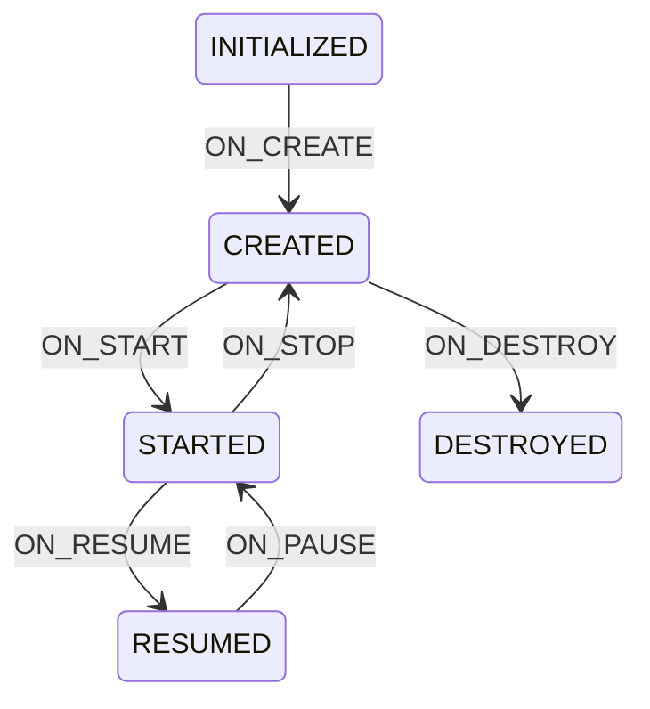
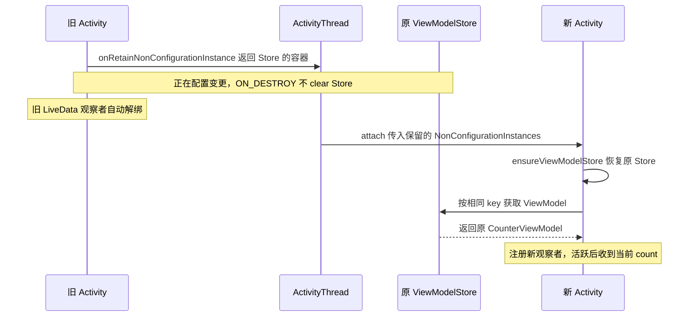

# Lifecycle

## 阅读范围与源码版本

本文用一个“点击计数器” Demo 串起三个组件：**Lifecycle 告诉观察者页面处于什么状态，LiveData 决定何时把数据交给页面，ViewModel 保存页面需要的数据并跨配置变更复用。**

为了让代码和调用链可以逐段对照，固定使用以下版本；它们是本文的分析基线，不表示当前最新版本。Lifecycle 2.8 已有 Kotlin Multiplatform 拆分，因此会同时看到 `commonMain`、`jvmMain`、`androidMain` 中的实现，不能直接套用旧文章中的 Java 文件名。

| 范围 | 固定版本 | 官方源码与定位入口 |
| --- | --- | --- |
| Lifecycle、LiveData、ViewModel | 2.8.7 | [版本说明](https://developer.android.com/jetpack/androidx/releases/lifecycle#2.8.7)、[Runtime 源码包][runtime-src]、[Common 源码包][common-src]、[LiveData 源码包][live-src]、[ViewModel 源码包][vm-src] |
| Activity | 1.9.3 | [版本说明](https://developer.android.com/jetpack/androidx/releases/activity#1.9.3)、[源码包][activity-src] |
| AndroidX Core | 1.13.1 | [源码包][core-src]，用于追踪 `androidx.core.app.ComponentActivity` |
| Arch Core | 2.2.0 | [Runtime 源码包][executor-src]，用于追踪 LiveData 的主线程调度 |
| Android Framework | Android 14，`android-14.0.0_r1` | [Activity.java][platform-activity]、[ActivityThread.java][platform-thread]，用于追踪配置重建时的对象交接 |

**源码阅读约定：**下面标注“源码”的代码来自上述官方源码；为便于阅读省略了包名、导入、部分注解和原有注释。方法内部有删节时用 `// ...` 标明；“Demo”“调用链”“预期现象”属于示例或分析，不是框架原文。AndroidX/AOSP 源码版权归 The Android Open Source Project，采用 [Apache License 2.0](https://www.apache.org/licenses/LICENSE-2.0)。

## 贯穿全文的计数器 Demo

### 依赖与运行条件

在普通 Android Kotlin 应用模块中添加以下依赖，仓库包含 `google()` 和 `mavenCentral()`。可以使用 `compileSdk = 35`、`minSdk = 23`；若原项目已有更高版本依赖，以 Gradle 最终解析结果为准，要逐行复现本文应使用独立 Demo 模块。

```kotlin
// app/build.gradle.kts 中的 dependencies
implementation("androidx.core:core-ktx:1.13.1")
implementation("androidx.activity:activity:1.9.3")
implementation("androidx.lifecycle:lifecycle-runtime:2.8.7")
implementation("androidx.lifecycle:lifecycle-livedata-core:2.8.7")
implementation("androidx.lifecycle:lifecycle-viewmodel:2.8.7")
implementation("androidx.lifecycle:lifecycle-viewmodel-savedstate:2.8.7")
implementation("org.jetbrains.kotlinx:kotlinx-coroutines-android:1.8.1")
```

`Activity 1.9.3` 的 `viewModels()` 扩展已经放在 `activity` 中；本例不依赖额外的 `activity-ktx` 实现。

### 完整示例代码

将下面代码放入 `CounterActivity.kt`。界面使用代码创建，不需要布局 XML。为了验证旋转后的复用，分别打印 Activity 和 ViewModel 的对象标识。

```kotlin
package com.example.archdemo

import android.os.Bundle
import android.util.Log
import android.widget.Button
import android.widget.LinearLayout
import android.widget.TextView
import androidx.activity.ComponentActivity
import androidx.activity.viewModels
import androidx.lifecycle.DefaultLifecycleObserver
import androidx.lifecycle.LifecycleOwner
import androidx.lifecycle.LiveData
import androidx.lifecycle.MutableLiveData
import androidx.lifecycle.ViewModel
import androidx.lifecycle.viewModelScope
import kotlinx.coroutines.delay
import kotlinx.coroutines.launch

private const val TAG = "ArchDemo"

// 保持为公开的顶层类，供默认 Factory 调用无参构造函数。
class CounterViewModel : ViewModel() {
    private val _count = MutableLiveData(0)
    val count: LiveData<Int> = _count
    val instanceId: Int = System.identityHashCode(this)

    init {
        Log.d(TAG, "VM created: $instanceId")
    }

    fun increment() {
        // 按钮回调和下面协程恢复后的执行都在主线程。
        _count.value = (_count.value ?: 0) + 1
    }

    fun incrementAfterDelay() {
        viewModelScope.launch {
            delay(5_000)
            increment()
        }
    }

    override fun onCleared() {
        Log.d(TAG, "VM cleared: $instanceId")
    }
}

class CounterActivity : ComponentActivity() {
    private val vm: CounterViewModel by viewModels()

    override fun onCreate(savedInstanceState: Bundle?) {
        super.onCreate(savedInstanceState)
        val activityId = System.identityHashCode(this)

        lifecycle.addObserver(object : DefaultLifecycleObserver {
            private fun record(event: String, owner: LifecycleOwner) {
                Log.d(TAG, "Activity=$activityId $event state=${owner.lifecycle.currentState}")
            }

            override fun onCreate(owner: LifecycleOwner) = record("ON_CREATE", owner)
            override fun onStart(owner: LifecycleOwner) = record("ON_START", owner)
            override fun onResume(owner: LifecycleOwner) = record("ON_RESUME", owner)
            override fun onPause(owner: LifecycleOwner) = record("ON_PAUSE", owner)
            override fun onStop(owner: LifecycleOwner) = record("ON_STOP", owner)
            override fun onDestroy(owner: LifecycleOwner) = record("ON_DESTROY", owner)
        })

        val countView = TextView(this).apply { textSize = 24f }
        val addButton = Button(this).apply {
            text = "+1"
            setOnClickListener { vm.increment() }
        }
        val delayedButton = Button(this).apply {
            text = "5 秒后 +1（随后按 Home）"
            setOnClickListener { vm.incrementAfterDelay() }
        }
        val finishButton = Button(this).apply {
            text = "结束页面"
            setOnClickListener { finish() }
        }
        val root = LinearLayout(this).apply {
            orientation = LinearLayout.VERTICAL
            setPadding(32, 96, 32, 32)
            addView(countView)
            addView(addButton)
            addView(delayedButton)
            addView(finishButton)
        }
        setContentView(root)

        // 这里首次读取 vm，触发 ViewModelLazy 的初始化。
        vm.count.observe(this) { count ->
            countView.text = "count=$count"
            Log.d(TAG, "render: Activity=$activityId VM=${vm.instanceId} count=$count")
        }
        Log.d(TAG, "bind: Activity=$activityId VM=${vm.instanceId}")
    }
}
```

将下面 Activity 配置放入 Manifest 的 `<application>` 内；若作为启动页，应移除原启动 Activity 的启动入口。不要声明接管旋转的 `android:configChanges`，也不要锁定屏幕方向，否则旋转不一定触发 Activity 重建。

```xml
<activity
    android:name="com.example.archdemo.CounterActivity"
    android:exported="true">
    <intent-filter>
        <action android:name="android.intent.action.MAIN" />
        <category android:name="android.intent.category.LAUNCHER" />
    </intent-filter>
</activity>
```

### 用哪些操作验证流程

下面是根据源码推导的预期现象，不是实机日志。用 Logcat 的 `ArchDemo` 标签观察即可。

| 操作 | 应观察到的行为 | 对应原理 |
| --- | --- | --- |
| 首次打开 | 创建一个 CounterViewModel；页面达到活跃状态后显示 `0` | Factory 创建、Lifecycle 状态推进、LiveData 首次分发 |
| 点击 `+1` | 显示 `1`，ViewModel 标识不变 | `setValue()` 增加版本并同步分发 |
| 点击延迟按钮，立即按 Home，等待超过 5 秒再回来 | 后台完成加一，停止状态下不触发页面观察者；回来显示最新值 | ViewModel 协程继续运行，LiveData 暂停向非活跃观察者分发 |
| 旋转屏幕，确认发生重建 | Activity 标识变化，ViewModel 标识不变，计数保持；新页面重新收到当前计数 | 同一个 Store 被恢复，新观察者没有消费过当前版本 |
| 点击“结束页面” | 正常销毁时打印 `VM cleared`；再次打开计数从 `0` 开始 | `finish()` 后清空 Store |

这里专门提供“结束页面”按钮，因为按 Home 只是把页面放到后台；系统返回操作在不同任务栈和系统版本下也不应一概等同于 `finish()`。

## Lifecycle 的角色与状态机

### 四个角色

| 角色 | Demo 中对应什么 | 职责 |
| --- | --- | --- |
| `LifecycleOwner` | `CounterActivity` | 提供 `lifecycle` |
| `Lifecycle` | Activity 对外暴露的生命周期接口 | 定义状态、事件和观察者 API |
| `LifecycleRegistry` | Activity 内部持有的实现 | 保存当前状态和观察者，使观察者状态与 Owner 同步 |
| `LifecycleObserver` | Demo 的 `DefaultLifecycleObserver`、LiveData 的包装观察者 | 接收生命周期变化 |

`DefaultLifecycleObserver` 提供 `onStart()` 等具名方法；`LifecycleEventObserver` 则统一接收 `onStateChanged(owner, event)`。仅实现标记接口 `LifecycleObserver` 不会自动获得这些回调。

### State 与 Event 的区别

`State` 是当前位置，`Event` 是驱动状态变化的事件。状态顺序是：

```text
DESTROYED < INITIALIZED < CREATED < STARTED < RESUMED
```

正常生命周期的主要状态迁移：



**没有 `PAUSED`、`STOPPED` 状态。** `ON_PAUSE` 的目标是 `STARTED`，`ON_STOP` 的目标是 `CREATED`。

源码：`Lifecycle.kt` 中的 `Event.targetState`，位于 [Common 源码包][common-src]。

```kotlin
public val targetState: State
    get() {
        when (this) {
            ON_CREATE, ON_STOP -> return State.CREATED
            ON_START, ON_PAUSE -> return State.STARTED
            ON_RESUME -> return State.RESUMED
            ON_DESTROY -> return State.DESTROYED
            ON_ANY -> {}
        }
        throw IllegalArgumentException("$this has no target state")
    }
```

后面 LiveData 判断 `isAtLeast(STARTED)` 时，`STARTED` 和 `RESUMED` 都属于活跃状态。因此页面只是暂停、还没有停止时，LiveData 不一定停止通知。

## Activity 生命周期如何进入 LifecycleRegistry

### Activity 持有 Registry

本例继承的是 `androidx.activity.ComponentActivity`，它再继承 `androidx.core.app.ComponentActivity`。在本文版本中，Registry 存在后者中，前者的 `lifecycle` 返回 `super.lifecycle`。

源码：[`androidx.core.app.ComponentActivity`][core-src] 的字段和属性节选。

```kotlin
private val lifecycleRegistry = LifecycleRegistry(this)

override val lifecycle: Lifecycle
    get() = lifecycleRegistry
```

同一个 Owner 应持有同一个 Registry，不能每次访问 `lifecycle` 都创建一个新对象。

### 安装系统事件入口

源码：[`androidx.core.app.ComponentActivity.onCreate()`][core-src]。

```kotlin
override fun onCreate(savedInstanceState: Bundle?) {
    super.onCreate(savedInstanceState)
    ReportFragment.injectIfNeededIn(this)
}
```

`androidx.activity.ComponentActivity.onCreate()` 也会调用 `ReportFragment.injectIfNeededIn(this)`。不能看到 `ReportFragment` 就认为所有系统版本都依赖 Fragment 分发生命周期。

源码：[`ReportFragment.android.kt`][runtime-src]。

```kotlin
public fun injectIfNeededIn(activity: Activity) {
    if (Build.VERSION.SDK_INT >= 29) {
        LifecycleCallbacks.registerIn(activity)
    }
    val manager = activity.fragmentManager
    if (manager.findFragmentByTag(REPORT_FRAGMENT_TAG) == null) {
        manager.beginTransaction().add(ReportFragment(), REPORT_FRAGMENT_TAG).commit()
        manager.executePendingTransactions()
    }
}
```

这里有两个细节：

1. API 29 及以上安装 Activity 自身的 `ActivityLifecycleCallbacks`。
2. 为兼容旧的 `ProcessLifecycleOwner`，高版本也可能安装 ReportFragment；但 ReportFragment 自己的生命周期分发函数会检查版本，API 29 及以上不再从此路径向 Registry 分发。

### API 29 之前：借助无界面的 ReportFragment

源码：[`ReportFragment.onStart()` 与实例 `dispatch()`][runtime-src]。

```kotlin
override fun onStart() {
    super.onStart()
    dispatchStart(processListener)
    dispatch(Lifecycle.Event.ON_START)
}

private fun dispatch(event: Lifecycle.Event) {
    if (Build.VERSION.SDK_INT < 29) {
        dispatch(activity, event)
    }
}
```

系统调用 Fragment 的生命周期方法，ReportFragment 再将事件转交给 Activity 的 Registry。其他事件类似：`onActivityCreated → ON_CREATE`、`onResume → ON_RESUME`、`onPause → ON_PAUSE`、`onStop → ON_STOP`、`onDestroy → ON_DESTROY`。

### API 29 及以上：使用 post/pre 回调

源码：[`ReportFragment.LifecycleCallbacks`][runtime-src] 中的两个代表性方法。

```kotlin
override fun onActivityPostStarted(activity: Activity) {
    dispatch(activity, Lifecycle.Event.ON_START)
}

override fun onActivityPreStopped(activity: Activity) {
    dispatch(activity, Lifecycle.Event.ON_STOP)
}
```

完整对应关系如下：

| 系统回调 | 分发事件 |
| --- | --- |
| `onActivityPostCreated()` | `ON_CREATE` |
| `onActivityPostStarted()` | `ON_START` |
| `onActivityPostResumed()` | `ON_RESUME` |
| `onActivityPrePaused()` | `ON_PAUSE` |
| `onActivityPreStopped()` | `ON_STOP` |
| `onActivityPreDestroyed()` | `ON_DESTROY` |

上行事件在 Activity 对应回调完成后分发，下行事件在对应回调之前分发。这个时序方便依赖页面的组件在页面准备好后启动、在页面停止或销毁前收尾。

### 两种入口最终汇合

源码：[`ReportFragment` 的静态分发入口][runtime-src]，保留旧接口兼容分支。

```kotlin
internal fun dispatch(activity: Activity, event: Lifecycle.Event) {
    if (activity is LifecycleRegistryOwner) {
        activity.lifecycle.handleLifecycleEvent(event)
        return
    }
    if (activity is LifecycleOwner) {
        val lifecycle = (activity as LifecycleOwner).lifecycle
        if (lifecycle is LifecycleRegistry) {
            lifecycle.handleLifecycleEvent(event)
        }
    }
}
```

Demo 实现了 `LifecycleOwner`，且其 `lifecycle` 是 `LifecycleRegistry`，因此进入 `handleLifecycleEvent()`。

```text
系统 Activity 生命周期
  → API < 29：ReportFragment 回调
    或 API ≥ 29：ActivityLifecycleCallbacks 的 post/pre 回调
  → ReportFragment.dispatch(activity, event)
  → LifecycleRegistry.handleLifecycleEvent(event)
  → moveToState(event.targetState)
  → sync()
  → ObserverWithState.dispatchEvent()
  → Demo 的观察者 / LiveData 的生命周期观察者
```

## Registry 如何注册观察者并同步状态

### addObserver：新观察者会补齐到当前状态

源码：[`LifecycleRegistry.jvm.kt` 的 `addObserver()`][runtime-src]。

```kotlin
override fun addObserver(observer: LifecycleObserver) {
    enforceMainThreadIfNeeded("addObserver")
    val initialState = if (state == State.DESTROYED) State.DESTROYED else State.INITIALIZED
    val statefulObserver = ObserverWithState(observer, initialState)
    val previous = observerMap.putIfAbsent(observer, statefulObserver)
    if (previous != null) {
        return
    }
    val lifecycleOwner = lifecycleOwner.get()
        ?: // it is null we should be destroyed. Fallback quickly
        return
    val isReentrance = addingObserverCounter != 0 || handlingEvent
    var targetState = calculateTargetState(observer)
    addingObserverCounter++
    while (statefulObserver.state < targetState && observerMap.contains(observer)
    ) {
        pushParentState(statefulObserver.state)
        val event = Event.upFrom(statefulObserver.state)
            ?: throw IllegalStateException("no event up from ${statefulObserver.state}")
        statefulObserver.dispatchEvent(lifecycleOwner, event)
        popParentState()
        targetState = calculateTargetState(observer)
    }
    if (!isReentrance) {
        sync()
    }
    addingObserverCounter--
}
```

以 Demo 为例，调用 `lifecycle.addObserver(...)` 时，会把业务观察者包装为 `ObserverWithState`，存入 `observerMap`。如果 Owner 已经进入 `CREATED`，注册过程会补发 `ON_CREATE`；如果注册时 Owner 已经 `RESUMED`，普通非重入情况下会依次补发 `ON_CREATE → ON_START → ON_RESUME`。

这是**把观察者推进到当前状态**，不是缓存并重放 Owner 从启动以来的所有历史事件。已经经历过几次暂停恢复，不会为新观察者逐次重放。

`calculateTargetState()` 决定本次允许补齐到哪一级。源码：

```kotlin
private fun calculateTargetState(observer: LifecycleObserver): State {
    val map = observerMap.ceil(observer)
    val siblingState = map?.value?.state
    val parentState =
        if (parentStates.isNotEmpty()) parentStates[parentStates.size - 1] else null
    return min(min(state, siblingState), parentState)
}
```

三个上限分别是：Owner 当前状态、插入顺序中前一个观察者的状态、正在执行的父级分发状态。取最小值，可以避免在某个回调中新增的观察者提前跑到当前分发进度前面。

### moveToState：先更新 Owner 状态，再协调观察者

源码：[`LifecycleRegistry.handleLifecycleEvent()` 与 `moveToState()`][runtime-src]。

```kotlin
public actual open fun handleLifecycleEvent(event: Event) {
    enforceMainThreadIfNeeded("handleLifecycleEvent")
    moveToState(event.targetState)
}

private fun moveToState(next: State) {
    if (state == next) {
        return
    }
    check(!(state == State.INITIALIZED && next == State.DESTROYED)) {
        "State must be at least CREATED to move to $next, but was $state in component " +
            "${lifecycleOwner.get()}"
    }
    state = next
    if (handlingEvent || addingObserverCounter != 0) {
        newEventOccurred = true
        return
    }
    handlingEvent = true
    sync()
    handlingEvent = false
    if (state == State.DESTROYED) {
        observerMap = FastSafeIterableMap()
    }
}
```

`handlingEvent`、`addingObserverCounter` 和 `newEventOccurred` 用于处理重入：观察者回调中可能继续修改生命周期或添加观察者，Registry 会记录变化，让外层同步循环重新判断。

注意 `state = next` 发生在观察者回调之前。因此在补齐事件或一次跨多个状态的迁移中，观察者读取 `owner.lifecycle.currentState` 可能直接看到最终目标状态；不能假设它一定等于当前回调事件的目标状态。

### sync：升序向上推进，逆序向下回退

源码：[`LifecycleRegistry.sync()`][runtime-src]。

```kotlin
private fun sync() {
    val lifecycleOwner = lifecycleOwner.get()
        ?: throw IllegalStateException(
            "LifecycleOwner of this LifecycleRegistry is already " +
                "garbage collected. It is too late to change lifecycle state."
        )
    while (!isSynced) {
        newEventOccurred = false
        if (state < observerMap.eldest()!!.value.state) {
            backwardPass(lifecycleOwner)
        }
        val newest = observerMap.newest()
        if (!newEventOccurred && newest != null && state > newest.value.state) {
            forwardPass(lifecycleOwner)
        }
    }
    newEventOccurred = false
    _currentStateFlow.value = currentState
}
```

`isSynced` 会检查最早、最新观察者的状态是否一致，并且都与 Owner 的状态相同。之所以可以这样检查，是因为注册和分发过程维护了观察者状态的顺序约束。

源码：向上同步使用 `forwardPass()`。

```kotlin
private fun forwardPass(lifecycleOwner: LifecycleOwner) {
    @Suppress()
    val ascendingIterator: Iterator<Map.Entry<LifecycleObserver, ObserverWithState>> =
        observerMap.iteratorWithAdditions()
    while (ascendingIterator.hasNext() && !newEventOccurred) {
        val (key, observer) = ascendingIterator.next()
        while (observer.state < state && !newEventOccurred && observerMap.contains(key)
        ) {
            pushParentState(observer.state)
            val event = Event.upFrom(observer.state)
                ?: throw IllegalStateException("no event up from ${observer.state}")
            observer.dispatchEvent(lifecycleOwner, event)
            popParentState()
        }
    }
}
```

源码：向下同步使用 `backwardPass()`。

```kotlin
private fun backwardPass(lifecycleOwner: LifecycleOwner) {
    val descendingIterator = observerMap.descendingIterator()
    while (descendingIterator.hasNext() && !newEventOccurred) {
        val (key, observer) = descendingIterator.next()
        while (observer.state > state && !newEventOccurred && observerMap.contains(key)
        ) {
            val event = Event.downFrom(observer.state)
                ?: throw IllegalStateException("no event down from ${observer.state}")
            pushParentState(event.targetState)
            observer.dispatchEvent(lifecycleOwner, event)
            popParentState()
        }
    }
}
```

例如在没有重入修改的普通分发中，先注册 A，再注册 B：上行按 A、B 推进，下行按 B、A 回退。每个观察者可能需要连续经过多个中间事件，不能简单理解为“把一个事件广播一遍”。

`FastSafeIterableMap` 同时支持按插入顺序遍历、反向遍历，以及遍历过程中安全增删。它服务于同步算法，不意味着 Registry 可以被任意线程并发操作；默认 Registry 会检查主线程。

### 事件怎样变成 DefaultLifecycleObserver.onStart

源码：[`LifecycleRegistry.ObserverWithState`][runtime-src]。

```kotlin
internal class ObserverWithState(observer: LifecycleObserver?, initialState: State) {
    var state: State
    var lifecycleObserver: LifecycleEventObserver

    init {
        lifecycleObserver = Lifecycling.lifecycleEventObserver(observer!!)
        state = initialState
    }

    fun dispatchEvent(owner: LifecycleOwner?, event: Event) {
        val newState = event.targetState
        state = min(state, newState)
        lifecycleObserver.onStateChanged(owner!!, event)
        state = newState
    }
}
```

`Lifecycling.lifecycleEventObserver()` 统一适配观察者类型。Demo 的 `DefaultLifecycleObserver` 被包装成 `DefaultLifecycleObserverAdapter`；直接实现 `LifecycleEventObserver` 的对象则可以直接使用。这里采用接口适配，不需要给 Demo 的方法做注解反射。

源码：[`DefaultLifecycleObserverAdapter.onStateChanged()`][common-src]。

```kotlin
override fun onStateChanged(source: LifecycleOwner, event: Lifecycle.Event) {
    when (event) {
        Lifecycle.Event.ON_CREATE -> defaultLifecycleObserver.onCreate(source)
        Lifecycle.Event.ON_START -> defaultLifecycleObserver.onStart(source)
        Lifecycle.Event.ON_RESUME -> defaultLifecycleObserver.onResume(source)
        Lifecycle.Event.ON_PAUSE -> defaultLifecycleObserver.onPause(source)
        Lifecycle.Event.ON_STOP -> defaultLifecycleObserver.onStop(source)
        Lifecycle.Event.ON_DESTROY -> defaultLifecycleObserver.onDestroy(source)
        Lifecycle.Event.ON_ANY ->
            throw IllegalArgumentException("ON_ANY must not been send by anybody")
    }
    lifecycleEventObserver?.onStateChanged(source, event)
}
```

至此，`lifecycle.addObserver(...)` 与系统事件之间的链路闭合：系统入口推进 Registry，Registry 同步包装观察者，适配器调用 Demo 的具名回调。

## 保存状态与销毁时的边界

### onSaveInstanceState 也可能让 Registry 降级

源码：[`androidx.activity.ComponentActivity.onSaveInstanceState()`][activity-src]。

```kotlin
override fun onSaveInstanceState(outState: Bundle) {
    if (lifecycle is LifecycleRegistry) {
        (lifecycle as LifecycleRegistry).currentState = Lifecycle.State.CREATED
    }
    super.onSaveInstanceState(outState)
    savedStateRegistryController.performSave(outState)
}
```

保存实例状态时，会先把 Registry 设置到 `CREATED`。如果当前观察者仍在更高状态，Registry 会补发向下事件，所以不能认定每一次 Lifecycle 事件都与同名 Activity 方法一一实时对应。LiveData 也会随着这种状态降低而停止向页面观察者分发。

### 移除观察者与销毁不是同一种操作

`removeObserver()` 只从 Registry 移除观察者，不会为这个操作额外合成 `ON_STOP`、`ON_DESTROY`。如果业务主动移除观察者，还需要自行处理相应资源的释放。

正常推进到 `DESTROYED` 时，Registry 先完成向下分发，再清空观察者表。它对 Owner 使用弱引用，但对注册的观察者持有引用；“Owner 是弱引用”不代表任何使用方式都不会泄漏。系统直接终止进程时，也不能依赖一定收到销毁回调。

# LiveData

## 从 Demo 看 LiveData 解决的问题

Demo 中的数据关系是：

```text
CounterViewModel._count：MutableLiveData<Int>，只在 ViewModel 内修改
CounterViewModel.count：LiveData<Int>，页面只读取和观察
CounterActivity：通过 count.observe(this) 更新 TextView
```

`LiveData` 是带生命周期感知能力的数据持有者，核心问题是：**当前值是什么、哪些观察者允许接收、哪些观察者尚未消费当前版本。** 它本身不执行网络请求，也不会自动把业务代码切换到后台线程。

## 关键字段与初始值

源码：[`LiveData.java`][live-src]，以下为字段和构造函数节选，省略不相关字段。

```java
static final int START_VERSION = -1;
static final Object NOT_SET = new Object();

private SafeIterableMap<Observer<? super T>, ObserverWrapper> mObservers =
        new SafeIterableMap<>();
private volatile Object mData;
volatile Object mPendingData = NOT_SET;
private int mVersion;

public LiveData(T value) {
    mData = value;
    mVersion = START_VERSION + 1;
}

public LiveData() {
    mData = NOT_SET;
    mVersion = START_VERSION;
}
```

每个 `ObserverWrapper` 还有自己的：

```java
final Observer<? super T> mObserver;
boolean mActive;
int mLastVersion = START_VERSION;
```

| 字段 | 含义 | Demo 的初始情况 |
| --- | --- | --- |
| `mData` | 当前已提交的值 | `0` |
| `mVersion` | 当前数据版本，每次 `setValue()` 都增加 | `0` |
| `mPendingData` | `postValue()` 等待主线程提交的值 | `NOT_SET` |
| `mLastVersion` | 某个观察者最后消费的版本 | 新观察者是 `-1` |
| `mActive` | 某个观察者当前是否活跃 | 注册早期通常为 `false` |

`MutableLiveData(0)` 有初始值，版本从 `0` 开始；无参 `MutableLiveData<Int>()` 尚未赋值，版本为 `-1`。`NOT_SET` 是单独的哨兵对象，**未赋值与显式赋值为 `null` 不是同一种情况**。

`MutableLiveData` 主要把父类的 `setValue()`、`postValue()` 暴露为 public；观察和分发逻辑主要仍在 `LiveData` 中。

## observe：把数据观察者绑定到 Lifecycle

### 注册过程

Demo 调用：

```kotlin
vm.count.observe(this) { count ->
    countView.text = "count=$count"
}
```

源码：[`LiveData.observe()`][live-src]。

```java
public void observe(@NonNull LifecycleOwner owner, @NonNull Observer<? super T> observer) {
    assertMainThread("observe");
    if (owner.getLifecycle().getCurrentState() == DESTROYED) {
        return;
    }
    LifecycleBoundObserver wrapper = new LifecycleBoundObserver(owner, observer);
    ObserverWrapper existing = mObservers.putIfAbsent(observer, wrapper);
    if (existing != null && !existing.isAttachedTo(owner)) {
        throw new IllegalArgumentException("Cannot add the same observer"
                + " with different lifecycles");
    }
    if (existing != null) {
        return;
    }
    owner.getLifecycle().addObserver(wrapper);
}
```

这一步建立两层关系：

```text
LiveData.mObservers
  └─ 数据 Observer → LifecycleBoundObserver
                           ├─ 保存 Activity（mOwner）
                           └─ 保存数据 Observer（mObserver）

Activity.lifecycle 的观察者表
  └─ 同一个 LifecycleBoundObserver
```

因此 LiveData 既知道“谁要接收数据”，也知道“这个接收者现在是否活跃”。它不是在每次数据变化时临时注册 Activity 回调。

几个直接由源码得出的约束：

- `observe()` 必须在主线程调用；绑定已经 `DESTROYED` 的 Owner 时直接忽略。
- 同一个 Observer 对象不能绑定两个不同 Owner。
- 用同一个 Owner、同一个 Observer 重复注册不会新增一条记录；重复写新的 lambda 通常会创建不同 Observer，不能当作自动去重。
- 如果注册时 Owner 已经活跃且 LiveData 有值，注册过程中的生命周期补齐就可能同步触发 `onChanged()`，不用等下一次数据变化。

### LifecycleBoundObserver 如何判断活跃

源码：[`LiveData.LifecycleBoundObserver`][live-src]。

```java
class LifecycleBoundObserver extends ObserverWrapper implements LifecycleEventObserver {
    @NonNull
    final LifecycleOwner mOwner;

    LifecycleBoundObserver(@NonNull LifecycleOwner owner, Observer<? super T> observer) {
        super(observer);
        mOwner = owner;
    }

    @Override
    boolean shouldBeActive() {
        return mOwner.getLifecycle().getCurrentState().isAtLeast(STARTED);
    }

    @Override
    public void onStateChanged(@NonNull LifecycleOwner source,
            @NonNull Lifecycle.Event event) {
        Lifecycle.State currentState = mOwner.getLifecycle().getCurrentState();
        if (currentState == DESTROYED) {
            removeObserver(mObserver);
            return;
        }
        Lifecycle.State prevState = null;
        while (prevState != currentState) {
            prevState = currentState;
            activeStateChanged(shouldBeActive());
            currentState = mOwner.getLifecycle().getCurrentState();
        }
    }

    @Override
    boolean isAttachedTo(LifecycleOwner owner) {
        return mOwner == owner;
    }

    @Override
    void detachObserver() {
        mOwner.getLifecycle().removeObserver(this);
    }
}
```

关键判断是：

```java
mOwner.getLifecycle().getCurrentState().isAtLeast(STARTED)
```

`STARTED`、`RESUMED` 可以接收；低于 `STARTED` 暂停接收；`DESTROYED` 自动解除订阅。`onStateChanged()` 内部用循环重新读取 Owner 状态，是因为激活过程可能触发数据回调，而业务回调又可能改变 Owner 状态。

### activeStateChanged 如何触发首次通知

源码：[`LiveData.ObserverWrapper.activeStateChanged()`][live-src]。

```java
void activeStateChanged(boolean newActive) {
    if (newActive == mActive) {
        return;
    }
    mActive = newActive;
    changeActiveCounter(mActive ? 1 : -1);
    if (mActive) {
        dispatchingValue(this);
    }
}
```

首次启动时，典型流程如下：

```text
onCreate 中 observe(this)
  → 创建 LifecycleBoundObserver
  → 注册到 Registry，尚未达到 STARTED，不通知页面
  → 系统推动 Owner 进入 STARTED
  → LifecycleBoundObserver.onStateChanged()
  → shouldBeActive() == true
  → activeStateChanged(true)
  → dispatchingValue(this)
  → considerNotify(this)
  → Observer.onChanged(0)
  → TextView 显示 count=0
```

`changeActiveCounter()` 维护活跃观察者总数：从 `0` 变成大于 `0` 时调用 `onActive()`，从大于 `0` 变成 `0` 时调用 `onInactive()`。它们按**所有观察者的活跃总数**触发，不是每个 Activity 都各调用一次。

基础 `LiveData` 的这两个回调是空实现。只有具体子类把它们接入资源管理逻辑，才能做到无人观察时暂停上游；Demo 的 `viewModelScope` 协程不会因为 LiveData 变为 inactive 而自动暂停。

## setValue：点击一次按钮如何更新页面

### 修改值与版本

Demo 的 `_count.value = ...` 对应 Java 的 `setValue()`。

源码：[`LiveData.setValue()`][live-src]。

```java
protected void setValue(T value) {
    assertMainThread("setValue");
    mVersion++;
    mData = value;
    dispatchingValue(null);
}
```

这段代码依次完成主线程检查、版本递增、替换当前值和分发。

**`setValue()` 不使用 `equals()` 去重。** 即使前后都是 `1`，只要再次赋值就会增加版本，符合条件的观察者会再次收到通知。若只修改持有对象内部的字段，却没有调用赋值方法，则版本不会自动变化。

### considerNotify：真正决定能不能回调

源码：[`LiveData.considerNotify()`][live-src]。

```java
private void considerNotify(ObserverWrapper observer) {
    if (!observer.mActive) {
        return;
    }
    if (!observer.shouldBeActive()) {
        observer.activeStateChanged(false);
        return;
    }
    if (observer.mLastVersion >= mVersion) {
        return;
    }
    observer.mLastVersion = mVersion;
    observer.mObserver.onChanged((T) mData);
}
```

观察者要通过三道检查：

1. 包装器已标记活跃，即 `mActive == true`。
2. Owner 的实际状态仍然允许接收，即 `shouldBeActive() == true`。
3. 观察者尚未消费当前版本，即 `mLastVersion < mVersion`。

通过后先更新 `mLastVersion`，再调用 `onChanged()`。版本记录属于每一个观察者，多个观察者互不代替消费。

点击一次 `+1` 的主干调用链是：

```text
Button.onClick（主线程）
  → CounterViewModel.increment()
  → MutableLiveData.setValue(1)
  → LiveData.setValue(1)：mVersion 从 0 变成 1
  → dispatchingValue(null)：遍历数据观察者
  → considerNotify(wrapper)
  → wrapper.mLastVersion 从 0 变成 1
  → Observer.onChanged(1)
  → TextView.text = "count=1"
```

普通情况下，这是在本次主线程调用栈中同步发生的。`setValue()` 不会为每个通知另投递一条 Handler 消息。

### dispatchingValue：为什么需要重入标志

源码：[`LiveData.dispatchingValue()`][live-src]。

```java
void dispatchingValue(@Nullable ObserverWrapper initiator) {
    if (mDispatchingValue) {
        mDispatchInvalidated = true;
        return;
    }
    mDispatchingValue = true;
    do {
        mDispatchInvalidated = false;
        if (initiator != null) {
            considerNotify(initiator);
            initiator = null;
        } else {
            for (Iterator<Map.Entry<Observer<? super T>, ObserverWrapper>> iterator =
                    mObservers.iteratorWithAdditions(); iterator.hasNext(); ) {
                considerNotify(iterator.next().getValue());
                if (mDispatchInvalidated) {
                    break;
                }
            }
        }
    } while (mDispatchInvalidated);
    mDispatchingValue = false;
}
```

当一个 `onChanged()` 内再次调用 `setValue()`，新的分发发现 `mDispatchingValue == true`，便只设置 `mDispatchInvalidated` 并返回。外层打断当前遍历、重新遍历，再依靠版本号跳过已经消费最新版本的观察者。

例如先注册 A、后注册 B，A 收到 `1` 时立即赋值 `2`：B 可能直接收到 `2`，没有收到 `1`。所以“每次 `setValue()` 都增加版本”不能推出“每个观察者一定看到每一个中间值”。这也说明 LiveData 更适合表达当前状态，不能当作保证逐条消费的事件队列。

## postValue：后台赋值如何切回主线程

### Pending 槽与一次调度

若生产者在后台线程，不能直接调用 `setValue()`，可以调用 `postValue()`。

源码：[`LiveData.postValue()` 与 `mPostValueRunnable`][live-src]。

```java
protected void postValue(T value) {
    boolean postTask;
    synchronized (mDataLock) {
        postTask = mPendingData == NOT_SET;
        mPendingData = value;
    }
    if (!postTask) {
        return;
    }
    ArchTaskExecutor.getInstance().postToMainThread(mPostValueRunnable);
}

private final Runnable mPostValueRunnable = new Runnable() {
    @SuppressWarnings("unchecked")
    @Override
    public void run() {
        Object newValue;
        synchronized (mDataLock) {
            newValue = mPendingData;
            mPendingData = NOT_SET;
        }
        setValue((T) newValue);
    }
};
```

第一次写入 pending 槽时安排一个主线程 Runnable。在它读取之前，后续 `postValue()` 只覆盖同一个 `mPendingData`，不再为每次写入额外安排 Runnable。

### 主线程消息如何投递

默认情况下，`ArchTaskExecutor.postToMainThread()` 委托给 `DefaultTaskExecutor`。源码：[`DefaultTaskExecutor.postToMainThread()`][executor-src]。

```java
public void postToMainThread(@NonNull Runnable runnable) {
    if (mMainHandler == null) {
        synchronized (mLock) {
            if (mMainHandler == null) {
                mMainHandler = createAsync(Looper.getMainLooper());
            }
        }
    }
    mMainHandler.post(runnable);
}
```

完整链路为：

```text
后台线程 postValue(value)
  → 锁内更新 mPendingData
  → 首次写入时安排 mPostValueRunnable
  → ArchTaskExecutor
  → DefaultTaskExecutor
  → 主 Looper 对应的 Handler.post()
  → 主线程读取并清空 mPendingData
  → setValue(value)
  → 版本递增、遍历、onChanged()
```

### 哪些值会合并，哪些顺序会变化

下面是一个可以加到主线程按钮回调中的独立实验：

```kotlin
val data = MutableLiveData<String>()
data.observe(this) { Log.d("ArchDemo", "value=$it") }

// 在同一个主线程回调内连续执行，Runnable 尚无机会运行。
data.postValue("A")
data.postValue("B")
data.postValue("C")
```

如果 Owner 活跃，这批 pending 值只提交 `C`，不是依次提交 A、B、C。若后台生产期间主线程已经执行过前一个 Runnable，则可能通知多次，所以准确条件是“同一次待处理提交窗口内合并”。

另一种实验：

```kotlin
// 同一个主线程回调内执行，Owner 已活跃。
data.postValue("A")
data.value = "B"
```

先同步通知 B，之后主线程执行已排队 Runnable，再通知 A。`setValue()` 不会顺手清空之前的 pending 值。

| 对比项 | `setValue()` | `postValue()` |
| --- | --- | --- |
| 调用线程 | 主线程 | 可在任意线程调用 |
| 何时改变 `mData` | 调用时 | 主线程 Runnable 执行时 |
| 普通通知时序 | 同步分发，重入时由外层重新处理 | 先排队，再转为 `setValue()` |
| 连续写入 | 每次增加版本，但不承诺所有观察者看到每个中间值 | 同一待处理窗口内只保留最后一次 pending 值 |
| 调用后立即读 `value` | 通常读到本次提交值，仍需考虑回调内重入修改 | 可能仍读到旧值 |

## 退到后台、重新进入与旋转屏幕

### 同一个观察者重新活跃

假设页面已经显示 `1`，此时 `mVersion = 1`、该观察者 `mLastVersion = 1`。

| 阶段 | Owner 状态 | 数据版本 | 观察者版本 | 是否回调 |
| --- | --- | --- | --- | --- |
| 前台显示 `1` | `RESUMED` | 1 | 1 | 已消费 |
| 按 Home 并停止 | `CREATED` | 1 | 1 | 不回调 |
| 后台提交 `2` | `CREATED` | 2 | 1 | 不回调 |
| 后台再提交 `3` | `CREATED` | 3 | 1 | 不回调 |
| 回到前台达到 `STARTED` | `STARTED` | 3 | 3 | 回调最新值 `3` |

LiveData 只保存当前值，没有为暂停的观察者缓存一条 `2 → 3` 的待消费队列。

如果后台期间没有提交新值，重新活跃时 `mLastVersion == mVersion`，这个观察者不会仅仅因为前后台切换就再次收到相同版本。

### 新观察者为何会再次收到相同值

旋转导致旧 Activity 销毁，旧观察者被移除。新的 Activity 虽然复用同一个 ViewModel 和 LiveData，但会创建新的 Observer，其 `mLastVersion` 又是 `-1`。

```text
旧 Activity：已消费 count=3，mLastVersion=3
  → 配置重建，旧观察者被移除
同一个 LiveData：mData=3，mVersion=3
  → 新 Activity 注册新的观察者，mLastVersion=-1
  → 新 Owner 达到 STARTED
  → -1 < 3，通知 count=3
```

这通常被称为 LiveData 的“粘性”。对页面状态而言，新页面正需要当前值来重新绘制；如果把“弹一次 Toast”“导航一次”直接当作永久状态存进去，重新订阅时就可能再次执行。事件是否允许丢失、是否需要重放、由谁消费，应单独建模，不能只靠“赋同一个值”避免重复。

## 销毁时怎样自动解绑

`LifecycleBoundObserver.onStateChanged()` 检测到 `DESTROYED` 后调用 `removeObserver(mObserver)`。

源码：[`LiveData.removeObserver()`][live-src]。

```java
public void removeObserver(@NonNull final Observer<? super T> observer) {
    assertMainThread("removeObserver");
    ObserverWrapper removed = mObservers.remove(observer);
    if (removed == null) {
        return;
    }
    removed.detachObserver();
    removed.activeStateChanged(false);
}
```

它同时完成：

1. 从 LiveData 的 `mObservers` 中移除数据观察者记录。
2. 通过 `detachObserver()` 从 Owner 的 Lifecycle 中移除包装器。
3. 更新活跃计数，必要时触发 `onInactive()`。

所以旧 Activity 销毁后，即使 ViewModel 因旋转保留下来，它内部 LiveData 也不应继续通过这条正常生命周期订阅持有旧页面的观察者。

### observeForever 为什么需要手动移除

源码：[`LiveData.observeForever()` 与 `AlwaysActiveObserver`][live-src]。

```java
public void observeForever(@NonNull Observer<? super T> observer) {
    assertMainThread("observeForever");
    AlwaysActiveObserver wrapper = new AlwaysActiveObserver(observer);
    ObserverWrapper existing = mObservers.putIfAbsent(observer, wrapper);
    if (existing instanceof LiveData.LifecycleBoundObserver) {
        throw new IllegalArgumentException("Cannot add the same observer"
                + " with different lifecycles");
    }
    if (existing != null) {
        return;
    }
    wrapper.activeStateChanged(true);
}

private class AlwaysActiveObserver extends ObserverWrapper {

    AlwaysActiveObserver(Observer<? super T> observer) {
        super(observer);
    }

    @Override
    boolean shouldBeActive() {
        return true;
    }
}
```

这种观察方式没有 LifecycleOwner，始终被视为活跃，也就没有 Owner 销毁时的自动移除入口。使用时应保存原 Observer，并在所属业务生命周期结束时调用 `removeObserver(observer)`。

### Fragment 中绑定哪个生命周期

如果观察者更新的是 Fragment 的 View，应在 `onViewCreated()` 中使用：

```kotlin
vm.count.observe(viewLifecycleOwner) { count ->
    binding.countView.text = "count=$count"
}
```

原因是 Fragment 对象与它的 View 生命周期不同：Fragment 留在返回栈中时，View 可能已经销毁。绑定 `viewLifecycleOwner` 才能让这次 View 的订阅在 `onDestroyView()` 对应的生命周期销毁时解除。上面的 Fragment 片段是使用边界说明，完整 Demo 仍采用 Activity。

# ViewModel

## ViewModel 保存什么，由谁管理

Demo 中，`CounterViewModel` 保存计数，Activity 保存 TextView 等界面对象。旋转时界面重新创建，但在同一进程内发生正常配置重建时，原来的 ViewModel 可以继续使用。

| 对象 | 职责 | 是否决定跨重建复用 |
| --- | --- | --- |
| `ViewModel` | 保存页面状态，承载相关业务逻辑，接收清理回调 | 自己不会寻找新 Activity |
| `ViewModelStoreOwner` | 提供对应作用域的 Store，本例是 Activity | 决定使用哪个 Store |
| `ViewModelStore` | 用 `key → ViewModel` 保存实例 | 同一个 Store 才有机会取得同一个实例 |
| `ViewModelProvider` | 按 key 查找，必要时调用 Factory 创建 | 协调复用与创建 |
| `ViewModelProvider.Factory` | 构造 ViewModel | 只在需要新实例时执行创建逻辑 |
| `ViewModelLazy` | 延迟获取并缓存委托属性的结果 | 只负责当前委托对象的缓存，跨重建还依赖 Store |

**复用的核心条件是：同一个 Store、同一个 key，并且已有实例类型匹配。** ViewModel 不是一个按类名保存的全局单例。

## by viewModels：从属性委托到 Provider

### 声明时不会立即构造 ViewModel

Demo 声明：

```kotlin
private val vm: CounterViewModel by viewModels()
```

源码：[`ActivityViewModelLazy.kt` 的 `ComponentActivity.viewModels()`][activity-src]。

```kotlin
public inline fun <reified VM : ViewModel> ComponentActivity.viewModels(
    noinline extrasProducer: (() -> CreationExtras)? = null,
    noinline factoryProducer: (() -> Factory)? = null
): Lazy<VM> {
    val factoryPromise = factoryProducer ?: {
        defaultViewModelProviderFactory
    }

    return ViewModelLazy(
        VM::class,
        { viewModelStore },
        factoryPromise,
        { extrasProducer?.invoke() ?: this.defaultViewModelCreationExtras }
    )
}
```

这里只建立 `ViewModelLazy`，保存三个获取器：

- `storeProducer`：需要时读取当前 Activity 的 `viewModelStore`。
- `factoryProducer`：本例读取 `defaultViewModelProviderFactory`。
- `extrasProducer`：本例读取 `defaultViewModelCreationExtras`，传递构造上下文。

Demo 在 `vm.count.observe(this)` 中首次访问 `vm`，才执行 Lazy 的 `value` 获取逻辑。把声明放在 Activity 字段中没有问题，但不要在 Activity 还没附着到 Application 时立即求值。

### Lazy 的缓存与 Store 的缓存不同

源码：[`ViewModelLazy.kt` 的 `value`][vm-src]。

```kotlin
override val value: VM
    get() {
        val viewModel = cached
        return if (viewModel == null) {
            val store = storeProducer()
            val factory = factoryProducer()
            val extras = extrasProducer()
            ViewModelProvider.create(store, factory, extras)
                .get(viewModelClass)
                .also { cached = it }
        } else {
            viewModel
        }
    }
```

第一次访问时调用 `ViewModelProvider.create(store, factory, extras).get(viewModelClass)`；后续访问同一个委托时直接返回 `cached`。

旋转后的新 Activity 也有一个新的 `ViewModelLazy`，其 `cached` 初始为空。它之所以最终取得旧 ViewModel，是因为后续拿到的 Store 中仍有这个对象，而不是把旧 Activity 的 Lazy 属性原样搬到了新 Activity。

### Provider 的公开 API 转发到公共实现

源码：[`ViewModelProvider.android.kt`][vm-src] 的 Android 实现节选。

```kotlin
public actual operator fun <T : ViewModel> get(modelClass: KClass<T>): T =
    impl.getViewModel(modelClass)

public open operator fun <T : ViewModel> get(modelClass: Class<T>): T =
    get(modelClass.kotlin)
```

所以手动写 `ViewModelProvider(this)[CounterViewModel::class.java]`，与 Demo 的委托最终都会走到 `ViewModelProviderImpl.getViewModel()`。

## Store 从哪里来，实例如何找到

### ComponentActivity 提供 Store

`ComponentActivity.viewModelStore` 的 getter 先检查 Activity 已经附着到 Application，再调用 `ensureViewModelStore()` 并返回 `_viewModelStore`。初始化时注册的生命周期观察者也会调用该方法，因此 Store 不一定等到业务第一次访问 `vm` 才创建。

源码：[`ComponentActivity.ensureViewModelStore()`][activity-src]。

```kotlin
private fun ensureViewModelStore() {
    if (_viewModelStore == null) {
        val nc = lastNonConfigurationInstance as NonConfigurationInstances?
        if (nc != null) {
            _viewModelStore = nc.viewModelStore
        }
        if (_viewModelStore == null) {
            _viewModelStore = ViewModelStore()
        }
    }
}
```

读取 Store 时有三个层次：

1. 当前 Activity 已经有 `_viewModelStore`，直接继续使用。
2. 当前字段为空，但系统交来了上一实例的 `NonConfigurationInstances`，恢复其中的 Store。
3. 没有可恢复的 Store，才创建新的 `ViewModelStore()`。

首次启动通常走第 3 条，旋转重建走第 2 条。

### 默认 key 是什么

源码：[`ViewModelProviders.getDefaultKey()`][vm-src]。

```kotlin
internal fun <T : ViewModel> getDefaultKey(modelClass: KClass<T>): String {
    val canonicalName = requireNotNull(modelClass.canonicalName) {
        "Local and anonymous classes can not be ViewModels"
    }
    return "$VIEW_MODEL_PROVIDER_DEFAULT_KEY:$canonicalName"
}
```

其中 `VIEW_MODEL_PROVIDER_DEFAULT_KEY` 的值是 `androidx.lifecycle.ViewModelProvider.DefaultKey`。Demo 中默认 key 为：

```text
androidx.lifecycle.ViewModelProvider.DefaultKey:com.example.archdemo.CounterViewModel
```

同一 Owner 中，重复按这个类获取会使用同一个 key；如果确实需要两个独立计数器，可以使用显式不同 key：

```kotlin
val provider = ViewModelProvider(this)
val left = provider["left", CounterViewModel::class.java]
val right = provider["right", CounterViewModel::class.java]
```

上面片段需导入 `androidx.lifecycle.ViewModelProvider`。不要用同一个 key 交替存放不同 ViewModel 类型。

### 查缓存、创建、写回 Store

源码：[`ViewModelProviderImpl.getViewModel()`][vm-src]。

```kotlin
internal fun <T : ViewModel> getViewModel(
    modelClass: KClass<T>,
    key: String = ViewModelProviders.getDefaultKey(modelClass),
): T {
    val viewModel = store[key]
    if (modelClass.isInstance(viewModel)) {
        if (factory is ViewModelProvider.OnRequeryFactory) {
            factory.onRequery(viewModel!!)
        }
        return viewModel as T
    } else {
        @Suppress("ControlFlowWithEmptyBody") if (viewModel != null) {
        }
    }
    val extras = MutableCreationExtras(extras)
    extras[ViewModelProviders.ViewModelKey] = key

    return createViewModel(factory, modelClass, extras).also { vm -> store.put(key, vm) }
}
```

命中并且类型匹配时，直接返回已有实例；若 Factory 支持 `OnRequeryFactory`，还会执行它的重新查询回调。未命中或类型不匹配时，创建一份可变 Extras，加入当前 key，再调用 Factory，最后写回 Store。

源码：[`ViewModelStore.kt`][vm-src]。

```kotlin
public open class ViewModelStore {

    private val map = mutableMapOf<String, ViewModel>()


    @RestrictTo(RestrictTo.Scope.LIBRARY_GROUP)
    public fun put(key: String, viewModel: ViewModel) {
        val oldViewModel = map.put(key, viewModel)
        oldViewModel?.clear()
    }


    @RestrictTo(RestrictTo.Scope.LIBRARY_GROUP)
    public operator fun get(key: String): ViewModel? {
        return map[key]
    }


    @RestrictTo(RestrictTo.Scope.LIBRARY_GROUP)
    public fun keys(): Set<String> {
        return HashSet(map.keys)
    }


    public fun clear() {
        for (vm in map.values) {
            vm.clear()
        }
        map.clear()
    }
}
```

Store 保存的是强引用。`put()` 如果替换了旧实例，会调用旧实例的 `clear()`；`clear()` 则清理所有实例后清空 Map。因此 ViewModel 的清理并不只可能发生在 Activity 销毁时，也可能发生在同一 key 的实例被替换时。

## 默认 Factory 如何构造 Demo 的 ViewModel

### 默认 Factory 是 SavedStateViewModelFactory

源码：[`ComponentActivity.defaultViewModelProviderFactory`][activity-src]。

```kotlin
override val defaultViewModelProviderFactory: ViewModelProvider.Factory by lazy {
    SavedStateViewModelFactory(
        application,
        this,
        if (intent != null) intent.extras else null
    )
}
```

Demo 没有自定义 Factory，默认使用 `SavedStateViewModelFactory`。它可以处理带 `SavedStateHandle` 的构造函数，也可以回退到普通 ViewModel 的构造方式。

Provider 调用 Factory 时，Android 实现还保留了不同方法重载之间的兼容分支。源码：[`ViewModelProviderImpl.android.kt`][vm-src]。

```kotlin
internal actual fun <VM : ViewModel> createViewModel(
    factory: ViewModelProvider.Factory,
    modelClass: KClass<VM>,
    extras: CreationExtras
): VM {
    return try {
        factory.create(modelClass, extras)
    } catch (e: AbstractMethodError) {
        try {
            factory.create(modelClass.java, extras)
        } catch (e: AbstractMethodError) {
            factory.create(modelClass.java)
        }
    }
}
```

正常情况下从 `Factory.create(KClass, extras)` 进入，默认接口实现将它转为 `create(Class, extras)`，不是每次创建都会触发这些异常回退。

### 本例最终使用无参构造函数

源码：[`SavedStateViewModelFactory.create(Class, CreationExtras)`][saved-src] 的现代 Extras 分支节选，省略外围参数校验、其他分支和后续返回逻辑。

```kotlin
val application = extras[ViewModelProvider.AndroidViewModelFactory.APPLICATION_KEY]
val isAndroidViewModel = AndroidViewModel::class.java.isAssignableFrom(modelClass)
val constructor: Constructor<T>? = if (isAndroidViewModel && application != null) {
    findMatchingConstructor(modelClass, ANDROID_VIEWMODEL_SIGNATURE)
} else {
    findMatchingConstructor(modelClass, VIEWMODEL_SIGNATURE)
}
if (constructor == null) {
    return factory.create(modelClass, extras)
}
// ...
```

`VIEWMODEL_SIGNATURE` 是只有 `SavedStateHandle` 参数的构造签名，`ANDROID_VIEWMODEL_SIGNATURE` 则是 `Application + SavedStateHandle`。本例 `CounterViewModel` 是普通无参 ViewModel，没有匹配到 SavedStateHandle 构造函数，因此回退到内部 Factory。

```text
SavedStateViewModelFactory
  → 没有匹配的 SavedStateHandle 构造函数
  → AndroidViewModelFactory
  → 本例不是 AndroidViewModel，交给 NewInstanceFactory
  → JvmViewModelProviders.createViewModel()
  → CounterViewModel 的无参构造函数
```

源码：[`JvmViewModelProviders.createViewModel()`][vm-src]。

```kotlin
fun <T : ViewModel> createViewModel(modelClass: Class<T>): T =
    try {
        modelClass.getDeclaredConstructor().newInstance()
    } catch (e: NoSuchMethodException) {
        throw RuntimeException("Cannot create an instance of $modelClass", e)
    } catch (e: InstantiationException) {
        throw RuntimeException("Cannot create an instance of $modelClass", e)
    } catch (e: IllegalAccessException) {
        throw RuntimeException("Cannot create an instance of $modelClass", e)
    }
```

因此第一次访问 Demo 的 `vm` 会执行 `CounterViewModel.init`，创建初值为 `0` 的 LiveData，并打印 `VM created`。若构造函数需要 Repository 等自定义参数，就要提供能够构造它的 Factory 或相应依赖注入机制，默认 Factory 不会自动寻找任意业务依赖。

### 首次获取的完整调用链

```text
CounterActivity.onCreate()
  → 首次访问 vm
  → ViewModelLazy.value
  → Activity.viewModelStore
      → ensureViewModelStore()：恢复已有 Store，或首次新建
  → Activity.defaultViewModelProviderFactory / defaultViewModelCreationExtras
  → ViewModelProvider.create(store, factory, extras)
  → ViewModelProvider.get(CounterViewModel::class)
  → ViewModelProviderImpl.getViewModel()
      → 生成默认 key
      → store[key] 未命中
      → Factory.create() → 调用 CounterViewModel 构造函数
      → store.put(key, vm)
  → ViewModelLazy.cached = vm
  → vm.count.observe(Activity, observer)
```

## 旋转屏幕后为什么仍然是同一个 ViewModel

### 旧 Activity 将 Store 交给系统

前提是同一进程内发生由系统管理的 Activity 配置重建，而不是应用自己接管方向变化。

源码：[`ComponentActivity.onRetainNonConfigurationInstance()`][activity-src]。

```kotlin
final override fun onRetainNonConfigurationInstance(): Any? {
    val custom = onRetainCustomNonConfigurationInstance()
    var viewModelStore = _viewModelStore
    if (viewModelStore == null) {
        val nc = lastNonConfigurationInstance as NonConfigurationInstances?
        if (nc != null) {
            viewModelStore = nc.viewModelStore
        }
    }
    if (viewModelStore == null && custom == null) {
        return null
    }
    val nci = NonConfigurationInstances()
    nci.custom = custom
    nci.viewModelStore = viewModelStore
    return nci
}
```

这里把 Store 引用放入 AndroidX 的 `NonConfigurationInstances.viewModelStore`，返回给 Framework。没有把 ViewModel 序列化，也没有把它写进 `savedInstanceState`。

### AOSP 暂存对象并交给新 Activity

下面沿 [Android 14 的 ActivityThread 源码][platform-thread] 看系统侧交接。代码块是不同方法中的连续语句节选，不是可以独立编译的完整方法。

配置重建流程会把旧 Activity 标记为正在更改配置；`handleRelaunchActivityInner()` 请求销毁时，要求保留非配置对象：

```java
// handleRelaunchActivity() 中
r.activity.mChangingConfigurations = true;

// handleRelaunchActivityInner() 中
handleDestroyActivity(r, false, configChanges, true, reason);
```

销毁处理中，`performDestroyActivity()` 在调用 Activity 的销毁方法前暂存非配置对象：

```java
// performDestroyActivity() 的 getNonConfigInstance 分支中
r.lastNonConfigurationInstances = r.activity.retainNonConfigurationInstances();
```

源码：[`Activity.retainNonConfigurationInstances()`][platform-activity] 中与本例有关的语句节选。

```java
Object activity = onRetainNonConfigurationInstance();
// ... 处理 children、fragments、loaders 和空对象判断
NonConfigurationInstances nci = new NonConfigurationInstances();
nci.activity = activity;
// ... 保存其他非配置对象
return nci;
```

这里有两层容器，名称相似但不是同一个类：

```text
ActivityThread.ActivityClientRecord.lastNonConfigurationInstances
  → Framework Activity.NonConfigurationInstances
      → activity
          → AndroidX ComponentActivity.NonConfigurationInstances
              → viewModelStore
                  → Map[key] = 原 CounterViewModel
```

随后在 `performLaunchActivity()` 中，新 Activity 的 `attach()` 收到保存下来的对象。源码节选：

```java
activity.attach(appContext, this, getInstrumentation(), r.token,
        r.ident, app, r.intent, r.activityInfo, title, r.parent,
        r.embeddedID, r.lastNonConfigurationInstances, config,
        r.referrer, r.voiceInteractor, window, r.activityConfigCallback,
        r.assistToken, r.shareableActivityToken);
```

[`Activity.attach()`][platform-activity] 将它保存到新实例字段中：

```java
mLastNonConfigurationInstances = lastNonConfigurationInstances;
```

而新 Activity 调用 `getLastNonConfigurationInstance()` 时，取回的是上述 Framework 容器的 `activity` 字段：

```java
public Object getLastNonConfigurationInstance() {
    return mLastNonConfigurationInstances != null
            ? mLastNonConfigurationInstances.activity : null;
}
```

于是回到前面看到的 `ensureViewModelStore()`，就能从 AndroidX 容器中恢复原来的 Store。

### 旧 Activity 为什么没有清空 Store

源码：[`ComponentActivity` 初始化时注册的销毁观察者][activity-src]。

```kotlin
lifecycle.addObserver(LifecycleEventObserver { _, event ->
    if (event == Lifecycle.Event.ON_DESTROY) {
        contextAwareHelper.clearAvailableContext()
        if (!isChangingConfigurations) {
            viewModelStore.clear()
        }
        reportFullyDrawnExecutor.activityDestroyed()
    }
})
```

旋转重建时，`isChangingConfigurations == true`，所以跳过 Store 清理；旧页面上的 LiveData 观察者仍会按自己的 Lifecycle 正常解绑。

新 Activity 恢复 Store 后，Provider 按相同 key 查到旧 ViewModel，不再调用构造函数。**被保留的是 Store 和 ViewModel；Activity、View、生命周期 Registry 和数据观察者都重新创建。**

### 把旋转过程串起来



## finish 之后如何清理 ViewModel 与协程

### Store 清理触发 onCleared

点击 Demo 的“结束页面”，正常生命周期走到 `ON_DESTROY` 且不是配置变更时，前面的销毁观察者调用 `viewModelStore.clear()`。

```text
finish()
  → Activity 正常销毁，Lifecycle 到 DESTROYED
  → ComponentActivity 的销毁观察者
  → !isChangingConfigurations
  → ViewModelStore.clear()
  → 每个 ViewModel.clear()
  → ViewModelImpl.clear()：关闭托管资源
  → ViewModel.onCleared()：调用业务清理回调
  → Store 的 Map 清空
```

源码：[`ViewModel.jvm.kt` 的 `clear()`][vm-src]。

```kotlin
internal actual fun clear() {
    impl?.clear()
    onCleared()
}
```

源码：[`ViewModelImpl.clear()`][vm-src]。

```kotlin
fun clear() {
    if (isCleared) return

    isCleared = true
    synchronized(lock) {
        for (closeable in keyToCloseables.values) {
            closeWithRuntimeException(closeable)
        }
        for (closeable in closeables) {
            closeWithRuntimeException(closeable)
        }
        closeables.clear()
    }
}
```

Demo 的 `onCleared()` 会打印日志。`clear()` 的含义是结束这份 ViewModel 的使用并释放托管资源，不等于立即执行 JVM 垃圾回收；如果外部仍然持有引用，对象不会因为这个方法立刻从内存中消失。

### viewModelScope 为什么跟随 ViewModel

源码：[`ViewModel.kt` 的 `viewModelScope` 扩展属性][vm-src]。

```kotlin
public val ViewModel.viewModelScope: CoroutineScope
    get() = synchronized(VIEW_MODEL_SCOPE_LOCK) {
        getCloseable(VIEW_MODEL_SCOPE_KEY)
            ?: createViewModelScope().also { scope -> addCloseable(VIEW_MODEL_SCOPE_KEY, scope) }
    }
```

第一次访问时创建 Scope，并以 `VIEW_MODEL_SCOPE_KEY` 注册为可关闭资源。默认 Scope 使用 `SupervisorJob` 和 `Dispatchers.Main.immediate`；Android 上主线程调度器由协程 Android 支持提供。耗时阻塞任务仍需要自己切换合适的调度器。

源码：[`CloseableCoroutineScope.kt`][vm-src] 的 Scope 包装类。

```kotlin
internal class CloseableCoroutineScope(
    override val coroutineContext: CoroutineContext,
) : AutoCloseable, CoroutineScope {
    constructor(coroutineScope: CoroutineScope) : this(coroutineScope.coroutineContext)

    override fun close() = coroutineContext.cancel()
}
```

Store 清理时关闭 Scope，进而取消其中的协程。回到 Demo：

- 按 Home：ViewModel 未清理，延迟协程仍可继续；页面停止时 LiveData 不通知它。
- 旋转：原 ViewModel 和 Scope 保留，延迟协程可继续；新页面观察相同数据。
- 点击结束：清理 ViewModel，取消仍处于 `delay()` 的协程，后续加一不会执行。

协程取消是协作式的；这里 `delay()` 支持取消。普通线程、未注册的资源或其他独立 Scope，不会仅因为使用了 ViewModel 就自动被取消。

## 配置重建与进程重建的区别

### 普通 ViewModel 不会跨进程保存

| 场景 | ViewModel 对象 | Demo 的计数 | `onCleared()` |
| --- | --- | --- | --- |
| 同一个页面前后台切换，进程存活 | 原对象 | 保留 | 不调用 |
| 旋转触发配置重建，进程存活 | 原对象 | 保留 | 不因这次配置重建调用 |
| `finish()` 后重新打开 | 新对象 | 从 `0` 开始 | 正常清理旧对象时调用 |
| 后台进程被系统终止，之后恢复页面 | 新对象 | 本例没有保存机制，从 `0` 开始 | 不能保证旧进程退出前调用 |

Framework 保存的非配置对象是当前进程中的引用，进程消失就没有这份 Store。`onCleared()` 也不是“进程死亡通知”，不能靠它保存所有关键业务数据。

### 使用 SavedStateHandle 保存少量可恢复状态

如果希望系统恢复页面时能够恢复计数，可以把 Demo 的 ViewModel 替换为以下版本，并保留原有 Activity。它是扩展示例，与前面的普通 ViewModel 行为区分开看。

```kotlin
// 沿用 Demo 的 package、TAG 及其他导入，另需：
// import androidx.lifecycle.SavedStateHandle
class CounterViewModel(private val state: SavedStateHandle) : ViewModel() {
    val count: LiveData<Int> = state.getLiveData("count", 0)
    val instanceId: Int = System.identityHashCode(this)

    init {
        Log.d(TAG, "VM created: $instanceId")
    }

    fun increment() {
        state["count"] = (state.get<Int>("count") ?: 0) + 1
    }

    fun incrementAfterDelay() {
        viewModelScope.launch {
            delay(5_000)
            increment()
        }
    }

    override fun onCleared() {
        Log.d(TAG, "VM cleared: $instanceId")
    }
}
```

此时默认 `SavedStateViewModelFactory` 能匹配到 `SavedStateHandle` 构造函数。源码：[`SavedStateViewModelFactory.create()`][saved-src] 中匹配构造函数后的实例化分支。

```kotlin
val viewModel = if (isAndroidViewModel && application != null) {
    newInstance(modelClass, constructor, application, extras.createSavedStateHandle())
} else {
    newInstance(modelClass, constructor, extras.createSavedStateHandle())
}
```

这条扩展路径通过 `SavedStateRegistry` 保存、恢复 Handle 支持的少量数据。系统恢复后是**新 ViewModel + 恢复出来的值**，不是原对象复活，也不会恢复旧协程的执行栈。

它依赖系统保存和恢复页面状态的时机，不保证每次赋值都立即持久化；页面已经停止后发生的写入，若没有经历后续保存周期，不能假定会被恢复。主动结束页面、移除任务或强行停止应用也不能视为这种恢复流程。需要长期保存的数据应放入数据库、文件等持久化存储。

## 三个组件协作的完整流程回顾

### 首次启动与点击更新

```text
创建 CounterActivity
  → Activity 持有 LifecycleRegistry，安装系统事件分发入口
  → Demo 注册 DefaultLifecycleObserver
  → 首次访问 vm
      → 恢复或创建 ViewModelStore
      → Provider 按 key 查询
      → 首次未命中，Factory 创建 CounterViewModel
      → Store 保存实例；Lazy 缓存查询结果
  → count.observe(Activity)
      → 创建 LifecycleBoundObserver
      → 同时登记到 LiveData 与 Activity 的 Lifecycle
  → Activity 达到 STARTED
      → Registry 分发状态变化
      → LiveData 包装器变为活跃
      → -1 < 初始版本 0，通知 count=0
  → 点击 +1
      → setValue(1)，数据版本递增
      → 活跃检查与版本检查通过
      → onChanged(1)，页面更新
```

### 后台、重建与销毁分别由谁负责

| 变化 | Lifecycle 做什么 | LiveData 做什么 | ViewModel/Store 做什么 |
| --- | --- | --- | --- |
| 页面停止 | 状态降到 `CREATED` | 将页面观察者置为不活跃 | 保留数据和仍在运行的 Scope |
| 原页面重新开始 | 状态升到 `STARTED` | 若有新版本，交付最新值 | 继续使用原实例 |
| 配置重建 | 旧 Registry 销毁，新 Registry 建立 | 移除旧观察者，新观察者接收当前值 | 由非配置对象机制交还原 Store |
| 页面正常结束 | 分发销毁事件 | 自动移除生命周期绑定的观察者 | 清空 Store、关闭托管资源、调用 `onCleared()` |

三个组件并不要求彼此捆绑：LiveData 可以不放在 ViewModel 里，ViewModel 也可以使用其他状态容器。这个 Demo 只是把它们常见的协作关系放在同一条可以对照源码的流程中。

## 源码定位索引

以下路径相对于对应版本的源码 JAR 根目录；下载并解压即可定位。源码 JAR 与文首固定版本对应，避免网页默认分支更新后出现行文与代码不一致。

| 关注点 | 源码文件 |
| --- | --- |
| Activity 的 Registry 与初始化入口 | Core：`androidx/core/app/ComponentActivity.kt` |
| API 版本分流与系统回调 | Runtime：`androidMain/androidx/lifecycle/ReportFragment.android.kt` |
| Registry 状态同步算法 | Runtime：`jvmMain/androidx/lifecycle/LifecycleRegistry.jvm.kt` |
| 状态/事件定义与适配器 | Common：`commonMain/androidx.lifecycle/Lifecycle.kt`、`DefaultLifecycleObserverAdapter.kt` |
| 观察者接口类型适配 | Common：`jvmMain/androidx/lifecycle/Lifecycling.jvm.kt` |
| 数据版本、生命周期绑定与分发 | LiveData：`androidx/lifecycle/LiveData.java`、`MutableLiveData.java` |
| 主线程消息调度 | Arch Core Runtime：`androidx/arch/core/executor/ArchTaskExecutor.java`、`DefaultTaskExecutor.java` |
| `viewModels()` 委托入口 | Activity：`androidx/activity/ActivityViewModelLazy.kt` |
| Store 保存/恢复与默认 Factory | Activity：`androidx/activity/ComponentActivity.kt` |
| Lazy 与 Store | ViewModel：`commonMain/androidx/lifecycle/ViewModelLazy.kt`、`ViewModelStore.kt` |
| Provider 的 Android API | ViewModel：`androidMain/androidx/lifecycle/ViewModelProvider.android.kt` |
| 按 key 查找与创建 | ViewModel：`commonMain/androidx/lifecycle/viewmodel/internal/ViewModelProviderImpl.kt` |
| 无参构造与默认 key | ViewModel：`jvmMain/androidx/lifecycle/viewmodel/internal/JvmViewModelProviders.kt`、`commonMain/androidx/lifecycle/viewmodel/internal/ViewModelProviders.kt` |
| 实例及资源清理 | ViewModel：`jvmMain/androidx/lifecycle/ViewModel.jvm.kt`、`commonMain/androidx/lifecycle/viewmodel/internal/ViewModelImpl.kt` |
| Scope 创建与关闭 | ViewModel：`commonMain/androidx/lifecycle/viewmodel/internal/CloseableCoroutineScope.kt` |
| SavedStateHandle 构造路径 | SavedState：`androidx/lifecycle/SavedStateViewModelFactory.kt`、`SavedStateHandleSupport.kt` |
| 系统非配置对象交接 | Framework：`core/java/android/app/Activity.java`、`ActivityThread.java` |

[runtime-src]: https://dl.google.com/dl/android/maven2/androidx/lifecycle/lifecycle-runtime-android/2.8.7/lifecycle-runtime-android-2.8.7-sources.jar
[common-src]: https://dl.google.com/dl/android/maven2/androidx/lifecycle/lifecycle-common-jvm/2.8.7/lifecycle-common-jvm-2.8.7-sources.jar
[live-src]: https://dl.google.com/dl/android/maven2/androidx/lifecycle/lifecycle-livedata-core/2.8.7/lifecycle-livedata-core-2.8.7-sources.jar
[vm-src]: https://dl.google.com/dl/android/maven2/androidx/lifecycle/lifecycle-viewmodel-android/2.8.7/lifecycle-viewmodel-android-2.8.7-sources.jar
[saved-src]: https://dl.google.com/dl/android/maven2/androidx/lifecycle/lifecycle-viewmodel-savedstate/2.8.7/lifecycle-viewmodel-savedstate-2.8.7-sources.jar
[activity-src]: https://dl.google.com/dl/android/maven2/androidx/activity/activity/1.9.3/activity-1.9.3-sources.jar
[core-src]: https://dl.google.com/dl/android/maven2/androidx/core/core/1.13.1/core-1.13.1-sources.jar
[executor-src]: https://dl.google.com/dl/android/maven2/androidx/arch/core/core-runtime/2.2.0/core-runtime-2.2.0-sources.jar
[platform-activity]: https://android.googlesource.com/platform/frameworks/base/+/android-14.0.0_r1/core/java/android/app/Activity.java
[platform-thread]: https://android.googlesource.com/platform/frameworks/base/+/android-14.0.0_r1/core/java/android/app/ActivityThread.java
