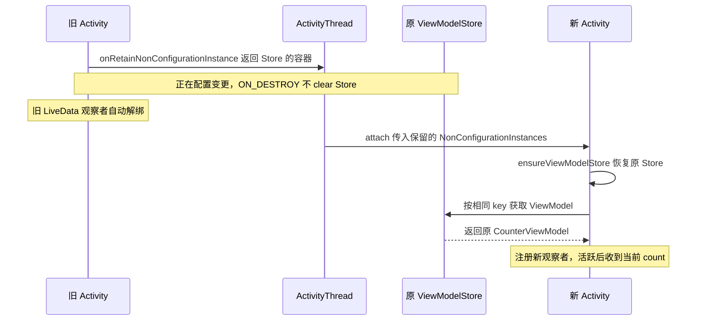

# Lifecycle

## 介绍

**Lifecycle 的核心是：把页面生命周期转换成状态变化，再通知观察者。** 本质上是“状态机 + 观察者模式”。

三个主要角色：

- **LifecycleOwner**：生命周期的拥有者，如 Activity、Fragment。
- **LifecycleRegistry**：保存当前状态、管理观察者、分发事件。
- **Observer**：接收变化，执行 `onStart()`、`onStop()` 等逻辑。

## State和Event

**State 描述“现在处于什么阶段”，Event 描述“发生了什么变化”。**

### State：当前所处的阶段

State 按下面的等级排列，`isAtLeast(STARTED)` 就是判断当前状态是否大于或等于 `STARTED`：

```text
DESTROYED < INITIALIZED < CREATED < STARTED < RESUMED
```

| State | 含义 |
| --- | --- |
| `INITIALIZED` | 已初始化，尚未进入创建完成的状态 |
| `CREATED` | 已创建；刚创建或从启动状态退回时都可能处于这里 |
| `STARTED` | 已启动；刚启动或从恢复状态退回时都可能处于这里 |
| `RESUMED` | 已恢复，处于生命周期的最高活跃等级 |
| `DESTROYED` | 这次生命周期已经结束 |

上面的大小关系是**状态等级，不是时间顺序**。`DESTROYED` 虽然排在最小，却发生在生命周期结束时。

### Event：驱动状态迁移的事件

常规逐级迁移时，事件与状态的对应关系如下：

| Event | 状态迁移 |
| --- | --- |
| `ON_CREATE` | `INITIALIZED → CREATED` |
| `ON_START` | `CREATED → STARTED` |
| `ON_RESUME` | `STARTED → RESUMED` |
| `ON_PAUSE` | `RESUMED → STARTED` |
| `ON_STOP` | `STARTED → CREATED` |
| `ON_DESTROY` | `CREATED → DESTROYED` |

`ON_ANY` 是旧注解 API 中用于匹配所有事件的特殊值，不是实际的迁移事件，没有对应的目标状态。[状态与事件源码][common-src]

因此，Lifecycle 没有单独的 `PAUSED`、`STOPPED` 状态：暂停对应的目标状态是 `STARTED`，停止对应的目标状态是 `CREATED`。

**只看 `STARTED`，无法区分“刚启动、还没恢复”与“已经暂停”。** 两者分别由 `ON_START` 和 `ON_PAUSE` 到达同一个状态；如果业务要感知暂停动作，应监听 `ON_PAUSE` 或实现 `DefaultLifecycleObserver.onPause()`。

### 为什么要同时设计 State 和 Event

1. **State 方便判断现在能做什么。** 例如 LiveData 只需检查是否至少为 `STARTED`，不用分别判断“刚启动”还是“暂停后仍未停止”。如果只有事件，新订阅者还需要自己追踪历史，才能知道当前状态。
2. **Event 保留变化的语义和方向。** `ON_START` 和 `ON_PAUSE` 的目标都是 `STARTED`，但一个是向上进入，一个是向下退回，业务处理可能不同。只提供最终 State，无法直接表达是哪种变化。
3. **两者配合，方便同步观察者。** 晚注册的观察者可以根据当前 State 补齐必要的 Event。例如 Owner 已是 `STARTED`，新观察者会依次收到 `ON_CREATE → ON_START`，不用重放 Owner 全部历史回调。

## Activity

### 基本使用

```kotlin
class LifecycleContent : BaseActivityContent() {
    private val observer = LifecycleEventObserver { source, event ->
    }

    override fun onCreate(savedInstanceState: Bundle?) {
        activity.lifecycle.addObserver(observer)
    }

    override fun onDestroy() {
        activity.lifecycle.removeObserver(observer)
    }
}
```

通过LifecycleOwner（也就是Activity）的getLifecycle方法注册observer。Activity内部持有LifecycleRegistry实现保存当前状态、管理观察者、分发事件。

### 原理分析

**Activity 的 `onCreate()`、`onStart()` 由系统驱动；AndroidX 在合适的时机把它们转换成 `ON_CREATE`、`ON_START`，交给 `LifecycleRegistry` 通知观察者。**

#### 在 Activity 创建时安装事件转发机制

AndroidX `ComponentActivity` 的关键代码是：

```java
override fun onCreate(savedInstanceState: Bundle?) {
    super.onCreate(savedInstanceState)
    ReportFragment.injectIfNeededIn(this)
}
```

`injectIfNeededIn()` 主要做两件事，源码节选：

```kotlin
if (Build.VERSION.SDK_INT >= 29) {
    // 注册当前 Activity 的生命周期回调
    LifecycleCallbacks.registerIn(activity)
}

val manager = activity.fragmentManager
if (manager.findFragmentByTag(REPORT_FRAGMENT_TAG) == null) {
    // 添加一个没有界面的系统 Fragment
    manager.beginTransaction()
        .add(ReportFragment(), REPORT_FRAGMENT_TAG)
        .commit()
    manager.executePendingTransactions()
}
```

这套机制在 `onCreate()` 中安装一次，之后就能继续接收启动、暂停、停止等事件。

#### API 29 之前：通过 ReportFragment 转发

`ReportFragment` 是一个没有界面的 `android.app.Fragment`。系统会随 Activity 的状态推进它的生命周期，AndroidX 借此获取正确的通知时机：

```
Activity.onCreate() 执行完成
  → 系统分发 Fragment.onActivityCreated()
  → ReportFragment 转发 ON_CREATE

Activity.onStart() 执行完成
  → 系统分发 Fragment.onStart()
  → ReportFragment 转发 ON_START
```

所以这里用的是 **`ReportFragment.onActivityCreated()`，不是它的 `onCreate()`**：前者对应宿主 Activity 已完成创建的时机。

#### API 29 及以上：通过 ActivityLifecycleCallbacks 转发

AndroidX 向当前 Activity 注册系统提供的回调接口（API 29提供）：

```java
activity.registerActivityLifecycleCallbacks(LifecycleCallbacks())
```

其中两个关键方法是：

```java
override fun onActivityPostCreated(
    activity: Activity,
    savedInstanceState: Bundle?
) {
    dispatch(activity, Lifecycle.Event.ON_CREATE)
}

override fun onActivityPostStarted(activity: Activity) {
    dispatch(activity, Lifecycle.Event.ON_START)
}
```

这些方法由系统调用。Framework 的执行顺序可以简化为：

```
performCreate()
  → Activity.onCreate()
  → dispatchActivityPostCreated()
  → 已注册回调的 onActivityPostCreated()

performStart()
  → Activity.onStart()
  → dispatchActivityPostStarted()
  → 已注册回调的 onActivityPostStarted()
```

选择 **Post 回调**，是为了确保 Activity 对应方法完整执行完毕。普通 `onActivityCreated()`、`onActivityStarted()` 在基类方法内部就会触发，此时业务 Activity 中 `super` 后面的代码可能还没执行。

**两条路径最终汇合到同一个 Registry：**

```
ReportFragment / ActivityLifecycleCallbacks
  → 获取 Activity.lifecycle
  → LifecycleRegistry.handleLifecycleEvent(event)
  → ON_CREATE：状态更新为 CREATED → 观察者.onCreate()
  → ON_START：状态更新为 STARTED → 观察者.onStart()
```

因此，**系统负责驱动 Activity，桥接机制负责报告事件，LifecycleRegistry 负责同步状态并通知观察者。**

## Frgment

### 基本使用

```
fragment.lifecycle.addObserver(observer)
activity.supportFragmentManager.findFragmentByTag(FRAGMENT_TAG)
            ?.lifecycle?.removeObserver(observer)
```

### 原理分析

**Fragment 的 Lifecycle 由 `FragmentManager` 直接驱动，事件分发已经写在 Fragment 内部的 `performCreate()`、`performStart()` 中。**

它的主干流程是：

```
FragmentActivity.onCreate() / onStart()
  → FragmentController.dispatchCreate() / dispatchStart()
  → FragmentManager 推进目标状态
  → FragmentStateManager.create() / start()
  → Fragment.performCreate() / performStart()
  → 调用 Fragment 的生命周期方法，并通知 Lifecycle 观察者
```

Activity 已经启动后再添加 Fragment，也会由 FragmentManager 将它推进到合适状态，不需要等待 Activity 再次执行 `onCreate()`。

**创建时：先执行 Fragment.onCreate，再发送 ON_CREATE。**

`Fragment.performCreate()` 的关键源码如下，省略准备工作和校验：

```java
void performCreate(Bundle savedInstanceState) {
    // ...准备工作

    onCreate(savedInstanceState);

    // ...检查是否调用 super.onCreate()
    mLifecycleRegistry.handleLifecycleEvent(Lifecycle.Event.ON_CREATE);
}
```

调用顺序：

```
Fragment.onCreate()
  → Fragment 的 Registry 进入 CREATED
  → Lifecycle 观察者.onCreate()
```

此时 Fragment 的 View 通常还没有创建，所以这里分发的是 **Fragment 自身的 Lifecycle**。

**启动时：先执行 Fragment.onStart，再分别通知 Fragment 和 View。**

`Fragment.performStart()` 的关键源码：

```
void performStart() {
    // ...准备工作

    onStart();

    // ...检查是否调用 super.onStart()
    mLifecycleRegistry.handleLifecycleEvent(Lifecycle.Event.ON_START);

    if (mView != null) {
        mViewLifecycleOwner.handleLifecycleEvent(Lifecycle.Event.ON_START);
    }

    mChildFragmentManager.dispatchStart();
}
```

调用顺序：

```
Fragment.onStart()
  → Fragment Lifecycle 收到 ON_START
  → View Lifecycle 收到 ON_START（如果存在 View）
  → 推动子 Fragment 启动
```

**需要区分两套 Lifecycle：**

| 生命周期                       | `ON_CREATE` 的分发时机       | `ON_START` 的分发时机            |
| ------------------------------ | ---------------------------- | -------------------------------- |
| `fragment.lifecycle`           | `Fragment.onCreate()` 完成后 | `Fragment.onStart()` 完成后      |
| `viewLifecycleOwner.lifecycle` | View 创建并恢复状态后        | 紧接 Fragment 的 `ON_START` 之后 |

View 的生命周期可以先结束，而 Fragment 仍留在返回栈中，因此观察数据来更新 View 时通常绑定 `viewLifecycleOwner`。

# LiveData

## 介绍

**LiveData 的核心是：保存最新数据，结合生命周期和版本号，决定是否通知观察者。** 它采用观察者模式，并通过 Lifecycle 在页面活跃时通知、停止时暂停通知、销毁时自动解绑。

`LiveData` 对外提供读取和观察能力，`MutableLiveData` 额外开放 `setValue()`、`postValue()` 来修改数据。

```java
public void observe(@NonNull LifecycleOwner owner, @NonNull Observer<? super T> observer)
```

## 基本使用

在 Activity 的 `onCreate()` 中，假设 `textView`、`button` 已初始化：

```kotlin
val count = MutableLiveData(0)
count.observe(this) { value ->
    textView.text = "count=$value"
}
button.setOnClickListener {
    count.value = (count.value ?: 0) + 1 // 对应 setValue()
}
```

页面达到 `STARTED` 后收到初始值 `0`，点击按钮后收到更新值。这个最小示例只演示通知机制；需要跨配置重建保留数据时，可将 LiveData 放入 ViewModel。

## 注册与生命周期感知

调用 `observe(owner, observer)` 时，LiveData 会将数据观察者包装成 **`LifecycleBoundObserver`**，保存到自己的观察者表，并把包装器注册到 `owner.lifecycle`。

包装器实现了 `LifecycleEventObserver`，因此页面状态改变时，它可以判断观察者是否活跃。

```java
boolean shouldBeActive() {
    return mOwner.getLifecycle().getCurrentState().isAtLeast(STARTED);
}
```

- **`STARTED`、`RESUMED`**：允许接收数据；刚变为活跃时，也会尝试分发当前值。
- **低于 `STARTED`**：暂停向该观察者分发，数据仍可更新；不会自动停止上游任务。
- **`DESTROYED`**：调用 `removeObserver()`，从 LiveData 和 Lifecycle 两侧解除订阅。

`observe()` 在主线程调用。Fragment 中更新 View 应绑定 `viewLifecycleOwner`；`observeForever()` 不绑定生命周期，始终活跃，需要手动移除。

## 数据更新与版本判断

LiveData 保存当前数据 `mData` 和版本 `mVersion`；每个观察者分别保存最后接收的版本 `mLastVersion`。

`setValue()` 的源码很直接：

```java
protected void setValue(T value) {
    assertMainThread("setValue");
    mVersion++;
    mData = value;
    dispatchingValue(null);
}
```

随后遍历观察者，通过 `considerNotify()` 判断是否通知，省略注解后的源码如下：

```java
private void considerNotify(ObserverWrapper observer) {
    if (!observer.mActive) {
        return;
    }
    if (!observer.shouldBeActive()) {
        observer.activeStateChanged(false);
        return;
    }
    if (observer.mLastVersion >= mVersion) {
        return;
    }
    observer.mLastVersion = mVersion;
    observer.mObserver.onChanged((T) mData);
}
```

**只有观察者活跃，且没有接收过当前版本，才调用 `onChanged()`。** 主干流程是：

```text
setValue(value)
  → 保存数据，版本号 +1
  → 遍历观察者
  → 检查生命周期是否活跃、版本是否更新
  → onChanged(value)，更新页面
```

由此可以解释三个常见现象：

- **后台恢复只收到最新值**：停止期间只更新当前数据，恢复活跃后按版本补发，不重放所有中间值；没有新版本则不重复通知。
- **新观察者能收到已有值（粘性）**：新观察者的 `mLastVersion` 从 `-1` 开始，有已提交的数据且活跃时就能收到，包括旋转后重新注册的观察者。
- **重复赋相同值也会通知**：`setValue()` 每次都增加版本，不使用 `equals()` 去重。

## setValue 与 postValue

| 方法 | 实现方式 |
| --- | --- |
| `setValue()` | 必须在主线程调用，立即更新数据并发起分发 |
| `postValue()` | 可在任意线程调用，先保存到 `mPendingData`，再投递主线程任务，最终调用 `setValue()` |

**`postValue()` 只有一个待提交的数据槽。** 主线程任务读取前，连续提交的值会互相覆盖，只保留最后一次。例如同一个主线程回调内连续 `postValue(1)`、`postValue(2)`、`postValue(3)`，这批数据最终只提交 `3`。

LiveData 适合表达“当前状态”，不保证每条中间数据都被消费；即使使用 `setValue()`，观察者回调中再次赋值也可能让其他观察者跳过中间值。

# ViewModel

## ViewModel 保存什么，由谁管理

Demo 中，`CounterViewModel` 保存计数，Activity 保存 TextView 等界面对象。旋转时界面重新创建，但在同一进程内发生正常配置重建时，原来的 ViewModel 可以继续使用。

| 对象 | 职责 | 是否决定跨重建复用 |
| --- | --- | --- |
| `ViewModel` | 保存页面状态，承载相关业务逻辑，接收清理回调 | 自己不会寻找新 Activity |
| `ViewModelStoreOwner` | 提供对应作用域的 Store，本例是 Activity | 决定使用哪个 Store |
| `ViewModelStore` | 用 `key → ViewModel` 保存实例 | 同一个 Store 才有机会取得同一个实例 |
| `ViewModelProvider` | 按 key 查找，必要时调用 Factory 创建 | 协调复用与创建 |
| `ViewModelProvider.Factory` | 构造 ViewModel | 只在需要新实例时执行创建逻辑 |
| `ViewModelLazy` | 延迟获取并缓存委托属性的结果 | 只负责当前委托对象的缓存，跨重建还依赖 Store |

**复用的核心条件是：同一个 Store、同一个 key，并且已有实例类型匹配。** ViewModel 不是一个按类名保存的全局单例。

## by viewModels：从属性委托到 Provider

### 声明时不会立即构造 ViewModel

Demo 声明：

```kotlin
private val vm: CounterViewModel by viewModels()
```

源码：[`ActivityViewModelLazy.kt` 的 `ComponentActivity.viewModels()`][activity-src]。

```kotlin
public inline fun <reified VM : ViewModel> ComponentActivity.viewModels(
    noinline extrasProducer: (() -> CreationExtras)? = null,
    noinline factoryProducer: (() -> Factory)? = null
): Lazy<VM> {
    val factoryPromise = factoryProducer ?: {
        defaultViewModelProviderFactory
    }

    return ViewModelLazy(
        VM::class,
        { viewModelStore },
        factoryPromise,
        { extrasProducer?.invoke() ?: this.defaultViewModelCreationExtras }
    )
}
```

这里只建立 `ViewModelLazy`，保存三个获取器：

- `storeProducer`：需要时读取当前 Activity 的 `viewModelStore`。
- `factoryProducer`：本例读取 `defaultViewModelProviderFactory`。
- `extrasProducer`：本例读取 `defaultViewModelCreationExtras`，传递构造上下文。

Demo 在 `vm.count.observe(this)` 中首次访问 `vm`，才执行 Lazy 的 `value` 获取逻辑。把声明放在 Activity 字段中没有问题，但不要在 Activity 还没附着到 Application 时立即求值。

### Lazy 的缓存与 Store 的缓存不同

源码：[`ViewModelLazy.kt` 的 `value`][vm-src]。

```kotlin
override val value: VM
    get() {
        val viewModel = cached
        return if (viewModel == null) {
            val store = storeProducer()
            val factory = factoryProducer()
            val extras = extrasProducer()
            ViewModelProvider.create(store, factory, extras)
                .get(viewModelClass)
                .also { cached = it }
        } else {
            viewModel
        }
    }
```

第一次访问时调用 `ViewModelProvider.create(store, factory, extras).get(viewModelClass)`；后续访问同一个委托时直接返回 `cached`。

旋转后的新 Activity 也有一个新的 `ViewModelLazy`，其 `cached` 初始为空。它之所以最终取得旧 ViewModel，是因为后续拿到的 Store 中仍有这个对象，而不是把旧 Activity 的 Lazy 属性原样搬到了新 Activity。

### Provider 的公开 API 转发到公共实现

源码：[`ViewModelProvider.android.kt`][vm-src] 的 Android 实现节选。

```kotlin
public actual operator fun <T : ViewModel> get(modelClass: KClass<T>): T =
    impl.getViewModel(modelClass)

public open operator fun <T : ViewModel> get(modelClass: Class<T>): T =
    get(modelClass.kotlin)
```

所以手动写 `ViewModelProvider(this)[CounterViewModel::class.java]`，与 Demo 的委托最终都会走到 `ViewModelProviderImpl.getViewModel()`。

## Store 从哪里来，实例如何找到

### ComponentActivity 提供 Store

`ComponentActivity.viewModelStore` 的 getter 先检查 Activity 已经附着到 Application，再调用 `ensureViewModelStore()` 并返回 `_viewModelStore`。初始化时注册的生命周期观察者也会调用该方法，因此 Store 不一定等到业务第一次访问 `vm` 才创建。

源码：[`ComponentActivity.ensureViewModelStore()`][activity-src]。

```kotlin
private fun ensureViewModelStore() {
    if (_viewModelStore == null) {
        val nc = lastNonConfigurationInstance as NonConfigurationInstances?
        if (nc != null) {
            _viewModelStore = nc.viewModelStore
        }
        if (_viewModelStore == null) {
            _viewModelStore = ViewModelStore()
        }
    }
}
```

读取 Store 时有三个层次：

1. 当前 Activity 已经有 `_viewModelStore`，直接继续使用。
2. 当前字段为空，但系统交来了上一实例的 `NonConfigurationInstances`，恢复其中的 Store。
3. 没有可恢复的 Store，才创建新的 `ViewModelStore()`。

首次启动通常走第 3 条，旋转重建走第 2 条。

### 默认 key 是什么

源码：[`ViewModelProviders.getDefaultKey()`][vm-src]。

```kotlin
internal fun <T : ViewModel> getDefaultKey(modelClass: KClass<T>): String {
    val canonicalName = requireNotNull(modelClass.canonicalName) {
        "Local and anonymous classes can not be ViewModels"
    }
    return "$VIEW_MODEL_PROVIDER_DEFAULT_KEY:$canonicalName"
}
```

其中 `VIEW_MODEL_PROVIDER_DEFAULT_KEY` 的值是 `androidx.lifecycle.ViewModelProvider.DefaultKey`。Demo 中默认 key 为：

```text
androidx.lifecycle.ViewModelProvider.DefaultKey:com.example.archdemo.CounterViewModel
```

同一 Owner 中，重复按这个类获取会使用同一个 key；如果确实需要两个独立计数器，可以使用显式不同 key：

```kotlin
val provider = ViewModelProvider(this)
val left = provider["left", CounterViewModel::class.java]
val right = provider["right", CounterViewModel::class.java]
```

上面片段需导入 `androidx.lifecycle.ViewModelProvider`。不要用同一个 key 交替存放不同 ViewModel 类型。

### 查缓存、创建、写回 Store

源码：[`ViewModelProviderImpl.getViewModel()`][vm-src]。

```kotlin
internal fun <T : ViewModel> getViewModel(
    modelClass: KClass<T>,
    key: String = ViewModelProviders.getDefaultKey(modelClass),
): T {
    val viewModel = store[key]
    if (modelClass.isInstance(viewModel)) {
        if (factory is ViewModelProvider.OnRequeryFactory) {
            factory.onRequery(viewModel!!)
        }
        return viewModel as T
    } else {
        @Suppress("ControlFlowWithEmptyBody") if (viewModel != null) {
        }
    }
    val extras = MutableCreationExtras(extras)
    extras[ViewModelProviders.ViewModelKey] = key

    return createViewModel(factory, modelClass, extras).also { vm -> store.put(key, vm) }
}
```

命中并且类型匹配时，直接返回已有实例；若 Factory 支持 `OnRequeryFactory`，还会执行它的重新查询回调。未命中或类型不匹配时，创建一份可变 Extras，加入当前 key，再调用 Factory，最后写回 Store。

源码：[`ViewModelStore.kt`][vm-src]。

```kotlin
public open class ViewModelStore {

    private val map = mutableMapOf<String, ViewModel>()


    @RestrictTo(RestrictTo.Scope.LIBRARY_GROUP)
    public fun put(key: String, viewModel: ViewModel) {
        val oldViewModel = map.put(key, viewModel)
        oldViewModel?.clear()
    }


    @RestrictTo(RestrictTo.Scope.LIBRARY_GROUP)
    public operator fun get(key: String): ViewModel? {
        return map[key]
    }


    @RestrictTo(RestrictTo.Scope.LIBRARY_GROUP)
    public fun keys(): Set<String> {
        return HashSet(map.keys)
    }


    public fun clear() {
        for (vm in map.values) {
            vm.clear()
        }
        map.clear()
    }
}
```

Store 保存的是强引用。`put()` 如果替换了旧实例，会调用旧实例的 `clear()`；`clear()` 则清理所有实例后清空 Map。因此 ViewModel 的清理并不只可能发生在 Activity 销毁时，也可能发生在同一 key 的实例被替换时。

## 默认 Factory 如何构造 Demo 的 ViewModel

### 默认 Factory 是 SavedStateViewModelFactory

源码：[`ComponentActivity.defaultViewModelProviderFactory`][activity-src]。

```kotlin
override val defaultViewModelProviderFactory: ViewModelProvider.Factory by lazy {
    SavedStateViewModelFactory(
        application,
        this,
        if (intent != null) intent.extras else null
    )
}
```

Demo 没有自定义 Factory，默认使用 `SavedStateViewModelFactory`。它可以处理带 `SavedStateHandle` 的构造函数，也可以回退到普通 ViewModel 的构造方式。

Provider 调用 Factory 时，Android 实现还保留了不同方法重载之间的兼容分支。源码：[`ViewModelProviderImpl.android.kt`][vm-src]。

```kotlin
internal actual fun <VM : ViewModel> createViewModel(
    factory: ViewModelProvider.Factory,
    modelClass: KClass<VM>,
    extras: CreationExtras
): VM {
    return try {
        factory.create(modelClass, extras)
    } catch (e: AbstractMethodError) {
        try {
            factory.create(modelClass.java, extras)
        } catch (e: AbstractMethodError) {
            factory.create(modelClass.java)
        }
    }
}
```

正常情况下从 `Factory.create(KClass, extras)` 进入，默认接口实现将它转为 `create(Class, extras)`，不是每次创建都会触发这些异常回退。

### 本例最终使用无参构造函数

源码：[`SavedStateViewModelFactory.create(Class, CreationExtras)`][saved-src] 的现代 Extras 分支节选，省略外围参数校验、其他分支和后续返回逻辑。

```kotlin
val application = extras[ViewModelProvider.AndroidViewModelFactory.APPLICATION_KEY]
val isAndroidViewModel = AndroidViewModel::class.java.isAssignableFrom(modelClass)
val constructor: Constructor<T>? = if (isAndroidViewModel && application != null) {
    findMatchingConstructor(modelClass, ANDROID_VIEWMODEL_SIGNATURE)
} else {
    findMatchingConstructor(modelClass, VIEWMODEL_SIGNATURE)
}
if (constructor == null) {
    return factory.create(modelClass, extras)
}
// ...
```

`VIEWMODEL_SIGNATURE` 是只有 `SavedStateHandle` 参数的构造签名，`ANDROID_VIEWMODEL_SIGNATURE` 则是 `Application + SavedStateHandle`。本例 `CounterViewModel` 是普通无参 ViewModel，没有匹配到 SavedStateHandle 构造函数，因此回退到内部 Factory。

```text
SavedStateViewModelFactory
  → 没有匹配的 SavedStateHandle 构造函数
  → AndroidViewModelFactory
  → 本例不是 AndroidViewModel，交给 NewInstanceFactory
  → JvmViewModelProviders.createViewModel()
  → CounterViewModel 的无参构造函数
```

源码：[`JvmViewModelProviders.createViewModel()`][vm-src]。

```kotlin
fun <T : ViewModel> createViewModel(modelClass: Class<T>): T =
    try {
        modelClass.getDeclaredConstructor().newInstance()
    } catch (e: NoSuchMethodException) {
        throw RuntimeException("Cannot create an instance of $modelClass", e)
    } catch (e: InstantiationException) {
        throw RuntimeException("Cannot create an instance of $modelClass", e)
    } catch (e: IllegalAccessException) {
        throw RuntimeException("Cannot create an instance of $modelClass", e)
    }
```

因此第一次访问 Demo 的 `vm` 会执行 `CounterViewModel.init`，创建初值为 `0` 的 LiveData，并打印 `VM created`。若构造函数需要 Repository 等自定义参数，就要提供能够构造它的 Factory 或相应依赖注入机制，默认 Factory 不会自动寻找任意业务依赖。

### 首次获取的完整调用链

```text
CounterActivity.onCreate()
  → 首次访问 vm
  → ViewModelLazy.value
  → Activity.viewModelStore
      → ensureViewModelStore()：恢复已有 Store，或首次新建
  → Activity.defaultViewModelProviderFactory / defaultViewModelCreationExtras
  → ViewModelProvider.create(store, factory, extras)
  → ViewModelProvider.get(CounterViewModel::class)
  → ViewModelProviderImpl.getViewModel()
      → 生成默认 key
      → store[key] 未命中
      → Factory.create() → 调用 CounterViewModel 构造函数
      → store.put(key, vm)
  → ViewModelLazy.cached = vm
  → vm.count.observe(Activity, observer)
```

## 旋转屏幕后为什么仍然是同一个 ViewModel

### 旧 Activity 将 Store 交给系统

前提是同一进程内发生由系统管理的 Activity 配置重建，而不是应用自己接管方向变化。

源码：[`ComponentActivity.onRetainNonConfigurationInstance()`][activity-src]。

```kotlin
final override fun onRetainNonConfigurationInstance(): Any? {
    val custom = onRetainCustomNonConfigurationInstance()
    var viewModelStore = _viewModelStore
    if (viewModelStore == null) {
        val nc = lastNonConfigurationInstance as NonConfigurationInstances?
        if (nc != null) {
            viewModelStore = nc.viewModelStore
        }
    }
    if (viewModelStore == null && custom == null) {
        return null
    }
    val nci = NonConfigurationInstances()
    nci.custom = custom
    nci.viewModelStore = viewModelStore
    return nci
}
```

这里把 Store 引用放入 AndroidX 的 `NonConfigurationInstances.viewModelStore`，返回给 Framework。没有把 ViewModel 序列化，也没有把它写进 `savedInstanceState`。

### AOSP 暂存对象并交给新 Activity

下面沿 [Android 14 的 ActivityThread 源码][platform-thread] 看系统侧交接。代码块是不同方法中的连续语句节选，不是可以独立编译的完整方法。

配置重建流程会把旧 Activity 标记为正在更改配置；`handleRelaunchActivityInner()` 请求销毁时，要求保留非配置对象：

```java
// handleRelaunchActivity() 中
r.activity.mChangingConfigurations = true;

// handleRelaunchActivityInner() 中
handleDestroyActivity(r, false, configChanges, true, reason);
```

销毁处理中，`performDestroyActivity()` 在调用 Activity 的销毁方法前暂存非配置对象：

```java
// performDestroyActivity() 的 getNonConfigInstance 分支中
r.lastNonConfigurationInstances = r.activity.retainNonConfigurationInstances();
```

源码：[`Activity.retainNonConfigurationInstances()`][platform-activity] 中与本例有关的语句节选。

```java
Object activity = onRetainNonConfigurationInstance();
// ... 处理 children、fragments、loaders 和空对象判断
NonConfigurationInstances nci = new NonConfigurationInstances();
nci.activity = activity;
// ... 保存其他非配置对象
return nci;
```

这里有两层容器，名称相似但不是同一个类：

```text
ActivityThread.ActivityClientRecord.lastNonConfigurationInstances
  → Framework Activity.NonConfigurationInstances
      → activity
          → AndroidX ComponentActivity.NonConfigurationInstances
              → viewModelStore
                  → Map[key] = 原 CounterViewModel
```

随后在 `performLaunchActivity()` 中，新 Activity 的 `attach()` 收到保存下来的对象。源码节选：

```java
activity.attach(appContext, this, getInstrumentation(), r.token,
        r.ident, app, r.intent, r.activityInfo, title, r.parent,
        r.embeddedID, r.lastNonConfigurationInstances, config,
        r.referrer, r.voiceInteractor, window, r.activityConfigCallback,
        r.assistToken, r.shareableActivityToken);
```

[`Activity.attach()`][platform-activity] 将它保存到新实例字段中：

```java
mLastNonConfigurationInstances = lastNonConfigurationInstances;
```

而新 Activity 调用 `getLastNonConfigurationInstance()` 时，取回的是上述 Framework 容器的 `activity` 字段：

```java
public Object getLastNonConfigurationInstance() {
    return mLastNonConfigurationInstances != null
            ? mLastNonConfigurationInstances.activity : null;
}
```

于是回到前面看到的 `ensureViewModelStore()`，就能从 AndroidX 容器中恢复原来的 Store。

### 旧 Activity 为什么没有清空 Store

源码：[`ComponentActivity` 初始化时注册的销毁观察者][activity-src]。

```kotlin
lifecycle.addObserver(LifecycleEventObserver { _, event ->
    if (event == Lifecycle.Event.ON_DESTROY) {
        contextAwareHelper.clearAvailableContext()
        if (!isChangingConfigurations) {
            viewModelStore.clear()
        }
        reportFullyDrawnExecutor.activityDestroyed()
    }
})
```

旋转重建时，`isChangingConfigurations == true`，所以跳过 Store 清理；旧页面上的 LiveData 观察者仍会按自己的 Lifecycle 正常解绑。

新 Activity 恢复 Store 后，Provider 按相同 key 查到旧 ViewModel，不再调用构造函数。**被保留的是 Store 和 ViewModel；Activity、View、生命周期 Registry 和数据观察者都重新创建。**

### 把旋转过程串起来



## finish 之后如何清理 ViewModel 与协程

### Store 清理触发 onCleared

点击 Demo 的“结束页面”，正常生命周期走到 `ON_DESTROY` 且不是配置变更时，前面的销毁观察者调用 `viewModelStore.clear()`。

```text
finish()
  → Activity 正常销毁，Lifecycle 到 DESTROYED
  → ComponentActivity 的销毁观察者
  → !isChangingConfigurations
  → ViewModelStore.clear()
  → 每个 ViewModel.clear()
  → ViewModelImpl.clear()：关闭托管资源
  → ViewModel.onCleared()：调用业务清理回调
  → Store 的 Map 清空
```

源码：[`ViewModel.jvm.kt` 的 `clear()`][vm-src]。

```kotlin
internal actual fun clear() {
    impl?.clear()
    onCleared()
}
```

源码：[`ViewModelImpl.clear()`][vm-src]。

```kotlin
fun clear() {
    if (isCleared) return

    isCleared = true
    synchronized(lock) {
        for (closeable in keyToCloseables.values) {
            closeWithRuntimeException(closeable)
        }
        for (closeable in closeables) {
            closeWithRuntimeException(closeable)
        }
        closeables.clear()
    }
}
```

Demo 的 `onCleared()` 会打印日志。`clear()` 的含义是结束这份 ViewModel 的使用并释放托管资源，不等于立即执行 JVM 垃圾回收；如果外部仍然持有引用，对象不会因为这个方法立刻从内存中消失。

### viewModelScope 为什么跟随 ViewModel

源码：[`ViewModel.kt` 的 `viewModelScope` 扩展属性][vm-src]。

```kotlin
public val ViewModel.viewModelScope: CoroutineScope
    get() = synchronized(VIEW_MODEL_SCOPE_LOCK) {
        getCloseable(VIEW_MODEL_SCOPE_KEY)
            ?: createViewModelScope().also { scope -> addCloseable(VIEW_MODEL_SCOPE_KEY, scope) }
    }
```

第一次访问时创建 Scope，并以 `VIEW_MODEL_SCOPE_KEY` 注册为可关闭资源。默认 Scope 使用 `SupervisorJob` 和 `Dispatchers.Main.immediate`；Android 上主线程调度器由协程 Android 支持提供。耗时阻塞任务仍需要自己切换合适的调度器。

源码：[`CloseableCoroutineScope.kt`][vm-src] 的 Scope 包装类。

```kotlin
internal class CloseableCoroutineScope(
    override val coroutineContext: CoroutineContext,
) : AutoCloseable, CoroutineScope {
    constructor(coroutineScope: CoroutineScope) : this(coroutineScope.coroutineContext)

    override fun close() = coroutineContext.cancel()
}
```

Store 清理时关闭 Scope，进而取消其中的协程。回到 Demo：

- 按 Home：ViewModel 未清理，延迟协程仍可继续；页面停止时 LiveData 不通知它。
- 旋转：原 ViewModel 和 Scope 保留，延迟协程可继续；新页面观察相同数据。
- 点击结束：清理 ViewModel，取消仍处于 `delay()` 的协程，后续加一不会执行。

协程取消是协作式的；这里 `delay()` 支持取消。普通线程、未注册的资源或其他独立 Scope，不会仅因为使用了 ViewModel 就自动被取消。

## 配置重建与进程重建的区别

### 普通 ViewModel 不会跨进程保存

| 场景 | ViewModel 对象 | Demo 的计数 | `onCleared()` |
| --- | --- | --- | --- |
| 同一个页面前后台切换，进程存活 | 原对象 | 保留 | 不调用 |
| 旋转触发配置重建，进程存活 | 原对象 | 保留 | 不因这次配置重建调用 |
| `finish()` 后重新打开 | 新对象 | 从 `0` 开始 | 正常清理旧对象时调用 |
| 后台进程被系统终止，之后恢复页面 | 新对象 | 本例没有保存机制，从 `0` 开始 | 不能保证旧进程退出前调用 |

Framework 保存的非配置对象是当前进程中的引用，进程消失就没有这份 Store。`onCleared()` 也不是“进程死亡通知”，不能靠它保存所有关键业务数据。

### 使用 SavedStateHandle 保存少量可恢复状态

如果希望系统恢复页面时能够恢复计数，可以把 Demo 的 ViewModel 替换为以下版本，并保留原有 Activity。它是扩展示例，与前面的普通 ViewModel 行为区分开看。

```kotlin
// 沿用 Demo 的 package、TAG 及其他导入，另需：
// import androidx.lifecycle.SavedStateHandle
class CounterViewModel(private val state: SavedStateHandle) : ViewModel() {
    val count: LiveData<Int> = state.getLiveData("count", 0)
    val instanceId: Int = System.identityHashCode(this)

    init {
        Log.d(TAG, "VM created: $instanceId")
    }

    fun increment() {
        state["count"] = (state.get<Int>("count") ?: 0) + 1
    }

    fun incrementAfterDelay() {
        viewModelScope.launch {
            delay(5_000)
            increment()
        }
    }

    override fun onCleared() {
        Log.d(TAG, "VM cleared: $instanceId")
    }
}
```

此时默认 `SavedStateViewModelFactory` 能匹配到 `SavedStateHandle` 构造函数。源码：[`SavedStateViewModelFactory.create()`][saved-src] 中匹配构造函数后的实例化分支。

```kotlin
val viewModel = if (isAndroidViewModel && application != null) {
    newInstance(modelClass, constructor, application, extras.createSavedStateHandle())
} else {
    newInstance(modelClass, constructor, extras.createSavedStateHandle())
}
```

这条扩展路径通过 `SavedStateRegistry` 保存、恢复 Handle 支持的少量数据。系统恢复后是**新 ViewModel + 恢复出来的值**，不是原对象复活，也不会恢复旧协程的执行栈。

它依赖系统保存和恢复页面状态的时机，不保证每次赋值都立即持久化；页面已经停止后发生的写入，若没有经历后续保存周期，不能假定会被恢复。主动结束页面、移除任务或强行停止应用也不能视为这种恢复流程。需要长期保存的数据应放入数据库、文件等持久化存储。

## 三个组件协作的完整流程回顾

### 首次启动与点击更新

```text
创建 CounterActivity
  → Activity 持有 LifecycleRegistry，安装系统事件分发入口
  → Demo 注册 DefaultLifecycleObserver
  → 首次访问 vm
      → 恢复或创建 ViewModelStore
      → Provider 按 key 查询
      → 首次未命中，Factory 创建 CounterViewModel
      → Store 保存实例；Lazy 缓存查询结果
  → count.observe(Activity)
      → 创建 LifecycleBoundObserver
      → 同时登记到 LiveData 与 Activity 的 Lifecycle
  → Activity 达到 STARTED
      → Registry 分发状态变化
      → LiveData 包装器变为活跃
      → -1 < 初始版本 0，通知 count=0
  → 点击 +1
      → setValue(1)，数据版本递增
      → 活跃检查与版本检查通过
      → onChanged(1)，页面更新
```

### 后台、重建与销毁分别由谁负责

| 变化 | Lifecycle 做什么 | LiveData 做什么 | ViewModel/Store 做什么 |
| --- | --- | --- | --- |
| 页面停止 | 状态降到 `CREATED` | 将页面观察者置为不活跃 | 保留数据和仍在运行的 Scope |
| 原页面重新开始 | 状态升到 `STARTED` | 若有新版本，交付最新值 | 继续使用原实例 |
| 配置重建 | 旧 Registry 销毁，新 Registry 建立 | 移除旧观察者，新观察者接收当前值 | 由非配置对象机制交还原 Store |
| 页面正常结束 | 分发销毁事件 | 自动移除生命周期绑定的观察者 | 清空 Store、关闭托管资源、调用 `onCleared()` |

三个组件并不要求彼此捆绑：LiveData 可以不放在 ViewModel 里，ViewModel 也可以使用其他状态容器。这个 Demo 只是把它们常见的协作关系放在同一条可以对照源码的流程中。

## 源码定位索引

以下路径相对于对应版本的源码 JAR 根目录；下载并解压即可定位。源码 JAR 与文首固定版本对应，避免网页默认分支更新后出现行文与代码不一致。

| 关注点 | 源码文件 |
| --- | --- |
| Activity 的 Registry 与初始化入口 | Core：`androidx/core/app/ComponentActivity.kt` |
| API 版本分流与系统回调 | Runtime：`androidMain/androidx/lifecycle/ReportFragment.android.kt` |
| Registry 状态同步算法 | Runtime：`jvmMain/androidx/lifecycle/LifecycleRegistry.jvm.kt` |
| 状态/事件定义与适配器 | Common：`commonMain/androidx.lifecycle/Lifecycle.kt`、`DefaultLifecycleObserverAdapter.kt` |
| 观察者接口类型适配 | Common：`jvmMain/androidx/lifecycle/Lifecycling.jvm.kt` |
| 数据版本、生命周期绑定与分发 | LiveData：`androidx/lifecycle/LiveData.java`、`MutableLiveData.java` |
| 主线程消息调度 | Arch Core Runtime：`androidx/arch/core/executor/ArchTaskExecutor.java`、`DefaultTaskExecutor.java` |
| `viewModels()` 委托入口 | Activity：`androidx/activity/ActivityViewModelLazy.kt` |
| Store 保存/恢复与默认 Factory | Activity：`androidx/activity/ComponentActivity.kt` |
| Lazy 与 Store | ViewModel：`commonMain/androidx/lifecycle/ViewModelLazy.kt`、`ViewModelStore.kt` |
| Provider 的 Android API | ViewModel：`androidMain/androidx/lifecycle/ViewModelProvider.android.kt` |
| 按 key 查找与创建 | ViewModel：`commonMain/androidx/lifecycle/viewmodel/internal/ViewModelProviderImpl.kt` |
| 无参构造与默认 key | ViewModel：`jvmMain/androidx/lifecycle/viewmodel/internal/JvmViewModelProviders.kt`、`commonMain/androidx/lifecycle/viewmodel/internal/ViewModelProviders.kt` |
| 实例及资源清理 | ViewModel：`jvmMain/androidx/lifecycle/ViewModel.jvm.kt`、`commonMain/androidx/lifecycle/viewmodel/internal/ViewModelImpl.kt` |
| Scope 创建与关闭 | ViewModel：`commonMain/androidx/lifecycle/viewmodel/internal/CloseableCoroutineScope.kt` |
| SavedStateHandle 构造路径 | SavedState：`androidx/lifecycle/SavedStateViewModelFactory.kt`、`SavedStateHandleSupport.kt` |
| 系统非配置对象交接 | Framework：`core/java/android/app/Activity.java`、`ActivityThread.java` |

[runtime-src]: https://dl.google.com/dl/android/maven2/androidx/lifecycle/lifecycle-runtime-android/2.8.7/lifecycle-runtime-android-2.8.7-sources.jar
[common-src]: https://dl.google.com/dl/android/maven2/androidx/lifecycle/lifecycle-common-jvm/2.8.7/lifecycle-common-jvm-2.8.7-sources.jar
[live-src]: https://dl.google.com/dl/android/maven2/androidx/lifecycle/lifecycle-livedata-core/2.8.7/lifecycle-livedata-core-2.8.7-sources.jar
[vm-src]: https://dl.google.com/dl/android/maven2/androidx/lifecycle/lifecycle-viewmodel-android/2.8.7/lifecycle-viewmodel-android-2.8.7-sources.jar
[saved-src]: https://dl.google.com/dl/android/maven2/androidx/lifecycle/lifecycle-viewmodel-savedstate/2.8.7/lifecycle-viewmodel-savedstate-2.8.7-sources.jar
[activity-src]: https://dl.google.com/dl/android/maven2/androidx/activity/activity/1.9.3/activity-1.9.3-sources.jar
[core-src]: https://dl.google.com/dl/android/maven2/androidx/core/core/1.13.1/core-1.13.1-sources.jar
[executor-src]: https://dl.google.com/dl/android/maven2/androidx/arch/core/core-runtime/2.2.0/core-runtime-2.2.0-sources.jar
[platform-activity]: https://android.googlesource.com/platform/frameworks/base/+/android-14.0.0_r1/core/java/android/app/Activity.java
[platform-thread]: https://android.googlesource.com/platform/frameworks/base/+/android-14.0.0_r1/core/java/android/app/ActivityThread.java
