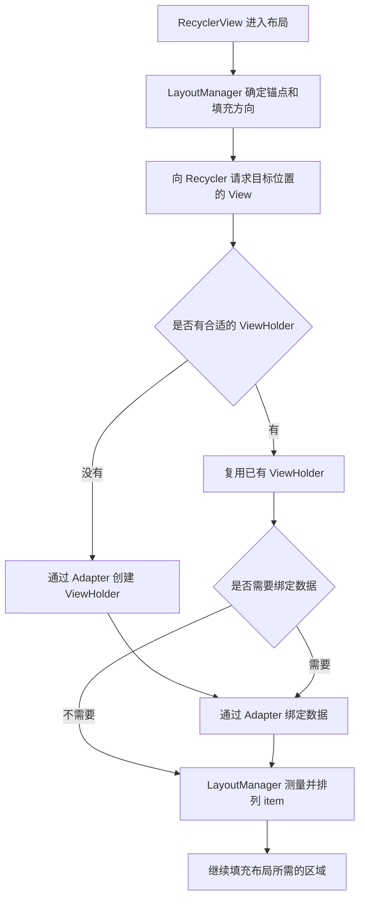

# 面试开场总结

RecyclerView 就是用有限的 View 展示大量数据。使用时，Adapter 负责创建 ViewHolder 和绑定数据，LayoutManager 负责排列、滚动和决定哪些 View 可以回收，Recycler 负责管理复用。

比如列表往上滑，离开屏幕的 View 不一定马上销毁，后面可以拿来展示其他数据，省掉重复创建布局的开销。这里要区分两种情况：如果找回的是同一条数据对应、而且仍然有效的缓存，可能连绑定都省了；如果只是从回收池拿到同类型的 ViewHolder，还是需要重新绑定。

数据更新时，一般会用 ListAdapter 配合 DiffUtil，只更新变化的部分；像收藏状态这种小变化，还可以通过 payload 做局部绑定。

# 基础使用与组件分工

## 核心组件

- `RecyclerView`：列表容器，协调布局、滚动、更新、动画与复用
- `ViewHolder`：列表Item的view实现
  - 多种 item：重写 `getItemViewType(position)`，按类型创建兼容的 ViewHolder，并在绑定时处理对应数据。
- `Adapter`：提供数量、类型，创建 ViewHolder，并把数据绑定到 View。

## 基本使用

略，只介绍一些不常见但感觉重要的。

### Adapter

adapter的几个重要方法：

```java
//创建ViewHolder实例的，viewType由getItemViewType提供
public RecyclerView.ViewHolder onCreateViewHolder(ViewGroup parent， int viewType) {}

public int getItemViewType(int position) {}

//对RecyclerView子项的数据进行赋值，每个子项在滚动到屏幕的时候会执行。
@Override
public void onBindViewHolder(RecyclerView.ViewHolder holder， int position) {}

//一共有多少子项
@Override
public int getItemCount() {}
```

#### Adapter 组合使用

头部、内容、尾部由独立 Adapter 管理时，可以组合：

```kotlin
// headerAdapter、contentAdapter、footerAdapter 均为已实现的 Adapter。
recyclerView.adapter = ConcatAdapter(
    headerAdapter, contentAdapter, footerAdapter
)
```

ConcatAdapter 默认隔离子 Adapter 的 viewType，以避免类型冲突；只有确认布局、Holder 和绑定约定兼容时，才考虑关闭隔离。

# 🌟 RecyclerView 和 ListView 区别

**两者都支持 View 复用**，RecyclerView 的主要优势是扩展能力更强：

- **布局**：ListView 主要是纵向列表；RecyclerView 通过 LayoutManager 支持横向、网格、瀑布流等布局。
- **ViewHolder**：ListView 通常需要开发者自行采用；RecyclerView 将其直接纳入 Adapter API。
- **刷新**：RecyclerView 支持增删、移动和局部刷新，配合 DiffUtil、payload 可以减少无效绑定。
- **扩展**：RecyclerView 将布局、动画、分割线分别交给独立组件，复杂列表更容易实现和维护。

**现在主流使用 RecyclerView，是因为它更适合复杂、多样、频繁更新的列表需求**，相关工具也更完善；并不是简单换上它就一定比 ListView 快。

# 🌟 布局、滚动与缓存复用原理

## 一个 item 是怎样出现在屏幕上的？

以 LinearLayoutManager 的普通列表为例，可以把主干流程理解为：



## 🌟🌟🌟 RecyclerView 的 四级缓存

### 四级缓存

> 源码并不是四个同性质的缓存按固定流水线依次存取
>

| 机制                                     | 主要用途                                                | 如何理解复用                                      |
| ---------------------------------------- | ------------------------------------------------------- | ------------------------------------------------- |
| Scrap：`mAttachedScrap`、`mChangedScrap` | 布局期间暂存已有 Holder，变化项还可能涉及动画处理       | 尽量找回当前布局需要的 Holder，是否重绑取决于状态 |
| 本地 Cache：`mCachedViews`               | 保留离屏但仍有效的 Holder，方便短距离往返               | 保留绑定关系，合适且未变脏时可直接使用            |
| `ViewCacheExtension`                     | 开发者提供的额外缓存查找入口，默认未设置                | 由开发者管理，不是框架自动维护的一层通用缓存      |
| `RecycledViewPool`                       | 按 viewType 存放可供重新使用的 Holder，可由多个列表共享 | 主要复用视图结构，取出后需要绑定目标数据          |

Scrap 更像**一次布局中的临时工作区**；Cache 更像**最近离屏、还保留原数据关系的 View**；Pool 更像**按结构分类、等着装入新内容的 View**。

#### Scrap

**Scrap 是 RecyclerView 在重新布局时，临时存放已有 ViewHolder 的地方**，方便稍后直接取回来使用，避免重新创建。

- **`mAttachedScrap`**：存放本轮布局可以重新使用的 Holder。数据有效且没变化时，可以直接使用；需要更新时也可能重新绑定。**它不等于“屏幕上所有可见的 View”。**
- **`mChangedScrap`**：主要存放内容已变化、动画机制又不能直接复用来展示新内容的旧 Holder，用于保留旧状态、配合变化动画。**不是所有更新项都会进入这里。**

比如重新布局时，可以先把已有 View 临时放进 Scrap，再按新位置取出并排列。它主要服务于**布局过程中的临时复用**；


**容量**

Scrap 没有固定的容量上限，也没有公开的容量设置接口。
`mAttachedScrap` 和 `mChangedScrap` 都按需要动态增长，数量取决于当前布局和动画需要临时保留多少个 ViewHolder。
布局处理完成后，这些 Holder 会被重新使用或按需回收，Scrap 中的临时记录也会被清理。

> 重新布局常见有这几种情况：
>
> - **首次显示列表**：确定 item 的大小和位置。
> - **数据结构变化**：插入、删除、移动 item，需要调整排列。
> - **尺寸变化**：屏幕旋转、父容器大小变化，或者 item 的文字、图片使高度发生变化。
> - **触发 `requestLayout()`**：例如修改布局参数，需要重新测量和布局。
>
> 但**刷新内容不一定需要重新布局**。例如只修改文字颜色，通常重绘即可；如果文字改变导致高度变化，就需要重新布局。
>
> 另外，**普通滑动主要是移动已有 View、填充新区域、回收离屏 View**，不代表每滑动一帧都会把整个列表重新布局、全部放进 Scrap。

#### 本地 Cache（mCachedViews）

**`mCachedViews` 是 RecyclerView 保存离屏且仍有效的 ViewHolder 的本地缓存。** 滚动回来时，如果数据没变，可以直接复用，通常不需要重新创建和绑定。

- 所有`viewType`共用
- **基础默认容量**：2 个。
- **修改方式**：`recyclerView.setItemViewCacheSize(4)`。
- **实际容量上限**：设置值 + 预取额外容量，因此大于或等于设置值。
- **当前缓存数量**：不一定达到上限，也可能为 0。
- **缓存淘汰**：被淘汰的 Holder 通常进入 `RecycledViewPool`。

#### ViewCacheExtension

使用分三步：

1. 继承 `RecyclerView.ViewCacheExtension`。
2. 重写 `getViewForPositionAndType()`：命中返回关联了 ViewHolder 的 `itemView`，未命中返回 `null`。
3. 调用 `recyclerView.setViewCacheExtension(extension)` 注册。

**缓存的存入、失效和清理由自己管理，RecyclerView 只负责向它查询。** 默认不启用，一般业务很少需要。

#### RecycledViewPool

**`RecycledViewPool` 是按 `viewType` 分组的 ViewHolder 回收池。**

- 复用视图结构，取出后需要重新绑定数据。
- 默认每种类型最多保留 **5 个**。
- 用 `pool.setMaxRecycledViews(viewType, count)` 修改容量。
- 多个 RecyclerView 可通过 `setRecycledViewPool(pool)` 共享，但同类型的 Holder 必须兼容。

#### ViewCacheExtension和RecycledViewPool

- **RecycledViewPool**：通用复用，按 `viewType` 拿一个兼容的 Holder，再绑定目标数据。
- **ViewCacheExtension**：自定义复用入口，让业务按 `position`、`viewType` 和自己的规则，返回特定的缓存 View；查询时机在 Pool 之前。

比如想单独保留少量创建成本很高的特殊 item，就可以通过 Extension 管理。缓存仍然有效时，还可能省去重新绑定。

**大多数业务用默认缓存和 Pool 就够了，Extension 是为特殊需求预留的扩展点。** 使用它需要自行处理缓存失效和清理。


### 🌟获取 ViewHolder 的查找顺序

**stable IDs 默认关闭，ListAdapter 也不会自动开启。** 因此，默认情况下没有“按 itemId 查找”的兜底步骤。

`tryGetViewHolderForPositionByDeadline()` 的默认查找顺序如下，省略状态校验失败、位置映射和预取超时等分支：

```text
布局时从 Scrap 里找（具体是要区分 mAttachedScrap 和 mChangedScrap）
    ↓ 未找到
mCachedViews
    ↓ 未找到
询问 ViewCacheExtension（如果设置了）
    ↓ 未找到
从 RecycledViewPool 按 viewType 获取
    ↓ 未找到
调用 onCreateViewHolder() 创建
    ↓
根据有效性和绑定状态，决定是否调用 onBindViewHolder()
```

- **原数据对应、已绑定且仍有效的 Scrap / Cache**：通常可以跳过绑定。
- **从 Pool 获取或新创建的 Holder**：需要绑定目标数据。
- **找到 Holder 不等于一定能直接使用**：常规复用仍需通过相应的状态、位置和 viewType 校验。

如果主动开启 stable IDs，按位置未找到后，还可以按 `itemId` 与 `viewType` 回查 Scrap / Cache；预布局中的 ChangedScrap 也有按 `itemId` 查找的兜底路径。

隐藏的子 View 常与动画等内部管理有关，不应再机械地算成一个“第几级缓存”。默认情况可以记成：**先按位置找原来的 Holder，找不到再按类型找可用结构。** [RecyclerView 源码](https://raw.githubusercontent.com/androidx/androidx/androidx-main/recyclerview/recyclerview/src/main/java/androidx/recyclerview/widget/RecyclerView.java)


### 缓存放置时机

**查找顺序是获取 Holder 的顺序，放入哪个缓存则取决于 Holder 当前的用途和状态。** 并不是每个 Holder 都依次经过四级缓存。

| 缓存 | 放入时机 |
| --- | --- |
| Scrap | 布局过程中，需要临时拆下已有 View、稍后重新排列或处理变化动画时，将对应 Holder 暂存起来 |
| `mCachedViews` | item 因滚动离屏等原因被回收时，Holder 可回收、未被标记为更新／无效／删除／位置未知，且允许本地缓存时，可以放入 |
| `ViewCacheExtension` | 由开发者自行决定何时存入；**RecyclerView 不会自动向它放入 Holder** |
| `RecycledViewPool` | Holder 从本地 Cache 被淘汰，或可回收但不满足本地缓存条件时，尝试按 viewType 放入 Pool |

`mCachedViews` 还有一种来源：**预取时提前创建并绑定好的有效 Holder，也可能进入本地缓存**，等待后续布局取用。

例如 A 滚动离屏后，若仍然有效且满足缓存条件，就可以保留在 `mCachedViews`；正在参与动画、暂时不可回收的 Holder，则不一定立即入缓存。

### 缓存淘汰时机

| 缓存 | 淘汰或清理时机 |
| --- | --- |
| Scrap | 本轮布局中被重新取用，或布局收尾时按状态回收、清理剩余暂存记录；没有按固定容量淘汰的机制 |
| `mCachedViews` | 容量已满且有新的可缓存 Holder 加入；缓存上限调小；对应 item 被更新、删除而失效，或更换 Adapter 等操作触发清理。被淘汰的 Holder 通常移交 Pool |
| `ViewCacheExtension` | 由开发者自行处理容量限制、数据失效和生命周期清理 |
| `RecycledViewPool` | 调小某种 viewType 的容量时移除超出部分；调用 `clear()` 时清空。如果某类型已满，新送来的 Holder 不再入池，不会为它挤掉已有 Holder |

**从缓存移除，不一定是淘汰，也可能是命中后被取用。** 例如 A 再次需要显示，Recycler 从 `mCachedViews` 取出 A 的 Holder，缓存列表便不再持有它，由布局继续使用。

## 🌟🌟🌟 bind 时机和 unbind 时机

### bind 时机

**bind 是把目标数据设置到 Holder 的 View 上，对应 `onBindViewHolder()`。** 常规布局中，Holder 尚未绑定、被标记为需要更新，或原绑定已失效时，需要绑定。

| 场景 | 是否需要 bind |
| --- | --- |
| 新创建的 Holder | 需要，在用于展示目标数据前完成绑定 |
| 从 RecycledViewPool 取出的 Holder | 需要，原位置和绑定标记已被重置 |
| 找回同一数据对应、已绑定且仍有效的 Scrap / Cache | 通常可以跳过 |
| 已有 Holder 的内容被通知更新，且可以继续使用这个 Holder | 需要，可以全量绑定，也可以通过 payload 局部绑定 |

两个补充：

- **预布局**：已绑定的 Holder 通常先保留旧状态，用于布局和动画，不急于绑定新数据。
- **预取**：可能在 item 真正显示前就执行 bind，因此 bind 不等于用户已经看到该 item。

完整绑定必须覆盖当前 item 的所有可变展示状态，不能依赖上一次留下的文字、选中状态或图片。

### unbind 时机

**RecyclerView.Adapter 没有与 `onBindViewHolder()` 一一对应的 `onUnbindViewHolder()` 回调。** 这里的 unbind 可以理解为业务上停止旧数据的任务、释放旧绑定资源，但需要根据具体场景处理。

| 场景 | 原绑定和清理应该怎样处理 |
| --- | --- |
| Holder 进入 Scrap 或有效的 mCachedViews | 通常保留绑定关系，不会仅因进入这些缓存就触发 `onViewRecycled()`；再次取用时可能无需 bind |
| Holder 正常回收并准备移交 Pool，例如从 mCachedViews 淘汰 | 通常在清理内部状态、移交 Pool 前回调 `onViewRecycled()`，可以清理不再需要的请求、资源和业务引用 |
| Holder 直接再次 bind。比如 item 内容更新 | 两次 bind 之间不保证先执行 `onViewRecycled()`；换绑时也要处理旧请求和旧监听，不能只依赖回收回调 |
| View 脱离窗口 | 回调 `onViewDetachedFromWindow()`，可以按业务暂停播放或动画，但不等于解除数据绑定；若在这里释放资源，应在重新附着时恢复 |

因此，`onViewRecycled()` 是业务清理的一个时机，**不能把它当成每次 bind 都必然配对的 unbind**。[Adapter 生命周期说明](https://developer.android.com/reference/androidx/recyclerview/widget/RecyclerView.Adapter)

Holder 真正存入 Pool 时，框架会重置位置和绑定标记，但不会自动清空业务字段或重置所有 View 属性。比如旧图片请求仍可能回调，因此换绑时要替换或取消旧请求，并确保结果仍对应当前数据。

## 预取

**RecyclerView 的预取，就是提前准备即将进入屏幕的 item，减少滑动时临时创建和绑定造成的卡顿。**

例如屏幕显示 A～F，正在向下浏览，RecyclerView 可以提前为 G 准备 Holder。等 G 真正出现时，就有机会直接从缓存取用。

大致流程是：

1. **预测位置**：LayoutManager 根据滑动方向等信息，报告可能马上需要的 item。
2. **提前准备**：GapWorker 在 **UI 线程的可用时间**内，尝试获取或创建 Holder，必要时绑定数据。
3. **放入缓存**：成功绑定且有效的 Holder 可以进入 `mCachedViews`，等待后续布局使用。

需要记住：

- **默认开启，支持 Android 5.0 及以上**；它不是后台线程创建 View，所以 bind 仍然要轻量。
- **预取会增加本地缓存的实际容量**，这就是缓存上限可能超过你设置值的原因。[预取机制说明](https://developer.android.com/reference/androidx/recyclerview/widget/RecyclerView.LayoutManager#setItemPrefetchEnabled(boolean))
- 它准备的是 ViewHolder，不负责网络分页；**提前执行 bind 也不代表 item 已经曝光**。
- 嵌套列表还有“初始预取”：例如一排横向卡片即将出现时，提前准备其中几个 item，可通过内层 LinearLayoutManager 的 `setInitialPrefetchItemCount()` 调整。[嵌套列表预取](https://developer.android.com/topic/performance/vitals/render)

### GapWorker 如何判断是否需要预取？

**LayoutManager 决定“哪些位置可能马上需要”，GapWorker 负责筛选、排序和安排执行，再由 Recycler 判断具体的创建、绑定工作是否来得及。** 可以按下面几个环节理解。

**先看是否具备预取条件。** 滚动过程中，RecyclerView 会记录最近的滚动方向和位移，并向 UI 线程投递预取任务。执行时需要有窗口可见的 RecyclerView，并能获取帧时间；收集候选位置还要求存在 Adapter、LayoutManager，且预取已开启。常规滚动预取还会检查数据和布局状态是否可靠，尚有待处理的 Adapter 更新时会暂缓收集。

**再由 LayoutManager 报告候选位置。** 它结合滚动方向、当前布局和数据边界，报告候选 item 的 position，以及估计还需滚动多少像素才需要它。没有候选位置，就没有对应的预取任务；不会把所有离屏 item 都提前创建。嵌套列表则可以由内层 LayoutManager 报告初始预取位置。[LayoutManager 预取职责](https://developer.android.com/reference/androidx/recyclerview/widget/RecyclerView.LayoutManager)

**候选任务按紧迫程度排序。** 当前实现优先处理预计下一帧就需要的 item，再比较列表最近的滚动量，最后比较 item 的距离。判断“下一帧就需要”的近似规则是：**候选距离不大于最近记录的水平、垂直滚动位移绝对值之和**。

例如最近一次纵向滚动了 20px，某候选 item 的报告距离为 12px，就会被归为更紧迫的任务。这只是根据最近位移做的估计，不是精确预测，也不是用像素每秒计算速度；更远的候选仍可能被预取，只是优先级较低。

**准备执行时，先避免重复工作。** 如果目标位置已经有挂载且有效的 Holder，就跳过这次预取；否则走正常的缓存查找流程。命中已有的有效缓存时，可以省去创建或绑定，不是每次预取都要新建 Holder。

**需要创建或绑定时，再评估时间预算。** GapWorker 根据最近一帧的时间和帧间隔估算截止时间；Recycler 利用 Pool 按 viewType 记录的历史创建、绑定耗时，分别判断剩余时间是否够用：

- 普通任务预计来不及完成某一步时，会跳过本次创建或绑定。
- 如果只完成创建、没来得及绑定，Holder 可以先保留在 Pool；绑定成功且仍有效时，可以进入本地 Cache。
- 预计下一帧就需要的紧迫任务，会绕过普通任务的截止时间限制，优先准备；嵌套内层的预取仍使用其收到的时间预算。

因此，**“有预取任务”不代表一定会创建 View，“有截止时间”也不代表绝不会超时**。历史耗时只是估计，没有历史记录时也可能先尝试执行，而且已经开始的创建或绑定不会到点就被强行中断。

### GapWorker 关键源码

以下摘自 AndroidX `androidx-main`（2026-09-14 查阅），省略了任务管理、循环等无关细节，中文注释为补充说明；片段不是可独立运行的完整代码。不同版本的字段命名可能略有差异。[GapWorker 完整源码](https://raw.githubusercontent.com/androidx/androidx/androidx-main/recyclerview/recyclerview/src/main/java/androidx/recyclerview/widget/GapWorker.java)

#### 判断是否可以收集预取位置

`LayoutPrefetchRegistryImpl.collectPrefetchPositionsFromView()` 中，先检查基本条件，再让 LayoutManager 报告候选位置：

```java
if (view.mAdapter != null
        && layout != null
        && layout.isItemPrefetchEnabled()) {
    if (nested) {
        // 嵌套列表：没有待处理的更新，才收集初始预取位置
        if (!view.mAdapterHelper.hasPendingUpdates()) {
            layout.collectInitialPrefetchPositions(
                    view.mAdapter.getItemCount(), this);
        }
    } else {
        // 普通滚动：当前数据和布局状态可靠，才收集相邻位置
        if (!view.hasPendingAdapterUpdates()) {
            layout.collectAdjacentPrefetchPositions(
                    mPrefetchDx, mPrefetchDy, view.mState, this);
        }
    }
}
```

**具体预取哪些 position，由 LayoutManager 报告。** 尚有待处理的 Adapter 更新时，会暂缓收集。

#### 判断哪些任务更紧迫

`buildTaskList()` 中，任务构建的关键语句如下，省略了外层循环及其他字段赋值：

```java
// 最近记录的滚动位移绝对值之和，不是像素每秒
final int viewVelocity = Math.abs(prefetchRegistry.mPrefetchDx)
        + Math.abs(prefetchRegistry.mPrefetchDy);

// LayoutManager 报告的距离
final int distanceToItem = prefetchRegistry.mPrefetchArray[j + 1];

// 距离小于等于最近滚动量，认为下一帧就可能需要
task.neededNextFrame = distanceToItem <= viewVelocity;
```

有效任务排序时依次比较：**下一帧是否需要 → 滚动量较大 → 距离较近**。超过上述距离的候选也可能被预取，只是优先级较低。

#### 跳过已经挂载的有效 Holder

`prefetchPositionWithDeadline()` 在获取 Holder 前先检查：

```java
if (isPrefetchPositionAttached(view, position)) {
    return null;
}
```

这里检查的是目标位置是否已有**挂载且未失效**的 Holder，避免重复准备。没有命中这个条件，才继续走 Recycler 的缓存查找、创建和绑定流程。

#### 为任务设置截止时间

`run()` 根据可见 RecyclerView 最近一帧的绘制时间和帧间隔，估算截止时间：

```java
long nextFrameNs =
        TimeUnit.MILLISECONDS.toNanos(latestFrameVsyncMs)
        + mFrameIntervalNs;

prefetch(nextFrameNs);
```

`flushTaskWithDeadline()` 执行单个任务时，为紧迫任务调整截止时间：

```java
long taskDeadlineNs = task.neededNextFrame
        ? RecyclerView.FOREVER_NS
        : deadlineNs;

RecyclerView.ViewHolder holder = prefetchPositionWithDeadline(
        task.view, task.position, taskDeadlineNs);
```

**普通任务受时间预算约束；预计下一帧就需要的任务使用 `FOREVER_NS`，绕过普通截止时间限制。** 若随后触发嵌套列表预取，内层收到的仍是原来的 `deadlineNs`。

#### 根据历史耗时判断创建或绑定是否来得及

这一部分位于 `RecyclerView.RecycledViewPool`，由 Recycler 在需要创建或绑定时使用。Pool 按 viewType 分别记录创建、绑定的历史平均耗时。[RecyclerView 完整源码](https://raw.githubusercontent.com/androidx/androidx/androidx-main/recyclerview/recyclerview/src/main/java/androidx/recyclerview/widget/RecyclerView.java)

```java
boolean willCreateInTime(int viewType, long approxCurrentNs, long deadlineNs) {
    long expectedDurationNs =
            getScrapDataForType(viewType).mCreateRunningAverageNs;

    return expectedDurationNs == 0
            || (approxCurrentNs + expectedDurationNs < deadlineNs);
}

boolean willBindInTime(int viewType, long approxCurrentNs, long deadlineNs) {
    long expectedDurationNs =
            getScrapDataForType(viewType).mBindRunningAverageNs;

    return expectedDurationNs == 0
            || (approxCurrentNs + expectedDurationNs < deadlineNs);
}
```

判断逻辑是：**没有历史记录时允许尝试；有记录时，检查“当前时间 + 预计耗时”是否早于截止时间。** 创建和绑定分别判断，并不是到截止时间就强行中断已经执行的工作。

# 数据更新与局部刷新

## notifyDataSetChanged() 和精确通知有什么区别？

**通知描述的是数据已经发生了什么变化，它本身不会帮你修改数据源。**

| 通知方式                               | 表达的信息                                 | 适用场景                 |
| -------------------------------------- | ------------------------------------------ | ------------------------ |
| `notifyDataSetChanged()`               | 整体数据可能变化，没有明确的变化位置和种类 | 无法给出精确变更时的兜底 |
| `notifyItemInserted(position)`         | 某位置新增一条                             | 已明确完成一次插入       |
| `notifyItemRemoved(position)`          | 某位置删除一条                             | 已明确完成一次删除       |
| `notifyItemMoved(from, to)`            | 同一条数据改变位置                         | 已明确完成一次移动       |
| `notifyItemChanged(position)`          | 同一条数据的展示内容变化                   | 某 item 需要重新绑定     |
| `notifyItemChanged(position, payload)` | 内容变化，并附带局部更新信息               | 收藏、点赞数等局部变化   |

使用 `ListAdapter` 时，则更新业务状态并 `submitList(newList)`，由差异计算生成通知。不要同时手工发送一套插入删除通知，否则容易把同一次变化报告两遍。

## DiffUtil、ListAdapter 和 AsyncListDiffer 有什么关系？

可以把它们理解为三层：

- **DiffUtil**：比较旧列表和新列表，计算增、删、移动、内容变化等更新操作。
- **AsyncListDiffer**：管理列表快照，把需要的 diff 计算调度到后台，再分发更新。
- **ListAdapter**：在 Adapter 基类上封装 AsyncListDiffer，提供 `getItem()`、`submitList()` 等接口。

普通列表可直接用 ListAdapter；已有其他 Adapter 基类、需要自己控制位置映射时，可以组合 AsyncListDiffer。DiffUtil 本身不会自动切线程，直接调用 `calculateDiff()` 时要自己安排计算与结果应用。

### 身份相同与内容相同

| 回调                   | 判断的问题                             | 示例                   |
| ---------------------- | -------------------------------------- | ---------------------- |
| `areItemsTheSame()`    | 是否是同一个业务实体                   | 文章 ID 是否相同       |
| `areContentsTheSame()` | 同一实体的展示内容是否相同             | 标题、收藏状态是否相同 |
| `getChangePayload()`   | 同一实体的内容改变时，能否描述局部差异 | 只改变了收藏状态       |

例如旧数据为 `ArticleUi(7, "原理", false)`，新数据为 `ArticleUi(7, "原理", true)`：身份相同，内容不同，可以只更新收藏状态。若新 ID 是 8，即使标题相同，也不是同一篇文章。

`areContentsTheSame()` 应覆盖影响展示的字段。前文的 data class 全部字段都在主构造函数中，且对应此示例的展示模型，因此可以使用 `==`；复杂模型不能未经检查就照搬。

## payload 如何实现局部刷新？需要防哪些坑？

payload 是对变化的补充说明，让 Adapter 有机会只绑定受影响的子 View。例如收藏变化时，不必重新设置标题或发起图片加载。

给前文 `ArticleAdapter` 添加带 payload 的重载，保留原来的全量绑定方法：

```kotlin
override fun onBindViewHolder(
    holder: ArticleHolder,
    position: Int,
    payloads: MutableList<Any>
) {
    if (payloads.isNotEmpty() && payloads.all { it == BOOKMARK_CHANGED }) {
        // 从当前数据读取最终状态，而不是盲目执行“翻转一次”。
        holder.bindBookmark(getItem(position).bookmarked)
    } else {
        // 空 payload 或无法识别的 payload：完整绑定兜底。
        holder.bind(getItem(position))
    }
}
```

再将前文的 companion object 替换为：

```kotlin
companion object {
    private const val BOOKMARK_CHANGED = "bookmark_changed"

    private val DIFF = object : DiffUtil.ItemCallback<ArticleUi>() {
        override fun areItemsTheSame(oldItem: ArticleUi, newItem: ArticleUi) =
            oldItem.id == newItem.id

        override fun areContentsTheSame(oldItem: ArticleUi, newItem: ArticleUi) =
            oldItem == newItem

        override fun getChangePayload(oldItem: ArticleUi, newItem: ArticleUi): Any? {
            return if (oldItem.title == newItem.title &&
                oldItem.bookmarked != newItem.bookmarked
            ) {
                BOOKMARK_CHANGED
            } else {
                null // 标题等其他内容变化时使用完整绑定。
            }
        }
    }
}
```

需要说明的边界：

- 多次通知的 payload 可能合并，因此需要处理整个集合。
- payload **不保证一定送达**；例如对应 View 没有挂载时，payload 可能被丢弃。
- 空 payload 必须完整绑定；局部更新不能替代可靠的数据模型和完整绑定。
- payload 能减少绑定工作，可能缓解刷新闪烁，但是否执行变化动画还受 ItemAnimator 影响。

## 🌟🌟 stable IDs 和 DiffUtil 的身份判断有什么区别？

**stable IDs 是 Adapter 向 RecyclerView 提供稳定身份；`areItemsTheSame()` 是业务向 DiffUtil 提供比较规则。两者相关，但不是同一个开关。**

启用稳定 ID 时，应在 Adapter 挂载前配置 `setHasStableIds(true)`，并让 `getItemId(position)` 返回唯一且随位置变化仍保持不变的业务 ID，例如 `getItem(position).id`。

不要用 position 作为稳定 ID：删除第一条后，后面所有 position 都变了。也不要用可能冲突、或者随内容改变的哈希值冒充稳定身份。

ListAdapter 不要求为了 DiffUtil 而启用 stable IDs，启用 stable IDs 也不会自动计算差异。若两者同时使用，身份语义应保持一致。ConcatAdapter 的稳定 ID 由其 Config 管理，默认不会直接采用子 Adapter 的稳定 ID。[Adapter ID API](https://developer.android.com/reference/androidx/recyclerview/widget/RecyclerView.Adapter)、[ConcatAdapter ID 规则](https://developer.android.com/reference/androidx/recyclerview/widget/ConcatAdapter)

# 状态错乱与常见异常

## 为什么会出现图片、选中状态或文字错乱？

同一个 ViewHolder 会绑定不同的数据；任何没被新绑定覆盖的可变状态，都可能把上一条数据的表现带过来。 可以按同步状态残留和异步结果竞态两类排查。

## 点击事件为什么不应该保存 onBindViewHolder() 的 position？

`onBindViewHolder()` 收到的位置只代表绑定时的位置。插入、删除或移动可能改变位置，却不必重新绑定其他内容没有变化的 item，因此监听器闭包里的旧 position 可能失效。

前文示例在**点击发生时**查询 `holder.bindingAdapterPosition`，并检查 `RecyclerView.NO_POSITION`，之后再读取当前数据。

| 位置 API                  | 适合的用途                                                   |
| ------------------------- | ------------------------------------------------------------ |
| `bindingAdapterPosition`  | 相对实际绑定该 Holder 的 Adapter；子 Adapter 读取自己的数据常用它 |
| `absoluteAdapterPosition` | 相对 RecyclerView 顶层 Adapter；ConcatAdapter 中包含前面子 Adapter 的偏移 |
| `layoutPosition`          | 最近一次布局计算中的位置；主要用于布局相关逻辑               |

item 已删除、Holder 已回收，或全量通知后新布局尚未完成等情况下，可能拿到 `NO_POSITION`，不能直接作为数组下标。

还有一个容易漏掉的问题：若 item 展示“第几名”，绑定内容依赖 position，单纯插入或移动后，受影响项未必重绑。应把名次作为 UI 数据参与比较，或明确更新受影响内容，不要假设位置改变必然触发绑定。

## onViewRecycled() 和 onViewDetachedFromWindow() 有什么区别？

| 回调                         | 表示的事情                                  | 可处理的工作                         |
| ---------------------------- | ------------------------------------------- | ------------------------------------ |
| `onViewAttachedToWindow()`   | View 附着到窗口                             | 根据业务启动需要附着状态的行为       |
| `onViewDetachedFromWindow()` | View 脱离窗口，但以后可能重新附着           | 按业务暂停播放、动画等               |
| `onViewRecycled()`           | Holder 被交给回收处理，原绑定所需资源可释放 | 清理不再需要的请求、重资源和临时引用 |

**离屏、脱离窗口、进入本地缓存、回收到 Pool 不是同一个时刻。** 不应只在 `onViewRecycled()` 里处理图片错位，因为重新绑定或暂存在 Cache 时，未必已经执行该回调；换绑时也要处理旧任务。

同样，附着不等于达到了业务要求的曝光比例，严格曝光统计还要判断可见范围。只有确实需要暂时阻止回收时才使用 `setIsRecyclable(false)`，并与 `true` 成对调用；它不是修复错乱的常规手段。

# 性能优化与复杂场景

## RecyclerView 滑动卡顿排查和优化

**先用 System Trace / Perfetto 找到慢帧和耗时阶段，再用 CPU 调用栈、Layout Inspector 或内存工具追查具体原因。** 复用主要减少创建，不能自动消除昂贵的绑定、布局、绘制和业务逻辑。

### 先录制并定位慢帧

1. **固定复现场景**：在同一台真机、相同刷新率、数据和图片缓存状态下，重复相同的滑动操作。首次进入和来回滑动分开观察；性能对比尽量使用接近正式版、支持性能分析的构建。
2. **录制 System Trace**：在 Android Studio 打开 Profiler，选择目标进程和系统跟踪录制，开始录制后复现滑动，结束后停止。也可以通过设备的系统跟踪功能采集，再用 Perfetto 打开。
3. **先选慢帧，再看线程**：Android 12 及以上，可在支持的 Studio 视图中查看 Janky frames，或在 Perfetto 查看 FrameTimeline 的 Expected / Actual Timeline。选中未按时完成的帧，再关联主线程和 RenderThread 的对应工作。
4. **缩小观察范围**：放大到慢帧及其前后的几个帧，查看 RecyclerView 的创建、绑定、布局区段。不要一开始就按整个进程的 CPU 总占比下结论。[Studio 慢帧定位](https://developer.android.com/studio/profile/jank-detection)、[Perfetto FrameTimeline](https://perfetto.dev/docs/data-sources/frametimeline)

60Hz、90Hz、120Hz 的帧间隔分别约为 16.7ms、11.1ms、8.3ms；它们用于理解时间预算，具体是否错过显示时机应看该帧的 deadline 和呈现信息。不要把所有设备都按 16ms 判断。

### 各类瓶颈的工具排查方法

下表中的 `RV CreateView`、`RV OnBindView`、`RV OnLayout` 等是 trace 中常见的事件名称，具体显示会随版本和采集配置变化。

| 瓶颈 | 优先使用的工具 | 在工具中具体看什么 | 根据结果选择优化 |
| --- | --- | --- | --- |
| 创建 View 太慢 | System Trace / Perfetto → CPU 调用栈采样 | 搜索 `RV CreateView`，先区分单次创建很长，还是短时间内创建次数很多；单次很长时，再用调用栈找布局加载、View 构造或初始化中的热点 | 单次慢就简化 item 和初始化；次数多就检查 viewType、重复设置 Adapter、回收受阻或同类型复用不足 |
| 绑定太慢 | System Trace / Perfetto → CPU 调用栈采样 | 搜索 `RV OnBindView`，看慢帧内每次 bind 的长度和次数；在调用栈中查格式化、集合处理、数据库访问、图片解码等是否出现在绑定路径 | 将重计算和 I/O 移出 bind，复用计算结果；若每次很短但调用过多，转查更新范围 |
| 布局太慢 | System Trace / Perfetto + Layout Inspector | 查看 `RV OnLayout`、滚动及其内部 measure / layout 的耗时和重复次数；再用 Layout Inspector 检查 item 层级、实际尺寸和父布局约束 | 精简层级，减少反复尺寸变化和布局请求，检查同方向嵌套是否让大量 item 一次展开 |
| 绘制太慢 | System Trace / Perfetto + 开发者选项中的 GPU 过度绘制调试 | 区分主线程的绘制记录、RenderThread 的绘制提交，以及有采集支持时的 GPU 工作和等待；用过度绘制叠加图定位重复绘制区域 | 按证据减少复杂绘制、重复背景、大图、阴影或动画；不能只看到 RenderThread 区段长就认定 GPU 算得慢 |
| GC 或内存压力 | System Trace / Perfetto + Java/Kotlin Allocations + Heap Dump | 先核对 GC 停顿或主线程等待是否影响慢帧；再录制同一滑动阶段的对象分配，按分配数量、大小和调用栈找热点；若页面反复进出后内存不回落，再看堆快照中的持有关系 | 分配过多就减少 bind 中的短命对象和重复解码；对象长期残留就检查 Adapter、Holder、图片和缓存的生命周期 |
| 更新范围过大 | System Trace / Perfetto + 更新与绑定的轻量计数 | 让列表静止，只修改一条数据；观察是否出现 `RV FullInvalidate` 和大量 `RV OnBindView`。统计全量／局部绑定次数，并关联业务更新记录 | 排查全量通知、重复设置 Adapter、DiffUtil 身份或内容比较错误，以及 payload 未生效 |

RecyclerView 内置跟踪区段可以帮助识别创建、绑定和全量失效等工作；CPU 方法分析用于继续查找具体热点。[RecyclerView 性能排查说明](https://developer.android.com/topic/performance/vitals/render)

### 从耗时区段追到具体原因

**创建和绑定：用 CPU 调用栈查具体函数。** 对同一场景再做一次 CPU 调用栈采样，在 Flame Chart、Top Down 或 Bottom Up 中查看热点：Top Down 顺着调用者展开，Bottom Up 从耗时方法反查调用者。Self 表示自身耗时，Total 还包含子调用；外层 bind 的 Total 很高时，真正耗时的可能是内部的格式化或图片处理。[调用栈分析方法](https://developer.android.com/studio/profile/inspect-traces)

如果只有内置区段，看不出是哪一种 item 或哪一步绑定慢，可以给关键业务阶段增加少量自定义 Trace 标记，例如区分标题处理与图片请求。避免给每个微小方法都加标记，也不要通过大量日志或断点测量滚动耗时。

**区段很长时，还要区分执行和等待。** 在系统跟踪中看主线程的调度状态：Running 表示正在执行；Runnable 表示可以运行但还没获得 CPU；睡眠或阻塞区间则需要结合锁、Binder、I/O 等关联事件分析。区段的墙钟耗时较长，不一定说明其中的方法一直占用 CPU。[系统跟踪的用途](https://developer.android.com/studio/profile/cpu-profiler)

**布局和绘制：结构工具用来找原因，耗时仍由 trace 验证。** Layout Inspector 可以查看 View 树和属性，但不能仅凭层级深就断言它造成了慢帧。`RV OnLayout` 或滚动区段内部也可能包含创建、绑定工作，要展开后再判断。GPU 过度绘制图只能说明哪些区域重复绘制，不能单独证明它们是当前卡顿的瓶颈。[Layout Inspector](https://developer.android.com/studio/debug/layout-inspector)、[过度绘制排查](https://developer.android.com/topic/performance/rendering/overdraw)

**内存：分配记录查“谁在不断创建”，堆快照查“谁一直持有”。** 在 Allocations 中选择发生卡顿的时间范围，按类查看对象数量、分配大小和分配调用栈；在 Heap Dump 中查看实例数量、Retained Size 和引用关系。Bitmap 等对象还可能占用 native 内存，不能只看 Java 对象本身的大小。正常缓存也会持有对象，需要结合容量和页面生命周期判断，不能看到 Holder 没被回收就认定泄漏。[对象分配分析](https://developer.android.com/studio/profile/record-java-kotlin-allocations)、[堆快照分析](https://developer.android.com/studio/profile/capture-heap-dump)

例如，只修改收藏状态后出现了大量很短的 bind 区段，优先怀疑更新范围过大；如果只有少量 bind，但其中一个区段很长，就继续查该次绑定中的计算或等待。这两类问题不能用同一种优化解决。

### 修改后怎样确认有效

先关闭用于详细诊断的重型采集，再以相同场景录制系统跟踪进行对比。方法插桩、完整对象分配记录、堆转储和实时布局检查都会带来额外开销；对象分配过于频繁时可选采样模式，堆转储应单独执行，不能把转储过程中的卡顿当作正常滚动表现。

对固定滚动场景，可以使用 Macrobenchmark 的 `FrameTimingMetric` 比较 P50、P95、P99；Android 12 及以上还可观察 `frameOverrunMs`，正值表示超过该帧 deadline。结合慢帧数量、对应阶段耗时及内存变化，判断是否改善，而不只比较平均 FPS。[帧耗时指标](https://developer.android.com/topic/performance/views/benchmarking/macrobenchmark-metrics-views)

缓存增大可能减少创建却增加内存；关闭变化动画可能减轻闪烁，却没有修正错误的 DiffUtil 比较。应根据工具观察到的瓶颈选择措施，并通过同场景复测确认。

## 嵌套 RecyclerView 如何优化？共享 Pool 有什么前提？

常见场景是纵向频道列表中，每个频道有一个横向卡片列表。可以考虑：

- 创建外层 Holder 时初始化内层 RecyclerView、LayoutManager、Adapter，绑定频道时更新其数据，减少重复初始化。
- 兼容的内层列表共享 `RecycledViewPool`，减少同类卡片重复创建。
- 结合横向首屏实际需要的 item 数量，评估 `initialPrefetchItemCount`，再测量收益。
- 用频道 ID 保存内层滚动位置；外层 Holder 换绑频道时恢复对应状态，避免沿用上一个频道的滚动位置。

共享 Pool 按 **viewType** 查找，并不会自动理解“这个 Holder 原来属于哪个 Adapter”。必须保证同一个类型值对应兼容的布局、Holder、主题以及绑定和事件处理约定。[RecycledViewPool API](https://developer.android.com/reference/androidx/recyclerview/widget/RecyclerView.RecycledViewPool)

尤其要检查监听器：前面的单列表示例在创建 Holder 时捕获了 Adapter，若改造成跨 Adapter 共享 Pool，需要重新设计回调，例如在绑定时更新当前数据和操作入口，避免复用后仍然访问旧 Adapter。Pool 生命周期也应与页面及其 View 使用环境匹配。

对于同方向嵌套，要先看测量约束。把一个很长的 RecyclerView 放进滚动容器并让它随全部内容展开，可能导致一次布局大量 item，丧失只布局窗口附近内容的优势。可以优先考虑单个 RecyclerView 配合多类型或 ConcatAdapter。单纯禁用 nested scrolling 只改变滚动协作，不会自动修复测量问题。

## GapWorker 预取是不是在子线程创建 View？

**不是。RecyclerView 的 GapWorker 通常通过 View 的 post 在 UI 线程调度，利用帧之间可用的时间提前获取、创建或绑定可能马上需要的 Holder。**

LayoutManager 报告预取位置及距离，GapWorker 排序后尝试在时间预算内完成工作，也支持内层 RecyclerView 的预取。并非任何任务都严格限定在“绝对空闲”里；立即需要的任务有不同的截止时间处理，所以 bind 仍然必须轻量。[GapWorker 源码](https://android.googlesource.com/platform/frameworks/support/+/refs/heads/androidx-main/recyclerview/recyclerview/src/main/java/androidx/recyclerview/widget/GapWorker.java)

预取可能让 bind 发生在 item 真正显示之前。因此，不要在 bind 中直接认定用户已经看到了内容，也不要把 RecyclerView 的 View 预取与业务上的网络预加载混为一谈。

## 🌟🌟 异步加载后怎样恢复滚动位置？大量数据怎样分页？

列表状态恢复的一个常见问题是：页面重建时 Adapter 还为空，数据稍后才到，恢复时机过早。

`PREVENT_WHEN_EMPTY` 会让 Adapter 在有数据后才允许恢复保存的状态。它是**恢复时机策略**，不会自动替你持久化业务数据；RecyclerView 仍需要可恢复的 View 状态、稳定的 View ID，以及重新加载出的相应内容。[StateRestorationPolicy API](https://developer.android.com/reference/androidx/recyclerview/widget/RecyclerView.Adapter.StateRestorationPolicy)

如果手动使用 LayoutManager 的 `onSaveInstanceState()` / `onRestoreInstanceState()`，同样要协调数据提交和布局时机，避免每次刷新都重复恢复并覆盖用户当前滚动位置。数据顺序可能变化时，可考虑保存业务 ID 与偏移，再找到对应的新位置。

大数据列表还要区分两件事：**RecyclerView 控制 View 的数量，分页控制加载和保留的数据量**。只使用 RecyclerView，不代表全部业务数据就不会一次性进入内存。

手动分页需要处理加载中、到达末尾、失败重试、去重与旧请求结果。Paging 3 提供相应的数据加载基础能力，在 RecyclerView 场景通常使用 `PagingDataAdapter`。分页的请求、缓存和加载状态属于数据层问题，不属于 Holder 回收机制。[Paging 3 官方概览](https://developer.android.com/topic/libraries/architecture/paging/v3-overview)

# 草稿

## RecyclerView图片错乱问题

### 问题产生原因

根本原因：因为ViewHolder的重用机制，每一个item在移出屏幕后都会被重新使用以节省资源，避免滑动卡顿。

**场景A：**

1.  第一次进入页面，RecyclerView载入，不做任何触摸操作
2.  Adapter经过onCreateViewHolder创建当前显示给用户的N个ViewHolder对象，并且在onBindViewHolder时启动了N条线程加载图片
3.  N张图片全部加载完毕，并且显示到对应的ImageView上
4.  控制屏幕向下滑动，前K个item离开屏幕可视区域，后K个item进入屏幕可视区域
5.  前K个item被回收，重用到后K个item。后K个item显示的图片是前K个item的图片
6.  开启了K条线程，加载后K张图片。等待几秒，后K个item显示的图片突然变成了正确的图片

经过分析可以看出：如果当前网络速度很快，第6个步骤的加载速度在1秒甚至0.5秒内，就会造成人眼看到的图片闪烁问题，后K个item的图片闪了一下变成了正确的图片。

**场景B：**

1.  第一次进入页面，RecyclerView载入，不做任何触摸操作
2.  Adapter经过onCreateViewHolder创建当前显示给用户的N个ViewHolder对象，并且在onBindViewHolder时启动了N条线程加载图片
3.  结果N张图片全部加载完毕，并且显示到对应的ImageView上，但还有1张未加载完(假设是第一张图片未加载完)
4.  控制屏幕向下滑动，前K个item离开屏幕可视区域，后K个item进入屏幕可视区域
5.  前K个item被回收，重用到后K个item。场景A的问题不再说，后K张图片加载完毕(看上去一切正常)
6.  等待几秒，第一张图片终于加载完成，后K个item中的某一个突然从正确的图片(当前positon应该显示的图片)变成不正确的图片(第一个item的图片)

以上过程是场景B，问题出在加载第一张图片的线程T，持有了item1的ImageView对象引用，而这张图片加载速度非常慢，直到item1已经被重用到后面item后，过了一段时间，线程T才把图片一加载出来，并设置到item1的ImageView上，然而线程T并不知道item1已经不存在且已复用成其他item，于是，图片发生错乱了。

**场景C：**

1.  第一次进入页面，RecyclerView载入，不做任何触摸操作
2.  Adapter经过onCreateViewHolder创建当前显示给用户的N个ViewHolder对象，并且在onBindViewHolder时启动了N条线程加载图片
3.  忽略图片加载情况，直接向下滚动，再向上滚动，再向下滚动，来回操作
4.  由于离开了屏幕的item是随机被回收并重用的，所以向下滚动时我们假设item1、item3被回收重用到item9、item10，item2、item4被回收重用到item11、item12
5.  向上滚动时，item9、item12被回收重用到item1、item2，item10、item11被回收重用到item3、item4
6.  多次上下滚动后，停下，最后发现某一个item的图片在不停变化，最后还不一定是正确的图片

以上过程是场景C，问题出现在ViewHolder的回收重用顺序是随机的，回收时会从离开屏幕范围的item中随机回收，并分配给新的item，来回操作数次，就会造成有多条加载不同图片的线程，持有同一个item的ImageView对象，造成最后在同一个item上图片变来变去，错乱更加严重。

### 解决方案

**一、设置占位图**

Glide有两种方法设置占位图

1、直接在链式请求中加placeholder()：

```java
Glide.with(this)
        .load(picUrl)
        .placeholder(R.drawable.ic_loading)
        .into(holder.ivThumb)
```

2、添加监听，在回调方法中设置

```java
Glide.with(mContext)
     .load(picUrl)
     .error(R.drawable.ic_loading)
     .into(new SimpleTarget<GlideDrawable>() {
         @Override
         public void onResourceReady(GlideDrawable glideDrawable, GlideAnimation<? super  GlideDrawable> glideAnimation) {
                     holder.ivThumb.setImageDrawable(glideDrawable);
         }

         @Override
         public void onStart() {
             super.onStart();
             holder.ivThumb.setImageResource(R.drawable.ic_loading);
         }
     });
```

>   以上方法个人觉得不可行，设置占位图似乎不能解决错乱的问题，但这个方法依然保留。

**二、设置TAG**

使用`setTag`方式。但是，Glide图片加载也是使用这个方法，所以需要使用`setTag(key，value)`方式进行设置，取值`getTag(key)`，当异步请求回来的时候对比下tag是否一样，再判断是否显示图片，这里可以将position设置tag。

```java
@Override
public void onBindViewHolder(final VideoViewHolder holder, final int position) {
	holder.thumbView.setTag(R.id.tag_dynamic_list_thumb, position);
	Glide.with(mContext)
		.load(picUrl)
		.error(R.drawable.video_thumb_loading)
		.into(new SimpleTarget<GlideDrawable>() {
			@Override
			public void onResourceReady(GlideDrawable glideDrawable, GlideAnimation<? super GlideDrawable> glideAnimation {
				if (position != (Integer) holder.thumbView.getTag(R.id.tag_dynamic_list_thumb))
					return;
                
				holder.thumbView.setImageDrawable(glideDrawable);
			}

			@Override
            public void onStart() {
            	super.onStart();
           		holder.thumbView.setImageResource(R.drawable.ic_loading);
            }
		});
}
```

**三、在onViewRecycled方法中重置item的ImageView并取消网络请求**

流程：在onBindViewHolder中发起加载请求，然后在view被回收时取消网络请求
代码

```java
@Override
public void onBindViewHolder(VideoViewHolder holder, int position) {
    String istrurl = mImgList.get(position).getImageUrl();
    if (null == holder || null == istrurl || istrurl.equals("")) {
        return;
    }
    Glide.with(mContext)
            .load(picUrl)
            .placeholder(R.drawable.ic_loading)
            .into(holder.thumbView);
}

@Override
public void onViewRecycled(VideoViewHolder holder) {
    if (holder != null) {
        Glide.clear(holder.thumbView);
        holder.thumbView.setImageResource(R.drawable.ic_loading);
    }
    super.onViewRecycled(holder);
}
```


