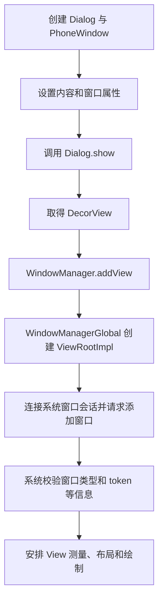

# 整体认识

## 常见弹窗与使用场景

| 类型 | 典型场景 | 实现与管理方式 |
| --- | --- | --- |
| `Dialog` / `AlertDialog` | 确认操作、输入信息、单选或多选 | 拥有自己的窗口；直接使用时由业务管理显示和关闭 |
| `DialogFragment` | 需要随页面重建、恢复的对话框 | 用 Fragment 管理 Dialog，并不是另一种窗口类型 |
| `PopupWindow` | 锚点附近的自定义面板、气泡、下拉内容 | 通过 WindowManager 添加窗口，通常依附宿主窗口 |
| `BottomSheetDialogFragment` | 底部选择器、操作面板、筛选条件 | 用 DialogFragment 管理模态底部弹窗 |
| `Toast` | 简短、无交互的结果提示 | 由系统协调展示，超时自动消失 |
| 应用悬浮窗 | 跨应用悬浮球、持续可见的小工具 | 使用专门的窗口类型，需要相应授权 |

# 弹窗与 Window 的关系

## Dialog 显示的主要流程



普通 Dialog 的内容没有直接加入 Activity 的内容布局，而是走自己的窗口根 View。Activity 与 Dialog 因而通常各自对应一个 `ViewRootImpl`。

## PopupWindow 也有独立窗口

`PopupWindow` 没有像 Dialog 那样持有 `PhoneWindow`，但它会包装内容 View，构造 `WindowManager.LayoutParams`，再通过 `WindowManager.addView()` 添加窗口。

AOSP Android 16 中，PopupWindow 默认采用 `TYPE_APPLICATION_PANEL`。`showAsDropDown(anchor)` 从锚点取得关联窗口 token，计算位置后展示。因此，PopupWindow 并不是给 Activity 的布局简单追加一个悬浮 View。

## token 为什么重要

窗口 token 是系统识别窗口归属、校验添加请求的依据之一，不能简单理解为普通字符串或 Context 的别名。

- 普通页面 Dialog 需要有效的应用窗口环境，通常使用当前 Activity 或基于它的主题 Context。
- PopupWindow 通过锚点或传入的父 View 关联已有窗口；View 尚未附着时，通常还没有有效 token。
- 更换 Context、延迟执行或缓存旧 View，都不能保证宿主窗口仍然有效。

因此，**对象还在内存中，不代表它对应的页面和窗口仍可用。** 这是理解 `BadTokenException` 的关键。

# Dialog

## Dialog简介

1. **创建窗口**：创建 Dialog 时，内部会创建一个 `PhoneWindow`。
2. **设置内容**：调用 `setContentView()`，将布局放进这个窗口的 `DecorView` 中。
3. **显示窗口**：调用 `show()`，通过 `WindowManager.addView()` 添加 `DecorView`，创建对应的 `ViewRootImpl`，连接系统窗口服务，并安排测量、布局和绘制。
4. **关闭窗口**：调用 `dismiss()`，通过 WindowManager 移除窗口根 View。

## AlertDialog


# Dialog 与 AlertDialog

## 两者的分工

`Dialog` 提供窗口与显示、关闭等基础能力；`AlertDialog` 在其上封装标题、正文、按钮、列表及自定义内容区。日期、时间选择也有对应的 `DatePickerDialog`、`TimePickerDialog`。

Material 项目可以使用 `MaterialAlertDialogBuilder` 创建符合主题的 AlertDialog。它负责外观和组件配置，生命周期管理仍需要业务或 DialogFragment 配合。

下面是 Activity 中的一次性展示示例，假设项目已经配置 Material Components 依赖及兼容主题；字符串仅为演示，实际项目应放入资源文件：

```kotlin
// Activity 中的用户点击回调，运行在主线程。
val dialog = MaterialAlertDialogBuilder(this)
    .setTitle("清空搜索记录？")
    .setMessage("清空后无法恢复。")
    .setNegativeButton("取消", null)
    .setPositiveButton("清空") { _, _ ->
        // 将清空操作交给 ViewModel 或业务层。
    }
    .create()

dialog.show()
```

直接持有 Dialog 时，要安排好宿主结束、异步回调取消和引用释放。需要跨页面重建恢复的对话框，适合交给下一节的 DialogFragment 管理。[官方 Dialog 指南](https://developer.android.com/develop/ui/views/components/dialogs)

## show、hide、dismiss 与 cancel

| 方法 | 主要语义 |
| --- | --- |
| `show()` | 显示 Dialog；首次展示时执行相应初始化并添加窗口 |
| `hide()` | 暂时隐藏，窗口没有因此被移除，不能代替最终清理 |
| `dismiss()` | 关闭并移除窗口；正常显示后的关闭会触发 dismiss 通知 |
| `cancel()` | 表达“取消”，发送 cancel 通知后走关闭流程 |

`dismiss()` 不等于 `cancel()`，不能假设关闭一定会触发 `onCancel()`。例如 AlertDialog 的负按钮虽然显示“取消”文字，默认按钮行为也不能直接等同于调用 `cancel()`。业务结果应在相应按钮回调中表达。[Dialog 源码](https://raw.githubusercontent.com/aosp-mirror/platform_frameworks_base/android-16.0.0_r1/core/java/android/app/Dialog.java)

## 点击按钮后不立即关闭

AlertDialog 的标准按钮点击后通常会自动关闭。如果需要“校验通过才关闭”，可以在显示后取得按钮，替换它的点击监听：

```kotlin
// dialog 是已经设置正按钮和输入框的 AlertDialog。
// input 是该对话框中的 EditText，示例省略创建布局的代码。
dialog.show()
dialog.getButton(DialogInterface.BUTTON_POSITIVE).setOnClickListener {
    if (input.text.isNullOrBlank()) {
        input.error = "请输入内容"
    } else {
        // 提交输入；需要等待异步结果时，由结果状态决定是否关闭。
        dialog.dismiss()
    }
}
```

如果由 DialogFragment 承载，可在 `onStart()` 的 `super.onStart()` 之后设置按钮监听，关闭时调用 DialogFragment 自身的 `dismiss()`。

# DialogFragment 与生命周期

## 它解决什么问题

`androidx.fragment.app.DialogFragment` 把 Dialog 接入 FragmentManager 的状态与生命周期管理，便于处理旋转、页面重建和已保存状态的恢复。**恢复的是对话框及其可恢复状态，不是保留旧 Activity 的 Dialog 对象。**[DialogFragment 指南](https://developer.android.com/guide/fragments/dialogs)

业务参数适合放在 `arguments` 中；不能只通过带参数构造函数或临时 lambda 传入必须恢复的信息。进程重建后，内存中的回调、网络请求和普通成员变量不会因此自动恢复。

## 创建对话框并返回结果

下面用 Fragment Result API 返回确认结果，避免让弹窗强引用宿主。使用的是 AndroidX DialogFragment，主要 import 如下：

```kotlin
import android.app.Dialog
import android.os.Bundle
import androidx.core.os.bundleOf
import androidx.fragment.app.DialogFragment
import com.google.android.material.dialog.MaterialAlertDialogBuilder

class ClearHistoryDialog : DialogFragment() {
    override fun onCreateDialog(savedInstanceState: Bundle?): Dialog {
        return MaterialAlertDialogBuilder(requireContext())
            .setTitle("清空搜索记录？")
            .setMessage("清空后无法恢复。")
            .setNegativeButton("取消", null)
            .setPositiveButton("清空") { _, _ ->
                parentFragmentManager.setFragmentResult(
                    REQUEST_KEY,
                    bundleOf(CONFIRMED to true)
                )
            }
            .create()
    }

    companion object {
        const val TAG = "clear_history_dialog"
        const val REQUEST_KEY = "clear_history_result"
        const val CONFIRMED = "confirmed"
    }
}
```

在宿主 Fragment 的 `onViewCreated()` 中注册结果监听并绑定按钮；假设布局已有 `button_clear`：

```kotlin
val fm = childFragmentManager

fm.setFragmentResultListener(
    ClearHistoryDialog.REQUEST_KEY,
    viewLifecycleOwner
) { _, result ->
    if (result.getBoolean(ClearHistoryDialog.CONFIRMED)) {
        // 通知 ViewModel 清空记录。
    }
}

view.findViewById<View>(R.id.button_clear).setOnClickListener {
    // Lifecycle 来自 androidx.lifecycle；View 来自 android.view。
    if (!lifecycle.currentState.isAtLeast(Lifecycle.State.RESUMED) ||
        fm.isStateSaved
    ) {
        return@setOnClickListener
    }

    if (fm.findFragmentByTag(ClearHistoryDialog.TAG) == null) {
        ClearHistoryDialog().showNow(fm, ClearHistoryDialog.TAG)
    }
}
```

这里宿主使用 `childFragmentManager` 展示；弹窗内部的 `parentFragmentManager` 正好就是这个 Manager，结果监听双方因此匹配。一次性结果适合 Fragment Result API，持续共享状态可以使用合适作用域的 ViewModel。[Fragment 通信指南](https://developer.android.com/guide/fragments/communicate)

示例选择 `showNow()`，用于主线程普通点击回调中的同步添加，使后续点击能立即通过 tag 找到已有实例。它不能在 FragmentManager 正执行事务等可重入场景中随意调用。常规 `show()` 异步提交时，连续请求可能在事务执行前都查不到 tag，还应做按钮防连点或记录待展示状态。[DialogFragment API](https://developer.android.com/reference/androidx/fragment/app/DialogFragment)

## 使用时的关键边界

- **已保存状态后不要直接提交展示事务**：先判断 `FragmentManager.isStateSaved`；重要业务可以保留待处理状态，回到可交互页面后再展示。
- **不要把允许状态丢失当通用修复**：`commitAllowingStateLoss()`、`dismissAllowingStateLoss()` 可能让界面状态与后续恢复结果不一致。
- **由 Fragment 管理关闭**：使用 DialogFragment 的 `dismiss()`、`isCancelable`；取消和关闭事件通过覆写 `onCancel()`、`onDismiss()` 处理，不要覆盖其托管 Dialog 的对应监听器。
- **区分 Fragment 生命周期与 View 生命周期**：仅覆写 `onCreateDialog()`、未返回 Fragment View 时，不应假设存在 `viewLifecycleOwner`；返回了 Fragment View 的实现才按 View 生命周期管理相关观察者。

以上分别对应 [FragmentManager 状态约束](https://developer.android.com/reference/androidx/fragment/app/FragmentManager) 和 [DialogFragment 生命周期规则](https://developer.android.com/guide/fragments/dialogs)。

# PopupWindow 与 PopupMenu

## Dialog 和 PopupWindow 的主要区别

| 维度 | Dialog | PopupWindow |
| --- | --- | --- |
| 常见用途 | 完成一个相对独立的确认或输入任务 | 在某个控件附近展示补充内容 |
| 默认展示习惯 | 对话框样式，通常居中，可配置位置 | 支持锚点定位或指定位置 |
| 窗口实现 | 持有 Window，通常为 PhoneWindow | 直接构造窗口参数并添加根 View |
| 焦点 | 普通对话框通常可获得输入焦点 | 可配置；多数构造方式默认不获取焦点 |
| 背景变暗 | 常见主题提供遮罩效果 | 默认不自动使宿主背景变暗 |
| 生命周期管理 | 可以由 DialogFragment 托管 | 通常由宿主自行管理 |

Dialog 也能从底部出现，PopupWindow 也能居中显示；位置并不是两者的本质区别。PopupWindow 的构造参数、锚点定位和焦点行为见 [官方 API](https://developer.android.com/reference/android/widget/PopupWindow)。

## 展示与清理示例

以下代码放在 Fragment 中，从页面按钮点击回调调用 `showPopup(anchor)`。假设已有 `popup_actions` 布局，其中的 `action_close` 用于关闭；该布局自行定义背景和内容样式。

```kotlin
private var popupWindow: PopupWindow? = null

private fun showPopup(anchor: View) {
    if (!lifecycle.currentState.isAtLeast(Lifecycle.State.RESUMED) ||
        !anchor.isAttachedToWindow || anchor.windowToken == null
    ) {
        return
    }

    popupWindow?.dismiss()

    val content = layoutInflater.inflate(R.layout.popup_actions, null)
    val popup = PopupWindow(
        content,
        ViewGroup.LayoutParams.WRAP_CONTENT,
        ViewGroup.LayoutParams.WRAP_CONTENT,
        true // focusable，允许弹层获取焦点。
    ).apply {
        setBackgroundDrawable(ColorDrawable(Color.TRANSPARENT))
        isOutsideTouchable = true
    }

    content.findViewById<View>(R.id.action_close).setOnClickListener {
        popup.dismiss()
    }
    popup.setOnDismissListener {
        if (popupWindow === popup) popupWindow = null
    }

    popupWindow = popup
    popup.showAsDropDown(anchor)
}

override fun onDestroyView() {
    popupWindow?.dismiss()
    popupWindow = null
    super.onDestroyView()
}
```

这里的类分别来自 `android.widget.PopupWindow`、`android.view`、`android.graphics`、`android.graphics.drawable` 和 `androidx.lifecycle`。示例的透明 Drawable 是窗口背景，内容布局仍应设置可读的视觉背景。

`showAsDropDown()` 会根据可用空间调整位置，不保证永远在锚点下方。`showAtLocation()` 用重力和坐标指定位置，但传入的父 View 仍承担关联已有窗口的作用。[PopupWindow API](https://developer.android.com/reference/android/widget/PopupWindow)

## 焦点、外部点击与事件穿透

这几个属性控制不同的事情：

- `isFocusable`：能否获取输入焦点，影响按键、输入框和返回处理。
- `isTouchable`：弹层自身能否接收触摸。
- `isOutsideTouchable`：是否关注窗口外部触摸通知，不能单凭这个开关判断完整手势是否交给底层页面。
- `isTouchModal`：控制窗口外触摸是否由后方窗口处理；公开设置接口从 API 29 提供。

“外部点击使弹层消失”和“同一次点击还能操作底层按钮”是两项不同需求，应结合焦点及 touch-modal 配置实际验证。视觉透明也不代表触摸自动穿透。[PopupWindow 输入相关 API](https://developer.android.com/reference/android/widget/PopupWindow)

## 只有标准菜单时使用 PopupMenu

如果只是“更多操作”菜单，优先使用 PopupMenu，无需自己实现布局、菜单项分发和锚点定位：

```kotlin
// anchor 是已经附着的菜单触发按钮。
androidx.appcompat.widget.PopupMenu(anchor.context, anchor).apply {
    menu.add("刷新").setOnMenuItemClickListener {
        // 通知业务层刷新。
        true
    }
    show()
}
```

项目中通常把菜单项放进 `res/menu`，再调用 `inflate()` 加载，便于管理资源和配置。[官方菜单指南](https://developer.android.com/develop/ui/views/components/menus)

# 底部弹窗与轻量提示

## BottomSheetDialogFragment

`BottomSheetDialogFragment` 是 Material Components 提供的 DialogFragment 子类，内部使用 `BottomSheetDialog`，适合底部操作面板、选择列表和筛选表单。其展开、折叠和拖动状态由 BottomSheetBehavior 配合管理。

它属于**模态底部弹窗**。如果底部面板应长期与页面内容共存，可以直接在页面布局中使用 BottomSheetBehavior，两者的窗口及生命周期关系不同。[BottomSheetDialogFragment API](https://developer.android.com/reference/com/google/android/material/bottomsheet/BottomSheetDialogFragment)

## Toast

Toast 用于简短、无需用户操作的提示，自动消失，不适合承载确认、输入或重要的长文本：

```kotlin
Toast.makeText(context, "已复制", Toast.LENGTH_SHORT).show()
```

需要注意版本和 `targetSdk` 条件：

- 在 Android 11 及以上，面向 API 30 及以上的应用，后台自定义 View Toast 会受到系统拦截；普通文本 Toast 不属于这一条限制。
- 对应 Android 11 的文本 Toast 行为变化后，`setGravity()`、`setMargin()` 不再用于控制实际展示位置，`getView()` 也可能返回 `null`。
- 在 Android 12 及以上，面向 API 31 及以上的应用，文本 Toast 限制为两行并显示应用图标。

因此，不要把旧版“自定义 Toast 可以任意控制外观和位置”的经验直接用于所有版本。普通 Toast API 也不需要应用申请悬浮窗权限。[Android 11 Toast 变化](https://developer.android.com/about/versions/11/behavior-changes-11#toasts)、[Toast 指南](https://developer.android.com/guide/topics/ui/notifiers/toasts)

## Snackbar

Snackbar 适合页面内短暂反馈，可以附带一个操作：

```kotlin
Snackbar.make(view, "连接失败", Snackbar.LENGTH_LONG)
    .setAction("重试") {
        // 通知业务层重试。
    }
    .show()
```

传入的 View 用于向上寻找合适的父容器。Snackbar 通常依附当前页面，适合“操作结果 + 下一步动作”；后台需要用户处理的事件应考虑通知。[Snackbar 展示指南](https://developer.android.com/develop/ui/views/notifications/snackbar/showing)、[Toast 与替代方案](https://developer.android.com/guide/topics/ui/notifiers/toasts)

# 跨应用悬浮窗

## 与普通弹窗的区别

跨应用悬浮窗可以显示在其他应用的 Activity 上方，生命周期不再天然等同于某个页面。普通应用在 Android 8.0（API 26）及以上通常使用 `TYPE_APPLICATION_OVERLAY`。

这类窗口需要 `SYSTEM_ALERT_WINDOW` 对应授权；Android 6.0（API 23）及以上可通过 `Settings.canDrawOverlays()` 检查。这是特殊访问权限，不是普通 `requestPermissions()` 弹框授权流程。[Settings API](https://developer.android.com/reference/android/provider/Settings#canDrawOverlays(android.content.Context))

## 基本流程

1. 在 Manifest 声明 `android.permission.SYSTEM_ALERT_WINDOW`。
2. 检查授权；确有需求时引导用户到系统悬浮窗授权设置。
3. 返回应用后重新检查，不把“打开过设置页”当成已授权。
4. 使用匹配显示区域与窗口类型的 Context、WindowManager 和 LayoutParams 添加 View。
5. 在功能关闭或持有者结束时移除 View，处理重复添加、权限撤销及配置变化。

API 30 起提供 `createWindowContext()`，可为非 Activity 窗口获得相应的窗口环境。仅为了在当前页面上方展示内容，不需要引入跨应用悬浮窗机制。[Context API](https://developer.android.com/reference/android/content/Context#createWindowContext(int,%20android.os.Bundle))

`TYPE_APPLICATION_OVERLAY` 仍低于状态栏、输入法等关键系统窗口，系统也可以调整其可见性。Android 12 起，跨应用触摸穿透还受到不可信遮挡规则约束，不能认为设置 `FLAG_NOT_TOUCHABLE` 后就一定能透传点击。[窗口类型与触摸限制](https://developer.android.com/reference/android/view/WindowManager.LayoutParams)

# 常见问题与排查

## BadTokenException

典型原因包括：使用不具备有效页面窗口环境的 Context、Activity 已结束后才显示 Dialog、PopupWindow 锚点尚未附着，以及窗口类型或 token 不匹配。

排查时先看完整异常和发生时机，再检查 Context 来源、宿主状态及 anchor 是否附着。`isFinishing`、`isDestroyed` 只能解决其中一部分问题，不能替代 FragmentManager 状态检查和异步任务的生命周期管理。

不要只在外层加一个空 `catch`。需要修复的是“请求在宿主失效之后还试图显示”的业务时序。

## WindowLeaked 与引用泄漏

`WindowLeaked` 常见于 Activity 结束时仍有未移除的窗口。直接管理 Dialog、PopupWindow 或 WindowManager View 时，需要在合适的宿主结束节点关闭和释放。

另一个问题是普通内存引用泄漏：单例、静态变量、长生命周期回调仍持有 Dialog，进而持有 Activity。**窗口已经关闭，不代表所有外部引用都已释放。**

DialogFragment 能管理自身窗口，但不能替业务清除全局容器中的 Activity 引用。ViewModel 也不应保存 Dialog、View 或 Activity 实例，而应保存展示所需的业务状态。

## 弹窗重复出现或恢复后状态不对

常见来源是页面恢复时无条件 `show()`、重复订阅同一事件，或多个异步请求同时要求展示。

可以用固定 tag 查找已恢复实例，用业务 ID 对展示请求去重，并明确请求在后台期间应丢弃、延迟还是保留。涉及支付、提交订单等操作时，还应从业务层保证重复点击和重放不会重复执行。

## 显示 Dialog 会触发 Activity.onPause 吗

**在同一 Activity 上显示普通 Dialog，通常不会仅因 Dialog 出现而触发 Activity 的 `onPause()`。** 可获取焦点的 Dialog 会使 Activity 窗口失去焦点，但窗口焦点和 Activity 生命周期是不同维度。

如果启动的是另一个采用对话框主题的 Activity，则仍属于 Activity 切换，原 Activity 通常会经历 `onPause()`；是否进一步 `onStop()` 要看其可见性等条件。[Activity 窗口焦点说明](https://developer.android.com/reference/android/app/Activity#onWindowFocusChanged(boolean))

## 输入法、系统栏与返回行为

- 输入框要先具备焦点，窗口还要允许与输入法交互；仅调用显示键盘的方法不一定有效。
- 全屏弹层、底部表单要处理系统栏和 IME Insets，避免按钮被键盘遮挡。
- 使用系统或 AndroidX 组件提供的返回处理；自定义拦截时同时考虑手势返回和组件自身的取消逻辑。
- `setCancelable(false)` 与“不能点击外部关闭”不是同一配置；DialogFragment 应优先通过自身的取消控制接口管理行为。

# Compose 中的对应组件

Compose 中可以使用 `AlertDialog`、`Dialog`、`DropdownMenu`、`Popup`、`ModalBottomSheet` 和 `SnackbarHost` 等组件表达相应交互，核心写法是**由状态决定是否展示**。

```kotlin
// 假设已使用 Compose Material 3，并导入相应组件和状态 API。
var visible by rememberSaveable { mutableStateOf(false) }

Button(onClick = { visible = true }) {
    Text("查看提示")
}

if (visible) {
    AlertDialog(
        onDismissRequest = { visible = false },
        title = { Text("提示") },
        text = { Text("这是一个由状态控制的对话框。") },
        confirmButton = {
            TextButton(onClick = { visible = false }) {
                Text("知道了")
            }
        }
    )
}
```

`onDismissRequest` 表达关闭请求，需要业务更新状态；确认按钮的处理也应显式更新状态。组件写在同一个 Composable 函数里，并不能据此判断它们是否共用原有平台窗口。[Compose Dialog 指南](https://developer.android.com/develop/ui/compose/components/dialog)

# 面试题

## 🌟🌟🌟 Dialog、DialogFragment 和 PopupWindow 有什么区别？

Dialog 是对话框基础组件，管理自己的窗口；DialogFragment 用 FragmentManager 管理 Dialog 的生命周期和恢复；PopupWindow 适合锚点附近的自定义弹层，也通过 WindowManager 添加窗口。不能把 DialogFragment 当成独立窗口类型，也不能认为 PopupWindow 只是 Activity 布局中的一个子 View。

## 🌟🌟🌟 为什么普通 Dialog 不应随意使用 Application Context？

Application Context 通常不具备当前 Activity 的窗口关联与主题环境，普通应用窗口展示需要有效的归属信息，因此可能出现主题问题或 BadTokenException。应选择与当前页面匹配的 UI Context，而不是为了避免泄漏就一律替换成 Application Context。

## 🌟🌟🌟 如何避免弹窗导致崩溃和泄漏？

展示前检查宿主、FragmentManager 或 anchor 状态；让异步请求随合适的生命周期取消；避免重复展示；直接管理窗口时负责关闭；不让全局对象长期持有弹窗和 Activity。DialogFragment 适合承担可恢复对话框的管理。

## 🌟🌟 为什么弹出 Dialog 后页面失去焦点，却没有执行 onPause？

窗口焦点属于输入路由，Activity 生命周期属于页面状态管理。普通 Dialog 增加窗口并取得焦点，并没有因此启动另一个 Activity，所以两者不能等同。

## 🌟🌟 Toast 和 Snackbar 有什么区别？

Toast 由系统协调短暂展示，没有交互操作，外观和位置受版本限制；Snackbar 通常位于页面 View 树中，可以提供撤销或重试操作，更适合当前页面内的反馈。

## 🌟 跨应用悬浮窗与应用内弹窗有什么区别？

跨应用悬浮窗使用专门的窗口类型和授权机制，可以位于其他应用页面上方，并受到系统层级与触摸安全规则约束。应用内 Dialog、PopupWindow 依附自己的应用窗口环境，通常不需要悬浮窗权限。
