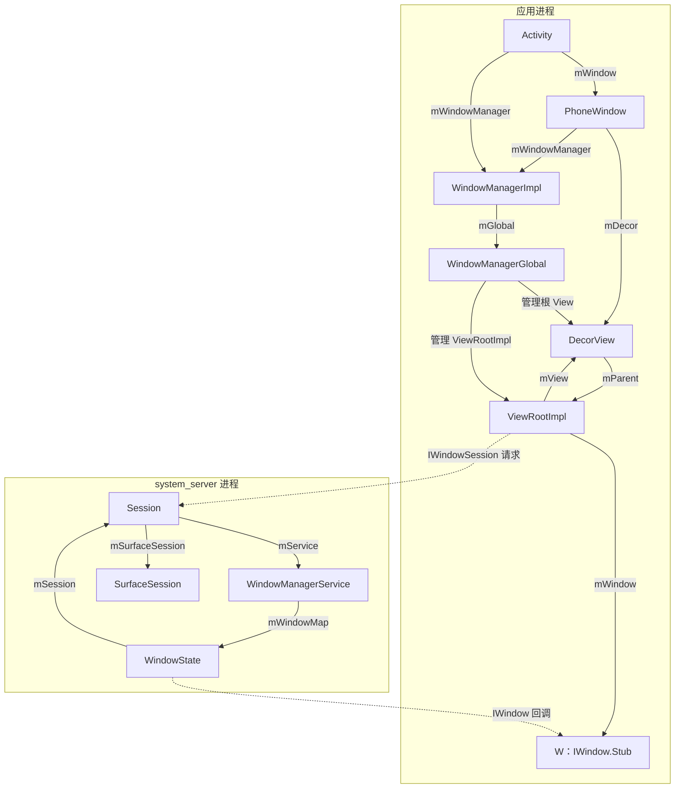
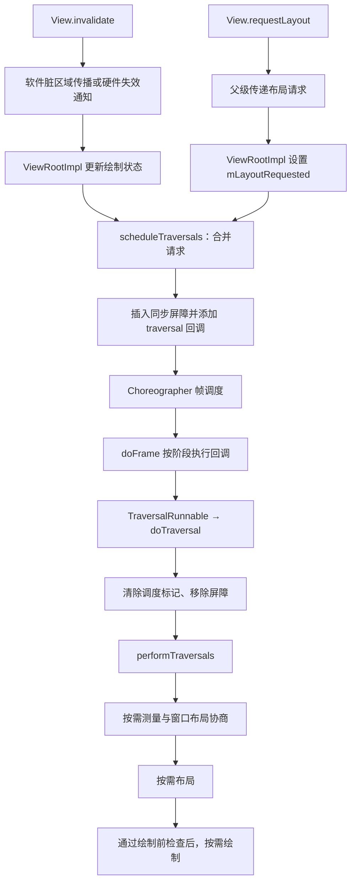
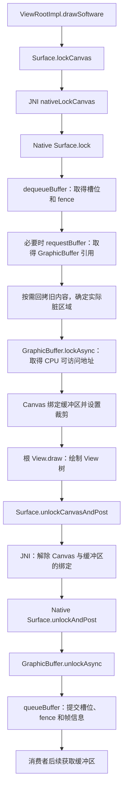
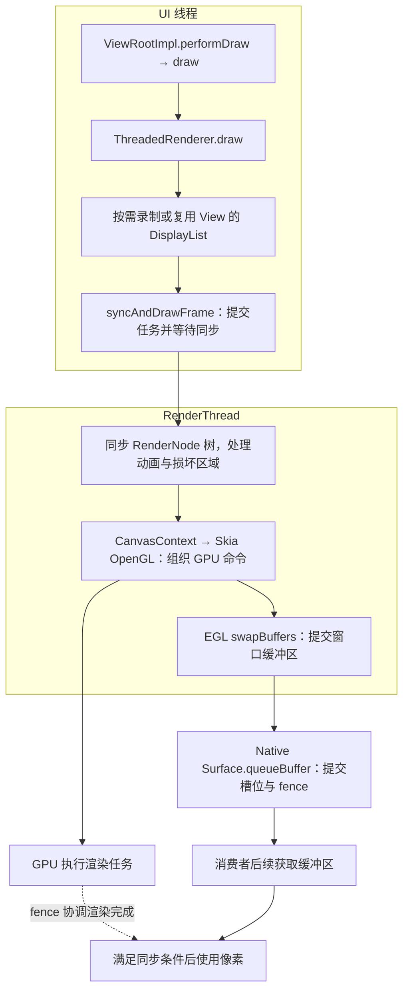

# Activity 窗口与 View 树的建立

## 🌟本节小结

Window与View树的建立流程：

**Window**

在Activity启动时会创建 PhoneWindow 并关联 WindowManager，发生在 `onCreate()` 之前。

- WindowManager的类型是WindowManagerImpl，但是具体逻辑是WindowManagerGlobal实现的，WindowManagerGlobal是一个单例。

**DecorView**

一般在Activity的onCreate方法中setContentView，setContentView会懒加载创建一个DecorView，即使没有创建，在ActivityThread的handleResumeActivity中也会创建，并将添加到WindowManager中。

**ViewRootImpl**

1.  在WindowManagerGlobal的addView方法中，会创建ViewRootImpl。

    - ViewRootImpl通过WindowSession和WMS建立联系。

2.  addView内部会调用setView：保存 DecorView、请求首次遍历、向 WMS 添加窗口，以及建立根 View 的 parent 和输入接收关系。

3.  在WMS中会为这个添加的Window分配Surface，而WMS会将它所管理的Surface交由SurfaceFlinger处理，SurfaceFlinger会将这些Surface混合并绘制到屏幕上。

4.  ViewRootImpl主要做这些事：

    -   View树的根并管理View树。

    -   触发View的测量、布局和绘制。

    -   输入事件的中转站。

    -   管理Surface。

    -   负责与WMS进行进程间通信。



## Activity.attach：创建 PhoneWindow

ActivityThread 在 `performLaunchActivity()` 中创建 Activity 实例，随后调用 `Activity.attach()`，再通过 Instrumentation 触发 `Activity.onCreate()`。PhoneWindow 就是在 `attach()` 中创建的。Window 是抽象类，PhoneWindow 是 Activity 使用的具体窗口实现。

源码：[frameworks/base/core/java/android/app/Activity.java](https://github.com/aosp-mirror/platform_frameworks_base/blob/android-11.0.0_r1/core/java/android/app/Activity.java#L7892)。

```java
final void attach(Context context, ActivityThread aThread,
        Instrumentation instr, IBinder token, int ident,
        Application application, Intent intent, ActivityInfo info,
        CharSequence title, Activity parent, String id,
        NonConfigurationInstances lastNonConfigurationInstances,
        Configuration config, String referrer, IVoiceInteractor voiceInteractor,
        Window window, ActivityConfigCallback activityConfigCallback, IBinder assistToken) {
    attachBaseContext(context);
    // ...
    mWindow = new PhoneWindow(this, window, activityConfigCallback);
    mWindow.setWindowControllerCallback(mWindowControllerCallback);
    mWindow.setCallback(this);
    // ...
    mToken = token;
    // ...
    mComponent = intent.getComponent();
    // ...
    mWindow.setWindowManager(
            (WindowManager) context.getSystemService(Context.WINDOW_SERVICE),
            mToken, mComponent.flattenToString(),
            (info.flags & ActivityInfo.FLAG_HARDWARE_ACCELERATED) != 0);
    // ...
    mWindowManager = mWindow.getWindowManager();
    // ...
}
```

这里建立了三项关系：

- Activity 通过 `mWindow` 持有自己的 PhoneWindow。
- PhoneWindow 通过 `setCallback(this)` 将 Activity 设置为窗口回调对象。
- PhoneWindow 关联 WindowManager，Activity 的 `mWindowManager` 再引用这个 WindowManager。

所以，进入 Activity 的 `onCreate()` 时，PhoneWindow 已经存在。但在普通首次创建流程中，这不代表 DecorView 已创建，也不代表窗口已添加到 WMS。

## 关联 WindowManager

`Window.setWindowManager()` 不会将窗口显示出来，它负责记录窗口信息，并创建一个与当前 PhoneWindow 关联的 WindowManagerImpl。

源码：[frameworks/base/core/java/android/view/Window.java](https://github.com/aosp-mirror/platform_frameworks_base/blob/android-11.0.0_r1/core/java/android/view/Window.java#L814)。

```java
public void setWindowManager(WindowManager wm, IBinder appToken, String appName,
        boolean hardwareAccelerated) {
    mAppToken = appToken;
    mAppName = appName;
    mHardwareAccelerated = hardwareAccelerated;
    if (wm == null) {
        wm = (WindowManager) mContext.getSystemService(Context.WINDOW_SERVICE);
    }
    mWindowManager = ((WindowManagerImpl) wm).createLocalWindowManager(this);
}
```

传入 `createLocalWindowManager(this)` 的 `this` 就是当前 PhoneWindow。方法内部新建 WindowManagerImpl，并把该窗口保存在 `mParentWindow` 中。

源码：[frameworks/base/core/java/android/view/WindowManagerImpl.java](https://github.com/aosp-mirror/platform_frameworks_base/blob/android-11.0.0_r1/core/java/android/view/WindowManagerImpl.java#L70)。

```java
public final class WindowManagerImpl implements WindowManager {
    private final WindowManagerGlobal mGlobal = WindowManagerGlobal.getInstance();
    public final Context mContext;
    private final Window mParentWindow;
    // ...
    private WindowManagerImpl(Context context, Window parentWindow) {
        mContext = context;
        mParentWindow = parentWindow;
    }

    public WindowManagerImpl createLocalWindowManager(Window parentWindow) {
        return new WindowManagerImpl(mContext, parentWindow);
    }
    // ...
}
```

WindowManagerImpl 是应用侧的 WindowManager 实现，其 View 添加、更新、移除操作会委托给 WindowManagerGlobal。后者是进程内单例：

源码：[frameworks/base/core/java/android/view/WindowManagerGlobal.java](https://github.com/aosp-mirror/platform_frameworks_base/blob/android-11.0.0_r1/core/java/android/view/WindowManagerGlobal.java#L182)。

```java
public static WindowManagerGlobal getInstance() {
    synchronized (WindowManagerGlobal.class) {
        if (sDefaultWindowManager == null) {
            sDefaultWindowManager = new WindowManagerGlobal();
        }
        return sDefaultWindowManager;
    }
}
```

因此，同一应用进程内可以有多个 WindowManagerImpl，它们共享同一个 WindowManagerGlobal。WindowManagerGlobal 管理本进程添加的根 View、ViewRootImpl 和布局参数；系统范围内的窗口管理则由 system_server 中的 WMS 负责。

## setContentView：准备 DecorView 和页面内容

通常在 `Activity.onCreate()` 中调用 `setContentView()`。以传入布局资源 ID 为例，Activity 将请求交给自己的 PhoneWindow。

源码：[Activity.java](https://github.com/aosp-mirror/platform_frameworks_base/blob/android-11.0.0_r1/core/java/android/app/Activity.java#L3467)。

```java
public void setContentView(@LayoutRes int layoutResID) {
    getWindow().setContentView(layoutResID);
    initWindowDecorActionBar();
}
```

PhoneWindow 先确保内容容器存在，再将布局加载到该容器中。

源码：[frameworks/base/core/java/com/android/internal/policy/PhoneWindow.java](https://github.com/aosp-mirror/platform_frameworks_base/blob/android-11.0.0_r1/core/java/com/android/internal/policy/PhoneWindow.java#L440)。

```java
@Override
public void setContentView(int layoutResID) {
    if (mContentParent == null) {
        installDecor();
    } else if (!hasFeature(FEATURE_CONTENT_TRANSITIONS)) {
        mContentParent.removeAllViews();
    }

    if (hasFeature(FEATURE_CONTENT_TRANSITIONS)) {
        final Scene newScene = Scene.getSceneForLayout(mContentParent, layoutResID,
                getContext());
        transitionTo(newScene);
    } else {
        mLayoutInflater.inflate(layoutResID, mContentParent);
    }
    mContentParent.requestApplyInsets();
    final Callback cb = getCallback();
    if (cb != null && !isDestroyed()) {
        cb.onContentChanged();
    }
    mContentParentExplicitlySet = true;
}
```

普通、不启用内容转场的路径是：内容容器不存在时先执行 `installDecor()`；容器已经存在时清除旧页面内容；最后把新的布局加载到 `mContentParent` 中。**重复调用 setContentView 通常会替换内容区域，并不意味着重新创建 DecorView。**

`installDecor()` 分别检查 DecorView 和内容容器是否需要初始化。

源码：[PhoneWindow.installDecor](https://github.com/aosp-mirror/platform_frameworks_base/blob/android-11.0.0_r1/core/java/com/android/internal/policy/PhoneWindow.java#L2680)。

```java
private void installDecor() {
    mForceDecorInstall = false;
    if (mDecor == null) {
        mDecor = generateDecor(-1);
        mDecor.setDescendantFocusability(ViewGroup.FOCUS_AFTER_DESCENDANTS);
        mDecor.setIsRootNamespace(true);
        // ...
    } else {
        mDecor.setWindow(this);
    }
    if (mContentParent == null) {
        mContentParent = generateLayout(mDecor);
        // ... 初始化窗口装饰、ActionBar 等
    }
}
```

`generateDecor()` 创建 DecorView；`generateLayout()` 根据主题和窗口功能选择装饰布局，并从中找到内容容器。

源码：[PhoneWindow.generateDecor](https://github.com/aosp-mirror/platform_frameworks_base/blob/android-11.0.0_r1/core/java/com/android/internal/policy/PhoneWindow.java#L2338)、[PhoneWindow.generateLayout](https://github.com/aosp-mirror/platform_frameworks_base/blob/android-11.0.0_r1/core/java/com/android/internal/policy/PhoneWindow.java#L2359)。

```java
protected DecorView generateDecor(int featureId) {
    // ... 根据窗口配置准备 context
    return new DecorView(context, featureId, this, getAttributes());
}

protected ViewGroup generateLayout(DecorView decor) {
    // ... 根据主题、标题栏和 ActionBar 等功能确定 layoutResource
    mDecor.startChanging();
    mDecor.onResourcesLoaded(mLayoutInflater, layoutResource);

    ViewGroup contentParent = (ViewGroup) findViewById(ID_ANDROID_CONTENT);
    if (contentParent == null) {
        throw new RuntimeException("Window couldn't find content container view");
    }
    // ... 设置窗口背景、标题等
    mDecor.finishChanging();
    return contentParent;
}
```

`ID_ANDROID_CONTENT` 对应 `android.R.id.content`。可以把层级理解为：DecorView 包含主题决定的窗口装饰布局，装饰布局中有内容容器，`setContentView()` 提供的业务布局放在内容容器中。窗口是否带标题栏、ActionBar，取决于主题和功能配置，不能固定概括为“每个 DecorView 都包含标题和内容两部分”。

到这里，应用已经准备好了 View 树。首次启动时，仅完成 `setContentView()` 还没有执行下面的 `WindowManager.addView()`，也就不能据此判断窗口已经显示。

## handleResumeActivity：添加 DecorView

ActivityThread 在 `handleResumeActivity()` 中先执行恢复流程，随后在窗口需要显示时获取 DecorView，并通过 WindowManager 添加它。

源码：[ActivityThread.handleResumeActivity](https://github.com/aosp-mirror/platform_frameworks_base/blob/android-11.0.0_r1/core/java/android/app/ActivityThread.java#L4468)。

```java
public void handleResumeActivity(IBinder token, boolean finalStateRequest, boolean isForward,
        String reason) {
    // ...
    final ActivityClientRecord r = performResumeActivity(token, finalStateRequest, reason);
    if (r == null) {
        return;
    }
    // ... 对即将销毁的 Activity 提前返回等
    final Activity a = r.activity;
    // ...
    boolean willBeVisible = !a.mStartedActivity;
    if (!willBeVisible) {
        try {
            willBeVisible = ActivityTaskManager.getService().willActivityBeVisible(
                    a.getActivityToken());
        } catch (RemoteException e) {
            throw e.rethrowFromSystemServer();
        }
    }
    if (r.window == null && !a.mFinished && willBeVisible) {
        r.window = r.activity.getWindow();
        View decor = r.window.getDecorView();
        decor.setVisibility(View.INVISIBLE);
        ViewManager wm = a.getWindowManager();
        WindowManager.LayoutParams l = r.window.getAttributes();
        a.mDecor = decor;
        l.type = WindowManager.LayoutParams.TYPE_BASE_APPLICATION;
        // ... 设置输入法导航参数
        if (r.mPreserveWindow) {
            a.mWindowAdded = true;
            r.mPreserveWindow = false;
            // ... 复用旧 ViewRootImpl 时，重新关联回调
        }
        if (a.mVisibleFromClient) {
            if (!a.mWindowAdded) {
                a.mWindowAdded = true;
                wm.addView(decor, l);
            } else {
                a.onWindowAttributesChanged(l);
            }
        }
    }
    // ... 后续处理可见性等
}
```

这里的 `r.window == null` 检查的是 ActivityClientRecord 是否已经记录窗口，并不表示 `Activity.mWindow` 还没有创建；后者早在 `attach()` 中就已存在。

窗口添加受多个条件约束，包括 Activity 没有结束、预期可见、客户端允许显示，以及尚未添加。保留旧窗口的重建流程会复用已有连接。因此，不能把这里概括成“每次 onResume 都创建窗口并调用 addView”。

`getDecorView()` 还提供了兜底创建：即使没有在 `onCreate()` 中调用 `setContentView()`，只要走到这里，也会确保 DecorView 存在。

源码：[PhoneWindow.getDecorView](https://github.com/aosp-mirror/platform_frameworks_base/blob/android-11.0.0_r1/core/java/com/android/internal/policy/PhoneWindow.java#L2114)。

```java
@Override
public final @NonNull View getDecorView() {
    if (mDecor == null || mForceDecorInstall) {
        installDecor();
    }
    return mDecor;
}
```

`wm.addView(decor, l)` 添加的是 DecorView，而不是把 PhoneWindow 对象本身传给 WMS。调用首先进入 WindowManagerImpl，再委托给 WindowManagerGlobal。

源码：[WindowManagerImpl.addView](https://github.com/aosp-mirror/platform_frameworks_base/blob/android-11.0.0_r1/core/java/android/view/WindowManagerImpl.java#L107)。

```java
@Override
public void addView(@NonNull View view, @NonNull ViewGroup.LayoutParams params) {
    applyDefaultToken(params);
    mGlobal.addView(view, params, mContext.getDisplayNoVerify(), mParentWindow,
            mContext.getUserId());
}
```

WindowManagerGlobal 为这个新加入的根 View 创建 ViewRootImpl，记录 View、ViewRootImpl 和布局参数的对应关系，然后调用 `setView()`。

源码：[WindowManagerGlobal.addView](https://github.com/aosp-mirror/platform_frameworks_base/blob/android-11.0.0_r1/core/java/android/view/WindowManagerGlobal.java#L331)。

```java
public void addView(View view, ViewGroup.LayoutParams params,
        Display display, Window parentWindow, int userId) {
    // ... 参数检查
    final WindowManager.LayoutParams wparams = (WindowManager.LayoutParams) params;
    if (parentWindow != null) {
        parentWindow.adjustLayoutParamsForSubWindow(wparams);
    }
    // ...
    ViewRootImpl root;
    View panelParentView = null;

    synchronized (mLock) {
        // ... 检查重复添加，查找子窗口对应的父窗口 View 等
        root = new ViewRootImpl(view.getContext(), display);
        view.setLayoutParams(wparams);

        mViews.add(view);
        mRoots.add(root);
        mParams.add(wparams);

        try {
            root.setView(view, wparams, panelParentView, userId);
        } catch (RuntimeException e) {
            // ... 失败时清理已登记的对象
            throw e;
        }
    }
}
```

对于这里的 Activity 主窗口，传入的 `view` 就是 DecorView。后面的 `setView()` 会让 ViewRootImpl 持有它，并建立它与窗口系统的连接。

添加窗口时 DecorView 暂时被设为 `INVISIBLE`；正常显示分支后续会通过 `Activity.makeVisible()` 将其设为 `VISIBLE`。这仍然不等于屏幕已经出现第一帧，后续还需要执行遍历、准备 Surface、绘制和提交缓冲区。

源码：[Activity.makeVisible](https://github.com/aosp-mirror/platform_frameworks_base/blob/android-11.0.0_r1/core/java/android/app/Activity.java#L6296)。

```java
void makeVisible() {
    if (!mWindowAdded) {
        ViewManager wm = getWindowManager();
        wm.addView(mDecor, getWindow().getAttributes());
        mWindowAdded = true;
    }
    mDecor.setVisibility(View.VISIBLE);
}
```

## ViewRootImpl 与 WMS 建立联系

### 创建 ViewRootImpl，获取窗口会话

ViewRootImpl 是应用侧 View 树与窗口系统之间的桥梁。它实现 ViewParent，本身不继承 View。构造时会获取 IWindowSession，并创建用于接收 WMS 回调的 `W` 对象。

源码：[frameworks/base/core/java/android/view/ViewRootImpl.java](https://github.com/aosp-mirror/platform_frameworks_base/blob/android-11.0.0_r1/core/java/android/view/ViewRootImpl.java#L716)。

```java
public final class ViewRootImpl implements ViewParent,
        View.AttachInfo.Callbacks, ThreadedRenderer.DrawCallbacks {
    // ...
    public ViewRootImpl(Context context, Display display) {
        this(context, display, WindowManagerGlobal.getWindowSession(),
                false /* useSfChoreographer */);
    }

    public ViewRootImpl(Context context, Display display, IWindowSession session,
            boolean useSfChoreographer) {
        mContext = context;
        mWindowSession = session;
        mDisplay = display;
        // ...
        mThread = Thread.currentThread();
        // ...
        mWindow = new W(this);
        // ...
    }
    // ...
}
```

这里需要区分两个同名成员：`Activity.mWindow` 是 PhoneWindow；`ViewRootImpl.mWindow` 是实现了 IWindow Binder 接口的 `W`，两者不是同一种对象。

`WindowManagerGlobal.getWindowSession()` 首次调用时通过 WMS 创建 Session，之后复用缓存的 IWindowSession 代理。

源码：[WindowManagerGlobal.getWindowSession](https://github.com/aosp-mirror/platform_frameworks_base/blob/android-11.0.0_r1/core/java/android/view/WindowManagerGlobal.java#L212)。

```java
public static IWindowSession getWindowSession() {
    synchronized (WindowManagerGlobal.class) {
        if (sWindowSession == null) {
            try {
                // ... 初始化输入法相关兼容逻辑
                IWindowManager windowManager = getWindowManagerService();
                sWindowSession = windowManager.openSession(
                        new IWindowSessionCallback.Stub() {
                            @Override
                            public void onAnimatorScaleChanged(float scale) {
                                ValueAnimator.setDurationScale(scale);
                            }
                        });
            } catch (RemoteException e) {
                throw e.rethrowFromSystemServer();
            }
        }
        return sWindowSession;
    }
}
```

`getWindowManagerService()` 通过 ServiceManager 查询名为 `window` 的服务并得到 IWindowManager 代理。服务端的 `openSession()` 创建 Session：

源码：[frameworks/base/services/core/java/com/android/server/wm/WindowManagerService.java](https://github.com/aosp-mirror/platform_frameworks_base/blob/android-11.0.0_r1/services/core/java/com/android/server/wm/WindowManagerService.java#L5177)。

```java
@Override
public IWindowSession openSession(IWindowSessionCallback callback) {
    return new Session(this, callback);
}
```

因此，在这套标准调用流程中，同一应用进程的多个 ViewRootImpl 通过静态字段 `sWindowSession` 共享会话；每个 ViewRootImpl 又有自己的 `W` 对象，用于标识和接收各自窗口的回调。这个共享关系来自会话缓存，不能仅凭 WindowManagerGlobal 是单例就推导出所有成员也只有一个实例。

### setView：关联根 View 并发起窗口添加

`setView()` 中有四个关键步骤：保存 DecorView、请求首次遍历、向 WMS 添加窗口，以及建立根 View 的 parent 和输入接收关系。

源码：[ViewRootImpl.setView](https://github.com/aosp-mirror/platform_frameworks_base/blob/android-11.0.0_r1/core/java/android/view/ViewRootImpl.java#L919)。以下保留成功路径的主要语句，省略兼容处理、部分错误清理和返回码检查：

```java
public void setView(View view, WindowManager.LayoutParams attrs, View panelParentView,
        int userId) {
    synchronized (this) {
        if (mView == null) {
            mView = view;
            // ...
            mWindowAttributes.copyFrom(attrs);
            // ...
            mAttachInfo.mRootView = view;
            // ...
            mAdded = true;
            int res;

            // 先安排首次遍历，再向 WMS 添加窗口。
            requestLayout();
            InputChannel inputChannel = null;
            if ((mWindowAttributes.inputFeatures
                    & WindowManager.LayoutParams.INPUT_FEATURE_NO_INPUT_CHANNEL) == 0) {
                inputChannel = new InputChannel();
            }
            // ...
            try {
                // ...
                res = mWindowSession.addToDisplayAsUser(mWindow, mSeq, mWindowAttributes,
                        getHostVisibility(), mDisplay.getDisplayId(), userId, mTmpFrame,
                        mAttachInfo.mContentInsets, mAttachInfo.mStableInsets,
                        mAttachInfo.mDisplayCutout, inputChannel,
                        mTempInsets, mTempControls);
                setFrame(mTmpFrame);
            } catch (RemoteException e) {
                // ... 清理本地状态、取消遍历等
                throw new RuntimeException("Adding window failed", e);
            }
            // ... 检查添加结果；失败时清理或抛出异常
            if (inputChannel != null) {
                // ... 处理自定义 InputQueue 回调
                mInputEventReceiver = new WindowInputEventReceiver(inputChannel,
                        Looper.myLooper());
            }

            view.assignParent(this);
            // ... 初始化输入事件处理阶段等
        }
    }
}
```

`requestLayout()` 在这里的作用是设置布局请求并安排后续遍历，不是在这行代码中立即执行整棵 View 树的测量、布局和绘制。

源码：[ViewRootImpl.requestLayout](https://github.com/aosp-mirror/platform_frameworks_base/blob/android-11.0.0_r1/core/java/android/view/ViewRootImpl.java#L1604)。

```java
@Override
public void requestLayout() {
    if (!mHandlingLayoutInLayoutRequest) {
        checkThread();
        mLayoutRequested = true;
        scheduleTraversals();
    }
}
```

所以，虽然 `requestLayout()` 写在 `addToDisplayAsUser()` 之前，但不能据此认为“先绘制完成，再向 WMS 添加窗口”。当前调用继续建立窗口连接，实际遍历由后续调度执行。

`view.assignParent(this)` 则将 DecorView 的 parent 设置为 ViewRootImpl。**DecorView 是这棵树中的根 View，ViewRootImpl 是实现了 ViewParent 的管理者。** 它持有根 View，组织测量、布局和绘制，处理输入，并与 WMS 通信。

### 服务端 Session 将请求交给 WMS

`mWindowSession.addToDisplayAsUser()` 通过 Binder 到达 system_server 中的 Session，Session 再调用 WMS 的 `addWindow()`。

源码：[frameworks/base/services/core/java/com/android/server/wm/Session.java](https://github.com/aosp-mirror/platform_frameworks_base/blob/android-11.0.0_r1/services/core/java/com/android/server/wm/Session.java#L171)。

```java
@Override
public int addToDisplayAsUser(IWindow window, int seq, WindowManager.LayoutParams attrs,
        int viewVisibility, int displayId, int userId, Rect outFrame,
        Rect outContentInsets, Rect outStableInsets,
        DisplayCutout.ParcelableWrapper outDisplayCutout, InputChannel outInputChannel,
        InsetsState outInsetsState, InsetsSourceControl[] outActiveControls) {
    return mService.addWindow(this, window, seq, attrs, viewVisibility, displayId, outFrame,
            outContentInsets, outStableInsets, outDisplayCutout, outInputChannel,
            outInsetsState, outActiveControls, userId);
}
```

这里传入的 `window` 来自应用侧 `ViewRootImpl.mWindow`，在服务端表现为 IWindow 代理。`attrs` 是窗口布局参数；带 `out` 含义的参数用于返回窗口信息和输入通道等。PhoneWindow 和整棵 View 树都没有被传到 system_server 中。

WMS 经过权限、窗口 token、显示设备等检查后，为该窗口建立 WindowState。

源码：[WindowManagerService.addWindow](https://github.com/aosp-mirror/platform_frameworks_base/blob/android-11.0.0_r1/services/core/java/com/android/server/wm/WindowManagerService.java#L1373)。

```java
public int addWindow(/* 参数略 */) {
    // ... 权限检查，准备调用方和窗口信息
    synchronized (mGlobalLock) {
        // ... 检查显示设备、窗口 token、重复添加等
        final WindowState win = new WindowState(this, session, client, token, parentWindow,
                appOp[0], seq, attrs, viewVisibility, session.mUid, userId,
                session.mCanAddInternalSystemWindow);
        // ...
        final boolean openInputChannels = (outInputChannel != null
                && (attrs.inputFeatures & INPUT_FEATURE_NO_INPUT_CHANNEL) == 0);
        if (openInputChannels) {
            win.openInputChannel(outInputChannel);
        }
        // ...
        win.attach();
        mWindowMap.put(client.asBinder(), win);
        // ...
    }
    // ...
    return res;
}
```

WindowState 保存服务端管理这个窗口所需的状态，包括 Session、客户端 IWindow、窗口属性和可见性等。它与应用侧 PhoneWindow 分工不同：PhoneWindow 组织应用窗口的装饰和内容；WindowState 供 WMS 跟踪和管理系统中的窗口。

`mWindowMap` 以客户端 IWindow 的 Binder 为键登记 WindowState。后续窗口请求携带同一个 IWindow 时，WMS 就能找到相应的服务端窗口状态。

### 首个窗口添加时准备 SurfaceSession

WMS 调用 `win.attach()`，再进入 `Session.windowAddedLocked()`。

源码：[frameworks/base/services/core/java/com/android/server/wm/WindowState.java](https://github.com/aosp-mirror/platform_frameworks_base/blob/android-11.0.0_r1/services/core/java/com/android/server/wm/WindowState.java#L961)。

```java
void attach() {
    // ... 日志
    mSession.windowAddedLocked(mAttrs.packageName);
}
```

源码：[Session.windowAddedLocked](https://github.com/aosp-mirror/platform_frameworks_base/blob/android-11.0.0_r1/services/core/java/com/android/server/wm/Session.java#L512)。

```java
void windowAddedLocked(String packageName) {
    mPackageName = packageName;
    mRelayoutTag = "relayoutWindow: " + mPackageName;
    if (mSurfaceSession == null) {
        // ...
        mSurfaceSession = new SurfaceSession();
        // ...
        mService.mSessions.add(this);
        // ... 同步动画缩放配置
    }
    mNumWindow++;
}
```

该 Session 第一次添加窗口时创建 SurfaceSession，随后添加其他窗口时可以复用，并通过 `mNumWindow` 记录窗口数量。这里的 SurfaceSession 位于 system_server，是与 SurfaceFlinger 建立连接的 Java 封装。

源码：[frameworks/base/core/java/android/view/SurfaceSession.java](https://github.com/aosp-mirror/platform_frameworks_base/blob/android-11.0.0_r1/core/java/android/view/SurfaceSession.java#L30)。

```java
public final class SurfaceSession {
    private long mNativeClient; // SurfaceComposerClient*
    private static native long nativeCreate();
    // ...
    public SurfaceSession() {
        mNativeClient = nativeCreate();
    }
    // ...
}
```

SurfaceSession 的 Native 连接过程在后面的 Surface 章节展开。此处创建 SurfaceSession，不等于应用已经取得可以绘制内容的有效 Surface。窗口用于绘制的 Surface／SurfaceControl 如何在后续 `relayoutWindow()` 中建立并返回，是下一阶段的工作。

### 窗口回调与输入事件的区别

前面是应用通过 IWindowSession 向 WMS 发起请求。反方向上，WMS 可以通过 IWindow 通知应用窗口尺寸、Insets、焦点等变化；应用端由 ViewRootImpl 内部的 `W` 接收，再转交 ViewRootImpl。

源码：[ViewRootImpl.W](https://github.com/aosp-mirror/platform_frameworks_base/blob/android-11.0.0_r1/core/java/android/view/ViewRootImpl.java#L9077)。以 Insets 变化为例：

```java
static class W extends IWindow.Stub {
    private final WeakReference<ViewRootImpl> mViewAncestor;
    private final IWindowSession mWindowSession;

    W(ViewRootImpl viewAncestor) {
        mViewAncestor = new WeakReference<ViewRootImpl>(viewAncestor);
        mWindowSession = viewAncestor.mWindowSession;
    }
    // ...
    @Override
    public void insetsChanged(InsetsState insetsState) {
        final ViewRootImpl viewAncestor = mViewAncestor.get();
        if (viewAncestor != null) {
            viewAncestor.dispatchInsetsChanged(insetsState);
        }
    }
    // ...
}
```

普通按键、触摸事件的数据传输走输入系统和 InputChannel，在应用侧由前面创建的 WindowInputEventReceiver 接收并进入 ViewRootImpl 的输入处理流程。不要沿用旧式的“WMS 调用 IWindow.dispatchKey 发送按键”来解释本节的 Android 11 实现。

| 通信方向              | 接口或通道     | 本节涉及的作用                       |
| --------------------- | -------------- | ------------------------------------ |
| 应用 → WMS 的 Session | IWindowSession | 添加窗口、请求布局、移除窗口等       |
| WMS → 应用的 W        | IWindow        | 通知尺寸、Insets、焦点等窗口状态变化 |
| 输入系统 → 应用       | InputChannel   | 传递按键、触摸等输入事件             |

# 绘制请求与遍历调度

## 🌟本节小结

1. invalidate 请求更新绘制内容（软件脏区域传播或硬件失效通知），requestLayout 请求重新测量和布局。最终会调用scheduleTraversals。
2. scheduleTraversals做了两件事：
   1. 在主线程消息循环放置一个同步屏障，用于优先处理Handler异步消息。
   2. 向 Choreographer 注册 traversal 回调（TraversalRunnable）。而Choreographer的回调由VSync驱动。
3. TraversalRunnable会移除同步屏障（通过一个token标识）并且调用performTraversals。
4. performTraversals 会依次按需执行 measure、layout、draw，并非每次都完整执行三个阶段。
   - 最常见的例子是：只调用 `invalidate()`，布局和尺寸都没变时，通常跳过 measure、layout，只执行 draw。 
5. 提交绘制工作完成后，距离 SurfaceFlinger 合成、显示设备呈现这一帧仍有后续流程。



## invalidate：请求更新绘制内容

### 小结

`invalidate()` 表示：**绘制内容变了，请安排重绘。**

- **软件绘制**：脏区域沿父级向上传递、合并；绘制时由 CPU 更新对应区域。
- **硬件绘制**：失效通知向上传递；绘制时按需更新 DisplayList，复用未失效的绘制指令，再由 GPU 渲染。

两者最终都可能触发 ViewRootImpl 调度遍历，**不会立即执行 `onDraw()`，也不主动要求重新测量、布局。**

### View 记录失效状态并通知父级

当自定义 View 的绘制数据发生变化，而尺寸和位置不需要改变时，可以调用 `invalidate()` 请求更新显示内容。无参方法最终进入 `invalidateInternal()`。

源码：[frameworks/base/core/java/android/view/View.java](https://github.com/aosp-mirror/platform_frameworks_base/blob/android-11.0.0_r1/core/java/android/view/View.java#L18469)。

```java
public void invalidate() {
    invalidate(true);
}

public void invalidate(boolean invalidateCache) {
    invalidateInternal(0, 0, mRight - mLeft, mBottom - mTop, invalidateCache, true);
}

void invalidateInternal(int l, int t, int r, int b, boolean invalidateCache,
        boolean fullInvalidate) {
    // ... 处理 GhostView
    if (skipInvalidate()) {
        return;
    }
    // ...
    if ((mPrivateFlags & (PFLAG_DRAWN | PFLAG_HAS_BOUNDS)) == (PFLAG_DRAWN | PFLAG_HAS_BOUNDS)
            || (invalidateCache && (mPrivateFlags & PFLAG_DRAWING_CACHE_VALID) == PFLAG_DRAWING_CACHE_VALID)
            || (mPrivateFlags & PFLAG_INVALIDATED) != PFLAG_INVALIDATED
            || (fullInvalidate && isOpaque() != mLastIsOpaque)) {
        if (fullInvalidate) {
            mLastIsOpaque = isOpaque();
            mPrivateFlags &= ~PFLAG_DRAWN;
        }
        mPrivateFlags |= PFLAG_DIRTY;

        if (invalidateCache) {
            mPrivateFlags |= PFLAG_INVALIDATED;
            mPrivateFlags &= ~PFLAG_DRAWING_CACHE_VALID;
        }

        final AttachInfo ai = mAttachInfo;
        final ViewParent p = mParent;
        if (p != null && ai != null && l < r && t < b) {
            final Rect damage = ai.mTmpInvalRect;
            damage.set(l, t, r, b);
            p.invalidateChild(this, damage);
        }
        // ... 处理背景投影接收者
    }
}
```

这一段的重点是设置 `PFLAG_DIRTY`、`PFLAG_INVALIDATED` 等失效标记，清除绘制缓存有效标记，然后调用父级的 `invalidateChild()`。它没有直接调用 `onDraw()`，也没有设置 `PFLAG_FORCE_LAYOUT` 来要求重新布局。

请求向上传递有条件：例如 View 需要具备有效的父级和 AttachInfo，区域也要有效。`skipInvalidate()` 还会结合可见性、动画和转场状态跳过无须处理的请求。因此，不能把每次 `invalidate()` 都理解为一定会立刻到达 ViewRootImpl。

### 软件绘制：逐级转换并汇总脏区域

ViewGroup 的 `invalidateChild()` 区分硬件加速和软件绘制路径。软件路径沿 ViewParent 向上遍历，传播需要更新的区域。

源码：[frameworks/base/core/java/android/view/ViewGroup.java](https://github.com/aosp-mirror/platform_frameworks_base/blob/android-11.0.0_r1/core/java/android/view/ViewGroup.java#L6038)。

```java
public final void invalidateChild(View child, final Rect dirty) {
    final AttachInfo attachInfo = mAttachInfo;
    if (attachInfo != null && attachInfo.mHardwareAccelerated) {
        onDescendantInvalidated(child, child);
        return;
    }

    ViewParent parent = this;
    if (attachInfo != null) {
        // ... 准备子 View 的位置、动画标记，处理变换矩阵
        do {
            // ... 更新当前父级的绘制状态
            parent = parent.invalidateChildInParent(location, dirty);
            // ... 处理当前父级的变换矩阵
        } while (parent != null);
    }
}
```

各级 ViewGroup 在 `invalidateChildInParent()` 中根据子 View 位置、滚动和裁剪等条件调整 dirty 区域，并返回自己的父级。到达 ViewRootImpl 后，脏区域被合并到窗口级的 `mDirty` 中，满足条件时安排遍历。

源码：[ViewRootImpl.invalidateChildInParent](https://github.com/aosp-mirror/platform_frameworks_base/blob/android-11.0.0_r1/core/java/android/view/ViewRootImpl.java#L1651)。

```java
public ViewParent invalidateChildInParent(int[] location, Rect dirty) {
    checkThread();
    // ...
    if (dirty == null) {
        invalidate();
        return null;
    } else if (dirty.isEmpty() && !mIsAnimating) {
        return null;
    }
    // ... 处理滚动和兼容缩放
    invalidateRectOnScreen(dirty);
    return null;
}

private void invalidateRectOnScreen(Rect dirty) {
    final Rect localDirty = mDirty;
    localDirty.union(dirty.left, dirty.top, dirty.right, dirty.bottom);

    final float appScale = mAttachInfo.mApplicationScale;
    final boolean intersected = localDirty.intersect(0, 0,
            (int) (mWidth * appScale + 0.5f), (int) (mHeight * appScale + 0.5f));
    if (!intersected) {
        localDirty.setEmpty();
    }
    if (!mWillDrawSoon && (intersected || mIsAnimating)) {
        scheduleTraversals();
    }
}
```

`union()` 合并多次更新的区域；`intersect()` 将区域限制到窗口边界内。`mWillDrawSoon` 表示当前遍历已经进入即将绘制的阶段，可以避免在适当情况下重复调度。

### 硬件加速：通过 onDescendantInvalidated 向上传播

硬件加速路径调用 `onDescendantInvalidated()`，不沿用上面逐级传递 dirty 矩形的完整流程。ViewGroup 的源码说明，HWUI 的绘制损坏区域由 RenderThread 的 Native 代码计算；Java 层主要传播绘制状态变化。

源码：[ViewGroup.onDescendantInvalidated](https://github.com/aosp-mirror/platform_frameworks_base/blob/android-11.0.0_r1/core/java/android/view/ViewGroup.java#L5995)。

```java
public void onDescendantInvalidated(@NonNull View child, @NonNull View target) {
    mPrivateFlags |= (target.mPrivateFlags & PFLAG_DRAW_ANIMATION);

    if ((target.mPrivateFlags & ~PFLAG_DIRTY_MASK) != 0) {
        mPrivateFlags = (mPrivateFlags & ~PFLAG_DIRTY_MASK) | PFLAG_DIRTY;
        mPrivateFlags &= ~PFLAG_DRAWING_CACHE_VALID;
    }
    if (mLayerType == LAYER_TYPE_SOFTWARE) {
        mPrivateFlags |= PFLAG_INVALIDATED | PFLAG_DIRTY;
        target = this;
    }
    if (mParent != null) {
        mParent.onDescendantInvalidated(this, target);
    }
}
```

传到 ViewRootImpl 后，仍然可能进入 `scheduleTraversals()`。

源码：[ViewRootImpl.onDescendantInvalidated](https://github.com/aosp-mirror/platform_frameworks_base/blob/android-11.0.0_r1/core/java/android/view/ViewRootImpl.java#L1618)。

```java
public void onDescendantInvalidated(@NonNull View child, @NonNull View descendant) {
    if ((descendant.mPrivateFlags & PFLAG_DRAW_ANIMATION) != 0) {
        mIsAnimating = true;
    }
    invalidate();
}

void invalidate() {
    mDirty.set(0, 0, mWidth, mHeight);
    if (!mWillDrawSoon) {
        scheduleTraversals();
    }
}
```

这里将 ViewRootImpl 的 `mDirty` 设为整个窗口，不代表 GPU 必然重新绘制所有像素，也不代表每个 View 都重新执行 `onDraw()`。硬件绘制还会利用 RenderNode／DisplayList，具体过程放在《硬件加速》中展开。[Android 官方绘制模型说明](https://developer.android.com/develop/ui/views/graphics/hardware-accel#android-drawing-models)

**invalidate 的直接目的，是让绘制内容失效并请求更新；它本身不要求重新测量和布局。** 如果同一次遍历中还存在首次布局、尺寸变化或其他布局请求，则仍可能执行测量和布局。

## requestLayout：请求重新测量和布局

### 小结

`requestLayout()` 表示：**尺寸或位置可能变了，请重新测量、布局。**

- 清理自身测量缓存，设置强制布局标记。
- 父级尚未请求布局时，继续向上传递。
- 到达 ViewRootImpl 后设置 `mLayoutRequested`，安排遍历。

**不会立即执行；重复请求可以合并，也不保证所有 View 都重新测量、布局。**

### View 设置布局标记并向父级传播

当 View 的变化可能影响尺寸或位置时，需要请求重新布局。`View.requestLayout()` 会清理自己的测量缓存、设置布局相关标记，并在父级尚未请求布局时继续向上传播。

源码：[View.requestLayout](https://github.com/aosp-mirror/platform_frameworks_base/blob/android-11.0.0_r1/core/java/android/view/View.java#L25371)。

```java
public void requestLayout() {
    if (mMeasureCache != null) mMeasureCache.clear();

    if (mAttachInfo != null && mAttachInfo.mViewRequestingLayout == null) {
        ViewRootImpl viewRoot = getViewRootImpl();
        if (viewRoot != null && viewRoot.isInLayout()) {
            if (!viewRoot.requestLayoutDuringLayout(this)) {
                return;
            }
        }
        mAttachInfo.mViewRequestingLayout = this;
    }

    mPrivateFlags |= PFLAG_FORCE_LAYOUT;
    mPrivateFlags |= PFLAG_INVALIDATED;

    if (mParent != null && !mParent.isLayoutRequested()) {
        mParent.requestLayout();
    }
    if (mAttachInfo != null && mAttachInfo.mViewRequestingLayout == this) {
        mAttachInfo.mViewRequestingLayout = null;
    }
}
```

`PFLAG_FORCE_LAYOUT` 使后续测量不能简单地因 MeasureSpec 未变化而跳过当前 View。`!mParent.isLayoutRequested()` 则避免沿已经提出布局请求的父级重复传播。它并不是每次调用都无条件遍历到 ViewRootImpl。

当请求到达 ViewRootImpl 时，设置的是窗口根部的 `mLayoutRequested`，随后进入与 invalidate 相同的调度入口。

源码：[ViewRootImpl.requestLayout](https://github.com/aosp-mirror/platform_frameworks_base/blob/android-11.0.0_r1/core/java/android/view/ViewRootImpl.java#L1604)。

```java
@Override
public void requestLayout() {
    if (!mHandlingLayoutInLayoutRequest) {
        checkThread();
        mLayoutRequested = true;
        scheduleTraversals();
    }
}
```

### 请求布局与实际执行的边界

在正常、已连接且允许布局的窗口中，requestLayout 会请求一次包含测量和布局的遍历。但这个请求不能解释为“立即执行”或“所有后代都必定重新执行 onMeasure、onLayout”。需要注意：

- 请求会被合并，窗口停止等状态也会影响本次遍历是否执行布局。
- 父容器决定如何测量、布局子 View；未受影响的子 View 可能复用结果。发起请求的 View 自己已经清理缓存并设置了强制布局标记，不能反过来用“有缓存”解释为它的请求一概无效。
- ViewGroup 可以通过 `suppressLayout()` 暂时抑制布局；在 layout 中再次 requestLayout 也有专门的延期处理。

例如，ViewGroup 的 `layout()` 保留了明确的抑制分支。

源码：[ViewGroup.layout](https://github.com/aosp-mirror/platform_frameworks_base/blob/android-11.0.0_r1/core/java/android/view/ViewGroup.java#L6384)。

```java
@Override
public final void layout(int l, int t, int r, int b) {
    if (!mSuppressLayout && (mTransition == null || !mTransition.isChangingLayout())) {
        if (mTransition != null) {
            mTransition.layoutChange(this);
        }
        super.layout(l, t, r, b);
    } else {
        mLayoutCalledWhileSuppressed = true;
    }
}
```

对于布局期间提出的新请求，ViewRootImpl 会记录请求者：第一次布局后仍有有效请求时，可以在当前遍历中补做一次测量和布局；第二次布局中继续产生的请求则延期处理，避免无限循环。具体实现见 [requestLayoutDuringLayout 与 performLayout](https://github.com/aosp-mirror/platform_frameworks_base/blob/android-11.0.0_r1/core/java/android/view/ViewRootImpl.java#L3433)。

| 对比项               | invalidate                       | requestLayout                        |
| -------------------- | -------------------------------- | ------------------------------------ |
| 请求目的             | 更新绘制内容                     | 重新评估尺寸、位置和布局             |
| View 层关键状态      | 绘制失效标记、缓存失效           | 清理测量缓存，设置强制布局和失效标记 |
| 向上传播             | 软件脏区域路径或硬件失效通知路径 | 父级尚未请求布局时继续传递           |
| 到达 ViewRootImpl 后 | 更新绘制相关状态，按需调度       | 设置 mLayoutRequested，按需调度      |
| 能否立即执行         | 不能，需等待调度                 | 不能，需等待调度                     |

两者不能简单互相替代。requestLayout 可能伴随重绘，但不能据此保证某个 View 的 `onDraw()` 一定执行；只改变自定义绘制内容时，应明确调用 invalidate。

## scheduleTraversals：合并请求并安排遍历

### ViewRootImpl 合并遍历请求

invalidate 和 requestLayout 在不同状态下到达 ViewRootImpl，最终都可能调用 `scheduleTraversals()`。这个方法先检查是否已经安排了遍历。

源码：[ViewRootImpl.scheduleTraversals](https://github.com/aosp-mirror/platform_frameworks_base/blob/android-11.0.0_r1/core/java/android/view/ViewRootImpl.java#L1923)。

```java
void scheduleTraversals() {
    if (!mTraversalScheduled) {
        mTraversalScheduled = true;
        mTraversalBarrier = mHandler.getLooper().getQueue().postSyncBarrier();
        mChoreographer.postCallback(
                Choreographer.CALLBACK_TRAVERSAL, mTraversalRunnable, null);
        notifyRendererOfFramePending();
        pokeDrawLockIfNeeded();
    }
}
```

主要工作是：

1. 将 `mTraversalScheduled` 设为 true，防止同一 ViewRootImpl 为尚未执行的遍历重复添加回调。
2. 向当前 Looper 的 MessageQueue 插入同步屏障，保存返回的 token。
3. 向 Choreographer 的 `CALLBACK_TRAVERSAL` 队列添加 `mTraversalRunnable`。

另外两个调用负责通知渲染器有待处理帧，以及在需要时处理绘制唤醒锁。这些都是安排后续工作的步骤，此处没有直接执行 `performTraversals()`。

例如，同一段事件处理代码连续修改多个 View，并多次到达 `scheduleTraversals()`，通常只会保留一个待执行的遍历回调。各次请求留下的布局标记、脏区域等状态仍会参与后续处理，并没有因为调度合并而被丢弃。

### Choreographer 保存回调并请求帧调度

`postCallback()` 最终进入 `postCallbackDelayedInternal()`。这里使用的是 Choreographer 自己按回调类型划分的队列。

源码：[frameworks/base/core/java/android/view/Choreographer.java](https://github.com/aosp-mirror/platform_frameworks_base/blob/android-11.0.0_r1/core/java/android/view/Choreographer.java#L419)。

```java
public void postCallback(int callbackType, Runnable action, Object token) {
    postCallbackDelayed(callbackType, action, token, 0);
}

private void postCallbackDelayedInternal(int callbackType,
        Object action, Object token, long delayMillis) {
    // ...
    synchronized (mLock) {
        final long now = SystemClock.uptimeMillis();
        final long dueTime = now + delayMillis;
        mCallbackQueues[callbackType].addCallbackLocked(dueTime, action, token);

        if (dueTime <= now) {
            scheduleFrameLocked(now);
        } else {
            Message msg = mHandler.obtainMessage(MSG_DO_SCHEDULE_CALLBACK, action);
            msg.arg1 = callbackType;
            msg.setAsynchronous(true);
            mHandler.sendMessageAtTime(msg, dueTime);
        }
    }
}
```

本次 delay 为 0，会立即尝试安排帧。在通常启用 VSync 的路径中，`scheduleFrameLocked()` 通过 DisplayEventReceiver 请求下一次 VSync 通知。

源码：[Choreographer.scheduleFrameLocked](https://github.com/aosp-mirror/platform_frameworks_base/blob/android-11.0.0_r1/core/java/android/view/Choreographer.java#L626)。

```java
private void scheduleFrameLocked(long now) {
    if (!mFrameScheduled) {
        mFrameScheduled = true;
        if (USE_VSYNC) {
            // ...
            if (isRunningOnLooperThreadLocked()) {
                scheduleVsyncLocked();
            } else {
                Message msg = mHandler.obtainMessage(MSG_DO_SCHEDULE_VSYNC);
                msg.setAsynchronous(true);
                mHandler.sendMessageAtFrontOfQueue(msg);
            }
        } else {
            // ... 不使用 VSync 时，通过定时消息安排 doFrame
        }
    }
}

private void scheduleVsyncLocked() {
    mDisplayEventReceiver.scheduleVsync();
}
```

这里存在两层合并：ViewRootImpl 的 `mTraversalScheduled` 避免重复安排窗口遍历；Choreographer 的 `mFrameScheduled` 避免重复请求待处理的帧。同一 Choreographer 可以协调输入、动画和多个窗口的遍历等工作，二者的作用范围不同。

### 请求vsync

```
private void scheduleVsyncLocked() {
    mDisplayEventReceiver.scheduleVsync();
}
```

它向底层申请下一次 VSync 通知。收到通知后，进入 `FrameDisplayEventReceiver.onVsync()`。

**`onVsync()`：发送执行帧处理的异步消息**

```
Message msg = Message.obtain(mHandler, this);
msg.setAsynchronous(true);
mHandler.sendMessageAtTime(
        msg, timestampNanos / TimeUtils.NANOS_PER_MS);
```

这里的 `this` 是 **`FrameDisplayEventReceiver`**，它实现了 `Runnable`。消息被分发时：

```
FrameDisplayEventReceiver.run()
  → doFrame(mTimestampNanos, mFrame)
```

这条异步消息可以越过同步屏障，但仍在所属 Looper 线程执行。

### doFrame 按阶段执行回调

进入 `doFrame()` 后，Choreographer 检查是否有待处理的帧，处理帧时间等信息，再按阶段执行回调。

源码：[Choreographer.doFrame](https://github.com/aosp-mirror/platform_frameworks_base/blob/android-11.0.0_r1/core/java/android/view/Choreographer.java#L664)。

```java
void doFrame(long frameTimeNanos, int frame) {
    // ...
    synchronized (mLock) {
        if (!mFrameScheduled) {
            return;
        }
        // ... 校正帧时间，必要时重新请求 VSync 并返回
        mFrameScheduled = false;
        mLastFrameTimeNanos = frameTimeNanos;
    }
    // ... 设置动画时钟等
    doCallbacks(Choreographer.CALLBACK_INPUT, frameTimeNanos);
    doCallbacks(Choreographer.CALLBACK_ANIMATION, frameTimeNanos);
    doCallbacks(Choreographer.CALLBACK_INSETS_ANIMATION, frameTimeNanos);
    doCallbacks(Choreographer.CALLBACK_TRAVERSAL, frameTimeNanos);
    doCallbacks(Choreographer.CALLBACK_COMMIT, frameTimeNanos);
    // ... 清理动画时钟和跟踪信息
}
```

该版本的顺序是：输入 → 动画 → Insets 动画 → 遍历 → Commit。输入或动画引起的 View 状态变化，就有机会被后面的遍历阶段处理。这里的 Commit 是 Choreographer 的回调阶段，不代表屏幕已经显示了这一帧。

每个阶段开始时，`doCallbacks()` 提取该类型中已经到期的回调，再逐个执行。

源码：[Choreographer.doCallbacks](https://github.com/aosp-mirror/platform_frameworks_base/blob/android-11.0.0_r1/core/java/android/view/Choreographer.java#L747)。

```java
void doCallbacks(int callbackType, long frameTimeNanos) {
    CallbackRecord callbacks;
    synchronized (mLock) {
        final long now = System.nanoTime();
        callbacks = mCallbackQueues[callbackType].extractDueCallbacksLocked(
                now / TimeUtils.NANOS_PER_MS);
        if (callbacks == null) {
            return;
        }
        mCallbacksRunning = true;
        // ... Commit 阶段的时间处理
    }
    // ...
    for (CallbackRecord c = callbacks; c != null; c = c.next) {
        // ...
        c.run(frameTimeNanos);
    }
    // ... finally 中回收回调记录、清理运行状态
}
```

`CallbackRecord.run()` 对普通 Runnable 调用 `run()`，因此 traversal 阶段会执行前面保存的 TraversalRunnable。

源码：[Choreographer.CallbackRecord](https://github.com/aosp-mirror/platform_frameworks_base/blob/android-11.0.0_r1/core/java/android/view/Choreographer.java#L960)。

```java
public void run(long frameTimeNanos) {
    if (token == FRAME_CALLBACK_TOKEN) {
        ((FrameCallback) action).doFrame(frameTimeNanos);
    } else {
        ((Runnable) action).run();
    }
}
```

由于回调是在各阶段开始时分别提取的，在当前帧的输入或动画阶段发起的遍历请求，可能赶上当前帧尚未开始的 traversal 阶段。不能把所有请求都机械地理解为“必须再等下一次 VSync”。

### doTraversal 移除屏障并开始遍历

源码：[ViewRootImpl.TraversalRunnable](https://github.com/aosp-mirror/platform_frameworks_base/blob/android-11.0.0_r1/core/java/android/view/ViewRootImpl.java#L8168)、[ViewRootImpl.doTraversal](https://github.com/aosp-mirror/platform_frameworks_base/blob/android-11.0.0_r1/core/java/android/view/ViewRootImpl.java#L1943)。

```java
final class TraversalRunnable implements Runnable {
    @Override
    public void run() {
        doTraversal();
    }
}

void doTraversal() {
    if (mTraversalScheduled) {
        mTraversalScheduled = false;
        mHandler.getLooper().getQueue().removeSyncBarrier(mTraversalBarrier);
        // ... 可选的方法跟踪
        performTraversals();
        // ...
    }
}
```

这里先清除调度标记，再按 token 移除同步屏障，然后直接调用 `performTraversals()`。清除标记后，新的有效请求可以再次安排遍历；移除屏障则让被阻挡的同步消息恢复参与后续消息调度。

移除屏障不会让普通消息插入当前方法调用栈中，抢在紧接着的 `performTraversals()` 前运行。消息队列需要等当前回调返回后，才能继续分发下一条消息。

如果尚未执行的遍历需要取消，`unscheduleTraversals()` 会同时清除标记、移除屏障和删除 traversal 回调，避免残留屏障阻挡同步消息。其实现见 [ViewRootImpl.unscheduleTraversals](https://github.com/aosp-mirror/platform_frameworks_base/blob/android-11.0.0_r1/core/java/android/view/ViewRootImpl.java#L1935)。

## performTraversals：组织一次 View 树遍历

### 先看整体执行条件

`performTraversals()` 是 ViewRootImpl 组织 View 树遍历的核心方法。它还要处理窗口尺寸、Insets、可见性、配置和 Surface 变化，不能仅看成三个方法的无条件顺序调用。

源码：[ViewRootImpl.performTraversals](https://github.com/aosp-mirror/platform_frameworks_base/blob/android-11.0.0_r1/core/java/android/view/ViewRootImpl.java#L2332)。下面保留测量、窗口布局协商、布局和绘制的主要条件，省略局部变量准备、异常处理及其他分支：

```java
private void performTraversals() {
    final View host = mView;
    if (host == null || !mAdded)
        return;

    mIsInTraversal = true;
    mWillDrawSoon = true;
    // ... 准备窗口参数和期望尺寸
    if (mFirst) {
        mFullRedrawNeeded = true;
        mLayoutRequested = true;
        // ... 首次挂接、配置初始化等
    }
    // ... 窗口尺寸变化等也可能设置 mLayoutRequested
    boolean layoutRequested = mLayoutRequested && (!mStopped || mReportNextDraw);
    if (layoutRequested) {
        final Resources res = mView.getContext().getResources();
        // ...
        windowSizeMayChange |= measureHierarchy(host, lp, res,
                desiredWindowWidth, desiredWindowHeight);
    }
    // ... 处理窗口属性和 Insets，必要时再次测量
    if (layoutRequested) {
        mLayoutRequested = false;
    }
    // ... 计算是否需要重新向 WMS 请求窗口布局
    if (mFirst || windowShouldResize || viewVisibilityChanged || cutoutChanged || params != null
            || mForceNextWindowRelayout) {
        // ...
        relayoutResult = relayoutWindow(params, viewVisibility, insetsPending);
        // ... 更新窗口尺寸、配置与 Surface 等

        if (!mStopped || mReportNextDraw) {
            boolean focusChangedDueToTouchMode = ensureTouchModeLocally(
                    (relayoutResult & WindowManagerGlobal.RELAYOUT_RES_IN_TOUCH_MODE) != 0);
            if (focusChangedDueToTouchMode || mWidth != host.getMeasuredWidth()
                    || mHeight != host.getMeasuredHeight() || dispatchApplyInsets ||
                    updatedConfiguration) {
                int childWidthMeasureSpec = getRootMeasureSpec(mWidth, lp.width);
                int childHeightMeasureSpec = getRootMeasureSpec(mHeight, lp.height);
                performMeasure(childWidthMeasureSpec, childHeightMeasureSpec);
                // ... 窗口权重等条件可能要求再测量一次
                layoutRequested = true;
            }
        }
    }
    // ...
    final boolean didLayout = layoutRequested && (!mStopped || mReportNextDraw);
    if (didLayout) {
        performLayout(lp, mWidth, mHeight);
        // ...
    }
    // ... 全局布局通知、焦点处理等
    mFirst = false;
    mWillDrawSoon = false;
    // ...
    boolean cancelDraw = mAttachInfo.mTreeObserver.dispatchOnPreDraw() || !isViewVisible;
    if (!cancelDraw) {
        // ... 启动等待中的转场动画
        performDraw();
    } else {
        if (isViewVisible) {
            scheduleTraversals();
        }
        // ... 窗口不可见时结束等待中的转场动画
    }
    // ...
    mIsInTraversal = false;
}
```

理解这段代码时，需要注意四点：

1. **测量可能发生在 relayoutWindow 之前，也可能在之后再次发生。** 前面的 `measureHierarchy()` 用于了解 View 树希望占用的尺寸；向 WMS 协商得到实际窗口尺寸后，如果条件变化，可能再次测量。
2. **relayoutWindow 不是每次遍历都调用。** 首次遍历、窗口需要调整大小、可见性或参数变化等条件，才会进入对应分支。这里的窗口布局协商与 View 树内部的 `layout()` 是不同操作。
3. **布局受 layoutRequested 和窗口状态等条件约束。** `mStopped` 表示窗口停止状态，`mReportNextDraw` 是需要报告下一次绘制的特殊情况，不能只看一个布局请求标记。
4. **绘制可能被取消。** `dispatchOnPreDraw()` 汇总绘制前监听器的结果：有监听器要求取消时，或根 View 不可见时，本次不会进入 performDraw。可见窗口因预绘制检查取消时，会再次安排遍历。

原文使用过的 `if (!cancelDraw && !newSurface)` 不应直接套到本节版本上；这里按 `android-11.0.0_r1` 的实际分支展示。Surface 的准备和更新发生在窗口布局协商相关流程中，具体创建链在后面的 Surface 章节展开。

### performMeasure：从根 View 开始测量

`measureHierarchy()` 会根据窗口参数和期望尺寸生成 MeasureSpec，再调用 `performMeasure()`；例如 WRAP_CONTENT 窗口可能经过不止一次尺寸尝试。因此，单次遍历本身就可能包含多次测量。

源码：[ViewRootImpl.measureHierarchy](https://github.com/aosp-mirror/platform_frameworks_base/blob/android-11.0.0_r1/core/java/android/view/ViewRootImpl.java#L2174)、[ViewRootImpl.performMeasure](https://github.com/aosp-mirror/platform_frameworks_base/blob/android-11.0.0_r1/core/java/android/view/ViewRootImpl.java#L3391)。

```java
private void performMeasure(int childWidthMeasureSpec, int childHeightMeasureSpec) {
    if (mView == null) {
        return;
    }
    Trace.traceBegin(Trace.TRACE_TAG_VIEW, "measure");
    try {
        mView.measure(childWidthMeasureSpec, childHeightMeasureSpec);
    } finally {
        Trace.traceEnd(Trace.TRACE_TAG_VIEW);
    }
}
```

这里的 `mView` 是 DecorView。`measure()` 是 View 的 final 方法，真正的尺寸计算由 `onMeasure()` 完成；对于容器，其具体实现再决定如何测量子 View。

但进入 `measure()` 不代表一定立刻调用 `onMeasure()`，方法内部还会检查强制布局标记、MeasureSpec 和测量缓存。

源码：[View.measure](https://github.com/aosp-mirror/platform_frameworks_base/blob/android-11.0.0_r1/core/java/android/view/View.java#L25429)。

```java
public final void measure(int widthMeasureSpec, int heightMeasureSpec) {
    // ... 处理光学边界、准备测量缓存 key 等
    final boolean forceLayout = (mPrivateFlags & PFLAG_FORCE_LAYOUT) == PFLAG_FORCE_LAYOUT;
    final boolean specChanged = widthMeasureSpec != mOldWidthMeasureSpec
            || heightMeasureSpec != mOldHeightMeasureSpec;
    final boolean isSpecExactly = MeasureSpec.getMode(widthMeasureSpec) == MeasureSpec.EXACTLY
            && MeasureSpec.getMode(heightMeasureSpec) == MeasureSpec.EXACTLY;
    final boolean matchesSpecSize = getMeasuredWidth() == MeasureSpec.getSize(widthMeasureSpec)
            && getMeasuredHeight() == MeasureSpec.getSize(heightMeasureSpec);
    final boolean needsLayout = specChanged
            && (sAlwaysRemeasureExactly || !isSpecExactly || !matchesSpecSize);

    if (forceLayout || needsLayout) {
        // ...
        int cacheIndex = forceLayout ? -1 : mMeasureCache.indexOfKey(key);
        if (cacheIndex < 0 || sIgnoreMeasureCache) {
            onMeasure(widthMeasureSpec, heightMeasureSpec);
            mPrivateFlags3 &= ~PFLAG3_MEASURE_NEEDED_BEFORE_LAYOUT;
        } else {
            long value = mMeasureCache.valueAt(cacheIndex);
            setMeasuredDimensionRaw((int) (value >> 32), (int) value);
            mPrivateFlags3 |= PFLAG3_MEASURE_NEEDED_BEFORE_LAYOUT;
        }
        // ... 校验测量结果
        mPrivateFlags |= PFLAG_LAYOUT_REQUIRED;
    }
    // ... 记录 MeasureSpec 并更新缓存
}
```

如果 `PFLAG_FORCE_LAYOUT` 已设置，`cacheIndex` 直接取 -1，会走实际测量分支。使用缓存的另一分支会设置 `PFLAG3_MEASURE_NEEDED_BEFORE_LAYOUT`，后面的 View.layout 还可能补做 onMeasure。因此，需要分别判断入口是否执行、回调何时执行、执行了几次，不能简单用“有缓存就永远不再测量”概括。

### performLayout：确定位置并布局子 View

ViewRootImpl 的 `performLayout()` 将布局入口交给根 View。

源码：[ViewRootImpl.performLayout](https://github.com/aosp-mirror/platform_frameworks_base/blob/android-11.0.0_r1/core/java/android/view/ViewRootImpl.java#L3454)。

```java
private void performLayout(WindowManager.LayoutParams lp, int desiredWindowWidth,
        int desiredWindowHeight) {
    mScrollMayChange = true;
    mInLayout = true;
    final View host = mView;
    if (host == null) {
        return;
    }
    // ...
    host.layout(0, 0, host.getMeasuredWidth(), host.getMeasuredHeight());
    mInLayout = false;
    // ... 处理布局期间提出的请求，必要时补做测量和布局
}
```

View.layout 更新自身边界，并在位置改变或带有布局要求标记时调用 `onLayout()`。ViewGroup 的具体子类在 onLayout 中安排子 View 的位置，继续调用子 View 的 layout。

源码：[View.layout](https://github.com/aosp-mirror/platform_frameworks_base/blob/android-11.0.0_r1/core/java/android/view/View.java#L22829)。

```java
public void layout(int l, int t, int r, int b) {
    if ((mPrivateFlags3 & PFLAG3_MEASURE_NEEDED_BEFORE_LAYOUT) != 0) {
        onMeasure(mOldWidthMeasureSpec, mOldHeightMeasureSpec);
        mPrivateFlags3 &= ~PFLAG3_MEASURE_NEEDED_BEFORE_LAYOUT;
    }
    // ... 保存旧边界
    boolean changed = isLayoutModeOptical(mParent) ?
            setOpticalFrame(l, t, r, b) : setFrame(l, t, r, b);
    if (changed || (mPrivateFlags & PFLAG_LAYOUT_REQUIRED) == PFLAG_LAYOUT_REQUIRED) {
        onLayout(changed, l, t, r, b);
        // ... 更新圆形滚动条等
        mPrivateFlags &= ~PFLAG_LAYOUT_REQUIRED;
        // ... 通知布局变化监听器等
    }
    // ...
    mPrivateFlags &= ~PFLAG_FORCE_LAYOUT;
    // ...
}
```

前面介绍的 ViewGroup.layout 会先检查布局抑制条件，再进入这里的 View.layout。对自定义容器而言，通常应实现 onMeasure、onLayout；不要把 ViewRootImpl 的 performMeasure、performLayout 与 View 的这些方法混为一谈。

### performDraw：进入软件或硬件绘制路径

`performDraw()` 会检查显示和根 View 状态，再进入 ViewRootImpl 自己的 `draw()`。这里还包含绘制完成报告等工作，下面只保留入口。

源码：[ViewRootImpl.performDraw](https://github.com/aosp-mirror/platform_frameworks_base/blob/android-11.0.0_r1/core/java/android/view/ViewRootImpl.java#L3771)。

```java
private void performDraw() {
    if (mAttachInfo.mDisplayState == Display.STATE_OFF && !mReportNextDraw) {
        return;
    } else if (mView == null) {
        return;
    }
    final boolean fullRedrawNeeded = mFullRedrawNeeded || mReportNextDraw;
    mFullRedrawNeeded = false;
    // ... 准备渲染和绘制完成回调
    try {
        // ...
        boolean canUseAsync = draw(fullRedrawNeeded);
        // ...
    } finally {
        mIsDrawing = false;
        // ...
    }
    // ... 报告绘制完成等
}
```

`draw()` 会检查 Surface 是否有效，并根据脏区域、动画等状态决定是否需要进入实际绘制分支。

源码：[ViewRootImpl.draw](https://github.com/aosp-mirror/platform_frameworks_base/blob/android-11.0.0_r1/core/java/android/view/ViewRootImpl.java#L3964)。

```java
private boolean draw(boolean fullRedrawNeeded) {
    Surface surface = mSurface;
    if (!surface.isValid()) {
        return false;
    }
    // ... 处理滚动、脏区域、全量重绘、Surface 所有权等
    boolean useAsyncReport = false;
    if (!dirty.isEmpty() || mIsAnimating || accessibilityFocusDirty) {
        if (mAttachInfo.mThreadedRenderer != null && mAttachInfo.mThreadedRenderer.isEnabled()) {
            // ... 更新渲染根节点、绘制边界等
            useAsyncReport = true;
            mAttachInfo.mThreadedRenderer.draw(mView, mAttachInfo, this);
        } else {
            // ... 硬件渲染器仍被请求但暂不可用时，尝试恢复并安排下一次遍历后返回
            if (!drawSoftware(surface, mAttachInfo, xOffset, yOffset,
                    scalingRequired, dirty, surfaceInsets)) {
                return false;
            }
        }
    }
    // ... 动画仍在运行时，安排后续遍历
    return useAsyncReport;
}
```

因此，`performDraw()` 不能直接等同于 `View.draw()`，更不能等同于每个 View 都执行了一次 `onDraw()`：软件路径在 drawSoftware 中获取 Canvas 并绘制 View 树；硬件路径交给 ThreadedRenderer，并涉及绘制指令记录、复用和渲染线程。

还要注意，上面 `else` 分支省略了硬件渲染器恢复逻辑。系统不会在硬件渲染器暂时失效时无条件切换成软件绘制。这里仅定位绘制入口，缓冲区获取和提交在后面的软件绘制章节展开，硬件细节参见《硬件加速》。

# 软件绘制

## 🌟本节小结

1. 创建 `ViewRootImpl` 时，通过 `new Surface()` 初始化 `mSurface`，此时只是空的 Java 对象，还不能绘制。
2. 入口方法：performTraversals
3. 首次遍历、窗口参数发生变化时，调用`relayoutWindow`，ViewRootImpl从WMS获取/复用Surface。
   - 准备新的Surface：尚无/旧的Surace已销毁。
   - 复用：已有 Surface 仍可使用。
4. performTraversals -> performDraw -> draw -> drawSoftware。drawSoftware的主要流程：
   1. `lockCanvas()` 
   2. `mView.draw(canvas)` 
   3. `unlockCanvasAndPost()`
5. `lockCanvas()` 获取本次可写的 GraphicBuffer（图形缓存区），并返回与其像素存储关联的软件 Canvas。缓冲区可以复用，不是每帧都新建。
   - 局部重绘时，系统可能从上次提交的缓冲区回拷需要保留的内容；无法保留时会扩大脏区域，要求调用方重绘。
6. `mView.draw(canvas)` 从 DecorView 开始绘制 View 树。背景、自身内容、子 View 和前景分别由不同步骤处理。
7. `unlockCanvasAndPost()` 解除 Canvas 绑定、结束 CPU 对缓冲区的访问，并通过生产者接口提交缓冲区。它不等于销毁 GraphicBuffer 或释放其像素内存。
8. 提交成功后，消费者才能在后续流程中获取并使用这一帧；提交返回不代表屏幕已经显示，也不保证每个提交帧最终都会呈现。

> 补充：局部重绘。
>
> 本次取到的缓冲区，可能保存着更早一帧的内容。
>
> 什么时候会局部重绘？
> 只有部分画面需要更新，且没有全量重绘要求时。例如，一个按钮变色后调用 `invalidate()`，软件绘制路径将失效区域汇总到窗口的脏区域，最终传给 `lockCanvas(dirty)`。假设上次提交的是缓冲区 A，本次取到的是 B：
>
> - 本次只准备重绘按钮区域。
> - B 的按钮外区域可能仍是旧内容。
> - 系统从 A 回拷这些已经过时、但本次不会重绘的区域，再让应用绘制按钮。
>
> 这样，B 才能形成完整、正确的新一帧。局部重绘省去的是部分重新绘制工作，但可能增加回拷工作。
>
> 
>
> 什么时候无法保留？
> 以下情况不能通过这条路径保留旧内容：
>
> - 没有上次提交的缓冲区，例如首次绘制。
> - 新旧缓冲区宽高不同，例如窗口调整大小后。
> - 新旧缓冲区像素格式不同。



## drawSoftware 的完整流程

软件绘制的主线可以直接从 `drawSoftware()` 看出来：先 `lockCanvas()`，再 `mView.draw()`，最后在 `finally` 中 `unlockCanvasAndPost()`。

源码：[ViewRootImpl.drawSoftware](https://github.com/aosp-mirror/platform_frameworks_base/blob/android-11.0.0_r1/core/java/android/view/ViewRootImpl.java#L4146)。

```java
private boolean drawSoftware(Surface surface, AttachInfo attachInfo, int xoff, int yoff,
        boolean scalingRequired, Rect dirty, Rect surfaceInsets) {
    final Canvas canvas;

    int dirtyXOffset = xoff;
    int dirtyYOffset = yoff;
    if (surfaceInsets != null) {
        dirtyXOffset += surfaceInsets.left;
        dirtyYOffset += surfaceInsets.top;
    }

    try {
        dirty.offset(-dirtyXOffset, -dirtyYOffset);
        // ... 保存脏区域边界
        canvas = mSurface.lockCanvas(dirty);
        canvas.setDensity(mDensity);
    } catch (Surface.OutOfResourcesException e) {
        handleOutOfResourcesException(e);
        return false;
    } catch (IllegalArgumentException e) {
        // ... 记录日志
        mLayoutRequested = true;
        return false;
    } finally {
        dirty.offset(dirtyXOffset, dirtyYOffset);
    }

    try {
        // ... 调试日志
        if (!canvas.isOpaque() || yoff != 0 || xoff != 0) {
            canvas.drawColor(0, PorterDuff.Mode.CLEAR);
        }

        dirty.setEmpty();
        mIsAnimating = false;
        mView.mPrivateFlags |= View.PFLAG_DRAWN;

        // ... 调试日志
        canvas.translate(-xoff, -yoff);
        if (mTranslator != null) {
            mTranslator.translateCanvas(canvas);
        }
        canvas.setScreenDensity(scalingRequired ? mNoncompatDensity : 0);

        mView.draw(canvas);
        drawAccessibilityFocusedDrawableIfNeeded(canvas);
    } finally {
        try {
            surface.unlockCanvasAndPost(canvas);
        } catch (IllegalArgumentException e) {
            // ... 记录日志
            mLayoutRequested = true;
            return false;
        }
        // ... 调试日志
    }
    return true;
}
```

这里有四个重点：

- **绘制目标来自 Surface。** `lockCanvas()` 返回的 Canvas 已关联本次缓冲区，ViewRootImpl 再把它交给根 View；
- **先处理坐标与清屏。** 偏移、兼容缩放等会影响 Canvas 坐标；存在透明通道或绘制偏移时，使用 `CLEAR` 清理裁剪区域，避免旧像素残留。
- **`dirty.setEmpty()` 清除待处理脏区域记录。** 它不会撤销 `lockCanvas()` 已经设置的 Canvas 裁剪，也不会清空像素数据。
- **成功锁定后，在 `finally` 中尝试解锁提交。** 绘制过程中抛出异常也会进入这个清理路径，但这不表示本帧一定绘制完整或一定提交成功。

这里的“软件”指应用通过 CPU 将绘制结果写入缓冲区。后续显示合成仍可能使用 GPU 或 HWC，不能据此认为整条显示链路都由 CPU 完成。

## lockCanvas：获取可写缓冲区

### Java 层：检查锁定状态并进入 JNI

`Surface.lockCanvas()` 检查 Surface 是否已释放、是否已经锁定，再进入 Native 层。返回的是 Surface 持有的 `mCanvas`，其绘制目标在本次调用中重新绑定。

源码：[Surface.lockCanvas](https://github.com/aosp-mirror/platform_frameworks_base/blob/android-11.0.0_r1/core/java/android/view/Surface.java#L394)。

```java
public Canvas lockCanvas(Rect inOutDirty)
        throws Surface.OutOfResourcesException, IllegalArgumentException {
    synchronized (mLock) {
        checkNotReleasedLocked();
        if (mLockedObject != 0) {
            // ... 不允许重复锁定
            throw new IllegalArgumentException("Surface was already locked");
        }
        mLockedObject = nativeLockCanvas(mNativeObject, mCanvas, inOutDirty);
        return mCanvas;
    }
}
```

`inOutDirty` 同时是输入和输出：传入希望重绘的区域，返回本次实际需要重绘的区域。缓冲区尺寸改变或旧内容无法保留时，这个区域可能被扩大；调用方必须覆盖返回后的整个脏区域。

`mLockedObject` 保存本次锁定的 Native Surface 引用。即使 Java Surface 的 `mNativeObject` 在此期间发生变化，解锁时也要对应本次真正锁定的对象。

### JNI 层：取得缓冲区并绑定 Canvas

JNI 首先取出 Native Surface，将 Java Rect 转成 Native Rect，再调用 `Surface::lock()`。成功后，`ANativeWindow_Buffer` 带回尺寸、格式、行跨度和像素地址。

源码：[android_view_Surface.cpp：nativeLockCanvas](https://github.com/aosp-mirror/platform_frameworks_base/blob/android-11.0.0_r1/core/jni/android_view_Surface.cpp#L187)。

```cpp
static jlong nativeLockCanvas(JNIEnv* env, jclass clazz,
        jlong nativeObject, jobject canvasObj, jobject dirtyRectObj) {
    sp<Surface> surface(reinterpret_cast<Surface *>(nativeObject));
    // ... 校验 Surface，必要时调整像素格式

    Rect dirtyRect(Rect::EMPTY_RECT);
    Rect* dirtyRectPtr = NULL;
    if (dirtyRectObj) {
        dirtyRect.left   = env->GetIntField(dirtyRectObj, gRectClassInfo.left);
        dirtyRect.top    = env->GetIntField(dirtyRectObj, gRectClassInfo.top);
        dirtyRect.right  = env->GetIntField(dirtyRectObj, gRectClassInfo.right);
        dirtyRect.bottom = env->GetIntField(dirtyRectObj, gRectClassInfo.bottom);
        dirtyRectPtr = &dirtyRect;
    }

    ANativeWindow_Buffer buffer;
    status_t err = surface->lock(&buffer, dirtyRectPtr);
    if (err < 0) {
        const char* const exception = (err == NO_MEMORY) ?
                OutOfResourcesException : IllegalArgumentException;
        jniThrowException(env, exception, NULL);
        return 0;
    }

    graphics::Canvas canvas(env, canvasObj);
    canvas.setBuffer(&buffer, static_cast<int32_t>(surface->getBuffersDataSpace()));

    if (dirtyRectPtr) {
        canvas.clipRect({dirtyRect.left, dirtyRect.top, dirtyRect.right, dirtyRect.bottom});
    }
    if (dirtyRectObj) {
        env->SetIntField(dirtyRectObj, gRectClassInfo.left,   dirtyRect.left);
        env->SetIntField(dirtyRectObj, gRectClassInfo.top,    dirtyRect.top);
        env->SetIntField(dirtyRectObj, gRectClassInfo.right,  dirtyRect.right);
        env->SetIntField(dirtyRectObj, gRectClassInfo.bottom, dirtyRect.bottom);
    }

    sp<Surface> lockedSurface(surface);
    lockedSurface->incStrong(&sRefBaseOwner);
    return (jlong) lockedSurface.get();
}
```

这里的顺序是：**先获取可写像素存储，再让 Canvas 关联它，最后设置实际脏区域的裁剪。** `incStrong()` 为本次锁定保留一个引用，稍后由 Java 解锁流程中的 `nativeRelease()` 配对释放。

### Native Surface.lock：准备局部更新并锁定像素

`Surface::lock()` 首次使用 CPU 绘制时连接 `NATIVE_WINDOW_API_CPU`，设置软件读写用途，然后调用 `dequeueBuffer()` 获取本次缓冲区。下面保留脏区域处理和 CPU 访问的关键路径。

源码：[frameworks/native/libs/gui/Surface.cpp：Surface::lock](https://android.googlesource.com/platform/frameworks/native/+/android-11.0.0_r1/libs/gui/Surface.cpp#2042)。

```cpp
status_t Surface::lock(
        ANativeWindow_Buffer* outBuffer, ARect* inOutDirtyBounds)
{
    // ... 拒绝重复锁定
    if (!mConnectedToCpu) {
        int err = Surface::connect(NATIVE_WINDOW_API_CPU);
        if (err) {
            return err;
        }
        setUsage(GRALLOC_USAGE_SW_READ_OFTEN | GRALLOC_USAGE_SW_WRITE_OFTEN);
    }

    ANativeWindowBuffer* out;
    int fenceFd = -1;
    status_t err = dequeueBuffer(&out, &fenceFd);
    // ... 记录错误日志
    if (err == NO_ERROR) {
        sp<GraphicBuffer> backBuffer(GraphicBuffer::getSelf(out));
        const Rect bounds(backBuffer->width, backBuffer->height);

        Region newDirtyRegion;
        if (inOutDirtyBounds) {
            newDirtyRegion.set(static_cast<Rect const&>(*inOutDirtyBounds));
            newDirtyRegion.andSelf(bounds);
        } else {
            newDirtyRegion.set(bounds);
        }

        const sp<GraphicBuffer>& frontBuffer(mPostedBuffer);
        const bool canCopyBack = (frontBuffer != nullptr &&
                backBuffer->width  == frontBuffer->width &&
                backBuffer->height == frontBuffer->height &&
                backBuffer->format == frontBuffer->format);

        if (canCopyBack) {
            const Region copyback(mDirtyRegion.subtract(newDirtyRegion));
            if (!copyback.isEmpty()) {
                copyBlt(backBuffer, frontBuffer, copyback, &fenceFd);
            }
        } else {
            newDirtyRegion.set(bounds);
            mDirtyRegion.clear();
            // ... 清除各槽位记录的脏区域
        }

        // ... 根据当前槽位更新历史脏区域记录
        mDirtyRegion.orSelf(newDirtyRegion);
        if (inOutDirtyBounds) {
            *inOutDirtyBounds = newDirtyRegion.getBounds();
        }

        void* vaddr;
        status_t res = backBuffer->lockAsync(
                GRALLOC_USAGE_SW_READ_OFTEN | GRALLOC_USAGE_SW_WRITE_OFTEN,
                newDirtyRegion.bounds(), &vaddr, fenceFd);
        // ... 记录错误日志
        if (res != 0) {
            err = INVALID_OPERATION;
        } else {
            mLockedBuffer = backBuffer;
            outBuffer->width  = backBuffer->width;
            outBuffer->height = backBuffer->height;
            outBuffer->stride = backBuffer->stride;
            outBuffer->format = backBuffer->format;
            outBuffer->bits   = vaddr;
        }
    }
    return err;
}
```

`backBuffer` 是本次取得的缓冲区；`frontBuffer` 来自 `mPostedBuffer`，表示最近一次提交时保存的缓冲区引用，并不一定是屏幕此刻正在显示的缓冲区。

多个缓冲区轮流使用时，本次取到的缓冲区可能保存的是更早一帧的内容。如果只重绘本次脏区域，其余像素可能过时，所以需要结合历史脏区域做回拷：

- 上次提交的缓冲区存在，且尺寸、格式一致时，计算 `mDirtyRegion - newDirtyRegion`，把需要保留、但本次不会重绘的区域从前者复制到本次缓冲区。
- 差集为空时无需复制。`copyBlt()` 内部还会检查源、目标是否为同一 GraphicBuffer，是同一个时直接返回。
- 无法回拷时，将 `newDirtyRegion` 扩大为整个缓冲区，交给调用方全量重绘。

`copyBlt()` 在源缓冲区上申请 CPU 读访问，在目标缓冲区上申请 CPU 写访问，按区域复制像素后解锁。它不是每帧必做的整屏复制，具体实现见 [Surface.cpp：copyBlt](https://android.googlesource.com/platform/frameworks/native/+/android-11.0.0_r1/libs/gui/Surface.cpp#1980)。

后面的 `lockAsync()` 经 GraphicBufferMapper 处理底层图形内存访问，并将 CPU 可访问的地址写入 `vaddr`，最终成为 `outBuffer->bits`。`fenceFd` 用于协调缓冲区此前的使用与本次 CPU 访问；带有 `Async` 不表示可以忽略同步，也不保证这个调用完全不等待。[GraphicBuffer.lockAsync 源码](https://android.googlesource.com/platform/frameworks/native/+/android-11.0.0_r1/libs/ui/GraphicBuffer.cpp#299)

注意：这里 Native Surface 的 `mDirtyRegion` 用于维护缓冲区内容的更新历史，与 ViewRootImpl 用来汇总 View 失效区域的 `mDirty` 不是同一个字段。

### dequeueBuffer 与 requestBuffer：槽位和缓冲区引用

`Surface::dequeueBuffer()` 先向 `IGraphicBufferProducer` 请求槽位和 fence，再通过本地槽位缓存找到 GraphicBuffer。需要更新缓冲区引用时，才调用 `requestBuffer()`。

源码：[Surface::dequeueBuffer](https://android.googlesource.com/platform/frameworks/native/+/android-11.0.0_r1/libs/gui/Surface.cpp#619)。

```cpp
int Surface::dequeueBuffer(android_native_buffer_t** buffer, int* fenceFd) {
    // ... 准备 reqWidth、reqHeight、reqFormat、reqUsage 等参数
    int buf = -1;
    sp<Fence> fence;
    // ...
    FrameEventHistoryDelta frameTimestamps;
    status_t result = mGraphicBufferProducer->dequeueBuffer(&buf, &fence, reqWidth, reqHeight,
                                                            reqFormat, reqUsage, &mBufferAge,
                                                            enableFrameTimestamps ? &frameTimestamps
                                                                                  : nullptr);
    // ... 检查返回值、槽位范围，处理本地缓存失效等
    sp<GraphicBuffer>& gbuf(mSlots[buf].buffer);
    // ...
    if ((result & IGraphicBufferProducer::BUFFER_NEEDS_REALLOCATION) || gbuf == nullptr) {
        // ... 记录被替换的缓冲区
        result = mGraphicBufferProducer->requestBuffer(buf, &gbuf);
        if (result != NO_ERROR) {
            // ... 记录日志
            mGraphicBufferProducer->cancelBuffer(buf, fence);
            return result;
        }
    }

    if (fence->isValid()) {
        *fenceFd = fence->dup();
        // ... 处理 dup 失败的日志
    } else {
        *fenceFd = -1;
    }
    *buffer = gbuf.get();
    // ... 处理共享缓冲模式
    return OK;
}
```

这两个调用的职责不同：

| 调用 | 主要职责 |
| --- | --- |
| `dequeueBuffer()` | 取得本次生产者可使用的槽位，以及同步所需的 fence；需要时在 BufferQueueProducer 中分配或更换缓冲区 |
| `requestBuffer()` | 取回指定槽位的 GraphicBuffer 引用，更新 Surface 的本地缓存 |

`BufferQueueProducer::dequeueBuffer()` 检查槽位中的缓冲区是否存在、尺寸和用途等是否匹配，确实需要时才创建 GraphicBuffer，详见 [缓冲区重分配分支](https://android.googlesource.com/platform/frameworks/native/+/android-11.0.0_r1/libs/gui/BufferQueueProducer.cpp#491)。因此，不能把 `dequeueBuffer()` 理解为每次都申请一块新内存。

`requestBuffer()` 本身主要返回槽位中已经准备好的对象：

源码：[BufferQueueProducer::requestBuffer](https://android.googlesource.com/platform/frameworks/native/+/android-11.0.0_r1/libs/gui/BufferQueueProducer.cpp#90)。

```cpp
status_t BufferQueueProducer::requestBuffer(int slot, sp<GraphicBuffer>* buf) {
    // ... 日志
    std::lock_guard<std::mutex> lock(mCore->mMutex);
    // ... 校验连接、槽位范围，以及槽位是否处于 DEQUEUED 状态
    mSlots[slot].mRequestBufferCalled = true;
    *buf = mSlots[slot].mGraphicBuffer;
    return NO_ERROR;
}
```

当生产者接口跨进程时，传递的是缓冲区句柄等描述信息，接收方据此访问共享的图形内存，不是通过 Binder 把整帧像素复制回来。BufferQueue 也不是固定只有两个元素；可用缓冲区数量受队列配置和运行状态影响，分配细节放在 GraphicBuffer 章节展开。

### Canvas 如何关联像素地址

回到 JNI 的 `canvas.setBuffer()`。它通过 `ACanvas_setBuffer()` 将缓冲区包装为 SkBitmap，并将这个 Bitmap 设置为 Native Canvas 的绘制目标。

源码：[android_canvas.cpp：convert 与 ACanvas_setBuffer](https://github.com/aosp-mirror/platform_frameworks_base/blob/android-11.0.0_r1/libs/hwui/apex/android_canvas.cpp#L35)。

```cpp
static bool convert(const ANativeWindow_Buffer* buffer,
                    int32_t /*android_dataspace_t*/ dataspace,
                    SkBitmap* outBitmap) {
    if (buffer == nullptr) {
        return false;
    }

    sk_sp<SkColorSpace> cs(uirenderer::DataSpaceToColorSpace((android_dataspace)dataspace));
    SkImageInfo imageInfo = uirenderer::ANativeWindowToImageInfo(*buffer, cs);
    size_t rowBytes = buffer->stride * imageInfo.bytesPerPixel();

    sk_sp<SkSurface> surface = SkSurface::MakeRasterDirect(imageInfo, buffer->bits, rowBytes);
    if (surface.get() != nullptr) {
        if (outBitmap) {
            outBitmap->setInfo(imageInfo, rowBytes);
            outBitmap->setPixels(buffer->bits);
        }
        return true;
    }
    return false;
}

bool ACanvas_setBuffer(ACanvas* canvas, const ANativeWindow_Buffer* buffer,
                       int32_t /*android_dataspace_t*/ dataspace) {
    SkBitmap bitmap;
    bool isValidBuffer = (buffer == nullptr) ? false : convert(buffer, dataspace, &bitmap);
    TypeCast::toCanvas(canvas)->setBitmap(bitmap);
    return isValidBuffer;
}
```

关键是 `setPixels(buffer->bits)`：软件 Canvas 的目标像素存储关联到刚才锁定的 GraphicBuffer。`stride` 表示一行的像素跨度，可能大于可见宽度，不能简单用 `width` 推算下一行地址。

到这里，`Surface.lockCanvas()` 返回的软件 Canvas 已经具备绘制目标和裁剪区域。后续 Canvas 绘制经 Skia 软件栅格化，把结果写入对应像素存储；它不是硬件路径中用于录制 RenderNode 绘制指令的 RecordingCanvas。

## View.draw：将视图内容绘制到缓冲区

### 根 View.draw：组织各个绘制阶段

ViewRootImpl 调用 `mView.draw(canvas)`，这里的根 View 是 DecorView。沿其实现进入 `View.draw()` 后，背景、自身内容、子 View、前景等按顺序绘制。下面展示没有渐隐边缘时的常见分支。

源码：[View.draw](https://github.com/aosp-mirror/platform_frameworks_base/blob/android-11.0.0_r1/core/java/android/view/View.java#L22322)。

```java
public void draw(Canvas canvas) {
    final int privateFlags = mPrivateFlags;
    mPrivateFlags = (privateFlags & ~PFLAG_DIRTY_MASK) | PFLAG_DRAWN;
    // ...
    int saveCount;
    drawBackground(canvas);

    final int viewFlags = mViewFlags;
    boolean horizontalEdges = (viewFlags & FADING_EDGE_HORIZONTAL) != 0;
    boolean verticalEdges = (viewFlags & FADING_EDGE_VERTICAL) != 0;
    if (!verticalEdges && !horizontalEdges) {
        onDraw(canvas);
        dispatchDraw(canvas);

        drawAutofilledHighlight(canvas);
        if (mOverlay != null && !mOverlay.isEmpty()) {
            mOverlay.getOverlayView().dispatchDraw(canvas);
        }

        onDrawForeground(canvas);
        drawDefaultFocusHighlight(canvas);
        // ... 调试布局边界
        return;
    }
    // ... 带渐隐边缘时保存图层、绘制内容与子 View、处理渐隐并恢复图层等
}
```

几个方法的分工如下：

| 方法 | 主要职责 |
| --- | --- |
| `draw()` | 组织当前 View 的绘制顺序，并在相应阶段绘制子 View |
| `drawBackground()` | 绘制背景 |
| `onDraw()` | 绘制 View 自身内容，例如文字、图片或自定义图形 |
| `dispatchDraw()` | 绘制子 View，具体遍历逻辑主要由 ViewGroup 实现 |
| `onDrawForeground()` | 绘制前景、滚动条等装饰内容 |

所以，“所有绘画都在 `onDraw()` 中完成”是不准确的。自定义 View 通常在 `onDraw()` 中画自己的内容，但背景和子 View 等还有各自的绘制入口。

### ViewGroup.dispatchDraw：把 Canvas 传给子 View

ViewGroup 按绘制顺序遍历子 View，并结合可见性、动画、裁剪等条件决定是否绘制。

## unlockCanvasAndPost：解锁并提交缓冲区

### Java 层：校验 Canvas 并释放本次锁定引用

`unlockCanvasAndPost()` 同时支持软件和硬件 Canvas。本节使用 `lockCanvas()` 获取的软件 Canvas，进入 `unlockSwCanvasAndPost()`。

源码：[Surface.unlockCanvasAndPost 与 unlockSwCanvasAndPost](https://github.com/aosp-mirror/platform_frameworks_base/blob/android-11.0.0_r1/core/java/android/view/Surface.java#L416)。

```java
public void unlockCanvasAndPost(Canvas canvas) {
    synchronized (mLock) {
        checkNotReleasedLocked();
        if (mHwuiContext != null) {
            mHwuiContext.unlockAndPost(canvas);
        } else {
            unlockSwCanvasAndPost(canvas);
        }
    }
}

private void unlockSwCanvasAndPost(Canvas canvas) {
    if (canvas != mCanvas) {
        throw new IllegalArgumentException("canvas object must be the same instance that "
                + "was previously returned by lockCanvas");
    }
    // ... mNativeObject 与 mLockedObject 不一致时记录日志
    if (mLockedObject == 0) {
        throw new IllegalStateException("Surface was not locked");
    }
    try {
        nativeUnlockCanvasAndPost(mLockedObject, canvas);
    } finally {
        nativeRelease(mLockedObject);
        mLockedObject = 0;
    }
}
```

传入的 Canvas 必须是刚才返回的同一个实例。Native 调用使用的是 `mLockedObject`；最后的 `nativeRelease()` 释放本次锁定期间额外持有的 Native Surface 引用，与前面 JNI 中的 `incStrong()` 配对，不能解释为“把这一帧的像素内存释放掉”。

### JNI 层：解绑 Canvas，再调用 Surface.unlockAndPost

源码：[android_view_Surface.cpp：nativeUnlockCanvasAndPost](https://github.com/aosp-mirror/platform_frameworks_base/blob/android-11.0.0_r1/core/jni/android_view_Surface.cpp#L242)。

```cpp
static void nativeUnlockCanvasAndPost(JNIEnv* env, jclass clazz,
        jlong nativeObject, jobject canvasObj) {
    sp<Surface> surface(reinterpret_cast<Surface *>(nativeObject));
    if (!isSurfaceValid(surface)) {
        return;
    }

    graphics::Canvas canvas(env, canvasObj);
    canvas.setBuffer(nullptr, ADATASPACE_UNKNOWN);

    status_t err = surface->unlockAndPost();
    if (err < 0) {
        jniThrowException(env, IllegalArgumentException, NULL);
    }
}
```

结合前面的 `ACanvas_setBuffer()` 可以看到，传入 `nullptr` 会把 Canvas 的目标替换为空 Bitmap。这里解除的是 Canvas 与当前像素存储的关联，之后应用不能继续通过这个 Canvas 修改已提交的内容。

### Native 层：结束 CPU 访问并提交槽位

`Surface::unlockAndPost()` 先解锁 GraphicBuffer，取得表示相关访问完成情况的 fence，再把缓冲区交给 `queueBuffer()`。

源码：[Surface::unlockAndPost](https://android.googlesource.com/platform/frameworks/native/+/android-11.0.0_r1/libs/gui/Surface.cpp#2137)。

```cpp
status_t Surface::unlockAndPost()
{
    if (mLockedBuffer == nullptr) {
        // ... 记录日志
        return INVALID_OPERATION;
    }

    int fd = -1;
    status_t err = mLockedBuffer->unlockAsync(&fd);
    // ... 记录错误日志
    err = queueBuffer(mLockedBuffer.get(), fd);
    // ... 记录错误日志

    mPostedBuffer = mLockedBuffer;
    mLockedBuffer = nullptr;
    return err;
}
```

`mPostedBuffer` 保留最近一次提交时的缓冲区引用，供下一轮局部更新判断回拷；`mLockedBuffer = nullptr` 清除本次锁定记录，并不表示底层 GraphicBuffer 立即销毁。

`Surface::queueBuffer()` 通过缓冲区找到槽位编号，把 fence、时间戳、裁剪、变换和数据空间等信息封装到 `QueueBufferInput`，调用生产者接口提交。

源码：[Surface::queueBuffer](https://android.googlesource.com/platform/frameworks/native/+/android-11.0.0_r1/libs/gui/Surface.cpp#784)。

```cpp
int Surface::queueBuffer(android_native_buffer_t* buffer, int fenceFd) {
    // ... 加锁，准备 timestamp、isAutoTimestamp
    int i = getSlotFromBufferLocked(buffer);
    // ... 校验槽位，处理共享缓冲模式

    Rect crop(Rect::EMPTY_RECT);
    mCrop.intersect(Rect(buffer->width, buffer->height), &crop);

    sp<Fence> fence(fenceFd >= 0 ? new Fence(fenceFd) : Fence::NO_FENCE);
    IGraphicBufferProducer::QueueBufferOutput output;
    IGraphicBufferProducer::QueueBufferInput input(timestamp, isAutoTimestamp,
            static_cast<android_dataspace>(mDataSpace), crop, mScalingMode,
            mTransform ^ mStickyTransform, fence, mStickyTransform,
            mEnableFrameTimestamps);
    // ... 设置 HDR 元数据与 surface damage

    status_t err = mGraphicBufferProducer->queueBuffer(i, input, &output);
    // ... 更新帧号、尺寸、时间戳等本地状态
    return err;
}
```

这次提交主要传递槽位和帧信息，像素已经写在共享的 GraphicBuffer 中；不是把 Canvas 对象或整块像素数组发送给 WMS。

### BufferQueueProducer：入队并通知消费者

在 BufferQueueProducer 中，通过校验的缓冲区转为已入队状态，并封装成 BufferItem。下面分段摘录队列为空时的入队路径，以及后面的消费者通知。

源码：[BufferQueueProducer::queueBuffer](https://android.googlesource.com/platform/frameworks/native/+/android-11.0.0_r1/libs/gui/BufferQueueProducer.cpp#804)。

```cpp
// BufferQueueProducer::queueBuffer 内部，省略参数解析、锁和状态校验
mSlots[slot].mFence = acquireFence;
mSlots[slot].mBufferState.queue();
// ... 更新帧号
item.mGraphicBuffer = mSlots[slot].mGraphicBuffer;
// ... 填充裁剪、变换、时间戳等信息
item.mSlot = slot;
item.mFence = acquireFence;
// ...
if (mCore->mQueue.empty()) {
    mCore->mQueue.push_back(item);
    frameAvailableListener = mCore->mConsumerListener;
} else {
    // ... 根据队尾项是否可丢弃，追加新项或替换队尾项
}

// ... 退出主队列锁，维护回调顺序等
if (frameAvailableListener != nullptr) {
    frameAvailableListener->onFrameAvailable(item);
} else if (frameReplacedListener != nullptr) {
    frameReplacedListener->onFrameReplaced(item);
}
```

普通非共享缓冲模式下，一次完整周转可以概括为：生产者 dequeue 后写入 → queue 提交 → 消费者 acquire 后使用 → release 后等待后续复用。消费者释放与生产者下一次写入之间仍要满足 fence 同步要求。

因此，“绘制完成后释放 buffer”应改为：**绘制完成后解锁并提交缓冲区，将其交给消费者后续使用；缓冲区通常保留并循环复用。** 是否新分配、何时回收内存，是另外的生命周期问题。

本节到消费者收到可用帧通知为止。后续如何获取缓冲区、参与合成和显示，见[《绘制流程-消费者》](</Users/mezzsy/Projects/EffectiveBlog/06 Android/02 应用层/04 手势与绘制/18 绘制流程-消费者.md>)。

# 硬件绘制

Java 层与软件绘制一样，从 `performTraversals()` 进入 `performDraw()`，使用窗口已经建立的 Surface；

## 🌟本节小结

整体是这样的：

1. ThreadedRenderer是ViewRootImpl的Java入口，负责组织绘制
2. RenderNode保存绘制属性及 DisplayList；各 View 有自己的节点，渲染器还有一个外层根节点（RootRenderNode）
3. RenderThread负责具体的渲染

具体流程：

1. RenderThread启动时机：`ActivityThread.handleLaunchActivity()`。早于 Activity 的 `onCreate()`，也早于首次绘制。
2. 在ViewRootImpl通过setView添加DecorView的时候会开启硬件绘制并创建ThreadedRenderer。
3. 在ThreadedRenderer初始化期间，会创建一个RootRenderNode，用来表示RenderNode的根节点。
4. invalidate 请求更新绘制内容（软件脏区域传播或硬件失效通知），requestLayout 请求重新测量和布局。最终会调用performTraversals。
   - `performTraversals()` 按需调用 `relayoutWindow()` 获取或复用窗口 Surface，
5. 进入硬件绘制：`performTraversals → performDraw → draw → ThreadedRenderer.draw`。主要做两件事情：
   1. `updateRootDisplayList()` 完成 UI 线程上的绘制记录。从 DecorView 开始按需更新 DisplayList。
   2. `syncAndDrawFrame()` 提交渲染任务。将任务投递到 RenderThread，UI 线程等待必要的同步（UI线程至少会等待状态同步，可能会等待绘制）。
6. 进入RenderThread：
   1. 同步状态：同步 RenderNode 属性和 DisplayList
   2. 取得可用 buffer，确定重绘区域
   3. 组织 GPU 渲染：Skia 回放 DisplayList，生成并提交 GPU 命令，由 GPU 绘制像素。
   4. 提交 buffer



## 配置硬件加速

```xml
<activity
    android:name=".view.androidview.ha.HAEnableActivity"
    android:hardwareAccelerated="true" />
```

## 创建渲染器

### ThreadedRenderer、RenderProxy 与 RenderThread

`ViewRootImpl.setView()` 在适当条件下调用 `enableHardwareAcceleration()`，根据窗口硬件加速标记和运行环境创建 ThreadedRenderer。

ThreadedRenderer 继承 HardwareRenderer。父类构造方法创建渲染根节点和 Native RenderProxy。

```java
public HardwareRenderer() {
    mRootNode = RenderNode.adopt(nCreateRootRenderNode());
    mRootNode.setClipToBounds(false);
    mNativeProxy = nCreateProxy(!mOpaque, mIsWideGamut, mRootNode.mNativeRenderNode);
    if (mNativeProxy == 0) {
        throw new OutOfMemoryError("Unable to create hardware renderer");
    }
    Cleaner.create(this, new DestroyContextRunnable(mNativeProxy));
    ProcessInitializer.sInstance.init(mNativeProxy);
}
```

`nCreateProxy()` 经 JNI 创建 RenderProxy；它使用进程内共享的 RenderThread，并在该线程中创建 CanvasContext。

这些对象的分工如下：

| 对象 | 主要作用 |
| --- | --- |
| `ThreadedRenderer` | ViewRootImpl 使用的 Java 绘制入口，组织录制与帧同步 |
| `RenderNode` | 保存节点的绘制属性及 DisplayList；各 View 有自己的节点，渲染器还有一个外层根节点 |
| `RenderProxy` | 将请求转交给 RenderThread |
| `RenderThread` | 应用进程内的渲染线程，执行 Native 渲染任务；不是 SurfaceFlinger 线程 |
| `CanvasContext` | 维护该渲染上下文的 Surface、节点树、损坏区域与渲染管线等状态 |

渲染器的 `mRootNode` 与 DecorView 自己的 `mRenderNode` 是两个节点：外层根节点通过绘制操作引用 DecorView 的节点，后面会看到这段代码。


RenderThread启动时机：`ActivityThread.handleLaunchActivity()`。早于 Activity 的 `onCreate()`，也早于首次绘制。

## 关联窗口 Surface

前面介绍的 `relayoutWindow()` 为 `mSurface` 建立或更新底层关联。硬件绘制同样使用这个窗口 Surface，ViewRootImpl 在 Surface 新建、替换或尺寸等状态变化时初始化或更新渲染器。

ThreadedRenderer 的两个入口最终都会调用 `setSurface()`。

源码：[ThreadedRenderer.initialize 与 updateSurface](https://github.com/aosp-mirror/platform_frameworks_base/blob/android-11.0.0_r1/core/java/android/view/ThreadedRenderer.java#L361)。

```java
boolean initialize(Surface surface) throws OutOfResourcesException {
    boolean status = !mInitialized;
    mInitialized = true;
    updateEnabledState(surface);
    setSurface(surface);
    return status;
}

void updateSurface(Surface surface) throws OutOfResourcesException {
    updateEnabledState(surface);
    setSurface(surface);
}
```

后续链路是 `HardwareRenderer.setSurface → nSetSurface → RenderProxy.setSurface → CanvasContext.setSurface`。JNI 取出 Surface 对应的 ANativeWindow；CanvasContext 再通过 ReliableSurface 包装它，交给具体渲染管线。

源码：[RenderProxy.setSurface](https://github.com/aosp-mirror/platform_frameworks_base/blob/android-11.0.0_r1/libs/hwui/renderthread/RenderProxy.cpp#L79)。

```cpp
void RenderProxy::setSurface(ANativeWindow* window, bool enableTimeout) {
    ANativeWindow_acquire(window);
    mRenderThread.queue().post([this, win = window, enableTimeout]() mutable {
        mContext->setSurface(win, enableTimeout);
        ANativeWindow_release(win);
    });
}
```

在 Skia OpenGL 管线中，`setSurface()` 根据 ANativeWindow 创建 EGLSurface，作为 OpenGL 窗口渲染目标。

源码：[SkiaOpenGLPipeline.setSurface](https://github.com/aosp-mirror/platform_frameworks_base/blob/android-11.0.0_r1/libs/hwui/pipeline/skia/SkiaOpenGLPipeline.cpp#L160)。

```cpp
bool SkiaOpenGLPipeline::setSurface(ANativeWindow* surface, SwapBehavior swapBehavior) {
    if (mEglSurface != EGL_NO_SURFACE) {
        mEglManager.destroySurface(mEglSurface);
        mEglSurface = EGL_NO_SURFACE;
    }

    if (surface) {
        mRenderThread.requireGlContext();
        auto newSurface = mEglManager.createSurface(surface, mColorMode, mSurfaceColorSpace);
        if (!newSurface) {
            return false;
        }
        mEglSurface = newSurface.unwrap();
    }

    if (mEglSurface != EGL_NO_SURFACE) {
        const bool preserveBuffer = (swapBehavior != SwapBehavior::kSwap_discardBuffer);
        mBufferPreserved = mEglManager.setPreserveBuffer(mEglSurface, preserveBuffer);
        return true;
    }
    return false;
}
```

这里创建或重建 EGLSurface，不等于一定向 WMS 申请了新的窗口 Surface，也不等于每帧都新建 GraphicBuffer。这分别属于渲染接口、窗口资源和缓冲区管理三个层次。

## 进入硬件绘制

### ThreadedRenderer.draw：先录制，再请求渲染

窗口进入本次绘制时，调用链是 `performTraversals → performDraw → draw → ThreadedRenderer.draw`。ViewRootImpl 的 `draw()` 在 ThreadedRenderer 存在且已启用时进入硬件分支：`mAttachInfo.mThreadedRenderer.draw(mView, mAttachInfo, this)`。

源码：[ThreadedRenderer.draw](https://github.com/aosp-mirror/platform_frameworks_base/blob/android-11.0.0_r1/core/java/android/view/ThreadedRenderer.java#L638)。

```java
void draw(View view, AttachInfo attachInfo, DrawCallbacks callbacks) {
    final Choreographer choreographer = attachInfo.mViewRootImpl.mChoreographer;
    choreographer.mFrameInfo.markDrawStart();

    updateRootDisplayList(view, callbacks);
    // ... 注册此前等待中的 RenderNode 动画

    int syncResult = syncAndDrawFrame(choreographer.mFrameInfo);
    if ((syncResult & SYNC_LOST_SURFACE_REWARD_IF_FOUND) != 0) {
        // ... 记录日志
        attachInfo.mViewRootImpl.mForceNextWindowRelayout = true;
        attachInfo.mViewRootImpl.requestLayout();
    }
    if ((syncResult & SYNC_REDRAW_REQUESTED) != 0) {
        attachInfo.mViewRootImpl.invalidate();
    }
}
```

`updateRootDisplayList()` 完成 UI 线程上的按需录制；`syncAndDrawFrame()` 进入跨线程同步和渲染流程。这里也能看到 Surface 丢失后的恢复入口：设置强制窗口协商标记，再请求下一次遍历。

这条普通 View 树硬件绘制路径，不会调用软件绘制中的 `Surface.lockCanvas()`，也不是由 ViewRootImpl 每帧改调 `Surface.lockHardwareCanvas()`；它由 ThreadedRenderer 管理录制和渲染目标。

## UI 线程录制绘制操作

### 从 DecorView 更新到渲染根节点

`updateRootDisplayList()` 先更新 DecorView 及其后代需要更新的 DisplayList，再按需更新渲染器的外层根节点。

源码：[ThreadedRenderer.updateViewTreeDisplayList 与 updateRootDisplayList](https://github.com/aosp-mirror/platform_frameworks_base/blob/android-11.0.0_r1/core/java/android/view/ThreadedRenderer.java#L554)。

```java
private void updateViewTreeDisplayList(View view) {
    view.mPrivateFlags |= View.PFLAG_DRAWN;
    view.mRecreateDisplayList = (view.mPrivateFlags & View.PFLAG_INVALIDATED)
            == View.PFLAG_INVALIDATED;
    view.mPrivateFlags &= ~View.PFLAG_INVALIDATED;
    view.updateDisplayListIfDirty();
    view.mRecreateDisplayList = false;
}

private void updateRootDisplayList(View view, DrawCallbacks callbacks) {
    // ... 开始跟踪
    updateViewTreeDisplayList(view);
    // ... 设置本帧 RenderThread 回调

    if (mRootNodeNeedsUpdate || !mRootNode.hasDisplayList()) {
        RecordingCanvas canvas = mRootNode.beginRecording(mSurfaceWidth, mSurfaceHeight);
        try {
            final int saveCount = canvas.save();
            canvas.translate(mInsetLeft, mInsetTop);
            callbacks.onPreDraw(canvas);

            canvas.enableZ();
            canvas.drawRenderNode(view.updateDisplayListIfDirty());
            canvas.disableZ();

            callbacks.onPostDraw(canvas);
            canvas.restoreToCount(saveCount);
            mRootNodeNeedsUpdate = false;
        } finally {
            mRootNode.endRecording();
        }
    }
    // ... 结束跟踪
}
```

`canvas.drawRenderNode(...)` 记录对 DecorView 节点的绘制引用。

### View.updateDisplayListIfDirty：决定是否重新录制

每个 View 的 RenderNode 保存该节点的绘制记录。`updateDisplayListIfDirty()` 根据缓存状态、是否已有 DisplayList，以及是否要求重建来决定如何处理。

源码：[View.updateDisplayListIfDirty](https://github.com/aosp-mirror/platform_frameworks_base/blob/android-11.0.0_r1/core/java/android/view/View.java#L21170)。

```java
public RenderNode updateDisplayListIfDirty() {
    final RenderNode renderNode = mRenderNode;
    if (!canHaveDisplayList()) {
        return renderNode;
    }

    if ((mPrivateFlags & PFLAG_DRAWING_CACHE_VALID) == 0
            || !renderNode.hasDisplayList()
            || (mRecreateDisplayList)) {
        if (renderNode.hasDisplayList()
                && !mRecreateDisplayList) {
            mPrivateFlags |= PFLAG_DRAWN | PFLAG_DRAWING_CACHE_VALID;
            mPrivateFlags &= ~PFLAG_DIRTY_MASK;
            dispatchGetDisplayList();
            return renderNode;
        }

        mRecreateDisplayList = true;
        int width = mRight - mLeft;
        int height = mBottom - mTop;
        int layerType = getLayerType();
        final RecordingCanvas canvas = renderNode.beginRecording(width, height);

        try {
            if (layerType == LAYER_TYPE_SOFTWARE) {
                buildDrawingCache(true);
                Bitmap cache = getDrawingCache(true);
                if (cache != null) {
                    canvas.drawBitmap(cache, 0, 0, mLayerPaint);
                }
            } else {
                computeScroll();
                canvas.translate(-mScrollX, -mScrollY);
                mPrivateFlags |= PFLAG_DRAWN | PFLAG_DRAWING_CACHE_VALID;
                mPrivateFlags &= ~PFLAG_DIRTY_MASK;

                if ((mPrivateFlags & PFLAG_SKIP_DRAW) == PFLAG_SKIP_DRAW) {
                    dispatchDraw(canvas);
                    // ... 自动填充高亮、Overlay 和调试边界
                } else {
                    draw(canvas);
                }
            }
        } finally {
            renderNode.endRecording();
            setDisplayListProperties(renderNode);
        }
    } else {
        mPrivateFlags |= PFLAG_DRAWN | PFLAG_DRAWING_CACHE_VALID;
        mPrivateFlags &= ~PFLAG_DIRTY_MASK;
    }
    return renderNode;
}
```

这段代码包含三种重要情况：

- **需要重建当前节点。** 调用 `beginRecording()`，通过 `draw()` 或 `dispatchDraw()` 录制内容，再 `endRecording()`。
- **当前节点可复用，但后代需要检查。** 通过 `dispatchGetDisplayList()` 更新后代，不必重新执行当前容器的 `onDraw()`。ViewGroup 会遍历符合条件的子 View，并根据失效标记更新它们，见 [ViewGroup.dispatchGetDisplayList](https://github.com/aosp-mirror/platform_frameworks_base/blob/android-11.0.0_r1/core/java/android/view/ViewGroup.java#L4467)。
- **记录仍然有效。** 保留已有 RenderNode 和 DisplayList，直接用于后续渲染。

录制时仍然沿用 `View.draw()` 中背景、自身内容、子 View、前景等绘制顺序；区别在于 RecordingCanvas 主要保存操作，稍后由渲染管线执行。因此，自定义 View 的 `onDraw()` 仍可能消耗 UI 线程时间，硬件加速不会把其中的 Java 计算自动迁移到 RenderThread。

`LAYER_TYPE_SOFTWARE` 是局部例外：该 View 可以先用软件方式生成缓存 Bitmap，再把绘制 Bitmap 的操作记录进硬件绘制流程。这不等于整个窗口切换为 `drawSoftware()`。

### RecordingCanvas 如何保存绘制记录

RenderNode 的录制入口先取得 RecordingCanvas，结束时取出 Native DisplayList 并关联到 Native RenderNode。

源码：[RenderNode.beginRecording 与 endRecording](https://github.com/aosp-mirror/platform_frameworks_base/blob/android-11.0.0_r1/graphics/java/android/graphics/RenderNode.java#L370)。

```java
public @NonNull RecordingCanvas beginRecording(int width, int height) {
    // ... 拒绝重复开始录制
    mCurrentRecordingCanvas = RecordingCanvas.obtain(this, width, height);
    return mCurrentRecordingCanvas;
}

public void endRecording() {
    // ... 检查是否已经开始录制
    RecordingCanvas canvas = mCurrentRecordingCanvas;
    mCurrentRecordingCanvas = null;
    long displayList = canvas.finishRecording();
    nSetDisplayList(mNativeRenderNode, displayList);
    canvas.recycle();
}
```

在 Native SkiaRecordingCanvas 中，Recorder 与 SkiaDisplayList 关联；例如绘制 Bitmap 时，调用的是 Recorder 的 `drawImage()`，记录图像绘制操作及必要的资源引用。

源码：[SkiaRecordingCanvas.drawBitmap](https://github.com/aosp-mirror/platform_frameworks_base/blob/android-11.0.0_r1/libs/hwui/pipeline/skia/SkiaRecordingCanvas.cpp#L224)。

```cpp
void SkiaRecordingCanvas::drawBitmap(Bitmap& bitmap, float left, float top, const Paint* paint) {
    sk_sp<SkImage> image = bitmap.makeImage();

    applyLooper(get_looper(paint), *filterBitmap(paint), [&](SkScalar x, SkScalar y, const SkPaint& p) {
        mRecorder.drawImage(image, left + x, top + y, &p, bitmap.palette());
    });

    if (!bitmap.isImmutable() && image.get() && !image->unique()) {
        mDisplayList->mMutableImages.push_back(image.get());
    }
}
```

`nSetDisplayList()` 最终设置 Native RenderNode 的待同步记录：

源码：[RenderNode.setStagingDisplayList](https://github.com/aosp-mirror/platform_frameworks_base/blob/android-11.0.0_r1/libs/hwui/RenderNode.cpp#L77)。

```cpp
void RenderNode::setStagingDisplayList(DisplayList* displayList) {
    mValid = (displayList != nullptr);
    mNeedsDisplayListSync = true;
    delete mStagingDisplayList;
    mStagingDisplayList = displayList;
}
```

这里先保存在 `mStagingDisplayList`，等待 RenderThread 同步，并不是 UI 线程直接随意替换正在被渲染线程读取的状态。

DisplayList 复用还需要与像素复用区分：View 没有重新执行 `onDraw()`，只是说明可能复用了已有绘制记录；这些记录仍可能在本帧被执行，参与 GPU 渲染。部分平移、缩放、透明度等变化也可以通过更新 RenderNode 属性完成，无需重新录制相同的内容。

## 提交渲染任务

### syncAndDrawFrame：进入 Native 帧任务

完成本次按需录制后，ThreadedRenderer 调用父类的 `syncAndDrawFrame()`，把帧时间等信息传入 Native 层。

源码：[HardwareRenderer.syncAndDrawFrame](https://github.com/aosp-mirror/platform_frameworks_base/blob/android-11.0.0_r1/graphics/java/android/graphics/HardwareRenderer.java#L432)。

```java
public int syncAndDrawFrame(@NonNull FrameInfo frameInfo) {
    return nSyncAndDrawFrame(mNativeProxy, frameInfo.frameInfo, frameInfo.frameInfo.length);
}
```

JNI 将帧信息写入 RenderProxy 管理的任务，然后调用 `syncAndDrawFrame()`。

源码：[android_graphics_HardwareRenderer.cpp：syncAndDrawFrame](https://github.com/aosp-mirror/platform_frameworks_base/blob/android-11.0.0_r1/libs/hwui/jni/android_graphics_HardwareRenderer.cpp#L227)。

```cpp
static int android_view_ThreadedRenderer_syncAndDrawFrame(JNIEnv* env, jobject clazz,
        jlong proxyPtr, jlongArray frameInfo, jint frameInfoSize) {
    // ... 校验 frameInfoSize
    RenderProxy* proxy = reinterpret_cast<RenderProxy*>(proxyPtr);
    env->GetLongArrayRegion(frameInfo, 0, frameInfoSize, proxy->frameInfo());
    return proxy->syncAndDrawFrame();
}
```

RenderProxy 的入口继续委托给 DrawFrameTask：

源码：[RenderProxy.syncAndDrawFrame](https://github.com/aosp-mirror/platform_frameworks_base/blob/android-11.0.0_r1/libs/hwui/renderthread/RenderProxy.cpp#L120)。

```cpp
int RenderProxy::syncAndDrawFrame() {
    return mDrawFrameTask.drawFrame();
}
```

### DrawFrameTask：投递任务并等待同步

`drawFrame()` 在 UI 线程执行，通过 `postAndWait()` 将 `run()` 投递到 RenderThread 的任务队列，然后等待 RenderThread 唤醒。

源码：[DrawFrameTask.drawFrame 与 postAndWait](https://github.com/aosp-mirror/platform_frameworks_base/blob/android-11.0.0_r1/libs/hwui/renderthread/DrawFrameTask.cpp#L68)。

```cpp
int DrawFrameTask::drawFrame() {
    // ... 检查 CanvasContext
    mSyncResult = SyncResult::OK;
    mSyncQueued = systemTime(SYSTEM_TIME_MONOTONIC);
    postAndWait();
    return mSyncResult;
}

void DrawFrameTask::postAndWait() {
    AutoMutex _lock(mLock);
    mRenderThread->queue().post([this]() { run(); });
    mSignal.wait(mLock);
}
```

`mSignal.wait(mLock)` 表示 UI 线程会等待本帧必要的同步，并非投递后立即返回。何时结束等待，由下一步 RenderThread 执行的 `run()` 决定。

## RenderThread 同步状态

### DrawFrameTask.run：同步状态并决定何时唤醒 UI 线程

RenderThread 从队列中执行 `run()`，先通过 `syncFrameState()` 同步状态，再决定是否调用 `CanvasContext.draw()`，以及何时解除 UI 线程等待。

源码：[DrawFrameTask.run](https://github.com/aosp-mirror/platform_frameworks_base/blob/android-11.0.0_r1/libs/hwui/renderthread/DrawFrameTask.cpp#L84)。

```cpp
void DrawFrameTask::run() {
    // ... 跟踪
    bool canUnblockUiThread;
    bool canDrawThisFrame;
    {
        TreeInfo info(TreeInfo::MODE_FULL, *mContext);
        canUnblockUiThread = syncFrameState(info);
        canDrawThisFrame = info.out.canDrawThisFrame;
        // ... 注册帧完成回调
    }

    CanvasContext* context = mContext;
    // ... 取出本帧回调
    if (canUnblockUiThread) {
        unblockUiThread();
    }
    // ... 安排本帧回调工作

    if (CC_LIKELY(canDrawThisFrame)) {
        context->draw();
    } else {
        context->waitOnFences();
    }

    if (!canUnblockUiThread) {
        unblockUiThread();
    }
}
```

所以，不能把它概括为“UI 线程发个消息就完全不管了”，也不能说“UI 线程必须等 GPU 绘制完成才返回”：

- UI 线程先等待 RenderThread 完成本次必要的同步与准备工作。
- 满足条件时，RenderThread 在调用 `context->draw()` 前就可以唤醒 UI 线程，让两者继续各自工作。
- 不满足提前唤醒条件时，在后面的处理结束后再唤醒；这仍不等同于等待屏幕呈现。

### syncFrameState 与 prepareTree：准备本帧渲染状态

`syncFrameState()` 先通过 `makeCurrent()` 准备当前渲染上下文，处理待更新的资源，再调用 `CanvasContext.prepareTree()` 准备节点树。下面保留与帧同步及绘制判断有关的代码。

源码：[DrawFrameTask.syncFrameState](https://github.com/aosp-mirror/platform_frameworks_base/blob/android-11.0.0_r1/libs/hwui/renderthread/DrawFrameTask.cpp#L128)。

```cpp
bool DrawFrameTask::syncFrameState(TreeInfo& info) {
    // ... 记录 VSync 时间，更新 RenderThread 的时间信息
    bool canDraw = mContext->makeCurrent();
    // ... 处理待更新的图层和资源
    mContext->setContentDrawBounds(mContentDrawBounds);
    mContext->prepareTree(info, mFrameInfo, mSyncQueued, mTargetNode);

    if (CC_UNLIKELY(!mContext->hasSurface() || !canDraw)) {
        if (!mContext->hasSurface()) {
            mSyncResult |= SyncResult::LostSurfaceRewardIfFound;
        } else {
            mSyncResult |= SyncResult::ContextIsStopped;
        }
        info.out.canDrawThisFrame = false;
    }
    // ... 根据动画状态判断是否需要 UI 线程重绘
    if (!info.out.canDrawThisFrame) {
        mSyncResult |= SyncResult::FrameDropped;
    }
    return info.prepareTextures;
}
```

`prepareTree()` 为本帧设置损坏区域收集器和图层更新队列，再遍历 RenderNode 树。主目标节点使用完整同步模式，应用 UI 线程提交的属性和 DisplayList；遍历过程中还会处理动画、纹理和损坏区域。

源码：[CanvasContext.prepareTree](https://github.com/aosp-mirror/platform_frameworks_base/blob/android-11.0.0_r1/libs/hwui/renderthread/CanvasContext.cpp#L313)。

```cpp
void CanvasContext::prepareTree(TreeInfo& info, int64_t* uiFrameInfo, int64_t syncQueued,
                                RenderNode* target) {
    // ... 移除已有帧回调并记录本帧时间
    info.damageAccumulator = &mDamageAccumulator;
    info.layerUpdateQueue = &mLayerUpdateQueue;
    info.damageGenerationId = mDamageId++;
    info.out.canDrawThisFrame = true;

    mAnimationContext->startFrame(info.mode);
    for (const sp<RenderNode>& node : mRenderNodes) {
        info.mode = (node.get() == target ? TreeInfo::MODE_FULL : TreeInfo::MODE_RT_ONLY);
        node->prepareTree(info);
        // ... 调试检查
    }
    mAnimationContext->runRemainingAnimations(info);
    // ... 清理预取图层等
    mIsDirty = true;

    if (CC_UNLIKELY(!hasSurface())) {
        mCurrentFrameInfo->addFlag(FrameInfoFlags::SkippedFrame);
        info.out.canDrawThisFrame = false;
        return;
    }
    // ... 结合本次 VSync、节点状态等继续判断能否绘制，并安排后续帧回调
}
```

这里有两个独立的结果：`info.out.canDrawThisFrame` 决定是否进入实际绘制；`syncFrameState()` 返回的 `info.prepareTextures` 则供 `run()` 判断能否提前唤醒 UI 线程。Surface 不可用、窗口停止等状态可能使本帧只完成同步而跳过实际绘制。

### 将待同步记录交给渲染状态

在完整同步模式下，RenderNode 会应用待同步属性和 DisplayList。下面摘录 DisplayList 切换的核心部分。

源码：[RenderNode.syncDisplayList](https://github.com/aosp-mirror/platform_frameworks_base/blob/android-11.0.0_r1/libs/hwui/RenderNode.cpp#L313)。

```cpp
void RenderNode::syncDisplayList(TreeObserver& observer, TreeInfo* info) {
    if (mStagingDisplayList) {
        mStagingDisplayList->updateChildren([](RenderNode* child) { child->incParentRefCount(); });
    }
    deleteDisplayList(observer, info);
    mDisplayList = mStagingDisplayList;
    mStagingDisplayList = nullptr;
    // ... 同步内容并处理强制深色模式等
}
```

这与前面的 `setStagingDisplayList()` 形成衔接：UI 线程生成待同步记录，RenderThread 在同步阶段接收它，再用自己的渲染状态处理这一帧。这里不是跨进程发送整棵 View 树，也不会在 RenderThread 中重新调用 Java View 的 `onDraw()`。

## 组织 GPU 渲染

### CanvasContext.draw：取得帧目标、计算损坏区域并绘制

`CanvasContext.draw()` 汇总需要更新的区域，交给具体管线绘制，再按需交换缓冲区。

源码：[CanvasContext.draw](https://github.com/aosp-mirror/platform_frameworks_base/blob/android-11.0.0_r1/libs/hwui/renderthread/CanvasContext.cpp#L454)。

```cpp
void CanvasContext::draw() {
    SkRect dirty;
    mDamageAccumulator.finish(&dirty);

    if (dirty.isEmpty() && Properties::skipEmptyFrames && !surfaceRequiresRedraw()) {
        mCurrentFrameInfo->addFlag(FrameInfoFlags::SkippedFrame);
        // ... 通知并清理帧完成回调
        return;
    }

    mCurrentFrameInfo->markIssueDrawCommandsStart();
    Frame frame = mRenderPipeline->getFrame();
    setPresentTime();
    SkRect windowDirty = computeDirtyRect(frame, &dirty);

    bool drew = mRenderPipeline->draw(frame, windowDirty, dirty, mLightGeometry, &mLayerUpdateQueue,
                                      mContentDrawBounds, mOpaque, mLightInfo, mRenderNodes,
                                      &(profiler()));

    int64_t frameCompleteNr = getFrameNumber();
    waitOnFences();

    bool requireSwap = false;
    int error = OK;
    bool didSwap =
            mRenderPipeline->swapBuffers(frame, drew, windowDirty, mCurrentFrameInfo, &requireSwap);
    mIsDirty = false;
    // ... 处理交换结果、Surface 错误、损坏历史与帧统计等
}
```

硬件绘制也会计算损坏区域，并不意味着每帧无条件重绘全部像素。DisplayList 的复用决定是否需要重新录制内容；Native 损坏区域和缓冲区历史则影响本次需要更新的像素范围，两者是不同层次的优化。

OpenGL 管线的 `getFrame()` 进入 `EglManager.beginFrame()`，准备当前 EGLSurface，查询尺寸和 buffer age 等信息。`computeDirtyRect()` 会结合新 Surface、尺寸变化和缓冲区更新历史调整重绘范围，必要时全量更新。[EglManager.beginFrame](https://github.com/aosp-mirror/platform_frameworks_base/blob/android-11.0.0_r1/libs/hwui/renderthread/EglManager.cpp#L432)

### 谁负责获取 GraphicBuffer

硬件路径仍然需要 GraphicBuffer，但普通 View 树绘制不会通过 Java `Surface.lockCanvas()` 获取 CPU 像素地址。OpenGL 路径通过 EGL 与 ANativeWindow 配合取得缓冲区，将其用作 GPU 渲染目标。

Native Surface 为 ANativeWindow 提供 `dequeueBuffer`、`queueBuffer` 等回调。忽略拦截器分支后，出队回调进入与软件绘制同名的 `Surface::dequeueBuffer()`。

源码：[Surface::hook_dequeueBuffer](https://android.googlesource.com/platform/frameworks/native/+/android-11.0.0_r1/libs/gui/Surface.cpp#379)。

```cpp
int Surface::hook_dequeueBuffer(ANativeWindow* window,
        ANativeWindowBuffer** buffer, int* fenceFd) {
    Surface* c = getSelf(window);
    // ... 如有拦截器，先交给拦截器处理
    return c->dequeueBuffer(buffer, fenceFd);
}
```

HWUI 的 ReliableSurface 在这一层安装拦截器，处理缓冲区获取错误等情况，正常路径继续调用底层出队操作。Surface 再通过 `IGraphicBufferProducer.dequeueBuffer()` 取得槽位和 fence，必要时 `requestBuffer()` 更新本地缓冲区引用。这部分 BufferQueue 机制与前面的软件绘制相通。[ReliableSurface 的出队处理](https://github.com/aosp-mirror/platform_frameworks_base/blob/android-11.0.0_r1/libs/hwui/renderthread/ReliableSurface.cpp#L171)

要区分“预分配”和“取得本帧使用权”：ViewRootImpl 初始化硬件渲染器后，满足条件时会请求 `allocateBuffers()` 预分配缓冲区；实际渲染仍需要出队取得可用缓冲区。不能概括为“所有缓冲区都提前分配好了”或“硬件绘制不需要 dequeue”。

本版本的 `CanvasContext.prepareTree()` 虽然调用了 `reserveNext()`，但 ReliableSurface 中 `DISABLE_BUFFER_PREFETCH` 为 `true`，该方法直接返回，并不会在这里实际预取缓冲区。具体出队时机应结合 EGL 实现和缓冲区状态判断。[Android 11 的预取开关](https://github.com/aosp-mirror/platform_frameworks_base/blob/android-11.0.0_r1/libs/hwui/renderthread/ReliableSurface.cpp#L31)

### Skia OpenGL：将节点绘制到 GPU 渲染目标

SkiaOpenGLPipeline 将 OpenGL 窗口帧缓冲包装为 GPU 支持的 SkSurface，再调用 SkiaPipeline 绘制 RenderNode 树。

源码：[SkiaOpenGLPipeline.draw](https://github.com/aosp-mirror/platform_frameworks_base/blob/android-11.0.0_r1/libs/hwui/pipeline/skia/SkiaOpenGLPipeline.cpp#L72)。

```cpp
bool SkiaOpenGLPipeline::draw(const Frame& frame, const SkRect& screenDirty, const SkRect& dirty,
                              const LightGeometry& lightGeometry,
                              LayerUpdateQueue* layerUpdateQueue, const Rect& contentDrawBounds,
                              bool opaque, const LightInfo& lightInfo,
                              const std::vector<sp<RenderNode>>& renderNodes,
                              FrameInfoVisualizer* profiler) {
    mEglManager.damageFrame(frame, dirty);
    SkColorType colorType = getSurfaceColorType();

    GrGLFramebufferInfo fboInfo;
    fboInfo.fFBOID = 0;
    // ... 根据 colorType 设置帧缓冲格式
    GrBackendRenderTarget backendRT(frame.width(), frame.height(), 0, STENCIL_BUFFER_SIZE, fboInfo);
    SkSurfaceProps props(0, kUnknown_SkPixelGeometry);
    // ... 校验 GPU 上下文
    sk_sp<SkSurface> surface(SkSurface::MakeFromBackendRenderTarget(
            mRenderThread.getGrContext(), backendRT, this->getSurfaceOrigin(), colorType,
            mSurfaceColorSpace, &props));

    LightingInfo::updateLighting(lightGeometry, lightInfo);
    renderFrame(*layerUpdateQueue, dirty, renderNodes, opaque, contentDrawBounds, surface,
                SkMatrix::I());
    layerUpdateQueue->clear();
    // ... 可视化调试与资源统计
    return true;
}
```

这里的 SkSurface 是 Skia 的绘制目标对象，与 Java 的 `android.view.Surface` 不是同一个类型。前者包装 GPU 渲染目标，后者连接窗口的缓冲区生产流程。

`renderFrame()` 先处理需要更新的图层，再绘制节点，最后 flush 绘制命令。

源码：[SkiaPipeline.renderFrame](https://github.com/aosp-mirror/platform_frameworks_base/blob/android-11.0.0_r1/libs/hwui/pipeline/skia/SkiaPipeline.cpp#L428)。

```cpp
void SkiaPipeline::renderFrame(const LayerUpdateQueue& layers, const SkRect& clip,
                               const std::vector<sp<RenderNode>>& nodes, bool opaque,
                               const Rect& contentDrawBounds, sk_sp<SkSurface> surface,
                               const SkMatrix& preTransform) {
    // ... 保存调试捕获配置
    SkCanvas* canvas = tryCapture(surface.get(), nodes[0].get(), layers);
    renderLayersImpl(layers, opaque);
    renderFrameImpl(clip, nodes, opaque, contentDrawBounds, canvas, preTransform);
    endCapture(surface.get());
    // ... 过度绘制调试
    surface->getCanvas()->flush();
    // ... 恢复调试捕获配置
}
```

正常未开启调试捕获时，这里的 Canvas 面向 GPU 渲染目标。`renderFrameImpl()` 从根 RenderNode 开始，通过 RenderNodeDrawable 应用节点属性、裁剪和图层状态，再回放 DisplayList。RenderNodeDrawable 的普通内容分支最终调用 `displayList->draw(canvas)`，硬件图层则可能复用图层纹理。[RenderNodeDrawable.drawContent 源码](https://github.com/aosp-mirror/platform_frameworks_base/blob/android-11.0.0_r1/libs/hwui/pipeline/skia/RenderNodeDrawable.cpp#L203)

因此，RenderThread 自身仍在 CPU 上执行遍历、资源准备和命令组织；GPU 执行其提交的图形任务。这里的 `flush()` 推进命令提交，不能直接理解为 GPU 已完成所有像素计算。

## 提交缓冲区

### swapBuffers：将渲染结果交给窗口队列

SkiaOpenGLPipeline 根据本次是否绘制、损坏区域是否要求交换，决定是否调用 EglManager 的 `swapBuffers()`。

源码：[SkiaOpenGLPipeline.swapBuffers](https://github.com/aosp-mirror/platform_frameworks_base/blob/android-11.0.0_r1/libs/hwui/pipeline/skia/SkiaOpenGLPipeline.cpp#L125)。

```cpp
bool SkiaOpenGLPipeline::swapBuffers(const Frame& frame, bool drew, const SkRect& screenDirty,
                                     FrameInfo* currentFrameInfo, bool* requireSwap) {
    // ... 调试检查
    currentFrameInfo->markSwapBuffers();
    *requireSwap = drew || mEglManager.damageRequiresSwap();

    if (*requireSwap && (CC_UNLIKELY(!mEglManager.swapBuffers(frame, screenDirty)))) {
        return false;
    }
    return *requireSwap;
}
```

EglManager 调用 `eglSwapBuffersWithDamageKHR()`，同时给出需要更新的区域。

源码：[EglManager.swapBuffers](https://github.com/aosp-mirror/platform_frameworks_base/blob/android-11.0.0_r1/libs/hwui/renderthread/EglManager.cpp#L461)。

```cpp
bool EglManager::swapBuffers(const Frame& frame, const SkRect& screenDirty) {
    if (CC_UNLIKELY(Properties::waitForGpuCompletion)) {
        // ... 调试跟踪
        fence();
    }

    EGLint rects[4];
    frame.map(screenDirty, rects);
    eglSwapBuffersWithDamageKHR(mEglDisplay, frame.mSurface, rects, screenDirty.isEmpty() ? 0 : 1);

    EGLint err = eglGetError();
    if (CC_LIKELY(err == EGL_SUCCESS)) {
        return true;
    }
    // ... 对失效 Surface 返回失败，对其他严重错误进行处理
    return false;
}
```

Android EGL 封装再转交具体 EGL 实现。正常窗口渲染的交换操作将待显示缓冲区提交给 ANativeWindow；具体驱动内部步骤和下一个缓冲区的获取时机由实现决定。[AOSP EGLSurface 说明](https://source.android.com/docs/core/graphics/arch-egl-opengl)、[Android EGL 转发源码](https://android.googlesource.com/platform/frameworks/native/+/android-11.0.0_r1/opengl/libs/EGL/egl_platform_entries.cpp#1385)

在 Surface 一侧，入队回调最终进入 `Surface::queueBuffer()`。

源码：[Surface::hook_queueBuffer](https://android.googlesource.com/platform/frameworks/native/+/android-11.0.0_r1/libs/gui/Surface.cpp#418)。

```cpp
int Surface::hook_queueBuffer(ANativeWindow* window,
        ANativeWindowBuffer* buffer, int fenceFd) {
    Surface* c = getSelf(window);
    // ... 如有拦截器，先交给拦截器处理
    return c->queueBuffer(buffer, fenceFd);
}
```

后面与软件路径汇合：`Surface::queueBuffer()` 找到缓冲区槽位，封装 fence、时间戳等信息，再调用 `IGraphicBufferProducer.queueBuffer()`。像素保存在图形缓冲区中，提交的是缓冲区关联与帧信息，不是把每条 Canvas 绘制指令发送给 SurfaceFlinger。

### 提交、GPU 完成和显示是不同时间点

硬件渲染中，缓冲区入队时 GPU 可能仍在处理该缓冲区。随缓冲区传递的 fence 用于让后续使用者协调依赖，避免读取尚未完成的像素。因此需要区分：

- `syncAndDrawFrame()` 返回：UI 线程本次等待结束，不保证 GPU 已完成。
- `queueBuffer()` 成功：缓冲区已提交给队列，不保证屏幕已显示。
- GPU 完成渲染：本次写入满足相应完成条件，后面仍有消费、合成和呈现流程。

这些接口也可能因为资源、同步或缓冲区周转而等待，不能反过来理解为“硬件绘制的提交过程永远不阻塞”。上面的 `Properties::waitForGpuCompletion` 是显式等待 GPU 的调试分支，也不代表正常路径每帧都这样等待。

普通硬件加速只表示 View 内容由 HWUI 组织 GPU 渲染；`LAYER_TYPE_HARDWARE` 则是 View 图层缓存机制，并非每个开启硬件加速的 View 都会单独占用一块窗口 GraphicBuffer。

## 与软件绘制对照

| 对比项 | 软件绘制 | 本节的硬件绘制 |
| --- | --- | --- |
| Java 绘制入口 | `ViewRootImpl.drawSoftware()` | `ThreadedRenderer.draw()` |
| View 绘制逻辑 | UI 线程通过软件 Canvas 绘制像素 | UI 线程按需通过 RecordingCanvas 录制绘制操作 |
| 主要复用内容 | 缓冲区已有像素、必要的回拷或绘制缓存 | RenderNode 属性、DisplayList，以及需要时建立的纹理或图层缓存 |
| 像素渲染 | 主要由 CPU 执行软件栅格化 | RenderThread 组织命令，由 GPU 执行图形任务；仍有 CPU 工作 |
| 窗口缓冲区访问 | `lockCanvas()` 内部出队并锁定 CPU 访问 | EGL 与 ANativeWindow 协作取得 GPU 渲染目标 |
| 提交入口 | `unlockCanvasAndPost()` | 按需经过 EGL `swapBuffers` |
| 最终生产者接口 | `IGraphicBufferProducer.queueBuffer()` | `IGraphicBufferProducer.queueBuffer()` |
| 提交是否等于已显示 | 否 | 否 |

本节说明的是从 View 绘制请求到提交窗口缓冲区的主流程。硬件加速配置和 View 图层的更多示例见[《硬件加速》](</Users/mezzsy/Projects/EffectiveBlog/06 Android/02 应用层/04 手势与绘制/20 硬件加速.md>)；消费者获取缓冲区及后续合成、显示见[《绘制流程-消费者》](</Users/mezzsy/Projects/EffectiveBlog/06 Android/02 应用层/04 手势与绘制/18 绘制流程-消费者.md>)。

