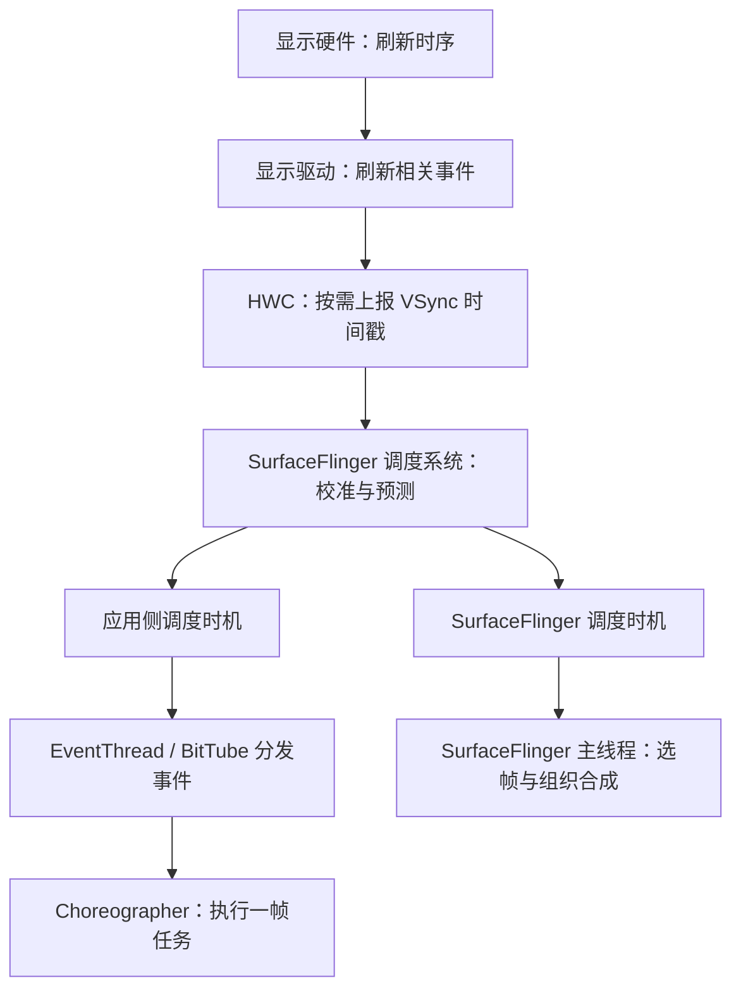

# 消费链路的建立

消费链路的建立，就是让应用提交的 Buffer 有明确的接收图层，让 SurfaceFlinger 知道这个图层应该如何显示，并准备好通往显示硬件的通道。可以分成系统初始化和窗口创建两个阶段。

1. 系统启动：准备合成与显示服务
   开机时，`init` 启动独立的 SurfaceFlinger 进程。SurfaceFlinger 完成初始化、注册 Binder 服务，然后进入事件循环，处理后续的图层更新和显示任务。

2. 窗口创建：建立图层和 Buffer 提交通道

   - 建立图层
     当应用窗口需要显示时，应用通过 ViewRootImpl 与 WindowManagerService（WMS）交互。WMS 管理窗口的布局、层级和可见性，并通过 SurfaceControl 等接口在 SurfaceFlinger 中建立对应的图层关系。

   - Buffer 提交通道

     - **传统 BufferQueue 路径**：SurfaceFlinger 侧建立 BufferQueue，保留消费者端；应用的 Surface 连接生产者端。应用提交后，由 SurfaceFlinger 侧的消费者获取 Buffer。

     - **BLAST 路径**：应用侧建立 BLASTBufferQueue，并将它关联到目标 SurfaceControl。Surface 仍然向 BufferQueue 提交，BLAST 在应用侧获取 Buffer，再通过 Transaction 将 Buffer 和 Fence 提交给 SurfaceFlinger 中的目标 Layer。

3. 链路建立后：每帧复用已有对象
   链路建立后，SurfaceFlinger 已经知道“哪个图层接收内容、图层如何显示、输出到哪个显示设备”。后续帧通常复用这些对象，重复执行 Buffer 提交、调度、锁存、合成、显示和释放，而不是每帧重新创建服务与图层。
   窗口销毁或 Surface 重建等生命周期变化，才可能需要拆除或重新建立相应的图层和提交通道。

# 整体流程

消费者侧的核心任务是：**接收应用提交的 Buffer，把多个窗口的画面合成后送到屏幕，并让用完的 Buffer 可以再次被生产者使用。**

整体流程可以理解为：

**提交 Buffer → 调度与选帧 → 准备图层 → 合成 → 提交显示 → 释放复用**

1. 应用通过 Surface 提交 Buffer。
2. SurfaceFlinger 按照与 VSync 协调的节奏，在有更新需求时选择本轮使用的 Buffer；没有新内容的窗口可以沿用旧 Buffer。
3. 准备图层：SurfaceFlinger 根据窗口的位置、层级、裁剪、透明度和遮挡关系，确定哪些画面参与本轮合成、显示在哪个区域。
4. 合成图层：SurfaceFlinger 与 HWC 协商合成方式，由 GPU、显示硬件或两者共同完成合成。
5. 提交给显示硬件。
6. 归还用完的 Buffer：系统沿消费链路归还 Buffer，并传递释放同步信息。

实际运行中，各帧会交叠执行：屏幕显示上一帧时，SurfaceFlinger 可以处理当前帧，应用同时生产下一帧。

> Hardware Composer（硬件合成器）。 它了解设备的显示硬件能力，负责与 SurfaceFlinger 协商合成方案，并安排后续的硬件合成与显示。

# 生产和消费循环

生产和消费循环，是 Buffer 反复经历 **获取 → 写入 → 提交 → 消费 → 归还 → 复用** 的过程。应用不断生产新画面，消费链路使用这些画面完成合成与显示，用完的 Buffer 再交回生产者使用。

## 硬件 VSync 是怎么产生的

硬件 VSync 来自显示硬件自身的刷新时序。 显示硬件按设定的刷新率周期性运行，在帧同步时刻产生事件，通常通过中断通知驱动。

传递路径是：

**显示硬件 → 显示驱动 → HWC → SurfaceFlinger**

例如，固定 **60 Hz** 时，刷新周期约为 **16.67 ms**。HWC 按需将这些同步事件的时间戳上报给 SurfaceFlinger。

## 从硬件时间基准到软件调度

应用绘制与系统合成都需要耗时。为了赶上某次屏幕刷新，系统需要提前安排这些工作：例如先让应用生产 Buffer，再让 SurfaceFlinger 合成，最后赶在目标显示时刻交给硬件。	

下面这张图描述的是时间信号与调度关系，Buffer 的提交另有自己的通道：



## 应用如何跟随这个节奏生产 Buffer

对于普通 View 界面，可以把一次绘制请求理解为以下过程：

1. View 的内容或布局需要更新，ViewRootImpl 向 Choreographer 登记本帧要执行的遍历任务。
2. Choreographer 通过 DisplayEventReceiver 请求下一次 VSync 通知。请求沿 Binder 连接传到 SurfaceFlinger 侧，表示这个应用需要一次帧回调。
3. 到达应用的调度时机后，EventThread 向已请求事件的连接分发通知，事件通过 BitTube 到达应用，由应用的 Looper 接收。
4. 通知回到 Java 层，Choreographer 发送异步消息，随后执行 `doFrame()`，依次处理输入、动画、遍历绘制等任务。
5. 绘制链路产生并提交 Buffer，交给后续消费流程。

其中，**“请求下一次 VSync”是请求接收一次调度通知**。


## SurfaceFlinger 如何跟随这个节奏消费 Buffer

应用提交新Buffer，此时Buffer存放在BufferQueue里。当Vsync调度时，SurfaceFlinger从中取出buffer处理。

## 多帧如何形成生产消费流水线

不同阶段可以同时处理不同的帧。下面只是连续绘制时的一种简化示意，用来说明并行关系：

| 同一段时间内 | 正在处理的工作 |
| --- | --- |
| 应用 | 生产第 N+1 帧的 Buffer |
| SurfaceFlinger / GPU | 处理第 N 帧的合成工作 |
| 显示硬件 | 显示第 N-1 帧的画面 |

## 没有更新或没赶上刷新时会怎样

- **界面静止**：应用可以不再请求绘制帧回调；当其他图层也没有更新时，SurfaceFlinger 可以跳过不必要的合成，屏幕继续显示已有内容。
- **应用或合成处理过慢**：如果新内容没赶上目标显示时刻，屏幕可能继续显示旧内容，新内容延后呈现；部分过时帧也可能被跳过。
- **Buffer 不够用**：消费者尚未释放足够的 Buffer 时，生产者可能在获取可用 Buffer 的阶段等待，形成背压。
- **刷新率变化**：系统需要调整刷新模型和调度时间预算，所以一帧的间隔不能始终按 16.67 ms 理解。

# Choreographer

Choreographer：编舞者，指对CPU/GPU绘制的指导，收到VSync信号才开始绘制，保证绘制拥有完整的16.6ms。通常应用层不会直接使用Choreographer，而是使用更高级的API，如`View.invalidate()`等，可以通过Choreographer来监控应用的帧率。

## 🌟总结

**登记 Callback → 请求 VSync → 接收事件 → `onVsync()` 发送异步消息 → `doFrame()` → 执行到期 Callback → 遍历回调进入 `performTraversals()`。**

1.   Choreographer是线程单例，一个线程对应一个对象。
2.   Choreographer创建时会创建一个DisplayEventReceiver。DisplayEventReceiver在native层会通过BitTube与SF建立联系，用于监听Vsync信号。
3.   当有绘制请求时通过 postCallback 方法请求下一次 Vsync 信号。
4.   当Vsync信号来临时，会回调 DisplayEventDispatcher 中的 handleEvent 方法。
5.   handleEvent发送一个异步消息（中间会经过native），用来执行doFrame。
6.   doFrame会执行Callback。
7.   这样逻辑就到了ViewRootImpl的performTraversals。

一些结论：

-   只有当 App 注册监听下一个 Vsync 信号后才能接收到 Vsync 到来的回调。如果界面一直保持不变，那么 App 不会去接收每隔 16.6ms 一次的 Vsync 事件，但底层依旧会以这个频率来切换每一帧的画面(也是通过监听 Vsync 信号实现)。即当界面不变时屏幕也会固定每 16.6ms 刷新，但 CPU/GPU 不走绘制流程。
-   当 View 请求刷新时，这个任务并不会马上开始，而是需要等到下一个 Vsync 信号到来时才开始。
-   造成丢帧主要有两个原因：一是遍历绘制 View 树以及计算屏幕数据超过了16.6ms；二是主线程一直在处理其他耗时消息，导致绘制任务迟迟不能开始(同步屏障不能完全解决这个问题)。
-   可通过`Choreographer.getInstance().postFrameCallback()`来监听帧率情况。

## Choreographer实例化

**ViewRootImpl**

```java
// ViewRootImpl在WindowManager.addView时创建
public ViewRootImpl(Context context, Display display) {
    // ...
    mChoreographer = Choreographer.getInstance();
    // ...
}
```

**Choreographer**

```java
private static final ThreadLocal<Choreographer> sThreadInstance =
        new ThreadLocal<Choreographer>() {
    @Override
    protected Choreographer initialValue() {
        Looper looper = Looper.myLooper();
        if (looper == null) {
            throw new IllegalStateException("The current thread must have a looper!");
        }
        Choreographer choreographer = new Choreographer(looper, VSYNC_SOURCE_APP);
        if (looper == Looper.getMainLooper()) {
            mMainInstance = choreographer;
        }
        return choreographer;
    }
};
```

```java
public static Choreographer getInstance() {
    return sThreadInstance.get();
}
```

Choreographer是线程单例，由ThreadLocal实现。

```java
// 默认true
private static final boolean USE_VSYNC = SystemProperties.getBoolean(
            "debug.choreographer.vsync", true);
// VSync事件接收器
private final FrameDisplayEventReceiver mDisplayEventReceiver;

public static final int CALLBACK_INPUT = 0;
public static final int CALLBACK_ANIMATION = 1;
public static final int CALLBACK_INSETS_ANIMATION = 2;
public static final int CALLBACK_TRAVERSAL = 3;

public static final int CALLBACK_COMMIT = 4;
private static final int CALLBACK_LAST = CALLBACK_COMMIT;
private final CallbackQueue[] mCallbackQueues;

private Choreographer(Looper looper, int vsyncSource) {
    mLooper = looper;
    mHandler = new FrameHandler(looper);
    mDisplayEventReceiver = USE_VSYNC
            ? new FrameDisplayEventReceiver(looper, vsyncSource)
            : null;
    mLastFrameTimeNanos = Long.MIN_VALUE;

    // 计算一帧的时间，60帧即16.6ms
    mFrameIntervalNanos = (long)(1000000000 / getRefreshRate());

    mCallbackQueues = new CallbackQueue[CALLBACK_LAST + 1];
    for (int i = 0; i <= CALLBACK_LAST; i++) {
        mCallbackQueues[i] = new CallbackQueue();
    }
    // b/68769804: For low FPS experiments.
    setFPSDivisor(SystemProperties.getInt(ThreadedRenderer.DEBUG_FPS_DIVISOR, 1));
}
```

### callbackType

```java
/**
 * Callback type: Input callback.  Runs first.
 */
public static final int CALLBACK_INPUT = 0;

/**
 * Callback type: Animation callback.  Runs before {@link #CALLBACK_INSETS_ANIMATION}.
 */
public static final int CALLBACK_ANIMATION = 1;

/**
 * Callback type: Animation callback to handle inset updates. This is separate from
 * {@link #CALLBACK_ANIMATION} as we need to "gather" all inset animation updates via
 * {@link WindowInsetsAnimationController#setInsetsAndAlpha(Insets, float, float)} for multiple
 * ongoing animations but then update the whole view system with a single callback to
 * {@link View#dispatchWindowInsetsAnimationProgress} that contains all the combined updated
 * insets.
 * <p>
 * Both input and animation may change insets, so we need to run this after these callbacks, but
 * before traversals.
 * <p>
 * Runs before traversals.
 * @hide
 */
public static final int CALLBACK_INSETS_ANIMATION = 2;

/**
 * Callback type: Traversal callback.  Handles layout and draw.  Runs
 * after all other asynchronous messages have been handled.
 * @hide
 */
public static final int CALLBACK_TRAVERSAL = 3;

/**
 * Callback type: Commit callback.  Handles post-draw operations for the frame.
 * Runs after traversal completes.  The {@link #getFrameTime() frame time} reported
 * during this callback may be updated to reflect delays that occurred while
 * traversals were in progress in case heavy layout operations caused some frames
 * to be skipped.  The frame time reported during this callback provides a better
 * estimate of the start time of the frame in which animations (and other updates
 * to the view hierarchy state) actually took effect.
 * @hide
 */
public static final int CALLBACK_COMMIT = 4;

private static final int CALLBACK_LAST = CALLBACK_COMMIT;
```

这四种类型的任务存入对应类型的CallbackQueue中，每当收到VSYNC信号时，Choreographer将按顺序处理这些类型的任务。

### FrameHandler

FrameHandler用来处理异步消息：

```java
private final class FrameHandler extends Handler {
    public FrameHandler(Looper looper) {
        super(looper);
    }

    @Override
    public void handleMessage(Message msg) {
        switch (msg.what) {
            case MSG_DO_FRAME:
                doFrame(System.nanoTime(), 0);
                break;
            case MSG_DO_SCHEDULE_VSYNC:
                doScheduleVsync();
                break;
            case MSG_DO_SCHEDULE_CALLBACK:
                doScheduleCallback(msg.arg1);
                break;
        }
    }
}
```

### 小结

1.   Choreographer是线程单例，一个线程对应一个对象。
2.   Choreographer内部的FrameHandler处理异步消息。

## Vsync信号注册

### FrameDisplayEventReceiver

mDisplayEventReceiver 是 FrameDisplayEventReceiver 类型的实例，在Choreographer构造方法中实例化，其父类为 DisplayEventReceiver。

```java
private final class FrameDisplayEventReceiver extends DisplayEventReceiver
        implements Runnable {
    // ....

    public FrameDisplayEventReceiver(Looper looper, int vsyncSource) {
        super(looper, vsyncSource, CONFIG_CHANGED_EVENT_SUPPRESS);
    }

    @Override
    public void onVsync(long timestampNanos, long physicalDisplayId, int frame) {
        // ...
        Message msg = Message.obtain(mHandler, this);
        msg.setAsynchronous(true);
        mHandler.sendMessageAtTime(msg, timestampNanos / TimeUtils.NANOS_PER_MS);
    }

    @Override
    public void run() {
        mHavePendingVsync = false;
        doFrame(mTimestampNanos, mFrame);
    }
}
```

### DisplayEventReceiver

```java
public abstract class DisplayEventReceiver {
	// ....

    public DisplayEventReceiver(Looper looper, int vsyncSource, int configChanged) {
        if (looper == null) {
            throw new IllegalArgumentException("looper must not be null");
        }

        mMessageQueue = looper.getQueue();
        mReceiverPtr = nativeInit(new WeakReference<DisplayEventReceiver>(this), mMessageQueue, vsyncSource, configChanged);

        mCloseGuard.open("dispose");
    }

    private static native long nativeInit(WeakReference<DisplayEventReceiver> receiver, MessageQueue messageQueue, int vsyncSource, int configChanged);
}
```

### nativeInit

nativeInit是一个native方法，其实现在`frameworks/base/core/jni/android_view_DisplayEventReceiver.cpp`中：

```c++
static jlong nativeInit(JNIEnv* env, jclass clazz, jobject receiverWeak, jobject messageQueueObj, jint vsyncSource, jint eventRegistration) {
    sp<MessageQueue> messageQueue = android_os_MessageQueue_getMessageQueue(env, messageQueueObj);
    // ...
    sp<NativeDisplayEventReceiver> receiver =
            new NativeDisplayEventReceiver(env, receiverWeak, messageQueue, vsyncSource, eventRegistration);
    status_t status = receiver->initialize();
    // ...
    receiver->incStrong(gDisplayEventReceiverClassInfo.clazz); // retain a reference for the object
    return reinterpret_cast<jlong>(receiver.get());
}
```

```c++
status_t DisplayEventDispatcher::initialize() {
    status_t result = mReceiver.initCheck();
    // 。。。
	int rc = mLooper->addFd(mReceiver.getFd(), 0, Looper::EVENT_INPUT, this, NULL);
    // 。。。
    return OK;
}
```

```c++
std::unique_ptr<gui::BitTube> mDataChannel;

int DisplayEventReceiver::getFd() const {
    if (mDataChannel == nullptr) return mInitError.has_value() ? mInitError.value() : NO_INIT;

    return mDataChannel->getFd();
}
```

```c++
DisplayEventReceiver::DisplayEventReceiver(
        ISurfaceComposer::VsyncSource vsyncSource,
        ISurfaceComposer::EventRegistrationFlags eventRegistration) {
    sp<ISurfaceComposer> sf(ComposerService::getComposerService());
    if (sf != nullptr) {
        mEventConnection = sf->createDisplayEventConnection(vsyncSource, eventRegistration);
        if (mEventConnection != nullptr) {
            // 创建BitTube
            mDataChannel = std::make_unique<gui::BitTube>();
            const auto status = mEventConnection->stealReceiveChannel(mDataChannel.get());
            if (!status.isOk()) {
                ALOGE("stealReceiveChannel failed: %s", status.toString8().c_str());
                mInitError = std::make_optional<status_t>(status.transactionError());
                mDataChannel.reset();
                mEventConnection.clear();
            }
        }
    }
}
```

### 小结

1.   Choreographer创建时会创建一个DisplayEventReceiver。
2.   在native的DisplayEventReceiver创建中，会通过BitTube与SF建立联系。
3.   BitTube内部通过socket来实现全双工通讯。在 BitTube 对象中有两个文件描述符：mReceiveFd 和 mSendFd，以及 read 和 write 方法分别用来进行读写操作。
4.   创建完DisplayEventReceiver对象后再初始化。
5.   `mLooper->addFd(mReceiver.getFd(), 0, Looper::EVENT_INPUT, this, NULL)` 用来监听 mReceiver 所获取的文件句柄，当有存在对 Vsync 信号感兴趣的连接且接收到了Vsync 信号时，会发送数据到 mReceiver，然后回调 DisplayEventDispatcher 中的 handleEvent 方法。

## 接收Vsync

### handleEvent

```c++
int DisplayEventDispatcher::handleEvent(int, int events, void*) {
    // ....
    if (processPendingEvents(&vsyncTimestamp, &vsyncDisplayId, &vsyncCount, &vsyncEventData)) {
        ALOGV("dispatcher %p ~ Vsync pulse: timestamp=%" PRId64
              ", displayId=%s, count=%d, vsyncId=%" PRId64,
              this, ns2ms(vsyncTimestamp), to_string(vsyncDisplayId).c_str(), vsyncCount,
              vsyncEventData.preferredVsyncId());
        mWaitingForVsync = false;
        mLastVsyncCount = vsyncCount;
        dispatchVsync(vsyncTimestamp, vsyncDisplayId, vsyncCount, vsyncEventData);
    }

    if (mWaitingForVsync) {
        const nsecs_t currentTime = systemTime(SYSTEM_TIME_MONOTONIC);
        const nsecs_t vsyncScheduleDelay = currentTime - mLastScheduleVsyncTime;
        if (vsyncScheduleDelay > WAITING_FOR_VSYNC_TIMEOUT) {
            ALOGW("Vsync time out! vsyncScheduleDelay=%" PRId64 "ms", ns2ms(vsyncScheduleDelay));
            mWaitingForVsync = false;
            dispatchVsync(currentTime, vsyncDisplayId /* displayId is not used */,
                          ++mLastVsyncCount, vsyncEventData /* empty data */);
        }
    }

    return 1; // keep the callback
}
```

### dispatchVsync

```c++
void NativeDisplayEventReceiver::dispatchVsync(nsecs_t timestamp, PhysicalDisplayId displayId, uint32_t count, VsyncEventData vsyncEventData) {
    JNIEnv* env = AndroidRuntime::getJNIEnv();

    ScopedLocalRef<jobject> receiverObj(env, GetReferent(env, mReceiverWeakGlobal));
    if (receiverObj.get()) {
        ALOGV("receiver %p ~ Invoking vsync handler.", this);

        jobject javaVsyncEventData = createJavaVsyncEventData(env, vsyncEventData);
        env->CallVoidMethod(receiverObj.get(), gDisplayEventReceiverClassInfo.dispatchVsync,
                            timestamp, displayId.value, count, javaVsyncEventData);
        ALOGV("receiver %p ~ Returned from vsync handler.", this);
    }

    mMessageQueue->raiseAndClearException(env, "dispatchVsync");
}
```

通过jni反射调用Java的DisplayEventReceiver的dispatchVsync。

```java
private void dispatchVsync(long timestampNanos, long physicalDisplayId, int frame) {
    onVsync(timestampNanos, physicalDisplayId, frame);
}
```

### onVsync

```java
public void onVsync(long timestampNanos, long physicalDisplayId, int frame) {
    // ...
    mTimestampNanos = timestampNanos;
    mFrame = frame;
    Message msg = Message.obtain(mHandler, this);
    msg.setAsynchronous(true);
    mHandler.sendMessageAtTime(msg, timestampNanos / TimeUtils.NANOS_PER_MS);
}
```

onVsync发送一个异步消息，具体逻辑在FrameDisplayEventReceiver的run中。

```java
public void run() {
    mHavePendingVsync = false;
    doFrame(mTimestampNanos, mFrame);
}
```

**doFrame**

```java
void doFrame(long frameTimeNanos, int frame) {
    final long startNanos;
    synchronized (mLock) {
        // ...

        if (frameTimeNanos < mLastFrameTimeNanos) {
            // ...
            scheduleVsyncLocked();
            return;
        }

        if (mFPSDivisor > 1) {
            long timeSinceVsync = frameTimeNanos - mLastFrameTimeNanos;
            if (timeSinceVsync < (mFrameIntervalNanos * mFPSDivisor) && timeSinceVsync > 0) {
                scheduleVsyncLocked();
                return;
            }
        }

        // ...
    }

    try {
        Trace.traceBegin(Trace.TRACE_TAG_VIEW, "Choreographer#doFrame");
        AnimationUtils.lockAnimationClock(frameTimeNanos / TimeUtils.NANOS_PER_MS);

        mFrameInfo.markInputHandlingStart();
        doCallbacks(Choreographer.CALLBACK_INPUT, frameTimeNanos);

        mFrameInfo.markAnimationsStart();
        doCallbacks(Choreographer.CALLBACK_ANIMATION, frameTimeNanos);
        doCallbacks(Choreographer.CALLBACK_INSETS_ANIMATION, frameTimeNanos);

        mFrameInfo.markPerformTraversalsStart();
        doCallbacks(Choreographer.CALLBACK_TRAVERSAL, frameTimeNanos);

        doCallbacks(Choreographer.CALLBACK_COMMIT, frameTimeNanos);
    } finally {
        AnimationUtils.unlockAnimationClock();
        Trace.traceEnd(Trace.TRACE_TAG_VIEW);
    }

    // ...
}
```

### doCallbacks

```java
void doCallbacks(int callbackType, long frameTimeNanos) {
    CallbackRecord callbacks;
    synchronized (mLock) {
        // 取出小于当前时间的Callback
        final long now = System.nanoTime();
        callbacks = mCallbackQueues[callbackType].extractDueCallbacksLocked(
                now / TimeUtils.NANOS_PER_MS);
        if (callbacks == null) {
            return;
        }
        mCallbacksRunning = true;
		// 。。。
    }
    try {
        Trace.traceBegin(Trace.TRACE_TAG_VIEW, CALLBACK_TRACE_TITLES[callbackType]);
        // 执行Callback
        for (CallbackRecord c = callbacks; c != null; c = c.next) {
            // 。。。
            c.run(frameTimeNanos);
        }
    } finally {
        synchronized (mLock) {
            mCallbacksRunning = false;
            do {
                final CallbackRecord next = callbacks.next;
                recycleCallbackLocked(callbacks);
                callbacks = next;
            } while (callbacks != null);
        }
        Trace.traceEnd(Trace.TRACE_TAG_VIEW);
    }
}
```

1.   取出小于当前时间的Callback，意味着一个Callback只会执行一次。
2.   run Callback。

### 小结

1.   当DisplayEventReceiver接收到Vsync信号时，会发送一个异步消息，用来执行doFrame。
2.   doFrame主要是执行Callback。

## 再看scheduleTraversals

```java
void scheduleTraversals() {
	if (!mTraversalScheduled) {
    	mTraversalScheduled = true;
    	mTraversalBarrier = mHandler.getLooper().getQueue().postSyncBarrier();
    	mChoreographer.postCallback(Choreographer.CALLBACK_TRAVERSAL, mTraversalRunnable, null);
    	notifyRendererOfFramePending();
    	pokeDrawLockIfNeeded();
	}
}
```

### postCallback

```java
public void postCallback(int callbackType, Runnable action, Object token) {
    postCallbackDelayed(callbackType, action, token, 0);
}

public void postCallbackDelayed(int callbackType, Runnable action, Object token, long delayMillis) {
    // ...
    postCallbackDelayedInternal(callbackType, action, token, delayMillis);
}

private void postCallbackDelayedInternal(int callbackType, Object action, Object token, long delayMillis) {
    synchronized (mLock) {
        final long now = SystemClock.uptimeMillis();
        final long dueTime = now + delayMillis;
        // 对应类型的CallbackQueue添加Callback
        mCallbackQueues[callbackType].addCallbackLocked(dueTime, action, token);

        if (dueTime <= now) {
            // 立即执行
            scheduleFrameLocked(now);
        } else {
            Message msg = mHandler.obtainMessage(MSG_DO_SCHEDULE_CALLBACK, action);
            msg.arg1 = callbackType;
            msg.setAsynchronous(true);
            // handleMessage会调用doScheduleCallback(msg.arg1)方法
            mHandler.sendMessageAtTime(msg, dueTime);
        }
    }
}

void doScheduleCallback(int callbackType) {
    synchronized (mLock) {
        if (!mFrameScheduled) {
            final long now = SystemClock.uptimeMillis();
            if (mCallbackQueues[callbackType].hasDueCallbacksLocked(now)) {
                scheduleFrameLocked(now);
            }
        }
    }
}
```

可以看到延迟与否都会调用 scheduleFrameLocked 方法。

```java
private void scheduleFrameLocked(long now) {
    if (!mFrameScheduled) {
        mFrameScheduled = true;
        // Android 4.1后默认开启
        if (USE_VSYNC) {
            // Looper.myLooper() == mLooper
            if (isRunningOnLooperThreadLocked()) {
                // 当前执行的线程是mLooper所在线程
                scheduleVsyncLocked();
            } else {
                // 否则通过handleMessage会调用doScheduleVsync方法
                Message msg = mHandler.obtainMessage(MSG_DO_SCHEDULE_VSYNC);
                msg.setAsynchronous(true);
                mHandler.sendMessageAtFrontOfQueue(msg);
            }
        } else {
            // private static final long DEFAULT_FRAME_DELAY = 10;
            // private static volatile long sFrameDelay = DEFAULT_FRAME_DELAY;
            final long nextFrameTime = Math.max(mLastFrameTimeNanos / TimeUtils.NANOS_PER_MS + sFrameDelay, now);
            // 会调用doFrame(System.nanoTime(), 0)方法
            Message msg = mHandler.obtainMessage(MSG_DO_FRAME);
            msg.setAsynchronous(true);
            mHandler.sendMessageAtTime(msg, nextFrameTime);
        }
    }
}

void doScheduleVsync() {
    synchronized (mLock) {
        if (mFrameScheduled) {
            scheduleVsyncLocked();
        }
    }
}

private void scheduleVsyncLocked() {
    mDisplayEventReceiver.scheduleVsync();
}
```

### scheduleVsync

```java
public void scheduleVsync() {
    if (mReceiverPtr == 0) {
        // ...
    } else {
        nativeScheduleVsync(mReceiverPtr);
    }
}
```

```c++
status_t DisplayEventDispatcher::scheduleVsync() {
    if (!mWaitingForVsync) {
        // ....
        status_t status = mReceiver.requestNextVsync();
        // ...
    }
    return OK;
}
```

scheduleVsync方法用来请求接收下一次 Vsync 信号，可以唤醒 EventThread 线程，等到 Vsync 信号到来后回调给 APP。

### 小结

ViewRootImpl的scheduleTraversals方法会post一个TraversalRunnable，同时请求接收下一次 Vsync 信号。
