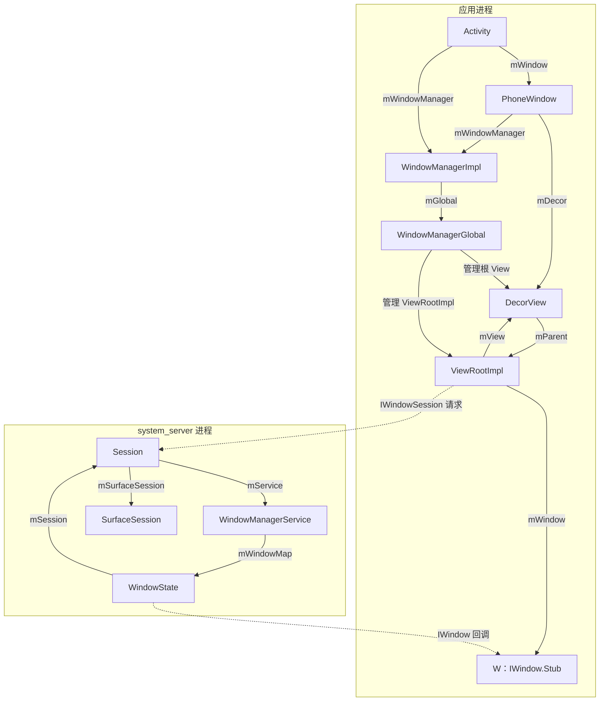
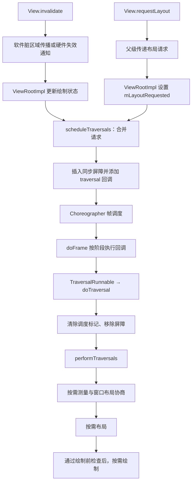
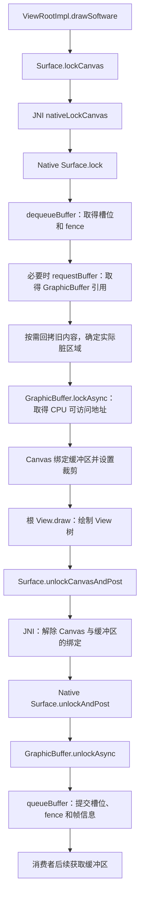
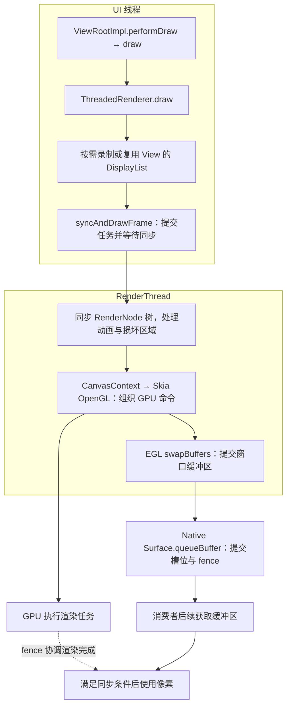

# Activity 窗口与 View 树的建立

Window与View树的建立流程：

**Window**

在Activity启动时会创建 PhoneWindow 并关联 WindowManager，发生在 `onCreate()` 之前。

- WindowManager的类型是WindowManagerImpl，但是具体逻辑是WindowManagerGlobal实现的，WindowManagerGlobal是一个单例。

**DecorView**

一般在Activity的onCreate方法中setContentView，setContentView会懒加载创建一个DecorView，即使没有创建，在ActivityThread的handleResumeActivity中也会创建，并将添加到WindowManager中。

**ViewRootImpl**

1.  在WindowManagerGlobal的addView方法中，会创建ViewRootImpl。

    - ViewRootImpl通过WindowSession和WMS建立联系。

2.  addView内部会调用setView：保存 DecorView、请求首次遍历、向 WMS 添加窗口，以及建立根 View 的 parent 和输入接收关系。

3.  在WMS中会为这个添加的Window分配Surface，而WMS会将它所管理的Surface交由SurfaceFlinger处理，SurfaceFlinger会将这些Surface混合并绘制到屏幕上。

4.  ViewRootImpl主要做这些事：

    -   View树的根并管理View树。

    -   触发View的测量、布局和绘制。

    -   输入事件的中转站。

    -   管理Surface。

    -   负责与WMS进行进程间通信。

# 绘制请求与遍历调度

1.   invalidate 请求更新绘制内容（软件脏区域传播或硬件失效通知），requestLayout 请求重新测量和布局。最终会调用scheduleTraversals。
2.   scheduleTraversals做了两件事：
     1. 在主线程消息循环放置一个同步屏障，用于优先处理Handler异步消息。
     2. 向 Choreographer 注册 traversal 回调（TraversalRunnable）。而Choreographer的回调由VSync驱动。
3.   TraversalRunnable会移除同步屏障（通过一个token标识）并且调用performTraversals。
4.   performTraversals 会依次按需执行 measure、layout、draw，并非每次都完整执行三个阶段。
     - 最常见的例子是：只调用 `invalidate()`，布局和尺寸都没变时，通常跳过 measure、layout，只执行 draw。 
5.   提交绘制工作完成后，距离 SurfaceFlinger 合成、显示设备呈现这一帧仍有后续流程。

# 软件绘制

1.   创建 `ViewRootImpl` 时，通过 `new Surface()` 初始化 `mSurface`，此时只是空的 Java 对象，还不能绘制。
2.   入口方法：performTraversals
3.   首次遍历、窗口参数发生变化时，调用`relayoutWindow`，ViewRootImpl从WMS获取/复用Surface。
     - 准备新的Surface：尚无/旧的Surace已销毁。
     - 复用：已有 Surface 仍可使用。
4.   performTraversals -> performDraw -> draw -> drawSoftware。drawSoftware的主要流程：
     1. `lockCanvas()` 
     2. `mView.draw(canvas)` 
     3. `unlockCanvasAndPost()`
5.   `lockCanvas()` 获取本次可写的 GraphicBuffer（图形缓存区），并返回与其像素存储关联的软件 Canvas。缓冲区可以复用，不是每帧都新建。
     - 局部重绘时，系统可能从上次提交的缓冲区回拷需要保留的内容；无法保留时会扩大脏区域，要求调用方重绘。
6.   `mView.draw(canvas)` 从 DecorView 开始绘制 View 树。背景、自身内容、子 View 和前景分别由不同步骤处理。
7.   `unlockCanvasAndPost()` 解除 Canvas 绑定、结束 CPU 对缓冲区的访问，并通过生产者接口提交缓冲区。它不等于销毁 GraphicBuffer 或释放其像素内存。
8.   提交成功后，消费者才能在后续流程中获取并使用这一帧；提交返回不代表屏幕已经显示，也不保证每个提交帧最终都会呈现。

> 补充：局部重绘。
>
> 本次取到的缓冲区，可能保存着更早一帧的内容。
>
> 什么时候会局部重绘？
> 只有部分画面需要更新，且没有全量重绘要求时。例如，一个按钮变色后调用 `invalidate()`，软件绘制路径将失效区域汇总到窗口的脏区域，最终传给 `lockCanvas(dirty)`。假设上次提交的是缓冲区 A，本次取到的是 B：
>
> - 本次只准备重绘按钮区域。
> - B 的按钮外区域可能仍是旧内容。
> - 系统从 A 回拷这些已经过时、但本次不会重绘的区域，再让应用绘制按钮。
>
> 这样，B 才能形成完整、正确的新一帧。局部重绘省去的是部分重新绘制工作，但可能增加回拷工作。
>
> 
>
> 什么时候无法保留？
> 以下情况不能通过这条路径保留旧内容：
>
> - 没有上次提交的缓冲区，例如首次绘制。
> - 新旧缓冲区宽高不同，例如窗口调整大小后。
> - 新旧缓冲区像素格式不同。

# 硬件绘制

整体是这样的：

1. ThreadedRenderer是ViewRootImpl的Java入口，负责组织绘制
2. RenderNode保存绘制属性及 DisplayList；各 View 有自己的节点，渲染器还有一个外层根节点（RootRenderNode）
3. RenderThread负责具体的渲染

具体流程：

1. RenderThread启动时机：`ActivityThread.handleLaunchActivity()`。早于 Activity 的 `onCreate()`，也早于首次绘制。
2. 在ViewRootImpl通过setView添加DecorView的时候会开启硬件绘制并创建ThreadedRenderer。
3. 在ThreadedRenderer初始化期间，会创建一个RootRenderNode，用来表示RenderNode的根节点。
4. invalidate 请求更新绘制内容（软件脏区域传播或硬件失效通知），requestLayout 请求重新测量和布局。最终会调用performTraversals。
   - `performTraversals()` 按需调用 `relayoutWindow()` 获取或复用窗口 Surface，
5. 进入硬件绘制：`performTraversals → performDraw → draw → ThreadedRenderer.draw`。主要做两件事情：
   1. `updateRootDisplayList()` 完成 UI 线程上的绘制记录。从 DecorView 开始按需更新 DisplayList。
   2. `syncAndDrawFrame()` 提交渲染任务。将任务投递到 RenderThread，UI 线程等待必要的同步（UI线程至少会等待状态同步，可能会等待绘制）。
6. 进入RenderThread：
   1. 同步状态：同步 RenderNode 属性和 DisplayList
   2. 取得可用 buffer，确定重绘区域
   3. 组织 GPU 渲染：Skia 回放 DisplayList，生成并提交 GPU 命令，由 GPU 绘制像素。
   4. 提交 buffer

# Choreographer

**登记 Callback → 请求 VSync → 接收事件 → `onVsync()` 发送异步消息 → `doFrame()` → 执行到期 Callback → 遍历回调进入 `performTraversals()`。**

1.   Choreographer是线程单例，一个线程对应一个对象。
2.   Choreographer创建时会创建一个DisplayEventReceiver。DisplayEventReceiver在native层会通过BitTube与SF建立联系，用于监听Vsync信号。
3.   当有绘制请求时通过 postCallback 方法请求下一次 Vsync 信号。
4.   当Vsync信号来临时，会回调 DisplayEventDispatcher 中的 handleEvent 方法。
5.   handleEvent发送一个异步消息（中间会经过native），用来执行doFrame。
6.   doFrame会执行Callback。
7.   这样逻辑就到了ViewRootImpl的performTraversals。

一些结论：

-   只有当 App 注册监听下一个 Vsync 信号后才能接收到 Vsync 到来的回调。如果界面一直保持不变，那么 App 不会去接收每隔 16.6ms 一次的 Vsync 事件，但底层依旧会以这个频率来切换每一帧的画面(也是通过监听 Vsync 信号实现)。即当界面不变时屏幕也会固定每 16.6ms 刷新，但 CPU/GPU 不走绘制流程。
-   当 View 请求刷新时，这个任务并不会马上开始，而是需要等到下一个 Vsync 信号到来时才开始。
-   造成丢帧主要有两个原因：一是遍历绘制 View 树以及计算屏幕数据超过了16.6ms；二是主线程一直在处理其他耗时消息，导致绘制任务迟迟不能开始(同步屏障不能完全解决这个问题)。
-   可通过`Choreographer.getInstance().postFrameCallback()`来监听帧率情况。

# 生产和消费循环

生产和消费循环，是 Buffer 反复经历 **获取 → 写入 → 提交 → 消费 → 归还 → 复用** 的过程。应用不断生产新画面，消费链路使用这些画面完成合成与显示，用完的 Buffer 再交回生产者使用。

Vsync信号是怎么产生的：硬件 VSync 来自显示硬件自身的刷新时序。 显示硬件按设定的刷新率周期性运行，在帧同步时刻产生事件，通常通过中断通知驱动。
