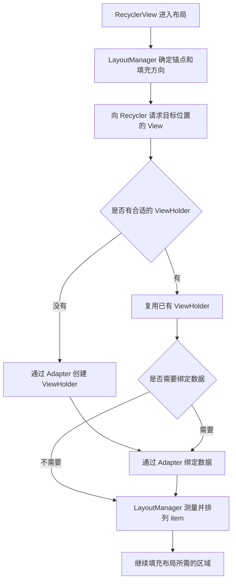

# 面试开场总结

> 我理解 RecyclerView 的核心，就是用有限的 View 展示大量数据。使用时，Adapter 负责创建 ViewHolder 和绑定数据，LayoutManager 负责排列、滚动和决定哪些 View 可以回收，Recycler 负责管理复用。比如列表往上滑，离开屏幕的 View 不一定马上销毁，后面可以拿来展示其他数据，省掉重复创建布局的开销。这里要区分两种情况：如果找回的是同一条数据对应、而且仍然有效的缓存，可能连绑定都省了；如果只是从回收池拿到同类型的 ViewHolder，还是需要重新绑定。数据更新时，我一般会用 ListAdapter 配合 DiffUtil，只更新变化的部分；像收藏状态这种小变化，还可以通过 payload 做局部绑定。实际排查问题时，我会重点看绑定是否完整、点击时的位置是否有效，以及创建、绑定和布局哪个环节耗时，而不是一上来就把缓存调大。

这段可以作为约一分钟的回答，再根据追问展开。核心概念依据 [RecyclerView 官方使用指南](https://developer.android.com/develop/ui/views/layout/recyclerview)和 [Recycler API](https://developer.android.com/reference/androidx/recyclerview/widget/RecyclerView.Recycler)；缓存、更新和性能的细节见后文。

# 常见考点与复习顺序

公开面经和题目整理中可以看到：RecyclerView 与 ListView 的区别、回收复用、局部刷新、图片错位、分页与性能优化等题目。[面经中的 RecyclerView 题目示例](https://www.nowcoder.com/discuss/353159414964232192)

下表结合这些题型和知识依赖安排复习顺序。**星级是面试准备的经验优先级，不是对所有公司、年份的出现频率统计**：🌟🌟🌟 为高频重点，🌟🌟 为一般频率，🌟 为低频进阶。

| 优先级 | 知识点 | 至少要讲清楚的内容 |
| --- | --- | --- |
| 🌟🌟🌟 | 基本使用与职责划分 | Adapter、ViewHolder、LayoutManager、Recycler 各做什么 |
| 🌟🌟🌟 | 与 ListView 的区别 | 两者都能复用；RecyclerView 的优势在职责拆分和扩展能力 |
| 🌟🌟🌟 | 缓存与复用机制 | Scrap、Cache、Pool 的用途；复用 View 与复用绑定结果的区别 |
| 🌟🌟🌟 | 数据刷新 | `notifyDataSetChanged()`、精确通知、DiffUtil、payload 的关系 |
| 🌟🌟🌟 | 状态错乱与点击错位 | 完整绑定、业务 ID、异步请求竞态、`NO_POSITION` |
| 🌟🌟🌟 | 滑动性能 | 创建、绑定、布局、绘制、GC 分别如何定位与优化 |
| 🌟🌟 | 布局和滚动过程 | LayoutManager 向 Recycler 要 View，填充与回收如何配合 |
| 🌟🌟 | 多类型、嵌套列表 | `viewType`、ConcatAdapter、共享 Pool 的前提 |
| 🌟🌟 | 刷新一致性与状态恢复 | 数据和通知一致，异步列表提交，恢复滚动位置 |
| 🌟 | 预取与动画细节 | GapWorker、预布局、ItemAnimator 的作用边界 |

建议先读基础使用，再重点读缓存和数据更新，最后练习故障分析。源码部分以 **AndroidX RecyclerView** 为对象，资料核对日期为 **2026-09-12**；内部字段、默认容量及调用细节参考所链接的 `androidx-main` 源码，不视为所有版本都不变的 API 承诺。

# 基础使用与组件分工

## 核心组件

- `RecyclerView`：列表容器，协调布局、滚动、更新、动画与复用
- `ViewHolder`：列表Item的view实现
  - 多种 item：重写 `getItemViewType(position)`，按类型创建兼容的 ViewHolder，并在绑定时处理对应数据。
- `Adapter`：提供数量、类型，创建 ViewHolder，并把数据绑定到 View。

## 基本使用

略，只介绍一些不常见但感觉重要的。

### Adapter 组合使用

头部、内容、尾部由独立 Adapter 管理时，可以组合：

```kotlin
// headerAdapter、contentAdapter、footerAdapter 均为已实现的 Adapter。
recyclerView.adapter = ConcatAdapter(
    headerAdapter, contentAdapter, footerAdapter
)
```

ConcatAdapter 默认隔离子 Adapter 的 viewType，以避免类型冲突；只有确认布局、Holder 和绑定约定兼容时，才考虑关闭隔离。[ConcatAdapter API](https://developer.android.com/reference/androidx/recyclerview/widget/ConcatAdapter)


# 🌟 RecyclerView 和 ListView 区别

**两者都支持 View 复用**，RecyclerView 的主要优势是扩展能力更强：

- **布局**：ListView 主要是纵向列表；RecyclerView 通过 LayoutManager 支持横向、网格、瀑布流等布局。
- **ViewHolder**：ListView 通常需要开发者自行采用；RecyclerView 将其直接纳入 Adapter API。
- **刷新**：RecyclerView 支持增删、移动和局部刷新，配合 DiffUtil、payload 可以减少无效绑定。
- **扩展**：RecyclerView 将布局、动画、分割线分别交给独立组件，复杂列表更容易实现和维护。

**现在主流使用 RecyclerView，是因为它更适合复杂、多样、频繁更新的列表需求**，相关工具也更完善；并不是简单换上它就一定比 ListView 快。

# 布局、滚动与缓存复用原理

## 🌟🌟 一个 item 是怎样出现在屏幕上的？

以 LinearLayoutManager 的普通列表为例，可以把主干流程理解为：



读源码时先抓这条主线：`RecyclerView` 的布局分发 → `LinearLayoutManager.onLayoutChildren()` → `fill()` / `layoutChunk()` → `Recycler.getViewForPosition()`。LayoutManager 根据剩余空间决定是否继续获取 item，而不是先为全部数据创建 View。[LinearLayoutManager 源码](https://raw.githubusercontent.com/androidx/androidx/androidx-main/recyclerview/recyclerview/src/main/java/androidx/recyclerview/widget/LinearLayoutManager.java)

普通、有明确可视区域的列表主要布局屏幕附近的 item，但预取、额外布局空间、动画和测量方式都可能增加持有数量。**“一屏显示 10 条，所以一定只创建 10 个 Holder”不成立。**

## 🌟🌟 滑动时为什么不用重新创建整个列表？

用户拖动或者惯性滚动时，RecyclerView 将需要消耗的滚动距离交给 LayoutManager。LinearLayoutManager 会结合滚动方向填充将要出现的区域，移动已有子 View，并回收不再需要的 View；到数据边界时，只消耗实际能滚动的距离。[LayoutManager API](https://developer.android.com/reference/androidx/recyclerview/widget/RecyclerView.LayoutManager)

例如屏幕上显示 A～F，继续向下浏览会需要 G：Recycler 可能找到同类型的旧 Holder 来展示 G，也可能新建一个。A 离开后可能仍留在本地缓存里，方便立即反向滚动。因此，**不能假设刚离屏的 A 一定立刻被 G 使用**。

## 🌟🌟🌟 RecyclerView 的“四级缓存”具体是什么？

面试资料常用“四级缓存”概括下面四类机制，但源码并不是四个同性质的缓存按固定流水线依次存取。

| 机制                                     | 主要用途                                                | 如何理解复用                                      |
| ---------------------------------------- | ------------------------------------------------------- | ------------------------------------------------- |
| Scrap：`mAttachedScrap`、`mChangedScrap` | 布局期间暂存已有 Holder，变化项还可能涉及动画处理       | 尽量找回当前布局需要的 Holder，是否重绑取决于状态 |
| 本地 Cache：`mCachedViews`               | 保留离屏但仍有效的 Holder，方便短距离往返               | 保留绑定关系，合适且未变脏时可直接使用            |
| `ViewCacheExtension`                     | 开发者提供的额外缓存查找入口，默认未设置                | 由开发者管理，不是框架自动维护的一层通用缓存      |
| `RecycledViewPool`                       | 按 viewType 存放可供重新使用的 Holder，可由多个列表共享 | 主要复用视图结构，取出后需要绑定目标数据          |

Scrap 更像**一次布局中的临时工作区**；Cache 更像**最近离屏、还保留原数据关系的 View**；Pool 更像**按结构分类、等着装入新内容的 View**。[Recycler API](https://developer.android.com/reference/androidx/recyclerview/widget/RecyclerView.Recycler)、[ViewCacheExtension API](https://developer.android.com/reference/androidx/recyclerview/widget/RecyclerView.ViewCacheExtension)、[RecycledViewPool API](https://developer.android.com/reference/androidx/recyclerview/widget/RecyclerView.RecycledViewPool)

### 获取 ViewHolder 的查找顺序

所链接源码中的 `tryGetViewHolderForPositionByDeadline()` 主干如下，省略状态校验失败、位置映射和预取超时等分支：

```text
如果是预布局，先尝试 ChangedScrap
    ↓ 未找到
按位置查 AttachedScrap → 隐藏的子 View → CachedViews
    ↓ 未找到
若启用 stable IDs，再按 itemId 与 viewType 查 Scrap / Cache
    ↓ 未找到
询问 ViewCacheExtension（如果设置了）
    ↓ 未找到
从 RecycledViewPool 按 viewType 获取
    ↓ 未找到
Adapter 创建 ViewHolder
    ↓
根据绑定标记等状态，决定是否调用 Adapter 绑定数据
```

隐藏的子 View 常与动画等内部管理有关，不应再机械地算成一个“第几级缓存”。面试回答清楚**按位置或身份找原来的 Holder，找不到再按类型找可用结构**，比死背层数更重要。[RecyclerView 源码](https://raw.githubusercontent.com/androidx/androidx/androidx-main/recyclerview/recyclerview/src/main/java/androidx/recyclerview/widget/RecyclerView.java)

### 回收方向与默认数量

对于可回收的 Holder，满足本地缓存条件时可以进入 Cache；缓存空间不足时会把其中的 Holder 移交 Pool。不适合进入 Cache 的可回收 Holder 也可能直接进入 Pool，并不是都要先经过 Scrap 和 Cache。正在使用、不可回收或处于某些动画状态的 Holder 另有处理。

核对的源码中，本地 Cache 的基础默认容量是 **2**，实际容量还会考虑 LayoutManager 观察到的预取数量；Pool 默认对**每一种 viewType**保留最多 **5** 个 Holder。这是实现默认值，不是整个 RecyclerView 只能保存 2 个或 5 个 View，也不是推荐的统一调优值。[RecyclerView 缓存源码](https://raw.githubusercontent.com/androidx/androidx/androidx-main/recyclerview/recyclerview/src/main/java/androidx/recyclerview/widget/RecyclerView.java)

## 🌟🌟🌟 命中缓存后还会调用 onBindViewHolder() 吗？

**可能调用，关键看拿到的 Holder 是否已经代表当前数据且仍然有效。**

| 场景                                             | 是否创建 Holder | 是否绑定数据                    |
| ------------------------------------------------ | --------------- | ------------------------------- |
| 找回同一数据对应、已经绑定且有效的 Scrap / Cache | 不需要          | 通常可以跳过                    |
| 找到的 Holder 标记为需要更新，且通过了相应校验   | 不需要          | 需要，可能是全量或 payload 绑定 |
| 从 Pool 拿到同类型 Holder                        | 不需要          | 需要绑定目标数据                |
| 各处都没有合适的 Holder                          | 需要            | 创建后需要绑定                  |

Pool 重置的是框架维护的 Holder 状态，**不会帮业务代码把所有 TextView、CheckBox、图片或透明度恢复成正确值**。旧内容可能仍留在 View 上，所以重新绑定必须覆盖当前 item 的所有可变展示状态。

源码在常规路径会检查 `isBound()`、`needsUpdate()`、`isInvalid()` 等状态，预布局又有保留旧状态的特殊分支。因此，“前两级永远不 bind，后两级永远 bind”过于绝对。[RecyclerView 绑定判断源码](https://raw.githubusercontent.com/androidx/androidx/androidx-main/recyclerview/recyclerview/src/main/java/androidx/recyclerview/widget/RecyclerView.java)

## 🌟🌟 缓存设置是不是越大越好？setHasFixedSize 又是什么意思？

| API                                 | 控制的内容                                          | 使用边界                                             |
| ----------------------------------- | --------------------------------------------------- | ---------------------------------------------------- |
| `setItemViewCacheSize(n)`           | 当前列表的离屏本地缓存                              | 增大后可能减少往返滚动的绑定，但增加 View 和资源占用 |
| `pool.setMaxRecycledViews(type, n)` | Pool 中某种类型的最大数量                           | 减少同类型创建机会，不会自动免除重新绑定             |
| `setRecycledViewPool(pool)`         | 使用指定的回收池                                    | 多个列表共享时，类型和 Holder 必须兼容               |
| `setHasFixedSize(true)`             | 声明 Adapter 内容变化不会影响 RecyclerView 自身尺寸 | 与所有 item 是否等宽等高无关                         |

例如 RecyclerView 的宽高由父布局固定，即使 item 高度不同，也可能适合 `setHasFixedSize(true)`；如果列表高度为随内容变化的 `wrap_content`，就不能随意作这个承诺。[RecyclerView API](https://developer.android.com/reference/androidx/recyclerview/widget/RecyclerView)

缓存调优要结合回滑比例、item 内存、viewType 分布和创建耗时。简单把全部数据都缓存起来，会削弱列表按需创建的意义。

# 草稿

## RecyclerView

adapter的几个重要方法：

```java
//创建ViewHolder实例的，viewType由getItemViewType提供
public RecyclerView.ViewHolder onCreateViewHolder(ViewGroup parent， int viewType) {}

public int getItemViewType(int position) {}

//对RecyclerView子项的数据进行赋值，每个子项在滚动到屏幕的时候会执行。
@Override
public void onBindViewHolder(RecyclerView.ViewHolder holder， int position) {}

//一共有多少子项
@Override
public int getItemCount() {}
```

## RecyclerView和ListView的区别

**相同点：**

1.  都可以通过ViewHolder来复用视图。

2.  都是以列表的方式展示大量相似布局的视图。

**不同点：**

1.  在ListView中，ViewHolder不是必须的。而在RecyclerView中ViewHolder变成了必须。
2.  Item 回收/复用方面：ListView是以convertView 作为回收单位，需要手动添加ViewHolder ，而RecyclerView则是以ViewHolder作为回收单位，convertView 被内置到了ViewHolder 中作为 ViewHolder 的成员变量。
3.  ListView只能在垂直方向上滚动。RecyclerView支持水平和竖直方向、交叉网格风格，支持网格展示，可以水平或者竖直滚动。
4.  RecyclerView.ItemAnimator则被提供item添加、删除或移动时的动画效果。

5.  在ListView中如果想要在item之间添加间隔符，只需要在布局文件中对ListView添加如下属性即可：

```xml
android:divider="@android:color/transparent"
android:dividerHeight="5dp"
```

RecyclerView需要通过ItemDecoration来进行。

## RecyclerView图片错乱问题

### 问题产生原因

根本原因：因为ViewHolder的重用机制，每一个item在移出屏幕后都会被重新使用以节省资源，避免滑动卡顿。

**场景A：**

1.  第一次进入页面，RecyclerView载入，不做任何触摸操作
2.  Adapter经过onCreateViewHolder创建当前显示给用户的N个ViewHolder对象，并且在onBindViewHolder时启动了N条线程加载图片
3.  N张图片全部加载完毕，并且显示到对应的ImageView上
4.  控制屏幕向下滑动，前K个item离开屏幕可视区域，后K个item进入屏幕可视区域
5.  前K个item被回收，重用到后K个item。后K个item显示的图片是前K个item的图片
6.  开启了K条线程，加载后K张图片。等待几秒，后K个item显示的图片突然变成了正确的图片

经过分析可以看出：如果当前网络速度很快，第6个步骤的加载速度在1秒甚至0.5秒内，就会造成人眼看到的图片闪烁问题，后K个item的图片闪了一下变成了正确的图片。

**场景B：**

1.  第一次进入页面，RecyclerView载入，不做任何触摸操作
2.  Adapter经过onCreateViewHolder创建当前显示给用户的N个ViewHolder对象，并且在onBindViewHolder时启动了N条线程加载图片
3.  结果N张图片全部加载完毕，并且显示到对应的ImageView上，但还有1张未加载完(假设是第一张图片未加载完)
4.  控制屏幕向下滑动，前K个item离开屏幕可视区域，后K个item进入屏幕可视区域
5.  前K个item被回收，重用到后K个item。场景A的问题不再说，后K张图片加载完毕(看上去一切正常)
6.  等待几秒，第一张图片终于加载完成，后K个item中的某一个突然从正确的图片(当前positon应该显示的图片)变成不正确的图片(第一个item的图片)

以上过程是场景B，问题出在加载第一张图片的线程T，持有了item1的ImageView对象引用，而这张图片加载速度非常慢，直到item1已经被重用到后面item后，过了一段时间，线程T才把图片一加载出来，并设置到item1的ImageView上，然而线程T并不知道item1已经不存在且已复用成其他item，于是，图片发生错乱了。

**场景C：**

1.  第一次进入页面，RecyclerView载入，不做任何触摸操作
2.  Adapter经过onCreateViewHolder创建当前显示给用户的N个ViewHolder对象，并且在onBindViewHolder时启动了N条线程加载图片
3.  忽略图片加载情况，直接向下滚动，再向上滚动，再向下滚动，来回操作
4.  由于离开了屏幕的item是随机被回收并重用的，所以向下滚动时我们假设item1、item3被回收重用到item9、item10，item2、item4被回收重用到item11、item12
5.  向上滚动时，item9、item12被回收重用到item1、item2，item10、item11被回收重用到item3、item4
6.  多次上下滚动后，停下，最后发现某一个item的图片在不停变化，最后还不一定是正确的图片

以上过程是场景C，问题出现在ViewHolder的回收重用顺序是随机的，回收时会从离开屏幕范围的item中随机回收，并分配给新的item，来回操作数次，就会造成有多条加载不同图片的线程，持有同一个item的ImageView对象，造成最后在同一个item上图片变来变去，错乱更加严重。

### 解决方案

**一、设置占位图**

Glide有两种方法设置占位图

1、直接在链式请求中加placeholder()：

```java
Glide.with(this)
        .load(picUrl)
        .placeholder(R.drawable.ic_loading)
        .into(holder.ivThumb)
```

2、添加监听，在回调方法中设置

```java
Glide.with(mContext)
     .load(picUrl)
     .error(R.drawable.ic_loading)
     .into(new SimpleTarget<GlideDrawable>() {
         @Override
         public void onResourceReady(GlideDrawable glideDrawable, GlideAnimation<? super  GlideDrawable> glideAnimation) {
                     holder.ivThumb.setImageDrawable(glideDrawable);
         }

         @Override
         public void onStart() {
             super.onStart();
             holder.ivThumb.setImageResource(R.drawable.ic_loading);
         }
     });
```

>   以上方法个人觉得不可行，设置占位图似乎不能解决错乱的问题，但这个方法依然保留。

**二、设置TAG**

使用`setTag`方式。但是，Glide图片加载也是使用这个方法，所以需要使用`setTag(key，value)`方式进行设置，取值`getTag(key)`，当异步请求回来的时候对比下tag是否一样，再判断是否显示图片，这里可以将position设置tag。

```java
@Override
public void onBindViewHolder(final VideoViewHolder holder, final int position) {
	holder.thumbView.setTag(R.id.tag_dynamic_list_thumb, position);
	Glide.with(mContext)
		.load(picUrl)
		.error(R.drawable.video_thumb_loading)
		.into(new SimpleTarget<GlideDrawable>() {
			@Override
			public void onResourceReady(GlideDrawable glideDrawable, GlideAnimation<? super GlideDrawable> glideAnimation {
				if (position != (Integer) holder.thumbView.getTag(R.id.tag_dynamic_list_thumb))
					return;
                
				holder.thumbView.setImageDrawable(glideDrawable);
			}

			@Override
            public void onStart() {
            	super.onStart();
           		holder.thumbView.setImageResource(R.drawable.ic_loading);
            }
		});
}
```

**三、在onViewRecycled方法中重置item的ImageView并取消网络请求**

流程：在onBindViewHolder中发起加载请求，然后在view被回收时取消网络请求
代码

```java
@Override
public void onBindViewHolder(VideoViewHolder holder, int position) {
    String istrurl = mImgList.get(position).getImageUrl();
    if (null == holder || null == istrurl || istrurl.equals("")) {
        return;
    }
    Glide.with(mContext)
            .load(picUrl)
            .placeholder(R.drawable.ic_loading)
            .into(holder.thumbView);
}

@Override
public void onViewRecycled(VideoViewHolder holder) {
    if (holder != null) {
        Glide.clear(holder.thumbView);
        holder.thumbView.setImageResource(R.drawable.ic_loading);
    }
    super.onViewRecycled(holder);
}
```


# 数据更新与局部刷新

## 🌟🌟🌟 notifyDataSetChanged() 和精确通知有什么区别？

**通知描述的是数据已经发生了什么变化，它本身不会帮你修改数据源。**

| 通知方式 | 表达的信息 | 适用场景 |
| --- | --- | --- |
| `notifyDataSetChanged()` | 整体数据可能变化，没有明确的变化位置和种类 | 无法给出精确变更时的兜底 |
| `notifyItemInserted(position)` | 某位置新增一条 | 已明确完成一次插入 |
| `notifyItemRemoved(position)` | 某位置删除一条 | 已明确完成一次删除 |
| `notifyItemMoved(from, to)` | 同一条数据改变位置 | 已明确完成一次移动 |
| `notifyItemChanged(position)` | 同一条数据的展示内容变化 | 某 item 需要重新绑定 |
| `notifyItemChanged(position, payload)` | 内容变化，并附带局部更新信息 | 收藏、点赞数等局部变化 |

全量通知会让 RecyclerView 失去精确变更信息，通常需要重新绑定和布局可见项，但**不等于立即为整个数据集重新创建所有 ViewHolder**。稳定 ID 在某些情况下能帮助识别可见项，但不能消除全量通知的全部代价。[Adapter 通知 API](https://developer.android.com/reference/androidx/recyclerview/widget/RecyclerView.Adapter)

手动维护普通 Adapter 时，删除操作应保持数据与通知一致：

```kotlin
// 普通 RecyclerView.Adapter 内部；调用前已确认 position 合法。
// 数据变更与通知在主线程连续执行。
items.removeAt(position)
notifyItemRemoved(position)
```

使用 `ListAdapter` 时，则更新业务状态并 `submitList(newList)`，由差异计算生成通知。不要同时手工发送一套插入删除通知，否则容易把同一次变化报告两遍。

## 🌟🌟🌟 DiffUtil、ListAdapter 和 AsyncListDiffer 有什么关系？

可以把它们理解为三层：

- **DiffUtil**：比较旧列表和新列表，计算增、删、移动、内容变化等更新操作。
- **AsyncListDiffer**：管理列表快照，把需要的 diff 计算调度到后台，再分发更新。
- **ListAdapter**：在 Adapter 基类上封装 AsyncListDiffer，提供 `getItem()`、`submitList()` 等接口。[DiffUtil API](https://developer.android.com/reference/androidx/recyclerview/widget/DiffUtil)、[ListAdapter API](https://developer.android.com/reference/androidx/recyclerview/widget/ListAdapter)

普通列表可直接用 ListAdapter；已有其他 Adapter 基类、需要自己控制位置映射时，可以组合 AsyncListDiffer。DiffUtil 本身不会自动切线程，直接调用 `calculateDiff()` 时要自己安排计算与结果应用。

### 身份相同与内容相同

| 回调 | 判断的问题 | 示例 |
| --- | --- | --- |
| `areItemsTheSame()` | 是否是同一个业务实体 | 文章 ID 是否相同 |
| `areContentsTheSame()` | 同一实体的展示内容是否相同 | 标题、收藏状态是否相同 |
| `getChangePayload()` | 同一实体的内容改变时，能否描述局部差异 | 只改变了收藏状态 |

例如旧数据为 `ArticleUi(7, "原理", false)`，新数据为 `ArticleUi(7, "原理", true)`：身份相同，内容不同，可以只更新收藏状态。若新 ID 是 8，即使标题相同，也不是同一篇文章。

`areContentsTheSame()` 应覆盖影响展示的字段。前文的 data class 全部字段都在主构造函数中，且对应此示例的展示模型，因此可以使用 `==`；复杂模型不能未经检查就照搬。[ItemCallback API](https://developer.android.com/reference/androidx/recyclerview/widget/DiffUtil.ItemCallback)

### 算法需要掌握到的程度

DiffUtil 使用 Myers 差分算法求增删编辑序列，再额外检测移动。官方给出的主要开销是：空间 `O(N)`，预期时间 `O(N + D²)`；其中 N 是两列表元素数之和，D 是增删编辑序列长度。移动检测还会增加与新增数、删除数乘积有关的开销。

如果两份列表按相同规则排序、业务上不存在移动，直接使用 DiffUtil 时可以考虑关闭移动检测。**后台计算不等于没有计算成本**，差异很大、比较函数很慢或提交很频繁时，仍需优化。[DiffUtil 算法说明](https://developer.android.com/reference/androidx/recyclerview/widget/DiffUtil)

## 🌟🌟🌟 为什么原地修改列表后 submitList() 可能不刷新？

常见原因有两个：

1. 提交的仍是同一个 List 对象，AsyncListDiffer 的同引用判断可能直接返回。
2. 虽然创建了新 List，但旧、新列表共享的可变元素已被原地修改，比较时旧快照也看到了新值，失去了差异。

错误思路是“先把原对象改了，再 `toList()` 复制一层集合”；浅拷贝不能恢复被覆盖的旧字段。

正确做法是：**列表作为快照使用，变化的元素创建新对象，未变元素可以共享**。前文的 `map { item.copy(...) }` 就是这种方式。[DiffUtil 不可变数据要求](https://developer.android.com/reference/androidx/recyclerview/widget/DiffUtil)

还要记住三点：

- 列表非空到另一份列表的 diff 通常异步执行；首次插入、清空、同引用提交存在快速路径，不能认为每次提交都会后台计算。
- 连续提交时，AsyncListDiffer 用代次检查丢弃过时结果，但旧计算不一定被立即取消；被新提交覆盖的 commit callback 也不保证执行。
- 这个机制解决的是 diff 结果过期，不是网络响应过期。旧请求晚返回、又被业务层当成最新列表提交，仍可能覆盖界面，应在数据层处理请求版本或取消。[AsyncListDiffer 源码](https://raw.githubusercontent.com/androidx/androidx/androidx-main/recyclerview/recyclerview/src/main/java/androidx/recyclerview/widget/AsyncListDiffer.java)

## 🌟🌟🌟 payload 如何实现局部刷新？需要防哪些坑？

payload 是对变化的补充说明，让 Adapter 有机会只绑定受影响的子 View。例如收藏变化时，不必重新设置标题或发起图片加载。

给前文 `ArticleAdapter` 添加带 payload 的重载，保留原来的全量绑定方法：

```kotlin
override fun onBindViewHolder(
    holder: ArticleHolder,
    position: Int,
    payloads: MutableList<Any>
) {
    if (payloads.isNotEmpty() && payloads.all { it == BOOKMARK_CHANGED }) {
        // 从当前数据读取最终状态，而不是盲目执行“翻转一次”。
        holder.bindBookmark(getItem(position).bookmarked)
    } else {
        // 空 payload 或无法识别的 payload：完整绑定兜底。
        holder.bind(getItem(position))
    }
}
```

再将前文的 companion object 替换为：

```kotlin
companion object {
    private const val BOOKMARK_CHANGED = "bookmark_changed"

    private val DIFF = object : DiffUtil.ItemCallback<ArticleUi>() {
        override fun areItemsTheSame(oldItem: ArticleUi, newItem: ArticleUi) =
            oldItem.id == newItem.id

        override fun areContentsTheSame(oldItem: ArticleUi, newItem: ArticleUi) =
            oldItem == newItem

        override fun getChangePayload(oldItem: ArticleUi, newItem: ArticleUi): Any? {
            return if (oldItem.title == newItem.title &&
                oldItem.bookmarked != newItem.bookmarked
            ) {
                BOOKMARK_CHANGED
            } else {
                null // 标题等其他内容变化时使用完整绑定。
            }
        }
    }
}
```

需要说明的边界：

- 多次通知的 payload 可能合并，因此需要处理整个集合。
- payload **不保证一定送达**；例如对应 View 没有挂载时，payload 可能被丢弃。
- 空 payload 必须完整绑定；局部更新不能替代可靠的数据模型和完整绑定。
- payload 能减少绑定工作，可能缓解刷新闪烁，但是否执行变化动画还受 ItemAnimator 影响。[payload API 约定](https://developer.android.com/reference/androidx/recyclerview/widget/RecyclerView.Adapter)

## 🌟🌟 stable IDs 和 DiffUtil 的身份判断有什么区别？

**stable IDs 是 Adapter 向 RecyclerView 提供稳定身份；`areItemsTheSame()` 是业务向 DiffUtil 提供比较规则。两者相关，但不是同一个开关。**

启用稳定 ID 时，应在 Adapter 挂载前配置 `setHasStableIds(true)`，并让 `getItemId(position)` 返回唯一且随位置变化仍保持不变的业务 ID，例如 `getItem(position).id`。

不要用 position 作为稳定 ID：删除第一条后，后面所有 position 都变了。也不要用可能冲突、或者随内容改变的哈希值冒充稳定身份。

ListAdapter 不要求为了 DiffUtil 而启用 stable IDs，启用 stable IDs 也不会自动计算差异。若两者同时使用，身份语义应保持一致。ConcatAdapter 的稳定 ID 由其 Config 管理，默认不会直接采用子 Adapter 的稳定 ID。[Adapter ID API](https://developer.android.com/reference/androidx/recyclerview/widget/RecyclerView.Adapter)、[ConcatAdapter ID 规则](https://developer.android.com/reference/androidx/recyclerview/widget/ConcatAdapter)

# 状态错乱与常见异常

## 🌟🌟🌟 为什么会出现图片、选中状态或文字错乱？

**同一个 ViewHolder 会绑定不同的数据；任何没被新绑定覆盖的可变状态，都可能把上一条数据的表现带过来。** 可以按同步状态残留和异步结果竞态两类排查。

### 同步状态没有完整覆盖

错误示例只处理收藏为真的情况：

```kotlin
if (item.bookmarked) {
    bookmarkView.visibility = View.VISIBLE
}
```

旧 item 显示收藏标记，新 item 未收藏时没有执行恢复，标记就留了下来。正确写法应覆盖两种状态：

```kotlin
bookmarkView.visibility = if (item.bookmarked) View.VISIBLE else View.GONE
```

同样需要检查文字、图片占位、透明度、背景、展开状态、进度和 CheckBox。选中状态应记录在业务模型或以业务 ID 为 key 的状态集合中，不能只保存在 Holder 里。

绑定 CheckBox 时，应先移除旧监听，再设置 `isChecked`，最后挂上与当前数据关联的监听，避免程序设置状态时误触发旧 item 的回调。点击和异步操作尽量传业务 ID，让状态持有者处理更新。

### 异步结果回到了已经复用的 View

典型过程是：Holder 开始加载 A 的图片 → Holder 改为展示 B → A 的请求晚到 → 把 A 的图片设置给 B。

解决时要在**每次重新绑定**就替换或取消旧请求，并设置当前占位或空图；自定义回调还应校验当前绑定的业务 ID、URL 或请求令牌。检查 ID 之外，若同一 ID 的图片地址也可能变化，还要检查对应请求版本。

这套排查来自复用机制：View 的身份可以不变，代表的数据会变。不能通过“一律不复用”来掩盖绑定缺陷。

## 🌟🌟🌟 点击事件为什么不应该保存 onBindViewHolder() 的 position？

`onBindViewHolder()` 收到的位置只代表绑定时的位置。插入、删除或移动可能改变位置，却不必重新绑定其他内容没有变化的 item，因此监听器闭包里的旧 position 可能失效。

前文示例在**点击发生时**查询 `holder.bindingAdapterPosition`，并检查 `RecyclerView.NO_POSITION`，之后再读取当前数据。[ViewHolder 位置 API](https://developer.android.com/reference/androidx/recyclerview/widget/RecyclerView.ViewHolder)

| 位置 API | 适合的用途 |
| --- | --- |
| `bindingAdapterPosition` | 相对实际绑定该 Holder 的 Adapter；子 Adapter 读取自己的数据常用它 |
| `absoluteAdapterPosition` | 相对 RecyclerView 顶层 Adapter；ConcatAdapter 中包含前面子 Adapter 的偏移 |
| `layoutPosition` | 最近一次布局计算中的位置；主要用于布局相关逻辑 |

item 已删除、Holder 已回收，或全量通知后新布局尚未完成等情况下，可能拿到 `NO_POSITION`，不能直接作为数组下标。

还有一个容易漏掉的问题：若 item 展示“第几名”，绑定内容依赖 position，单纯插入或移动后，受影响项未必重绑。应把名次作为 UI 数据参与比较，或明确更新受影响内容，不要假设位置改变必然触发绑定。

## 🌟🌟 onViewRecycled() 和 onViewDetachedFromWindow() 有什么区别？

| 回调 | 表示的事情 | 可处理的工作 |
| --- | --- | --- |
| `onViewAttachedToWindow()` | View 附着到窗口 | 根据业务启动需要附着状态的行为 |
| `onViewDetachedFromWindow()` | View 脱离窗口，但以后可能重新附着 | 按业务暂停播放、动画等 |
| `onViewRecycled()` | Holder 被交给回收处理，原绑定所需资源可释放 | 清理不再需要的请求、重资源和临时引用 |

**离屏、脱离窗口、进入本地缓存、回收到 Pool 不是同一个时刻。** 不应只在 `onViewRecycled()` 里处理图片错位，因为重新绑定或暂存在 Cache 时，未必已经执行该回调；换绑时也要处理旧任务。[Adapter 生命周期回调](https://developer.android.com/reference/androidx/recyclerview/widget/RecyclerView.Adapter)

同样，附着不等于达到了业务要求的曝光比例，严格曝光统计还要判断可见范围。只有确实需要暂时阻止回收时才使用 `setIsRecyclable(false)`，并与 `true` 成对调用；它不是修复错乱的常规手段。[ViewHolder 回收约定](https://developer.android.com/reference/androidx/recyclerview/widget/RecyclerView.ViewHolder)

## 🌟🌟 出现 Inconsistency detected 或布局期间更新异常怎么办？

`Inconsistency detected` 通常意味着 **Adapter 当前数据与 RecyclerView 根据通知维护的位置状态对不上**。可以用下面的顺序定位：

1. 对照崩溃前的数据变更和通知，检查删除下标、插入数量、移动前后位置是否正确。
2. 检查是否绕过 Adapter 修改了它正在使用的集合，或者后台线程与主线程并发修改。
3. 检查是否对同一次变化既 `submitList()` 又手工发送结构通知。
4. 检查多个异步请求是否覆盖了列表，业务是否把旧请求结果当成新状态。

如果异常是“正在计算布局或滚动，不能执行此操作”，再检查是否在 bind、布局、滚动等回调中重入修改了 Adapter。应调整更新时机，让业务状态在安全的主线程时机统一提交；必要时延后提交，但**仅加一个 `post {}` 并不能修复错误下标或共享集合并发修改**。

不要把捕获并吞掉布局异常作为常规修复；这样只会隐藏不一致，界面仍可能错乱。具体排查依据是源码对位置范围与布局状态的校验。[RecyclerView 源码](https://raw.githubusercontent.com/androidx/androidx/androidx-main/recyclerview/recyclerview/src/main/java/androidx/recyclerview/widget/RecyclerView.java)

# 性能优化与复杂场景

## 🌟🌟🌟 RecyclerView 滑动卡顿应该怎么排查和优化？

建议先回答：**先测量确定是哪一段慢，再选择措施。复用主要减少创建，不能自动消除昂贵的绑定、布局、绘制和业务逻辑。**

可用 Android Studio System Trace / Perfetto 看主线程、RenderThread 和帧时间；结合 RecyclerView 的 create、bind、layout 等 trace 区段定位，再用可重复的滚动场景比较修改前后表现。[Android 慢渲染排查指南](https://developer.android.com/topic/performance/vitals/render)

| 瓶颈 | 可观察的现象 | 优先排查方向 |
| --- | --- | --- |
| 创建 View 太慢 | 新类型首次进入时顿一下，创建区段耗时高 | item 层级和 inflate 开销，是否不断新建 Adapter、类型过多或缺乏合适复用 |
| 绑定太慢 | bind 区段长，更新或滚动时反复耗时 | 格式化、排序、数据库访问、同步图片解码、重复请求是否放进 bind |
| 布局太慢 | measure / layout 占比高 | 深层嵌套、反复测量、动态尺寸变化、整页无边界展开 |
| 绘制太慢 | 主线程绘制或渲染线程繁忙 | 复杂背景、过度绘制、大图、阴影与动画成本 |
| GC 或内存压力 | 滚动时频繁 GC，内存持续增长 | bind 中大量短命对象，过大图片，缓存和回收池生命周期 |
| 更新范围过大 | 小变化导致大量绑定或变化动画 | 全量通知、过于宽泛的内容比较、未使用合适 payload |

这张表是诊断方向，不是把全部开关打开的清单。例如，缓存增大可能减少创建却增加内存；关闭变化动画可能减轻闪烁，却没有修正错误的 DiffUtil 比较。

回答项目优化经验时，按“场景 → trace 中的瓶颈 → 修改 → 对比结果”组织。没有真实测量数据时，不要编造“提升 50%”或“完全不卡”等结果。

## 🌟🌟 嵌套 RecyclerView 如何优化？共享 Pool 有什么前提？

常见场景是纵向频道列表中，每个频道有一个横向卡片列表。可以考虑：

- 创建外层 Holder 时初始化内层 RecyclerView、LayoutManager、Adapter，绑定频道时更新其数据，减少重复初始化。
- 兼容的内层列表共享 `RecycledViewPool`，减少同类卡片重复创建。
- 结合横向首屏实际需要的 item 数量，评估 `initialPrefetchItemCount`，再测量收益。
- 用频道 ID 保存内层滚动位置；外层 Holder 换绑频道时恢复对应状态，避免沿用上一个频道的滚动位置。

共享 Pool 按 **viewType** 查找，并不会自动理解“这个 Holder 原来属于哪个 Adapter”。必须保证同一个类型值对应兼容的布局、Holder、主题以及绑定和事件处理约定。[RecycledViewPool API](https://developer.android.com/reference/androidx/recyclerview/widget/RecyclerView.RecycledViewPool)

尤其要检查监听器：前面的单列表示例在创建 Holder 时捕获了 Adapter，若改造成跨 Adapter 共享 Pool，需要重新设计回调，例如在绑定时更新当前数据和操作入口，避免复用后仍然访问旧 Adapter。Pool 生命周期也应与页面及其 View 使用环境匹配。

对于同方向嵌套，要先看测量约束。把一个很长的 RecyclerView 放进滚动容器并让它随全部内容展开，可能导致一次布局大量 item，丧失只布局窗口附近内容的优势。可以优先考虑单个 RecyclerView 配合多类型或 ConcatAdapter。单纯禁用 nested scrolling 只改变滚动协作，不会自动修复测量问题。

## 🌟 GapWorker 预取是不是在子线程创建 View？

**不是。RecyclerView 的 GapWorker 通常通过 View 的 post 在 UI 线程调度，利用帧之间可用的时间提前获取、创建或绑定可能马上需要的 Holder。**

LayoutManager 报告预取位置及距离，GapWorker 排序后尝试在时间预算内完成工作，也支持内层 RecyclerView 的预取。并非任何任务都严格限定在“绝对空闲”里；立即需要的任务有不同的截止时间处理，所以 bind 仍然必须轻量。[GapWorker 源码](https://android.googlesource.com/platform/frameworks/support/+/refs/heads/androidx-main/recyclerview/recyclerview/src/main/java/androidx/recyclerview/widget/GapWorker.java)

预取可能让 bind 发生在 item 真正显示之前。因此，不要在 bind 中直接认定用户已经看到了内容，也不要把 RecyclerView 的 View 预取与业务上的网络预加载混为一谈。

## 🌟 ItemAnimator 和预布局是怎么配合的？

做增删移动动画，需要知道 item 变化前、变化后的布局信息。RecyclerView 会记录这些信息，并在适用时执行预测性预布局，再通过正式布局得到更新后的状态，交给 ItemAnimator 做过渡。

可以用三个阶段理解：准备更新并记录旧信息 → 布局新的状态 → 匹配前后信息并分发动画。**不是每次布局都会执行两遍 LayoutManager 布局**，预测性预布局需要满足动画条件，也需要 LayoutManager 支持。[RecyclerView 布局分发源码](https://raw.githubusercontent.com/androidx/androidx/androidx-main/recyclerview/recyclerview/src/main/java/androidx/recyclerview/widget/RecyclerView.java)

ItemAnimator 的职责是表现变化；业务数据应先更新，再由通知、布局和动画机制协作。出现闪烁时，先检查是否错误地把同一实体识别成不同实体、是否做了全量重绑，再判断变化动画和图片请求是否需要调整。[ItemAnimator API](https://developer.android.com/reference/androidx/recyclerview/widget/RecyclerView.ItemAnimator)

## 🌟🌟 异步加载后怎样恢复滚动位置？大量数据怎样分页？

列表状态恢复的一个常见问题是：页面重建时 Adapter 还为空，数据稍后才到，恢复时机过早。

`PREVENT_WHEN_EMPTY` 会让 Adapter 在有数据后才允许恢复保存的状态。它是**恢复时机策略**，不会自动替你持久化业务数据；RecyclerView 仍需要可恢复的 View 状态、稳定的 View ID，以及重新加载出的相应内容。[StateRestorationPolicy API](https://developer.android.com/reference/androidx/recyclerview/widget/RecyclerView.Adapter.StateRestorationPolicy)

如果手动使用 LayoutManager 的 `onSaveInstanceState()` / `onRestoreInstanceState()`，同样要协调数据提交和布局时机，避免每次刷新都重复恢复并覆盖用户当前滚动位置。数据顺序可能变化时，可考虑保存业务 ID 与偏移，再找到对应的新位置。

大数据列表还要区分两件事：**RecyclerView 控制 View 的数量，分页控制加载和保留的数据量**。只使用 RecyclerView，不代表全部业务数据就不会一次性进入内存。

手动分页需要处理加载中、到达末尾、失败重试、去重与旧请求结果。Paging 3 提供相应的数据加载基础能力，在 RecyclerView 场景通常使用 `PagingDataAdapter`。分页的请求、缓存和加载状态属于数据层问题，不属于 Holder 回收机制。[Paging 3 官方概览](https://developer.android.com/topic/libraries/architecture/paging/v3-overview)

# 面试前快速自检

| 常见说法 | 更准确的回答 |
| --- | --- |
| RecyclerView 比 ListView 快，因为只有它会复用 | 两者都能复用；还要比较布局、绑定、更新和扩展方式 |
| RecyclerView 就是固定四级缓存 | “四级”是教学概括，Scrap、Cache、扩展入口和 Pool 的性质不同 |
| item 一离屏就会进入 Pool | 可能暂存在本地 Cache，也可能受布局和动画状态影响 |
| 命中缓存就不用 bind | 取决于绑定和有效性；从 Pool 取出后需要绑定目标数据 |
| 默认只缓存两个或五个 View | 本地基础容量、预取增量、每类型 Pool 容量是不同概念 |
| setHasFixedSize 要求 item 等高 | 约束的是 Adapter 变化是否影响 RecyclerView 自身尺寸 |
| submitList 之后立刻就是新数据 | 一般差异计算异步，存在快速路径，也可能被后续提交覆盖 |
| 复制一个 List 就能安全 diff | 还必须避免原地修改旧快照使用的元素和参与比较的字段 |
| payload 一定送达，只写局部绑定即可 | payload 可能丢失或合并，完整绑定必须正确 |
| GapWorker 把 bind 放到后台线程 | 通常仍在 UI 线程预取，不能在 bind 中做重活 |
| notifyDataSetChanged 会重建所有 item | 它丢失精确变化信息，通常重绑并布局可见项，不等于全部重建 |
| 图片错位时只清理 onViewRecycled | 每次换绑也要处理旧请求与状态，异步回调必须匹配当前内容 |

# 源码阅读路线

不必一开始读完整个 RecyclerView.java。按一个 item 的生命周期追踪，更容易把字段和业务现象对应起来。

| 想理解的内容 | 建议入口 | 阅读目标 |
| --- | --- | --- |
| 布局组织 | `dispatchLayout()`、`dispatchLayoutStep1/2/3()` | 更新、布局、动画如何衔接 |
| 填充与滚动 | `onLayoutChildren()`、`fill()`、`layoutChunk()`、`scrollBy()` | 何时需要更多 View，何时回收 |
| 获取与绑定 | `getViewForPosition()`、`tryGetViewHolderForPositionByDeadline()` | 查找顺序和是否绑定的判断 |
| 回收 | `recycleViewHolderInternal()`、`addViewHolderToRecycledViewPool()` | 本地 Cache 与 Pool 的分流 |
| 异步刷新 | `AsyncListDiffer.submitList()` | 快照、后台计算、代次检查、结果应用 |
| 预取 | `GapWorker.postFromTraversal()`、`prefetchPositionWithDeadline()` | UI 线程预取和时间预算 |

布局与缓存入口在 [RecyclerView 源码](https://raw.githubusercontent.com/androidx/androidx/androidx-main/recyclerview/recyclerview/src/main/java/androidx/recyclerview/widget/RecyclerView.java)中；填充与滚动看 [LinearLayoutManager](https://raw.githubusercontent.com/androidx/androidx/androidx-main/recyclerview/recyclerview/src/main/java/androidx/recyclerview/widget/LinearLayoutManager.java)，异步刷新看 [AsyncListDiffer](https://raw.githubusercontent.com/androidx/androidx/androidx-main/recyclerview/recyclerview/src/main/java/androidx/recyclerview/widget/AsyncListDiffer.java)，预取看 [GapWorker](https://android.googlesource.com/platform/frameworks/support/+/refs/heads/androidx-main/recyclerview/recyclerview/src/main/java/androidx/recyclerview/widget/GapWorker.java)。复习时再对照项目实际依赖版本，核实内部实现差异。
