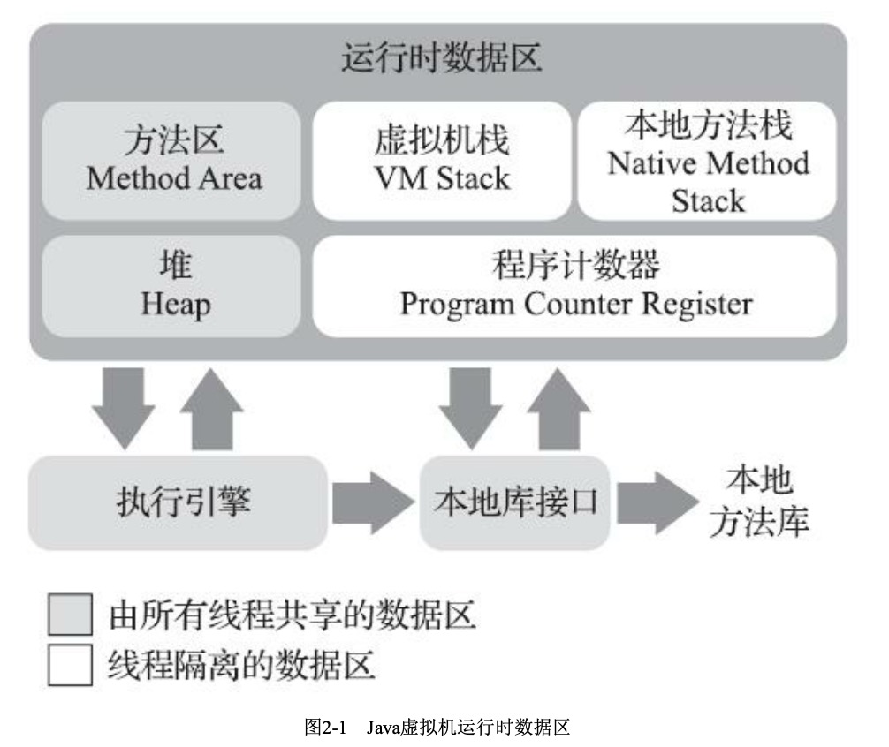

## 程序计数器

程序计数器是一块较小的内存空间，它可以看作是当前线程所执行的字节码的行号指示器。

Java虚拟机的多线程是通过线程切换并分配处理器执行时间的方式来实现的，在任何一个确定的时刻，一个处理器（对于多核处理器的一个内核）只会执行一条线程中的指令。**为了线程切换后能恢复到正确的执行位置**，每条线程都需要有一个独立的程序计数器，各条线程之间计数器互不影响，独立存储。

如果当前执行的方法是java方法，那么计数器记录的是字节码指令的地址。如果是native方法，那么计时器值为空。

## 虚拟机栈

**虚拟机栈描述的是java方法执行的内存模型**，它的生命周期与线程相同。每个方法执行的同时都会创建一个栈帧，用于存储局部变量表、操作数栈、动态链接、方法出口等信息。局部变量表存放了编译期可知的各种基本数据类型，**对象引用**和returnAddress类型。

## 本地方法栈

和虚拟机栈相似，本地方法栈为native方法服务。

## Java堆

Java堆是Java虚拟机所管理的内存中最大的一块。Java堆是被所有线程共享的一块内存区域，在虚拟机启动时创建。此内存唯一的目的就是存放对象实例，几乎所有的对象实例都在这里分配内存。规范中的描述是：**所有对象的实例以及数组**都要在堆上分配，但随着技术的发展，所有对象的都分配在堆上也渐渐变得不是那么绝对了。

Java堆是垃圾收集器管理的主要区域，因此很多时候也被称为**GC堆**。由于现在收集器基本采用**分代收集算法**，所以Java堆中还可以细分为：

Java堆可以处于物理上不连续的内存空间中，只要逻辑上是连续的即可。

## 方法区

用于存储已被虚拟机加载的类信息、常量、静态变量等数据。

规范对方法区的限制非常宽松，除了和Java堆一样不需要连续的内存和可以选择固定大小或者可扩展外，还可以选择**不实现垃圾收集**。

### 运行时常量池

运行时常量池是方法区的一部分。
Class文件中除了有类的版本、字段、方法、接口等描述信息外，还有一项信息是常量池，用于存放编译期间生成的各种字面量和符号引用，这部分内容将在类加载后进入方法区的运行时常量池中存放。
具有动态性，运行期间也可能将新的常量放入池中，这种特性被开发人员利用的比较多的是String类的intern方法。

## 对象的创建

在语言层面上，创建一个对象通常只是一个new关键字而已。

在虚拟机中：

1. 虚拟机遇到一条new指令时，首先去检查是否能在方法区的常量池中定位到一个类的符号引用，并且检查这个符号引用代表的类是否已被加载、解析和初始化过。如果没有，那就必须先执行相应的类加载过程。
2. 在类加载检查通过后，接下来虚拟机将为新生对象分配内存。有两种分配方式：**指针碰撞**和**空闲列表**。
    除了如何划分空间外，还有一个问题要考虑：
    对象的创建在虚拟机中是非常频繁的行为，在并发情况下也并不是线程安全的，可能出现正在给对象A分配内存，指针还没来得及修改，对象B又同时使用了原来的指针来分配内存的情况。
    解决这个问题有两个方案：
    1、对分配内存空间的动作进行同步处理——实际上虚拟机采用**CAS**配上失败重试的方法来保证更新操作的原子性。
    2、在Java堆中预先分配一小块内存，称为**本地线程分配缓冲（TLAB）**，哪个线程要分配内存，就在哪个线程的TLAB上分配，只有TLAB用完并分配新的TLAB时，才需要同步锁定。
3. 内存分配完成后，虚拟机需要将分配到的内存空间都初始化为零值，这一步操作保证了对象的实例字段在Java代码中可以不赋值就直接使用。
4. 接下来，虚拟机对对象进行必要的设置，这些信息存放在对象的**对象头**之中。
5. 上面的工作完成后，从虚拟机的视角，一个新的对象已经产生了，但从Java程序的视角来看，对象的创建才刚刚开始，执行\<init\>方法后（构造器），一个真正可用的对象才算完全产生出来。

> 指针碰撞：
>
> 把一块确定大小的内存从Java堆中划分出来。假设Java堆中内存是绝对规整的，所有用过的内存都放在一边，空闲的内存放在另一边，中间放着一个指针作为分界点的指示器，那所分配内存就仅仅是把那个指针向空闲空间那边挪动一段与对象大小相等的距离，这种分配方式称为“指针碰撞”(Bump the Pointer)。
>
> 空闲列表：
>
> 如果Java堆中的内存并不是规整的，已使用的内存和空闲的内存相互交错，那就没有办法简单地进行指针碰撞了，虚拟机就必须维护一个列表，记录上哪些内存块是可用的，在分配的时候从列表中找到一块足够大的空间划分给对象实例，并更新列表上的记录，这种分配方式称为“空闲列表”(Free List)。

**总结**

首先虚拟机遇到new指令，检查类是否加载，如果没有就进行类加载。

然后进行内存分配并将内存空间初始化为零值。

然后设置对象，将一些信息放在对象头里。

最后调用构造器，一个真正可用的对象构造完成。

## 对象的内存布局

对象在内存中存储的布局可以分为3块区域：**对象头、实例数据和对齐填充**。

**对象头**
包括两部分信息：
第一部分用于存储对象自身的运行时数据，如哈希码，GC分代年龄，锁状态标志等。
另一部分是类型指针，虚拟机通过这个指针来确定这个对象是哪个类的实例。如果对象是数组，那么还有记录长度的数据。

**实例数据**
实例数据是对象真正存储的有效信息，也是在程序代码中所定义的各种类型的字段内容。

**对齐填充**
对齐填充并不是必然存在的，仅仅起着占位符的作用。

## 对象的访问定位

目前主流的访问方式有使用句柄和直接指针两种。

**句柄**：

句柄的好处就是reference中存储的是稳定的句柄地址。

**直接指针**：

直接指针的好处是速度更快。

# 