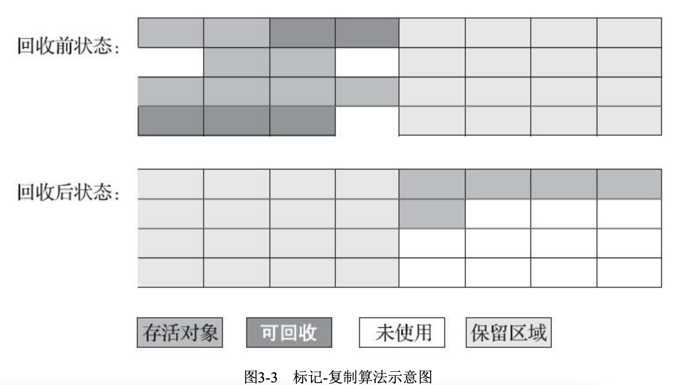

程序计数器、虚拟机栈、本地方法栈3个区域随线程而生，随线程而灭，在这几个区域内就不需要过多考虑如何回收的问题，当方法结束或者线程结束时，内存自然就跟随着回收了。

# 对象是否回收

## 可达性分析算法

基本思路：通过一系列的称为“GC Roots”的对象作为起始点，从这些节点开始向下搜索，搜索所走过的路径称为引用链，当一个对象到GC Roots没有任何引用链相连的时候，则证明此对象不可用。（图论说法就是GC ROOT到对象不可达时，证明对象不可用）

可作为GC Roots的对象：

- 虚拟机栈中（栈帧中的本地变量表）中引用的对象
- 方法区中类静态属性引用的对象
- 方法区中常量引用的对象
- 本地方法栈中JNI（Native方法）引用的对象
- Java虚拟机内部的引用，如基本数据类型对应的Class对象，一些常驻的异常对象(比如 NullPointExcepiton、OutOfMemoryError)等，还有系统类加载器。
- 所有被同步锁(synchronized关键字)持有的对象。
- 反映Java虚拟机内部情况的JMXBean、JVMTI中注册的回调、本地代码缓存等。

## 引用

在JDK1.2之后，Java对引用的概念进行了扩充：将引用分为**强引用、软引用、弱引用、虚引用**4种，这四种引用强度依次减弱。

- **强引用**就是指，在程序代码之中普通存在的，类似“Object obj=new Object（）”这类的引用，只要强引用还存在，GC就不会回收。
    也就是平时A a = new A()这个意思。
- **软引用（SoftReference）**是用来描述一些还有用但并非必需的对象。对于软引用关联着的对象，在系统将要发生内存溢出异常之前，将会把这些对象列进回收范围内进行第二次的回收。
    敏感数据的缓存，比如图片。
- **弱引用（WeakReference）**也是描述非必需的对象，但是它的强度比软引用更弱一些，被弱引用关联的对象只能生存到下一次GC收集之前。当GC工作的时候，无论内存是否充足，都会回收掉弱引用。
    非敏感数据的缓存，比如Handler内存泄漏的处理。
- **虚引用（PhantomReference）**是最弱的一种引用，一个对象是否有虚引用的存在，完全不会对其生存时间构成影响，也无法通过虚引用来取得一个对象实例。设置虚引用关联的目的就是在这个对象被GC回收的时候收到一个通知。
    对象销毁前的一些操作，比如说资源释放等。

**demo1，弱引用**

```java
public static void main(String[] args) {
    int[] ints = new int[1024 * 1024 * 20];
    WeakReference<int[]> weakReference = new WeakReference<>(ints);

    ints = null;//ints为强引用，需要指向null，否则数组对象不会被回收
    System.out.println(weakReference.get());
    System.gc();
    System.out.println(weakReference.get());
}
```

```
[I@7f31245a
null
```

这是弱引用的基本使用，可以看到gc之后，数组对象被回收了。

另外，虽然数组对象有一个弱引用，但是也有一个强引用，所以gc之后不会被回收，这里需要将强引用换一个对象引用（这里指向了null）。

这个demo可以回答我之前在百度被问到的一个问题：**图片缓存，图片对象被设为弱引用，为什么gc之后，图片还是会显示在ImageView上？**
图片对象虽然有弱引用，但是ImageView里也有一个强引用引用着图片对象，所以图片对象不会被回收。

**demo2，虚引用**

虚引用是最弱的引用，需要配合ReferenceQueue来使用，主要是检测对象是否存活。

它的作用在于跟踪垃圾回收过程，在对象被收集器回收时收到一个系统通知。 当垃圾回收器准备回收一个对象时，如果发现它还有虚引用，就会在垃圾回收后，将这个虚引用加入引用队列，在其关联的虚引用出队前，不会彻底销毁该对象。 所以可以通过检查引用队列中是否有相应的虚引用来判断对象是否已经被回收了。

```java
public class Main {
    public static void main(String[] args) {
        ReferenceQueue<int[]> referenceQueue = new ReferenceQueue<>();

        //此线程不断循环，判断对象是否被回收
        new Thread(new Runnable() {
            @Override
            public void run() {
                while (true) {
                    Reference<? extends int[]> reference = referenceQueue.poll();
                    if (reference != null) {
                        System.out.println("虚引用对象被回收了");
                        break;
                    }
                }
            }
        }).start();

        PhantomReference<int[]> phantomReference = new PhantomReference<>(new int[1024 * 1024 * 20], referenceQueue);

        System.out.println(phantomReference.get());
        System.gc();
        System.out.println(phantomReference.get());
    }
}
```

```
null
null
虚引用对象被回收了
```

另外，虚引用的get方法：

```java
public T get() {
    return null;
}
```

源码是返回null，所以通过虚引用获取不到强引用。

## 对象生存还是死亡

> finalize方法：一旦垃圾回收器准备好释放对象占用的内存，首先调用其finalize方法，并且在下一次垃圾回收动作发生时，才会真正回收对象占用的内存。
>
> 用途（个人总结）：
>
> 1.  对象自救
> 2.  delete和Java对象关联的C++对象

即使在可达性分析算法中不可达的对象也并非“非死不可”的，要真正宣告一个对象的死亡，至少经历两次标记过程：

1.  如果对象在进行可达性分析后发现没有与GC Roots相连接的引用链，那它将会**第一次标记**并且进行一次筛选
2.  筛选的条件是此对象是否有必要执行finalize方法。**当对象没有覆盖finalize方法或者finalize方法已经被调用过了**，虚拟机将这两种情况都视为没有必要执行finalize。

如果这个对象被判定为有必要执行finalize()方法，那么这个对象将会放置在一个叫做F-Queue的队列之中，并在稍后由一个由虚拟机自动建立的、低优先级的Finalizer线程去执行它。这里所谓的“执行”是指虚拟机会触发这个方法，但并不承诺会等待它运行结束，这样做的原因是，如果一个对象在finalize方法中执行缓慢，或者发生了死循环(更极端的情况)，将很可能会导致F-Queue队列中其他对象永久处于等待，甚至导致整个内存回收系统崩溃。finalize方法是对象逃脱死亡命运的最后一次机会，稍后GC将对F-Queue中的对象进行**第二次小规模的标记**，如果对象要在finalize方法)中成功拯救自己一只要重新与引用链上的任何一个对象建立关联即可，譬如把自己(this关键字)赋值给某个类变量或者对象的成员变量，那在第二次标记时它将被移除出“即将回收”的集合；如果对象这时候还没有逃脱那基本上它就真的被回收了。

> 个人总结
>
> 对象什么时候会被回收？
>
> 在可达性分析算法中不可达的对象，垃圾回收器准备好释放对象占用的内存，首先调用其finalize方法（如果在finalize中有自救行为，那么会存活）（finalize方法只会调用一次，也就是说最多自救一次），并且在下一次垃圾回收动作发生时，才会真正回收对象占用的内存。

## 回收方法区

永久代的垃圾收集主要回收两部分的内容：**废弃常量和无用的类**。

判定一个常量是否为“废弃常量”比较简单（没有地方引用常量对象），而要判定一个类是否是“无用的类”的条件则相对苛刻的多。类需要满足下面3个条件才能算是无用的类：

- 该类所有的实例已经被回收，也就是Java堆中不存在该类的任何实例。
- 加载该类的ClassLoader已经被回收。
- 该类对应的java.lang.class对象没有在任何地方被引用，无法在任何地方通过反射访问该类的方法。

>   TODO 
>
>   书中这样介绍回收常量：
>
>   举个常量池中字面量回收的例子，假如一个字符串“java”（不是static final对象，而是""修饰的字符串）曾经进入常量池中，但是没有其他地方引用这个字面量。如果在这时发生内存回收，而且垃圾收集器判断确有必要的话，这个“java”常量就将会被系统清理出常量池。常量池中其他类(接口)、方法、字段的符号引用也与此类似。
>
>   这里有2点需要注意，一是需要发生内存回收，二是垃圾收集器认为有必要，后者需要再次深究。

# 垃圾收集算法

## 标记-清除算法

最基础的算法是标记-清除算法。分为标记和清除两个阶段：首先标记出所有存活的对象，在标记完成后统一回收未被标记的对象。

不足：一个是效率问题，标记和清除两个过程的效率都不高；另一个是空间问题，标记清除之后会产生大量不连续的碎片。

## 标记-复制算法

为了解决效率问题，出现了复制算法。

将可用内存按容量划分为大小相等的两块，每次只使用其中的一块。当这一块的内存用完了，就将还标记为存活的对象复制到另外一块上面，然后再把已使用过的内存空间一次清理掉。

这种算法的代价是将内存缩小为原来的一半。

现在的商业虚拟机都用这种算法，经研究表明，新生代中的对象大多数是朝生夕死的，所以并不需要按照1:1的比例来划分内存，而是将内存分为一块较大的Eden空间和两块较小的Survivor空间，每次使用Eden和其中一块Survivor。当回收的时候，将Eden和Survivor中还存活着的对象放到另一个Survivor中。

一般不在老年代使用。



## 标记-整理算法

标记-整理算法，标记过程和标记-清除的一样，但后续步骤不是直接对可回收对象进行到底清理，而是让所有存活的对象都向一端移动，然后直接清理端边界以外的内存。

一般在老年代使用。

## 分代收集算法

设计原则：收集器应该将Java堆划分出不同的区域，然后将回收对象依据其年龄（年龄即对象熬过垃圾收集过程的次数）分配到不同的区域之中存储。一般至少会把Java堆划分为新生代(Young Generation)和老年代(Old Generation)两个区域。

分代收集的难点：对象不是孤立的，对象之间会存在跨代引用。

假如要现在进行一次只局限于新生代区域内的收集(Minor GC)，但新生代中的对象是完全有可能被老年代所引用的，为了找出该区域中的存活对象，不得不在固定的GC Roots之外，再额外遍历整个老年代中所有对象来确保可达性分析结果的正确性。

>   TODO
>
>   根据可达性分析算法，从GC ROOT出发不可达，对象才需要被回收，而这时可能已经经过了老年代对象。

假如要现在进行一次只局限于新生代区域内的收集(Minor GC)，但新生代中的对象是完全有可能被老年代所引用的，为了找出该区域中的存活对象，不得不在固定的GC Roots之外，再额外遍历整个老年代中所有对象来确保可达性分析结果的正确性，反过来也是一样。遍历整个老年代所有对象的方案虽然理论上可行，但无疑会为内存回收带来很大的性能负担。为了解决这个问题，就需要对分代收集理论添加第三条经验法则：


## 内存分配与回收策略

对象的内存分配，往大方向讲，就是在堆上分配，对象主要分配在新生代的Eden区上，如果启动了本地线程缓冲，将按线程优先在TALB上分配。
几条最普遍的内存分配规则：

- **对象优先在新生代的Eden区分配**。
- **大对象直接进入老年代**，大对象是指需要大量连续内存空间的Java对象，最典型的就是很长的字符串以及数组。
- **长期存活的对象将进入老年代**。
- **动态对象年龄判断**，为了能更好地适应不同程序的内存状况，虚拟机并不是永远的要求对象的年龄必须达到了MaxTenureThreshold才能晋升老年代，如果在Survivor空间中相同年龄所有对象大小的总和大于Survivor空间的一半，年龄大于等于该年龄的对象就可以直接进入老年代，无须等到MaxTenureThreshold中要求的年龄。
- **空间分配担保**，新生代使用复制算法，为了内存利用率，只使用其中一个Survivor空间作为轮换备份，如果出现大量对象仍然存活的情况，那么就会把无法容纳的对象放入老年代。

## 什么时候进行垃圾回收

**1**

最后总结一下什么时候会触发一次GC，个人经验看，有三种场景会触发GC：

1. 第一种场景应该很明显，当年轻代或者老年代满了，Java虚拟机无法再为新的对象分配内存空间了，那么Java虚拟机就会触发一次GC去回收掉那些已经不会再被使用到的对象
2. 手动调用System.gc()方法，通常这样会触发一次的Full GC以及至少一次的Minor GC
3. 程序运行的时候有一条低优先级的GC线程，它是一条守护线程，当这条线程处于运行状态的时候，自然就触发了一次GC了。

**2**

堆分成两大块：新生代和老年代。对象产生之初在新生代，步入暮年时进入老年代，但是老年代也接纳在新生代无法容纳的超大对象。

新生代  = 1个Eden区+2个Survivor区。绝大部分对象在Eden区生成，当Eden区装填满的时候，会触发YoungGarbage Collection，即YGC。垃圾回收的时候，在Eden区实现清除策略，没有被引用的对象则直接回收。依然存活的对象会被移送到Survivor区，这个区真是名副其实的存在。Survivor区分为S0和S1两块内存空间，送到哪块空间呢？每次YGC的时候，它们将存活的对象复制到未使用的那块空间，然后将当前正在使用的空间完全清除，交换两块空间的使用状态。如果YGC要移送的对象大于Survivor区容量的上限，则直接移交给老年代。假如一些没有进取心的对象以为可以一直在新生代的Survivor区交换来交换去，那就错了。每个对象都有一个计数器，每次YGC都会加1。-XX: MaxTenuringThreshold参数能配置计数器的值到达某个阈值的时候，对象从新生代晋升至老年代。如果该参数配置为1，那么从新生代的Eden区直接移至老年代。默认值是15，可以在Survivor区交换14次之后，晋升至老年代。


**3**

一个对象实例化时先去看Eden区有没有足够的空间
如果有不进行垃圾回收，对象直接在Eden区存储。
如果Eden区内存已满，会进行一次minor gc。
然后再进行判断Eden区中的内存是否足够
如果不足，则去看Survivor区的内存是否足够。
如果内存足够，把Eden区部分活跃对象保存在Survivor区，然后把对象保存在Eden区。
如果内存不足，向老年代发送请求，查询老年代的内存是否足够
如果老年代内存足够，将部分Survivor区的活跃对象存入老年代。然后把Eden区的活跃对象放入存活区，对象依旧保存在Eden区。
如果老年代内存不足，会进行一次full gc，之后老年代会再进行判断内存是否足够，如果足够同上。如果不足 会抛出OutOfMemoryError。

# 垃圾收集器

### Serial回收器

Serial回收器是一个**主要应用于YGC**的垃圾回收器，采用串行单线程的方式完成GC任务，其中“Stop The World"简称**STW**，即垃圾回收的某个阶段会暂停整个应用程序的执行。FGC的时间相对较长，频繁FGC会严重影响应用程序的性能。主要流程如图所示。


### CMS回收器

CMS回收器(Concurrent Mark Sweep Collector)是回收停顿时间比较短、目前比较常用的垃圾回收器。它通过

1. 初始标记(InitialMark)

2. 并发标记(Concurrent Mark)

3. 重新标记(Remak)

4. 并发清除(Concurent Sweep)

四个步骤完成垃圾回收工作。

第1、3步的初始标记和重新标记阶段依然会引发STW，而第2、4步的并发标记和并发清除两个阶段可以和应用程序并发执行，也是比较耗时的操作，但并不影响应用程序的正常执行。由于CMS采用的是“标记一清除算法”，因此产生大量的空间碎片。为了解决这个问题，CMS可以通过配置-XX: +UseCMSCompactAtFullColetion参数，强制JVM在FGC完成后对老年代进行压缩，执行一一次空间碎片整理，但是空间碎片整理阶段也会引发STW。为了减少STW次数，CMS还可以通过配置-XX: +CMSFullGCsBeforeCompaction=n参数，在执行了n次FGC后，JVM再在老年代执行空间碎片整理。

### G1回收器

Hotspot在JDK7中推出了新一代 G1 ( Garbage-First Garbage Collector )垃圾回收，通过-XX: +UseG1GC参数启用。和CMS相比，G1具备压缩功能，能避免碎片问题，G1的暂停时间更加可控。性能总体还是非常不错的，简要结构如图所示。


G1将Java推空间分制成了若干相同大小的区域，即region，包括Eden、Survivor、Old、Humongous四种类型。其中，Humongous是特殊的old类型，专门放置大型对象。这样的划分方式意味着不需要一个连续的内存空间管理对象。G1将空间分为多个区域，优先回收垃圾最多的区域。G1采用的是"Mark-Copy"，有非常好的空间整合能力，不会产生大量的空间碎片。G1的一大优势在于可预测的停顿时间，能够尽可能快地在指定时间内完成垃圾回收任务。在JDK11中，已经将G1设默认垃圾回收器，通过jstat命令可以查看垃圾回收情况。

以下来自：https://blog.csdn.net/coderlius/article/details/79272773

之前几组垃圾收集器都有几个共同点：

1. 年轻代、老年代是独立且连续的内存块；
2. 年轻代收集使用单eden、双survivor进行复制算法；
3. 老年代收集必须扫描整个老年代区域；
4. 都是以尽可能少而块地执行GC为设计原则。

G1垃圾收集器也是以关注延迟为目标、服务器端应用的垃圾收集器，被HotSpot团队寄予取代CMS的使命，也是一个非常具有调优潜力的垃圾收集器。虽然G1也有类似CMS的收集动作：初始标记、并发标记、重新标记、清除、转移回收，并且也以一个串行收集器做担保机制，但单纯地以类似前三种的过程描述显得并不是很妥当。事实上，G1收集与以上三组收集器有很大不同：

1. G1的设计原则是"首先收集尽可能多的垃圾(Garbage First)"。因此，G1并不会等内存耗尽(串行、并行)或者快耗尽(CMS)的时候开始垃圾收集，而是在内部采用了启发式算法，在老年代找出具有高收集收益的分区进行收集。同时G1可以根据用户设置的暂停时间目标自动调整年轻代和总堆大小，暂停目标越短年轻代空间越小、总空间就越大；
2. G1采用内存分区(Region)的思路，将内存划分为一个个相等大小的内存分区，回收时则以分区为单位进行回收，存活的对象复制到另一个空闲分区中。由于都是以相等大小的分区为单位进行操作，因此G1天然就是一种压缩方案(局部压缩)；
3. G1虽然也是分代收集器，但整个内存分区不存在物理上的年轻代与老年代的区别，也不需要完全独立的survivor(to space)堆做复制准备。G1只有逻辑上的分代概念，或者说每个分区都可能随G1的运行在不同代之间前后切换；
4. G1的收集都是STW的，但年轻代和老年代的收集界限比较模糊，采用了混合(mixed)收集的方式。即每次收集既可能只收集年轻代分区(年轻代收集)，也可能在收集年轻代的同时，包含部分老年代分区(混合收集)，这样即使堆内存很大时，也可以限制收集范围，从而降低停顿。

# 