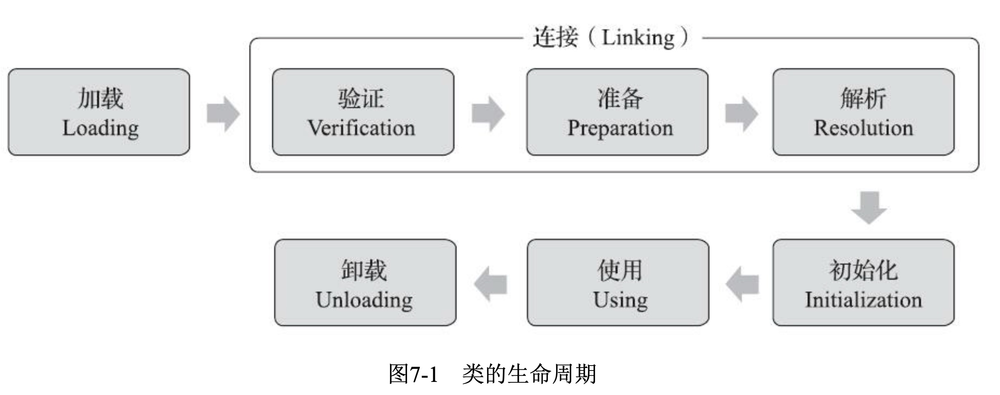

# 概述

定义：虚拟机把描述类的数据从Class文件（一串二进制的字节流）加载到内存，并对数据进行校验、转换解析和初始化，最终形成可以被虚拟机直接使用的Java类型，这就是虚拟机的**类加载机制**。

# 类加载的时机

类的整个生命周期：加载、验证、准备、解析、初始化、使用和卸载7个阶段。（其中验证、准备、解析3个部分统称为连接）。



其中，**加载、验证、准备、初始化和卸载**5个阶段的顺序是确定的，类加载过程必须按照这种顺序按部就班地开始。而**解析**阶段则不一定，它在某些情况下可以在初始化阶段之后再开始，这是为了支持Java语言的运行时绑定。
按部就班地开始指：这些阶段通常都是互相交叉地混合式进行的，会在一个阶段进行的过程中调用、激活另外一个阶段。

## 类初始化的时机

虚拟机规范严格规定了有且只有6种情况必须立即对类进行“初始化”（而加载、验证、准备自然需要在此之前开始）：

1. 遇到new、getstatic、putstatic或invokestatic这4条字节码指令时，如果类没有初始化，则需要先触发其初始化。
    使用new关键字实例化对象。
    读取静态字段（被final修饰的常量除外）。
    调用静态方法。
2. 对类进行反射调用的时候。
3. 当初始化一个类的时候，如果发现其父类还没有进行过初始化，则需要先触发其父类的初始化。
4. 当虚拟机启动的时候，需要指定一个要执行的主类，虚拟机会先初始化这个主类。
5. 使用JDK1.7的动态语言支持的时候。
6. 当一个接口中定义了JDK 8新加入的默认方法（被default关键字修饰的接口方法）时，如果有这个接口的实现类发生了初始化，那该接口要在其之前被初始化。

以上行为称为**主动引用**，除此之外。所以引用类的方法都不会触发初始化，称为**被动引用**。

举例：

- 通过子类引用父类的静态字段，不会导致子类初始化。
- 通过数组来定义类，不会触发此类的初始化。
- 常量在编译阶段会存入调用类的常量池中，本质上并没有直接引用到定义常量的类，因此不会触发定义常量的类的初始化。

**接口和类的不同**在于上面的第三点：在类初始化的时候，要求其父类全部都已初始化，但是接口在初始化的时候，并不要求其父类全部完成初始化，只有在真正用到父类接口的时候才会初始化。

>   TODO
>
>   书中说是用到父接口的常量才会导致父接口初始化，这一点和引用类常量矛盾。

# 类加载的过程

## 加载

虚拟机需要完成以下3件事情：

1. 通过一个类的全限定名来获取定义此类的二进制字节流。
2. 将这个字节流所代表的静态存储结构转化为方法区的运行时数据结构。（个人理解就是加载进内存）
3. 在内存中生成一个代表这个类的java.lang.Class对象，作为方法区这个类的各种数据的访问入口。

> 加载阶段读入.class文件，class文件时二进制吗，为什么需要使用二进制的方式？
>
> 是二进制文件。文件一般分为二进制和文本文件，而Class文件的数据格式是以二进制为基础的。
>

开发人员可以通过自定义类加载器来控制字节流的获取方式。

数组类本身不是由类加载器创建，而是由虚拟机直接创建，但数组的元素类型是由类加载器创建的。如果数组元素是基本类型，那么虚拟机将标记为与引导类加载器关联。

## 验证

验证是连接阶段的第一步，这一阶段的目的是为了确保Class文件的字节流中包含的信息符合当前虚拟机的要求，并且不会危害虚拟机自身的安全。

大致会完成下面4个阶段的检验动作：

1. **文件格式验证**
    第一阶段要验证字节流是否符合Class文件格式的规范，并且能被当前版本的虚拟机处理。这一阶段可能包括下面这些验证点：

    - 是否以魔数0xCAFEBABE开头。
    - 主、次版本号是否在当前虚拟机处理范围之内。
    - 常量池的常量中是否有不被支持的常量类型(检查常量tag标志)。
    - 指向常量的各种索引值中是否有指向不存在的常量或不符合类型的常量。
    - CONSTANT_Utf8_ info型的常量中是否有不符合UTF8编码的数据。
    - Class文件中各个部分及文件本身是否有被删除的或附加的其他信息。

    实际上，第一阶段的验证的还远不止这些，该验证阶段的**主要目的**是保证输入的字节流能正确地解析并存储于方法区之内，**格式上符合描述一个Java类型信息的要求**。这阶段的验证是基于二进制字节流进行的，只有通过了这个阶段的验证后，字节流才会进入内存的方法区中进行存储，所以后面的3个验证阶段全部是基于方法区的存储结构进行的，不会再直接操作字节流。

2. **元数据验证**
    第二阶段是对字节码描述的信息进行语义分析，以保证**其描述的信息符合Java语言规范的要求**，这个阶段可能包括的验证点如下:

    - 这个类是否有父类(除了java.lang.Object 之外，所有的类都应当有父类)。
    - 这个类的父类是否继承了不允许被继承的类(被final修饰的类)。
    - 如果这个类不是抽象类，是否实现了其父类或接口之中要求实现的所有方法。
    - 类中的字段、方法是否与父类产生矛盾(例如覆盖了父类的final字段，或者出现不符合规则的方法重载，例如方法参数都致，但返回值类型却不同等)。

    第二阶段的**主要目的**是对类的元数据信息进行语义校验，保证不存在不符合Java语言规范的元数据信息。

3. **字节码验证**
    第三阶段是整个验证过程中最复杂的一个阶段，主要目的是通过数据流和控制流分析，确定程序语义是合法的、符合逻辑的。在第二阶段对元数据信息中的数据类型做完校验后，这个阶段将对类的方法体进行校验分析，保证被校验类的方法在运行时不会做出危害虚拟机安全的事件，例如：

    - 保证任意时刻操作数栈的数据类型与指令代码序列都能配合工作，例如不会出现类似这样的情况：在操作栈放置了一个int类型的数据，使用时却按long类型来加载入本地变量表中。

    - 保证跳转指令不会跳转到方法体以外的字节码指令上。

    - 保证方法体中的类型转换是有效的，例如可以把一个子类对象赋值给父类数据类型，这是安全的，但是把父类对象赋值给子类数据类型，甚至把对象赋值给与它毫无继承关系、完全不相干的一个数据类型，则是危险和不合法的。

    如果一个类方法体的字节码没有通过字节码验证，那肯定是有问题的。但如果一个方法体通过了字节码验证，也不能说明其一定就是安全的。

4. **符号引用验证**
    最后一个阶段的校验发生在虚拟机将符号引用转化为直接引用的时候，这个转化动作将在解析阶段中发生。符号引用验证可以看做是对类自身以外(常量池中的各种符号引用)的信息进行匹配性校验，通常需要校验下列内容：

    - 符号引用中通过字符串描述的全限定名是否能找到对应的类。
    - 在指定类中是否存在符合方法的字段描述符以及简单名称所描述的方法和字段。
    - 符号引用中的类、 字段、方法的访问性 ( private、 protected、public、default) 是否可被当前类访问。

    **符号引用验证的目的是确保解析动作能正常执行**，如果无法通过符号引用验证，那么将会抛出一个java. lang. IncompatibleClassChangeError异常的子类，如java.lang.NoSuchFieldError、 java.lang.NoSuchMethodError等。
    对于虚拟机的类加载机制来说，验证阶段是一个非常重要的、但不是一定必要(因为对程序运行期没有影响)的阶段。如果所运行的全部代码(包括自己编写的及第三方包中的代码)都已经被反复使用和验证过，那么在实施阶段就可以考虑使用Xveifynone参数来关闭大部分的类验证措施，以缩短虚拟机类加载的时间。

> 验证过程是防止什么问题？验证过程是怎样的？加载和验证的执行顺序？符号引用的含义？
>
> 1、为了确保Class文件的字节流中包含的信息符合当前虚拟机的要求，并且不会危害虚拟机自身的安全。
>
> 2、文件格式验证、元数据验证、字节码验证、符号引用验证。
>
> 3、交叉进行，但是加载的开始在验证之前。
>
> 4、符号引用中通过字符串描述的全限定名是否能找到对应的类并且可被当前类访问。

## 准备

准备阶段是正式为类变量分配内存并设置类变量初始化的阶段，这些变量所使用的内存都将在方法区中进行分配。

这里有两点要注意：

- 这个时候内存分配的仅包括类变量（被static修饰的变量），而不包括实例变量，实例变量将会在对象实例化时随着对象一起分配在Java堆中。
- 这里说的初始值通常情况下是数据类型的零值。假设一个变量`public static int v = 123`，那变量在准备阶段后的初始值是0而不是123，因为这个时候还没有执行任何Java方法。把v赋值123是在初始化阶段才会执行。
- `public static final int v = 123`，此时v为123。因为这种变量属于ConstantValue（只限于基本类型和String）。

## 解析

解析阶段是**虚拟机将常量池内的符号引用替换为直接引用的过程**。

> **符号引用**：符号引用以一组符号来描述所引用的目标，符号可以是任何形式的字面量，只要使用时无歧义地定位到目标即可。
>
> **直接引用**：直接引用可以是直接指向目标的指针、相对偏移量或是一个能间接定位到目标的句柄。
>
> 区别（个人思考）：
>
> 符号引用的目标不一定加载到内存中了，而直接引用的目标必然在内存中了。
>
> 解析动作主要针对类或接口、字段、类方法、接口方法、方法类型、方法句柄和调用点。

解析动作主要针对类或接口、字段、类方法、接口方法、方法类型、方法句柄和调用点限定符7类符号引用进行。

1.  **类或接口的解析**
    假设当前代码所处的类为D，如果要把一个从未解析过的符号引用N解析为一个类或接口C的直接引用，那虚拟机完成整个解析的过程需要以下3个步骤：
    1）如果C不是一个数组类型，那虚拟机将会把代表N的全限定名传递给D的类加载器去加载这个类C。在加载过程中，由于元数据验证、字节码验证的需要（**暗示验证阶段会触发其他类的加载**），又可能触发其他相关类的加载动作，例如加载这个类的父类或实现的接口。一旦这个加载过程出现了任何异常，解析过程就宣告失败。

    2）如果C是一个数组类型，并且数组的元素类型为对象，那将会按照第1点的规则加载数组元素类型。如果N的描述符如前面所假设的形式，需要加载的元素类型就是“java.lang.Integer”, 接着由虚拟机生成一个代表此数组维度和元素的数组对象。

    3）如果上面的步骤没有出现任何异常，那么C在虚拟机中实际上已经成为一个有效的类或接口了，但在解析完成之前还要进行符号引用验证，确认D是否具备对C的访问权限。如果发现不具备访问权限，将抛出java.lang.IlegalAccessError异常。

2. **字段解析**
    要解析一个未被解析过的字段符号引用，首先将会对字段表内class index项中索引的CONSTANT Class info 符号引用进行解析，也就是字段所属的类或接口的符号引用。如果在解析这个类或接口符号引用的过程中出现了任何异常，都会导致字段符号引用解析的失败。如果解析成功完成，那将这个字段所属的类或接口用C表示，虚拟机规范要求按照如下步骤对C进行后续字段的搜索。

    1）如果C本身就包含了简单名称和字段描述符都与目标相匹配的字段，则返回这个字段的直接引用，查找结束。

     2）否则，如果在C中实现了接口，将会按照继承关系从下往上递归搜索各个接口和它的父接口，如果接口中包含了简单名称和字段描述符都与目标相匹配的字段，则返回这个字段的直接引用，查找结束。

    3）否则，如果C不是java.lang.Object的话，将会按照继承关系从下往上递归搜索其父类，如果在父类中包含了简单名称和字段描述符都与目标相匹配的字段，则返回这个字段的直接引用，查找结束。

    4）否则，查找失败，抛出java.lang.NoSuchfieldError异常。

    如果查找过程成功返回了引用，将会对这个字段进行权限验证，如果发现不具备对字段的访问权限，将抛出java.lang.IlegalAccessError异常。

    在实际应用中，虚拟机的编译器实现可能会比上述规范要求得更加严格些，如果有一个同名字段同时出现在C的接口和父类中，或者同时在自己或父类的多个接口中出现，那编译器将可能拒绝编译。

3. **类方法解析**
    类方法解析的第一个步骤与字段解析一样，也需要先解析出类方法表的class_index项中索引的方法所属的类或接口的符号引用，如果解析成功，我们依然用C表示这个类，接下来虚拟机将会按照如下步骤进行后续的类方法搜索。
    1）类方法和接口方法符号引用的常量类型定义是分开的，如果在类方法表中发现classindex中索引的C是个接口，那就直接抛出java.lang.IncompatibleClassChangeError异常。
    2）如果通过了第1步，在类C中查找是否有简单名称和描述符都与目标相匹配的方法，如果有则返回这个方法的直接引用，查找结束。
    3）否则，在类C的父类中递归查找是否有简单名称和描述符都与目标相匹配的方法，如果有则返回这个方法的直接引用，查找结束。
    4）否则，在类C实现的接口列表及它们的父接口之中递归查找是否有简单名称和描述符都与目标相匹配的方法，如果存在匹配的方法，说明类C是一个抽象类，这时查找结束，抛出java.lang.AbstractMethodError异常。
    5）否则，宣告方法查找失败，抛出java.lang.NoSuchMethodError。
    最后，如果查找过程成功返回了直接引用，将会对这个方法进行权限验证，如果发现不具备对此方法的访问权限，将抛出java.lang.IlegalAccessError异常。

4. **接口方法解析**
    接口方法也需要先解析出接口方法表的class_index项中索引的方法所属的类或接口的符号引用，如果解析成功，依然用C表示这个接口，接下来虚拟机将会按照如下步骤进行后续的接口方法搜索。

    1）与类方法解析不同，如果在接口方法表中发现class_index中的索引C是个类而不是接口,那就直接抛出java.lang.IncompatibleClassChangeError异常。

    2）否则，在接口C中查找是否有简单名称和描述符都与目标相匹配的方法，如果有则返回这个方法的直接引用，查找结束。

    3）否则，在接口C的父接口中递归查找，直到java.lang.Object类（查找范围会包括Object类）为止，看是否有简单名称和描述符都与目标相匹配的方法，如果有则返回这个方法的直接引用，查找结束。

    4）否则，宣告方法查找失败，抛出java.lang.NoSuchMethodError异常。

    由于接口中的所有方法默认都是public的，所以不存在访问权限的问题，因此接口方法的符号解析应当不会抛出java.lang IlelAccessError异常。 

## 初始化

到这个阶段才真正开始执行类中定义的Java程序代码（或者说是字节码）。

在初始化阶段，则根据程序员通过程序制定的主观计划去初始化类变量和其他资源（执行静态块和对静态变量赋值），或者说，初始化阶段是执行类构造器\<clinit\>方法的过程。

一些知识点：

- \<clinit\>方法是由编译器自动收集类中的所有类变量的赋值动作和静态语句块（static{}块）中的语句合并产生的，编译器收集的顺序是由语句在源文件中出现的顺序决定的，静态语句块中只能访问到定义在静态语句块之前的变量，**定义在它之后的变量，在前面的静态语句块可以赋值，但是不能访问**。

    ```
    static {
        i=0;					//可以正常编译通过
        System.out.println(i);	//编译器提示“非法向前引用”
    }
    public static int i=1;
    //结果i为1.
    ```

- \<clinit\>不需要显式地调用父类的\<clinit\>，它保证在调用子类的\<clinit\>之前，父类的\<clinit\>方法已经执行过了。因此在虚拟机的第一个被执行\<clinit\>的类肯定是java.lang.Object。

- 由于父类的\<clinit\>先执行，也就意味着父类中定义的静态语句块要优先于子类的变量赋值操作。

- \<clinit\>方法对于类或接口来说不是必需的，如果一个类没有静态语句块，也没有对变量的赋值操作，那么编译器可以不为这个生成\<clinit\>方法。

- 接口中不能用静态语句块，但仍有变量初始化的赋值操作，因此接口与类一样都会生成\<clinit\>方法。但接口不需要先执行父类的\<clinit\>。另外，接口的实现类在初始化的时候也不会执行接口的\<clinit\>方法。

- 虚拟机会保证一个类的\<clinit\>方法在多线程环境中会被正确地加锁、同步，如果多个线程同时去初始化一个类，那么只会有一个线程去执行这个类的\<clinit\>方法。

## 小结

1. 加载阶段获取class的二进制流，并装载进内存，初步校验cafe babe魔法数、常量池、文件长度、是否有父类等，然后创建对应类的java.lang.Class实例。
2. 连接阶段包括验证、准备、解析三个步骤。验证是更详细的校验，比如final是否合规、类型是否正确、静态变量是否合理等；准备阶段是为静态变量分配内存，并设定默认值，解析类和方法确保类与类之间的相互引用正确性，完成内存结构布局。
3. 初始化阶段执行类构造器\<clinit>方法，如果赋值运算是通过其他类的静态方法来完成的，那么会马上解析另外一个类，在虚拟机栈中执行完毕后通过返回值进行赋值。

# 类加载器

虚拟机设计团队把类加载阶段中的“通过一个类的全限定名来获取买描述此类的二进制字节流”这个动作放到Java虚拟机外部去实现，以便让应用程序自己去决定如何获取所需要的类，实现这个动作的代码模块称为**类加载器**。

### 类与类加载器

类加载器虽然只用于实现类的加载，但是它还有一个作用。

比较两个类是否相等，只有在这两个类是由同一个类加载器加载的前提下才有意义，否则，即使这两个类来源于同一个Class文件，被同一个虚拟机加载，只要加载它们的类加载器不同，那这两个类就必定不相等。

### 双亲委派模型

从Java虚拟机的角度来看，只存在两种不同的类加载器：

- 一种是启动类加载器，这个类加载器使用C++来实现，是虚拟机自身的一部分；
- 另一种是所有其他的类加载器，这些类加载器都由Java语言来实现，独立于虚拟机外部，并且全部继承java.lang.ClassLoader。

从Java开发程序员的角度来看：

- 启动类加载器，加载类库（<JAVA_HOME\>\lib目录）。
- 扩展类加载器，加载<JAVA_HOME\>\lib\ext目录中的。
- 应用程序类加载器，默认的类加载器。


图片展示的是类加载器之间的层次关系，称为类加载器的**双亲委派模型**。

双亲委派模型要求除了顶层的启动类加载器外，其余的都应当有自己的父类加载器。这里的父子关系一般不会以继承来实现，而是以组合的关系来实现。

双亲委派模型的工作过程：如果一个类加载器收到了类加载的请求，它首先不会自己去尝试加载这个类，而是把这个请求委派给父类加载器去完成，每一个层次的类加载都是如此，因此所有的加载请求最终会应该会传送到顶层的启动类加载器中，只有当父加载器反馈自己无法完成这个请求时，子加载器才会尝试自己去加载。

这样做有一个显而易见的好处，就是Java类随着它的类加载器一起具备了一种带有优先级的层次关系。例如，java.lang.Object，无论哪个类加载器加载这个类，最终都是委派给启动类加载器，因此Object类在程序的各种类加载器环境中都是同一个类。

### 破坏双亲委派模型

双亲委派模型不是一个强制性的约束模型，而是推荐的一种实现方式。

有3次较大规模的被破坏情况：

1. 第一次被破坏是发生在双亲委派模型之前，即JDK1.2发布之前。
2. 第二次是由这个模型自身的缺陷导致的。
3. 第三次是由于用户对程序动态性的追求而导致的。

# 