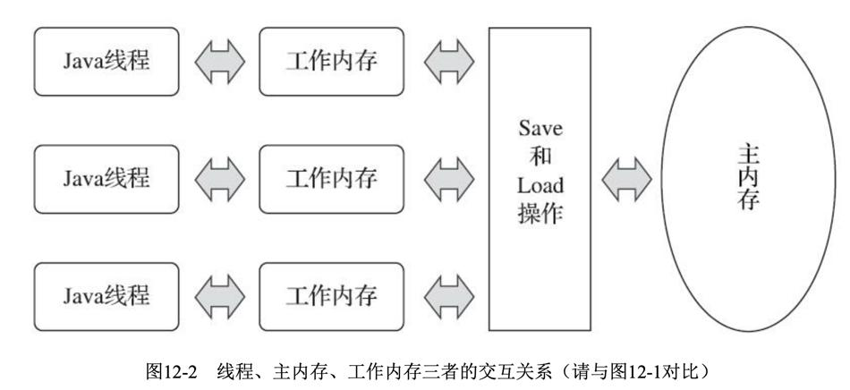

# 硬件的效率与一致性

物理机的内存模型：
由于计算机的存储设备与处理器的运算速度有几个数量级的差距，所以现代计算机系统都不得不加入一层读写速度尽可能接近处理器运算速度的高速缓存（Cache）来作为内存与处理器之间的缓冲：将运算需要使用到的数据复制到缓存中，让运算能快速进行，当运算结束后再从缓存同步回内存之中，这样处理器就无须等待缓慢的内存读写了。

基于高速缓存的存储交互很好地解决了处理器与内存的速度矛盾，但是也为计算机系统带来更高的复杂度，因为它引人了一个新的问题：缓存一致性(Cache Chrence)为了解决一致性的问题，需要各个处理器访问缓存时都遵循一些协议。


# Java中的内存模型

## 介绍

Java内存模型的主要目标是定义程序中各个变量的访问规则，即在虚拟机中将变量存储到内存和从内存中取出变量这样的底层细节。

Java内存模型规定了所有的变量都存储在虚拟机的主内存中，每条线程还有自己的工作内存，线程的工作内存中保存了被该线程使用到的变量的主内存副本拷贝，线程对变量的使用操作（读取、赋值等）都必须在工作内存中进行，而不能直接在主内存中进行。不同线程之间也无法直接访问对方工作内存中的变量，线程间变量值的传递需要通过主内存来完成。



### 问题

假设线程中访问一个10MB大小的对象，也会把这10MB的内存复制一份出来吗？
事实上并不会如此，这个对象的引用、对象中某个在线程访问到的字段是有可能被复制的，但不会有虚拟机把整个对象复制一次。

Java的内存模型中，工作内存会拷贝整个对象。但是，如果对象的某个属性是引用类型，那么只会拷贝该属性的引用，而不是整个对象。这是因为Java中的对象是通过引用来传递的，而不是通过值来传递的。因此，如果工作内存需要修改对象的某个属性，它需要先将该属性的引用拷贝到工作内存中，然后再修改该属性的值。这也是为什么在多线程环境下，需要使用同步机制来保证线程之间对共享变量的修改是可见的。

## 内存间交互操作

Java内存模型定义了8种原子操作来完成主内存和工作内存之间的交互：

- **lock（锁定）**：作用于主内存的变量，它把一个变量标识为一条线程独占的状态。
- **unlock（解锁）**：作用于主内存的变量，它把一个处于锁定状态的变量释放出来，释放后的变量才可以被其他线程锁定。
- **read（读取）**：作用于主内存的变量，把一个变量从主内存传输到线程的工作内存中，以便随后的load动作使用。
- **load（载入）**：作用于工作内存的变量，把read操作从主内存得到的变量值放入工作内存的变量副本中。
- **use（使用）**：作用于工作内存的变量，把工作内存中一个变量的值传递给执行引擎，每当虚拟机遇到一个需要使用到变量的值的字节码的指令时将会执行这个操作。
- **assgin（赋值）**：作用于工作内存的变量，把一个从执行引擎接收到的值赋给工作内存的变量。
- **store（存储）**：作用于工作内存的变量，把工作内存中一个变量的值传送到主内存中。
- **write（写入）**：作用于主内存的变量，把store操作从工作内存中得到的变量的值放入主内存的变量中。

read和load操作、store和write必须按照顺序执行，但是不要求连续执行。可能会出现read a、read b、load b、load a。
Java内存模型规定了上述8种操作必须满足如下规则：

- 不允许read和load、store和write操作之一单独出现。
- 不允许一个线程丢弃它的最近的assign操作，即变量在工作内存中改变了之后必须把变化同步回主内存。
- 一个新的变量只能在主内存中诞生，不允许在工作内存中直接使用一个未被初始化的变量。
- 一个变量在同一时刻只允许一条线程对其进行lock操作。
- 如果对一个变量执行lock操作，那将会清空工作内存中此变量的值，在执行引擎使用这个变量前，需要重新执行load和assign操作初始化变量的值。
- 如果一个变量没有被lock，那就不允许对它执行unlock操作。
- 对一个变量执行unlock之前必须先把此变量同步到主内存中。


## volatile

https://blog.csdn.net/yinbucheng/article/details/71305951

### demo

```java
public class Main {
    private static int n = 0;

    public static void main(String[] args) {
        Thread[] threads=new Thread[20];
        for (int i = 0; i < 20; i++) {
            threads[i]=new Thread(new Runnable() {
                @Override
                public void run() {
                    iAdd();
                }
            });
            threads[i].start();
        }

        while (Thread.activeCount()>1){
            Thread.yield();
        }
        System.out.println(n);
    }

    private static void iAdd() {
        for (int i = 0; i < 100; i++) {
            n++;
        }
    }
}

output:
//多次运行
1839
2000
1998
2000
1949
2000
```

字节码分析：

```
public class Main {
    private static int n = 0;
    
	public static void main(String[] args) {
        n++;
    }
}

public static void main(java.lang.String[]);
    descriptor: ([Ljava/lang/String;)V
    flags: ACC_PUBLIC, ACC_STATIC
    Code:
      stack=2, locals=1, args_size=1
         0: getstatic     #2                  // Field n:I
         3: iconst_1
         4: iadd
         5: putstatic     #2                  // Field n:I
         8: return
      LineNumberTable:
        line 4: 0
        line 5: 8
```

| 指令      | 作用                                         |
| :-------- | :------------------------------------------- |
| getstatic | 获取指定类的静态域，并将其值压入栈顶         |
| iconst_1  | int型常量值1进栈(iconst_2，int型常量值2进栈) |
| iadd      | 栈顶两int型数值相加，并且结果进栈            |
| putstatic | 为指定的类的静态域赋值                       |

### 特性

>   原子性是指一个操作是不可中断的，要么全部执行成功要么全部执行失败。即使在多个线程一起执行的时候，一个操作一旦开始，就不会被其他线程所干扰。

当一个变量定义为volatile，它将具备两种特性：

1. **可见性**
    保证此变量对所有线程的可见性，指当一条线程修改了这个变量的值，新值对于其他线程来说是可以立即得知的。
    由于volatile变量只能保证可见性，不能保证原子性。在不符合以下两条规则的运算场景下，仍然要通过加锁的方式来保证原子性：
    
    - 运算结果并不依赖变量的当前值（像这种情况就不能：i++），或者能够确保只有单一的线程修改变量的值。
    - 变量不需要与其他的状态变量共同参与不变约束。
    
    简单地说就是，volatile只保证只读只写的情况，对于同时读写的情况不能保证。
    
    volatile修饰的变量如果是对象或数组之类的，其含义是对象或数组的地址具有可见性，但是数组或对象内部的成员改变不具备可见性。
    
2. **禁止指令重排序优化**
    DCL失效问题
    有volatile修饰后，变量赋值会多执行一个内存屏障操作（重排序时不能把后面的指令重排序到内存屏障之前的位置，换句话说，执行这条指令时，前面的指令已经执行完了）。

> 普通变量和volatile变量的个人理解：
>
> 普通变量并发运算不是安全的在于读写问题。
>
> volatile变量并发运算不是安全的在于操作栈问题。
>
> 指令重排序的个人理解：
>
> 1：A+10
>
> 2：A*2
>
> 3：B+10
>
> 在这三个指令中，CPU可能是123执行，也可能是132或者312执行。如果B加了volatile，那么禁止指令重排序只执行123。

### volatile原理

在字节码层面上，volatile变量在赋值后会多一个指令`lock addl$0x0，(%esp)`，这个指令相当于内存屏障，这个内存屏障保证在指令重排序时不能把后面的指令重排序到内存屏障之前的位置，就是禁止指令重排序优化。

另外，lock前缀的作用是将本处理器的缓存写入了内存，该写入动作也会引起别的处理器或者别的内核的缓存无效化，通过这样一个空操作，可让前面volatile变量的修改对其他处理器立即可见。

## 针对long和double型变量的特殊规则

对于64位的数据类型（long和double），允许虚拟机将没有被volatile修饰的64位数据的读写操作划分为两次32位的操作来进行。

如果有多个线程共享一个并未声明为volatile的long或double类型的变量，并且同时对它们进行读取和修改操作，那么某些线程可能会读取到一个既不是原值，也不是其他线程修改值的代表了“半个变量”的数值。不过这种读取到“半个变量”的情况是非常罕见的，

在实际开发中，除非该数据有明确可知的线程竞争，否则在编写代码时一般不需要因为这个原因刻意把用到的long和double变量专门声明为volatile。

## 先行发生原则

```java
private int value = 0;
pubilc void setValue(int value){
	this.value = value; 
}
public int getValue(){
	return value; 
}
```

假设存在线程A和B，线程A先（时间上的先后）调用了setValue(1)，然后线程B调用了同一个对象的getValue()，尽管线程A在操作时间上先于线程B，但是无法确定线程B中getValue()方法的返回结果，这里面的操作不是线程安全的。

结论：

-   一个操作“时间上的先发生”不代表这个操作会是“先行发生”。
-   如果一个操作“先行发生”，也不能推导出这个操作必定是“时间上的先发生”。典型的例子就是“指令重排序”。

```
// 以下操作在同一个线程中执行 
int i = 1;
int j = 2;
```

两条赋值语句在同一个线程之中，根据程序次序规则，`int i=1`的操作先行发生于`int j=2`，但`“int j=2`的代码完全可能先被处理器执行（指令重排序）。

>   TODO 线程原理
>   进程是CPU分配时间片，那么线程呢？

# Java与线程

## Java线程调度

线程调度是指系统为线程分配处理器使用权的过程，调度主要方式有两种，分别是协同式线程调度和抢占式线程调度。

-   如果使用协同式调度的多线程系统，线程的执行时间由线程本身来控制，线程把自己的工作执行完了之后，要主动通知系统切换到另外一个线程上去。
-   如果使用抢占式调度的多线程系统，那么每个线程将由系统来分配执行时间，线程的切换不由线程本身来决定。

Java使用的线程调度方式就是抢占式调度。

## 线程状态

有6种状态，一个线程有且仅有其中的一个状态：

1.  新建(New)：创建后尚未启动的线程处于这种状态。
2.  运行(Runnable)：包括操作系统线程状态中的Running和Ready，也就是处于此状态的线程有可能正在执行，也有可能正在等待着操作系统为它分配执行时间。
3.  无限期等待(Waiting)：处于这种状态的线程不会被分配处理器执行时间，它们要等待被其他线程显式唤醒。以下方法会让线程陷入无限期的等待状态：
    -   没有设置Timeout参数的`Object::wait()`方法; 
    -   没有设置Timeout参数的`Thread::join()`方法; 
    -   `LockSupport::park()`方法。
4.  限期等待(Timed Waiting)：处于这种状态的线程也不会被分配处理器执行时间，不过无须等待被其他线程显式唤醒，在一定时间之后它们会由系统自动唤醒。以下方法会让线程进入限期等待状态：
    -   `Thread::sleep()`方法;
    -   设置了Timeout参数的`Object::wait()`方法; 
    -   设置了Timeout参数的`Thread::join()`方法; 
    -   `LockSupport::parkNanos()`方法; 
    -   `LockSupport::parkUntil()`方法。
5.  阻塞(Blocked)：线程被阻塞了，“阻塞状态”与“等待状态”的区别是“阻塞状态”在等待着获取到一个排它锁，这个事件将在另外一个线程放弃这个锁的时候发生；而“等待状态”则是在等待一段时间，或者唤醒动作的发生。在程序等待进入同步区域的时候，线程将进入这种状态。
6.  结束(Terminated)：已终止线程的线程状态，线程已经结束执行。


