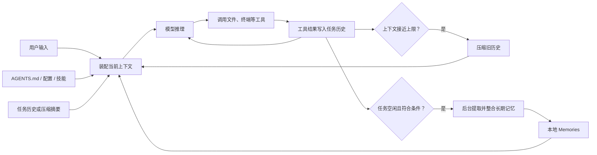

# 什么是 Agent？与大模型有什么本质不同？

> **大模型是提供智能能力的“大脑”，Agent 是把大脑、工具、记忆和执行闭环组合起来，能够在环境中为目标持续行动的系统。**

Agent（智能体）是一个以大模型为核心、能够围绕目标自主采取行动的系统。

大模型本质上是一个“预测下一个 Token”的概率模型：输入上下文，输出文本或结构化结果。它通常只完成一次推理，不主动维护任务状态，也不会自行操作外部环境。

Agent 则是在大模型之外增加了一套执行闭环：

> 感知环境 → 分析与规划 → 调用工具执行 → 观察结果 → 调整策略 → 直到完成目标

两者的本质区别是：

- **大模型负责推理和生成**：回答“应该怎么做”。
- **Agent 负责目标驱动的行动**：决定“下一步做什么”，实际执行，并根据结果继续调整。
- **大模型通常是无状态的单次调用**；Agent 会维护任务状态、记忆和执行过程。
- **大模型的边界是输出内容**；Agent 可以调用搜索、数据库、代码执行器、浏览器和业务 API，改变外部环境。
- **大模型的输入通常由人提供**；Agent 可以主动获取信息、拆解任务并多轮运行。

一个典型 Agent 通常包含：

1. **模型**：理解、推理和决策。
2. **目标与指令**：明确任务和约束。
3. **工具**：访问外部系统并执行操作。
4. **记忆与状态**：保存上下文、中间结果和历史经验。
5. **规划与执行循环**：持续判断、行动和纠错。
6. **权限与安全机制**：限制可执行操作及风险边界。

例如，用户说“帮我订一张明天去上海的机票”：

- 大模型只能给出订票建议或操作步骤。
- Agent 可以查询航班、比较价格、询问必要信息、调用订票接口，并在付款前请求用户确认。

需要补充的是，Agent 不一定比大模型“更聪明”；它的核心优势是**能够行动和持续完成任务**，而不是模型能力本身发生了本质变化。


# Agent 的基本架构由哪些核心组件构成？

> 一个 Agent 通常包括模型、规划、工具、记忆、状态管理这些模块。简单说，就是模型先理解目标并决定下一步，系统检查这个动作能不能做，然后调用工具，把结果再交给模型判断。这个过程循环进行，直到任务完成或达到停止条件。

一个典型 AI Agent 通常包含以下模块：

- **目标与指令模块**：定义 Agent 的角色、目标、约束、成功条件和停止条件。
- **模型模块**：理解用户意图，进行推理、规划、工具选择和结果总结。
- **规划与状态管理模块**：拆解任务，记录当前步骤、已完成工作、待办事项和执行状态。
- **工具模块**：封装搜索、数据库、代码执行、文件系统、业务 API 等外部能力。
- **记忆与知识模块**：保存当前会话信息、历史经验、用户偏好，并通过 RAG 等方式检索外部知识。
- **执行与编排模块**：负责调用模型和工具、处理超时与重试、控制循环以及协调各模块。
- **安全与权限模块**：进行身份认证、参数校验、权限检查、敏感信息过滤和高风险操作审批。
- **可观测与评估模块**：记录模型调用、工具调用、执行轨迹、延迟、成本和任务结果。

协作流程通常是：系统先接收用户目标和环境信息，模型结合记忆生成计划或下一步动作；编排器校验动作后调用相应工具；工具结果作为新的观察写入状态；模型再根据新状态继续执行、重新规划或结束任务。安全和可观测模块贯穿整个过程，而不是只在最后介入。

# Workflow，Agent，Tools 这三个的概念和区别介绍一下？

> - Workflow 是预定义的任务编排，强调确定性、稳定性和可控性；
>
> - Agent 是围绕目标自主规划和决策的执行主体，强调灵活性；
> - Tools 是可被调用的原子能力，负责执行具体操作。
>
> 三者不是互斥关系：Workflow 可以编排 Agent 和 Tools，Agent 也可以在执行过程中选择并调用 Tools。实际工程中通常会用 Workflow 控制整体边界，用 Agent 处理不确定问题，再由 Tools 完成具体操作。

可以把三者理解为：**Workflow 管流程，Agent 做决策，Tools 提供能力。**

| 概念     | 核心作用             | 谁决定下一步               | 特点                         |
| -------- | -------------------- | -------------------------- | ---------------------------- |
| Workflow | 编排任务步骤         | 预先定义的流程规则         | 稳定、可控、易审计           |
| Agent    | 根据目标自主完成任务 | Agent 结合上下文动态决策   | 灵活，但结果和路径不完全确定 |
| Tools    | 执行具体操作         | 调用它的 Workflow 或 Agent | 能力明确，本身通常不负责决策 |

## Workflow

Workflow 是一个预先设计好的执行流程，描述任务按照什么顺序、条件和规则运行。

例如报销流程：

```
提交申请 → 检查发票 → 金额审批 → 财务打款
```

它通常包含：

- 固定步骤
- 条件分支
- 重试、超时和异常处理
- 人工审批节点
- Agent 或 Tool 调用

Workflow 更适合规则明确、强调稳定性和可审计性的业务。

## Agent

Agent 是一个以目标为导向、能够动态决定行动步骤的执行主体。

典型循环是：

```
理解目标 → 分析当前状态 → 选择行动 → 调用工具 → 观察结果 → 继续决策
```

例如用户要求：

> 分析线上错误，并给出修复建议。

Agent 可能自主决定：

1. 查询日志；
2. 搜索相关代码；
3. 查看最近提交；
4. 运行测试；
5. 根据结果提出修复方案。

这些步骤不一定提前完全写死，而是由 Agent 根据中间结果动态调整。

## Tools

Tools 是 Agent 或 Workflow 可以调用的具体能力接口，本身通常不负责规划。

例如：

- 搜索网页
- 查询数据库
- 读取文件
- 执行代码
- 发送邮件
- 调用天气 API
- 创建工单

可以把 Tool 类比成“函数”：

```
search_logs(keyword)
send_email(recipient, content)
query_database(sql)
```

它接收明确输入，执行操作，再返回结果。

## 三者之间的关系

一个完整系统通常是：

```
Workflow
├── 固定业务步骤
├── Agent：处理需要判断的复杂节点
└── Tools：提供查询或执行能力
```

例如客服工单系统：

- **Workflow**：接收工单 → 分类 → 处理 → 审核 → 回复；
- **Agent**：理解客户问题，动态判断如何处理；
- **Tools**：查询订单、检查物流、申请退款、发送消息。

# Agent 设计范式

- **ReAct（Reasoning + Acting）**
  在“思考—调用工具—观察结果”之间循环，直到完成目标。适合搜索、排障、数据查询等需要边执行边判断的任务。
- **Plan-and-Execute**
  先生成整体计划，再逐步执行；必要时重新规划。相比 ReAct，更适合步骤较多、执行周期较长的任务。


## ReAct、Plan-and-Execute 和多 Agent 协作模式分别适用于什么问题？

> - ReAct 是边想边做，适合步骤不确定、需要不断看结果再决定下一步的任务。
> - Plan-and-Execute 是先列计划再执行，适合流程较长、步骤依赖比较清楚的任务。
> - 多 Agent 是让不同 Agent 分工，适合需要并行处理或多个专业角色的复杂任务，但成本和协作难度也更高。
> - codex的工作模式是[Agent Loop](./01 Codex 型通用 Agent 的工作方式.md)

### ReAct

ReAct 适合“事先无法确定完整路径”的问题。它的工作方式类似：

```
观察现状 → 采取行动 → 查看结果 → 调整判断 → 再行动
```

适用场景：

- 调试未知原因的 Bug
- 排查 CI、构建或部署失败
- 探索陌生代码库
- 操作网页、终端或外部工具
- 数据质量检查
- 需要反复试验的性能优化
- 测试失败后自动定位并修复

例如：

```
登录接口偶尔返回 500，请复现问题、查看日志、提出假设，
通过测试逐个验证，找到原因后修复并运行回归测试。
```

这里不能预先写死完整步骤，因为每一步都依赖实际观察结果。

不太适合：

- 路径已经非常明确的机械修改
- 一次性批量转换
- 必须严格遵循固定审批流程的任务

ReAct 的主要风险是“走一步看一步”可能导致方向漂移、重复尝试或消耗较多上下文。因此最好同时规定终止条件：

```
每个假设最多验证一次；连续三次没有新证据时停止并汇报。
```


### Plan-and-Execute

Plan-and-Execute 适合“步骤多、依赖复杂，但整体目标相对明确”的问题。

其工作方式是：

```
分析目标 → 制定计划 → 确认依赖和风险 → 逐项执行 → 验证整体结果
```

适用场景：

- 大型重构
- 框架或数据库迁移
- 跨模块功能开发
- API 版本升级
- 安全整改
- 从需求到实现的完整开发任务
- 需要多人审核或阶段性确认的工作
- 容易改漏文件的系统性修改

例如：

```
将身份认证从 Session 迁移到 JWT，先分析影响范围并制定迁移计划，
计划确认后再实施，保证迁移期间旧客户端仍然可用。
```

这种任务必须先弄清：

- 哪些模块受影响
- 步骤之间的依赖
- 如何保持兼容
- 如何迁移数据
- 如何测试和回滚

不太适合：

- 目标本身还不明确的探索性问题
- 每一步都高度依赖实时结果的问题
- 只有一两个简单步骤的修改

它的主要风险是“计划建立在错误假设上”。所以执行过程中不能机械照搬计划，应允许根据新证据更新计划：

```
如果实际代码与计划假设冲突，暂停当前步骤，更新计划后再继续。
```

### 多 Agent 协作

多 Agent 适合“可以拆成多个相互独立或弱依赖子任务”的问题。

其工作方式是：

```
主 Agent 分解任务
   ├─ Agent A：子任务 A
   ├─ Agent B：子任务 B
   └─ Agent C：子任务 C
          ↓
主 Agent 汇总、解决冲突并验证
```

适用场景：

- 大型代码库并行探索
- PR 多维度审查
- 多个相互独立模块的分析
- 安全、性能、测试分别审计
- 大量文档或日志的分片分析
- 多方案并行研究和比较
- 多个平台或多种实现的验证
- 测试、文档、代码审查等辅助工作并行执行

例如：

```
并行审查当前 PR：

- Agent A 检查安全风险；
- Agent B 棩查逻辑错误和并发问题；
- Agent C 检查测试覆盖；
- Agent D 检查性能和可维护性。

等待全部完成后，由主 Agent 去重、核验证据并按严重程度汇总。
```

不太适合：

- 强顺序依赖的任务
- 多个 Agent 必须频繁修改同一文件
- 无法清晰划分责任边界的问题
- 很小的任务
- 需要单一、一致设计判断的核心实现

多 Agent 并不天然比单 Agent 更好。主要成本包括：

- Token 使用量更大
- 结果可能重复或矛盾
- 多个 Agent 同时写代码可能发生冲突
- 主 Agent 需要额外验证和整合

因此，多 Agent 最适合并行执行“读多写少”的工作，例如探索、检索、测试、审查和日志分析。写代码时最好让不同 Agent 负责不同模块，或者只让一个主 Agent 落地修改。

### 如何选择

可以用三个问题快速判断：

1. 下一步是否取决于刚得到的结果？
   - 是：优先 ReAct。
2. 是否存在较长且明确的步骤依赖？
   - 是：优先 Plan-and-Execute。
3. 是否能拆出两个以上相互独立的子任务？
   - 是：考虑多 Agent。

典型选择如下：

- 未知 Bug：ReAct
- 跨系统迁移：Plan-and-Execute
- 大型 PR 审查：多 Agent
- 小范围明确修改：普通单 Agent 直接执行
- 大型未知故障：先 Plan-and-Execute 划分调查方向，再让多个 Agent 并行调查，每个 Agent 内部使用 ReAct

实践中最强的往往是组合模式：

```
Plan-and-Execute 负责全局方向
        ↓
多 Agent 负责并行分工
        ↓
每个 Agent 用 ReAct 处理不确定细节
        ↓
主 Agent 汇总、实施并验证
```

一句话概括：

- ReAct 擅长处理“不确定性”。
- Plan-and-Execute 擅长处理“依赖性”。
- 多 Agent 擅长处理“可并行性”。


### codex和上述三种模式的关系

**Agent Loop 与 ReAct 的关系**

- Codex Agent Loop 与 ReAct 思想非常接近。但 OpenAI 官方使用的名称是 Agent Loop，不保证它严格复现某篇 ReAct 论文的提示格式或内部轨迹。


**Agent Loop 与 Plan-and-Execute 的关系**

Agent Loop 解决的是“如何持续行动和反馈”，Plan-and-Execute 解决的是“如何组织一个较长任务”。二者不是互斥关系。一个完整的 Plan-and-Execute 工作流可以表示为：

```text
Plan 阶段
  Agent Loop：读取 → 搜索 → 提问 → 更新计划
        ↓
计划确认
        ↓
Execute 阶段
  Agent Loop：修改 → 测试 → 观察 → 修正 → 验证
```

即使先制定了计划，执行阶段仍然需要 Agent Loop。计划提供全局方向，循环负责处理执行中出现的新事实。


**Agent Loop 与多 Agent 的关系**

多 Agent 是在单个 Agent Loop 之上增加并行编排。主 Agent 可以把相互独立的任务交给多个子 Agent，每个子 Agent 都运行自己的循环，最后由主 Agent 收集结果。

# 复杂任务怎么做的任务拆分？为什么要拆分？效果如何提升？

> 首先确定最终任务目标，其次基于边界、依赖关系拆分成子任务。
>
> 为什么要拆分：见下
>
> 效果如何提升：见下

为什么要拆分：

- 降低单次推理复杂度和上下文压力；
- 让每一步都可以验证，提高结果可靠性；
- 支持并行执行，降低整体延迟；
- 便于定位错误、局部重试，而不是从头执行；
- 可以针对不同子任务选择更合适、更低成本的模型和工具。


效果如何提升：

拆分本身不一定提升效果，真正决定效果的是**拆分粒度、上下文传递和验证机制**。我通常通过以下方式优化：

- 为子任务定义明确的输入输出协议；
- 只传递必要上下文，减少噪声和信息丢失；
- 对高风险步骤增加交叉验证或独立复核；
- 对失败任务局部重试，并根据失败原因重新规划；
- 记录成功率、重试次数、端到端耗时、Token 成本和最终质量，持续调整拆分策略。

例如，让 Agent 完成一份行业分析报告时，我不会直接要求它“一次性生成报告”，而是拆成问题定义、资料检索、来源验证、数据整理、观点生成、报告撰写和事实检查。检索任务可以并行，写作依赖整理后的数据，最终再由独立检查环节验证引用和结论。这样能够明显减少事实错误，也能让失败集中在某个局部步骤，降低返工成本。


# 记忆

> 下面以codex为例

核心结论：Codex 的记忆不是一个不断更新的“脑内数据库”，而是一套分层的外部状态系统。模型本身仍然主要依赖当前上下文；长期连续性由任务记录、压缩摘要、规则文件、本地记忆和项目文件共同实现。

## 记忆的五个层次

| 层次     | 作用域           | 主要载体                | 特点                             |
| -------- | ---------------- | ----------------------- | -------------------------------- |
| 工作记忆 | 当前推理         | 模型上下文窗口          | 信息最完整，但容量有限           |
| 情节记忆 | 当前任务         | turn/item 历史记录      | 支持恢复、读取、分叉任务         |
| 压缩记忆 | 长任务           | 历史压缩结果            | 节约上下文，但必然有信息损失     |
| 语义记忆 | 跨任务、当前用户 | `~/.codex/memories/`    | 自动提取偏好、经验和背景         |
| 程序记忆 | 用户或项目       | `AGENTS.md`、配置、技能 | 明确、可审查，适合必须遵守的规则 |

另外还有一种“任务状态记忆”：Goal。它记录目标、生命周期、预算和进度，但只属于当前任务，不属于全局记忆。

## 整体工作流程



可以近似理解为：

```
本次模型输入 =
    系统与安全策略
  + 当前用户要求
  + AGENTS.md 等显式规则
  + 可选的本地记忆
  + 压缩后的旧历史
  + 最近对话
  + 工具读取到的代码、日志和测试结果
```


最简单的层级关系是：

```
Thread（一次任务/对话）
└── Turn（一次工作回合）
    ├── Item：用户消息
    ├── Item：执行命令
    ├── Item：修改文件
    ├── Item：调用工具
    └── Item：Agent 回复
```

## codex会话组成

- Thread：一次任务/对话
- Turn：一次工作回合
- Item：回合中的一个工作单元

假设对话如下：

```
用户：修复登录问题。
Codex：已修复。

用户：再补一个测试。
Codex：测试已添加。
```

通常对应：

```
Thread
├── Turn 1：修复登录问题
│   ├── 多个命令、文件修改和消息 Item
│   └── 最终回答 Item
└── Turn 2：补充测试
    ├── 多个命令、文件修改和消息 Item
    └── 最终回答 Item
```

Codex 持久化的任务历史，本质上就是这些 turn 及其 item。恢复任务时，系统可以重新加载它们；上下文过长时，又可以把较早的多个 item 压缩，并产生一个 `contextCompaction` item。[Turns 官方定义](https://learn.chatgpt.com/docs/app-server#turns)


## 工作记忆与任务历史（情节记忆）

一次任务由多个 turn 和 item 组成。Codex 会持久化任务历史，因此可以：

- 恢复一个旧任务并继续追加内容；
- 读取完整任务记录；
- 从某个历史节点分叉出新任务；
- 保存文件检查、命令执行和工具返回结果。

这很像“持久化事件日志”，但不能简单等同于模型每次都重新阅读全部日志。任务越长，完整历史越不可能全部塞进上下文。[Codex App Server 文档](https://learn.chatgpt.com/docs/app-server#api-overview)


## 压缩是长任务的关键

Codex 可以在上下文达到一定 token 阈值时自动压缩历史：

```
model_auto_compact_token_limit = 120000
```

其思想是把较早的详细过程替换为更短的状态摘要，例如保留：

- 当前目标；
- 已完成工作；
- 修改过的文件；
- 关键决定；
- 测试结果；
- 未解决的问题。

最近几轮和重要工具结果则尽量保留原文。

因此，压缩不是无损存储。摘要遗漏某个细节后，模型可能“忘记”它。这也是为什么真正重要的约束应写入 `AGENTS.md`，而不是只在很早的一轮对话里说一次。Codex 暴露了自动压缩阈值和压缩提示配置，但具体压缩算法并未完全公开。[配置参考](https://learn.chatgpt.com/docs/config-file/config-reference#configtoml)


## 跨任务的本地 Memories

Codex 现在还有独立的本地记忆功能，默认关闭。开启后，其写入流程大致是：

1. 等待一个任务空闲，避免总结仍在进行的工作；
2. 跳过过短或不适合生成记忆的任务；
3. 使用提取模型生成单任务记忆；
4. 对不同任务的记忆进行全局整合；
5. 写入 `~/.codex/memories/`；
6. 在未来任务中按配置注入已有记忆。

目录中可能包括摘要、长期条目、近期输入和支撑证据。系统会尝试从生成字段中删除秘密信息，但官方仍明确建议不要把秘密交给记忆系统。

配置也把“写入”和“读取”分开：

```
[features]
memories = true

[memories]
generate_memories = true
use_memories = true
```

还可以规定：使用过 MCP、网页搜索等外部上下文的任务不参与记忆生成，避免把不稳定或敏感的外部信息固化下来。[Memories 文档](https://learn.chatgpt.com/docs/customization/memories)

公开文档没有说明底层究竟使用向量数据库、关键词检索还是其他排序算法，所以不能断言 Codex 使用了某种特定 RAG 实现。


## 为什么还需要 AGENTS.md

自动记忆只能作为“可能有帮助的回忆”，不能作为必须执行的规章。

例如：

```
# 开发约定

- 修改 JavaScript 后必须运行测试。
- 未经确认不得添加生产依赖。
- 数据库迁移必须提供回滚方案。
```

这类内容应该进入 `AGENTS.md`。它是显式、确定且可版本控制的程序记忆；全局文件可提供个人默认规则，项目内文件可提供仓库规则。[AGENTS.md 文档](https://learn.chatgpt.com/docs/agent-configuration/agents-md#create-global-guidance)

可以用一句话区分：

> Memories 负责“最好能想起来”，`AGENTS.md` 负责“必须遵守”。


## Goal 为什么被单独设计

Goal 不是普通聊天摘要，也不是全局记忆，而是当前任务的持久化完成契约。它保存：

- 目标；
- 当前状态；
- token 或时间预算；
- 进度；
- 完成证据。

它跟随任务恢复，但不会污染其他项目或其他任务。Codex 只有在文件、测试、日志等证据支持时才应将目标标为完成。[Goals 架构说明](https://developers.openai.com/cookbook/examples/codex/using_goals_in_codex#how-goals-are-designed-in-codex)


## 这种设计解决了什么问题

Codex 采用分层记忆，主要是为了平衡：

- 容量：完整历史可能远超上下文窗口；
- 成本：不能每轮都重放整个项目和全部对话；
- 隔离：一个项目的经验不应随意污染另一个项目；
- 可控性：用户能够查看、关闭或删除本地记忆；
- 可靠性：代码、Git、测试结果仍是事实来源；
- 安全性：记忆默认关闭，并提供外部上下文过滤和秘密脱敏。

所以，优秀的 Agent 记忆系统并不是“尽可能记住一切”，而是：

> 把不同信息放进不同作用域，在需要时重建最小但足够的上下文，并让重要规则始终显式、可验证。


# 草稿

## 请你介绍一下 AI Agent 的记忆机制，并说明在实际开发中应该如何设计记忆模块？


Agent 的长短期记忆系统怎么做的？记忆是怎么存的？粒度是多少？怎么用的？(opens new window) 10. 什么是 Multi-Agent？(opens new window) 11. 说说 Single-Agent 和 Multi-Agent 的设计方案？(opens new window) 12. Agent 记忆压缩通常有哪些方法？(opens new window) 13. 在工程实践中，为什么有时候选择「手搓」Agent，而不是直接用成熟框架？(opens new window) 14. 如何赋予 LLM 规划能力？(opens new window) 15. 讲讲 Agent 的反思机制？为什么要用反思？具体怎么实现？(opens new window) 16. 如何设计多 Agent 的协作与动态切换机制？(opens new window) #


# 其它

## Agent 的「感知、规划、行动、记忆」分别指什么？

> - 感知就是读取用户输入和环境信息；
> - 规划是判断要做什么、分几步做；
> - 行动是实际调用工具或系统；
> - 记忆是保存当前状态和有用的历史信息。
>
> 它们会形成一个循环：先获取信息，再做计划、执行动作，然后根据新结果继续调整。

- **感知**：接收并理解来自用户和环境的信息，例如自然语言、图像、网页内容、数据库结果、工具错误和系统状态。感知不仅是读取数据，还包括把原始输入转换成可用于决策的结构化状态。
- **规划**：根据目标、约束和当前状态确定后续步骤，包括任务拆解、工具选择、依赖排序、风险判断以及成功和停止条件。
- **行动**：执行计划中的具体操作，例如调用 API、查询数据库、修改文件、发送请求或向用户提问。行动前通常需要经过参数校验和权限检查。
- **记忆**：保存和检索对任务有用的信息。短期记忆维护当前会话和任务状态，长期记忆保存经过筛选的历史事实、经验或用户偏好，外部知识库则提供可检索的领域资料。

这四部分构成一个循环：Agent 感知环境，结合记忆进行规划，执行行动，再感知行动结果并更新记忆和计划。系统的可靠性很大程度上取决于这个闭环是否有清晰的状态、校验和停止机制。


## 如何判断一个任务适合交给 Agent，而不是通过固定流程或单次 LLM 调用完成？

> 主要看任务是不是需要多步决策，以及中间结果会不会影响后续步骤。
>
> 如果只是摘要、分类这类一次调用就能完成的任务，用 LLM 就够了；
>
> 如果步骤固定，就用普通工作流；
>
> 如果路径不确定、要连续调用工具并根据结果调整，才比较适合 Agent。高风险任务还要加人工确认。

可以从任务的不确定性、步骤数量、外部交互和风险四个方面判断。

适合使用 Agent 的任务通常具有以下特征：目标明确但执行路径难以预先穷举；需要多步推理和连续工具调用；中间结果会影响下一步决策；需要处理非结构化信息或异常情况；任务可以通过反馈逐步修正。例如跨来源调研、复杂故障排查和代码修复。

如果输入到输出只需要一次理解、生成、分类或抽取，通常单次 LLM 调用更简单，例如摘要、改写和情感分类。如果业务步骤固定、规则明确且强调稳定性与审计，则更适合确定性工作流，例如审批流、定时同步和标准化数据处理。

还要考虑风险与收益。即使任务具有不确定性，只要错误后果很严重且难以回滚，也不应直接给予 Agent 完整执行权。可以采用“Agent 生成建议或计划，确定性程序执行，关键节点人工审批”的混合方案。


## LLM 在 Agent 系统中常见的职责有哪些？哪些职责不应完全依赖 LLM？

> LLM 适合做意图理解、任务拆解、工具选择和结果总结，因为这些事情需要处理自然语言和不确定性。但权限校验、金额限制、精确计算、事务控制和高风险操作授权不能只靠 LLM，应该交给代码、规则引擎或人工审批。简单说，LLM 负责灵活判断，程序负责守住硬规则。

LLM 擅长处理语义和不确定性，因此常用于理解用户意图、提取任务约束、拆解任务、选择工具、生成工具参数、解释工具结果、处理自然语言以及根据反馈调整计划。它也适合在多个合理方案之间进行启发式选择。

以下职责不应完全依赖 LLM：

- **身份认证和权限控制**：必须由确定性的安全系统执行。
- **参数及业务规则校验**：例如金额上限、数据类型、库存约束和合规规则，应由代码或规则引擎验证。
- **精确计算和事实查询**：应交给计算器、数据库或权威数据源，不能依赖模型记忆。
- **事务、幂等和并发控制**：应由应用和基础设施保障。
- **敏感操作的最终授权**：删除数据、付款、退款和对外发送等操作需要明确审批或强约束。
- **停止条件、预算和超时**：应由编排器硬性执行，不能只通过提示词要求模型自觉遵守。

总体原则是：让 LLM 负责理解、生成和软决策，让确定性系统负责安全边界、精确规则和最终执行保障。