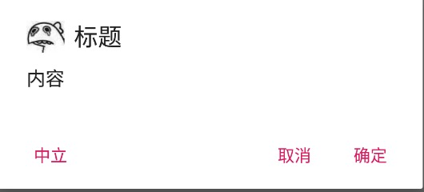
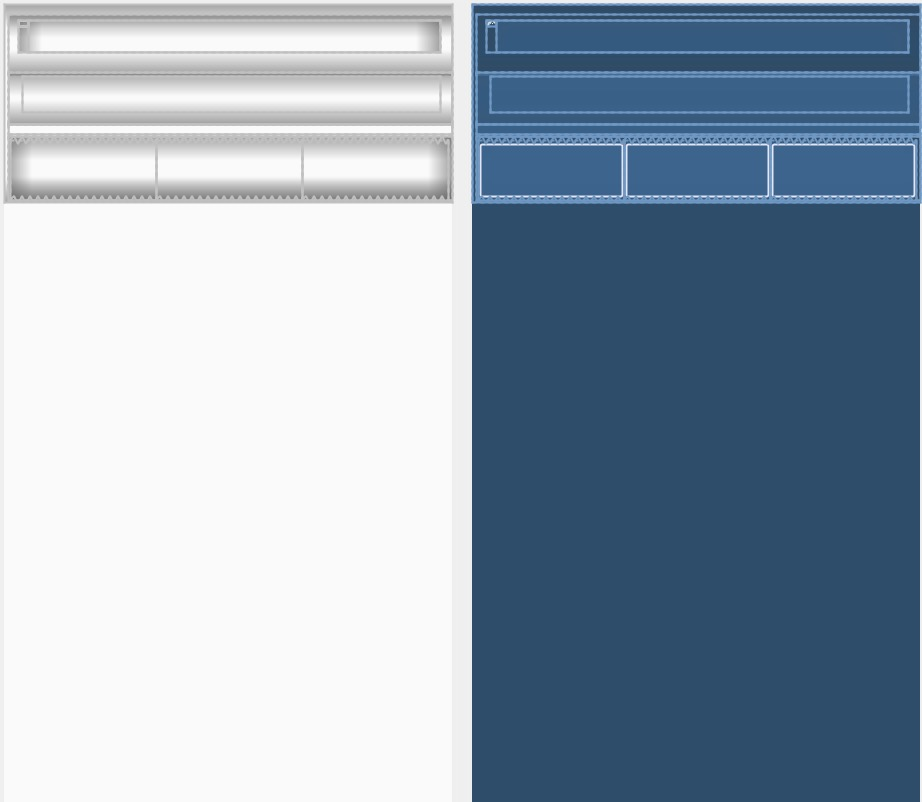

# 介绍

Builder模式（建造者模式）是一步一步创建一个复杂对象的创建型模式，它允许用户在不知道内部构建细节的情况下，可以更精细地控制对象的构造流程。该模式是为了将构建复杂对象的过程和它的部件解耦，使得构建过程和部件的表示隔离开来。

因为一个复杂的对象有很多大量组成部分，如汽车，有车轮、方向盘、发动机，还有各种小零件等，如何将这些部件装配成辆汽车， 这个装配过程很漫长，也很复杂，对于这种情况，为了在构建过程中对外部隐藏实现细节，就可以使用Builder模式将部件和组装过程分离，使得构建过程和部件都可以自由扩展，两者之间的耦合也降到最低。

# 定义

将一个复杂对象的构建与它的表示分离，使得同样的构建过程可以创建不同的表示。

# 使用场景

1. 相同的方法，不同的执行顺序，产生不同的事件结果时。
2. 多个部件或零件，都可以装配到一个对象中，但是产生的运行结果又不相同时。
3. 产品类非常复杂，或者产品类中的调用顺序不同产生了不同的作用，这个时候使用建造者模式非常合适。
4. 当初始化一个对象特别复杂，如参数多，且很多参数都具有默认值时。

# 实现

```java
public class User {
    private final String A;
    private final String B;
    private final String C;
    private final String D;

    User(UserBuilder builder) {
        A=builder.A;
        B=builder.B;
        C=builder.C;
        D=builder.D;
    }

    public String getA() {
        return A;
    }

    public String getB() {
        return B;
    }

    public String getC() {
        return C;
    }

    public String getD() {
        return D;
    }

    @Override
    public String toString() {
        return "A="+A+" ,B="+B+" ,C="+C+" ,D="+D;
    }

    public static class UserBuilder{
        private final String A;
        private final String B;
        private String C;
        private String D;

        public UserBuilder(String a, String b) {
            A = a;
            B = b;
        }

        public UserBuilder setC(String c){
            C=c;
            return this;
        }

        public UserBuilder setD(String d){
            D=d;
            return this;
        }

        public User build(){
            return new User(this);
        }
    }
}
```

> 尽量将属性值变为不可变

使用:

```java
User.UserBuilder builder=new User.UserBuilder("1","2");
User user=builder
        .setC("3")
        .setD("4")
        .build();
Log.d(TAG, "-------------------");
Log.d(TAG, "user1="+user.toString());
User.UserBuilder builder2=new User.UserBuilder("1","2");
User user2=builder2
        .setC("3")
        .build();
Log.d(TAG, "-------------------");
Log.d(TAG, "user2="+user2.toString());
```

> user1=A=1 ,B=2 ,C=3 ,D=4
>
> user2=A=1 ,B=2 ,C=3 ,D=null

# 特点

- User类的构造函数是私有的，调用者不能直接实例化这个类
- User类是不可变的，所有必选的属性值都是final并且在构造函数中设置，同时属性值只提供getter
- UserBuilder的构造函数值接收必选的属性值作为参数，并且只有必选的属性才会设置为final

# Android中的Builder模式

```java
AlertDialog.Builder builder = new AlertDialog.Builder(this)
        .setIcon(R.drawable.img1)
        .setTitle("标题")
        .setMessage("内容")
        .setPositiveButton("确定", (dialog, which) ->
                Toast.makeText(D10Activity.this, "确认", Toast.LENGTH_SHORT).show())
        .setNegativeButton("取消", (dialog, which) ->
                Toast.makeText(D10Activity.this, "取消", Toast.LENGTH_SHORT).show())
        .setNeutralButton("中立", (dialog, which) ->
                Toast.makeText(D10Activity.this, "中立", Toast.LENGTH_SHORT).show());
builder.create().show();
```

这是经常用到的AlertDialog，效果如图：



看一下AlertDialog：

```java
public class AlertDialog extends Dialog implements DialogInterface {
  	//接收Builder中的各个参数
    private AlertController mAlert;
		
  	//构造方法
    AlertDialog(Context context, @StyleRes int themeResId, boolean createContextThemeWrapper) {
        super(context, createContextThemeWrapper ? resolveDialogTheme(context, themeResId) : 0, createContextThemeWrapper);
        mWindow.alwaysReadCloseOnTouchAttr();
        mAlert = AlertController.create(getContext(), this, getWindow());
    }

		//调用的是mAlert的方法
    @Override
    public void setTitle(CharSequence title) {
        super.setTitle(title);
        mAlert.setTitle(title);
    }

    public static class Builder {
      	//存储AlertDialog的参数
        private final AlertController.AlertParams P;

        public Builder(Context context, int themeResId) {
            P = new AlertController.AlertParams(new ContextThemeWrapper(
                    context, resolveDialogTheme(context, themeResId)));
        }
				
      	//设置各种参数
        public Builder setTitle(@StringRes int titleId) {
            P.mTitle = P.mContext.getText(titleId);
            return this;
        }

        public Builder setTitle(CharSequence title) {
            P.mTitle = title;
            return this;
        }

        public Builder setMessage(@StringRes int messageId) {
            P.mMessage = P.mContext.getText(messageId);
            return this;
        }
      
        public Builder setMessage(CharSequence message) {
            P.mMessage = message;
            return this;
        }
      
        public Builder setView(View view) {
            P.mView = view;
            P.mViewLayoutResId = 0;
            P.mViewSpacingSpecified = false;
            return this;
        }

      	//创建AlertDialog，传入各种参数
        public AlertDialog create() {
          	final AlertDialog dialog = new AlertDialog(P.mContext, 0, false);
          	//将P的参数应用到dialog的mAlert中
            P.apply(dialog.mAlert);
            dialog.setCancelable(P.mCancelable);
            if (P.mCancelable) {
                dialog.setCanceledOnTouchOutside(true);
            }
            dialog.setOnCancelListener(P.mOnCancelListener);
            dialog.setOnDismissListener(P.mOnDismissListener);
            if (P.mOnKeyListener != null) {
                dialog.setOnKeyListener(P.mOnKeyListener);
            }
            return dialog;
        }

        public AlertDialog show() {
            final AlertDialog dialog = create();
            dialog.show();
            return dialog;
        }
    }
}
```

上述代码中，Builder 类可以设置AlertDialog中的title、message、 button 等参数，这些参数都存储在类型为AlertController.AlertParams 的成员变量P中，AlertController.AlertParams中包含了与AlertDialog视图中对应的成员变量。在调用Builder类的create函数时会创建AlertDialog，并且将Builder成员变量P中保存的参数应用到AlertDialog的mAlert对象中，即P.apply(dialog.mAlert)代码段。

在apply函数中，只是将AlertParams参数设置到AlertController 中，例如，将标题设置到Dialog对应的标题视图中，将Message设置到内容视图中等。当我们获取到AlertDialog对象后，通过show函数就可以显示这个对话框。

在show函数中主要做了如下几个事情:

1. 通过dispatchOnCreate函数来调用AlertDialog的onCreate函数
2. 然后调用AlertDialog的onStart 函数
3. 最后将Dialog的DecorView添加到WindowManager中。

很明显，这就是一系列典型的生命周期函数。那么按照惯例，AlertDialog 的内容视图构建按理应该在onCreate函数中。

在onCreate函数中主要调用了AlertController 的installContent方法，Dialog中的onCreate函数只是一个空实现而已，可以忽略它。那么AlertDialog的内容视图必然就在installContent函数中。

installContent函数的代码很少，但极为重要，它调用了Window对象的setContentView，这个setContentView就与Activity 中的一模一样，实际上Activity 最终也是调用Window 对象的setContentView函数。因此，这里就是设置AlertDialog的内容布局，这个布局就是mAlertDialogLayout字段的值，这个值在AlertController的构造函数中进行了初始化。

```java
protected AlertController(Context context, DialogInterface di, Window window) {
    final TypedArray a = context.obtainStyledAttributes(null,
            R.styleable.AlertDialog, R.attr.alertDialogStyle, 0);
    mAlertDialogLayout = a.getResourceId(
            R.styleable.AlertDialog_layout, R.layout.alert_dialog);
    a.recycle();
  	//。。。
}
```

可以看到，AlertDialog的布局资源就是alert_dialog.xml



当通过Builder对象的setTitle、setMessage 等方法设置具体内容时，就是将这些内容填充到对应的视图中。而AlertDialog也允许你通过setView传入内容视图，这个内容视图就是替换掉上面图示的第二行的部分，AlertDialog 预留了一个costomPanel区域用来显示用户自定义的内容视图。

setupView方法用来初始化AlertDialog布局中的各个部分，如标题区域、按钮区域、内容区域等，在该函数调用之后整个Dialog 的视图内容全部设置完毕。而这些各区域的视图都属于mAlertDialoglayout布局中的子元素，Window对象又关联了mAlertDialogLayout 的整个布局树，当调用完setupView之后整个视图树的数据都填充完毕，当用户调用show函数时，WindowManager会将Window对象的DecorView (也就是mAlertDialogIayout对应的视图，当然DecorView还有一个层次，我们不做过多讨论)添加到用户的窗口上，并且显示出来。至此，整个Dialog就出现在用户的视野中了！

## 总结

在AlertDialog的Builder模式中并没有看到Director角色的出现，其实在很多场景中，Android并没有完全按照GOF在《设计模式:可复用面向对象软件的基础》书中描述的经典模式实现来做，而是做了一些修改，使得这个模式更易于使用。这里的AlertDialog.Builder简化了Builder 模式的设计。当模块比较稳定，不存在一些变化时，可以在经典模式实现的基础上做出一些精简， 而不是照搬GOF上的经典实现，更不要生搬硬套，使程序失去架构之美。

# 总结

Builder模式在Android开发中也较为常用，通常作为配置类的构建器将配置的构建和表示分离开来，同时也是将配置从目标类中隔离出来，避免过多的setter方法。Builder模式比较常见的实现形式是通过调用链实现，这样使得代码更简介、易懂。

优点

1. 良好的封装性，使用建造者模式可以使客户端不必知道产品内部组成的细节。
2. 建造者独立，容易扩展。 

缺点

1. 会产生多余的Builder对象以及Director对象，消耗内存。