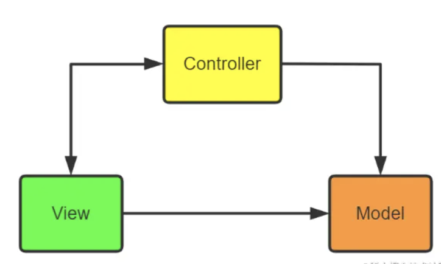
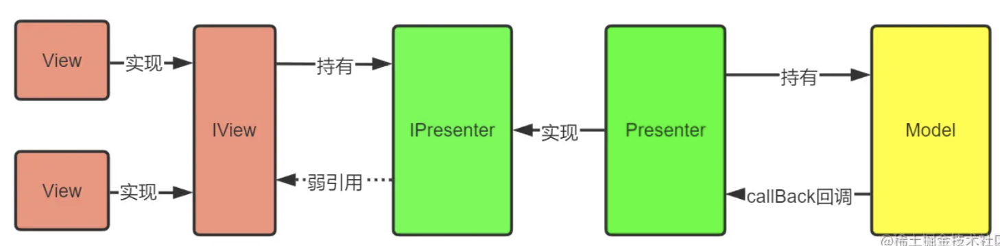
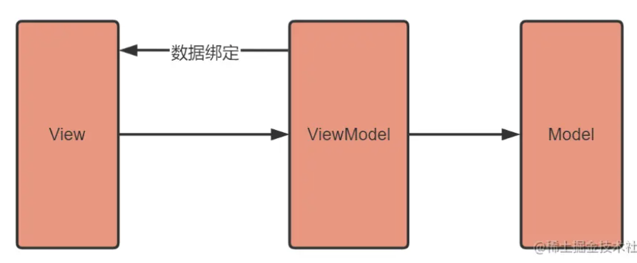

# MVC、MVP、MVVM

### 总结

- MVC：Model-View-Controller，经典模式，很容易理解，主要缺点有两个：
    - View对Model的依赖，会导致View也包含了业务逻辑；
    - Controller会变得很厚很复杂。
- MVP：Model-View-Presenter，MVC的一个演变模式，将Controller换成了Presenter，主要为了解决上述第一个缺点，将View和Model解耦，不过第二个缺点依然没有解决。
- MVVM：Model-View-ViewModel，是对MVP的一个优化模式，采用了双向绑定：View的变动，自动反映在ViewModel，反之亦然。

# MVC

## MVC在Android中的实现

1.   View：xml+Activity
2.   Model对应于本地数据文件或网络获取的数据体，对数据的处理也会在这一层进行。
3.   Controller一种是直接把Activity当成Controller；一种是独立出Controller类，进行逻辑分离。

## 处理流程

-   view接收用户的点击
-   view请求controller进行处理或直接去model获取数据
-   controller请求model获取数据，进行其他的业务操作
-   这一步可以有多种做法：
    -   利用callBack从controller进行回调
    -   把view实例给controller，让controller进行处理
    -   通知view去model获取数据

# MVP

MVC的一个演化版本，全称Model-View-Presenter。

MVP能够有效降低View的复杂性，避免业务逻辑被塞进View中。同时会解除View和Model的耦合性，同时带来良好的可扩展性、可测试性。

## 角色

把Activity中的UI逻辑抽象成View接口，把业务逻辑抽象成Presenter接口，Model类还是原来的Model类

**Presenter交互中间人**

主要作为沟通View和Model的桥梁，它从Model层检索数据后，返回给View层，使得View和Model之间没有耦合，也将业务逻辑从View角色上抽离出来。

**View用户界面**

View通常是Activity或Fragment或者某个View控件，它含有一个Presenter成员变量。通常View需要实现一个逻辑接口，将View上的操作转交给Presenter实现，最后Presenter调用View逻辑接口将结果返回给View元素。

**Model数据的存取**

对于一个结构化的APP来说，Model角色主要是提供数据的存取功能。

## 优点

-   MVP通过模块职责分工，抽离业务逻辑，降低代码的耦合性
-   实现模块间的单向依赖，代码思路清晰，提高可维护性
-   模块间通过接口进行通信，降低了模块间的耦合度，可以实现不同模块独立开发或动态更换

## 缺点

MVP的最大特点就是接口通信，接口的作用是为了实现模块间的独立开发，模块代码复用以及模块的动态更换。但是我们会发现后两个特性，在Android开发中使用的机会非常少。presenter的作用就是接受view的请求，然后再model中获取数据后调用view的方法进行展示，但是每个界面都是不同的，很少可以共用模块的情景出现。这就导致了每个Activity/Fragment都必须写一个IView接口，然后还需要再写个IPresenter接口，从而产生了非常多的接口，需要编写大量的代码来进行解耦。

# MVVM

viewModel通过将数据和view进行绑定，修改数据会直接反映到view上，通过数据驱动型思想，彻底把MVP中的Presenter的UI操作逻辑给去掉了。

总的来说是View和逻辑解耦，并且逻辑可以复用于多个View。

#### 与MVC、MVVM的区别

**MVC的特点：**

- 用户可以向View发送指令，再由View直接要求Model改变状态。
- 用户也可以直接向Controller发送指令，再由Controller发送给View。
- Controller起到事件路由的作用，同时业务逻辑都部署在Controller。

由此可以看出，MVP与MVC的区别在于，View不能直接访问Model，需要通过Presenter发出请求。

**MVVM的特点：**

MVVM：Model-View-ViewModel

MVVM与MVP非常相似，唯一的区别是View和Model进行双向绑定，两者之间有一方发送变化则会反应到另一方。MVP和MVVM的主要区别则是：MVP中的View更新需要通过Presenter，而MVVM则不需要，因为View和Model进行了双向绑定，数据的修改会直接反应到View角色上，而View的修改也会导致数据的变更。

