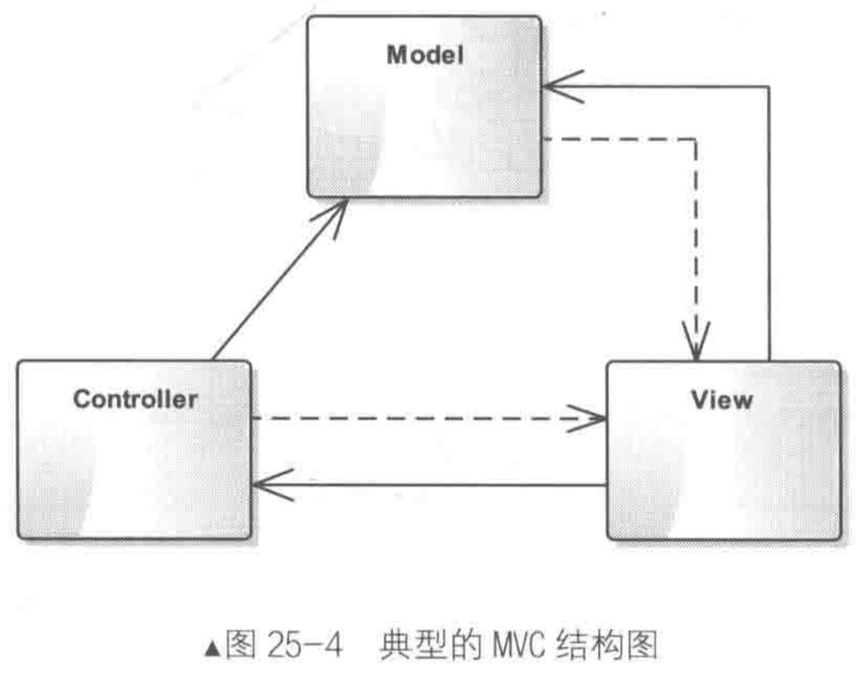
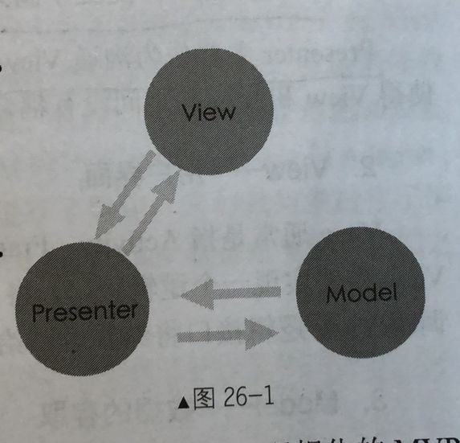
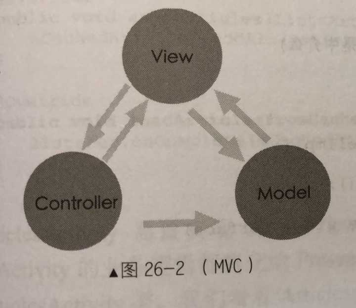
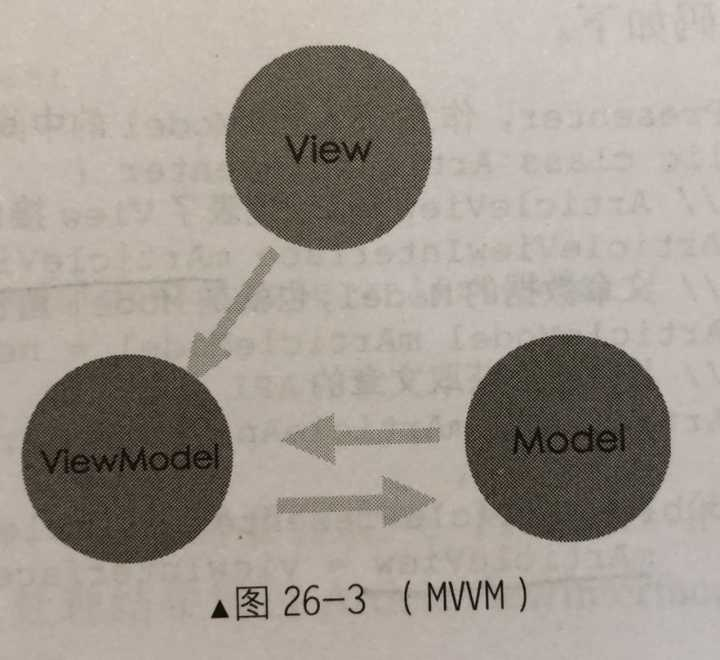

# MVC

MVC的全称是Model-View-Controller，也就是模型-视图-控制器。目的是为将数据模型和视图分离开来。MVC是一种框架模式而非设计模式。



- Model (模型层)：在MVC中Model一般用来保持程序的数据状态，比如数据存储、网络
  请求等，同时Model还与相应的View存在一定的耦合，通过某种事件机制（比如观察者模式）通知View状态的改变以此来让View更新。
  Model 还会接收来自Controller的事件，Model 也会允许View查询相关数据以显示自身状态。
- View (视图层)：View一般由一些GUI组件构成，同时响应用户的交互行为并触发Controller的逻辑，View还有可能会修改Model的状态以使其与Model保持同步，View还会通过在Model中注册事件监听Model的改变，以此来刷新自已并展示给用户，因此，比较好的View设计应该是被动的，只负责向用户展示以及交互。
- Controller (控制器)：控制器由View根据用户行为触发并响应来自View的用户交互，然后根据View的事件逻辑修改对应的Model，Controller并不关心View如何展示相关数据或状态，而是通过修改Model并由Model的事件机制来触发View的刷新。

> 小结
>
> View在Model中会注册事件监听Model的改变，从而改变自己的状态。View还有可能会修改Model的状态以保持同步
>
> View通过Controller来响应用户的交互，Controller将结果返回给View或者通过改变Model来改变View。

GOF把MVC看作是3种设计模式：观察者模式、策略模式与组合模式的合体，其核心在观察者模式。

优点：

- 理解容易，技术含量不高，易于维护和修改。
- 耦合性不高
- 等

缺点：

- 没有明确的含义，完全理解MVC模式并不是很容易。
- 等

MVC更适合规模比较大的项目。

## MVC在Android中的实现

View一般采用XML文件进行界面的描述。

Model对应于本地数据文件或网络获取的数据体，对数据的处理也会在这一层进行。

Controller对应于Activity，在Activity中获取数据和界面，将两者绑定。

# MVP

MVC的一个演化版本，全称Model-View-Presenter。

MVP能够有效降低View的复杂性，避免业务逻辑被塞进View中。同时会解除View和Model的耦合性，同时带来良好的可扩展性、可测试性。



- Presenter 交互中间人
  Presenter主要作为沟通View和Model的桥梁，它从Model层检索数据后，返回给View层，使得View和Model之间没有耦合，也将业务逻辑从View角色上抽离出来。
- View 用户界面
  View通常是指Activity、Fragment 或者某个View控件，它含有一个Presenter 成员变量。通常View需要实现一个逻辑接口，将View上的操作通过会转交给Presenter进行实现，最后，Presenter调用View逻辑接口将结果返回给View元素。
- Model 数据的存取
  对于一个结构化的App来说，Model角色主要是提供数据的存取功能。Presenter需要通过Model层存储、获取数据，Model 就像一个数据仓库。更直白地说，Model 是封装了数据库DAO或者网络获取数据的角色，或者两种数据获取方式的集合。

## 与MVC、MVVM的区别

**MVC的特点：**

- 用户可以向View发送指令，再由View直接要求Model改变状态。
- 用户也可以直接向Controller发送指令，再由Controller发送给View。
- Controller起到事件路由的作用，同时业务逻辑都部署在Controller。



由此可以看出，MVP与MVC的区别在于，View不能直接访问Model，需要通过Presenter发出请求。

**MVVM的特点：**



MVVM：Model-View-ViewModel

MVVM与MVP非常相似，唯一的区别是View和Model进行双向绑定，两者之间有一方发送变化则会反应到另一方。MVP和MVVM的主要区别则是：MVP中的View更新需要通过Presenter，而MVVM则不需要，因为View和Model进行了双向绑定，数据的修改会直接反应到View角色上，而View的修改也会导致数据的变更。

## 实现

Presenter

```java
public class Presenter {
    private IView view;
    private IModel model = new ModelImpl();
    private int n = 0;

    public Presenter(IView view) {
        this.view = view;
    }

    public void fetchTexts() {
        view.showLoading();
        List<String> texts = new ArrayList<>();
        for (int i = 0; i < 5; i++) {
            int r = (int) (Math.random() * 100);
            texts.add("第" + n + "个数字: " + r + "");
            n++;
        }
        view.showText(texts);
        view.hideLoading();
        model.saveTexts(texts);
    }

    public void loadTexts() {
        view.showText(model.loadTexts());
    }
}
```

View接口

```java
public interface IView {
    void showText(List<String> texts);
    void showLoading();
    void hideLoading();
}
```

Model

```java
public interface IModel {
    void saveTexts(List<String> texts);
    List<String> loadTexts();
}

public class ModelImpl implements IModel {
    private List<String> texts=new ArrayList<>();

    @Override
    public void saveTexts(List<String> texts) {
        this.texts.addAll(texts);
    }

    @Override
    public List<String> loadTexts() {
        return this.texts;
    }
}
```

Activity

```java
public class MVPActivity extends AppCompatActivity implements IView {
    private static final String TAG = "MVPActivity";
    private List<String> texts;
    private List<String> temp = new ArrayList<>();
    private Button button;
    private TextView textView;
    Handler handler = new Handler(new Handler.Callback() {
        @Override
        public boolean handleMessage(Message msg) {
            switch (msg.what) {
                case 0:
                    textView.setVisibility(View.VISIBLE);
                    break;
                case 1:
                    texts.addAll(temp);
//                    adapter.notifyDataSetChanged();
                    break;
                case 2:
                    textView.setVisibility(View.GONE);
                    break;
            }
            return false;
        }
    });
    private ListView listView;
    private ArrayAdapter adapter;
    private Presenter presenter;

    @Override
    protected void onCreate(Bundle savedInstanceState) {
        super.onCreate(savedInstanceState);
        setContentView(R.layout.activity_mvp);
        texts = new ArrayList<>();
        button = findViewById(R.id.btn);
        button.setOnClickListener(new View.OnClickListener() {
            @Override
            public void onClick(View v) {
                presenter.fetchTexts();
            }
        });
        textView = findViewById(R.id.text);
        listView = findViewById(R.id.list_view);
        adapter = new ArrayAdapter(this, android.R.layout.simple_list_item_1, texts);
        listView.setAdapter(adapter);

        presenter = new Presenter(this);
    }

    @Override
    public void showText(List<String> texts) {
        temp = texts;
        //模拟网络延迟
        handler.sendEmptyMessageDelayed(1, 1000);
    }

    @Override
    public void showLoading() {
        handler.sendEmptyMessage(0);
    }

    @Override
    public void hideLoading() {
    	//模拟网络延迟
        handler.sendEmptyMessageDelayed(2, 1010);
    }
}
```

xml

```xml
<LinearLayout xmlns:android="http://schemas.android.com/apk/res/android"
    xmlns:tools="http://schemas.android.com/tools"
    android:layout_width="match_parent"
    android:layout_height="match_parent"
    android:orientation="vertical"
    tools:context=".mvp.MVPActivity">

    <ListView
        android:id="@+id/list_view"
        android:layout_width="match_parent"
        android:layout_height="0dp"
        android:layout_weight="1" />

    <TextView
        android:id="@+id/text"
        android:layout_width="match_parent"
        android:layout_height="wrap_content"
        android:gravity="center"
        android:text="加载中"
        android:textColor="#000"
        android:textSize="25sp"
        android:visibility="gone" />

    <Button
        android:id="@+id/btn"
        android:layout_width="match_parent"
        android:layout_height="wrap_content"
        android:text="刷新" />
</LinearLayout>
```

这样Presenter处理数据，Activity对应View，Model存储数据。

> 另外，平时用惯了RecyclerView和对应的Adapter，没想到ArrayAdapter只要List改变，就会刷新一次，所以用了一个temp来存储texts。