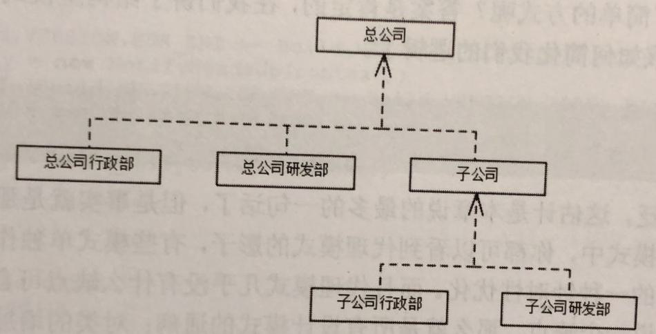

# 介绍

组合模式(Composite Pattem)也称为部分整体模式(Part-Whole Pattem)，结构型设计模式之一，组合模式比较简单，它将组相似的对象看作 一个对象处理，并根据一个树状结构来组合对象，然后提供一个统一的方法去访问相应的对象，以此忽略掉对象与对象集合之间的差别。生活中一个比较典型的例子就是组织结构的树状图。

上面是一个公司的组织结构树状图，其中总公司下有行政部与研发部，而且总公司下属还有一个子公司，虽然子公司也包含行政部与研发部，但是从总公司的角度来看子公司就是一个独立的个体，与总公司所属的行政部和研发部平级，如果我们以一个嵌套盒子的形式来展示将会更加直观，比如我们将上述的树形结构转为一个嵌套盒子，总公司则是最外层的盒子，里面包含3个小盒子，分别表示总公司的行政部、研发部和子公司，而子公司内部又包含有研发部与行政部。

在这么一个结构中大家可以看到虽然总公司和子公司其本质不一样，但是它在我们的组织结构中是一样的，我们可以把它们看作一个抽象的公司，在组合模式中我们将这样的一个拥有分支的节点称之为枝干构件，位于树状结构顶部的枝干结构比较特殊，我们称为根结构件，因为其为整个树状图的始端，同样对于像行政部和研发部这样没有分支的结构，我们则称为叶子构件，这样的一个结构就是组合模式的雏形。

# 定义

将对象组合成树形结构以表示“部分整体”的层次结构，使得用户对单个对象和组合对象的使用具有一致性。

# 使用场景

- 表示对象的部分-整体层次结构时。
- 从一个整体中能够独立出部分模块或功能的场景。