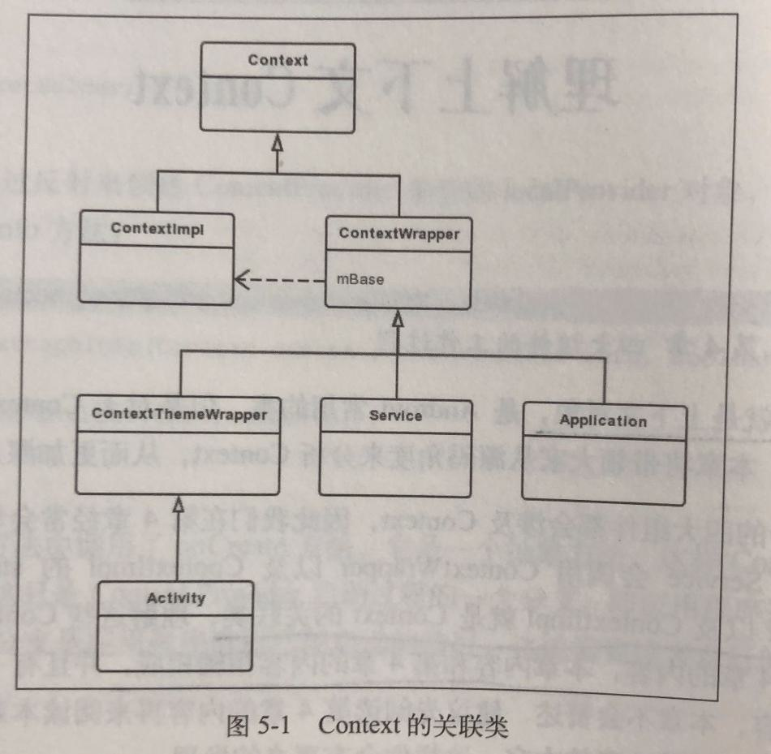

# 介绍

装饰模式(Decorator Pattern)也称为包装模式(Wrapper Patterm)，结构型设计模式之一，其使用一种对客户端透明的方式来动态地扩展对象的功能，同时它也是继承关系的一种替代方案之一。装饰物也许各不相同但是装饰的对象本质是不变的。

# 定义

动态地给一个对象添加一些额外的职责。 就增加功能来说，装饰模式相比生成子类更为灵活。

# 使用场景

需要透明且动态地扩展类的功能时。

# 角色介绍

- Component：抽象组件。
  可以是一个接口或抽象类， 其充当的就是被装饰的原始对象。
- ConcreteComponent：组件具体实现类。
  该类是Component类的基本实现，也是我们装饰的具体对象。
- Decorator：抽象装饰者。
  顾名思义，其承担的职责就是为了装饰我们的组件对象，其内部一定要有一个指向组件对象的引用。在大多数情况下，该类为抽象类，需要根据不同的装饰逻辑实现不同的具体子类。当然，如果装饰逻辑单一，只有一个的情况下我们可以省略该类直接作为具体的装饰者。
- ConcreteDecoratorA：装饰者具体实现类。只是对抽象装饰者作出具体的实现。

# 简单实现

人总是要穿衣服的，我们将人定义为一个抽象类，将其穿衣的行为定义为一个抽象方法。

```java
abstract class Person {
    /**
     * Person 下有一个穿着的抽象方法
     */
    abstract void dressed();
}
```

该类其实就是上面我们所提及的抽象组件类，也就是我们需要装饰的原始对象。具体的装饰对象：

```java
class Boy extends Person {
    @Override
    void dressed() {
        //Boy类下dressed方法的基本逻辑
        System.out.println("穿了内衣内裤");
    }
}
```

Boy类继承于Person 类，该类仅对Person 中的dressed方法作了具体的实现，而Boy类则是我们所要装饰的具体对象，现在需要一个装饰者来装饰我们的这个Boy对象，这里定义一个PersonCloth 类来表示人所穿着的衣服。

```java
abstract class PersonCloth extends Person {
    private Person mPerson;

    public PersonCloth(Person person) {
        mPerson = person;
    }

    @Override
    void dressed() {
      	//调用Person类中的dressed方法
        mPerson.dressed();
    }
}
```

在PersonCloth类中我们保持了一个对Person类的引用，可以方便地调用具体被装饰对象中的方法，这也是为什么我们可以在不破坏原类层次结构的情况下为类增加一些功能， 我们只需要在被装饰对象的相应方法前或后增加相应的功能逻辑即可。在装饰物只有一个的情况下，可不必声明一个抽象类作为装饰者抽象的提取，仅需定义一个普通的类表示装饰者即可，这里为了表明示例我们定义两种衣服类型，一个类ExpensiveCloth表示高档衣服。

```java
class ExpensiveCloth extends PersonCloth {
    public ExpensiveCloth(Person person) {
        super(person);
    }

    /**
     * 穿短袖
     */
    private void dressShirt() {
        System.out.println("穿件短袖");
    }

    /**
     * 穿皮衣
     */
    private void dressLeather() {
        System.out.println("穿件皮衣");
    }

    /**
     * 穿牛仔裤
     */
    private void dressJean() {
        System.out.println("穿条牛仔裤");
    }

    @Override
    void dressed() {
        super.dressed();
        dressShirt();
        dressLeather();
        dressJean();
    }
}
```

另一个类CheapCloth则表示便宜的衣服。

```java
class CheapCloth extends PersonCloth {
    public CheapCloth(Person person) {
        super(person);
    }

    /**
     * 穿短裤
     */
    public void dressShorts() {
        System.out.println("穿条短裤");
    }

    @Override
    void dressed() {
        super.dressed();
        dressShorts();
    }
}
```

这两个类本质上并没有区别，两者都是为原本Boy类中的dressed方法提供功能扩展，不过这种扩展并非是直接修改原有的方法逻辑或结构，更恰当地说，仅仅是在另一个类中将原有方法和新逻辑进行封装整合而已。

最后来看看客户类中的调用。

```java
class Client {
    public static void main(String[] args) {
        Person boy = new Boy();

        PersonCloth cheapCloth = new CheapCloth(boy);
        cheapCloth.dressed();

        PersonCloth expensiveCloth = new ExpensiveCloth(boy);
        expensiveCloth.dressed();
    }
}

穿了内衣内裤
穿条短裤
穿了内衣内裤
穿件短袖
穿件皮衣
穿条牛仔裤
```

# Android中的实现

Android中装饰模式的实现比较典型的就是Context的关联类。

这里再回顾一下装饰模式中的角色：

-   Component：抽象组件。
    可以是一个接口或抽象类， 其充当的就是被装饰的原始对象。
-   ConcreteComponent：组件具体实现类。
    该类是Component类的基本实现，也是我们装饰的具体对象。
-   Decorator：抽象装饰者。
    顾名思义，其承担的职责就是为了装饰我们的组件对象，其内部一定要有一个指向组件对象的引用。在大多数情况下，该类为抽象类，需要根据不同的装饰逻辑实现不同的具体子类。当然，如果装饰逻辑单一，只有一个的情况下我们可以省略该类直接作为具体的装饰者。
-   ConcreteDecoratorA：装饰者具体实现类。只是对抽象装饰者作出具体的实现。

再看一下Context的关联类：



Context是抽象组件。
ContextImpl是组件具体实现类。
ContextWrapper是抽象装饰者，不过ContextWrapper并不是抽象类，其内部有一个ContextImpl的引用mBase。
Activity、Service、Application是装饰者具体实现类。

# 理解Context

[理解上下文Context](../Android/理解上下文Context.md)

# 小结

装饰模式和代理模式有点类似。

装饰模式是以对客户端透明的方式扩展对象的功能，是继承关系的一个替代方案。装饰模式应该为所装饰的对象增强功能。

代理模式是给一个对象提供一个代理对象， 并由代理对象来控制对原有对象的引用。代理模式对代理的对象施加控制，但不对对象本身的功能进行增强。