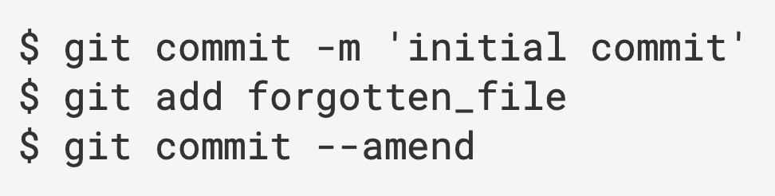

# 概念

Git 有三种状态，文件可能处于其中之一：

-   已提交(committed) 表示数据已经安全的保存在本地数据库中。
-   已修改(modified) 表示修改了文件，但还没保存到数据库中。
-   已暂存(staged) 。表示对一个已修改文件的当前版本做了标记，使之包含在下次提交的快照中。

# git配置

## 修改全局的用户名和邮箱

```
git config --global user.name "xxx"
git config --global user.email "xxx"
```

针对特定项目可以去掉--global

## 查看用户名和邮箱地址

```
git config user.name
git config user.email
```

## 查看所有配置

```
git config --list
```

# git基础

## **查看修改**

### 查看未暂存的差异（未add）

```
git diff
```

### 查看已add的差异

```
git diff --cached
```

## **撤销**

### 覆盖上一次提交								

```
git commit --amend
```

如：




## **提交记录**

### 查看提交记录

```
git log
--pretty=oneline/short/full/fuller，使用不同于默认格式的方式
```

### 查看在dev分支中但是不在master中的提交	

```
git log master..dev
```

### 查看具体提交内容

```
git show ...
```

## 查看远程服务器名称						

```
git remote
加-v参数可以查看对应的URL	
```

### 添加远程仓库

```
git remote add <shortname> <url>
```

### 从远程仓库拉取数据但不修改文件

```
git fetch <remote-name>
```

### 推送到远程仓库	

```
git push <remote-name> <branch-name>
```

# git分支

## 创建分支								

```
git branch <branch-name>
```

-   不加参数显示所有分支
-   参数-d删除分支
-   参数-r查看远程分支
-   参数-u跟踪远程分支
     git branch -u origin/master
-   参数--set-upstream-to更改跟踪的远程分支

## 切换分支

```
git checkout <branch-name>
```

-   切换之前要commit或者stash

## 创建和切换可以合在一起

```
git checkout -b <branch-name>
```

-   创建并切换到与远程分支同名的分支
     git checkout --track origin/xxx  

## 合并分支

```
git merge dev
```

-   注：在master分支下运行次命令表示master和dev进行合并
-   使用add来标记已解决冲突

## 推送

```
git push <remote-name> <branch-name>
```

-   如：git push origin master，这段命令和 git push origin refs/heads/master:refs/heads/master 
     以及 git push origin master:master 是一样的，表示把本地的master分支推送到远程仓库的master分支。
-   git push origin master ：本地master分支的最新修改推送至远程仓库
-   git push -u origin master：第一次推送master分支时，加上了-u参数，把本地的master分支内容推送的远程新的master分支，还会把本地的master分支和远程的master分支关联起来，在以后的推送或者拉取时就可以简化命令。
-   参数--delete表示删除远程分支：`git push <remote-name> --delete <branch-name>`

## 创建分支并跟踪远程分支					

```
git checkout -b dev origin/dev
```

-   与远程跟踪分支合并					 git merge origin/dev
-   注：跟踪远程分支后，git pull 命令会自动从跟踪的远程分支上拉取

# git储藏

## 储藏所有的，包括未跟踪的

```
git stash --all
```

# 其他

## 提交

提交之前先pull一下，一般加--rebase

```
git pull origin <远程分支名>:<本地分支名>
```

## 撤销							

```
git reset --soft HEAD^
```

HEAD^的意思是上一个版本，也可以写成HEAD~1，如果你进行了2次commit，想都撤回，可以使用HEAD~2

--soft  

不删除工作空间改动代码，撤销commit，不撤销git add .

## 回到某个提交，之前的提交消失 

```
git reset [id]
```

## 撤销某个add过的提交，.表示全部

```
git reset HEAD <file>
```

git push origin HEAD:refs/for/分支名

git merge --no-ff

# Git概念

## 提交对象

在进行提交操作时，Git 会保存一个提交对象(commit object)。该提交对象会包含一个指向暂存内容快照的指针。

但不仅仅是这样，该提交对象还包含了作者的姓名和邮箱、提交时输入的信息以及指向它的父对象的指针。

首次提交产生的提交对象没有父对象，普通提交操作产生的提交对象有一个父对象，

而由多个分支合并产生的提交对象有多个父对象。

## 快进fast-forward

由于当前master分支所指向的提交是hotfix的提交的直接上游，所以Git只是简单的将指针向前移动。

换句话说，试图合并两个分支时，如果顺着一个分支走下去能够到达另一个分支，那么Git在合并两者的时候，

只会简单的将指针向前推进(指针右移)，因为这种情况下的合并操作没有需要解决的分歧。