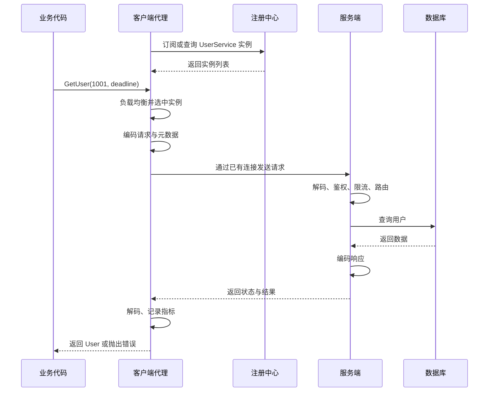
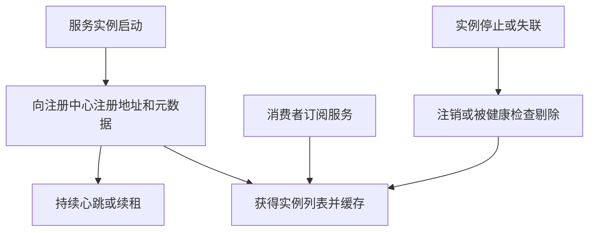
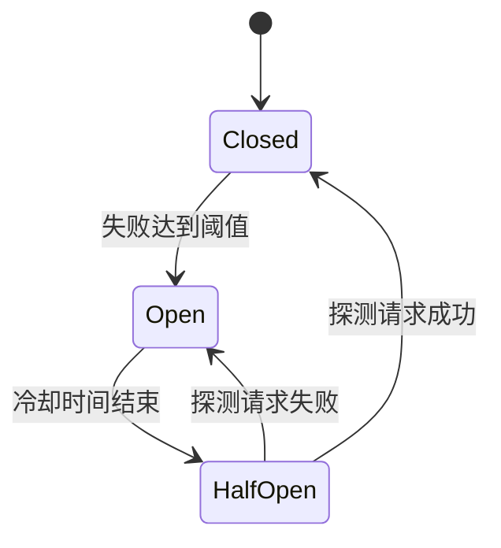

> 学习目标：理解一次 RPC 从客户端代码到服务端执行结果返回的完整链路，掌握服务发现、负载均衡、超时、重试、幂等、熔断、限流、可观测性等工程问题，并能判断何时适合使用 RPC。

# RPC 是什么

RPC（Remote Procedure Call，远程过程调用）是一种通信思想/调用模型：让调用方像调用本地函数一样，调用另一台机器或另一个进程中的函数。它主要解决的是：如何把跨进程、跨机器的网络通信，封装成清晰的方法调用。

```text
本地调用：result = userService.getUser(1001)
远程调用：result = userService.getUser(1001)
                         │
                         └── 实际上跨越了进程、网络和服务边界
```

## RPC 应用场景

RPC 并不专门面向 Android/iOS 到服务端，它可以用于任何进程之间的通信，但**一般面向服务端内部通信**，因为服务端内部更容易统一技术栈和接口版本。

## REST和RPC的区别

### 简单介绍REST

简单理解：**REST 是通过 HTTP 对资源进行增删改查的接口设计方式**。

REST（Representational State Transfer）是一种面向资源的**接口设计风格**，通常基于 HTTP。

例如管理用户资源：

```
GET    /users/1001  # 查询用户
POST   /users       # 创建用户
PUT    /users/1001  # 更新用户
DELETE /users/1001  # 删除用户
```

REST 的主要特点：

- 使用 URL 表示资源，例如 `/users/1001`。
- 使用 HTTP 方法表示操作。
- 请求之间无状态，服务端不依赖上一次请求。
- 通常使用 JSON 传输数据。
- 使用 HTTP 状态码表示结果，例如 `200`、`404`、`500`。


### 两者区别

> REST是一种面向资源的设计风格，主要用于获取资源。而RPC则是面向方法的调用模型，它可以不是面向资源的，比如放置一个数据缓存。
>

| REST                             | RPC                          |
| -------------------------------- | ---------------------------- |
| 面向资源，如 `/users/1001`       | 面向方法，如 `getUser(1001)` |
| 通常使用 HTTP + JSON             | 可使用 HTTP/2 + Protobuf 等  |
| 客户端主动构造 URL、参数和请求   | 通常通过生成的客户端代理调用 |
| 可读性好，便于浏览器和第三方接入 | 类型约束强，编码体积通常更小 |
| 常用于客户端或开放 API           | 常用于服务端之间调用         |

简单理解：

```
REST：请求一个用户资源
RPC：调用远程服务的 getUser 方法
```

RPC 和 REST 并非都要脱离 HTTP。gRPC 本身就是运行在 HTTP/2 之上的 RPC 框架。


### Android Retrofit

Retrofit 可以看作具有 RPC 使用体验的 HTTP 客户端框架，但它本身不是完整的 RPC 框架。

```
@GET("/users/{id}")
Call<User> getUser(@Path("id") long id);
```

调用时像执行本地方法：

```
api.getUser(1001);
```

但底层仍然是普通的 HTTP/REST 请求。

Retrofit 主要负责：

- 根据接口注解构造 HTTP 请求。
- 参数和 JSON 对象转换。
- 调用 OkHttp 完成网络通信。

它不包含服务注册发现、负载均衡和熔断等完整 RPC 治理能力。

## 为什么需要 RPC

在单体应用中，模块之间可以直接调用函数。系统拆分为多个服务后，服务运行在不同进程甚至不同机器上，原来的函数调用必须转化为网络请求。

如果业务自己处理 Socket、连接管理、序列化、超时和错误恢复，会产生大量重复代码。RPC 框架把这些通用能力封装起来，使开发者主要关注接口和业务逻辑。


# 核心组成

一次典型 RPC 调用涉及以下角色：


## 接口定义

> Protobuf 不是 RPC 协议，但 gRPC 默认使用它定义接口和序列化数据。

接口定义描述服务名、方法名、请求结构和响应结构。它是服务端与客户端之间的契约。

以 Protocol Buffers 为例：

```proto
syntax = "proto3";

package user.v1;

service UserService {
  rpc GetUser(GetUserRequest) returns (GetUserResponse);
}

message GetUserRequest {
  int64 user_id = 1;
}

message GetUserResponse {
  int64 user_id = 1;
  string nickname = 2;
}
```

IDL（Interface Definition Language，接口描述语言）可以作为跨语言契约。代码生成器根据 IDL 生成客户端 Stub、服务端接口以及请求响应模型，减少手写协议代码产生的不一致。

设计接口时应遵循以下原则：

RPC 接口设计通常遵循以下原则：

- 面向业务能力，而不是数据库结构。

  ```
  推荐：createOrder()
  不推荐：insertOrderTable()
  ```

- 调用粒度适中，避免大量细粒度请求。

  ```
  推荐：batchGetUsers(userIds)
  不推荐：循环调用 getUser(userId)
  ```

- 请求参数完整明确，减少隐式依赖。

  ```
  message CreateOrderRequest {
    string user_id = 1;
    repeated OrderItem items = 2;
  }
  ```

- 明确幂等性和错误语义。

  ```
  createOrder(idempotencyKey, items)
  ```

  重复请求使用同一个幂等 Key，避免重复创建订单。

- 保持向后兼容。

  ```
  message User {
    int64 id = 1;
    string name = 2;
    string avatar = 3; // 新增字段
  }
  ```

  可以新增字段，但不要修改或复用已有字段编号。

## Client Stub

Client Stub 也称客户端存根或客户端代理。对业务代码而言，它看起来像一个本地对象；在内部则负责：

1. 接收方法参数。
2. 构造 RPC 请求和元数据。
3. 选择服务实例。
4. 序列化并发送请求。
5. 等待响应或处理超时。
6. 反序列化响应。
7. 将结果或异常返回给业务代码。

Stub 隐藏了通信细节，但业务层仍需明确设置调用截止时间并处理远程错误。

## Server Stub 与分发器

Server Stub 接收网络数据，完成协议解码和反序列化，再由分发器根据服务名与方法名找到对应业务实现。业务执行完成后，Server Stub 将结果编码并返回。

服务端通常还会在调用业务方法前后执行拦截器，例如：

- 身份认证和权限校验。
- 请求参数校验。
- Trace 上下文解析。
- 日志和指标统计。
- 限流与过载保护。
- 异常到 RPC 状态码的转换。

## 序列化器

网络只能传输字节，内存对象必须序列化为字节，接收端再反序列化。

| 格式           | 特点                                       | 典型场景                     |
| -------------- | ------------------------------------------ | ---------------------------- |
| JSON           | 可读性好、调试方便、体积较大、解析开销较高 | 对外 API、低频调用           |
| Protobuf       | 二进制、体积小、速度快、依赖 Schema        | 内部高频 RPC、跨语言调用     |
| 语言原生序列化 | 使用方便但语言耦合强，安全和兼容风险较高   | 通常不建议作为跨服务长期协议 |

选择序列化格式时，需要同时考虑性能、跨语言、可调试性、Schema 演进和安全性，不能只比较一次基准测试的速度。

## 协议与消息边界

RPC 协议至少要表达：

- 请求 ID：匹配请求与响应。
- 服务名与方法名：定位目标方法。
- 消息类型：请求、响应、心跳、取消等。
- 正文长度：解决 TCP 字节流没有消息边界的问题。
- 序列化类型和压缩方式。
- 状态码与错误信息。
- Trace、认证、截止时间等元数据。

私有二进制协议通常采用固定头部加变长正文：

```text
+---------+---------+----------+-----------+-------------+
| Magic   | Version | RequestId| BodyLength| Payload ... |
+---------+---------+----------+-----------+-------------+
```

`Magic` 用于快速判断协议，`Version` 支持协议演进，`BodyLength` 用来正确拆包。

## 网络传输层

传输层负责连接建立、连接复用、数据收发和故障检测。

RPC 常见的传输方式包括：

- 基于 HTTP/2：支持多路复用、头部压缩和流式传输，gRPC 默认使用它。
- 基于 HTTP/1.1：生态成熟，但并发请求可能需要多个连接或处理队头阻塞。
- 基于 TCP 私有协议：控制力和性能上限较高，但开发、调试和跨网关接入成本更高。

长连接可以避免频繁握手，但需要处理空闲连接回收、心跳、半开连接、重连和服务端优雅下线。

# 一次调用的完整过程

下面以 `GetUser(1001)` 为例说明调用链路。



## 建立调用上下文

客户端会创建调用上下文，通常包含：

- 截止时间或超时时间。
- Trace ID、Span ID。
- 身份凭证。
- 灰度、路由、租户等标签。
- 请求优先级。

上下文应沿调用链继续传播。例如 A 调用 B，B 再调用 C 时，C 的截止时间不能晚于 A 留给整条链路的截止时间。

## 获取候选服务实例

客户端从服务发现模块获得健康实例列表。列表通常由注册中心主动推送并缓存在本地，而不是每次调用都实时查询注册中心，否则注册中心会进入关键请求路径。

## 负载均衡

RPC 负载均衡是从多个服务实例中选择一个处理当前请求，避免流量集中到单个实例。

```
客户端
  ├── 服务实例 A
  ├── 服务实例 B
  └── 服务实例 C
```

常见策略：

- 随机：实现简单，在实例同质且请求量大时效果较好。
- 轮询：依次选择实例。
- 加权随机或加权轮询：高配置实例承担更多请求。
- 最少活跃调用：倾向当前负载较低的实例。
- 一致性哈希：相同 Key 尽量落到同一实例，适合有局部状态的场景。
- 延迟感知：结合近期延迟和错误率动态选择。

RPC 框架通常从注册中心获得可用实例列表，再在客户端执行负载均衡：

```
服务发现 → 获取实例列表 → 负载均衡 → 发起 RPC 调用
```

### 服务注册与发现

服务实例的地址会因扩容、缩容、发布和故障不断变化，因此通常不能把 IP 和端口永久写死在客户端。

#### 基本流程



注册信息通常包括服务名、IP、端口、版本、机房、分组、权重和健康状态。

#### 客户端发现与服务端发现

客户端发现是客户端直接从实例列表中选择地址，少一次中间转发，但客户端需要集成服务治理能力。

服务端发现是请求先到负载均衡器或代理，再由代理选择实例。客户端更简单，治理逻辑也更集中，但多了一层网络跳转。

Service Mesh 通常通过 Sidecar 或节点代理承载发现、负载均衡、重试和追踪，使业务进程不必绑定某一种 RPC SDK。

#### 健康检查

健康状态至少可分为：

- 存活：进程是否还在运行。
- 就绪：当前是否可以接收流量。
- 业务健康：依赖和关键功能是否正常。

实例启动后应在预热完成再标记为就绪；下线时应先摘除流量，再等待正在处理的请求结束，最后关闭进程。

#### 实例部署上线

新实例部署时，不应在进程刚启动后立即承接完整流量。推荐流程如下：

1. 启动进程，加载配置、证书和服务实现。
2. 初始化线程池、连接池以及数据库、缓存等依赖。
3. 执行必要的缓存加载、JIT 预热和内部自检。
4. 启动 RPC 端口，通过存活检查和就绪检查。
5. 向注册中心注册服务名、地址、版本、机房和权重等信息，或将实例状态改为就绪。
6. 注册中心把实例变更推送给消费者，消费者更新本地实例列表。
7. 先使用较小权重或灰度流量验证延迟和错误率，再逐步增加流量。

```text
启动进程 → 初始化依赖 → 预热与自检 → 标记就绪
        → 注册实例 → 消费者更新列表 → 灰度放量
```

如果实例尚未完成初始化就被注册，首批请求可能因缓存未加载、连接池未建立或 JIT 尚未预热而出现高延迟和大量超时。

#### 实例下线

正常发布、缩容或维护时，应执行优雅下线：

1. 将实例标记为不再就绪，并从注册中心注销或把权重降为零。
2. 等待注册中心变更传播到消费者，避免消费者继续选择该实例。
3. 停止接收新的业务调用；对过时客户端发来的新请求返回明确的可重试状态。
4. 在限定的宽限期内等待正在执行的请求完成。
5. 向客户端发送连接关闭信号，关闭监听端口、连接池和其他资源。
6. 宽限期结束后取消剩余任务，最后停止进程。

```text
摘除流量 → 等待发现信息传播 → 拒绝新调用
        → 排空在途请求 → 关闭连接与资源 → 停止进程
```

实例崩溃、机器断电等异常下线无法执行上述流程。注册中心需要根据心跳或租约超时移除实例，客户端也应通过连接失败、健康检查和被动故障剔除及时停止选择它。只有在操作可重试、满足幂等要求且剩余截止时间充足时，客户端才能改选其他实例重试。


### 实例过时

如果客户端访问了过时实例：

- 调用可能连接失败或超时。
- 客户端会暂时标记或剔除该实例。
- 从注册中心刷新实例列表。
- 如果操作可重试且时间充足，则选择其他实例重试。

服务端正常发布时应先从注册中心摘除并停止接收新流量，再等待已有请求完成，以减少访问过时实例的情况。


## 服务端处理

服务端网络线程收到字节后完成拆包与解码，将任务交给业务执行器。实际实现中要避免在少量 I/O 线程执行阻塞业务，否则一个慢请求可能阻塞大量连接。

调用通常依次经过：

```text
网络接收 → 协议解码 → 鉴权 → 限流 → 参数校验
        → 方法分发 → 业务执行 → 异常转换 → 响应编码 → 网络发送
```

## 响应与完成

客户端根据请求 ID 找到正在等待的调用，解析状态码和响应对象，并完成对应的 Future、Promise 或协程。

若响应到达时客户端已经超时，响应通常会被丢弃，但服务端业务不一定停止。支持取消传播的框架会通知服务端取消；业务代码仍要主动响应取消，而且已经提交的数据库事务未必能回滚。

# 调用模型

## 一元调用

客户端发送一个请求，服务端返回一个响应，是最常见的模型：

```text
Request → Response
```

适合查询、创建、更新等普通业务接口。

## 单向调用

客户端发送后不等待业务响应。它只能说明数据可能已经写入网络缓冲区，不能保证服务端已收到或已处理。

对于要求可靠投递、削峰或异步重试的业务，消息队列通常比单向 RPC 更合适。

## 异步调用

客户端立即获得 Future、Promise 或回调句柄，稍后再获取结果。异步调用能减少线程阻塞，但不会自动降低下游负载；如果没有并发上限，反而更容易压垮服务。

## 流式调用

流式 RPC 可以是服务端流、客户端流或双向流：

- 服务端流：一个请求对应连续多个响应。
- 客户端流：客户端连续发送多个消息，服务端最终返回一个响应。
- 双向流：双方独立发送消息。

流式调用需要额外处理流控、背压、断线恢复、消息顺序和长连接生命周期。


# 超时与截止时间

任何跨进程调用都必须有超时。没有超时的请求会长期占用线程、连接、内存和上游请求上下文，故障最终可能扩散到整个系统。

## 超时的层次

一次调用可能同时存在：

- 连接超时：建立连接最多等待多久。
- 写超时：发送请求最多等待多久。
- 读超时：等待响应最多等待多久。
- 调用截止时间：整个 RPC 必须在某个时间点前完成。

截止时间比单独的读超时更容易跨服务传播。

## 超时预算

若入口请求总预算为 800 ms，服务 A 不能给每个串行下游都设置 800 ms。它要预留自身处理和返回时间，再按调用链分配预算：

```text
入口总预算 800 ms
├── A 自身处理与安全余量 150 ms
├── 调用 B 预算 350 ms
└── 调用 C 预算 300 ms
```

实际数值应结合延迟分位数、业务优先级和故障恢复成本设置，不能只使用平均延迟。

## 超时不代表未执行

客户端超时只表示“在截止时间前没有拿到结果”。可能出现：

1. 请求尚未到达服务端。
2. 请求到达但还未执行。
3. 业务已执行，响应在网络中丢失或延迟。
4. 业务正在执行，客户端先放弃等待。

因此，对写操作盲目重试可能造成重复扣款、重复下单等问题。

## 写操作超时如何处理

写操作超时后，应把结果视为“状态未知”，不能直接认定失败，也不能使用新的请求重复执行。网络写超时只说明客户端未在规定时间内完成发送，请求可能尚未到达、部分到达，也可能已经被服务端完整接收并执行。

推荐处理方式：

1. 客户端为每次业务操作生成唯一的幂等 Key，并在重试时复用同一个 Key。
2. 服务端通过唯一约束或幂等记录保存处理状态、请求参数摘要和执行结果，防止重复扣款或重复下单。
3. 超时后优先使用幂等 Key、订单号等查询操作状态：成功则返回原结果，处理中则等待或异步通知，不存在时才考虑重试。
4. 只对临时网络故障进行有限重试，并使用指数退避、随机抖动和总截止时间。
5. 对仍无法确认的操作，通过后台对账、可靠事件或补偿任务修复，重要业务应允许人工介入。

```text
发起写请求（携带幂等 Key）
        ↓
发生超时，结果未知
        ↓
查询操作状态
├── 已成功：返回第一次的结果
├── 处理中：等待或异步通知
└── 不存在：使用原幂等 Key 有限重试
```

客户端取消或超时不会自动回滚服务端已经提交的事务，最终状态应以服务端幂等记录和权威数据源为准。

# 重试与幂等

## 何时可以重试

适合自动重试的情况通常是短暂网络错误、连接失败、服务临时不可用或明确的可重试状态码。

不应默认重试的情况包括：

- 参数错误和权限错误。
- 明确的业务失败。
- 服务端持续过载。
- 无法保证幂等的写操作。
- 剩余时间不足以完成下一次尝试。

## 退避和抖动

立即、同步重试会形成重试风暴。常用策略是指数退避加随机抖动：

```text
第 1 次等待：约 50 ms
第 2 次等待：约 100 ms
第 3 次等待：约 200 ms
```

随机抖动使大量客户端不会在完全相同的时间再次请求。重试还应设置最大次数、总时间预算和并发上限。

## 重试放大

若 A 调用 B、B 调用 C，每层都最多尝试 3 次，最坏情况下 C 可能承受 `3 × 3 = 9` 次请求。调用链越深，放大越明显。

通常应由最了解业务语义的一层负责重试，并限制总尝试次数。服务过载时，更重要的是快速失败和削减流量，而不是增加重试。

## 幂等设计

幂等表示同一个操作执行一次和执行多次，对业务最终状态的影响相同。

读取天然通常是幂等的。创建订单、扣款等写操作需要显式设计：

```text
客户端生成 idempotency_key
        ↓
服务端以该 Key 建立唯一约束或幂等记录
        ↓
首次请求执行业务并保存结果
        ↓
重复请求直接返回第一次的结果
```

幂等记录要明确作用域、有效期、请求参数摘要和结果保存方式。相同 Key 携带不同参数时应拒绝，避免误把两个不同操作合并。

# 错误模型

## 错误分类

调用方应区分三类错误：

- 业务错误：余额不足、用户不存在、状态不允许。
- 系统错误：服务端异常、依赖故障、资源耗尽。
- 通信错误：连接失败、超时、协议错误、取消。

只有稳定、可判断的错误分类，调用方才能正确决定重试、降级还是直接返回。

## 状态码设计

状态码应表达机器可判断的语义，人类可读错误信息只用于诊断。不要让客户端通过匹配错误字符串决定逻辑。

错误响应通常应包含：

- 稳定错误码。
- 简洁错误描述。
- 是否可重试，或可由错误类型推断重试策略。
- 请求 ID 或 Trace ID。
- 必要的结构化详情。

服务端内部堆栈和敏感信息不应直接返回客户端。

# 服务保护

## 限流

限流控制单位时间内允许通过的请求量或并发量。常见算法有令牌桶、漏桶、滑动窗口和并发信号量。

限流可以部署在：

- 网关：保护整个服务集群。
- 服务端：保护单个实例和具体方法。
- 客户端：在请求发出前进行自我约束。

限流维度可包括调用方、租户、用户、接口和优先级。被限流时应快速返回明确状态，并避免所有客户端立即重试。

### 令牌桶

令牌桶按照固定速率向容量有限的桶中放入令牌，每个请求必须取得一个或多个令牌才能通过。桶满后新令牌会被丢弃；没有令牌时，请求可以立即失败或等待令牌。

```text
按每秒 r 个生成令牌 → 容量为 b 的令牌桶 → 请求获取令牌 → 执行
                                          └─ 无令牌 → 拒绝或等待
```

令牌桶把长期平均速率限制在约 `r`，同时允许系统利用桶中积累的令牌处理最多约 `b` 的短时突发流量。它适合大多数 RPC 接口和 API 网关。

### 漏桶

漏桶把到达的请求放入容量有限的队列，再按照固定速率从桶底流出并执行。桶满后继续到达的请求会被拒绝。

```text
突发请求 → 容量有限的等待队列 → 按固定速率处理
                └─ 队列已满 → 拒绝
```

漏桶可以把不稳定的输入流量整形成平稳输出，适合下游只能以稳定速率处理请求的场景。缺点是突发请求需要排队，会增加等待延迟，也不能像令牌桶一样充分利用空闲时期积累的处理能力。

### 滑动窗口

滑动窗口统计“当前时间点之前一段时间”内的请求数，超过阈值后拒绝新请求。例如限制任意连续 60 秒内最多调用 1,000 次。

常见实现有：

- 滑动日志：记录每次请求的时间戳，统计准确，但内存和清理成本较高。
- 滑动窗口计数器：把时间分成多个小格，累加窗口覆盖的格子，资源消耗较小，但结果是近似值。

滑动窗口能够避免固定窗口在时间边界处产生流量翻倍的问题，适合按用户、租户或接口限制一段时间内的请求次数。

### 并发信号量

并发信号量限制正在执行的请求数量，而不是单位时间内的请求总数。请求执行前获取许可，执行完成、失败或取消时必须释放许可。

```text
最大并发数 = 100
├── 当前执行数 < 100：获得许可并执行
└── 当前执行数 = 100：拒绝或限时等待
```

它适合保护线程池、连接池、数据库或慢速下游。请求越慢，许可占用时间越长，系统会更早停止接收新请求。实现时应在 `finally` 中释放许可，并限制等待时间，避免许可泄漏或形成无限等待队列。

### 算法对比

| 算法 | 主要限制 | 是否允许突发 | 典型场景 |
| --- | --- | --- | --- |
| 令牌桶 | 平均请求速率 | 允许有限突发 | RPC 接口、API 网关 |
| 漏桶 | 固定处理速率 | 不允许直接突发 | 保护处理能力稳定的下游 |
| 滑动窗口 | 时间段内请求次数 | 取决于窗口阈值 | 用户、租户、接口配额 |
| 并发信号量 | 同时执行的请求数 | 取决于可用许可 | 线程池、连接池和慢调用保护 |


## 熔断

当某个下游的错误率或超时率持续超过阈值，熔断器暂时阻止请求继续到达它。



- Closed：正常放行并统计结果。
- Open：快速失败，不再请求下游。
- Half-Open：放少量探测请求判断是否恢复。

熔断的目标是阻断故障传播并给下游恢复时间，不是修复下游故障。

## 隔离

隔离防止一个异常依赖耗尽所有资源。常见做法包括：

- 不同下游使用独立连接池。
- 不同业务使用独立线程池或并发配额。
- 核心与非核心流量分组。
- 对慢调用限制最大并发。

## 降级

下游不可用时，可以根据业务返回缓存、默认值、部分数据或稍后处理。降级必须明确其业务含义，不能把“空数据”伪装成正常且完整的结果。

## 背压与负载拒绝

当服务消费速度跟不上生产速度时，应限制队列长度并尽早拒绝新请求。无限队列只是把过载转化为更高延迟和最终的内存耗尽。

# 一致性与调用语义

分布式系统很难仅靠 RPC 提供真正的“恰好一次”执行。常见语义是：

- 至多一次：不重试，可能丢失，但避免重复。
- 至少一次：失败后重试，尽量不丢失，但可能重复。
- 效果上的恰好一次：通过幂等键、唯一约束和事务，使重复执行不产生额外业务效果。

跨服务写操作还可能出现部分成功。例如订单创建成功，但库存调用超时。可选策略包括：

- 本地事务加可靠事件。
- Saga 补偿事务。
- 状态机与后台对账。
- TCC 等分布式事务方案。

这些属于分布式一致性设计，不能依赖“RPC 没报错”来替代。

# 连接管理

## 连接池

连接池复用已建立的连接，减少握手成本。需要关注：

- 每个地址的最小和最大连接数。
- 单连接最大并发流数量。
- 获取连接的等待时间。
- 空闲连接和最大生命周期。
- 连接失败后的退避重连。

连接数并非越大越好。大量连接会消耗两端文件描述符、内存和调度资源。

## 心跳与空闲检测

心跳用于发现长时间无业务流量时的失效连接。周期过短会产生额外流量，周期过长则故障发现慢。

应用层心跳不能代替业务健康检查；连接正常只表示通信通道存在，不代表服务有能力处理请求。

## 优雅关闭

服务端发布或缩容时应：

1. 标记为不再就绪或从注册中心摘除。
2. 停止接收新调用。
3. 等待正在处理的请求在限定时间内结束。
4. 取消剩余任务并关闭连接。

客户端收到连接关闭后，应刷新实例列表并在满足重试条件时选择其他实例。

# 可观测性

## 日志

RPC 日志应包含结构化字段：

- Trace ID、请求 ID。
- 调用方与被调用方。
- 服务、方法和版本。
- 耗时、状态码、重试次数。
- 目标实例和机房。

要避免记录密码、Token、身份证号等敏感数据，也不应无条件打印大型请求正文。

## 指标

核心指标可以用 RED 方法组织：

- Rate：请求速率。
- Errors：错误数和错误率。
- Duration：延迟分布，重点关注 P50、P95、P99。

还应观察并发数、队列长度、连接数、超时率、重试率、限流率、熔断状态和请求/响应大小。

平均延迟可能掩盖长尾问题。例如绝大多数请求为 10 ms，少量请求为数秒，平均值看起来仍可能正常，因此需要分位数。

## 分布式追踪

分布式追踪将跨服务调用组织为一条 Trace，每次 RPC 是其中一个 Span。它能回答：

- 时间消耗在哪个服务。
- 哪个下游首先失败。
- 是否发生重试或跨机房调用。
- 请求经过了哪些服务和实例。

Trace 上下文应通过 RPC 元数据传播，且服务端创建自己的子 Span，而不是覆盖上游 Trace。

# 安全

## 传输安全

跨不可信网络或包含敏感数据时应使用 TLS。内部服务也可使用双向 TLS，使客户端和服务端相互验证身份。

## 身份认证与授权

认证回答“调用方是谁”，授权回答“它能否调用此方法或访问此资源”。不要仅依赖来源 IP 做身份判断，因为代理、容器调度和网络变化会削弱它的可靠性。

## 输入安全

服务端不能因为调用来自“内部网络”就信任输入，应执行：

- 字段长度、范围和格式校验。
- 消息总大小限制。
- 递归深度和集合元素数限制。
- 解压后大小限制，防止压缩炸弹。
- 安全的反序列化，避免实例化任意类型。

# 接口演进与兼容性

分布式发布期间，新旧客户端和新旧服务端会同时存在，接口必须支持滚动升级。

## 兼容原则

- 新增可选字段通常比修改原字段安全。
- 不改变字段编号、类型和原有语义。
- 删除字段后保留其编号，不分配给新字段。
- 枚举新增值时，旧客户端要能处理未知值。
- 新增必填语义时提供合理默认行为。
- 先发布能兼容新旧请求的服务端，再升级客户端。

## 版本策略

小幅兼容演进可维持同一接口版本；语义发生根本变化时，应创建新版本并提供迁移期。版本号不能替代兼容设计，因为同时维护大量版本也会增加复杂度。

# 性能优化

优化前应通过指标和 Profiling 定位瓶颈。常见方向包括：

- 合并过细请求，减少网络往返。
- 使用连接复用和多路复用。
- 选择合适的二进制序列化。
- 避免重复编码、复制和对象分配。
- 对足够大的正文再压缩，避免小消息压缩得不偿失。
- 使用批量接口，但限制批次大小。
- 控制并发和队列，防止延迟失控。
- 避免跨地域同步 RPC，或明确接受其高延迟和故障概率。

## 注意 N+1 远程调用

下面的写法会为用户列表中的每个用户发起一次远程请求：

```text
users = listUsers()
for user in users:
    user.profile = profileService.getProfile(user.id)
```

若有 100 个用户，就产生 100 次 RPC。更合理的方案通常是提供受控的批量查询接口：

```text
profiles = profileService.batchGetProfiles(userIds)
```

批量接口要限制最大 Key 数和响应大小，防止单个请求占用过多资源。

# 与其他通信方式的比较

## RPC 与本地调用

| 维度 | 本地调用 | RPC |
| --- | --- | --- |
| 延迟 | 纳秒到微秒级为主 | 通常为毫秒级，可能出现长尾 |
| 失败 | 主要是程序异常 | 还包括超时、断网、对端故障 |
| 参数 | 可共享复杂对象或引用 | 必须序列化，不能共享内存引用 |
| 结果 | 通常可立即确定 | 超时后可能不知道服务端是否执行 |
| 版本 | 同一进程一起发布 | 客户端与服务端可能独立发布 |

接口外观相似不代表成本相似。代码评审时应让远程边界清晰，避免开发者在循环中无意调用大量 RPC。

## RPC 与 REST

见上

## RPC 与消息队列

| 维度 | RPC | 消息队列 |
| --- | --- | --- |
| 交互 | 通常同步请求响应 | 通常异步投递消费 |
| 时间耦合 | 调用时双方通常都要可用 | 消费者可稍后处理 |
| 延迟 | 适合立即获取结果 | 适合削峰和后台处理 |
| 故障处理 | 超时、重试、熔断 | 持久化、重投、死信、幂等消费 |
| 典型场景 | 查询、需要即时结果的操作 | 事件通知、异步任务、流量削峰 |

如果业务必须立即知道处理结果，RPC 更自然；如果业务更关心可靠投递和解耦，消息队列往往更合适。


# 面试题

## 基础必问题

### 🌟🌟🌟 什么是 RPC？它主要解决什么问题？

RPC（Remote Procedure Call，远程过程调用）是一种通信思想/调用模型：让调用方像调用本地函数一样，调用另一台机器或另一个进程中的函数。它主要解决的是：如何把跨进程、跨机器的网络通信，封装成清晰的方法调用（让调用方更关注业务调用，避免关心网络通信细节）。


### 🌟🌟🌟 RPC 调用和本地方法调用有什么本质区别？

| 维度 | 本地调用             | RPC                            |
| ---- | -------------------- | ------------------------------ |
| 延迟 | 纳秒到微秒级为主     | 通常为毫秒级，可能出现长尾     |
| 失败 | 主要是程序异常       | 还包括超时、断网、对端故障     |
| 参数 | 可共享复杂对象或引用 | 必须序列化，不能共享内存引用   |
| 结果 | 通常可立即确定       | 超时后可能不知道服务端是否执行 |
| 版本 | 同一进程一起发布     | 客户端与服务端可能独立发布     |

接口外观相似不代表成本相似。代码评审时应让远程边界清晰，避免开发者在循环中无意调用大量 RPC。


### 🌟🌟🌟 一次完整的 RPC 调用经过哪些步骤？

1. 业务代码发起调用

2. 客户端代理接收调用
   `Client Stub` 或动态代理拦截方法调用，获取服务名、方法名和参数，并创建请求 ID、超时时间、Trace ID 等调用上下文。

3. 获取服务实例
   客户端从本地缓存的服务列表中获取可用实例。该列表通常由注册中心订阅并动态更新，而不是每次调用都查询注册中心。

4. 负载均衡选择实例
   客户端使用随机、轮询、最少活跃等算法，从多个可用实例中选择一个目标地址。

5. 序列化并编码请求
   客户端将方法参数通过 Protobuf、JSON、Thrift 等格式序列化为字节，并添加协议头：

   ```
   请求 ID、服务名、方法名、正文长度、超时时间、认证信息、请求参数
   ```

6. 发送网络请求
   请求通过 HTTP/2、TCP 私有协议等方式发送。RPC 框架通常会复用连接池中的长连接，避免每次重新建立连接。

7. 服务端接收并解析请求
   服务端接收字节数据后进行拆包、协议解码和反序列化，恢复出服务名、方法名和参数。

8. 执行服务端拦截器
   在调用业务方法前，服务端通常会进行鉴权、参数校验、限流、Trace 记录和超时检查。

9. 查找并执行目标方法
   服务端分发器根据服务名和方法名找到对应实现，然后调用真正的业务逻辑，例如查询数据库。

10. 构造并发送响应
    服务端将业务结果或异常转换为响应对象，添加状态码，再进行序列化和协议编码，通过网络返回客户端。

11. 客户端处理响应
    客户端根据请求 ID 找到对应调用，反序列化响应，记录耗时、状态码和链路追踪信息。

12. 返回业务结果
    调用成功时返回结果；调用失败时抛出超时、网络、系统或业务异常。框架可能根据配置执行重试、熔断或降级。

完整流程可以概括为：

```
调用方法
→ 客户端代理
→ 服务发现
→ 负载均衡
→ 序列化
→ 网络传输
→ 服务端解码
→ 方法分发
→ 业务执行
→ 返回响应
→ 客户端反序列化
```


### 🌟🌟 RPC 框架通常由哪些模块组成？

代理、注册中心、路由、负载均衡、协议、序列化、网络通信、线程模型、容错、监控。

### 🌟🌟 Stub、Proxy、Skeleton 分别是什么？

客户端代理隐藏网络调用；服务端骨架负责解码、方法定位和调用业务实现。

### 🌟🌟 为什么 RPC 通常使用动态代理？

将接口调用转换为统一的远程请求；隐藏服务发现、编码和网络传输；JDK Proxy、字节码生成。

### 🌟 RPC 是一种协议吗？

答题关键词：RPC 是调用模型，不是具体协议；底层可以使用 HTTP/2、HTTP/1.1、TCP 私有协议或其他传输方式。

### 🌟🌟🌟 RPC 和 HTTP、REST 是什么关系？

答题关键词：RPC 强调调用方法，REST 强调操作资源；RPC 也可以基于 HTTP；不能简单理解为“RPC 就是 TCP”。

### 🌟🌟 RPC 和消息队列有什么区别？

答题关键词：同步与异步、时间耦合、即时响应、可靠投递、削峰、重试和消费语义。


## 协议与网络题

### 🌟🌟 如何设计一个简单的 RPC 私有协议？

答题关键词：魔数、版本、消息类型、请求 ID、正文长度、序列化类型、压缩类型、状态码、正文。

### 🌟🌟🌟 基于 TCP 的 RPC 如何解决粘包和拆包？

答题关键词：固定长度、分隔符、消息头携带正文长度；TCP 是字节流，没有天然消息边界。

### 🌟🌟 请求 ID 有什么作用？

答题关键词：在连接复用和异步调用中匹配请求与响应，也可用于日志定位。

### 🌟🌟 为什么 RPC 通常使用长连接？

答题关键词：减少 TCP/TLS 握手、降低延迟、连接复用；同时要处理心跳、半开连接、重连和优雅下线。

### 🌟🌟 心跳、Keepalive 和健康检查有什么区别？

答题关键词：

- Keepalive 判断连接是否存活。
- 心跳可以检测对端进程或通信通道。
- 健康检查判断服务是否有能力处理业务请求。

gRPC 官方也特别强调 Keepalive 与 Health Checking 是两个不同问题。[gRPC Keepalive](https://grpc.io/docs/guides/keepalive/)、[gRPC 健康检查](https://grpc.io/docs/guides/health-checking/)

### 🌟🌟🌟 gRPC 为什么使用 HTTP/2？

答题关键词：多路复用、二进制帧、头部压缩、双向流、长连接。

### 🌟 HTTP/2 多路复用是否彻底消除了队头阻塞？

答题关键词：消除了 HTTP/1.1 请求级队头阻塞，但多个流仍共享 TCP；发生丢包时可能共同等待 TCP 重传。

### 🌟 RPC 如何处理大请求和大响应？

答题关键词：消息大小限制、流式传输、分页、批量上限、压缩、背压，避免一次把全部内容读入内存。


## 序列化题

### 🌟🌟🌟 常见序列化方式有哪些？如何选择？

JSON、Protobuf、Thrift、MessagePack；

比较体积、性能、跨语言、可读性和兼容性。

### 🌟🌟🌟 Protobuf 为什么通常比 JSON 更小、更快？

二进制编码、字段编号、无需传输完整字段名、Schema 已知、Varint。

### 🌟🌟 Protobuf 的 Varint 是什么？有什么优缺点？

答题关键词：小整数用更少字节；数值越大占用字节越多；负数通常配合 ZigZag 编码。

### 🌟🌟 Protobuf 接口如何保持前后兼容？

答题关键词：

- 可以增加新字段。
- 不能随意修改已有字段编号。
- 删除字段后应保留字段编号和名称。
- 旧客户端需要正确处理未知枚举值。
- 新字段不能依赖旧客户端无法提供的必填语义。

Protobuf 官方明确指出字段编号一旦投入使用就不能修改，也不应该重复使用已删除字段的编号。[Protobuf Proto3 指南](https://protobuf.dev/programming-guides/proto3/)

### 🌟 为什么不推荐使用 Java 原生序列化作为长期 RPC 协议？

答题关键词：语言绑定、兼容性弱、体积和性能问题、反序列化安全风险。

### 所有 RPC 消息都适合压缩吗？

答题关键词：小消息压缩可能得不偿失；压缩节省带宽但增加 CPU 和延迟，应根据正文大小和网络环境决定。


## 服务发现与负载均衡题

### 🌟🌟🌟 服务注册与发现是如何工作的？

答题关键词：服务提供者注册、心跳或续租、消费者订阅实例列表、本地缓存、实例上下线通知。

### 🌟🌟🌟 如果注册中心宕机，服务之间还能调用吗？

答题关键词：消费者通常缓存实例列表，已有调用可以继续；新实例发现和故障实例摘除可能受到影响；注册中心不应处于每次调用的同步链路。

### 🌟🌟 客户端服务发现和服务端服务发现有什么区别？

答题关键词：

- 客户端发现：客户端拿到实例列表并执行负载均衡。
- 服务端发现：请求先经过代理、网关或负载均衡器。
- 比较治理能力、客户端复杂度和额外网络跳转。

### 🌟🌟🌟 常见负载均衡算法有哪些？

答题关键词：随机、加权随机、轮询、加权轮询、最少活跃、最短响应、一致性哈希、P2C、自适应。

### 🌟🌟 一致性哈希适合什么场景？

答题关键词：相同 Key 尽量落到相同实例；适合局部状态、缓存亲和；扩缩容时减少映射变化；仍需处理热点 Key。

### 🌟 最少连接、最少活跃调用和最短响应有什么区别？

答题关键词：连接数不一定等于负载；活跃调用更接近当前并发；最短响应依赖历史延迟，可能受到采样和慢启动影响。

### 🌟 新实例上线后为什么需要预热？

答题关键词：JIT、连接池、本地缓存、线程池尚未准备完成；立即接收完整流量可能造成高延迟和错误。

Dubbo 官方列出了加权随机、加权轮询、最少活跃、最短响应、一致性哈希、P2C 和自适应等策略。[Dubbo 负载均衡](https://dubbo.apache.org/en/overview/mannual/java-sdk/tasks/service-discovery/loadbalance/)

## 超时、重试与幂等题

### 🌟🌟🌟 为什么 RPC 必须设置超时？

答题关键词：避免线程、连接、内存和调用上下文无限占用；防止故障沿调用链扩散。

### 🌟🌟 超时和 Deadline 有什么区别？

答题关键词：

- Timeout 是允许等待的持续时间。
- Deadline 是必须完成的绝对时间点。
- Deadline 更适合在调用链中传播剩余时间。

### 🌟🌟🌟 客户端调用超时，服务端一定没有执行成功吗？

答案：不一定。可能业务已经成功，只是响应丢失或晚于客户端截止时间到达。gRPC 官方也指出客户端和服务端可能对同一次调用得出不同结果，取消也不会自动回滚已经发生的修改。[gRPC 调用生命周期](https://grpc.io/docs/what-is-grpc/core-concepts/)

### 🌟🌟 如何设置合理的 RPC 超时时间？

答题关键词：端到端预算、下游 P95/P99、网络延迟、业务优先级、安全余量、压测结果；不能只看平均耗时。

### 🌟🌟🌟 哪些 RPC 调用可以重试？

答题关键词：幂等操作、短暂网络错误、连接失败、明确可重试状态码；参数错误、业务失败和非幂等写操作不能盲目重试。

### 🌟🌟🌟 如何避免重试风暴？

答题关键词：最大次数、总时间预算、指数退避、随机抖动、并发上限、熔断、只在一层执行重试。

### 🌟🌟 什么是重试放大？

答题关键词：调用链每一层都重试，最坏尝试次数相乘。例如三层各尝试三次，最下游可能承受九次甚至更多请求。

### 🌟🌟🌟 如何保证写接口重试时不会重复下单或扣款？

答题关键词：幂等 Key、唯一索引、请求参数摘要、幂等记录、返回第一次执行结果。

### 🌟🌟 RPC 能不能保证 Exactly Once？

答题关键词：网络环境中很难保证真正的恰好一次；通常通过至少一次投递加业务幂等，实现“效果上的恰好一次”。

gRPC 官方建议重试使用可重试状态码、最大尝试次数和指数退避，并监控重试指标。[gRPC 重试](https://grpc.io/docs/guides/retry/)、[gRPC Deadline](https://grpc.io/docs/guides/deadlines/)

## 容错与服务治理题

### 🌟🌟 Failover、Failfast、Failsafe、Failback 有什么区别？

答题关键词：

- Failover：失败后换节点重试，常用于幂等读。
- Failfast：失败立即返回，适合非幂等写。
- Failsafe：忽略异常，适合非关键审计等场景。
- Failback：记录失败，后台恢复。
- Forking：并行调用多个节点，成功一个即返回。
- Broadcast：调用所有节点。

这些是 Dubbo 官方定义的主要集群容错模式。[Dubbo 集群容错](https://dubbo.apache.org/en/overview/mannual-java-sdk/tasks/framework/fault-tolerent-strategy/)

### 🌟🌟🌟 限流、熔断、降级和隔离分别解决什么问题？

答题关键词：

- 限流：控制进入系统的流量。
- 熔断：暂时停止调用不稳定的下游。
- 降级：返回替代结果或关闭非核心功能。
- 隔离：避免一个依赖耗尽全部线程、连接或并发配额。

### 🌟🌟 熔断器有哪些状态？

答题关键词：Closed、Open、Half-Open；正常统计、快速失败、少量探测。

### 🌟🌟 为什么下游过载时不能一直重试？

答题关键词：重试会增加网络流量和下游负载，应快速失败、熔断或降级。

### 🌟🌟 如何实现 RPC 服务优雅下线？

答题关键词：先标记不就绪或从注册中心摘除、停止接收新请求、等待在途请求完成、超时后取消、最后关闭连接。

### 🌟🌟 如何防止一个慢接口拖垮整个 RPC 服务？

答题关键词：线程池或并发配额隔离、短超时、有界队列、接口级限流、熔断、慢调用监控。

Dubbo 官方把限流定位为提供者侧稳定性措施，把熔断定位为消费者侧隔离不稳定下游的措施。[Dubbo 限流与熔断](https://dubbo.apache.org/en/overview/what/core-features/traffic/circuit-breaking/)

## 场景设计题

### 🌟🌟🌟 某个 RPC 接口 P99 从 50 ms 上升到 3 s，如何排查？

建议顺序：入口指标 → Trace 定位慢节点 → 线程池和队列 → 下游调用 → 数据库 → GC/CPU → 网络 → 重试和连接池。

### 🌟🌟 服务端 CPU 不高，但大量 RPC 超时，可能是什么原因？

答题关键词：线程池耗尽、锁等待、连接池耗尽、下游慢、队列过长、网络丢包、GC 暂停、I/O 线程被阻塞。

### 🌟🌟 注册中心显示实例健康，但调用一直失败，为什么？

答题关键词：健康检查过于简单、业务线程池满、依赖故障、端口可连接但业务未就绪、客户端实例列表未刷新。

### 🌟 某个服务扩容后，新实例几乎没有流量，如何排查？

答题关键词：服务注册、客户端订阅刷新、负载均衡权重、连接复用、长时间流、路由规则、版本和分组。

### 🌟🌟🌟 一个非幂等写接口因网络抖动频繁产生重复数据，如何改造？

答题关键词：禁止框架默认重试、增加幂等 Key、数据库唯一约束、保存首次执行结果、建立对账补偿。

### 🌟🌟🌟 如何从零设计一个简单 RPC 框架？

推荐答题结构：

```
接口定义与动态代理
→ 协议和序列化
→ TCP/HTTP 传输
→ 请求 ID 与异步结果表
→ 服务端方法注册和分发
→ 连接池
→ 注册发现
→ 负载均衡
→ 超时、重试、幂等
→ 限流、熔断
→ 日志、指标和 Trace
```
