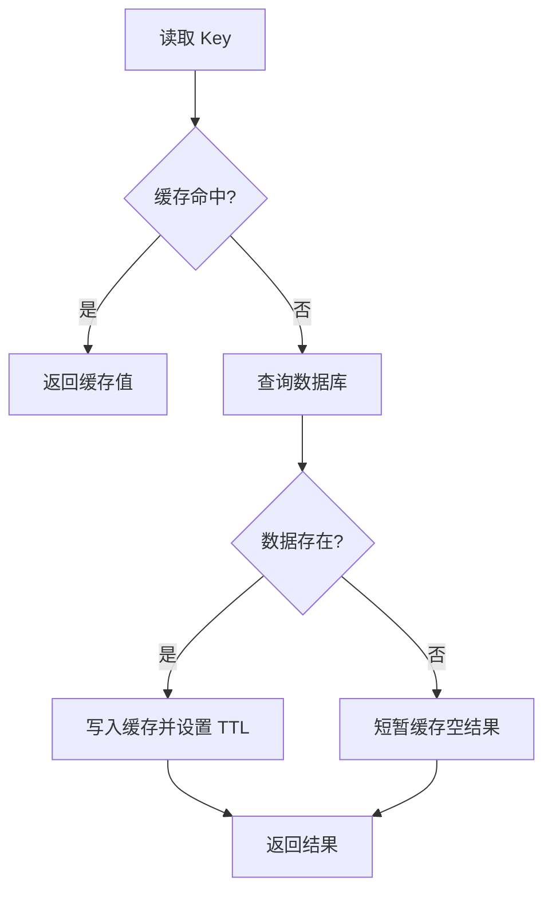
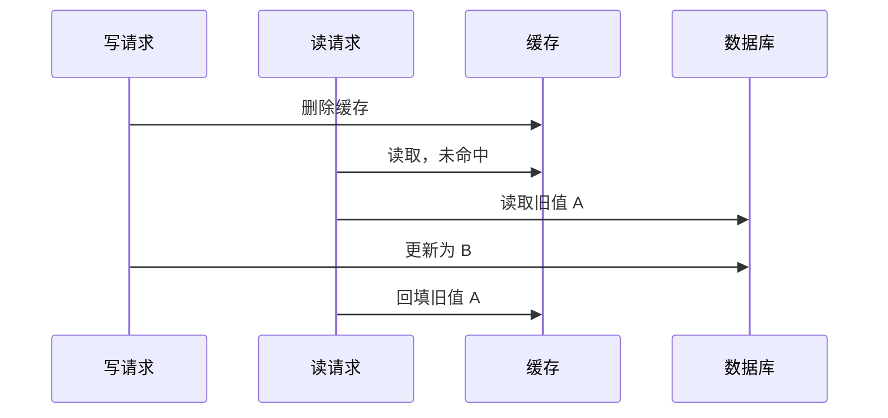

> 学习目标：理解服务端缓存的分层结构、常见读写模式、过期与淘汰机制、一致性问题和故障治理，并能针对缓存穿透、击穿、雪崩、热 Key、大 Key 等问题设计可落地的方案。

# 缓存是什么

缓存是在访问较慢、成本较高的数据源之前，增加一层访问更快的临时数据副本。

```text
没有缓存：请求 → 数据库或远程服务 → 返回结果
使用缓存：请求 → 缓存命中 → 返回结果
                  └─ 未命中 → 数据源 → 回填缓存 → 返回结果
```

服务端缓存的主要目标是：

- 降低数据库、文件系统或下游服务的访问压力。
- 缩短请求延迟。
- 提高系统可承载的吞吐量。
- 在下游短暂故障时提供有限的降级能力。

缓存用空间换时间，也用一定程度的数据新鲜度换取性能。它不是数据的唯一事实来源，除非系统明确把缓存产品当作主存储使用。

## 缓存不只是 Redis

缓存是一种架构思想。进程内的 Map、框架缓存、操作系统 Page Cache、CDN、反向代理、Redis、Memcached 都可以承担缓存角色。

Redis 常用于分布式缓存，因为它支持丰富数据结构、过期、淘汰、持久化、复制和集群，但“使用 Redis”并不等于已经解决缓存一致性、热点和故障恢复问题。

## 缓存适合的数据

更适合缓存的数据通常具有以下特点：

- 读取频繁、写入相对较少。
- 计算或获取成本高。
- 允许短时间不一致。
- 相同结果会被重复访问。
- 数据大小和访问模式可控。

不适合直接缓存的情况包括：

- 强一致性要求极高且无法接受旧值。
- 每次请求结果都不同，几乎无法复用。
- 数据体积巨大但访问频率很低。
- 包含敏感数据却没有完善的隔离、加密和权限设计。

# 缓存的基本指标

## 命中与未命中

- 缓存命中：请求的 Key 存在且有效，直接返回缓存值。
- 缓存未命中：Key 不存在、已过期或被淘汰，需要访问数据源。

命中率可以表示为：

```text
命中率 = 命中次数 / 总查询次数
```

命中率高不一定代表设计良好。如果缓存了大量低价值数据、命中请求仍很慢，或者热点集中在少数 Key，系统仍可能不健康。

## 延迟与吞吐

需要分别观察缓存命中和未命中的延迟。未命中路径包含数据源访问和回填，通常明显更慢。

吞吐量还受到网络带宽、连接数、序列化开销、单线程热点、数据结构和命令复杂度影响。

## 数据新鲜度

缓存值与事实来源之间可能存在时间差。系统应为业务定义可接受的最大陈旧时间，而不是笼统地说“最终一致”。

例如：

- 商品介绍可允许数分钟旧值。
- 库存展示可允许数秒误差，但下单扣减必须以权威数据为准。
- 账户余额通常不能只以普通缓存结果作为扣款依据。

# 缓存层次

服务端系统常采用多级缓存：


层级越靠前，通常延迟越低，但失效传播和一致性管理也更复杂。

## 客户端与 CDN 缓存

适合静态资源、公开内容和可通过 HTTP 缓存语义管理的响应。常用机制有 `Cache-Control`、`ETag` 和条件请求。

CDN 能把内容缓存到离用户更近的位置，显著减少源站压力，但不适合直接缓存未正确区分用户身份的私有响应。

## 反向代理缓存

Nginx、网关等可按 URL、请求头和查询参数缓存上游响应。它不侵入业务代码，适合内容型接口，但缓存 Key 必须覆盖会影响响应的所有维度。

## 进程内缓存

进程内缓存位于应用内存中，例如 Caffeine。优点是没有网络开销、延迟低；缺点是：

- 每个实例有独立副本，失效传播困难。
- 容量受单个进程内存限制。
- 应用重启后丢失。
- 多实例之间可能读取到不同版本。

适合小体积、高频访问、可容忍短暂不一致的数据，例如配置快照、字典和热点只读对象。

## 分布式缓存

分布式缓存由多个应用实例共享，例如 Redis。它提供更大的容量和较统一的数据视图，但增加一次网络调用，并引入缓存集群本身的可用性、扩缩容和热点问题。

## 数据库内部缓存

数据库缓冲池会缓存数据页和索引页。即使应用没有显式缓存，数据库也可能从内存返回热点数据。应用缓存的价值主要在于：

- 减少数据库连接和查询解析开销。
- 避免重复执行复杂查询或聚合。
- 将流量从数据库转移到更易扩展的缓存层。

# Key 与 Value 设计

## Key 的组成

Key 应稳定、唯一、可读并包含隔离维度：

```text
{业务}:{版本}:{租户}:{实体}:{标识}

示例：user:v2:tenant_17:profile:1001
```

推荐包含：

- 业务命名空间，防止不同应用冲突。
- Schema 或逻辑版本，便于升级。
- 租户、区域或环境等隔离维度。
- 实体类型和唯一标识。

不要把密码、Token 等敏感数据直接放入 Key，因为 Key 常出现在日志、监控和运维命令中。

## 避免不稳定 Key

如果缓存 Key 来自多个参数，必须使用稳定的顺序和编码规则。例如查询条件 Map 在不同语言中可能遍历顺序不同，应先规范化再计算摘要。

```text
错误：search:{原始 JSON 字符串}
推荐：search:v1:{规范化参数的哈希}
```

同时保留必要的业务标签用于诊断，避免所有 Key 都变成完全不可读的哈希。

## Value 的设计

Value 可以保存完整对象、部分字段、列表或计算结果。需要权衡：

- 数据大小和网络传输成本。
- 是否经常只读取其中少数字段。
- Schema 升级兼容性。
- 序列化和反序列化成本。
- 更新时是整体替换还是局部修改。

缓存对象中可附带逻辑版本、生成时间和逻辑过期时间，以支持一致性判断和异步刷新。

## Schema 演进

新旧应用版本可能同时读取同一缓存。常见策略包括：

- 在 Key 中加入版本号，例如 `user:v2:1001`。
- 使用向后兼容的序列化格式。
- 读取旧格式后转换并回填新格式。
- 发布前预热新版本缓存。

不要直接修改 Value 结构并假设所有旧缓存会同时消失。

# 过期与淘汰

## TTL

TTL（Time To Live）表示缓存项从写入开始还能存活多久。到期后它不再作为有效值使用。

TTL 的作用包括：

- 限制数据最大陈旧时间。
- 自动释放长期不访问的数据。
- 作为删除通知丢失时的一层兜底。

TTL 不应成为唯一的一致性策略。TTL 太长会长期读旧值，太短会降低命中率并增加数据源压力。

## 绝对过期与滑动过期

- 绝对过期：从写入时开始计时，到期即失效。
- 滑动过期：每次访问后续期，长期活跃的数据可以一直保留。

滑动过期适合会话等“活跃即保留”场景，但会让数据的实际生命周期更难预测。

## 物理过期与逻辑过期

物理过期由缓存系统删除或拒绝返回过期 Key。

逻辑过期则把过期时间存在 Value 中。读取到逻辑过期值时，可以由一个请求异步刷新，其他请求暂时继续使用旧值：

```text
读取缓存
├── 未逻辑过期：直接返回
└── 已逻辑过期：尝试触发异步刷新
    ├── 获得刷新权：后台重建
    └── 未获得刷新权：暂时返回旧值
```

这种方式可以保护热点数据源，但业务必须接受在刷新期间返回旧数据。

## 淘汰策略

当缓存达到内存上限时，需要淘汰部分数据。常见思想包括：

- LRU：优先淘汰最久未访问的数据。
- LFU：优先淘汰访问频率最低的数据。
- 随机淘汰。
- 只在设置了过期时间的 Key 中淘汰。
- 禁止淘汰并让写入失败。

实际产品可能使用近似 LRU/LFU，而非维护严格的全局顺序。选择策略时要明确缓存中是否混有不能被随意淘汰的数据。

## TTL 抖动

大量 Key 在同一时刻写入且设置完全相同 TTL，会同时过期并冲击数据源。可以添加随机抖动：

```text
实际 TTL = 基础 TTL + 随机值
```

随机范围要结合业务新鲜度要求，不能为了分散过期而无限延长旧数据寿命。

# 常见读写模式

## Cache-Aside

Cache-Aside（旁路缓存）是最常见的模式。应用同时管理缓存和数据库。

读取流程：



写入流程通常是：

```text
更新数据库 → 删除缓存
```

选择“先更新数据库，再删除缓存”，是因为数据库是事实来源。若先删除缓存再更新数据库，在两步之间可能有并发读把旧数据库值重新写回缓存。

即便先更新数据库再删除缓存，也不能保证绝对一致：删除失败或极端并发时仍可能出现旧值，需要消息重试、订阅变更日志或版本校验等补偿措施。

## Read-Through

Read-Through（读穿）由缓存组件在未命中时自动从数据源加载。业务只面向缓存接口：

```text
应用 → 缓存
        ├── 命中：返回
        └── 未命中：缓存加载数据源并回填
```

它能统一加载逻辑，但缓存组件需要理解数据源，框架耦合更强。

## Write-Through

Write-Through（写穿）由缓存层同步更新缓存和数据源，操作全部成功后才返回。

优点是应用逻辑简单、缓存通常较新；缺点是写延迟增加，而且缓存层必须处理双写失败和事务边界。

## Write-Behind

Write-Behind（写回）先写缓存，再异步批量写入数据源。

它能降低写延迟、合并写操作，但存在缓存故障导致数据丢失、写入顺序错乱和持久化延迟等风险。只有在允许异步持久化且有可靠日志、重放、幂等和监控时才适合使用。

## Refresh-Ahead

Refresh-Ahead（提前刷新）在缓存过期前，根据访问热度异步刷新。它能降低热点 Key 过期时的延迟尖峰，但可能刷新之后不再访问的数据，需要控制刷新条件和资源预算。

# 缓存一致性

缓存与数据库是两份数据，只要不能在同一个原子事务中更新，就存在短暂不一致的可能。

## 更新缓存还是删除缓存

写数据库后通常推荐删除缓存，而不是直接更新缓存，原因包括：

- 缓存值可能是多个表或多个字段计算后的结果。
- 并发写更新缓存时，较早开始的请求可能较晚完成，覆盖新值。
- 删除后由下一次读取基于数据库最新状态重建，逻辑更简单。

但对于必须保持热点、重建成本极高的数据，也可以通过事件驱动更新或逻辑过期异步刷新。

## 先删缓存再写数据库的问题

假设缓存原值为 A：



最终数据库是 B，缓存却长期为 A。因此旁路缓存写路径通常使用“更新数据库后删除缓存”。

## 更新数据库后删缓存的问题

这个顺序仍可能失败：数据库更新成功，但删除缓存因网络故障失败。常见补偿方案包括：

- 删除操作有限次重试，并使用退避。
- 将待删除 Key 写入可靠消息，再由消费者删除。
- 订阅数据库变更日志（CDC/Binlog）驱动失效。
- 缓存设置合理 TTL 作为最终兜底。

如果事件可能乱序，可以在缓存值或事件中携带数据版本，只允许新版本覆盖旧版本。

## 延迟双删

延迟双删的思路是在更新数据库前删除一次，更新后等待一段时间再删除一次，试图清理并发读回填的旧值。

它存在明显局限：延迟时间难以准确设置、进程崩溃会丢失第二次删除、增加删除流量，也不能给出严格一致性保证。更可靠的方式通常是数据库更新后删除，再配合可靠事件和 TTL 兜底。

## 强一致场景

如果业务无法接受任何旧值，应考虑：

- 关键判断直接读取权威存储。
- 在同一存储中完成条件更新和事务约束。
- 通过版本号校验结果是否仍有效。
- 缩小或取消该路径上的缓存。

不要为了命中率牺牲资金、库存最终扣减、权限变更等关键路径的正确性。

# 并发下的缓存问题

## 缓存穿透

缓存穿透是请求大量查询数据源中也不存在的 Key。因为不存在的数据无法正常回填，每次请求都会穿过缓存到达数据库。

常见原因包括恶意请求、参数错误和业务上反复查询已删除对象。

解决方法：

- 在入口校验参数格式和范围。
- 对不存在结果进行短时间负缓存。
- 使用布隆过滤器快速判断 Key 是否可能存在。
- 按调用方或 IP 限流。

负缓存时间通常应比正常数据短，避免数据刚创建后仍长期返回“不存在”。

## 布隆过滤器

布隆过滤器用多个哈希函数将元素映射到位数组：

- 判断“不存在”时，一定不存在。
- 判断“可能存在”时，仍可能是假阳性，需要继续查询。
- 普通布隆过滤器不擅长删除元素。

它适合在 Key 总量较大时拦截明显不存在的请求，但需要处理数据新增、重建和误判率配置。

## 缓存击穿

缓存击穿是某个热点 Key 过期时，大量并发请求同时访问数据源。

常见方案：

- 单飞（Singleflight）：同一进程内相同 Key 只允许一个加载任务。
- 互斥重建：分布式环境中只允许一个请求重建。
- 逻辑过期：先返回旧值，由一个请求异步刷新。
- 提前刷新：在热点 Key 过期前更新。

互斥等待必须设置超时，获得锁后要再次检查缓存，因为前一个请求可能已经完成回填。

## 缓存雪崩

缓存雪崩是大量 Key 同时失效或整个缓存集群不可用，流量集中落到数据源。

解决方法需要分层：

- TTL 加随机抖动，分散过期时间。
- 多级缓存和热点预热。
- 缓存集群高可用与容量冗余。
- 应用限流、熔断、降级和请求排队上限。
- 数据库连接池与查询资源隔离。
- 故障演练，确认缓存不可用时系统不会直接压垮数据库。

雪崩发生时不能简单绕过缓存把全部请求转给数据库。

## 热 Key

热 Key 是访问量远高于其他 Key 的数据。即使缓存集群总负载不高，单个分片或单个节点也可能成为瓶颈。

治理方法包括：

- 在应用进程增加短 TTL 的本地缓存。
- 将只读热点复制为多个带后缀的副本并随机读取。
- 请求合并和 Singleflight。
- 对热点接口单独限流和预热。
- 监控单 Key 访问频率并自动识别热点。

复制 Key 会增加一致性和失效成本，必须能同时删除或按版本自然失效。

## 大 Key

大 Key 可能是一个非常大的字符串，也可能是包含大量成员的集合。它会导致：

- 单次传输和序列化耗时高。
- 删除或迁移时阻塞或占用大量资源。
- 集群分片负载不均。
- 网络带宽和客户端内存突增。

治理方法包括拆分数据、限制集合规模、分页读取、异步删除，以及避免一次返回全部内容。

# 缓存重建与互斥

下面是 Cache-Aside 加单 Key 互斥的伪代码：

```text
function getUser(userId):
    key = "user:v1:" + userId
    cached = cache.get(key)
    if cached exists:
        return decode(cached)

    lock = tryLock("lock:" + key, lease = 3s)
    if lock acquired:
        try:
            cached = cache.get(key)
            if cached exists:
                return decode(cached)

            user = database.findUser(userId)
            if user does not exist:
                cache.set(key, NULL_MARKER, ttl = 30s)
                return null

            cache.set(key, encode(user), ttl = 10m + jitter)
            return user
        finally:
            unlock(lock)

    wait briefly with jitter
    retry within request deadline
```

关键点包括：

- 获得锁后进行二次检查。
- 锁和等待都必须有超时。
- 正常值和空值使用不同 TTL。
- 重试受请求总截止时间约束。
- 锁只保护缓存重建，不应包住无关的长事务。

## 分布式锁的边界

分布式锁会遇到进程暂停、网络分区、租约过期和锁服务故障。若操作正确性依赖“旧持有者绝不能再写”，仅靠租约锁并不充分，可以使用单调递增的 Fencing Token：

```text
持有者 A 获得 token 41
持有者 A 长时间暂停，租约过期
持有者 B 获得 token 42 并完成写入
持有者 A 恢复后尝试写入
下游发现 41 < 42，拒绝旧持有者写入
```

对于普通缓存重建，短租约和版本校验通常足够；对于资金或主存储写入，必须使用能被权威数据源验证的并发控制。

# 多级缓存

多级缓存常见结构是进程内 L1 加 Redis L2：

```text
读取 L1
├── 命中：返回
└── 未命中：读取 L2
    ├── 命中：回填 L1 并返回
    └── 未命中：读取数据库，回填 L2 和 L1
```

## 优势

- L1 延迟极低，并减少 Redis 的热点流量。
- L2 在应用实例间共享，容量更大。
- 某一层短暂故障时可以有限降级。

## 一致性挑战

数据库更新后，不仅要删除 L2，还要使各实例的 L1 失效。常见方法有：

- 通过消息广播失效通知。
- L1 使用很短 TTL，将不一致窗口限制在可接受范围。
- 缓存值携带版本，读取时拒绝已知旧版本。
- 对强一致读取绕过 L1。

失效消息可能重复、延迟或丢失，因此消费者应幂等，TTL 仍应作为兜底。

# Redis 作为分布式缓存

## 基本架构

生产环境通常需要考虑：

- 主从复制和故障转移。
- 集群分片与扩缩容。
- 客户端连接池、超时和重试。
- 内存上限与淘汰策略。
- 持久化是否需要，以及恢复目标。
- 跨机房访问延迟和故障域。

缓存优先追求可用性和可重建性；如果 Redis 中的数据无法从其他来源恢复，它已经不只是缓存，应按主存储的标准重新设计可靠性。

## 数据结构选择

| 数据结构 | 典型用途 | 注意事项 |
| --- | --- | --- |
| String | 对象序列化、计数器、标记 | 控制单值大小 |
| Hash | 对象字段、小型属性集合 | 超大 Hash 会成为大 Key |
| List | 简单队列、顺序列表 | 可靠消息更适合专用队列系统或更合适的 Redis 结构 |
| Set | 去重集合、共同关系 | 注意成员规模和集合运算成本 |
| Sorted Set | 排行榜、按分数排序 | 范围查询和更新具有额外计算成本 |

选择数据结构时不仅要看代码方便，还要理解命令复杂度、单 Key 大小和集群分片方式。

## Pipeline 和批量操作

Pipeline 能减少多条命令的网络往返，但不会自动让命令变成原子操作。批次过大还会造成服务端处理尖峰、响应占用大量内存。

相比逐 Key 查询，优先使用受控的批量接口，同时设置最大 Key 数、总请求大小和超时。

## Lua 与原子操作

需要“读后判断再写”的短逻辑时，可以使用缓存产品提供的原子命令、事务或服务端脚本，避免多个网络往返之间被并发修改。

脚本必须短小、可控并限制输入规模。缓存服务器执行长脚本会阻塞或拖慢其他请求。

# 故障处理与降级

缓存自身也是远程依赖，可能发生超时、断网、节点故障和全局过载。

## Fail-Open 与 Fail-Closed

- Fail-Open：缓存故障时绕过缓存访问数据源。适合数据源有足够保护且业务更重视可用性的场景。
- Fail-Closed：缓存故障时直接拒绝或返回降级结果。适合绕过缓存会压垮数据源，或缓存结果承担安全控制的场景。

选择必须按接口和业务风险决定，不能全系统使用同一个默认策略。

## 防止故障扩散

缓存不可用时应：

- 对缓存调用设置短超时和并发上限。
- 熔断持续失败的缓存节点。
- 限制回源并发，保护数据库。
- 对非核心请求返回降级数据或快速失败。
- 使用带过期时间的本地旧值作为有限兜底。
- 避免客户端无限重试。

## 缓存预热

应用发布、缓存迁移或集群清空后，冷启动会导致大量未命中。可以：

- 根据历史热点提前加载。
- 灰度放量，让流量逐步建立缓存。
- 控制回源并发。
- 对热点 Key 使用提前刷新。

预热只应加载确定会使用的数据，避免一次性填满缓存。

# 安全与隔离

## 权限边界

不要因为缓存位于内网就开放无认证访问。应使用网络隔离、身份认证、最小权限和命令限制。

## 多租户隔离

缓存 Key 必须包含租户维度，服务端不能只相信客户端传入的租户 ID。应从已认证身份推导访问范围，防止跨租户读取。

## 敏感数据

对于凭证、个人信息等敏感数据：

- 尽量不缓存不必要字段。
- 限制 TTL。
- 使用传输加密和必要的静态加密。
- 日志不记录完整 Key 或 Value。
- 明确删除和合规要求。

缓存副本也属于数据资产，不能因为“会过期”就忽略安全治理。

# 可观测性

## 应用侧指标

应按业务、接口和缓存层统计：

- 命中率、未命中率和负缓存命中率。
- 命中与未命中的延迟分位数。
- 回源请求量和回源并发。
- 缓存读取、写入、删除错误率。
- 重建次数、等待锁时间和重建失败率。
- 热 Key 和大 Key。
- 降级、熔断和限流次数。

## 缓存集群指标

需要观察：

- 内存使用量、碎片率和增长趋势。
- 淘汰数、过期数。
- 请求速率与慢命令。
- 网络流量和连接数。
- CPU 使用率和事件循环延迟。
- 复制延迟、故障转移和集群槽位状态。

只看应用命中率无法判断缓存集群是否即将达到容量上限。

## 日志与追踪

日志应记录缓存操作类型、耗时、结果和 Key 的安全摘要，避免记录完整敏感数据。分布式追踪中可把缓存访问记录为 Span，并区分命中、未命中、超时和回源。

# 容量规划

缓存容量不能只按原始数据大小计算，还要包括：

- Key 和 Value 本身。
- 对象、哈希表和指针等元数据。
- 内存分配碎片。
- 复制和故障转移所需余量。
- 数据增长和流量峰值。

粗略估算可以从以下公式开始：

```text
所需内存 ≈ Key 数量 × 单条平均实际占用 × 副本系数 × 安全系数
```

最终应使用接近生产数据分布的压测和实测校准，尤其关注大 Key、过期速率、扩容迁移时间和峰值网络带宽。

# 代码示例

## Cache-Aside 查询

下面是接近 Java 的示意代码：

```java
public User getUser(long userId) {
    String key = "user:v1:" + userId;
    String cached = redis.get(key);

    if (cached != null) {
        return cached.equals("__NULL__") ? null : deserialize(cached);
    }

    return singleFlight.execute(key, () -> {
        String secondCheck = redis.get(key);
        if (secondCheck != null) {
            return secondCheck.equals("__NULL__")
                    ? null
                    : deserialize(secondCheck);
        }

        User user = repository.findById(userId);
        if (user == null) {
            redis.setEx(key, Duration.ofSeconds(30), "__NULL__");
            return null;
        }

        Duration ttl = Duration.ofMinutes(10)
                .plusSeconds(ThreadLocalRandom.current().nextLong(60));
        redis.setEx(key, ttl, serialize(user));
        return user;
    });
}
```

这里的 `singleFlight` 只合并同一应用实例中的并发请求。若同一个 Key 会在多个实例同时形成热点，还需评估分布式互斥、逻辑过期或提前刷新。

## 数据更新与失效

```java
@Transactional
public void updateNickname(long userId, String nickname) {
    repository.updateNickname(userId, nickname);
    outboxRepository.addEvent(new CacheInvalidationEvent(
            "user:v1:" + userId));
}
```

事务提交后，由可靠的 Outbox 发布器发送失效事件，消费者幂等删除缓存。这样可避免“数据库提交成功，但进程在发送删除消息前崩溃”导致事件永久丢失。

如果业务可以接受较弱保证，也可在数据库更新成功后直接删除缓存并有限重试，但必须明确失败后的 TTL 兜底和告警。

# 测试方法

## 功能测试

- 第一次读取未命中后是否正确回填。
- 第二次读取是否命中且结果一致。
- 数据不存在时是否写入短期负缓存。
- 数据更新后缓存是否失效。
- Schema 变化时能否读取旧缓存或安全忽略。

## 并发测试

- 热点 Key 过期时回源并发是否受控。
- 多个写请求是否可能让旧版本覆盖新版本。
- 获得互斥锁后是否二次检查缓存。
- 锁超时、持有者崩溃后是否能恢复。

## 故障测试

- 缓存超时或完全不可用时，数据库是否受到保护。
- 删除事件丢失、重复和乱序时能否最终修复。
- 缓存集群故障转移期间，客户端是否出现无限重试。
- 大量 Key 同时过期时，限流和降级是否生效。
- 冷启动和集群清空后是否能平稳恢复。

## 性能测试

压测数据分布要接近真实场景，包括热点比例、Value 大小、命中率和读写比例。均匀随机访问通常无法暴露热 Key 问题。

# 常见误区

## 只要加缓存就会更快

缓存会增加序列化、网络、失效和故障处理成本。低频或本来就很快的查询，加缓存后可能更复杂且没有明显收益。

## 命中率越高越好

命中率要与内存成本、数据新鲜度和回源成本一起看。为了命中率缓存大量低价值数据，可能挤掉真正的热点数据。

## TTL 能解决所有一致性问题

TTL 只限制旧值存在的最长时间，无法满足强一致，也无法解释关键操作在不一致窗口内的正确行为。

## Redis 可用就代表缓存可用

单个热 Key、大 Key、连接池耗尽、网络拥塞和客户端重试风暴，都可能在 Redis 进程存活时让业务缓存不可用。

## 分布式锁等于绝对互斥

租约会过期，进程会暂停，网络会分区。若旧持有者恢复后仍能写入，就需要版本校验或 Fencing Token，而不是只依赖“我曾经拿到锁”。

## 缓存故障时全部回源

这可能立即压垮数据库，使缓存故障升级为全系统故障。回源必须受到并发限制，并配合熔断、降级和容量冗余。

# 设计清单

## 业务语义

- 为什么缓存，目标是降低延迟、减少成本还是保护数据源？
- 允许多长时间的旧数据？
- 缓存故障时应 Fail-Open 还是 Fail-Closed？
- 哪些关键判断必须回到权威数据源？

## 数据设计

- Key 是否包含业务、版本、环境和租户维度？
- Value 是否过大，Schema 如何演进？
- 正常数据和空结果的 TTL 分别是多少？
- 是否添加 TTL 抖动，是否需要热点预热？

## 一致性

- 数据写入后如何删除或更新缓存？
- 删除失败是否有可靠重试或变更日志补偿？
- 事件重复和乱序是否安全？
- 多级缓存的 L1 如何失效？
- TTL 是否只是兜底，而不是唯一策略？

## 并发与故障

- 如何防止穿透、击穿和雪崩？
- 热 Key 与大 Key 如何发现和治理？
- 缓存重建是否合并并发，等待是否有截止时间？
- 缓存不可用时如何保护数据库？
- 客户端重试是否有次数、退避和总预算限制？

## 运维与安全

- 是否监控命中率、P99、淘汰、内存、慢命令和回源量？
- 是否进行冷启动、故障转移和缓存清空演练？
- 是否启用认证、网络隔离和最小权限？
- Key 与日志是否避免泄露敏感数据？
- 缓存数据是否真的可以从事实来源重建？

# 总结

服务端缓存的核心不是简单地在数据库前放一个 Redis，而是围绕数据复用建立一套可控的生命周期：如何生成 Key、何时写入、何时失效、并发时谁负责重建、故障时如何保护数据源，以及如何判断缓存中的数据是否仍可使用。

设计缓存时要始终记住三点：

- 先定义数据新鲜度和故障语义，再选择 TTL 与读写模式。
- 缓存和数据库是两份数据，一致性必须通过失效、可靠事件、版本和兜底机制共同维护。
- 穿透、击穿、雪崩、热 Key 和大 Key 都是生产系统的常见问题，必须通过指标、限流、互斥、降级和演练提前治理。
